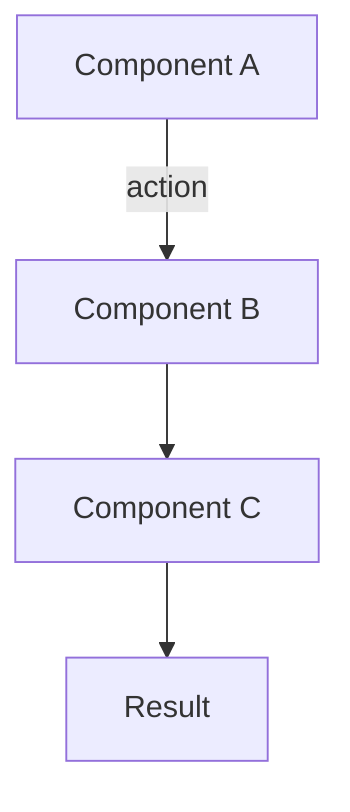

# Topic Title

> **One-sentence definition that a beginner can understand immediately.**

---

## 🧠 What Is It? (Beginner Explanation)

[Plain English explanation. Use an analogy if helpful. No jargon in this section.]

**Example analogy:** [Short analogy]

---

## 🏗️ How It Works (Technical Deep Dive)

[Step-by-step technical explanation. Be thorough.]

**Step 1:** ...
**Step 2:** ...
**Step 3:** ...

---

## 📊 Architecture / Flow Diagram



---

## ⚙️ Technical Details

[Specifications, configuration examples, protocol details.]

```language
# Example configuration or code
```

| Property | Value | Description |
|----------|-------|-------------|
| Example  | ...   | ...         |

---

## 🔴 Attack Surface

[How attackers abuse this. What can go wrong.]

**Vulnerable scenario:**
```language
# Vulnerable code or config
```

---

## 💥 Exploitation (Step-by-Step)

**Prerequisites:** [What attacker needs]

**Step 1:** [Action]
```bash
# Command
```

**Step 2:** [Action]
```bash
# Command
```

**Payload examples:**
```language
# Payloads
```

---

## 🛠️ Tools & Commands

| Tool | Purpose | Command |
|------|---------|---------|
| tool1 | description | `command --flags` |

```bash
# Full example command
tool --option value --flag
```

---

## 🔍 Detection

[How defenders detect this attack.]

**Indicators:**
- IOC 1
- IOC 2

**Log signatures:**
```
[log pattern]
```

---

## 🛡️ Mitigation & Defense

**Secure code example:**
```language
// Secure implementation
```

**Configuration:**
```
# Secure config
```

**Checklist:**
- [ ] Fix 1
- [ ] Fix 2

---

## 📚 References

- [OWASP - Topic](https://owasp.org/...)
- [PortSwigger - Topic](https://portswigger.net/web-security/...)
- [CVE-XXXX-XXXXX](https://nvd.nist.gov/vuln/detail/CVE-XXXX-XXXXX)
