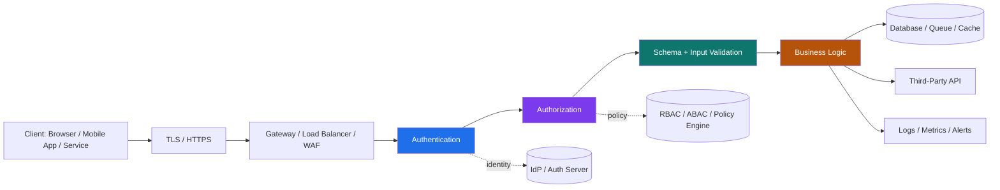
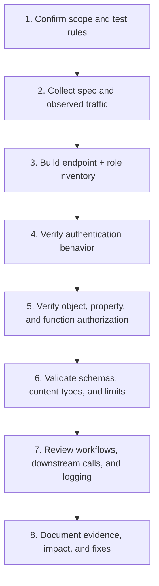

# API Security Basics

> **API security is the discipline of protecting the interfaces that let applications, mobile clients, services, partners, and automations exchange data and trigger business actions. For defenders and authorized testers, it means verifying not just “is there a login?” but “who can call what, on which object, under which conditions, and with what downstream impact?”**

> **Authorized use only:** everything in this note is for approved lab work, internal assessments, or engagements with explicit written permission.

---

## 🧠 What Is API Security? (Beginner Explanation)

An API is the part of an application that speaks in **structured requests and responses** instead of web pages. A browser may show a dashboard, but the API behind it returns the raw JSON, performs the account update, creates the order, or triggers the refund.

That is why API security matters so much:

- **APIs expose raw data directly** — often more than the UI shows
- **APIs expose actions directly** — create, update, delete, approve, export, invite, refund
- **APIs are built for automation** — which means mistakes can be abused at scale
- **APIs are everywhere** — web apps, mobile apps, SPAs, partner integrations, microservices, webhooks, third-party platforms
- **APIs often trust other systems** — not just human users

### Simple mental model

Think of a normal web page as the **front desk** and the API as the **back-office phone line**. If the front desk hides a button, that does **not** mean the phone line cannot still perform the action. Security must be enforced at the API itself.

---

## 🎯 Security Goals of an API

A secure API is not just “password protected.” It should preserve several properties at the same time.

| Goal | What it means | Example question for an authorized tester |
|---|---|---|
| **Confidentiality** | Data is only visible to allowed users/services | Can one user view another tenant's records? |
| **Integrity** | Data and actions cannot be modified improperly | Can a low-privilege user change protected fields? |
| **Availability** | The API stays responsive under legitimate use and abuse pressure | Are there sensible rate, size, and concurrency limits? |
| **Authenticity** | The server knows who or what is calling it | Is the token, client certificate, or signature actually verified? |
| **Authorization** | The caller can only do permitted actions | Can a user invoke an admin-only function? |
| **Accountability** | Important actions are logged and attributable | Can defenders trace who exported sensitive data and when? |
| **Inventory / Governance** | Teams know which versions and endpoints exist | Are deprecated or shadow endpoints still reachable? |

---

## 🏗️ The Core API Security Mental Model

API security is easiest to understand as a pipeline of checks.



If any one of those layers is weak, the API can fail even if the others are strong.

### The key lesson

A valid token does **not** mean a valid action.

The server still must verify:

1. **Who is calling?** → authentication  
2. **What are they allowed to do?** → authorization  
3. **Is this request structurally valid?** → schema and content validation  
4. **Is this action valid in the workflow?** → business logic and state validation  
5. **Can the platform withstand this safely?** → rate, size, and resource controls

---

## 🔑 Authentication vs Authorization vs Validation

These are often confused, and API bugs frequently appear exactly at the boundaries.

| Control | Core question | Example | Common failure |
|---|---|---|---|
| **Authentication** | Who are you? | `Authorization: Bearer ...` identifies a user or service | Missing token checks, weak token handling, broken session lifecycle |
| **Authorization** | What can you do? | User can read only their own invoices | Server trusts a client-supplied object ID or role hint |
| **Validation** | Is the request well-formed and acceptable? | `quantity` must be an integer 1–100 | Overly permissive parsers, extra fields accepted silently |
| **Workflow enforcement** | Is this action allowed *right now*? | Refund only after payment capture | Backend trusts the frontend’s sequence |
| **Resource protection** | Can this request be handled safely at scale? | Large exports require limits and async processing | No pagination, no rate limits, unbounded file upload |

### Three authorization layers every defender should think about

| Layer | Meaning | Example failure |
|---|---|---|
| **Object-level** | Can the caller access this specific record/object? | User A reads User B’s order |
| **Property-level** | Can the caller read or change this field? | A normal user sets `isAdmin=true` or sees `internalNotes` |
| **Function-level** | Can the caller invoke this endpoint/action at all? | Support user reaches an admin export endpoint |

This distinction maps closely to the OWASP API Security Top 10, especially **API1 (BOLA)**, **API3 (property-level authorization)**, and **API5 (function-level authorization)**.

---

## 🌐 Request and Response Anatomy

Even beginner API security work improves dramatically once you can read a raw request and response cleanly.

```http
POST /v1/transfers HTTP/1.1
Host: api.example.com
Authorization: Bearer <redacted>
Content-Type: application/json
Accept: application/json
Idempotency-Key: 3c4e7c55-9be8-4c35-b86d-2dd6f0b03b8a

{
  "sourceAccount": "acc_test_001",
  "destinationAccount": "acc_test_002",
  "amount": 1250,
  "currency": "USD"
}
```

```http
HTTP/1.1 201 Created
Content-Type: application/json
Cache-Control: no-store
X-Request-Id: req_8df1c41

{
  "transferId": "tr_10001",
  "status": "pending_review"
}
```

### What to look at in every request

| Part | Why it matters for security |
|---|---|
| **Method** | Tells you whether the action should be read-only, mutating, idempotent, etc. |
| **Path** | Often carries versioning, object IDs, admin routes, partner routes |
| **Headers** | Auth, content type, trace IDs, tenant selectors, signatures, rate-limit metadata |
| **Query parameters** | Filters, pagination, export flags, dangerous toggles like `include=all` |
| **Body** | User-controlled fields, nested objects, hidden properties, bulk actions |
| **Status code** | Reveals auth decisions, validation behavior, method restrictions, throttling |
| **Response body** | Excessive data exposure, internal identifiers, stack traces, policy clues |

---

## 📘 HTTP Semantics That Matter in API Security

HTTP is a **stateless application protocol**. That matters because each request must carry enough context for the server to evaluate it correctly.

### Method safety and idempotency

| Method | Typical use | Safe? | Usually idempotent? | Security relevance |
|---|---|---:|---:|---|
| `GET` | Read data | ✅ | ✅ | Should not trigger hidden state changes |
| `HEAD` | Read headers only | ✅ | ✅ | Often forgotten in policy testing |
| `OPTIONS` | Discover allowed methods / CORS preflight | ✅ | ✅ | Misconfigurations here often expose capability clues |
| `POST` | Create or trigger action | ❌ | ❌ | Common source of business logic bugs |
| `PUT` | Replace a resource | ❌ | ✅ | Useful for spotting full-object replacement risk |
| `PATCH` | Partial update | ❌ | Varies | High-value for property-level authorization testing |
| `DELETE` | Delete a resource | ❌ | ✅ | Must still enforce strong authorization |

### Status code signals defenders should interpret correctly

| Code | Meaning | Security note |
|---|---|---|
| `200` | Success | Confirm what data actually came back |
| `201` | Created | Creation endpoints should return safe metadata only |
| `204` | Success, no body | Common for delete/update actions |
| `400` | Bad request | Can leak schema expectations |
| `401` | Not authenticated | Usually means missing/invalid credentials |
| `403` | Authenticated but forbidden | Important authorization signal |
| `404` | Not found | Sometimes intentionally used to hide resource existence |
| `405` | Method not allowed | Useful for capability mapping |
| `409` | Conflict | Helpful in workflow and state validation |
| `413` | Content too large | Good sign that size controls exist |
| `415` | Unsupported media type | Indicates content-type enforcement |
| `422` | Validation failed | Often reveals model constraints |
| `429` | Too many requests | Expected when rate limiting is implemented |
| `500` | Server error | Should not expose stack traces or secrets |

A mature API should be **consistent**. Inconsistency across versions, routes, or services often reveals security drift.

---

## 📄 Why the API Specification Matters

A good API specification is not just documentation — it is a **machine-readable contract**.

According to the OpenAPI Specification, an API description should let humans and tools understand the service **without source code access or packet inspection**. For defenders and authorized testers, that makes the spec one of the highest-value starting points.

### What an API spec can tell you

| Spec element | What it reveals | Security questions to ask |
|---|---|---|
| `servers` | Base URLs, environments, versioning | Are test, beta, old, or partner hosts still exposed? |
| `paths` | Reachable endpoints | Are all documented paths actually protected? |
| `parameters` | Path/query/header/cookie inputs | Are types, ranges, and enum values enforced? |
| `requestBody` | Accepted content types and object shape | Are extra fields rejected or silently accepted? |
| `responses` | Expected outcomes | Do runtime responses match the contract? |
| `securitySchemes` | API key, bearer, OAuth2, mTLS, etc. | Is the implementation as strong as the contract implies? |
| `deprecated` / version markers | Old behavior still supported | Are retired endpoints still live? |
| examples / schemas | Object names, field names, enums | Which objects and states deserve extra authorization review? |

### Minimal OpenAPI example

```yaml
openapi: 3.1.0
info:
  title: Example Payments API
  version: 1.0.0
servers:
  - url: https://api.example.com/v1
paths:
  /users/{userId}/transfers:
    get:
      summary: List a user's transfers
      security:
        - bearerAuth: []
      parameters:
        - in: path
          name: userId
          required: true
          schema:
            type: string
        - in: query
          name: limit
          schema:
            type: integer
            minimum: 1
            maximum: 100
      responses:
        '200':
          description: Transfer list
        '401':
          description: Authentication required
        '403':
          description: Forbidden
components:
  securitySchemes:
    bearerAuth:
      type: http
      scheme: bearer
      bearerFormat: JWT
```

### How to read that snippet like a security reviewer

- `security: bearerAuth` → authentication is expected
- `/users/{userId}/transfers` → object-level authorization probably matters
- `limit` has bounds → runtime behavior should enforce them
- `401` and `403` are documented separately → the API should distinguish auth failure from authorization failure
- JWT bearer tokens are expected → claim validation, audience, issuer, expiry, revocation, and scope all matter

### The most important spec lesson

**The spec tells you what should exist. Traffic tells you what actually exists.**

Gaps between the two often reveal:

- undocumented endpoints
- deprecated-but-live versions
- missing authentication on “internal” routes
- hidden debug flags
- extra response fields not declared in the schema
- request fields accepted by the backend but absent from documentation

---

## 🔐 Common API Authentication Models

| Mechanism | Typical use | Strengths | Main cautions |
|---|---|---|---|
| **Session cookie** | Browser-backed web app APIs | Mature browser support | CSRF, cookie scope, session fixation, logout/session lifecycle |
| **API key** | Service identification, quotas, partner access | Simple and operationally easy | Not enough by itself for sensitive user actions; keys are easy to leak |
| **Bearer token** | OAuth2 / token-based APIs | Good for delegated access and scopes | Whoever holds the token can often use it; transport/storage protection matters |
| **JWT** | Self-contained access tokens | Fast local verification, portable claims | Claims, audience, expiry, key handling, revocation, and algorithm handling matter |
| **mTLS** | High-trust service-to-service APIs | Strong client identity | Operationally complex; still needs authorization |
| **HMAC-signed request** | Webhooks, API clients, financial integrations | Verifies message integrity and origin knowledge | Replay protection, canonicalization, and clock handling are critical |

### Important practical principle

Per the OAuth 2.0 Bearer Token spec, **any party in possession of a bearer token can use it** unless the system adds sender constraints. So bearer tokens must be protected in storage and in transit.

That is why mature API programs increasingly care about:

- short-lived access tokens
- refresh token hygiene
- sender-constrained tokens / proof-of-possession approaches
- audience scoping
- service identity for east-west traffic

---

## 🧱 Core Security Controls Every API Should Have

| Control area | What good looks like | Common weakness |
|---|---|---|
| **Transport security** | HTTPS everywhere, validated certificates, secure TLS config | Mixed HTTP/HTTPS, weak trust assumptions, proxy confusion |
| **Authentication** | Centralized identity, strong token validation, expiration, revocation | Accepting expired/malformed tokens, weak key management |
| **Object authorization** | Server checks ownership/access per object | Trusting user-controlled object IDs |
| **Property authorization** | Field-level read/write rules | Returning or updating sensitive fields unintentionally |
| **Function authorization** | Admin/support/internal routes protected independently | “Hidden in UI” treated as “secure” |
| **Input/schema validation** | Strong typing, bounds, enums, content-type enforcement | Silent coercion, accepting unknown fields, parser ambiguity |
| **Resource controls** | Rate limits, pagination, upload limits, async jobs for expensive work | Unbounded search, export, upload, or fan-out requests |
| **Error handling** | Clear but minimal messages, no secrets or stack traces | Verbose errors leaking internals |
| **Observability** | Request IDs, audit logs, auth failures, anomaly alerts | No attribution or weak telemetry |
| **Inventory/versioning** | Documented endpoints, retired versions removed, spec kept current | Shadow APIs, abandoned beta routes |
| **Third-party trust** | Validate upstream data and webhook origin | Blind trust of partner or downstream API responses |

---

## 🧩 API Styles and What Changes Security-Wise

API security basics stay the same across protocols, but the review emphasis changes.

| API style | Main mental model | Security focus |
|---|---|---|
| **REST** | Resources + HTTP methods | Object auth, methods, status codes, schemas, pagination |
| **GraphQL** | Single endpoint + typed schema | Resolver authorization, nested exposure, batching/complexity limits |
| **gRPC** | RPC over HTTP/2 + protobuf | Service identity, metadata auth, method-level policy, contract drift |
| **SOAP** | XML-based operations | Parser hardening, WS-* complexity, schema enforcement |
| **Webhooks** | Server-to-server event delivery | Signature verification, replay protection, secret rotation, inbound trust |

For beginners: learn the shared fundamentals first. For advanced work: understand how each protocol expresses identity, authorization, schemas, and trust boundaries differently.

---

## 🧪 Practical Authorized API Security Workflow

This is the safe, repeatable mindset for a professional assessment.



### 1. Confirm scope and guardrails first

Before touching anything, know:

- which hosts, tenants, and environments are in scope
- whether production testing is allowed
- whether test accounts and seed data exist
- rate/concurrency limits agreed with the owner
- any forbidden actions such as destructive operations or mass exports

### 2. Start with the contract, not guesswork

Collect:

- OpenAPI/Swagger docs
- Postman collections
- GraphQL schema / SDL where applicable
- gRPC `.proto` files where available
- observed client traffic from browser/mobile/service integrations

### 3. Build a role matrix

Use approved test identities. A simple table like this quickly surfaces missing controls.

| Endpoint / Action | Anonymous | User | Support | Admin | Expected result |
|---|---:|---:|---:|---:|---|
| `GET /v1/profile` | ❌ | ✅ | ✅ | ✅ | Own profile only |
| `GET /v1/users/{id}` | ❌ | Limited | Limited | ✅ | Depends on role and tenant |
| `PATCH /v1/users/{id}` | ❌ | Own safe fields only | Limited | ✅ | Protected fields blocked |
| `POST /v1/admin/export` | ❌ | ❌ | Maybe | ✅ | Strong function-level control |

### 4. Compare documentation to runtime behavior

Safe examples for observation during an authorized assessment:

```bash
# Inspect documented headers and methods
curl -i -X OPTIONS https://api.example.com/v1/profile

# Observe response headers and status behavior with an approved test token
curl -i https://api.example.com/v1/profile \
  -H "Authorization: Bearer <approved-test-token>"

# Inspect shape only; do not use real customer data in notes or tooling
curl -s https://api.example.com/v1/profile \
  -H "Authorization: Bearer <approved-test-token>" | jq .
```

Look for:

- extra fields not in the spec
- undocumented parameters accepted by the backend
- missing `401`/`403` distinctions
- inconsistent validation between versions or services
- old endpoints that still work despite deprecation

### 5. Verify authorization at all three layers

In a safe test environment or with approved test accounts, verify:

- object ownership rules
- field-level update/read restrictions
- admin/support/internal function boundaries
- tenant isolation and organization scoping
- workflow/state transitions, not just endpoint access

### 6. Review platform protections

Check whether the API enforces:

- pagination caps
- sane upload limits
- request timeouts
- rate limiting / throttling
- idempotency for retried payment-like operations
- audit logging for sensitive actions

---

## 🧠 Beginner-to-Advanced Security Progression

A lot of people begin with the wrong question:

> “Does this endpoint require a token?”

That is only the start.

### Beginner mindset

- Is HTTPS used?
- Does the endpoint require authentication?
- Are obvious sensitive endpoints exposed?
- Do methods and status codes look sensible?

### Intermediate mindset

- Is authorization enforced per object and per role?
- Does the schema reject unexpected fields and content types?
- Are errors, pagination, and rate limits handled consistently?
- Are deprecated versions still exposed?

### Advanced mindset

- Does the business workflow enforce state transitions server-side?
- Are property-level rules enforced differently by create/update/export paths?
- Do downstream APIs, webhooks, and async workers preserve security guarantees?
- Is service-to-service trust bounded, observable, and revocable?
- Does the implementation match the documented contract across environments?

The deeper you go, the more API security becomes **distributed systems security** rather than just “endpoint security.”

---

## 🚩 Common API Security Anti-Patterns

| Anti-pattern | Why it is risky | Safer design |
|---|---|---|
| Token in query string | Leaks into logs, history, and referrers | Use `Authorization` header |
| “The UI hides it, so it’s safe” | Attackers and testers can call APIs directly | Enforce policy server-side |
| One broad token for everything | Too much blast radius | Narrow scopes, audience, expiry, and role separation |
| Trusting object IDs from the client | Enables object-level auth failures | Derive access from authenticated context + server checks |
| Accepting extra JSON fields silently | Enables property abuse and contract drift | Reject unknown or protected fields |
| No distinction between user, support, admin, service identities | Privilege boundaries blur | Separate roles, scopes, and service principals clearly |
| Unlimited list/export endpoints | Easy data overexposure and resource abuse | Pagination, caps, async exports, audit trails |
| Old API versions left alive indefinitely | Legacy behavior becomes a permanent attack surface | Inventory, deprecation, retirement plans |
| Verbose errors in production | Leaks internal structure | Minimal external detail, rich internal logs |
| Blind trust of third-party APIs/webhooks | Shifts risk upstream into your system | Verify signatures, validate schemas, constrain downstream trust |

---

## 🛡️ Defensive Checklist for Builders and Reviewers

Use this as a baseline checklist for design review, code review, or an authorized assessment.

### Identity and transport

- [ ] HTTPS only
- [ ] Strong token/session validation
- [ ] Expiry, rotation, and revocation strategy exists
- [ ] Service identities are distinct from human identities
- [ ] Sensitive operations use stronger assurance where needed

### Authorization

- [ ] Object-level checks enforced server-side
- [ ] Property-level read/write restrictions documented and tested
- [ ] Function-level separation for admin/support/internal actions
- [ ] Tenant boundaries enforced consistently
- [ ] Frontend decisions are never trusted as policy

### Input, schema, and workflow

- [ ] Content types are explicitly constrained
- [ ] Unknown fields are rejected or ignored safely by design
- [ ] Types, ranges, enums, and lengths are validated
- [ ] Workflow/state transitions are enforced server-side
- [ ] Expensive operations require limits or asynchronous handling

### Operations and governance

- [ ] Rate limits and request size limits are defined
- [ ] Audit logs exist for sensitive actions
- [ ] Request IDs support incident tracing
- [ ] API inventory is current
- [ ] Deprecated versions and shadow endpoints are removed
- [ ] Third-party integrations are treated as untrusted inputs

---

## 🔭 A Good API Security Question Set

When you read any endpoint, ask these in order:

1. **Who can call it?**
2. **Which object(s) can they touch?**
3. **Which fields can they read or write?**
4. **Which workflow state must exist first?**
5. **How much data/work can one request trigger?**
6. **What logs, alerts, and traceability exist if something goes wrong?**
7. **Does the live behavior match the spec and intended business rules?**

If you consistently ask those seven questions, you will catch most foundational API security issues early.

---

## 📚 Standards and References Worth Knowing

These are especially useful for building a solid beginner-to-advanced foundation:

- **[OWASP API Security Top 10 (2023)](https://owasp.org/API-Security/editions/2023/en/0x11-t10/)** — the most important modern API risk taxonomy
- **[OWASP REST Security Cheat Sheet](https://cheatsheetseries.owasp.org/cheatsheets/REST_Security_Cheat_Sheet.html)** — practical defensive guidance on HTTPS, access control, JWTs, methods, validation, and workflow enforcement
- **[RFC 9110: HTTP Semantics](https://www.rfc-editor.org/rfc/rfc9110.html)** — the baseline for understanding methods, status codes, headers, and stateless behavior
- **[OpenAPI Specification](https://spec.openapis.org/oas/latest.html)** — how modern HTTP APIs are described as machine-readable contracts
- **[RFC 6750: OAuth 2.0 Bearer Token Usage](https://www.rfc-editor.org/rfc/rfc6750.html)** — why bearer tokens must be protected in transit and storage
- **[RFC 7519: JSON Web Token (JWT)](https://www.rfc-editor.org/rfc/rfc7519.html)** — how JWT claims are structured and what validation concepts matter

---

## 🧾 Final Takeaway

**API security basics are not basic at all once you leave the UI and examine the real contract.**

At a beginner level, learn requests, responses, methods, status codes, auth, and specs.  
At an advanced level, think in terms of **identity, object access, field access, workflow integrity, resource consumption, version drift, and downstream trust**.

That is the mindset that turns API testing from random poking into a disciplined, defensive, and professional security review.
