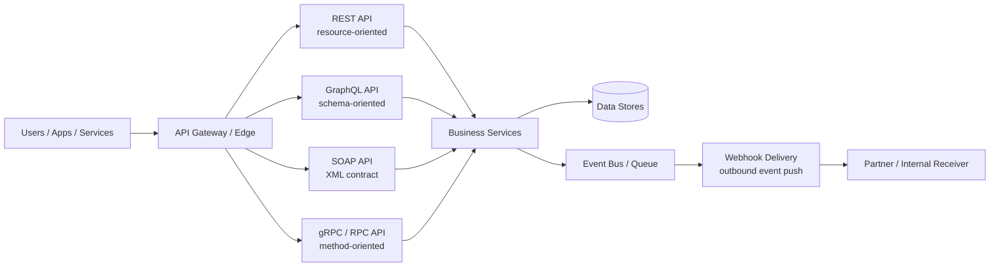
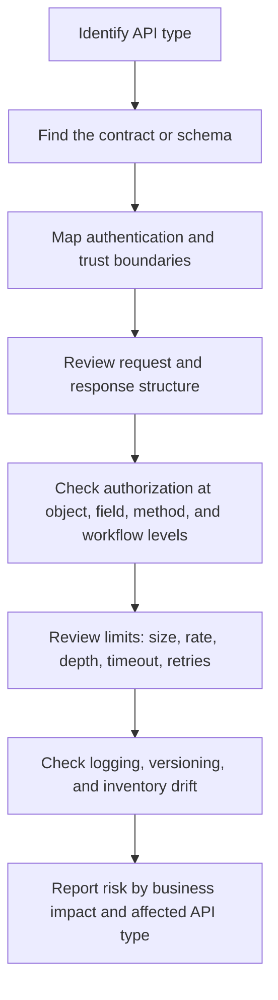

# API Types for Security Testers

> **Module:** API Pentesting → API Fundamentals  
> **Difficulty:** Beginner → Advanced  
> **Focus:** Understand the major API styles, where they appear, and how to assess them safely during **authorized** security testing.

---

## 1. Overview

An **API type** describes **how clients and services communicate**.

That sounds simple, but in practice people mix together several different ideas:

- **Interface style**: REST, GraphQL, SOAP, RPC/gRPC
- **Exposure model**: public, partner, internal, private
- **Communication pattern**: synchronous request/response vs asynchronous event delivery
- **Data format**: JSON, XML, Protocol Buffers, form data, binary frames

A useful beginner mental model is:

> **An API is a contract for asking a system to do something or return something.**  
> The API type changes **how the request is expressed**, **how the contract is described**, and **which security controls matter most**.

### Quick analogy

Think of API types as different ways to place an order:

- **REST**: choose a resource from a menu and use standard actions
- **GraphQL**: describe exactly which fields you want returned
- **SOAP**: submit a structured form with strict XML rules
- **RPC/gRPC**: call a named function or method directly
- **Webhooks**: instead of you asking repeatedly, the service pushes an event to you

### Practical taxonomy

| Dimension | Common options | What the tester should care about |
| --- | --- | --- |
| Interface style | REST, GraphQL, SOAP, RPC/gRPC, webhooks | Discovery model, parser behavior, auth patterns, tooling |
| Exposure model | Public, partner, internal, private | Abuse resistance, trust boundaries, inventory accuracy |
| Timing model | Synchronous, asynchronous, streaming | Timeouts, replay, queue handling, observability |
| State model | Mostly stateless, partially stateful, session-backed | Token handling, server-side sessions, idempotency |
| Data model | JSON, XML, Protobuf, mixed formats | Validation, serialization, parser limits, logging visibility |

---

## 2. Why It Matters

API security testing is not just about finding endpoints. It is about understanding **what kind of interface you are looking at**.

That matters because different API types expose different risks:

- **REST** often exposes many endpoints and objects, so object-level and function-level authorization problems stand out.
- **GraphQL** centralizes access behind one endpoint, so schema design, resolver authorization, and query complexity matter more.
- **SOAP** inherits XML-specific concerns like parser configuration, schema handling, and message-level security complexity.
- **RPC/gRPC** often lives inside service-to-service environments, where reflection, metadata handling, and trust assumptions become important.
- **Webhooks** reverse the flow of communication, so signature verification, replay protection, and idempotency become critical.

Modern applications often expose **multiple API types at once**:

- a mobile app talks to a REST API,
- an internal platform uses gRPC,
- a partner integration uses SOAP,
- an admin dashboard queries GraphQL,
- third-party services send webhook events.

That is why API pentesting starts with **API identification and classification**, not just brute-force endpoint discovery.

### Diagram — the same business system can expose many API types

### Why attackers and defenders both care

From a defensive testing perspective, APIs are attractive targets because they offer:

- **consistency**: predictable paths, methods, and message formats
- **automation**: easy interaction by scripts, apps, bots, and agents
- **data density**: one call can return a lot of useful business data
- **business logic access**: APIs often expose the exact workflows that matter most

An authorized tester should therefore ask:

> Is this API type exposing only data, or is it exposing **decision-making power** inside the application?

---

## 3. How It Appears in Real APIs

### 3.1 Exposure models

| Exposure model | Who uses it | Typical examples | Security meaning |
| --- | --- | --- | --- |
| **Public API** | External developers or customers | Payment APIs, SaaS integrations | Strong auth, throttling, documentation hygiene, abuse monitoring |
| **Partner API** | Specific business partners | Logistics, banking, B2B sync | Contract drift, certificate/API key lifecycle, narrow allowlists |
| **Internal API** | Internal services and teams | Microservice calls, service mesh traffic | “Internal = trusted” assumptions often create risk |
| **Private API** | One product team or app family | Mobile backend, admin backend | Still testable and still sensitive, even if undocumented |

### 3.2 Communication patterns

| Pattern | What it means | Common types | Security themes |
| --- | --- | --- | --- |
| **Synchronous** | Client sends request and waits for response | REST, SOAP, GraphQL, unary gRPC | Auth, authz, input validation, response filtering |
| **Asynchronous** | One system emits an event and another handles it later | Webhooks, queues, event APIs | Signature validation, replay handling, duplicate processing |
| **Streaming** | One or both sides keep an open stream | gRPC streaming, WebSockets, event feeds | Connection lifecycle, message limits, backpressure, logging gaps |

### 3.3 Major API interface types

| Type | Core idea | Typical transport / format | Common discovery clues | Primary testing focus |
| --- | --- | --- | --- | --- |
| **REST** | Resources manipulated with standard HTTP verbs | HTTP + JSON/XML | `/api/`, versioned paths, OpenAPI/Swagger | Object access, function access, method handling, parameter validation |
| **SOAP** | XML message exchange using a strict service contract | HTTP + XML/WSDL | `?wsdl`, `.asmx`, enterprise middleware | XML parser safety, fault handling, auth consistency, legacy exposure |
| **GraphQL** | Client asks for exactly the fields it wants from one schema | HTTP + JSON | `/graphql`, playgrounds, schema docs | Resolver authz, introspection posture, query depth/complexity, field exposure |
| **RPC / gRPC** | Client calls named methods directly | HTTP/2 + Protobuf | reflection, `.proto`, gateway translation | Method inventory, metadata auth, reflection exposure, internal trust boundaries |
| **Webhooks** | Service pushes events to a receiver | HTTP + signed event payloads | delivery docs, callback URLs, event subscriptions | Signature verification, replay defense, idempotency, source validation |

### 3.4 Legitimate request shapes at a glance

| Type | Example shape |
| --- | --- |
| REST | `GET /api/v1/users/42` |
| SOAP | `<GetUser><UserId>42</UserId></GetUser>` inside a SOAP envelope |
| GraphQL | `query { user(id: "42") { id email } }` |
| RPC/gRPC | `UserService/GetUser(UserId=42)` |
| Webhook | `POST /hooks/provider` with an event payload and signature header |

---

## 4. Type-by-Type Security Understanding

### 4.1 REST APIs

**What it is:**
REST is a resource-oriented style that usually maps URLs to objects and uses standard HTTP methods such as `GET`, `POST`, `PUT`, `PATCH`, and `DELETE`.

**Beginner mental model:**
A REST API usually feels like a structured tree of business objects:

- `/users/42`
- `/orders/5001`
- `/projects/77/members`

**Why it matters to security:**
REST often makes business objects easy to find and easy to automate against. That is why it frequently exposes:

- broken object-level authorization,
- broken function-level authorization,
- excessive data exposure,
- version drift across `/v1`, `/v2`, `/beta`, or mobile-only paths.

**Authorized testing focus:**

- Is access control enforced consistently on every resource?
- Do different HTTP methods behave differently on the same path?
- Are old versions still reachable?
- Are hidden parameters accepted even if undocumented?
- Does the API return more data than the client actually needs?

---

### 4.2 SOAP APIs

**What it is:**
SOAP is a message-based protocol family built around XML envelopes, formal service definitions, and enterprise-style contracts such as WSDL.

**Beginner mental model:**
SOAP is less “browseable” than REST, but more rigid. Instead of thinking in simple URL resources, think in **operations** described by a formal contract.

**Why it matters to security:**
SOAP frequently appears in older enterprise systems, middleware, finance, telecom, and legacy partner integrations. Those environments often carry:

- legacy authentication assumptions,
- verbose error messages,
- complex XML parsing behavior,
- inconsistent modernization around gateways and monitoring.

**Authorized testing focus:**

- Are WSDL files exposed publicly or unnecessarily?
- Are XML parsers hardened against unsafe entity handling?
- Are fault messages leaking internal details?
- Is authentication enforced equally across all operations?
- Are message-level security controls actually verified, or just present on paper?

---

### 4.3 GraphQL APIs

**What it is:**
GraphQL exposes a schema of types and lets the client request only the fields it wants, usually through a single endpoint.

**Beginner mental model:**
Instead of visiting many REST paths, the client asks one question in a structured language and the server resolves the answer from many places.

**Why it matters to security:**
GraphQL shifts risk away from “how many endpoints exist?” toward “what can this schema and its resolvers really do?” Common concerns include:

- schema overexposure,
- field-level authorization mistakes,
- mutation abuse,
- depth/complexity issues,
- batch and alias behavior,
- inconsistent resolver trust boundaries.

**Authorized testing focus:**

- Is introspection available where it should not be?
- Are sensitive fields protected even when nested deeply?
- Are resolver-level authorization checks consistent?
- Are depth, complexity, timeout, and pagination controls present?
- Does one endpoint hide many admin and internal capabilities?

---

### 4.4 RPC and gRPC APIs

**What it is:**
RPC means “remote procedure call” — the client invokes a named function on a remote service. gRPC is a popular modern RPC framework that typically uses HTTP/2 and Protocol Buffers.

**Beginner mental model:**
Instead of thinking “resource and verb,” think “method and message.”

- REST style: `/users/42`
- RPC style: `GetUser(user_id=42)`

**Why it matters to security:**
RPC interfaces are common in microservices and internal service communication. That makes them easy to under-test, especially when teams assume internal traffic is safe.

Key concerns include:

- reflection or schema exposure,
- method-level authorization,
- metadata handling,
- gateway bypass paths,
- size, timeout, and streaming controls,
- trust inherited from internal identity systems.

**Authorized testing focus:**

- Is reflection enabled and appropriate for the environment?
- Are all methods behind the same auth rules?
- Is metadata trusted without verification?
- Can internal-only methods be reached through exposed gateways or gRPC-Web bridges?
- Are message size and stream duration limits enforced?

---

### 4.5 Webhooks

**What it is:**
A webhook is not a read/query API. It is an **event delivery mechanism** where one system sends a message to another system when something happens.

**Beginner mental model:**
REST says, “Ask me for updates.”  
A webhook says, “I will notify you when an update happens.”

**Why it matters to security:**
Webhooks change the trust model:

- the receiver must verify the sender,
- duplicate deliveries are normal,
- replay and ordering issues matter,
- business processes can be triggered asynchronously.

**Authorized testing focus:**

- Are webhook payloads signed and verified?
- Is replay protection implemented?
- Is the receiver idempotent?
- Are callback destinations tightly controlled?
- Are failed deliveries, retries, and dead-letter handling observable?

---

## 5. How an Authorized Tester Validates API Types

Only test APIs you own or are explicitly authorized to assess. For live systems, prefer staging, test tenants, lab targets, or narrowly scoped production checks approved in the rules of engagement.

### 5.1 Safe validation workflow

### 5.2 Validation checklist by API type

| API type | What to validate safely during an authorized test |
| --- | --- |
| **REST** | Resource inventory, method handling, version consistency, server-side authz, response minimization, OpenAPI accuracy |
| **SOAP** | WSDL exposure, XML parser hardening, schema enforcement, fault verbosity, operation-level authz, legacy endpoint inventory |
| **GraphQL** | Schema exposure, resolver authz, field-level access control, query depth/complexity controls, mutation safety, pagination limits |
| **RPC/gRPC** | Service and method inventory, reflection posture, metadata validation, authz per method, stream limits, gateway translation correctness |
| **Webhooks** | Signature verification, replay defense, idempotency, event filtering, callback validation, retry and failure observability |

### 5.3 Questions that separate beginner from advanced testing

A beginner asks:

- What type of API is this?
- How do I send a valid request?
- Where is authentication enforced?

An advanced tester asks:

- Is the documented API type the **only** interface, or is there a hidden internal one too?
- Does the gateway enforce the same controls as the backend service?
- Does the schema/contract drift across versions and environments?
- Are there different trust assumptions for mobile, browser, partner, and machine clients?
- Which API type gives the most direct access to sensitive business logic?

---

## 6. Common Impact When API Types Are Misunderstood

| API type | Typical mistake | Likely business impact |
| --- | --- | --- |
| REST | Assuming path structure alone is enough protection | Cross-account data access, unauthorized state changes |
| SOAP | Treating legacy service contracts as “too old to matter” | Exposure of forgotten operations, parser-related weaknesses, sensitive fault leakage |
| GraphQL | Focusing on the single endpoint and missing resolver logic | Sensitive field exposure, admin action access, resource exhaustion |
| RPC/gRPC | Trusting internal methods because they are “not browser-facing” | Internal privilege abuse, hidden admin functionality exposure |
| Webhooks | Trusting inbound events without strong verification | Fraudulent workflow triggers, replayed events, duplicate processing |

### Cross-cutting impact themes

No matter which API type is in use, weak controls usually lead to one or more of these outcomes:

- **data exposure**
- **unauthorized actions**
- **business workflow manipulation**
- **availability or cost pressure**
- **inventory drift and shadow interface risk**

---

## 7. Detection Ideas

Defenders should detect API-type-specific problems, not just generic HTTP failures.

### Useful detection signals

| Signal | Why it matters |
| --- | --- |
| Unexpected use of old API versions | Often points to deprecated or shadow interfaces |
| Access to GraphQL introspection or admin fields in production | May indicate schema overexposure or role mistakes |
| Unusual SOAP fault volume | Can reveal parser issues, contract misuse, or active probing |
| Reflection access on exposed gRPC services | May indicate inventory leakage or environment misconfiguration |
| High webhook signature failures or replay duplicates | Often points to weak sender verification or delivery abuse |
| Large response-size changes for similar requests | Can indicate excessive data exposure or broken filtering |

### Detection mindset by type

- **REST**: log by route, method, object identifier pattern, and version.
- **SOAP**: monitor WSDL access, XML parsing failures, and unusual operation usage.
- **GraphQL**: log operation names, complexity score, depth, and resolver authorization failures.
- **gRPC/RPC**: log service/method names, metadata auth failures, reflection use, and stream duration.
- **Webhooks**: log signature outcome, event type, replay checks, retry counts, and idempotency collisions.

---

## 8. Mitigation and Hardening

### Cross-cutting hardening

- Maintain a reliable **API inventory** across public, partner, internal, and private interfaces.
- Enforce **server-side authorization** at every meaningful boundary: object, field, method, and workflow.
- Minimize data returned by default.
- Apply rate, size, timeout, and complexity limits appropriate to the API type.
- Keep contracts and documentation current: OpenAPI, WSDL, GraphQL schema docs, `.proto` files, webhook event specs.
- Ensure every API type is covered by logging, alerting, and lifecycle management.

### Type-specific hardening

| API type | Hardening priorities |
| --- | --- |
| **REST** | Consistent authz middleware, schema validation, response filtering, safe version retirement |
| **SOAP** | Harden XML parsers, restrict legacy operations, reduce fault detail, review WS-Security implementation carefully |
| **GraphQL** | Enforce resolver authz, disable or restrict introspection where appropriate, apply depth/complexity and pagination controls |
| **RPC/gRPC** | Lock down reflection, validate metadata, use strong service identity, limit streaming resources, audit gateway exposure |
| **Webhooks** | Verify signatures, require replay protection, design idempotent handlers, isolate receivers, validate callback registration |

### Important advanced lesson

A secure architecture is not created by choosing the “best” API type.

> **REST, SOAP, GraphQL, RPC/gRPC, and webhooks can all be secure or insecure.**  
> The real difference comes from inventory discipline, trust-boundary design, authorization quality, parser safety, and operational visibility.

---

## 9. Related Notes

- `what-is-an-api.md`
- `rest-api.md`
- `soap-api.md`
- `graphql-api.md`
- `rpc-api.md`
- `webhooks.md`
- `api-security-basics.md`

---

## 10. Protocol-Specific Caveats

### REST caveats

- “JSON over HTTP” does **not** automatically mean a service is truly RESTful.
- Stateless transport does not remove the need for careful state handling such as tokens, sessions, carts, approvals, and workflow transitions.

### SOAP caveats

- SOAP is not just “old XML.” In some environments it still carries critical, high-value business workflows.
- Contract strictness can reduce some ambiguity, but parser and integration complexity can increase operational risk.

### GraphQL caveats

- A single endpoint can hide a very large attack surface.
- Authorization usually belongs in resolvers and business logic, not just at the edge.

### RPC/gRPC caveats

- Binary protocols can reduce visibility in traditional web tooling unless logging and observability are designed well.
- Internal-only assumptions are especially dangerous in service-to-service architectures.

### Webhook caveats

- Webhooks are part of API security even though they are inbound events to your receiver, not just outbound notifications from your platform.
- Reliability features such as retries and asynchronous delivery create security questions around replay, duplicate handling, and event ordering.

---

## 11. Further Reading

These are strong public references for going deeper into API types and their defensive testing implications:

- **OWASP API Security Project** — `https://owasp.org/API-Security/`
- **OWASP API Security Top 10** — `https://owasp.org/www-project-api-security/`
- **Microsoft API design guidance** — `https://learn.microsoft.com/en-us/azure/architecture/best-practices/api-design`
- **GraphQL Security guidance** — `https://graphql.org/learn/security/`
- **gRPC documentation** — `https://grpc.io/docs/`
- **GitHub webhook delivery validation** — `https://docs.github.com/en/webhooks/using-webhooks/validating-webhook-deliveries`
- **Stripe webhook signature verification** — `https://docs.stripe.com/webhooks/signature`

Use them to refine your mental model, but keep this principle first:

> Start by identifying the API type, then test the controls that actually matter for that type.
