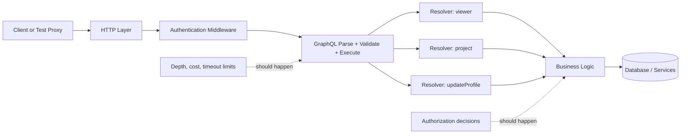
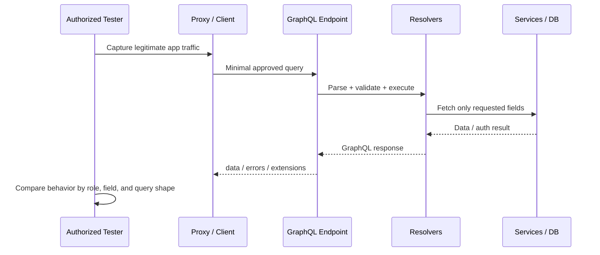

# GraphQL API

> **GraphQL is both an API query language and a schema-driven contract. For authorized API testing, that matters because one endpoint can expose a very large amount of business logic, data relationships, and field-level authorization decisions behind a single URL.**

---

## 🧠 What Is GraphQL? (Beginner Explanation)

In a traditional REST API, you usually visit many endpoints:

- `GET /users/42`
- `GET /users/42/orders`
- `POST /orders`

In GraphQL, you often talk to **one endpoint**, commonly `/graphql`, and tell the server exactly which fields you want.

That means:

- clients can avoid over-fetching data
- frontend teams can request nested data in one call
- the server exposes a **schema** that describes the API
- security testing shifts from “Which URL exists?” to “Which fields, types, and operations exist?”

### Simple analogy

- **REST** = ordering fixed menu items
- **GraphQL** = building your own plate from a list of ingredients

That flexibility is powerful, but it also means a tester must validate:

- what the schema exposes
- how resolvers enforce authorization
- whether query cost is controlled
- whether errors and tooling reveal too much

---

## Why GraphQL matters in API pentesting

GraphQL changes the shape of the attack surface:

| Characteristic | Why it matters to an authorized tester |
|---|---|
| **Single endpoint** | A small URL surface can still hide a very large functional surface |
| **Schema-driven** | The schema acts as a live API contract and discovery source |
| **Field-level selection** | Sensitive fields may be exposed even if the parent object looks safe |
| **Nested traversal** | One query can cross many objects and relationships |
| **Resolvers** | Authorization is often decided deeper than the HTTP layer |
| **Flexible queries** | Poor depth, breadth, timeout, or cost controls can create availability risk |
| **Developer tooling** | Introspection, GraphiQL, and playgrounds can be useful in dev but risky in production |

---

## 🏗️ Core concepts you need to understand

### GraphQL vocabulary

| Term | Meaning | Why testers care |
|---|---|---|
| **Schema** | The API contract: types, fields, operations, directives | It defines what can be asked for |
| **Query** | Read operation | Equivalent to data retrieval, but not necessarily HTTP `GET` |
| **Mutation** | Write operation | Often where privilege and business logic issues live |
| **Subscription** | Real-time operation | Usually runs over WebSocket/SSE and needs separate auth review |
| **Resolver** | Server-side function that returns a field’s value | Missing checks here often lead to broken authorization |
| **Type** | Object, scalar, enum, interface, union, input object, list, non-null | Helps you reason about data exposure and validation |
| **Variables** | External values passed into an operation | Primary input surface for validation testing |
| **Introspection** | Built-in schema self-discovery | Useful for legitimate testing, but often restricted in production |
| **Alias** | Renames a field in the response | Important for understanding how operations can be shaped |
| **Fragment** | Reusable selection set | Common in real traffic and important when reading complex queries |

### Example schema (SDL)

```graphql
type Query {
  viewer: User
  project(id: ID!): Project
  search(term: String!, first: Int = 10): SearchResult!
}

type Mutation {
  updateProfile(input: UpdateProfileInput!): User!
  createToken(name: String!): ApiToken!
}

type Subscription {
  buildStatus(projectId: ID!): BuildEvent!
}

type User {
  id: ID!
  email: String!
  role: Role!
  projects(first: Int = 10): [Project!]!
}

type Project {
  id: ID!
  name: String!
  owner: User!
}

enum Role {
  USER
  ADMIN
}

input UpdateProfileInput {
  displayName: String
  timezone: String
}
```

### Important type-system details

| Syntax | Meaning | Testing note |
|---|---|---|
| `String`, `Int`, `Boolean`, `ID` | Scalars | `ID` is often opaque; do not assume numeric-only |
| `Role` | Enum | Good for allowlist-style validation |
| `[Project]` | List | Check pagination and list size limits |
| `User!` | Non-null | Null propagation and execution errors become important |
| `input UpdateProfileInput` | Input object | Common place for mass assignment-style mistakes |

---

## 📊 Diagram: how a GraphQL request actually flows



**Key lesson:** authentication usually happens before GraphQL execution, but **authorization must still be enforced when fields are resolved**.

---

## 🌐 What the specs say

For GraphQL fundamentals, two public specifications/guides matter most:

1. **The GraphQL specification** defines the language, type system, validation, execution, and introspection.
2. **GraphQL over HTTP guidance** describes common transport behavior for HTTP APIs.

### Practical spec takeaways

| Topic | What matters in practice |
|---|---|
| **Transport** | GraphQL itself is transport-agnostic, but HTTP + JSON is the most common deployment model |
| **Endpoint model** | GraphQL usually exposes a single HTTP endpoint |
| **POST support** | Servers should support `POST` for queries and mutations |
| **GET support** | Servers may support `GET` for queries only |
| **Request body keys** | Common JSON keys are `query`, `variables`, `operationName`, and `extensions` |
| **Response keys** | Top-level response keys are `data`, `errors`, and optionally `extensions` |
| **Partial responses** | A response can legitimately contain both `data` and `errors` |
| **Introspection fields** | `__typename`, `__schema`, and `__type` are part of the GraphQL model |

### GraphQL vs GraphQL-over-HTTP vs common extensions

| Feature | Core GraphQL spec? | Common in real deployments? |
|---|---|---|
| Queries / mutations / schema / validation | **Yes** | **Yes** |
| HTTP transport conventions | No | **Yes** |
| File uploads | No | Common extension |
| JSON-array batching | No | Framework-specific |
| Persisted / trusted queries | No | Common hardening pattern |
| Subscriptions over WebSocket/SSE | No transport mandated | Common |

---

## HTTP anatomy of a GraphQL API

### Standard `POST` request

```http
POST /graphql HTTP/1.1
Host: api.example.com
Content-Type: application/json
Accept: application/graphql-response+json, application/json
Authorization: Bearer eyJ...

{
  "query": "query Viewer { viewer { id email role } }",
  "variables": {},
  "operationName": "Viewer"
}
```

### Benign `GET` request for a query

According to common GraphQL-over-HTTP guidance, `GET` may be used for **query** operations, not mutations.

```http
GET /graphql?query=query%20Ping%20%7B%20__typename%20%7D&operationName=Ping HTTP/1.1
Host: api.example.com
Accept: application/graphql-response+json, application/json
```

### Example response

```json
{
  "data": {
    "viewer": {
      "id": "u_123",
      "email": "alice@example.com",
      "role": "USER"
    }
  }
}
```

### Partial response example

One GraphQL detail that often surprises beginners: the server can return some data **and** some errors in the same response.

```json
{
  "data": {
    "viewer": {
      "id": "u_123",
      "email": null
    }
  },
  "errors": [
    {
      "message": "Not authorized to access field User.email",
      "path": ["viewer", "email"]
    }
  ]
}
```

### Request errors vs field errors

| Error type | Usually happens when | Typical effect |
|---|---|---|
| **Request error** | Syntax problem, invalid field, bad variable type | Usually no `data` key |
| **Field error** | Resolver throws, downstream call fails, non-null problem | May still return partial `data` |
| **Network / transport error** | Timeout, TLS issue, proxy failure | May not be a GraphQL response at all |

**Testing lesson:** do not assume HTTP `200` means “everything is fine.” In GraphQL, meaningful failures can still appear inside the JSON body.

---

## 🧩 Reading GraphQL operations

### Query with variables

```graphql
query GetProject($id: ID!) {
  project(id: $id) {
    id
    name
    owner {
      id
      email
    }
  }
}
```

```json
{
  "id": "proj_1001"
}
```

### Alias example

```graphql
query CompareViews {
  me: viewer { id role }
  again: viewer { id role }
}
```

Aliases are not inherently dangerous, but they matter when reviewing:

- response parsing
- logging
- naive per-field assumptions
- rate-limit logic that counts only HTTP requests

### Fragment example

```graphql
fragment UserSummary on User {
  id
  email
  role
}

query ViewerAndOwner($id: ID!) {
  viewer {
    ...UserSummary
  }
  project(id: $id) {
    owner {
      ...UserSummary
    }
  }
}
```

Fragments make legitimate client traffic much easier to understand once you know the syntax.

---

## 📊 Diagram: authorized testing workflow



---

## 🔍 What to map first in an authorized assessment

| Question | Why it matters | Safe validation approach |
|---|---|---|
| Where is the GraphQL endpoint? | Everything usually funnels through it | Observe client traffic, docs, or approved API references |
| Is there more than one endpoint? | Gateways, admin APIs, and internal graphs may differ | Compare mobile/web/admin traffic in scope |
| How is authentication carried? | Header, cookie, mTLS, signed request, session | Capture one normal request and document auth context |
| Is introspection enabled? | It affects how easy legitimate schema review is | Send a low-impact introspection query only if permitted |
| Are GraphiQL/Playground/Altair exposed? | Production tooling often leaks docs and operations | Check known app routes in-scope, don’t go beyond ROE |
| Are persisted queries used? | Changes how requests are delivered and replayed | Observe `extensions`, hashes, and fallback behavior |
| Are subscriptions used? | WebSocket/SSE auth can differ from HTTP auth | Review handshake and message authorization separately |
| Are uploads supported? | File uploads are outside the core spec and need extra controls | Verify whether uploads are direct-to-storage or GraphQL-based |
| Are limits visible? | Depth, amount, timeout, and cost controls are critical | Increase query size slowly and safely within approved boundaries |

---

## 🧪 Safe, practical GraphQL testing workflow

This section is framed for **authorized**, low-impact validation.

### 1. Capture a real request first

Start with the application itself:

- browser DevTools
- a mobile proxy
- Burp Suite / mitmproxy in an approved environment
- first-party docs or SDK examples

Why this matters:

- you learn the real endpoint
- you see auth headers/cookies
- you see whether persisted queries or plain text queries are used
- you get safe, known-good operations to replay

### 2. Confirm the endpoint with a harmless operation

The smallest useful GraphQL check is often:

```graphql
query Ping {
  __typename
}
```

Harmless `curl` example:

```bash
curl -s https://api.example.com/graphql \
  -H 'Content-Type: application/json' \
  -H 'Accept: application/graphql-response+json, application/json' \
  -H 'Authorization: Bearer <approved-test-token>' \
  -d '{"query":"query Ping { __typename }","operationName":"Ping"}'
```

What you learn:

- endpoint is live
- auth is accepted or rejected
- response format matches GraphQL conventions

### 3. Review the schema safely

If your rules of engagement allow it, a minimal introspection request is useful:

```graphql
query SchemaRoots {
  __schema {
    queryType { name }
    mutationType { name }
    subscriptionType { name }
  }
}
```

If introspection is disabled in production, that may be an intentional control rather than a problem. In an authorized engagement:

- treat that as a finding only if it conflicts with expected behavior
- avoid attempting bypass tricks unless explicitly allowed
- use approved docs, captured operations, or lower environments instead

### 4. Map authorization at the field and mutation level

GraphQL authorization is often missed because teams protect the endpoint but forget individual fields or resolver paths.

Safe validation pattern:

- use **two approved accounts** with different roles
- compare the same operation across roles
- focus on **read fields**, **write mutations**, and **ownership boundaries**

Example:

```graphql
query ProjectView($id: ID!) {
  project(id: $id) {
    id
    name
    owner { id }
  }
}
```

Then compare:

- account A requesting its own object
- account B requesting the same object if scope allows
- admin vs standard role behavior

### 5. Validate input handling through variables

Because GraphQL is strongly typed, a lot of basic validation happens early. That is helpful, but it is **not enough**.

Still validate:

- business rules
- custom scalar validation
- enum enforcement
- length limits
- pagination bounds
- nested input objects

Low-impact example:

```graphql
query Search($term: String!, $first: Int!) {
  search(term: $term, first: $first) {
    __typename
  }
}
```

Useful safe checks:

- valid vs invalid enum values
- `null` where non-null is expected
- very small vs boundary-safe pagination values
- unexpected but harmless Unicode input

### 6. Review resource-governance controls carefully

OWASP guidance heavily emphasizes:

- depth limits
- amount limits
- pagination
- timeouts
- query-cost analysis
- rate limiting

Do **not** turn this into load testing unless explicitly approved.

Instead:

- increase nesting slowly
- keep pagination values small and controlled
- watch latency and stop early
- note whether the API exposes cost/rate data in `extensions` or headers

### 7. Review errors, metadata, and tooling exposure

Errors can reveal:

- internal type names
- field names
- backend stack traces
- validation details
- rate-limit information

Harmless example:

```graphql
query TypoCheck {
  viewer {
    emali
  }
}
```

A good production response should be useful enough for clients but not excessively revealing for outsiders.

---

## Common GraphQL risk areas to understand

| Risk area | What it looks like | Defensive testing focus |
|---|---|---|
| **Broken object-level authorization** | Access to another user’s object through a valid field | Compare objects across approved identities |
| **Broken function-level authorization** | Mutation exists but role checks are weak | Compare mutation availability and outcomes by role |
| **Excessive data exposure** | Legitimate object contains sensitive fields | Review selection sets and field-level visibility |
| **Input validation issues** | Unsafe custom scalars, weak input object validation | Use harmless boundary values and invalid types |
| **Query cost / depth abuse** | Expensive graph traversal degrades service | Check for pagination, caps, timeouts, cost guards |
| **Naive rate limiting** | Controls count only HTTP requests, not operation shape | Verify rate limits are tied to user/cost, not just request count |
| **Verbose errors / dev tooling** | Playground, stack traces, schema hints in prod | Review production exposure of tooling and diagnostics |
| **Subscription security gaps** | WebSocket auth differs from HTTP auth | Re-check auth at connect time and message time |
| **Upload handling mistakes** | Multipart uploads exhaust memory or bypass CSRF protections | Prefer signed URLs; review upload extensions carefully |

---

## Authorization is the real GraphQL security story

A common beginner mistake is to think:

> “The `/graphql` endpoint requires a token, so it is secure.”

That is incomplete.

Per GraphQL best-practice guidance:

- **authentication** usually happens in HTTP middleware
- **authorization** should be enforced by business logic used during resolver execution

Why this matters:

- the same endpoint may serve public and private fields
- one object may contain both harmless and sensitive properties
- nested traversals may cross trust boundaries
- the same backend method may be reachable through more than one resolver path

### Good mental model

| Layer | What it should decide |
|---|---|
| HTTP / gateway layer | “Who is this caller?” |
| GraphQL execution / business logic | “Can this caller access this field or perform this action?” |
| Data layer | “Can this operation be constrained safely and efficiently?” |

---

## Introspection: useful feature, sensitive control

Introspection is not automatically “bad.” It is one of GraphQL’s most useful features for:

- IDEs
- schema browsers
- client generation
- legitimate security review

But in production, many teams disable or restrict it to reduce discoverability.

### What introspection can reveal

| Item | Why it matters |
|---|---|
| Root query / mutation names | Maps core functionality quickly |
| Types and fields | Shows available data paths |
| Input objects | Shows what write operations expect |
| Descriptions / deprecations | Can reveal implementation detail and forgotten paths |
| Directives | Can reveal internal design patterns |

### Authorized testing guidance

- use introspection when it is permitted and appropriate
- if it is disabled, respect that control unless the engagement explicitly includes testing its enforcement
- document both the security value and the operational impact

---

## Performance and availability controls you should expect

Mature GraphQL APIs usually need more than “normal” per-request rate limiting.

### Useful protections

| Control | Why it matters |
|---|---|
| **Pagination** | Prevents enormous list responses |
| **Depth limits** | Prevents unbounded nesting |
| **Breadth / alias limits** | Prevents huge fan-out in a single operation |
| **Query-cost analysis** | Better reflects backend work than simple depth alone |
| **Execution timeouts** | Prevents long-running resolvers from tying up resources |
| **Persisted / trusted documents** | Restricts what operations can run in production |
| **Rate limits by identity and cost** | Better than counting raw HTTP requests only |

### Real-world example

GitHub’s GraphQL API uses a **points-based model**, which is a strong example of cost-aware GraphQL governance instead of naive “requests per minute” thinking.

---

## Subscriptions and uploads: two areas beginners often miss

### Subscriptions

Subscriptions are part of GraphQL’s operation model, but the transport is usually **WebSocket** or **server-sent events**, not plain request/response HTTP.

Review:

- how authentication is established during connection
- whether authorization is re-checked for each event stream
- how long-lived sessions expire
- whether disconnected clients are cleaned up

### File uploads

File uploads are **not part of the core GraphQL spec**. They are usually implemented via community conventions such as multipart requests.

Safer design:

1. use GraphQL to request a signed upload URL
2. upload directly to object storage
3. use a follow-up mutation to attach metadata

That design keeps binary data away from the GraphQL server and reduces reliability and security risk.

---

## ✅ Quick authorized testing checklist

- [ ] Confirm endpoint, auth method, and media types
- [ ] Capture at least one normal request from the real client
- [ ] Identify root query, mutation, and subscription operations
- [ ] Determine whether introspection is allowed, restricted, or disabled
- [ ] Compare field-level behavior across approved roles
- [ ] Review mutations for ownership and privilege boundaries
- [ ] Validate input objects, scalars, enums, and pagination arguments
- [ ] Check whether partial responses expose sensitive errors
- [ ] Review cost, timeout, pagination, and rate-limit controls safely
- [ ] Check subscriptions and uploads separately from standard queries
- [ ] Document evidence with exact operation names and account roles used

---

## 🛡️ Defender notes / hardening summary

- Place GraphQL behind normal authentication middleware
- Enforce authorization in business logic used by resolvers
- Minimize public exposure of GraphiQL/playground tooling in production
- Restrict or disable introspection where it is not operationally needed
- Prefer typed inputs, enums, and custom scalars over loose JSON blobs
- Add pagination, depth limits, breadth limits, cost analysis, and timeouts
- Use rate limits tied to identity and query cost
- Prefer persisted or trusted operations for high-risk production APIs
- Keep error messages useful but not excessively revealing
- Prefer signed URLs over GraphQL file-upload handling

---

## 📚 References

- GraphQL Specification (October 2021): `https://spec.graphql.org/October2021/`
- GraphQL.org — Serving over HTTP: `https://graphql.org/learn/serving-over-http/`
- GraphQL.org — Response: `https://graphql.org/learn/response/`
- GraphQL.org — Introspection: `https://graphql.org/learn/introspection/`
- GraphQL.org — Authorization: `https://graphql.org/learn/authorization/`
- GraphQL.org — Best Practices: `https://graphql.org/learn/best-practices/`
- GraphQL.org — File Uploads: `https://graphql.org/learn/file-uploads/`
- OWASP GraphQL Cheat Sheet: `https://cheatsheetseries.owasp.org/cheatsheets/GraphQL_Cheat_Sheet.html`
- Apollo — GraphQL API Security Checklist: `https://www.apollographql.com/blog/9-ways-to-secure-your-graphql-api-security-checklist`
- GitHub GraphQL resource limitations: `https://docs.github.com/en/graphql/overview/resource-limitations`
