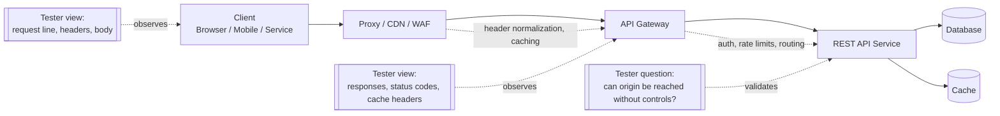
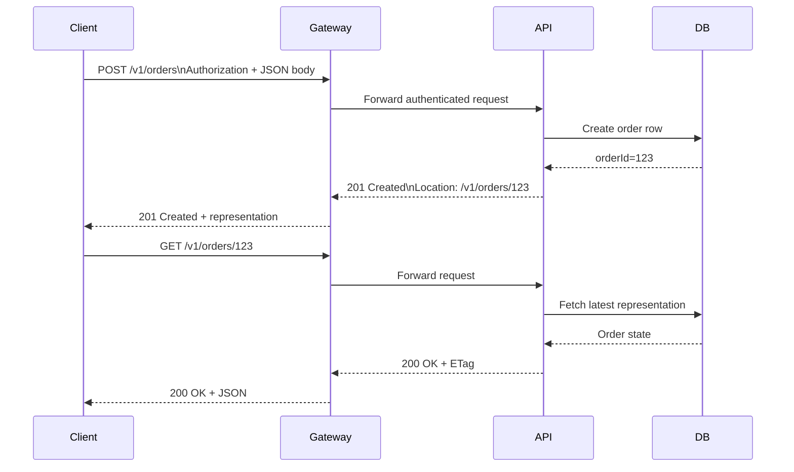
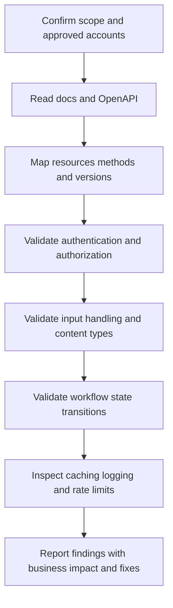

# REST API Fundamentals for Security Testers

> **Beginner → advanced guide to how REST APIs work, how HTTP semantics shape security, and how to test them safely within authorized scope.**

REST is the most common API style security testers encounter, but many teams use the term loosely. Some APIs are strongly RESTful, some are simply JSON over HTTP, and some mix REST ideas with RPC-style actions. For an authorized tester, the important goal is not philosophical purity — it is understanding **resources, methods, representations, state handling, trust boundaries, and business actions** well enough to test them safely and accurately.

**Assume written authorization, approved test accounts, approved datasets, and an agreed testing window for every example in this note.**

---

## 🧠 What Is a REST API? (Beginner Explanation)

**REST** stands for **Representational State Transfer**. Roy Fielding described it as an architectural style for distributed systems, not just a list of endpoints.

At a practical level, a REST API usually means:

- data and business capabilities are exposed as **resources**
- each resource has a **URI** such as `/users/42` or `/orders/123/items`
- clients interact with those resources using standard **HTTP methods** like `GET`, `POST`, `PUT`, `PATCH`, and `DELETE`
- the server returns a **representation** of the resource, usually JSON
- each request should carry enough context to be understood on its own

Think of it like this:

- the **resource** is the thing: `order 123`
- the **URI** is the address: `/orders/123`
- the **method** is the intent: `GET` to read, `PATCH` to update
- the **representation** is what gets transferred: JSON, XML, CSV, etc.

A common beginner mistake is to think REST means “JSON API.” JSON is only the message format. REST is really about the **interaction model**.

---

## 🎯 Why REST Matters in Authorized API Testing

REST APIs are attractive targets because they are:

- **consistent** enough to automate
- **data-dense** enough to expose valuable records quickly
- **directly connected to business logic** such as payments, shipping, identity, messaging, and reporting
- used by **web apps, mobile apps, partner integrations, bots, and AI agents**

That is why REST testing is not only about injection flaws. It is also about:

- object-level authorization
- function-level authorization
- overexposed fields
- weak workflow controls
- cache behavior
- version drift and shadow endpoints
- unsafe assumptions about headers, methods, and content types

---

## 📌 REST at a Glance

| Concept | What it means | Example | Why a tester cares |
|---|---|---|---|
| **Resource** | A business object or collection | `/users`, `/orders/123` | Authorization usually applies to resources and sub-resources |
| **Representation** | Transfer format for a resource | JSON, XML, CSV | Content type confusion, schema drift, overexposure |
| **Method** | Requested operation | `GET`, `POST`, `PATCH` | Side effects, verb tampering, method allowlists |
| **Statelessness** | Each request carries its own context | Bearer token sent on every request | Impacts scaling, replay risk, auth design |
| **Uniform interface** | Standard HTTP semantics | `201 Created`, `405 Method Not Allowed` | Makes behavior predictable and testable |
| **Caching** | Responses may be reused | `Cache-Control`, `ETag` | Sensitive data leakage or stale decision problems |
| **Layered system** | Proxies, gateways, load balancers in the path | CDN → WAF → API gateway → service | Direct-to-origin bypasses and header trust issues |
| **Hypermedia** | Responses can include navigable links | `links.self`, `links.next` | Helpful for discovery; rarely implemented fully |

---

## 📊 Diagram — How a REST Request Travels Through the Stack



**Why this matters:** a tester is rarely talking to only one server. REST traffic often crosses caches, gateways, identity layers, and service-to-service boundaries before business logic runs.

---

## 🏗️ The Core REST Constraints

REST is best understood through its architectural constraints.

| Constraint | Meaning | Why it exists | Security and testing implications |
|---|---|---|---|
| **Client-server** | UI concerns are separated from data/storage concerns | Independent evolution of clients and servers | Mobile, SPA, partner, and backend clients may all hit the same API differently |
| **Stateless** | Each request is self-contained | Scalability, reliability, easier visibility | Tokens, cookies, and headers must carry enough context; replay and stale token handling matter |
| **Cacheable** | Responses explicitly say whether they may be reused | Better performance and reduced latency | Sensitive responses need correct cache controls; stale authorization decisions can become findings |
| **Uniform interface** | Resources, methods, status codes, and media types follow standard semantics | Simpler, more observable integrations | Wrong verbs, wrong status codes, or tunnel-everything-through-POST patterns often hide logic issues |
| **Layered system** | Intermediaries can sit between client and origin | Scalability, security, encapsulation | Header trust, direct-to-service access, and inconsistent enforcement become important |
| **Code-on-demand** *(optional)* | Server can extend clients with downloadable code | Extensibility | Rare in API testing, but useful to remember when APIs also drive web or mobile clients |

### Important nuance

Many production “REST APIs” implement only part of this model. That is normal. A practical tester should ask:

- does the API use resources meaningfully?
- do methods behave like HTTP says they should?
- are responses self-descriptive?
- are caching and auth behaviors explicit?
- where does real trust live: gateway, app, or backend service?

---

## 🧱 Resources, Collections, and URIs

Good REST design usually starts with **resources**, not verbs.

### Common patterns

| Pattern | Example | Usually means |
|---|---|---|
| **Collection** | `/users` | Many items |
| **Item** | `/users/42` | One item |
| **Sub-collection** | `/users/42/orders` | Related items belonging to an item |
| **Action-like sub-resource** | `/orders/123/cancel` | Business action that does not fit plain CRUD |
| **Filtered collection** | `/orders?status=pending&limit=20` | Querying a collection |
| **Versioned path** | `/api/v1/orders` | One version of the API surface |

### Good vs risky URI styles

| Better pattern | Riskier pattern | Why |
|---|---|---|
| `/orders` | `/createOrder` | HTTP methods already express the action |
| `/orders/123` | `/getOrder?id=123` | Path resources are usually clearer for access control and logging |
| `/users/42/orders` | `/getUserOrdersForReporting` | Easier to reason about relationships |
| `/orders/123/cancel` | `/doEverything` | Explicit business actions are better than generic RPC buckets |

### Practical testing insight

If every endpoint looks like one of these:

```text
POST /execute
POST /service
POST /action
POST /invoke
```

then the API is likely using **RPC over HTTP**, not a resource-oriented design. That does not make it insecure by itself, but it changes how you reason about:

- authorization boundaries
- replay behavior
- content validation
- documentation quality
- cacheability and safe methods

---

## 📊 Diagram — Resource Relationships in a Typical REST API

```mermaid
flowchart TD
    U[/users/] --> U1[/users/{userId}/]
    U1 --> O[/users/{userId}/orders/]
    O --> O1[/orders/{orderId}/]
    O1 --> I[/orders/{orderId}/items/]
    O1 --> A[/orders/{orderId}/cancel/]
```

**Testing lesson:** every node can have its own authentication, authorization, method rules, and data exposure behavior.

---

## 🌐 HTTP Semantics: The Part REST Depends On

REST over HTTP inherits its power from HTTP semantics. If the API ignores those semantics, security testing gets harder and mistakes become more likely.

### Method properties that matter

| Method | Safe? | Idempotent? | Typical use | What a tester should verify |
|---|---|---|---|---|
| `GET` | Yes | Yes | Read a resource | Should not change state; watch for unsafe side effects, sensitive caching, excessive data |
| `HEAD` | Yes | Yes | Fetch headers only | Useful for metadata and cache checks |
| `OPTIONS` | Yes | Yes | Discover allowed methods / CORS behavior | Compare declared vs actual methods; inspect `Allow` and CORS behavior |
| `POST` | No | No | Create or submit work | Confirm duplicate submission handling, workflow controls, `201`/`202` behavior |
| `PUT` | No | Yes | Replace a resource | Repeating the same request should not multiply side effects |
| `PATCH` | No | Usually no | Partial update | Validate patch format, field authorization, concurrency controls |
| `DELETE` | No | Yes | Remove a resource | Repeating should not create inconsistent results |

### Why “safe” and “idempotent” matter

- **Safe** means the method should not have a state-changing business effect.
- **Idempotent** means sending the same request repeatedly should leave the server in the same final state.

These are not academic definitions. They affect:

- whether caching works correctly
- whether retries are safe
- whether crawlers or prefetchers accidentally trigger actions
- whether duplicate requests cause billing, ordering, or workflow errors

### Example: benign observation requests in scope

```bash
# Read a resource representation
curl -i https://api.example.test/v1/orders/123 \
  -H 'Authorization: Bearer <approved-test-token>' \
  -H 'Accept: application/json'

# Inspect allowed methods and CORS-related behavior
curl -i -X OPTIONS https://api.example.test/v1/orders/123 \
  -H 'Authorization: Bearer <approved-test-token>'

# Compare headers without transferring the body
curl -i -X HEAD https://api.example.test/v1/orders/123 \
  -H 'Authorization: Bearer <approved-test-token>'
```

These checks are useful because they reveal:

- content type
- cache directives
- ETags and validators
- allowed methods
- auth challenges
- version headers

without requiring destructive actions.

---

## 📨 Anatomy of a REST Request and Response

A REST exchange is more than path + JSON.

### Example request

```http
GET /v1/orders/123?expand=items HTTP/1.1
Host: api.example.test
Authorization: Bearer <approved-test-token>
Accept: application/json
If-None-Match: "order-123-v8"
X-Request-ID: 7dc1a0bb-e7d1-4f23-9f7a-1382d6fa9d00
```

### Example response

```http
HTTP/1.1 200 OK
Content-Type: application/json
Cache-Control: no-store
ETag: "order-123-v9"
Vary: Accept, Authorization
X-Request-ID: 7dc1a0bb-e7d1-4f23-9f7a-1382d6fa9d00

{
  "id": 123,
  "status": "processing",
  "currency": "USD",
  "items": [
    {"sku": "BK-100", "qty": 1}
  ]
}
```

### Message parts and why they matter

| Part | Example | Why it matters to testers |
|---|---|---|
| **Path** | `/v1/orders/123` | Resource identity; often the authorization key |
| **Query string** | `?expand=items&limit=20` | Filtering, pagination, field expansion, sorting, cache key changes |
| **Headers** | `Authorization`, `Accept`, `If-Match` | Auth, content negotiation, concurrency, tracing |
| **Body** | JSON payload | Input validation, schema enforcement, field-level auth |
| **Status code** | `200`, `201`, `403`, `409` | Tells whether behavior matches intended semantics |
| **Response headers** | `Cache-Control`, `ETag`, `Location` | Caching, redirects, async flows, optimistic locking |

## 📊 Diagram — Typical Create-Then-Read REST Flow



This pattern is important because it demonstrates several core REST ideas at once: resource creation, a `Location` header, standard status codes, and a follow-up read using the new resource URI.

---

## 🧾 Representations, Media Types, and Content Negotiation

A resource is not the same thing as its representation.

For example, the same order might be returned as:

- JSON for a web app
- CSV for export
- PDF for an invoice view
- a summarized form for mobile clients

That is why testers should always inspect both:

- **what resource is being requested**
- **what representation is being returned**

### Content negotiation basics

| Header | Purpose | Testing value |
|---|---|---|
| `Accept` | Tells the server what response formats the client wants | Helps detect unsupported types, overly permissive handling, and inconsistent schemas |
| `Content-Type` | Tells the server what format the request body uses | Critical for parser selection and input validation |
| `Vary` | Tells caches which request headers affect the representation | Important when auth or language changes the response |
| `Content-Encoding` | Compression such as `gzip` | Matters for intermediaries, proxies, and response handling |

### Secure behavior to expect

- requests with unsupported body formats should be rejected clearly
- responses should use the actual content type returned
- caches should not mix one user’s representation with another user’s response
- parsers should not accept undocumented formats silently

### Safe authorized validation ideas

In a controlled test tenant, verify whether the API:

- rejects unsupported `Content-Type` values with an appropriate response
- returns the declared content type instead of guessing
- handles `Accept` negotiation consistently
- uses `Vary` correctly when headers influence the returned representation

---

## 🔁 Statelessness, Sessions, and Tokens

REST is **stateless**, but that does **not** mean “no authentication” or “no cookies ever.” It means the server should not depend on hidden conversational state between requests.

### Good mental model

- **Stateless HTTP interaction:** each request carries the context needed for processing
- **Stateful business process:** the resource itself can still have state, such as `draft`, `submitted`, `approved`, or `cancelled`

A checkout API can be RESTful while orders move through states. What matters is that each request is self-descriptive and validated against the current resource state.

### Common auth patterns in REST APIs

| Pattern | Where state lives | Typical tester focus |
|---|---|---|
| Session cookie | Server session + cookie | Cookie flags, CSRF exposure, session invalidation |
| Bearer token / JWT | Client holds token, sends on each request | Signature validation, audience/issuer checks, revocation, expiry |
| API key | Client holds key | Scope limits, rotation, logging exposure, rate limiting |
| OAuth 2.0 access token | Authorization server issues token | Scope enforcement, token audience, flow design |
| mTLS | Mutual certificate trust | Service identity, certificate handling, direct-service access |

### Security takeaway

For testers, the main question is not only **“is the user authenticated?”**

It is also:

- is every request independently authorized?
- can a valid token be replayed outside the intended workflow?
- does the backend trust the gateway too much?
- do different services interpret the same token differently?

---

## 📚 Status Codes: What Good REST Behavior Looks Like

Correct status codes make APIs easier to integrate, easier to monitor, and easier to secure.

| Code | Meaning | Typical REST use | Why testers care |
|---|---|---|---|
| `200 OK` | Request succeeded | Read or update with body returned | Common baseline response |
| `201 Created` | New resource created | `POST /orders` | Should often include `Location` |
| `202 Accepted` | Work accepted, not finished yet | Async jobs, queues, report generation | Follow-up status endpoint should exist |
| `204 No Content` | Success, no body returned | Delete, update without body | Good for minimal responses |
| `304 Not Modified` | Cached representation still valid | Conditional `GET` with validators | Sensitive data still needs safe cache rules |
| `400 Bad Request` | Malformed request | Missing fields, invalid structure | Should not leak internals |
| `401 Unauthorized` | Authentication missing/invalid | No token, expired token | Often paired with `WWW-Authenticate` |
| `403 Forbidden` | Authenticated but not allowed | Access denied to a resource or action | Very important for authorization testing |
| `404 Not Found` | Resource absent or intentionally hidden | Unknown object | Some systems use this to reduce enumeration clues |
| `405 Method Not Allowed` | Method unsupported for that resource | `DELETE` on read-only endpoint | Confirms method allowlists |
| `409 Conflict` | Current state blocks the action | Concurrent update, invalid state transition | Useful for workflow and concurrency testing |
| `412 Precondition Failed` | Conditional header failed | `If-Match` failed | Strong signal of optimistic locking |
| `415 Unsupported Media Type` | Request body format unsupported | Wrong `Content-Type` | Reveals parser discipline |
| `422 Unprocessable Content` | Syntactically valid but semantically invalid | Validation failure | Helpful for structured validation behavior |
| `429 Too Many Requests` | Rate limit hit | Abuse protection | Critical for resource-consumption testing |
| `500` class | Server error | Unhandled faults | Check error hygiene and trace leakage |

### Red flag patterns

- `200 OK` for everything, including failures
- `500` for user input mistakes
- `GET` requests returning different business outcomes each time because they trigger updates
- missing `Location` after resource creation
- no concurrency control on high-value updates

---

## 🧮 Caching, Validators, and Concurrency

Caching is a core part of HTTP and therefore a core part of REST.

### Headers worth understanding

| Header | Purpose | Security relevance |
|---|---|---|
| `Cache-Control` | Controls whether and how responses are cached | Sensitive data should not land in shared caches |
| `ETag` | Version identifier for a representation | Useful for change detection and optimistic locking |
| `If-None-Match` | Ask only if representation changed | Helps clients avoid unnecessary downloads |
| `If-Match` | Update only if the server version matches | Prevents lost updates and race conditions |
| `Last-Modified` | Timestamp validator | Weaker than strong entity tags, but still useful |

### Example: conditional update

```http
PATCH /v1/orders/123 HTTP/1.1
Host: api.example.test
Authorization: Bearer <approved-test-token>
Content-Type: application/merge-patch+json
If-Match: "order-123-v9"

{
  "shippingAddress": {
    "city": "Boston"
  }
}
```

If another approved tester or system process changed the order first, the server can reject the update with:

```http
HTTP/1.1 412 Precondition Failed
```

### Why this matters in security work

Without validators and preconditions:

- two clients can overwrite each other silently
- workflow transitions become race-prone
- audit trails become harder to trust
- retries may corrupt state even when auth is correct

For sensitive APIs, caching is also a privacy issue. A secure design should avoid caching personalized secrets, tokens, account data, or admin views in shared intermediaries.

---

## 🧭 OpenAPI, Documentation, and Discoverability

A modern REST API is often accompanied by an **OpenAPI** specification. The OpenAPI Specification defines a standard interface description for HTTP APIs so humans and tools can understand the service without guessing from traffic alone.

### Minimal example

```yaml
openapi: 3.1.0
info:
  title: Orders API
  version: 1.0.0
paths:
  /orders/{orderId}:
    get:
      summary: Get one order
      parameters:
        - in: path
          name: orderId
          required: true
          schema:
            type: string
      responses:
        '200':
          description: Order returned
        '403':
          description: Not allowed
      security:
        - bearerAuth: []
components:
  securitySchemes:
    bearerAuth:
      type: http
      scheme: bearer
      bearerFormat: JWT
```

### What an authorized tester extracts from a spec

- all documented paths and methods
- parameter locations: path, query, header, cookie
- request body formats and schemas
- expected status codes
- auth schemes and scopes
- deprecated operations and version hints

### But do not trust the spec blindly

A real assessment compares:

- **documented behavior** vs **observed behavior**
- **gateway behavior** vs **origin behavior**
- **one client type** vs **another client type**

Differences between the spec and reality often reveal:

- shadow endpoints
- undocumented fields
- unprotected old versions
- weak backend validation
- broken inventory management

---

## 🔬 Practical Authorized REST Testing Workflow

This is the safest and most useful mental model for REST testing.



### What “authorized and practical” looks like

| Goal | Safe validation pattern | Secure behavior expected |
|---|---|---|
| Object-level auth | Use two approved test users and test objects only | User B cannot read or change User A’s object |
| Method handling | Compare documented methods with `OPTIONS` and one disallowed method | Unsupported verbs rejected consistently |
| Content-type handling | Send only approved alternate media types in test tenant | Undeclared formats rejected cleanly |
| Workflow control | Try a later-stage action in a controlled lab sequence | Invalid state transitions rejected server-side |
| Rate limiting | Use agreed low-volume checks or staging throttling tests | Clear quotas, graceful `429`, no uncontrolled service degradation |
| Error handling | Trigger validation errors with sample data only | No stack traces, no internal paths, structured error bodies |
| Caching | Inspect headers on non-production or masked data | Sensitive data marked appropriately, auth-sensitive responses not shared |

### Example authorization check with approved accounts

```http
# Approved test user A creates or owns order 123 in the lab.
# Approved test user B then attempts read access only within scope.
GET /v1/orders/123 HTTP/1.1
Host: api.example.test
Authorization: Bearer <approved-user-b-token>
```

**Expected secure outcome:** `403 Forbidden` or a design-equivalent denial.

The value here is not “can IDs be changed?” — it is whether the server performs **object-level authorization** on every access path.

---

## 🪜 Beginner → Advanced: The Richardson Maturity Model

Not every HTTP API is equally RESTful. The Richardson Maturity Model is a useful lens for understanding how far an API goes in using HTTP semantics.

| Level | What it looks like | Example | Security testing implication |
|---|---|---|---|
| **0** | One endpoint, HTTP used like a tunnel | `POST /service` | Behaves more like RPC; fewer clues from verbs and codes |
| **1** | Distinct resources | `/orders`, `/users/42` | Better mapping of authorization domains |
| **2** | Proper HTTP verbs and status codes | `GET /orders/42`, `201 Created` | Easier to reason about safe/idempotent behavior |
| **3** | Hypermedia links guide the client | response includes `self`, `next`, `cancel` links | Rare in practice, but useful for discoverability and workflow visibility |

### Practical reality

Most production APIs sit around **Level 2**:

- good use of resources
- standard methods
- JSON bodies
- status codes used reasonably well
- little or no real hypermedia

That is fine. A tester mainly needs to understand what promises the API is making and whether the implementation actually keeps them.

---

## ⚠️ Common REST Anti-Patterns and Why They Matter

| Anti-pattern | Example | Why it is risky |
|---|---|---|
| **POST everywhere** | Every operation goes to `/execute` | Hides intent, weakens visibility, complicates authz reasoning |
| **Unsafe GETs** | `GET /users/42/delete` | Side effects can be triggered by crawlers, previews, or caches |
| **200 for errors** | Validation errors still return `200` | Breaks client logic, monitoring, and testing clarity |
| **Overexposed representations** | Sensitive fields returned by default | Leads to property-level data exposure |
| **Missing method allowlists** | Backend accepts methods docs never mention | Expands attack surface quietly |
| **Gateway-only trust** | Origin assumes gateway already checked auth | Direct-service or internal-path bypass risk |
| **No conditional updates** | Concurrent changes overwrite silently | Workflow and integrity issues |
| **Version sprawl** | `/v1`, `/v2`, `/beta`, mobile-only endpoints all alive | Hidden inventory and inconsistent controls |
| **Database-shaped resources** | Tables mapped directly to endpoints | Internal structure leaks into public surface |
| **Loose content-type handling** | Server accepts anything and tries to parse it | Parser confusion and validation drift |

---

## 🧰 What to Look for During Manual Review

When reading traffic, docs, or code, build this checklist mentally.

### Resource model

- What are the primary resources?
- What identifies them: numeric IDs, UUIDs, slugs, composite keys?
- Which sub-resources expose related objects or sensitive actions?

### Method semantics

- Are read operations really using safe methods?
- Are update operations idempotent where expected?
- Are unsupported methods rejected clearly?

### Representations

- Which fields are always returned?
- Which fields are writable?
- Do different clients get different representations of the same resource?

### State and workflow

- Does the resource have explicit states?
- Are transitions validated on the server?
- Are retries or reordered requests handled safely?

### Intermediaries and trust

- Is there a gateway, CDN, WAF, or service mesh?
- Which headers are trusted from clients?
- Can the origin service be reached differently from the documented path?

### Inventory and versioning

- Which API versions exist?
- Which are documented, deprecated, or hidden?
- Do mobile, partner, internal, and public clients hit the same controls?

---

## 🛡️ Defensive Design Principles Testers Should Understand

A strong REST API usually does the following well:

- uses **HTTPS only**
- applies **authentication and authorization per endpoint and per object/action**
- documents supported **methods** and **media types** clearly
- rejects unsupported methods with `405 Method Not Allowed`
- rejects unsupported body formats with `415 Unsupported Media Type`
- uses appropriate **status codes** instead of generic success
- applies safe **cache controls** to sensitive responses
- uses **rate limits**, quotas, or throttling for expensive operations
- validates **workflow state transitions** on the server
- logs security-relevant events with useful correlation IDs

These are design decisions, but they directly affect what an authorized pentest can verify and how reliable the findings will be.

---

## 📝 Key Takeaways

1. **REST is an architectural style, not just JSON over HTTP.**
2. **Resources, methods, representations, and status codes are the core language of REST.**
3. **HTTP semantics matter for security** — especially safe methods, idempotency, caching, and conditional requests.
4. **Stateless does not mean state-free.** Resource workflows still exist and must be enforced server-side.
5. **OpenAPI is a map, not the territory.** Always compare documentation to real behavior.
6. **Authorized REST testing is about validating trust boundaries, object access, representations, workflows, and controls** — not blindly replaying requests.

---

## 📚 Further Reading and Source Foundation

This note aligns with the HackerNotes API learning path in `api-pentesting.md` and the writing guidance in `remember.txt`, and is informed by the following public references:

- **Roy Fielding, _Architectural Styles and the Design of Network-based Software Architectures_** — the original REST architectural constraints
- **RFC 9110: HTTP Semantics** — method properties, status codes, and message semantics
- **MDN HTTP documentation** — practical explanations of HTTP overview, methods, and status codes
- **OWASP REST Security Cheat Sheet** — secure REST behavior, method restrictions, HTTPS, content-type handling, workflow validation
- **OWASP API Security Project** — why APIs need dedicated security assessment
- **OpenAPI Specification** — standard description format for HTTP APIs
- **Microsoft REST API design guidance** — resource-oriented design, URI conventions, status and method expectations
- **Martin Fowler on the Richardson Maturity Model** — a useful lens for judging how strongly an API uses HTTP semantics
