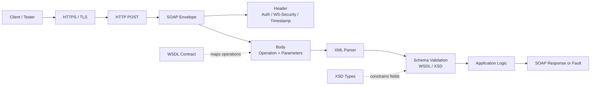
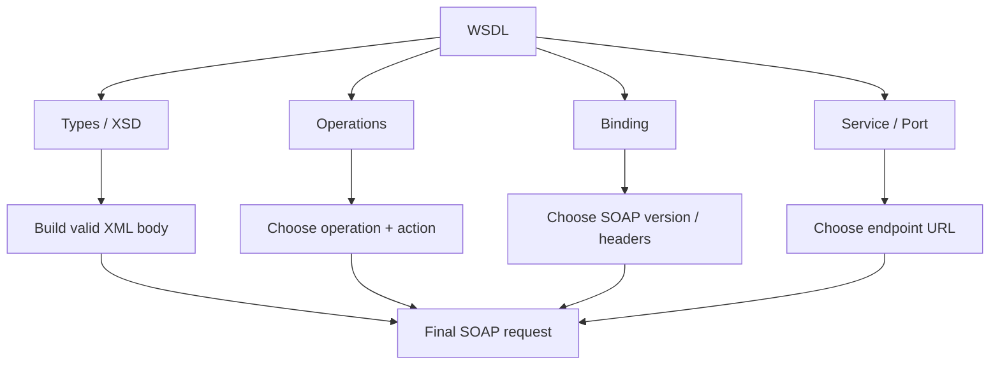

# SOAP API

> **SOAP (Simple Object Access Protocol) is a contract-driven, XML-based messaging protocol still heavily used in enterprise, banking, healthcare, ERP, and B2B integrations. For authorized security testing, the goal is to understand the contract, build valid messages, and safely verify transport, authentication, parser hardening, and business logic controls.**

---

## 🧠 What Is SOAP? (Beginner Explanation)

If REST often feels like sending a simple form, **SOAP feels like sending a formal, strictly structured document**.

A SOAP service usually expects:

- A very specific **XML message format**
- A formal **service contract** described by **WSDL**
- Data types defined by **XML Schema (XSD)**
- Sometimes **message-level security** such as **WS-Security**

That strictness is why SOAP is still used in environments where:

- interoperability matters,
- schema validation matters,
- message integrity matters,
- and organizations want strongly defined contracts between systems.

For a beginner, the key idea is:

```text
REST often starts with endpoints.
SOAP often starts with the contract.
```

If you can read the contract, understand the envelope, and interpret faults correctly, you can test SOAP services much more effectively.

---

## 📌 Why SOAP Still Matters to Security Testers

SOAP is older than many modern API styles, but it is far from dead. You will still see it in:

- internal enterprise integrations,
- legacy partner APIs,
- payment and insurance workflows,
- government systems,
- middleware and ESB environments,
- Microsoft/.NET and Java enterprise stacks.

From a security perspective, SOAP combines **normal API risks** with **XML-specific risks**:

| Area | Why It Matters |
|---|---|
| Authentication | SOAP may use HTTP auth, mTLS, or WS-Security headers |
| Authorization | A perfectly valid SOAP request can still expose broken access control |
| XML parsing | Weak parser settings can create XXE, entity expansion, or external fetch risks |
| Contract exposure | WSDL/XSD files can reveal operations, types, environments, and internal naming |
| Fault handling | SOAP faults often leak stack traces, schema details, namespaces, or backend errors |
| Message integrity | WS-Security signatures and timestamps can be misconfigured |

---

## 📊 SOAP in One Table

| Concept | Plain-English Meaning | Why a Tester Cares |
|---|---|---|
| **Envelope** | The outer XML wrapper of the SOAP message | Every request/response must be inside it |
| **Header** | Optional metadata section | Auth, signatures, timestamps, routing often live here |
| **Body** | The actual operation and its data | Main business logic input |
| **Fault** | Structured error response | Useful for understanding validation and error leakage |
| **WSDL** | Service contract file | Shows operations, message types, bindings, and endpoints |
| **XSD** | XML Schema definition | Shows required fields, types, enums, nesting, restrictions |
| **Binding** | How the service is exposed on the wire | Tells you SOAP version, transport, style |
| **Port / Service** | Concrete endpoint information | Helps map real reachable URLs |
| **SOAPAction / action** | Operation hint used by some SOAP bindings | Often required for requests to route correctly |
| **WS-Security** | Message-level security standard family | Important for signatures, tokens, timestamps, replay resistance |

---

## 📊 Diagram — SOAP Request Processing Path



---

## 🧱 Core SOAP Building Blocks

### 1. Envelope

The **Envelope** is the top-level XML element that says: “this is a SOAP message.”

Two namespaces are especially important:

| Version | Common Envelope Namespace |
|---|---|
| SOAP 1.1 | `http://schemas.xmlsoap.org/soap/envelope/` |
| SOAP 1.2 | `http://www.w3.org/2003/05/soap-envelope` |

If the wrong namespace is used, a compliant service may reject the message immediately.

### 2. Header

The **Header** is optional, but in real environments it is often where the interesting security details live:

- authentication tokens,
- timestamps,
- signatures,
- routing metadata,
- correlation IDs,
- transaction metadata.

### 3. Body

The **Body** contains the business operation, such as:

- `GetCustomerProfile`
- `SubmitPayment`
- `CreateInvoice`

and the parameters that operation needs.

### 4. Fault

Instead of a generic JSON error, SOAP defines a structured **Fault** format. Good testers pay attention to fault differences because they often reveal:

- validation order,
- schema expectations,
- backend technology,
- whether auth happens before or after parsing,
- whether internal exception details leak.

---

## 📨 SOAP Message Anatomy

Below is a safe, fictional SOAP 1.2 request:

```http
POST /CustomerService HTTP/1.1
Host: api.example.com
Content-Type: application/soap+xml; charset=utf-8; action="urn:GetCustomerProfile"

<?xml version="1.0" encoding="UTF-8"?>
<env:Envelope
    xmlns:env="http://www.w3.org/2003/05/soap-envelope"
    xmlns:cus="urn:CustomerService">
  <env:Header>
    <cus:ClientContext>
      <cus:RequestId>8c02dcb8-ec15-4f31-8c72-123456789abc</cus:RequestId>
    </cus:ClientContext>
  </env:Header>
  <env:Body>
    <cus:GetCustomerProfileRequest>
      <cus:CustomerId>12345</cus:CustomerId>
    </cus:GetCustomerProfileRequest>
  </env:Body>
</env:Envelope>
```

### What each part is doing

| Part | Purpose |
|---|---|
| `POST /CustomerService` | Most SOAP over HTTP uses POST |
| `Content-Type` | Indicates SOAP version and encoding expectations |
| `action="urn:GetCustomerProfile"` | In SOAP 1.2, action may be carried as a media-type parameter |
| `env:Envelope` | Required SOAP wrapper |
| `env:Header` | Optional metadata |
| `env:Body` | Required application payload |
| `cus:GetCustomerProfileRequest` | Operation-specific XML element |

Safe fictional response:

```xml
<?xml version="1.0" encoding="UTF-8"?>
<env:Envelope
    xmlns:env="http://www.w3.org/2003/05/soap-envelope"
    xmlns:cus="urn:CustomerService">
  <env:Body>
    <cus:GetCustomerProfileResponse>
      <cus:CustomerId>12345</cus:CustomerId>
      <cus:FullName>Alice Example</cus:FullName>
      <cus:Tier>Gold</cus:Tier>
    </cus:GetCustomerProfileResponse>
  </env:Body>
</env:Envelope>
```

---

## 🗺️ How WSDL Describes a SOAP Service

WSDL (**Web Services Description Language**) is the formal contract that tells clients how to talk to the service.

In practice, WSDL answers questions like:

- What operations exist?
- What input and output messages are required?
- What XML types are used?
- What endpoint URL should be called?
- Which SOAP binding is in use?

### Simplified WSDL Example

```xml
<definitions
    name="CustomerService"
    targetNamespace="urn:CustomerService"
    xmlns="http://schemas.xmlsoap.org/wsdl/"
    xmlns:tns="urn:CustomerService"
    xmlns:soap="http://schemas.xmlsoap.org/wsdl/soap/"
    xmlns:xsd="http://www.w3.org/2001/XMLSchema">

  <types>
    <xsd:schema targetNamespace="urn:CustomerService">
      <xsd:element name="GetCustomerProfileRequest">
        <xsd:complexType>
          <xsd:sequence>
            <xsd:element name="CustomerId" type="xsd:string"/>
          </xsd:sequence>
        </xsd:complexType>
      </xsd:element>
    </xsd:schema>
  </types>

  <message name="GetCustomerProfileInput">
    <part name="parameters" element="tns:GetCustomerProfileRequest"/>
  </message>

  <portType name="CustomerServicePortType">
    <operation name="GetCustomerProfile">
      <input message="tns:GetCustomerProfileInput"/>
      <output message="tns:GetCustomerProfileOutput"/>
    </operation>
  </portType>

  <binding name="CustomerServiceSoapBinding" type="tns:CustomerServicePortType">
    <soap:binding style="document" transport="http://schemas.xmlsoap.org/soap/http"/>
    <operation name="GetCustomerProfile">
      <soap:operation soapAction="urn:GetCustomerProfile"/>
    </operation>
  </binding>

  <service name="CustomerService">
    <port name="CustomerServicePort" binding="tns:CustomerServiceSoapBinding">
      <soap:address location="https://api.example.com/CustomerService"/>
    </port>
  </service>
</definitions>
```

### How to read it

| WSDL Section | Meaning |
|---|---|
| `types` | XML schemas and data definitions |
| `message` | Abstract input/output message parts |
| `portType` | Operations the service supports |
| `binding` | Concrete SOAP wire details |
| `service` / `port` | Actual endpoint address |

---

## 📊 Diagram — From WSDL to Real Request



---

## ⚙️ SOAP 1.1 vs SOAP 1.2

This difference matters during testing because some endpoints are strict and will reject the wrong content type, namespace, or action format.

| Feature | SOAP 1.1 | SOAP 1.2 |
|---|---|---|
| Envelope namespace | `http://schemas.xmlsoap.org/soap/envelope/` | `http://www.w3.org/2003/05/soap-envelope` |
| Common content type | `text/xml` | `application/soap+xml` |
| Action indicator | Often `SOAPAction` HTTP header | Often `action=` parameter on `application/soap+xml` |
| Fault model | Older structure | More formalized fault model |
| Standard media type | Less explicit | Defined in RFC 3902 |

### Example SOAP 1.1-style header pattern

```http
Content-Type: text/xml; charset=utf-8
SOAPAction: "urn:GetCustomerProfile"
```

### Example SOAP 1.2-style header pattern

```http
Content-Type: application/soap+xml; charset=utf-8; action="urn:GetCustomerProfile"
```

---

## 🔐 Security Layers You Will See in SOAP

SOAP security often exists at **multiple layers at once**.

| Layer | Examples | Why It Matters |
|---|---|---|
| Transport security | HTTPS, TLS policy, mTLS | Protects channel confidentiality and server/client identity |
| HTTP-layer auth | Basic Auth, Bearer token, session cookie | Common even when the payload is SOAP |
| Message-layer auth/security | WS-Security UsernameToken, Signature, Encryption, SAML token, Timestamp | Protects the message itself, especially through intermediaries |
| Application authorization | Role checks, object ownership, workflow controls | Prevents access to data or actions after authentication |

### Transport security vs message security

This is a critical SOAP concept:

- **Transport security** protects the connection.
- **Message security** protects the message contents or metadata, even if the message passes through intermediaries.

In an enterprise path like `client → gateway → ESB → service`, that distinction matters a lot.

---

## 🧩 WS-Security Basics

You do not need to memorize the entire WS-* family on day one, but you should recognize the major SOAP security elements.

| Element | What It Does | Testing Relevance |
|---|---|---|
| `UsernameToken` | Carries username/password or derived token material | Check whether weak or legacy auth is still enabled |
| `Timestamp` | Adds creation/expiry time | Important for replay resistance |
| XML Signature | Signs parts of the message | Verify critical headers/body are actually protected |
| XML Encryption | Encrypts selected message parts | Verify sensitive elements are not sent in plaintext |
| BinarySecurityToken / SAML | Carries certificate or assertion material | Common in enterprise federated environments |

For authorized testing, common review questions are:

- Are unsigned elements still trusted?
- Are timestamps enforced?
- Are replay protections in place?
- Are only some parts signed while security-critical fields remain mutable?
- Does the service accept weaker auth than the documented standard?

---

## 🧪 Practical Authorized Testing Workflow

This is the safest way to approach a SOAP assessment.

### 1. Confirm scope and safety rules first

Before sending any traffic:

- confirm the SOAP endpoints are in scope,
- confirm whether parser-hardening tests are allowed,
- confirm whether test accounts or test tenants exist,
- confirm whether outbound-callback or external-fetch tests are prohibited,
- agree on rate and impact limits.

For SOAP especially, this matters because XML parser tests can trigger external fetches or backend parser behavior if done carelessly.

### 2. Collect the contract

Look for:

- WSDL files,
- imported XSD schemas,
- environment-specific service URLs,
- operation names,
- namespaces,
- SOAP version indicators.

Safe example:

```bash
curl -s https://api.example.com/CustomerService?wsdl
```

### 3. Build a known-good baseline request

Do not begin with mutations. First make a **fully valid** request and observe:

- status code,
- response time,
- normal response body,
- headers,
- cookies,
- fault behavior,
- correlation IDs.

Safe example:

```bash
curl -s https://api.example.com/CustomerService \
  -H 'Content-Type: application/soap+xml; charset=utf-8; action="urn:GetCustomerProfile"' \
  --data-binary @request.xml
```

### 4. Map the service like a contract tester

For each operation, document:

- required headers,
- required body elements,
- optional elements,
- type constraints,
- enum values,
- min/max occurrences,
- auth requirements,
- high-value objects and identifiers.

### 5. Validate authentication and authorization

SOAP is not immune to normal API flaws. Still test for:

- missing authentication checks,
- broken role enforcement,
- object-level authorization failures,
- workflow authorization problems,
- cross-tenant exposure,
- administrative operations that are callable with lower privileges.

### 6. Review XML parser hardening safely

Without sending harmful payloads or unapproved external references, verify whether the environment appears hardened against:

- external entity resolution,
- DTD handling when not needed,
- entity expansion abuse,
- unsafe external schema or DTD fetching,
- oversized or deeply nested XML payload handling.

The defensive benchmark from OWASP is clear: **disable DTDs and external entities unless they are explicitly needed, and harden the parser against dangerous expansion and external retrieval behavior**.

### 7. Analyze faults carefully

Faults can reveal:

- exact element names,
- expected data types,
- backend class names,
- stack traces,
- schema validation order,
- whether auth happens before business logic,
- whether different invalid states are distinguishable.

### 8. Review transport and deployment details

Check whether:

- HTTPS is mandatory,
- old TLS versions/ciphers are disabled,
- test and production endpoints are separated,
- internal hostnames leak in WSDL or faults,
- WSDL is unnecessarily exposed on public interfaces.

---

## 🔎 Safe Things to Verify During an Authorized SOAP Review

| Area | What to Check | Safe Validation Mindset |
|---|---|---|
| Contract exposure | Is the WSDL public? Do imported schemas reveal internal design? | Document exposure and business impact |
| Authentication | Are HTTP auth and WS-Security both enforced consistently? | Compare documented vs actual requirements |
| Authorization | Can one user access another user's objects or functions? | Use approved test accounts only |
| Parser hardening | Are dangerous XML features disabled when unnecessary? | Validate defensively, avoid unapproved external callbacks |
| Fault handling | Do errors leak implementation details? | Compare clean vs invalid inputs |
| Schema validation | Are types, enums, required elements, and bounds enforced? | Use harmless boundary cases |
| Replay resistance | Are timestamps/nonces enforced for signed messages? | Test with authorized timing variations only |
| Signing coverage | Are critical elements signed or only cosmetic ones? | Review what the service actually trusts |
| Attachments / MTOM | Are size and content restrictions enforced? | Use safe sample files and agreed limits |
| Environment separation | Do WSDLs or faults expose internal URLs or legacy endpoints? | Map and report only in-scope assets |

---

## 🚨 Common SOAP Security Mistakes

These are common patterns to look for during defensive review:

| Mistake | Why It Is Dangerous |
|---|---|
| Publicly exposed WSDL with excessive detail | Makes service mapping much easier and leaks internal design |
| Weak or legacy `UsernameToken` handling | Can undermine stronger documented auth controls |
| Trusting unsigned headers | Allows message metadata to be altered even when signatures exist elsewhere |
| Missing timestamp validation | Makes replay attacks easier |
| Parser allows unnecessary external entity processing | Can enable XXE/SSRF/file disclosure classes of issues |
| Verbose SOAP faults | Exposes stack traces, namespaces, schemas, or backend technology |
| Weak schema enforcement | Lets malformed or unexpected data reach business logic |
| Business logic relies only on client-supplied identifiers | Leads to BOLA/IDOR-style issues in SOAP operations too |

---

## 📛 Understanding SOAP Faults

A SOAP fault is the protocol-native error format.

Safe example:

```xml
<env:Envelope xmlns:env="http://www.w3.org/2003/05/soap-envelope">
  <env:Body>
    <env:Fault>
      <env:Code>
        <env:Value>env:Sender</env:Value>
      </env:Code>
      <env:Reason>
        <env:Text xml:lang="en">Validation failed</env:Text>
      </env:Reason>
      <env:Detail>
        <ValidationError>CustomerId must be numeric</ValidationError>
      </env:Detail>
    </env:Fault>
  </env:Body>
</env:Envelope>
```

### Common fault meanings

| Fault Code | Typical Meaning |
|---|---|
| `VersionMismatch` | Wrong SOAP namespace/version |
| `MustUnderstand` | A required header was not understood or processed |
| `Sender` | The request was invalid from the client side |
| `Receiver` | The server failed while processing a valid-looking request |

### Why faults matter in testing

Different faults can tell you whether the server rejected the request because of:

- malformed XML,
- missing header data,
- wrong action,
- failed schema validation,
- failed authentication,
- backend exception.

That helps you map the request-processing order safely and accurately.

---

## 🧠 Advanced SOAP Concepts That Matter in Real Assessments

### 1. Document/Literal vs RPC Style

Many modern SOAP services use **document/literal**, while older stacks may still show **RPC-style** conventions.

| Style | What It Feels Like |
|---|---|
| Document/Literal | Exchange structured XML documents |
| RPC-style | Feels more like remote method invocation |

For testers, this mainly affects how the body is shaped and how strictly schemas define the payload.

### 2. Namespaces Are Security-Relevant

In SOAP, namespaces are not cosmetic. They affect:

- element interpretation,
- schema matching,
- operation routing,
- signature targets.

Namespace confusion can cause surprising parser or validation behavior.

### 3. `mustUnderstand`

SOAP headers can indicate that a node **must** understand a header before processing the message. If enforced incorrectly, security headers may become optional in practice.

### 4. Intermediaries and Roles

SOAP was designed for distributed processing. A message may pass through:

- API gateways,
- ESBs,
- middleware,
- security appliances,
- internal services.

That means you should think about **who** processes each header and **where** security decisions happen.

### 5. MTOM / XOP Attachments

SOAP can transport binary data efficiently using MTOM/XOP. From a testing perspective, this introduces questions around:

- file size limits,
- content-type validation,
- malware scanning,
- attachment authorization,
- parser/resource consumption.

### 6. XML Signature Coverage

At advanced levels, SOAP testing often becomes a trust-boundary exercise:

- Which elements are signed?
- Which elements are merely present?
- Which values are trusted for authorization or routing?

If critical values are outside signed coverage, the service may trust mutable data.

---

## 🛠️ Useful Tools for Authorized SOAP Work

| Tool | Good For |
|---|---|
| Burp Suite | Intercepting, comparing, and replaying SOAP over HTTP |
| SoapUI / ReadyAPI | Importing WSDLs and generating baseline requests |
| Postman | Sending manual SOAP requests if you already know the message format |
| `curl` | Replaying exact requests from the command line |
| `xmllint` | Formatting and validating XML locally |
| `wsdl2java`, `svcutil`, similar codegen tools | Understanding client expectations from WSDL |

Safe local formatting example:

```bash
xmllint --format request.xml
```

---

## ✅ Quick Checklist

```text
[ ] Endpoint and WSDL are confirmed in scope
[ ] SOAP version identified (1.1 or 1.2)
[ ] WSDL and imported XSDs collected
[ ] Known-good baseline request captured
[ ] Auth mechanism documented (HTTP, mTLS, WS-Security)
[ ] Fault behavior mapped
[ ] Authorization model tested with approved accounts
[ ] Parser hardening reviewed safely
[ ] Transport security reviewed
[ ] Verbose errors and environment leakage checked
[ ] Message integrity / replay protections reviewed where applicable
[ ] Findings tied to real business impact
```

---

## 🛡️ Defender Guidance

If you build or defend SOAP services:

- require HTTPS everywhere,
- disable unnecessary XML parser features,
- disable DTD/external entities unless absolutely required,
- enforce strict schema validation,
- authenticate before expensive processing where possible,
- validate authorization server-side for every operation,
- minimize WSDL exposure on public interfaces,
- avoid verbose faults in production,
- enforce timestamp/replay protection for message-level security,
- ensure security-critical headers and body elements are actually covered by signatures.

---

## 🧾 Key Takeaways

- SOAP is **not just “XML over HTTP”**; it is a formal messaging framework with a contract model.
- The **WSDL/XSD contract** is often the fastest route to understanding the attack surface.
- SOAP combines **normal API security testing** with **XML parser and message-security review**.
- **SOAP 1.1 vs 1.2 differences** matter when building requests and interpreting behavior.
- In authorized testing, the safest workflow is: **collect the contract → build a valid baseline → review auth, faults, schemas, parser hardening, and business logic**.

---

## 📚 References / Further Reading

- **W3C — SOAP Version 1.2 Part 1: Messaging Framework**  
  https://www.w3.org/TR/soap12-part1/
- **W3C — SOAP Version 1.2 Part 0: Primer**  
  https://www.w3.org/TR/soap12-part0/
- **W3C — Web Services Description Language (WSDL) 1.1**  
  https://www.w3.org/TR/2001/NOTE-wsdl-20010315
- **RFC 3902 — The `application/soap+xml` Media Type**  
  https://www.rfc-editor.org/rfc/rfc3902
- **OWASP — XML External Entity Prevention Cheat Sheet**  
  https://cheatsheetseries.owasp.org/cheatsheets/XML_External_Entity_Prevention_Cheat_Sheet.html
- **Microsoft Learn — Using Message Contracts (WCF)**  
  https://learn.microsoft.com/en-us/dotnet/framework/wcf/feature-details/using-message-contracts
