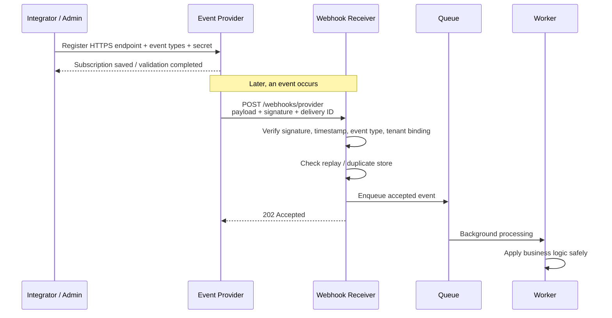
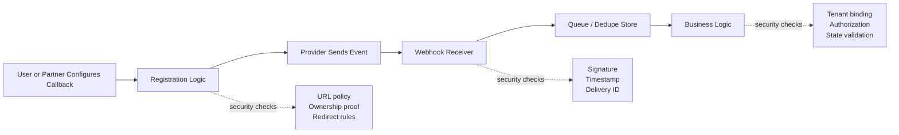

# Webhooks

> **Webhooks are event-driven HTTP callbacks: one system pushes a message to another when something happens. They seem simple, but they expand your API attack surface because they turn inbound receivers, callback registration flows, retries, and event-processing logic into security-critical paths.**

---

## 🧠 What Is It? (Beginner Explanation)

A normal API is usually **pull-based**:

- your app asks a server for data
- the server responds
- if you want updates, you ask again later

A webhook is **push-based**:

- an event happens in the source system
- the source system sends an HTTP request to your endpoint
- your system reacts to that event

Think of it like this:

- **API call:** “Has my package shipped yet?”
- **Webhook:** “Your package just shipped — here are the details.”

That makes webhooks fast and efficient for integrations, but it also means your application now exposes an endpoint that accepts **automated inbound requests from another system**. From a security perspective, that endpoint must be treated like any other internet-facing API endpoint: authenticated, validated, rate-aware, monitored, and designed for failure.

### Webhooks vs Polling vs APIs

| Model | Who starts communication? | Typical direction | Best for | Main trade-off |
|---|---|---|---|---|
| **Normal API request** | Client | Client → Server | On-demand reads and actions | Client must know when to ask |
| **Polling** | Client repeatedly | Client → Server | Simple periodic checks | Wasteful, delayed, noisy |
| **Webhook** | Source system | Source → Receiver | Real-time event notifications | Receiver must safely trust inbound events |
| **Message queue / event bus** | Producer publishes | Producer → Broker → Consumer | High-scale internal eventing | More infrastructure and operational complexity |

---

## 🏗️ How It Works (Technical Deep Dive)

A webhook integration usually has **two phases**:

1. **Registration / subscription**
   - A consumer tells the provider where to send events.
   - The provider stores:
     - destination URL
     - event types
     - secret or auth material
     - retry policy

2. **Delivery**
   - An event occurs.
   - The provider sends an HTTP `POST` request, usually over HTTPS.
   - The receiver validates the request.
   - The receiver returns a quick `2xx` response.
   - Actual business processing happens asynchronously.

### Common Characteristics

- **Usually asynchronous** — the source does not wait for full downstream business logic.
- **Usually at-least-once delivery** — duplicates are normal; exactly-once is rare.
- **Ordering is often not guaranteed** — event B may arrive before event A.
- **Retries are normal** — network failure, timeout, or `5xx` often trigger redelivery.
- **Provider-specific headers vary** — GitHub, Stripe, Slack, Shopify, and others all package metadata differently.

### Why Webhooks Matter to API Testers

Webhooks are part of API security because they often involve:

- **callback URL registration**
- **inbound public endpoints**
- **shared secrets or signed payloads**
- **business-critical side effects** like payments, user provisioning, CI/CD triggers, alerts, and ticketing
- **machine-to-machine trust** without a browser or normal user session

If you remember one sentence, remember this:

> **A webhook is just an untrusted HTTP request until origin, integrity, freshness, authorization, and duplicate handling are proven.**

---

## 📊 Diagram — Secure Webhook Lifecycle



### Mental Model

```text
Subscription setup  →  Event happens  →  Signed POST arrives
                                      ↓
                         Verify → Deduplicate → Queue → Process → Log
```

---

## ⚙️ Technical Details

### Core Webhook Terms

| Term | Meaning | Why it matters for security |
|---|---|---|
| **Event type** | Name of what happened, like `invoice.paid` or `push` | Receivers should allowlist expected types |
| **Endpoint URL** | Destination that receives the webhook | Registration security and SSRF controls matter |
| **Secret** | Shared key used to sign or verify events | Prevents spoofed requests if handled correctly |
| **Signature header** | Header carrying HMAC or vendor-specific signature | Receiver must verify against the raw body |
| **Delivery ID / Event ID** | Unique event identifier | Needed for replay and duplicate handling |
| **Timestamp** | When the sender created the event | Helps reject stale or replayed requests |
| **Retry policy** | Sender behavior after failure | Can cause duplicates and operational storms |
| **Idempotency** | Same event processed once even if delivered multiple times | Prevents duplicate charges, tickets, or state changes |
| **Challenge / handshake** | Validation step proving the endpoint is legitimate | Prevents abuse of arbitrary third-party URLs |

### Webhooks vs REST Endpoints

| Feature | REST API Endpoint | Webhook Receiver |
|---|---|---|
| **Primary direction** | Client calls service | Provider calls your service |
| **Typical initiator** | Browser, mobile app, script | SaaS platform, partner service, internal producer |
| **Main trust question** | “Is this caller allowed to request this action?” | “Did this provider truly send this event, and have we already handled it?” |
| **User session context** | Often yes | Often no — machine identity dominates |
| **Failure model** | Client retries or sees error | Provider retries later, maybe multiple times |
| **Common security control** | AuthN/AuthZ, schema validation, rate limiting | Signature verification, replay protection, idempotency, queueing |

### Typical Delivery Example

Different vendors use different headers, but the pattern is similar:

```http
POST /webhooks/github HTTP/1.1
Host: receiver.example.com
Content-Type: application/json
User-Agent: GitHub-Hookshot/abc123
X-GitHub-Event: issues
X-GitHub-Delivery: 72d3162e-cc78-11e3-81ab-4c9367dc0958
X-Hub-Signature-256: sha256=d57c68ca6f92289e6987922ff26938930f6e66a2d161ef06abdf1859230aa23c

{
  "action": "opened",
  "issue": {
    "number": 1347,
    "title": "Webhook test event"
  },
  "repository": {
    "full_name": "org/example"
  }
}
```

### Common Provider Headers

| Provider pattern | Example headers | What they help with |
|---|---|---|
| **GitHub-style** | `X-GitHub-Event`, `X-GitHub-Delivery`, `X-Hub-Signature-256` | Event routing, unique delivery tracking, HMAC verification |
| **Stripe-style** | `Stripe-Signature` | Signature + timestamp parsing for integrity and freshness |
| **CloudEvents-style** | `ce-id`, `ce-type`, `ce-source`, `ce-specversion` | Standardized metadata for interoperability |

### Delivery Semantics You Must Expect

#### 1. At-least-once delivery

Most webhook systems prefer reliability over uniqueness. If the sender is unsure whether you processed an event, it will send it again.

That means:

- duplicates are expected
- deduplication is a design requirement, not a bonus
- “we only saw this once in testing” is not evidence of safety

#### 2. Out-of-order delivery

If two related events are sent close together, network conditions or retry timing can reorder them.

Example:

```text
Expected business order:
user.created  →  user.updated  →  user.disabled

Possible arrival order:
user.updated  →  user.created  →  user.disabled
```

Receivers should not assume order unless the provider explicitly guarantees it.

#### 3. Short response windows

Providers usually expect a fast acknowledgment. GitHub recommends responding quickly; operational webhook platforms often expect a response in only a few seconds.

So the secure pattern is:

```text
Receive  →  Verify  →  Store / Queue  →  Respond 2xx  →  Process in background
```

#### 4. Explicit HTTP meaning

The CloudEvents HTTP Webhook specification is useful because it formalizes response expectations.

| Response | Meaning |
|---|---|
| **200 / 201** | Accepted and processed, optionally with details |
| **202** | Accepted but processing is deferred or status is not yet known |
| **204** | Accepted and processed, no body returned |
| **410** | Endpoint is retired; sender should stop sending |
| **415** | Payload format not understood |
| **429 + Retry-After** | Rate-limited; sender should back off |

In practice, vendor implementations vary, but this table is a good mental model.

### Standardization: CloudEvents and Webhook Specs

There is no single universal webhook format, which is why teams often struggle when integrating several providers.

Important standards and conventions include:

- **CNCF CloudEvents** — a common event metadata model
- **CloudEvents HTTP Webhook spec** — guidance for delivery, authorization, and abuse-protection handshakes
- **Vendor-specific signing schemes** — GitHub, Stripe, Slack, Twilio, Shopify, and others all have their own header formats

For testers, the lesson is simple:

> **Do not assume every webhook integration behaves the same way. Map the exact provider contract.**

---

## 🔐 Security Controls That Matter Most

### Receiver Security Checklist

| Control | Why it matters | What an authorized tester should verify |
|---|---|---|
| **HTTPS only** | Prevents interception and downgrade risk | Endpoint refuses plain HTTP or redirects safely to HTTPS |
| **Signature verification** | Prevents spoofed or tampered payloads | Invalid signatures are rejected before processing |
| **Raw body verification** | Some frameworks mutate JSON before verification | Receiver verifies the original bytes, not re-serialized JSON |
| **Constant-time compare** | Avoids subtle timing leaks in signature comparison | Code uses safe compare primitives |
| **Timestamp / freshness window** | Reduces replay risk | Old events are rejected or quarantined |
| **Delivery ID deduplication** | Prevents double processing | Same event ID cannot trigger side effects twice |
| **Event-type allowlist** | Reduces handler confusion and unexpected behavior | Unsupported event types are rejected or ignored safely |
| **Tenant binding** | Prevents cross-tenant mix-ups | Event is bound to the correct account, workspace, or installation |
| **Queue-based processing** | Avoids timeout-based retry storms | Endpoint acknowledges quickly and processes later |
| **Structured logging** | Enables incident review and debugging | Logs include delivery ID, provider, status, and reason without leaking secrets |

### Sender / Registration Security Checklist

| Control | Why it matters | What testers should review |
|---|---|---|
| **Destination validation** | Prevents SSRF and abuse of internal systems | URL policy blocks localhost, link-local, metadata, and unauthorized internal ranges |
| **Ownership verification** | Prevents sending to arbitrary third-party URLs | Registration challenge, secret proof, or approval flow exists |
| **No secrets in URL** | Query strings leak into logs, proxies, and browser history | Secrets are in headers or securely stored server-side, not in callback URLs |
| **Redirect handling policy** | Prevents bypass via open redirects or unexpected destinations | Sender does not follow redirects blindly |
| **Rate controls** | Prevents flooding and operational abuse | Retry limits, backoff, and dead-letter handling are defined |
| **Scoped subscriptions** | Reduces noise and blast radius | Only required events are subscribed |

### The Big Webhook Security Themes

1. **Integrity** — was the event altered?
2. **Authenticity** — did the expected sender generate it?
3. **Freshness** — is it recent, not a replay?
4. **Uniqueness** — have we already processed it?
5. **Authorization** — is this sender allowed to trigger this action for this tenant?
6. **Resilience** — can our system survive retries, delays, and malformed inputs?

---

## 🧪 Authorized API Testing Approach

> **Only test webhook senders, receivers, and registration flows that are explicitly in scope.** Many real integrations involve third-party SaaS platforms, and those platforms themselves may be out of scope even when the client’s receiver is in scope.

### 1. Confirm Scope and Ownership First

Before touching a webhook workflow, clarify:

- Is the **receiver** in scope?
- Is the **provider account / sandbox** in scope?
- Is the **callback registration feature** in scope?
- Are you allowed to test **replays, delayed acknowledgments, and malformed signatures** in staging?
- Are third-party services only part of the business flow, or are they also approved testing targets?

### 2. Map the Full Trust Boundary

For each webhook flow, identify:

- producer / sender
- receiver endpoint
- registration interface
- event types
- secret storage location
- retry behavior
- background processing path
- downstream systems changed by the event

This matters because many findings are not on the HTTP endpoint alone. The real weakness may live in:

- registration logic
- worker logic
- tenant mapping
- retry / dedupe storage
- logging pipelines

### 3. Use Benign, Approved Test Events

In authorized testing, prefer:

- provider sandbox accounts
- staging environments
- harmless event types like test notifications
- company-controlled callback URLs

Avoid destructive events unless they are explicitly approved.

### 4. Verify the Receiver Defensively

A professional webhook review should answer questions like:

- Does the receiver reject requests with a missing or invalid signature?
- Is the signature calculated over the **raw request body**?
- Are timestamps checked to limit stale-event replay?
- Are duplicate delivery IDs ignored or safely treated as already processed?
- Are unsupported event types rejected?
- Does the endpoint queue work instead of processing synchronously?
- Are secrets excluded from logs and error messages?

### 5. Review Callback Registration for SSRF Risk

Callback registration is one of the most important webhook security topics.

If a platform lets users supply an arbitrary destination URL, the application may become an SSRF or abuse primitive unless it enforces strong policy.

Defensive review points:

- Is HTTPS required?
- Are loopback, RFC1918, link-local, and cloud metadata destinations blocked?
- Are redirects prohibited or strictly revalidated?
- Is the destination ownership validated before activation?
- Are domain and IP checks repeated after DNS resolution, not just before it?

This is exactly why OWASP’s SSRF guidance explicitly calls out custom webhook / callback URLs as a common risk area.

### 6. Validate Business Logic, Not Just Crypto

A perfectly signed webhook can still be dangerous if business logic is weak.

Examples of questions to ask:

- Can one tenant’s event affect another tenant’s data?
- Can a low-trust partner trigger high-trust internal actions?
- Does `user.deleted` actually verify the sender’s identity and installation context?
- Can stale but valid events revert security-sensitive state?
- Does a “paid” or “approved” event trigger action without server-side reconciliation?

In other words:

> **Signature verification proves who sent the envelope, not whether the enclosed action should be trusted blindly.**

---

## 📊 Diagram — Webhook Trust Boundary



---

## 🛠️ Safe Validation Ideas for Authorized Testing

These are **defensive, low-risk validation ideas** suitable for approved testing in labs, staging, or explicitly authorized environments.

| Check | Safe way to validate | Expected secure behavior |
|---|---|---|
| **Invalid signature handling** | Send an approved test event with a deliberately wrong signature in staging | Receiver returns `401/403` and performs no business action |
| **Raw-body dependence** | Replay the same benign JSON after harmless formatting changes | Signature verification fails if raw bytes changed |
| **Replay handling** | Re-send the exact same benign delivery ID in an approved environment | Duplicate is ignored, logged, or marked already processed |
| **Unsupported event types** | Send a harmless but unregistered event name from a test harness | Receiver ignores or rejects it safely |
| **Queue-first design** | Trigger a benign event and observe whether the endpoint acknowledges quickly | Receiver returns fast and processes asynchronously |
| **URL registration policy** | Try approved policy-negative test cases such as non-HTTPS or explicitly forbidden internal-style destinations in a lab | Registration blocks unsafe destinations with clear policy errors |
| **Redirect handling** | Use controlled test endpoints that return redirects to other controlled destinations | Sender refuses or revalidates the destination before following |
| **Secret rotation** | Rotate webhook secret in staging and test old vs new secret behavior | Old secret stops working promptly; new secret succeeds |

### Practical Tip

When testing webhook receivers, keep a simple evidence set:

- original request body
- all webhook headers
- delivery ID
- response status and timing
- observed downstream effect
- log entries or audit trail

That evidence makes it much easier to distinguish:

- signature failures
- replay handling
- duplicate processing
- event routing mistakes
- downstream logic flaws

---

## 🚨 Common Failure Modes

| Failure | What it usually means | Likely impact |
|---|---|---|
| **No signature verification** | Receiver trusts any inbound request | Spoofed events and unauthorized actions |
| **Signature checked after JSON parsing** | Framework changed whitespace, encoding, or order | Broken verification or unsafe fallback behavior |
| **No replay protection** | Delivery IDs or timestamps are ignored | Duplicate actions, duplicate credits, duplicate provisioning |
| **Secrets embedded in URLs** | Query strings used as auth | Secret leakage via logs, proxies, analytics, history |
| **No URL validation on registration** | Arbitrary destinations allowed | SSRF, abuse of internal services, delivery to wrong targets |
| **Blind redirect following** | Sender accepts 3xx to new location | Validation bypass and unsafe destination changes |
| **No event allowlist** | Receiver processes unexpected types | Logic confusion and accidental trigger paths |
| **No tenant binding** | Receiver trusts event content without account mapping | Cross-tenant data changes or privilege mistakes |
| **Synchronous heavy processing** | Receiver performs full workflow before reply | Timeouts, retries, duplicate deliveries, self-amplified load |
| **Insufficient observability** | No delivery IDs or decision logs retained | Hard incident response and weak forensics |

---

## 🧩 Defensive Verification Pattern

This pseudocode shows the security order that a receiver should follow:

```python
import hashlib
import hmac
import json
from datetime import datetime, timezone

ALLOWED_EVENTS = {"invoice.paid", "invoice.failed"}
MAX_AGE_SECONDS = 300

def handle_webhook(request, secret, replay_cache, queue):
    raw_body = request.body_bytes()                  # exact bytes, not parsed JSON
    signature = request.header("Stripe-Signature")  # provider-specific format in reality
    event_type = request.header("X-Event-Type")
    event_id = request.header("X-Delivery-Id")
    timestamp = int(request.header("X-Event-Timestamp"))

    expected = hmac.new(secret, raw_body, hashlib.sha256).hexdigest()
    if not hmac.compare_digest(expected, signature):
        return 401

    now = int(datetime.now(timezone.utc).timestamp())
    if abs(now - timestamp) > MAX_AGE_SECONDS:
        return 403

    if event_type not in ALLOWED_EVENTS:
        return 415

    if replay_cache.seen(event_id):
        return 200

    replay_cache.store(event_id)
    payload = json.loads(raw_body)
    queue.enqueue({"event_id": event_id, "event_type": event_type, "payload": payload})
    return 202
```

### Why this order matters

1. **Verify integrity first**
2. **Check freshness**
3. **Apply routing / allowlist logic**
4. **Stop duplicates**
5. **Queue work**
6. **Process later with tenant-aware business rules**

That order is simple, memorable, and operationally safe.

---

## 🧠 What Advanced Testers Should Remember

As webhook programs mature, the hardest problems are usually **not** “can I hit the endpoint?”

They are:

- **Can the platform safely let users register destinations at all?**
- **Can the receiver prove this event is authentic and fresh?**
- **Can the system survive duplicate and out-of-order deliveries?**
- **Can downstream business logic distinguish a valid event from a valid-but-dangerous one?**

This is why webhook testing sits at the intersection of:

- API security
- SSRF prevention
- machine identity
- event-driven architecture
- reliability engineering
- business logic validation

---

## ✅ Quick Assessment Checklist

```text
[ ] Scope for sender, receiver, and callback registration confirmed
[ ] HTTPS enforced
[ ] Secret stored securely and rotated safely
[ ] Signature verified against raw body
[ ] Constant-time comparison used
[ ] Timestamp / replay window enforced
[ ] Delivery ID deduplication implemented
[ ] Event types explicitly allowlisted
[ ] Tenant / installation context validated
[ ] Callback URLs restricted by policy
[ ] Redirect behavior defined and safe
[ ] Processing is asynchronous
[ ] Logs include delivery ID without leaking secrets
[ ] Retry, dead-letter, and alerting paths documented
```

---

## 📚 References

- GitHub Docs — *Validating webhook deliveries*  
  https://github.com/github/docs/blob/main/content/webhooks/using-webhooks/validating-webhook-deliveries.md
- GitHub Docs — *Best practices for using webhooks*  
  https://github.com/github/docs/blob/main/content/webhooks/using-webhooks/best-practices-for-using-webhooks.md
- GitHub Docs — *Webhook events and payloads*  
  https://github.com/github/docs/blob/main/content/webhooks/webhook-events-and-payloads.md
- Stripe Docs — *Resolve webhook signature verification errors*  
  https://docs.stripe.com/webhooks/signature
- OWASP Cheat Sheet Series — *Server-Side Request Forgery Prevention Cheat Sheet*  
  https://github.com/OWASP/CheatSheetSeries/blob/master/cheatsheets/Server_Side_Request_Forgery_Prevention_Cheat_Sheet.md
- Svix — *Receiving Webhooks Best Practices*  
  https://www.svix.com/resources/webhook-best-practices/receiving/
- Hookdeck — *What Are Webhooks and How Do They Work?*  
  https://hookdeck.com/webhooks/guides/what-are-webhooks-how-they-work
- CNCF CloudEvents — *HTTP 1.1 Web Hooks for Event Delivery*  
  https://github.com/cloudevents/spec/blob/v1.0.2/cloudevents/http-webhook.md
