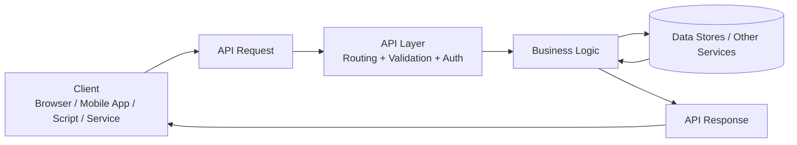
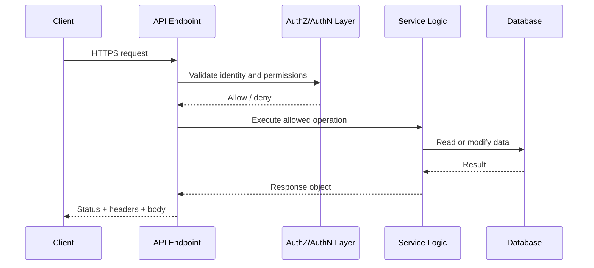
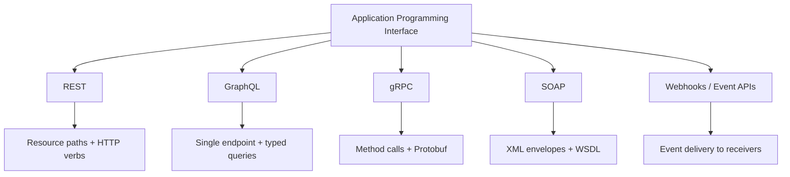
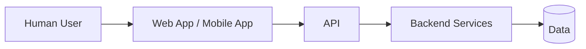
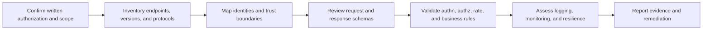

# What Is an API?

> **Difficulty:** Beginner → Advanced | **Category:** API Pentesting — Fundamentals

An **API (Application Programming Interface)** is a defined way for one piece of software to ask another piece of software for **data**, **actions**, or **state changes**. In modern security work, "API" usually means a **web API** exposed over HTTP, but the core idea is broader: an API is a **contract** that says:

- what requests are allowed
- what data format is expected
- what responses can come back
- who is allowed to do what

For authorized security testing, APIs matter because they often expose the **real business logic** of an application more directly than the user interface does.

---

## Table of Contents

1. [The Core Idea](#1-the-core-idea)
2. [Why APIs Exist](#2-why-apis-exist)
3. [A Simple Mental Model](#3-a-simple-mental-model)
4. [What an API Request Actually Contains](#4-what-an-api-request-actually-contains)
5. [Types of APIs You Will Encounter](#5-types-of-apis-you-will-encounter)
6. [API Styles at a Glance](#6-api-styles-at-a-glance)
7. [APIs vs Web Apps vs Web Services](#7-apis-vs-web-apps-vs-web-services)
8. [Why APIs Matter So Much in Security](#8-why-apis-matter-so-much-in-security)
9. [How an Authorized API Tester Thinks](#9-how-an-authorized-api-tester-thinks)
10. [Beginner → Advanced Mental Progression](#10-beginner--advanced-mental-progression)
11. [Common Misconceptions](#11-common-misconceptions)
12. [Key Takeaways](#12-key-takeaways)
13. [Further Reading](#13-further-reading)

---

## 1. The Core Idea

At the simplest level, an API is a **structured conversation between systems**.

Instead of a human clicking buttons in a browser, software sends a request like:

```http
GET /api/v1/products/42 HTTP/1.1
Host: shop.example
Accept: application/json
Authorization: Bearer <token>
```

And receives a structured response:

```json
{
  "id": 42,
  "name": "USB-C Dock",
  "price": 89.99,
  "currency": "USD"
}
```

That example shows the essence of an API:

- a **client** asks for something
- a **server** processes the request
- the server returns a **machine-readable response**

> **Key insight:** A web page is mainly designed for **humans**. An API is mainly designed for **software**.

---

## 2. Why APIs Exist

Modern applications almost never consist of one monolithic frontend talking directly to one database. APIs exist because organizations need a reliable way to let different systems interact.

### Common reasons APIs exist

| Reason | What it means in practice |
|--------|----------------------------|
| **Separation of concerns** | Frontend, mobile app, backend services, and partners can evolve independently |
| **Reuse** | The same backend logic can serve web, mobile, CLI, automation, and third parties |
| **Automation** | Machines can integrate without human interaction |
| **Scalability** | Teams can split systems into services with clear boundaries |
| **Standardization** | Requests and responses follow agreed formats and schemas |
| **Ecosystem growth** | Partners, vendors, and internal teams can build on top of the platform |

### Real-world examples

- A mobile banking app calls an API to fetch account balances.
- A SaaS platform exposes an API so customers can automate provisioning.
- A CI/CD system receives a webhook when code is pushed.
- An internal microservice calls another service's API to validate inventory before checkout.

---

## 3. A Simple Mental Model

Beginners often hear the "restaurant waiter" analogy. It is useful, but incomplete.

For security testing, a better mental model is:

> **An API is a contract + gateway + policy enforcement point + business logic entry point.**



This matters because the API layer often decides:

- whether the caller is authenticated
- whether the caller is authorized
- what fields are exposed
- what actions are allowed
- how rate limits and quotas work
- what gets logged, cached, or forwarded

### Three ways to think about an API

| Mental model | Good for understanding | Security limitation if you stop there |
|--------------|------------------------|----------------------------------------|
| **Menu** | What functions are available | Menus hide backend trust decisions |
| **Contract** | Inputs, outputs, schemas, versioning | Contracts do not guarantee secure enforcement |
| **Control plane for actions and data** | How real systems expose business operations | Requires thinking about identity, authorization, and service-to-service trust |

---

## 4. What an API Request Actually Contains

An API request is more than "just a URL." Each part can affect security and functionality.

### Request anatomy

| Part | Purpose | Example | Why testers care |
|------|---------|---------|------------------|
| **Method** | Tells the server the intended action | `GET`, `POST`, `PATCH`, `DELETE` | Different methods may enforce different controls |
| **Path / endpoint** | Identifies the resource or function | `/api/v1/users/42` | Hidden or deprecated paths expand attack surface |
| **Headers** | Metadata about the request | `Authorization`, `Content-Type` | Tokens, API keys, proxy headers, and content negotiation live here |
| **Query parameters** | Filtering, search, pagination, options | `?page=2&limit=20` | Often influence access control, data scope, or expensive operations |
| **Body** | Structured input | JSON, XML, Protobuf | Validation, deserialization, and mass assignment issues begin here |
| **Cookies / sessions** | Stateful identity | `sessionid=...` | Some APIs are not truly stateless |
| **TLS context** | Transport security properties | HTTPS, mTLS | Client identity and confidentiality may depend on it |

### Response anatomy

| Part | Purpose | Example |
|------|---------|---------|
| **Status code** | High-level outcome | `200`, `401`, `403`, `404`, `429`, `500` |
| **Headers** | Metadata and policy | `Cache-Control`, `Set-Cookie`, rate-limit headers |
| **Body** | Returned data or error info | JSON object, XML, file, stream |
| **Timing / size** | Behavioral signals | Slow responses, very large responses, empty responses |

### Basic request/response flow



> **Important:** Security decisions are often distributed across gateways, middleware, services, and databases. That is why API testing is rarely just "send one request and read one response."

---

## 5. Types of APIs You Will Encounter

Not every API is public, and not every API is intended for the same audience.

### By exposure

| Type | Audience | Example | Security implication |
|------|----------|---------|----------------------|
| **Public API** | External developers or customers | Payment platform API | Strong authentication, abuse protection, and docs are critical |
| **Partner API** | Specific trusted third parties | Logistics or reseller integration | Trust assumptions often become blind spots |
| **Internal API** | Internal teams and services | HR service, billing service | "Internal" often becomes "weakly protected" over time |
| **Private API** | App-specific backend consumed by first-party clients | Mobile app backend | Often undocumented but still internet reachable |

### By communication pattern

| Pattern | Description | Example |
|---------|-------------|---------|
| **Request/response** | Client asks, server replies immediately | Standard REST call |
| **Streaming** | Data flows continuously | Event or telemetry stream |
| **Event-driven** | Producer sends events to consumers | Webhooks, message queues |
| **Synchronous** | Caller waits for completion | `POST /checkout` returns result |
| **Asynchronous** | Work continues after request returns | Job submission with later callback or polling |

### By identity model

| Identity model | Example |
|----------------|---------|
| **User identity** | Browser session, OAuth access token |
| **Application identity** | API key, client credential |
| **Machine identity** | Service account, workload identity, mTLS cert |
| **Mixed identity** | User token passed through service chain |

Machine identity is especially important in modern architectures because many high-value APIs are called more often by **services** than by human users.

---

## 6. API Styles at a Glance

The word "API" is broad. Security testers should know that different API styles have different discovery methods, tooling, and risks.

| Style | Core idea | Common format | Typical shape | Security notes |
|------|-----------|---------------|---------------|----------------|
| **REST** | Resource-oriented HTTP API | JSON | Many endpoints such as `/users/42` | Common; authorization and inventory mistakes are frequent |
| **GraphQL** | Query language for selecting exactly needed fields | JSON | Often one `/graphql` endpoint | Field-level access, introspection, and query cost matter |
| **gRPC** | Remote procedure calls over HTTP/2 | Protobuf | Service methods defined in `.proto` files | Efficient but less transparent; reflection and service trust matter |
| **SOAP** | XML-based messaging with formal contracts | XML | WSDL-described operations | Still common in enterprises; XML parsing and legacy exposure matter |
| **Webhooks** | Server pushes events to another system | Usually JSON | Outbound event delivery to receiver URL | Signature verification, replay handling, and trust validation matter |

### Visual map of modern API styles



> **Practical takeaway:** "API security" does not mean only REST. Modern attack surface often includes GraphQL, gRPC, webhooks, mobile-only endpoints, partner integrations, and internal service APIs behind gateways.

---

## 7. APIs vs Web Apps vs Web Services

These terms overlap, but they are not identical.

| Term | Plain meaning | Human-facing? | Example |
|------|---------------|---------------|---------|
| **Web app** | An application people use through a browser | Usually yes | Online banking dashboard |
| **API** | A programmatic interface for software-to-software communication | Usually no | `/api/v1/accounts` |
| **Web service** | A network-accessible service, often an older umbrella term | Sometimes | SOAP service, REST service |

### Simple relationship



In many real systems:

- the **web app** is the user interface
- the **API** is how that interface talks to the backend
- the **backend services** may call additional internal or third-party APIs

This is why a beautiful frontend can hide a messy API estate underneath.

---

## 8. Why APIs Matter So Much in Security

APIs are high-value targets because they are built for **consistency**, **automation**, and **direct access to data and actions**.

### Why attackers and testers care about APIs

| Property | Why it matters |
|----------|----------------|
| **Predictable structure** | Consistent paths, schemas, and parameters make automation easy |
| **Data density** | One endpoint may return sensitive account, profile, billing, or metadata records |
| **Direct business logic access** | APIs expose actions like transfer, approve, reset, invite, purchase, or delete |
| **Multiple trust paths** | Browsers, mobile apps, partners, bots, and internal services may all reach the same logic |
| **Hidden inventory** | Old versions, shadow APIs, debug routes, and internal endpoints are commonly forgotten |
| **Machine-to-machine trust** | Service tokens, API keys, and workload identities expand the trust boundary |

### Current defensive themes reflected in major guidance

OWASP API Security Top 10 (2023) highlights that the biggest API risks are not just "classic hacking bugs." They also include:

- **broken object-level authorization**
- **broken authentication**
- **property-level authorization mistakes**
- **resource consumption abuse**
- **sensitive business flow abuse**
- **inventory and version management failures**
- **unsafe trust in third-party APIs**

### Why API incidents often look different from classic web bugs

Instead of a single flashy exploit, real API compromise often looks like:

1. a valid or stolen credential reaches an API
2. the caller is authenticated but not properly constrained
3. the API exposes too much data, too much functionality, or too much rate
4. automation turns a weak design choice into a major incident

> **Key insight:** Many damaging API failures are really **trust failures**. The API trusted the wrong identity, the wrong object reference, the wrong client, the wrong downstream service, or the wrong assumption about scale.

---

## 9. How an Authorized API Tester Thinks

Defensive API security testing is not about randomly "trying payloads." It is about understanding the system's contract and verifying whether the implementation actually enforces it.

### Safe, authorized tester question stack

| Question | Why it matters |
|----------|----------------|
| **What APIs exist?** | Inventory is the first control and the first test problem |
| **Who can call them?** | Identity models vary across browser users, mobile users, partners, and services |
| **What objects do they expose?** | Object identifiers often reveal authorization boundaries |
| **What actions do they allow?** | APIs expose business operations, not just data retrieval |
| **What fields do they return or accept?** | Property-level exposure and unsafe mass updates often live here |
| **What limits exist?** | Rate, quota, pagination, cost, and concurrency controls are part of security |
| **What other systems do they trust?** | Third-party APIs, gateways, webhooks, and internal services expand risk |

### Authorized testing flow



### What good API testing focuses on

- **Coverage** — finding the real API estate, not just documented endpoints
- **Context** — understanding who should be allowed to do what
- **Validation** — checking whether the implementation matches the intended policy
- **Safety** — staying within scope, protecting data, and avoiding destructive behavior
- **Remediation value** — giving developers and defenders actionable fixes

> **Authorized-testing rule:** In API work, "I got a `200 OK`" is never the end of the story. The real question is whether the right identity got the right data and the right action for the right reason.

---

## 10. Beginner → Advanced Mental Progression

This is a useful learning ladder for API security.

| Level | What you understand | Typical mindset |
|------|----------------------|-----------------|
| **Beginner** | APIs are structured ways for software to talk | "A client sends a request and gets a response." |
| **Intermediate** | APIs expose resources, actions, schemas, and identities | "Different clients and protocols use the same backend logic." |
| **Advanced** | APIs are trust boundaries with authorization, versioning, and business rules | "Every object, field, action, and flow needs explicit enforcement." |
| **Professional** | APIs are distributed systems with machine identity, third-party dependencies, and inventory drift | "Security depends on end-to-end trust, not just one endpoint." |

### Advanced mental model

At an advanced level, you stop seeing an API as "just JSON over HTTP" and start seeing it as:

- an **interface contract**
- an **authorization surface**
- a **business workflow controller**
- a **machine identity boundary**
- a **distributed systems dependency layer**

That shift is what separates casual API awareness from real API security understanding.

---

## 11. Common Misconceptions

| Misconception | Reality |
|---------------|---------|
| **"APIs are only for developers."** | APIs are core business infrastructure used by apps, partners, automations, and services |
| **"If the frontend hides it, users cannot reach it."** | Clients can often replay, inspect, or script API traffic directly |
| **"Authenticated means secure."** | Authentication only proves identity; authorization and abuse controls still matter |
| **"Internal APIs are safe by default."** | Internal exposure often becomes external through gateways, proxies, VPNs, or compromise |
| **"Only REST counts as API security."** | GraphQL, gRPC, SOAP, webhooks, and event-driven integrations all matter |
| **"An API is just a data pipe."** | APIs often expose sensitive business actions, not just records |

---

## 12. Key Takeaways

- An API is a **defined interface** for software-to-software communication.
- In practice, modern APIs expose both **data** and **business actions**.
- APIs are central to web apps, mobile apps, partner integrations, microservices, and automation.
- Security testing focuses on whether the API's **contract and trust model** are enforced correctly.
- The most important API risks often involve **authorization, inventory, identity, trust, and business flow abuse**, not just classic injection flaws.

If you remember only one sentence, remember this:

> **An API is where systems make promises to each other — and API security is about verifying those promises under real trust conditions.**

---

## 13. Further Reading

- **OWASP API Security Top 10 (2023):** https://owasp.org/API-Security/
- **GitHub Docs — About the REST API:** https://docs.github.com/en/rest/about-the-rest-api/about-the-rest-api
- **GitHub Docs — About Webhooks:** https://docs.github.com/en/webhooks/about-webhooks
- **GraphQL Official Learn — Introduction:** https://graphql.org/learn/introduction/
- **gRPC Official Docs — Introduction to gRPC:** https://grpc.io/docs/what-is-grpc/introduction/
- **Google API Improvement Proposals / API design guidance:** https://aip.dev/

