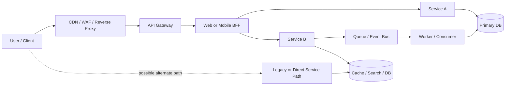
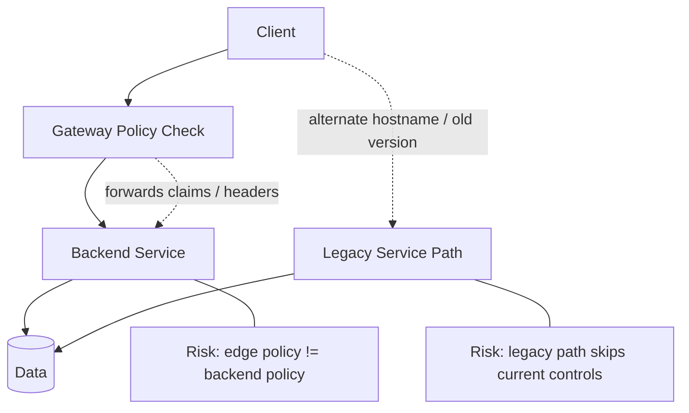

# API Architecture Overview

> **Modern API security testing starts with architecture: understand where requests enter, how identity moves, where policy is enforced, and which “internal” paths can quietly become external attack surface.**

---

## 🧠 What Is It? (Beginner Explanation)

API architecture is the **shape of the system behind an API**.

When a user opens a mobile app and taps **View Orders**, that request usually does **not** go straight to one server and one database. It may pass through:

- a CDN or reverse proxy
- a web application firewall (WAF)
- an API gateway
- an authentication service
- a backend-for-frontend (BFF)
- multiple microservices
- a message queue or event bus
- caches, databases, search indexes, and logging systems

That full path is the architecture.

A simple way to remember it:

- **API endpoint** = the visible door
- **Architecture** = the whole building behind the door
- **Security testing** = checking every hallway, badge check, side entrance, and service elevator that affects access

If you only look at the visible endpoint, you miss how modern API failures really happen:

- the gateway blocks one route, but an old service path still works
- the frontend is denied, but a mobile-specific BFF exposes more data
- the edge validates a token, but backend services trust headers too much
- REST calls are monitored, but webhook or event-driven paths are not
- service-to-service traffic is encrypted, but object-level authorization is still missing

---

## ✅ Authorized Testing Framing

This topic should always be applied in a **defensive, authorized** context.

Use architecture knowledge to:

- map the in-scope API surface correctly
- understand trust boundaries before testing deeper
- validate whether security controls are consistent across layers
- find design weaknesses safely, without disruptive or abusive behavior
- recommend hardening, monitoring, and inventory improvements

For authorized API assessments, architecture review is usually the step that prevents wasted effort and reduces risk to production systems.

---

## 🏗️ Why Architecture Matters to API Security

OWASP API Security Top 10 2023 highlights patterns that are strongly architectural, not just request-level bugs: **broken authorization, unrestricted resource consumption, security misconfiguration, improper inventory management, and unsafe consumption of APIs** (see References).

That matters because API risk often comes from **how components trust each other**, not just from a single bad parameter.

### Practical examples

| Architectural condition | What it looks like | Why testers care |
|---|---|---|
| **Gateway-centric security** | Auth, throttling, and logging happen mostly at the edge | If backend services trust the gateway too much, direct or alternate paths may bypass intended controls |
| **Microservices sprawl** | Many internal APIs, service accounts, and east-west calls | More trust boundaries, more policy drift, more inventory problems |
| **Multiple client-specific APIs** | Web, mobile, and partner APIs expose similar business actions differently | One client path may leak fields or expose weaker authorization than another |
| **Heavy async processing** | Webhooks, queues, event buses, background workers | Security moves beyond HTTP into signing, replay handling, and trusted message processing |
| **Fast release cycles** | `/v1`, `/v2`, `/beta`, mobile versions, experimental routes | Old or shadow APIs frequently survive longer than defenders think |

---

## 📊 Diagram — A Modern API Request Path



### What this diagram teaches

- **North-south traffic**: client to edge to application
- **East-west traffic**: service-to-service communication inside the environment
- **Async flow**: queues and workers extend the API trust path beyond immediate responses
- **Alternate paths**: direct-to-service, legacy, or forgotten routes are often where policy drift appears

---

## 🧩 Core Building Blocks in API Ecosystems

| Component | Main job | Security value | Security blind spot if misunderstood |
|---|---|---|---|
| **Reverse proxy / load balancer** | Route traffic to applications | Hides internals, handles TLS, distributes load | Can be mistaken for a full security layer |
| **API gateway** | Central entry point for auth, routing, throttling, logging, transformation | Good place for cross-cutting controls | Cannot replace object-, property-, or function-level authorization in the app |
| **BFF** | Tailor responses for one client type | Reduces chatty clients, simplifies UX-specific shaping | Can duplicate logic and introduce inconsistent policy |
| **Microservice** | Own a business capability | Clearer ownership and scaling | More internal trust boundaries and service identities to manage |
| **Service discovery** | Map service names to live instances | Supports resilient routing | Hidden services may still be reachable through internal DNS or mesh paths |
| **Service mesh** | Manage east-west traffic policy, mTLS, telemetry | Strong workload identity and encrypted service traffic | Mesh identity is not the same as user authorization |
| **Message queue / event bus** | Decouple producers and consumers | Scales workflows and async processing | Replay, unsigned events, dead-letter exposure, and weak consumer trust |
| **Cache / search index / replica** | Improve speed and data access | Better performance and resiliency | Often stores sensitive data with weaker access assumptions |
| **Identity provider** | Issue tokens / service credentials | Central identity foundation | Correct token issuance does not guarantee correct authorization downstream |

---

## 🔐 The Trust Boundaries That Matter Most

If you are learning API security, this is the most important concept in the note.

A **trust boundary** is the place where one system, role, identity, or network zone starts trusting data from another.

### Key trust boundaries

| Boundary | Questions to ask | Common weakness |
|---|---|---|
| **Client → Edge** | Who is the caller? Which tokens, cookies, API keys, or client certs are accepted? | Weak auth, bad rate limits, exposed debug routes |
| **Edge → Backend** | Which headers, claims, or identity context are forwarded? | Backend trusts spoofable headers or missing claims |
| **Service → Service** | How do workloads authenticate each other? | Shared service credentials, weak mTLS rollout, over-broad service trust |
| **Service → Data store** | Is tenant and object isolation enforced before data access? | Backend can read too broadly, leading to BOLA/BOPLA-style failures |
| **Producer → Event consumer** | How are events authenticated, deduplicated, and validated? | Unsigned events, replay, schema trust, privileged workers |
| **Admin / control plane → runtime** | Who can change routes, policies, certificates, or versions? | Misconfiguration, overexposed admin APIs, stale policies |

---

## 🧭 Common API Architecture Patterns

### Architecture pattern comparison

| Pattern | Good for | Typical security benefit | Typical tester concern |
|---|---|---|---|
| **Monolith behind one API** | Simpler products or early platforms | Fewer moving parts, easier inventory | Large blast radius and broad privileges inside one app |
| **Gateway + microservices** | Large modular platforms | Centralized edge controls and service separation | Policy drift between gateway and backend services |
| **Backend for Frontend (BFF)** | Different web/mobile/client needs | Tailored payloads and reduced client complexity | Different clients may get different security behavior |
| **Service mesh-enabled platform** | High-scale east-west service communication | mTLS, workload identity, traffic policy, telemetry | Teams assume the mesh solved authorization when it mostly solved transport security |
| **Event-driven API ecosystem** | Async workflows, integrations, webhooks | Resilience and decoupling | Security teams focus on HTTP and miss message security entirely |
| **Partner / third-party integrated API** | Ecosystem and business integrations | Clear integration boundaries | Over-trusting external data or external service identity |

---

## ⚙️ Deep Dive: How Modern API Architecture Works

### 1. Edge Layer: Reverse Proxy, WAF, Load Balancer, API Gateway

At the edge, requests are usually terminated, filtered, and routed.

Microsoft’s cloud-native guidance describes API gateways as a useful middle tier that reduces client coupling, centralizes cross-cutting concerns, and can support client-specific gateways when systems grow (see References).

In practice, the edge often handles:

- TLS termination
- authentication checks
- rate limiting and quotas
- request routing
- protocol translation
- header normalization
- request/response logging

### Why security testers care

Because the edge is usually the **first** policy enforcement point, teams sometimes treat it like the **only** policy enforcement point.

That is dangerous.

If the gateway says:

- “token is valid”
- “request comes from trusted source”
- “this route exists”

…the backend still must decide:

- “may this user access **this object**?”
- “may this role perform **this function**?”
- “should this property be returned or updated?”

**Key lesson:** edge controls are valuable, but they do **not** replace application-level authorization.

---

### 2. Microservices: More Separation, More Trust Boundaries

Microservices split one application into multiple smaller services, each focused on a business capability such as users, billing, orders, inventory, or search.

This helps scalability and team ownership, but it also creates new security questions:

- Does every service validate identity consistently?
- Are internal APIs exposed only through intended paths?
- Do services share credentials or have unique identities?
- Are background workers more privileged than public APIs?
- Can one weak internal service become a pivot into others?

A helpful mental model:

- **Monolith risk** = one big application with wide privilege inside
- **Microservice risk** = many smaller applications with many trust relationships between them

Neither model is automatically secure. The security difference is in **identity, policy consistency, inventory, and observability**.

---

### 3. Direct-to-Service Paths and “Internal” APIs

A useful way to analyze API architecture is to separate **edge trust boundaries** from **backend trust boundaries** and to look for **direct-to-service access paths**.

This is a real-world issue.

A route may be intended to follow this path:

```text
Client -> Gateway -> Service
```

But in practice, a second path may exist:

```text
Client -> Old hostname / internal ingress / partner network / legacy route -> Service
```

This is why “internal” should never mean “trusted by default.”

### Common reasons these paths appear

- old versions left online during migration
- staging or preview ingress accidentally reachable
- partner or mobile routes forgotten in inventory
- service discovery or ingress rules exposing more than expected
- private network assumptions treated as security controls

OWASP API9:2023 explicitly calls out **improper inventory management** and deprecated versions as major API risk (see References).

---

### 4. Backend for Frontend (BFF)

A **BFF** is a client-specific API layer. One BFF may exist for web, another for mobile, another for partner integrations.

Why teams use it:

- mobile apps need smaller payloads
- web apps may aggregate more data for one screen
- clients evolve at different speeds
- the platform wants one stable internal service model and several external facades

This pattern is legitimate and useful, but it changes the test plan.

### Tester focus for BFFs

Check whether the **same business action** behaves differently across:

- web API
- mobile API
- partner API
- internal admin API

Common issues in BFF-heavy designs:

- one client gets more fields than another
- one client path enforces stricter scopes than another
- the BFF caches sensitive data differently
- rate limits exist at one facade but not another
- legacy mobile versions remain supported with weaker controls

---

### 5. Versioning, Compatibility, and Zombie APIs

APIs are contracts. Once clients depend on them, removing or changing behavior is risky.

Zalando’s REST guidelines strongly emphasize backward compatibility, careful deprecation, and avoiding breaking consumers without a managed versioning strategy (see References).

### Common versioning styles

| Style | Example | Security implication |
|---|---|---|
| **URI path** | `/api/v1/orders` | Easy to inventory, but old versions often linger |
| **Header-based** | `Accept: application/vnd.example.v2+json` | Harder to spot in passive logging or route reviews |
| **Hostname / subdomain** | `api-v2.example.com` | Easy to forget during DNS and certificate lifecycle |
| **Date/version parameter** | `?version=2024-09-01` | Can create hidden compatibility branches |
| **Client-version behavior** | mobile app version controls backend behavior | Risky when older app clients are supported too long |

### What mature teams do well

- define a clear deprecation policy
- measure which clients still use old versions
- avoid breaking changes when compatible evolution is possible
- retire routes, docs, certificates, and monitoring together

### What security testers should notice

- old versions still exposed
- response fields differ by version
- older versions miss newer auth or rate-limit controls
- “beta” or “preview” routes are treated informally and logged poorly
- documentation and reality no longer match

---

### 6. Service Discovery and Service Mesh

Service discovery answers a simple question:

> **When Service A needs Service B, how does it know where to send the request?**

In dynamic environments, service instances come and go. Discovery systems and meshes help route traffic correctly.

A **service mesh** adds stronger east-west controls such as:

- workload identity
- mutual TLS (mTLS)
- traffic policy
- telemetry and auditing
- centralized service-to-service authorization policies

Istio’s security model is useful here because it stresses **strong identity, mTLS, authorization, auditing, and zero-trust assumptions for service communication** (see References).

### Important security insight

A service mesh can prove:

- *which workload is calling*
- *whether transport is encrypted*
- *which service-level policy applies*

A service mesh usually does **not** decide:

- whether user `123` may read order `456`
- whether a support role may see payment metadata
- whether a mobile token may trigger an admin-only action

So the mesh is powerful, but it solves a different layer of the problem.

---

### 7. Event-Driven and Async API Architecture

Many API ecosystems are no longer purely request/response.

A public API call may trigger:

- a queue message
- a webhook to a third party
- a background worker
- a fraud-scoring pipeline
- a search indexing job
- a billing or notification event

That means the real architecture is bigger than the visible HTTP response.

### Why this changes security testing

A secure synchronous API can still be weakened by insecure async handling:

- webhook signatures are missing or verified incorrectly
- consumers trust event fields too much
- replay handling is weak
- dead-letter queues expose sensitive payloads
- failed jobs are reprocessed in unsafe ways
- workers hold broader privileges than front-door APIs

### Easy way to remember it

- **REST path** tells you what happens now
- **Event path** tells you what happens next

Good API security testing maps both.

---

### 8. Data Layer, Multi-Tenancy, and Derived Stores

Security controls do not stop mattering after the application returns a `200 OK`.

Modern API backends often read and write to multiple data systems:

- primary databases
- read replicas
- caches
- search indexes
- analytics stores
- object storage
- audit/event archives

In multi-tenant systems, architecture questions become critical:

- where is tenant context enforced?
- is it checked in the service layer, query layer, or storage layer?
- do caches key correctly by tenant and role?
- do background jobs preserve tenant boundaries?
- do exports, reports, and search APIs aggregate too broadly?

Many “API bugs” are actually **data flow and isolation bugs** created by architecture choices.

---

## 📊 Diagram — Where Policy Drift Happens



### What to remember

The most dangerous architectural failures are often not spectacular technical exploits.
They are simply **inconsistent security decisions across paths that should have behaved the same way**.

---

## 🧪 Practical Workflow for Authorized API Architecture Testing

This is the safe, professional workflow.

| Step | Goal | Safe outputs |
|---|---|---|
| **1. Collect documentation** | Gather scope, OpenAPI docs, diagrams, gateway info, environment notes | Initial component map, known entry points |
| **2. Identify entry points** | List domains, versions, client-specific APIs, admin APIs, webhooks | Surface inventory |
| **3. Trace identity flow** | Understand tokens, session cookies, API keys, service accounts, mTLS, forwarded claims | Identity map and trust assumptions |
| **4. Compare policy layers** | Check what the edge enforces vs what services enforce | Mismatch list, policy drift candidates |
| **5. Map east-west and async paths** | Include internal calls, queues, workers, third-party callbacks | Expanded attack surface map |
| **6. Review lifecycle and inventory** | Look at versions, deprecations, beta routes, partner paths, stale docs | Version and inventory findings |
| **7. Validate observability** | Confirm logs, request IDs, audit events, and attribution across hops | Detection and response gaps |
| **8. Recommend hardening** | Reduce trust assumptions and close blind spots | Defensive remediation plan |

### Questions worth asking during an assessment

- Which components validate the user identity?
- Which components validate the **service** identity?
- Which controls happen only at the gateway?
- Which routes bypass the gateway intentionally or accidentally?
- Which client types have separate APIs or separate policy?
- Which old versions still exist for compatibility reasons?
- Which events or webhooks can change state without a direct user request?
- Which admin or partner interfaces are considered “not internet-facing” and why?

---

## 🚩 Architecture Smells and What They Usually Mean

| Architecture smell | Why it matters | Typical defensive response |
|---|---|---|
| **Backend trusts identity headers from upstream without strict validation** | Header spoofing or alternate paths can create false identity context | Recompute or cryptographically validate trust context at each layer |
| **Only the gateway performs meaningful authorization** | Direct paths and internal routes become high risk | Enforce authorization in backend business logic too |
| **Old versions remain online indefinitely** | Inventory drift, weaker controls, outdated assumptions | Measured deprecation and retirement program |
| **Same action exposed through web, mobile, and partner APIs with different checks** | Inconsistent authorization and data exposure | Centralize policy and test parity across clients |
| **Service mesh rollout described as “we solved API security”** | Transport security gets confused with authorization and business logic | Separate workload identity, user authz, and object-level checks |
| **Unsigned or weakly verified webhooks/events** | Message spoofing, replay, or untrusted state changes | Signature verification, replay protection, idempotency controls |
| **Shared service accounts across many services** | Poor attribution and large blast radius | Unique workload identity and least privilege |
| **Caches/search indexes treated as low-risk copies of data** | Sensitive fields leak through derived stores | Apply the same data classification and access controls everywhere |

---

## 🛡️ Defensive Design Principles

A strong API architecture usually follows these rules:

1. **Every layer has a job, but no single layer is trusted to do everything.**
2. **Gateway security is necessary, not sufficient.**
3. **Internal services still need authentication, authorization, and auditing.**
4. **User identity and workload identity are different and should stay separate.**
5. **Versioning requires explicit lifecycle management, not hope.**
6. **Async systems need the same security thinking as synchronous APIs.**
7. **Inventory is a security control.** If you cannot list an API path, version, consumer, and owner, you cannot defend it well.
8. **Observability must follow the request across hops.** Otherwise architecture blind spots stay invisible.

---

## 🧠 Memory Trick: TRACE the Architecture

A simple way to remember how to review API architecture is **TRACE**:

- **T — Trust boundaries**: where does one layer start trusting another?
- **R — Routing layers**: CDN, WAF, gateway, BFF, ingress, mesh
- **A — Actors and identities**: users, partner apps, service accounts, workloads
- **C — Chained processing**: service calls, queues, workers, webhooks
- **E — Exposure and evolution**: versions, legacy routes, shadow APIs, data stores

If you can TRACE an API request end-to-end, you can usually explain where the most important security checks should live.

---

## 📚 References

1. **OWASP API Security Top 10 (2023)** — architectural risks such as broken authorization, unrestricted resource consumption, security misconfiguration, and improper inventory management.  
   https://raw.githubusercontent.com/OWASP/API-Security/e85ddfa5a936d4656840ac250c039c7057e66b0d/editions/2023/en/0x11-t10.md

2. **Microsoft .NET Microservices Architecture: API Gateway Pattern** — why gateways reduce coupling, centralize cross-cutting concerns, and shrink direct exposure of backend services.  
   https://raw.githubusercontent.com/dotnet/docs/main/docs/architecture/microservices/architect-microservice-container-applications/direct-client-to-microservice-communication-versus-the-api-gateway-pattern.md

3. **Microsoft Cloud-Native Guidance: Front-End Client Communication / BFF** — why client-specific gateways exist and how they shape architecture and security review.  
   https://raw.githubusercontent.com/dotnet/docs/6ab2a4c48ddabf5c19c5aa024369b439da0201a0/docs/architecture/cloud-native/front-end-communication.md

4. **Zalando RESTful API Guidelines: Compatibility** — why APIs are contracts, why backward compatibility matters, and why deprecation/version lifecycle is a security concern.  
   https://raw.githubusercontent.com/zalando/restful-api-guidelines/main/chapters/compatibility.adoc

5. **Istio Security Concepts** — strong workload identity, mTLS, authorization, auditing, and zero-trust assumptions for service-to-service communication.  
   https://raw.githubusercontent.com/istio/istio.io/42b7892f28269929396438d09a4e0a1b04ad1a23/content/en/docs/concepts/security/index.md
