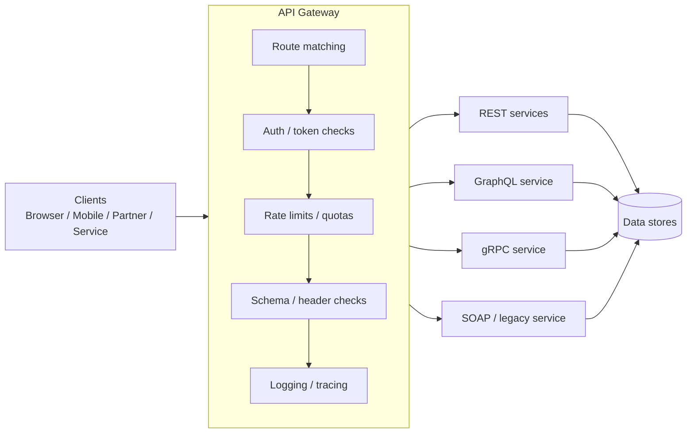
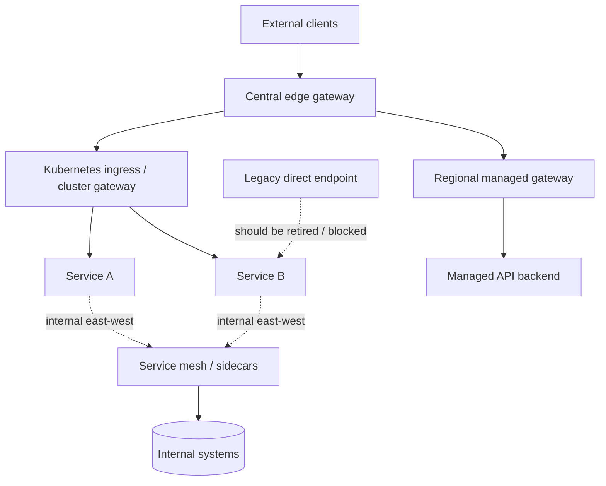
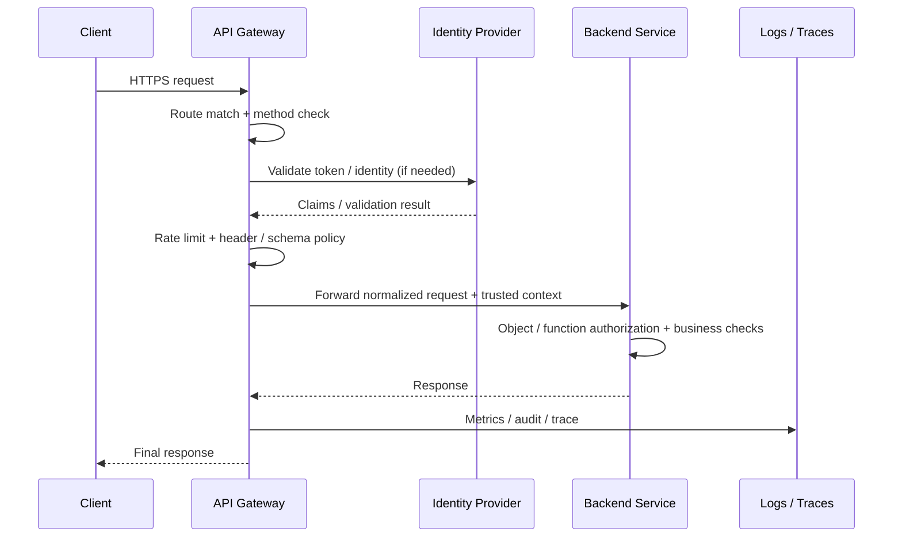

# API Gateway

> **Difficulty:** Beginner → Advanced | **Category:** API Pentesting / Architecture  
> **Focus:** Understand what an API gateway does, where its trust boundaries fail, and how to assess it safely during **authorized** API security testing.

An **API gateway** is the API-facing control point that sits between clients and backend services. It gives consumers one stable entry point while applying routing, authentication, rate limiting, validation, observability, and sometimes protocol translation before requests reach the application.

For defenders and authorized testers, gateways matter because they often become the place where teams assume security is “handled.” In reality, a gateway is only one layer. If the gateway, the API spec, and the backend do **not** agree on what a request means, security drift appears.

A simple way to remember it:

> **The gateway is the front desk, not the whole building.**  
> It should check identity, route visitors correctly, and log activity — but the rooms behind it still need locks.

---

## Table of Contents

1. [What an API Gateway Is](#what-an-api-gateway-is)
2. [Why Gateways Matter to Security Testers](#why-gateways-matter-to-security-testers)
3. [Beginner Mental Model](#beginner-mental-model)
4. [Core Gateway Responsibilities](#core-gateway-responsibilities)
5. [Common Deployment Patterns](#common-deployment-patterns)
6. [Reading Gateway Behavior from the API Spec](#reading-gateway-behavior-from-the-api-spec)
7. [Request Lifecycle and Trust Boundaries](#request-lifecycle-and-trust-boundaries)
8. [Security Risks and Failure Modes](#security-risks-and-failure-modes)
9. [Authorized Testing Methodology](#authorized-testing-methodology)
10. [Protocol-Specific Notes](#protocol-specific-notes)
11. [Defensive Design Guidance](#defensive-design-guidance)
12. [Quick Checklist](#quick-checklist)
13. [Further Reading](#further-reading)

---

## What an API Gateway Is

An API gateway is a **Layer 7 entry point** for APIs.

Instead of exposing many backend services directly:

- mobile apps
- web frontends
- partner integrations
- internal tools
- automation clients

all talk to one public API surface, and the gateway decides:

- **where** the request goes,
- **whether** it is allowed,
- **how** it should be transformed,
- **what** should be logged or limited,
- **which** protocol or version should be used.

### Diagram — Gateway as the API control plane at the edge



### API gateway vs nearby concepts

These terms overlap in real environments, but they are not identical.

| Component | Primary job | Typical layer | Security meaning |
|---|---|---|---|
| **Load balancer** | Distribute traffic across instances | L4 or L7 | Good for availability, but not automatically API-aware |
| **Reverse proxy** | Front backend servers and forward requests | Usually L7 | Hides origin, rewrites traffic, often adds security-relevant headers |
| **API gateway** | Apply API-aware policy + routing + control | L7 | Usually where auth, quotas, schema rules, and API version routing live |
| **Service mesh** | Manage east-west service traffic | In-cluster / internal | Focuses on internal service communication, identity, telemetry, mTLS |
| **Ingress controller** | Kubernetes entry routing | Cluster edge | May act as a gateway, but feature depth depends on implementation |

### Important clarification

A product can be **all three** at once:

- reverse proxy,
- load balancer,
- API gateway.

That is why the security question is not “what is the vendor calling it?”

The better question is:

> **Which controls are actually enforced here, for which routes, under which conditions?**

---

## Why Gateways Matter to Security Testers

Gateways matter because they sit on a major trust boundary:

- internet ↔ application
- partner ↔ internal service
- mobile client ↔ business logic
- public API ↔ private microservices

A gateway is often responsible for:

1. **terminating TLS**,
2. **validating tokens or certificates**,
3. **choosing the backend service**,
4. **applying rate limiting or quotas**,
5. **enforcing content-type or schema rules**,
6. **adding tracing and audit context**.

If that layer is misconfigured, the result is rarely “one small bug.” Instead, the result is often systemic:

- multiple routes inherit the same weakness,
- old versions stay reachable,
- backend services trust unverified headers,
- the gateway blocks one method but not another,
- logs show the wrong client identity,
- authentication exists at the edge but authorization is missing inside services.

### Why this maps to real API risk

A gateway touches several recurring API security themes:

| Security theme | Why the gateway matters |
|---|---|
| **Inventory management** | It is often the place where versions, stages, and deprecated routes accumulate |
| **Authentication** | Token validation and mTLS may be centralized here |
| **Authorization** | Teams may incorrectly assume edge authorization is sufficient for all downstream decisions |
| **Rate limiting / quotas** | Abuse resistance is frequently enforced here rather than in each service |
| **Data exposure** | Response transformation, caching, and protocol translation can leak more than intended |
| **Logging and traceability** | The gateway may be the only layer seeing every request |

---

## Beginner Mental Model

Think of a modern application as a campus with one guarded entrance.

- The **gate** checks badges.
- The **reception desk** directs people to the right building.
- The **camera system** records who entered.
- The **queue manager** prevents overcrowding.
- The **buildings themselves** still must decide who can enter each room.

That is what a gateway does for APIs.

### What beginners often misunderstand

#### Misunderstanding 1: “If the gateway validated the token, the backend is safe.”
Not necessarily.

Token validation answers **who the caller claims to be**. It does not always answer:

- whether the caller may access **this object**,
- whether they may perform **this business action**,
- whether the request is valid for **this workflow state**,
- whether the backend should trust forwarded identity headers.

#### Misunderstanding 2: “All traffic must go through the gateway.”
Not always.

In many real environments, backends are still reachable through:

- old domains,
- internal load balancers,
- direct service IPs,
- cluster ingress paths,
- staging or legacy hosts.

#### Misunderstanding 3: “The API spec and the gateway always match.”
Also not always.

The spec describes **intended behavior**. The runtime may drift.

That gap is one of the most practical things authorized testers should verify.

---

## Core Gateway Responsibilities

The OpenAPI Specification describes HTTP APIs in a way that allows both humans and computers to understand service capabilities. In many organizations, that specification becomes input to gateway policy, routing, validation, documentation, or deployment automation. That is why gateway testing should always be connected to **the API spec** when one exists.

### Common gateway functions and why they matter

| Gateway function | What it does | What authorized testers should verify |
|---|---|---|
| **Route matching** | Maps host/path/header/method to a backend | The intended backend is selected consistently across versions, cases, and path forms |
| **Authentication** | Validates API keys, JWTs, OIDC tokens, client certs | Invalid credentials fail early and predictably |
| **Coarse authorization** | Blocks clearly unauthorized routes or methods | Downstream services still enforce object/function-level authorization |
| **Rate limiting / quotas** | Limits usage by IP, account, token, subscription, or key | Limits apply consistently across methods, versions, and protocol variants |
| **Request validation** | Checks headers, content types, sizes, schemas | Unsupported methods, media types, and oversized bodies are rejected cleanly |
| **Response transformation** | Rewrites headers or payloads | Sensitive fields are not added, cached, or exposed by accident |
| **Protocol translation** | Bridges REST ↔ gRPC or HTTP ↔ backend formats | Security context survives translation correctly |
| **Caching** | Stores reusable responses | Cache keys vary correctly by auth, host, and version |
| **Observability** | Adds request IDs, logs, metrics, tracing | Caller identity and route metadata remain accurate end-to-end |
| **CORS / edge headers** | Governs browser-facing access | Browser policy reflects intended trust model, not convenience defaults |

### Safe control checks in live traffic

In an authorized assessment, many gateway checks are simple comparison exercises rather than “exploitation.”

For example:

- does an invalid bearer token fail at the edge with a consistent `401`?
- does an unsupported method return `405` rather than reaching the app?
- does an unexpected content type produce `415 Unsupported Media Type`?
- does the response include trace IDs or rate-limit headers that reveal policy application?

```bash
# Basic response and header inspection
curl -i https://api.example.com/v1/health

# Verify an unsupported method is rejected predictably
curl -i -X TRACE https://api.example.com/v1/orders

# Verify invalid auth fails early and consistently
curl -i https://api.example.com/v1/orders \
  -H 'Authorization: Bearer invalid-test-token'

# Verify content-type handling
curl -i -X POST https://api.example.com/v1/orders \
  -H 'Content-Type: text/plain' \
  --data 'test'
```

The goal is to learn **where** the decision is made and **whether** the behavior matches policy.

---

## Common Deployment Patterns

There is no single universal gateway topology. The testing approach changes with the architecture.

### Diagram — common gateway placements



### Topology comparison

| Pattern | Description | Advantages | Security concerns | Testing notes |
|---|---|---|---|---|
| **Central edge gateway** | One main public entry point in front of many APIs | Clear choke point, easier monitoring | Single bottleneck, policy sprawl, false sense of complete coverage | Start here, but verify no alternate public paths exist |
| **Managed cloud gateway** | Provider-managed gateway in AWS, Azure, GCP, etc. | Strong integration with IAM, logging, auth features | Misconfigured policies, stage drift, shared responsibility confusion | Review both cloud policy and live behavior |
| **Kubernetes ingress/gateway** | Cluster entry controlled by ingress or gateway API | Good for path/host routing near workloads | Ingress rules may differ from app logic; internal services may remain exposed | Compare ingress rules, service exposure, and app auth |
| **Regional / per-domain gateways** | Different gateway instances for regions, partners, or business units | Isolation, latency benefits | Inconsistent controls across regions or brands | Compare headers, auth, rate limits, and error behavior per edge |
| **Sidecar / local proxy model** | Proxy close to each service instance | Strong local control, lower hop overhead | Policy duplication, drift, visibility fragmentation | Verify whether security is centralized, embedded, or both |
| **Hybrid legacy + modern edge** | New gateway in front of older apps and services | Gradual modernization | Old routes, old hosts, old auth patterns linger | Version inventory becomes critical |

### Architectural lesson

The more distributed the gateway model becomes, the more important it is to answer:

- Which gateway is authoritative?
- Which routes are public?
- Which policies are global?
- Which controls are repeated inside each service?

If nobody can answer those questions clearly, the architecture is already high risk.

---

## Reading Gateway Behavior from the API Spec

This section is where the **API spec** becomes especially valuable.

The OpenAPI Specification is a standard, language-agnostic interface description for HTTP APIs. It helps both humans and computers discover the capabilities of a service without requiring source code or packet inspection. In gateway-heavy environments, it often acts as the closest thing to a policy blueprint.

### A simple example

```yaml
openapi: 3.1.0
info:
  title: Customer API
  version: 1.4.0
servers:
  - url: https://api.example.com/v1
paths:
  /customers/{id}:
    get:
      operationId: getCustomer
      security:
        - bearerAuth: []
      parameters:
        - name: id
          in: path
          required: true
          schema:
            type: string
      responses:
        '200':
          description: Customer record
components:
  securitySchemes:
    bearerAuth:
      type: http
      scheme: bearer
      bearerFormat: JWT
x-google-backend:
  address: https://customers.internal.example
```

### What this tells a tester

Even this small spec reveals a lot:

| Spec area | What it suggests about the gateway |
|---|---|
| `servers` | The intended public base URL and versioned entry path |
| `paths` | The route inventory the gateway is expected to expose |
| `security` + `securitySchemes` | The auth model the edge should enforce or at least pass consistently |
| `parameters` | Which inputs should be accepted and where |
| `responses` | Expected success model and likely error handling patterns |
| `x-*` vendor extensions | Possible routing, backend, or gateway-specific behavior |

### High-value questions to ask from the spec

| Question | Why it matters |
|---|---|
| Are there multiple `servers` entries? | May reveal stage, partner, internal, or legacy exposure |
| Are deprecated routes still documented? | Good signal for version and retirement drift |
| Are auth requirements global or route-specific? | Gateway and service may disagree on exceptions |
| Are callbacks or webhooks defined? | Outbound paths may bypass inbound controls |
| Are there vendor extensions? | May expose gateway-specific routing or backend information |
| Do documented paths match live behavior? | Runtime drift often becomes a finding |

### Important rule

Treat the API spec as **evidence of design intent**, not proof of enforcement.

A good authorized testing workflow compares three things:

1. **the spec**,
2. **the gateway configuration or observed behavior**,
3. **the backend response path**.

If those disagree, that disagreement is often the real issue.

---

## Request Lifecycle and Trust Boundaries

Understanding the request lifecycle helps you decide where to test and where to place blame when something fails.

### Diagram — one request, multiple decision points



### The key trust boundaries

| Boundary | What should be trusted | What should **not** be trusted automatically |
|---|---|---|
| **Client → gateway** | Only what the gateway explicitly validates | Caller-supplied identity, forwarded IP, workflow assumptions |
| **Gateway → service** | Identity or routing context from a trusted gateway | Raw client-supplied forwarding headers unless rewritten by the gateway |
| **Service → service** | Authenticated service identity and policy | “Internal means trusted” assumptions |
| **Gateway → logs/metrics** | Canonical route, method, result, trace ID | Incomplete or transformed fields without context |

### Forwarded identity headers

RFC 7239 standardizes the `Forwarded` header, and real deployments also use headers such as:

- `X-Forwarded-For`
- `X-Forwarded-Host`
- `X-Forwarded-Proto`
- `X-Real-IP`

These headers are useful operationally, but security-wise they are only trustworthy when:

1. they were added or overwritten by a **trusted proxy**, and
2. downstream services know **which proxies are trusted**.

A backend that treats any internet-supplied forwarding header as authoritative is confusing **user input** with **infrastructure metadata**.

### Edge authorization vs service authorization

OWASP’s microservices security guidance highlights a major limitation of edge-only authorization: centralizing everything at the gateway can violate defense in depth and becomes hard to manage in complex ecosystems.

A practical model is:

- **gateway**: authenticate callers, apply coarse route-level policy, rate limits, schema checks
- **service**: enforce object-level, function-level, and workflow-level authorization

That split is one of the most important things an authorized tester should confirm.

---

## Security Risks and Failure Modes

API gateway problems usually come from **mismatch**:

- mismatch between documented and live routes,
- mismatch between normalized and raw paths,
- mismatch between gateway auth and backend authz,
- mismatch between cache keys and response sensitivity,
- mismatch between trusted and untrusted headers.

### Common failure patterns

| Failure mode | What it means | Why it is dangerous | Safe validation idea |
|---|---|---|---|
| **Direct backend exposure** | A backend is reachable outside the intended gateway path | Edge controls can be bypassed entirely | Compare approved public entry points against infrastructure inventory and DNS/cert data |
| **Edge-only authorization** | Service trusts gateway too much and skips business-level checks | Caller may pass edge checks but still access the wrong object/action | Compare route-level access decisions with object-level ownership rules |
| **Header trust confusion** | Backend trusts caller-supplied forwarding headers | IP-based controls, logging, or scheme logic can become unreliable | Send benign test values in forwarding headers and confirm they do not change trust decisions |
| **Path normalization mismatch** | Gateway and backend interpret the same path differently | Protected and unprotected paths may diverge | Compare equivalent-looking paths and verify consistent routing/denial |
| **Method handling drift** | Different methods receive different policy treatment | `GET` may be protected while `HEAD`, `OPTIONS`, or `POST` behaves differently | Exercise documented and undocumented methods safely and compare policy application |
| **Version drift** | Old routes or hosts retain weaker rules | Legacy APIs often keep weaker validation and auth patterns | Diff controls between `v1`, `v2`, partner, beta, and mobile paths |
| **Cache key mismatch** | Sensitive responses are cached too broadly | One caller’s response may be served to another context | Review `Cache-Control`, `Vary`, auth context, and route cache policy |
| **Spec/runtime drift** | API spec says one thing, live gateway enforces another | Clients, defenders, and auditors get the wrong picture | Compare spec-declared auth and routes with real responses |
| **Protocol translation blind spots** | Security context changes across REST/GraphQL/gRPC/SOAP translation | Claims, methods, content types, or error handling may be weakened | Trace one business action through gateway and backend logs |
| **Observability gaps** | Logs do not show the real caller, route, or decision point | Detection and forensics degrade | Verify trace IDs and caller context survive to backend logs |

### Workflow abuse is still a gateway topic

Even if the gateway authenticates properly, the backend may still allow **out-of-order API execution**.

Example conceptually:

- create order
- pay for order
- confirm order

The gateway may validate the user’s token for every request, but only the backend can truly decide whether the workflow state allows “confirm” yet.

That is why gateway security must not be confused with complete business security.

---

## Authorized Testing Methodology

This note is about **defensive and authorized** assessment. The goal is to validate that the gateway enforces the intended contract and that downstream services do not make unsafe assumptions.

### Step 1 — Establish the intended architecture

Before testing behavior, collect the approved architecture picture:

- public API hosts
- versions and stages
- known gateway products
- backend exposure model
- auth methods in scope
- internal-only routes or partner-only routes

If you have the API spec, use it immediately.

### Step 2 — Build a gateway control matrix

Create a simple matrix for each route family:

| Route family | Auth expected | Rate limit expected | Backend target | Notes |
|---|---|---|---|---|
| `/v1/customers` | Bearer JWT | per user | customer-service | legacy support |
| `/v2/customers` | Bearer JWT + newer scopes | per user | customer-service-v2 | preferred public API |
| `/partner/*` | mTLS + token | per client cert | partner-service | narrower exposure |
| `/graphql` | Bearer JWT | query-cost limit | graph-service | single endpoint |

This turns architecture into testable expectations.

### Step 3 — Validate edge rejection behavior safely

Start with low-risk, non-destructive checks.

```bash
# Expected anonymous rejection
curl -i https://api.example.com/v1/customers/me

# Expected invalid token rejection
curl -i https://api.example.com/v1/customers/me \
  -H 'Authorization: Bearer invalid-test-token'

# Expected unsupported method rejection
curl -i -X DELETE https://api.example.com/v1/status

# Expected unsupported media type rejection
curl -i -X POST https://api.example.com/v1/customers \
  -H 'Content-Type: application/octet-stream' \
  --data-binary 'test'
```

What matters is not just the status code, but:

- did the gateway reject the request or did the app reject it?
- are headers such as request ID, server, or trace context helpful?
- is behavior consistent across versions and routes?

### Step 4 — Compare gateway policy across versions and route families

Versioning and segmentation are where drift usually appears.

Compare:

- `/v1/` vs `/v2/`
- public vs partner hosts
- JSON REST vs GraphQL route families
- browser-facing vs service-facing endpoints
- deprecated vs current operations

You are looking for differences in:

- authentication enforcement,
- allowed methods,
- response headers,
- rate-limit headers,
- error body detail,
- caching behavior,
- CORS behavior.

### Step 5 — Check trusted-header handling

Use harmless inputs to see whether the system improperly trusts caller-controlled forwarding metadata.

```bash
curl -i https://api.example.com/v1/customers/me \
  -H 'Forwarded: for=198.51.100.77;proto=http' \
  -H 'X-Forwarded-For: 198.51.100.77' \
  -H 'X-Forwarded-Proto: http'
```

In a healthy design:

- these headers should not override gateway trust decisions when sent by an external caller,
- logs should preserve the real remote peer and trusted proxy chain correctly,
- redirects or scheme logic should not become confused.

### Step 6 — Read the spec and compare reality

From the API spec, verify:

- documented base URLs and stages
- documented security schemes
- documented methods and parameters
- deprecated operations
- callback/webhook definitions
- vendor extensions or backend hints

Then compare those with live traffic and approved configuration.

### Step 7 — Review backend exposure separately

A gateway assessment is incomplete if you only test the public hostname.

In an explicitly authorized internal review, ask:

- are services reachable through alternate public or semi-public paths?
- do private services require mTLS, private networking, or strong service identity?
- do services reject unauthenticated direct calls even if they are “supposed” to sit behind the gateway?

This is where OWASP’s guidance about gateway bypass and defense in depth becomes practical.

### Step 8 — Verify logging and traceability

A secure gateway should help defenders answer:

- who made the request,
- to which logical route,
- through which auth context,
- with which result,
- and whether the decision was made at the edge or the backend.

If logs cannot answer those questions, the gateway may still function operationally but remain weak as a security control.

---

## Protocol-Specific Notes

A gateway often fronts multiple API styles at the same time. The security review should adapt to the protocol.

| API style | Gateway-specific concerns | What to validate safely |
|---|---|---|
| **REST** | Path/method routing, versioning, cache keys, content-type enforcement | Method allowlists, version parity, `Vary` behavior, auth consistency |
| **GraphQL** | Single endpoint, query-cost enforcement, introspection posture, auth at resolver layer | Gateway rate limits + backend resolver authorization both exist |
| **gRPC** | HTTP/2 handling, metadata propagation, reflection posture, translation proxies | Auth metadata survives translation; gateway does not weaken service identity |
| **SOAP** | XML content handling, WS-Security termination, legacy route exposure | Content-type enforcement, parser hardening, legacy host inventory |
| **Webhooks / callbacks** | Inbound and outbound trust boundaries differ | Signature validation, replay handling, callback inventory, exposure mapping |

### REST behind a gateway

REST is the most familiar model for gateways:

- host-based routing,
- path-based routing,
- version-based routing,
- method-specific policies.

This makes REST especially prone to:

- version drift,
- cache drift,
- method-policy drift,
- path normalization disagreement.

### GraphQL behind a gateway

GraphQL compresses many operations into one endpoint, so the gateway sees less obvious route diversity.

That means the gateway alone may not understand:

- which object is being accessed,
- how expensive the query is,
- whether field-level authorization is correct.

A safe conclusion is:

> **The gateway can enforce perimeter controls, but GraphQL security still lives heavily in the schema and resolver layer.**

### gRPC behind a gateway

Cloud and platform gateways frequently bridge public HTTP APIs to gRPC backends.

That translation layer deserves attention because:

- HTTP/1.1 and HTTP/2 semantics differ,
- metadata may carry identity,
- backend method names may be hidden from internet clients,
- reflection or internal service naming may still leak through errors or documentation.

### SOAP and legacy APIs behind a gateway

Gateways are often used to modernize older SOAP or XML-heavy systems by placing a newer edge in front of them.

That improves exposure control, but it does **not** automatically fix:

- XML parser risks,
- legacy auth complexity,
- old WSDL-defined operations,
- old internal naming or versioning conventions.

---

## Defensive Design Guidance

Good gateway security is not “put everything at the edge.”

Good gateway security is **clear responsibility split + defense in depth**.

### Recommended design principles

| Principle | Good practice | Why it matters |
|---|---|---|
| **Single intended public entry path** | Make backends private by default | Reduces bypass risk |
| **Strong edge identity checks** | Validate JWTs, API keys, client certs, issuer, audience, expiry | Prevents weak or inconsistent caller identity |
| **Service-level authorization** | Enforce object/function/workflow checks in the backend | Prevents overreliance on route-level edge policy |
| **Trusted proxy model** | Only trust forwarded headers from known proxies | Prevents header-based trust confusion |
| **Explicit method and media-type policy** | Allowlist methods and content types | Reduces parser and verb drift |
| **Spec-driven review** | Diff OpenAPI intent against live gateway behavior | Catches drift early |
| **Version retirement discipline** | Track old routes, hosts, and stages until fully removed | Shrinks shadow API surface |
| **Traceable decisions** | Preserve request ID, auth context, policy result, backend route | Improves detection and root-cause analysis |
| **Cache discipline** | Key caches on auth, host, version, and content negotiation where needed | Prevents cross-context leakage |
| **Consistent normalization** | Ensure gateway and backend agree on path, host, and scheme interpretation | Prevents parser disagreement bugs |

### A mature policy split

A practical mature stack often looks like this:

- **Gateway enforces**: TLS, coarse auth, quotas, method/content checks, baseline schema checks, observability
- **Service enforces**: ownership, business state, object-level authorization, function-level authorization, workflow sequencing
- **Platform enforces**: private networking, mTLS, service identity, secrets handling

### The most important architectural lesson

If you remember one thing from this note, remember this:

> **A gateway should reduce attack surface, not become the only place where security exists.**

---

## Quick Checklist

Use this as a compact review list during an authorized engagement.

### Architecture

- [ ] All intended public API hosts and versions are inventoried
- [ ] Backends are not unintentionally reachable outside the gateway path
- [ ] Gateway ownership and service ownership are both clear

### Policy enforcement

- [ ] Invalid tokens fail predictably at the edge
- [ ] Unsupported methods are rejected consistently
- [ ] Unsupported media types are rejected consistently
- [ ] Rate limits and quotas are visible and consistent across route families
- [ ] Browser-facing CORS policy matches intended trust boundaries

### Trust boundaries

- [ ] Services do not rely only on gateway-level authorization
- [ ] Forwarding headers are trusted only from known proxies
- [ ] Identity and trace context survive correctly to the backend

### Spec and versioning

- [ ] OpenAPI / API spec matches live gateway behavior
- [ ] Deprecated or legacy routes are tracked and tested
- [ ] Multiple versions do not show policy drift

### Logging and response handling

- [ ] Logs show enough context for incident response
- [ ] Error handling does not expose internal topology unnecessarily
- [ ] Cache behavior is safe for authenticated and versioned responses

---

## Further Reading

Public references used to shape this note:

- [OpenAPI Specification](https://spec.openapis.org/oas/latest.html) — official description of OpenAPI and its structure
- [RFC 9110: HTTP Semantics](https://datatracker.ietf.org/doc/html/rfc9110) — core HTTP semantics for methods, responses, and intermediaries
- [RFC 7239: Forwarded HTTP Extension](https://datatracker.ietf.org/doc/html/rfc7239) — standard `Forwarded` header for proxy chains
- [MDN: Forwarded header](https://developer.mozilla.org/en-US/docs/Web/HTTP/Headers/Forwarded) — practical explanation of proxy forwarding metadata
- [OWASP REST Security Cheat Sheet](https://raw.githubusercontent.com/OWASP/CheatSheetSeries/master/cheatsheets/REST_Security_Cheat_Sheet.md) — per-endpoint access control, method restriction, input validation, workflow sequencing
- [OWASP Microservices Security Cheat Sheet](https://raw.githubusercontent.com/OWASP/CheatSheetSeries/master/cheatsheets/Microservices_Security_Cheat_Sheet.md) — edge-level vs service-level authorization and gateway-bypass considerations
- [AWS: Security Design Principles for Amazon API Gateway](https://docs.aws.amazon.com/whitepapers/latest/security-overview-amazon-api-gateway/security-design-principles.html) — shared responsibility, authorization options, auditability, encryption, defense in depth
- [Azure Architecture Center: Gateway Routing Pattern](https://learn.microsoft.com/en-us/azure/architecture/patterns/gateway-routing) — why gateways simplify multi-service routing and what trade-offs they introduce
- [Azure API Management Policies](https://learn.microsoft.com/en-us/azure/api-management/api-management-policies) — examples of edge policy functions such as rate limits, JWT validation, IP filtering, and schema validation
- [Google Cloud Endpoints Architecture Overview](https://cloud.google.com/endpoints/docs/openapi/architecture-overview) — spec-driven gateway behavior, proxy deployment models, auth, telemetry, and backend routing

Related notes worth studying next:

- `api-pentesting/02-api-architecture/api-versioning`
- `api-pentesting/05-recon/openapi-swagger-enumeration`
- `web-pentesting/02-web-architecture/reverse-proxies`
- `web-pentesting/08-api-security/api-architecture`
