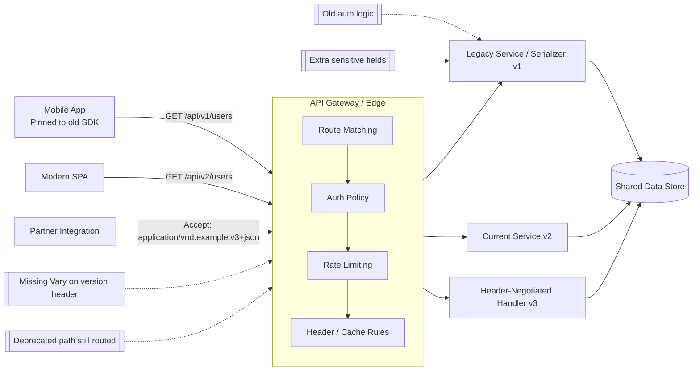
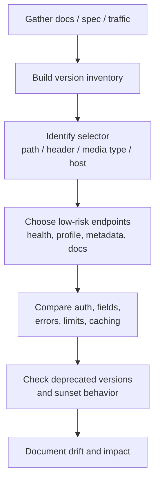
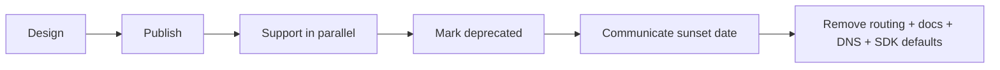

# API Versioning

> **Difficulty:** Beginner → Advanced | **Category:** API Pentesting / Architecture

API versioning is how an API changes over time without breaking every existing client at once. For defenders and authorized security testers, versioning matters because **old versions often stay reachable longer than expected**, and that is where policy drift, forgotten fields, weak validation, missing rate limits, and undocumented behavior tend to survive.

A simple mental model:

- **The API contract** is the promise made to clients.
- **A version** is one published form of that promise.
- **A breaking change** means an old client may stop working.
- **A security problem** appears when version `A` and version `B` do not enforce the same rules.

> **Important:** API versioning is **not** the same thing as HTTP/1.1 vs HTTP/2. Those are protocol versions. API versioning is about the application contract: paths, headers, schemas, behavior, and compatibility.

---

## Table of Contents

1. [Why Versioning Matters](#why-versioning-matters)
2. [Beginner Mental Model](#beginner-mental-model)
3. [Breaking vs Non-Breaking Changes](#breaking-vs-non-breaking-changes)
4. [Common Versioning Strategies](#common-versioning-strategies)
5. [How Versioning Appears in Real Traffic](#how-versioning-appears-in-real-traffic)
6. [Reading Versioning from the API Spec](#reading-versioning-from-the-api-spec)
7. [Security Risks Created by Versioning](#security-risks-created-by-versioning)
8. [Authorized Testing Methodology](#authorized-testing-methodology)
9. [Protocol-Specific Notes](#protocol-specific-notes)
10. [Deprecation, Sunsetting, and Retirement](#deprecation-sunsetting-and-retirement)
11. [Defensive Design Guidance](#defensive-design-guidance)
12. [Quick Checklist](#quick-checklist)
13. [Further Reading](#further-reading)

---

## Why Versioning Matters

Teams version APIs because clients change at different speeds. A mobile app pinned to an old SDK might still call `v1` for months. A partner integration may only upgrade twice a year. A public API may need to support many generations of clients at once.

From a security perspective, that creates three realities:

1. **Multiple contracts may be live at the same time.**
2. **Security controls may drift between versions.**
3. **Documentation and runtime behavior may disagree.**

That is why versioning is closely related to **OWASP API9: Improper Inventory Management**: if defenders cannot clearly inventory which versions still exist, old endpoints become shadow attack surface.

---

## 📊 Diagram — How Versioning Creates Security Drift



---

## Beginner Mental Model

Think of versioning like a building with multiple entrances:

- `/api/v1/` is the old front door
- `/api/v2/` is the renovated entrance
- a custom header like `X-API-Version: 2024-10-01` is a side door only certain clients know about
- media-type versioning with `Accept: application/vnd.example.v2+json` is a door selected by content negotiation

All doors may eventually lead to the same business logic, or they may pass through **different middleware, different serializers, different validators, or different authorization checks**.

That difference is exactly what authorized testers should verify.

---

## Breaking vs Non-Breaking Changes

Not every change requires a new version. Good API programs distinguish between **compatible evolution** and **breaking evolution**.

| Change | Usually Backward Compatible? | Why It Matters to Testers |
|---|---|---|
| Add optional response field | Usually yes | Old clients should ignore it; check for accidental sensitive data exposure |
| Add optional request field | Usually yes | Check whether new field can be abused or mass-assigned |
| Tighten input validation | Sometimes no | Old clients may break; security may improve in new version only |
| Remove field from response | No | Old clients may fail; older version may still expose data |
| Rename field | No | Strong indicator of a real contract split |
| Change enum values | Often no | Business logic and auth checks can desynchronize |
| Change pagination behavior | Sometimes no | Can affect rate limits, scraping resistance, and monitoring |
| Change authentication method | Often no | Legacy auth may stay enabled longer than intended |
| Change error model | Sometimes no | Different versions may leak stack traces or validation details |

### Practical rule

A version boundary becomes security-relevant whenever any of these change:

- authentication
- authorization
- schema
- validation
- serialization
- caching
- rate limiting
- business workflow sequencing

---

## Common Versioning Strategies

There is no single universal pattern. Different ecosystems prefer different trade-offs.

| Strategy | Example | Advantages | Common Weaknesses | Security Testing Notes |
|---|---|---|---|---|
| **URI path versioning** | `/api/v1/users` | Obvious, cache-friendly, easy to document | Old paths linger for years | Compare policies and schemas across all visible paths |
| **Header versioning** | `X-API-Version: 2024-10-01` | Cleaner URLs, central negotiation | Easy to miss in logs/tools | Verify gateway, CDN, and app all key on the same header |
| **Media type versioning** | `Accept: application/vnd.example.v2+json` | Uses HTTP content negotiation | Operationally subtle; often misconfigured | Check `Vary` behavior and serializer differences |
| **Query parameter versioning** | `?version=2` | Easy to prototype | Easy to tamper with and mishandle | Often inconsistent in caches, routers, or docs |
| **Hostname / subdomain versioning** | `v2.api.example.com` | Strong separation | Inventory sprawl across DNS, certs, and WAFs | Test each host independently; do not assume shared controls |
| **Date-based versioning** | `Stripe-Version: 2024-10-28.acacia` | Clear release pinning, useful for large platforms | Harder for humans to reason about than `v1/v2` | Excellent place to check downgrade behavior and compatibility pinning |
| **No explicit version in URL** | Same path, additive evolution only | Minimal surface clutter | Real changes may happen implicitly | Diff docs, schemas, and behavior over time |

### Which strategy is “best”?

From a security point of view, the best strategy is the one that makes these easy to answer:

- Which versions exist?
- Which clients still use them?
- Which controls apply to each version?
- When will each one be retired?

If defenders cannot answer those questions, the versioning strategy is already a risk.

---

## How Versioning Appears in Real Traffic

### 1. Path-based versioning

```http
GET /api/v1/users/me HTTP/1.1
Host: api.example.com
Authorization: Bearer <token>
```

```http
GET /api/v2/users/me HTTP/1.1
Host: api.example.com
Authorization: Bearer <token>
```

### 2. Custom header versioning

```http
GET /users/me HTTP/1.1
Host: api.example.com
Authorization: Bearer <token>
X-API-Version: 2024-10-01
```

### 3. Media type versioning

```http
GET /users/me HTTP/1.1
Host: api.example.com
Authorization: Bearer <token>
Accept: application/vnd.example.v2+json
```

### 4. Date-based header versioning

```http
GET /v1/customers HTTP/1.1
Host: api.example.com
Authorization: Bearer <token>
Stripe-Version: 2024-10-28.acacia
```

### 5. Query parameter versioning

```http
GET /users/me?version=2 HTTP/1.1
Host: api.example.com
Authorization: Bearer <token>
```

### What to look for in authorized traffic captures

| Signal | Example | Why It Matters |
|---|---|---|
| URL path | `/v1/`, `/v2/`, `/beta/` | Fastest indicator of parallel API generations |
| Custom headers | `X-API-Version`, `API-Version` | Often invisible unless you inspect raw requests |
| Accept header | vendor media types | Can silently select a different serializer |
| Hostname | `legacy-api.example.com` | May bypass newer gateway rules |
| Response headers | `Sunset`, deprecation notices | Useful for lifecycle mapping |
| SDK config | pinned API version string | Shows what clients really request |
| OpenAPI `servers` | `https://api.example.com/v1` | Reveals documented base URL version |

---

## Reading Versioning from the API Spec

When a target provides an OpenAPI/Swagger spec, versioning often becomes much easier to inventory. But a good tester remembers this:

> **The spec is a clue, not absolute truth.** Runtime behavior can still differ.

### What to inspect in the spec

| Spec Element | What It Tells You | Security Relevance |
|---|---|---|
| `servers` | Base URLs such as `https://api.example.com/v1` | Reveals path-level versioning and alternate environments |
| Path names | `/v1/users`, `/v2/users` | Shows side-by-side contracts |
| Header parameters | `X-API-Version` or custom selectors | Indicates hidden version negotiation |
| `deprecated: true` | Operation marked for retirement | Great lead for version drift checks |
| Schema differences | Field additions/removals | Compare exposure and validation changes |
| Multiple spec files | `openapi-v1.json`, `openapi-v2.json` | Strong sign of parallel inventory |

### Example OpenAPI fragment

```yaml
openapi: 3.0.3
info:
  title: Example API
  version: 2.1.0
servers:
  - url: https://api.example.com/v2
paths:
  /users/me:
    get:
      summary: Current profile endpoint
      responses:
        '200':
          description: Success
  /reports:
    get:
      deprecated: true
      servers:
        - url: https://api.example.com/v1
      responses:
        '200':
          description: Legacy report endpoint
```

### Important spec nuance

In OpenAPI 3.x, the `servers` array defines base URLs, and those URLs commonly include a version segment like `/v1`. A path or even a single operation can override the global server definition. That means a supposedly “current” API document can still describe **operation-level legacy routes**.

### A common beginner mistake

Do **not** assume `info.version` alone proves the runtime API version. In practice, testers should correlate:

- `info.version`
- `servers`
- path names
- explicit version headers
- observed traffic

### Safe spec-driven checks

Use read-only comparison first when you have authorization to test:

```bash
# Compare two documented versions in a controlled environment
curl -s https://api.example.com/openapi-v1.json -o openapi-v1.json
curl -s https://api.example.com/openapi-v2.json -o openapi-v2.json

# Quick endpoint diff
jq -r '.paths | keys[]' openapi-v1.json | sort > v1-paths.txt
jq -r '.paths | keys[]' openapi-v2.json | sort > v2-paths.txt
diff -u v1-paths.txt v2-paths.txt
```

```bash
# Compare response field names for one resource
curl -s https://api.example.com/v1/users/me -H "Authorization: Bearer $TOKEN" | jq -S 'keys' > v1-keys.json
curl -s https://api.example.com/v2/users/me -H "Authorization: Bearer $TOKEN" | jq -S 'keys' > v2-keys.json
diff -u v1-keys.json v2-keys.json
```

> Only perform comparison against systems and accounts you are explicitly authorized to test. Prefer test tenants, staging, or non-destructive read operations first.

---

## Security Risks Created by Versioning

Versioning itself is not a vulnerability. **Unmanaged versioning** is.

### 1. Policy drift

`v2` may enforce stronger auth, but `v1` still accepts weaker tokens, legacy API keys, or inconsistent scopes.

### 2. Schema drift

Legacy versions often expose fields that newer versions intentionally removed:

- internal IDs
- role flags
- billing metadata
- debugging fields
- stack traces or verbose validation details

### 3. Validation drift

A modern endpoint may reject unsafe or malformed input while an older serializer still accepts it.

### 4. Authorization drift

Object-level or property-level checks may differ by version, especially when one version is backed by old controller code.

### 5. Cache confusion

Header-based and media-type-based versioning can create subtle cache bugs if intermediaries do not vary correctly on the version selector.

### 6. Inventory failure

Docs may show only `v3`, while the gateway still routes `v1`, `v2`, `beta`, and internal partner variants.

### 7. Monitoring blind spots

Security dashboards often track “the API” as one service, masking the fact that old versions still receive real traffic.

---

## 📊 Table — High-Value Versioning Findings

| Finding Pattern | Example | Why It Matters |
|---|---|---|
| Legacy version still accessible | `/api/v1/` works after docs removed it | Shadow surface and retirement failure |
| New auth not enforced everywhere | `v2` requires JWT, `v1` accepts static key | Strong sign of policy drift |
| Different fields per version | `is_admin` hidden in `v2`, still present in `v1` | Sensitive data exposure or privilege abuse risk |
| Missing deprecation signaling | Old version live with no notice or sunset plan | Operations risk and poor inventory hygiene |
| Version header ignored by some layers | App honors header, CDN does not | Cross-version cache mix or stale data leakage |
| Different rate limits per version | `v1` has weak throttling | Legacy endpoint becomes easiest path for abuse |
| Spec/documentation mismatch | Spec says current-only, runtime still serves old | Governance and change-management gap |

---

## Authorized Testing Methodology

This section is intentionally framed for **defensive, authorized assessment**.

### Phase 1 — Build the version inventory

Collect every source of truth you can access:

- OpenAPI / Swagger specs
- API docs and changelogs
- SDK defaults and client code
- gateway config or route maps
- observed traffic in proxy or logs
- subdomains and environment-specific hosts

Create a version matrix like this:

| Version | Discovery Source | Selector | Auth Model | Status |
|---|---|---|---|---|
| v1 | OpenAPI + traffic | `/api/v1/` | JWT + legacy API key | Deprecated but reachable |
| v2 | Docs + current app | `/api/v2/` | JWT | Current |
| 2024-10-01 | Header docs | `X-API-Version` | JWT | Partner-only |

### Phase 2 — Confirm how selection works

For each candidate version, determine whether the selector is:

- path-based
- host-based
- query-based
- header-based
- media-type-based
- implicit through SDK pinning

Safe examples:

```bash
# Path-based comparison
curl -i https://api.example.com/api/v1/health
curl -i https://api.example.com/api/v2/health
```

```bash
# Header-based comparison
curl -i https://api.example.com/users/me \
  -H "Authorization: Bearer $TOKEN" \
  -H "X-API-Version: 2024-10-01"
```

```bash
# Media-type-based comparison
curl -i https://api.example.com/users/me \
  -H "Authorization: Bearer $TOKEN" \
  -H "Accept: application/vnd.example.v2+json"
```

### Phase 3 — Compare security controls, not just functionality

For each version, compare:

| Control Area | Questions to Ask |
|---|---|
| Authentication | Do all versions require the same auth strength? |
| Authorization | Do object-level and field-level checks match? |
| Validation | Are old versions looser with types, enums, lengths, or formats? |
| Serialization | Does one version reveal more fields than another? |
| Rate limiting | Are quotas identical or weaker on legacy routes? |
| Error handling | Do old versions leak internals or stack traces? |
| CORS / headers | Do gateway/security headers differ by version? |
| Cache behavior | Does the edge vary on the selected version? |
| Logging / observability | Are legacy requests still tracked and attributed? |

### Phase 4 — Look for downgrade paths

In an authorized assessment, ask whether a legitimate client can be forced or configured to use an older version accidentally.

Examples:

- mobile SDK pinned to an old base path
- partner integration still using deprecated headers
- reverse proxy rewriting `/api/` to `/api/v1/`
- undocumented fallback when no version header is supplied

### Phase 5 — Validate retirement controls

A mature API program does not just publish versions; it also retires them cleanly.

Check whether deprecated versions:

- are clearly marked in docs/specs
- emit deprecation or sunset signals
- have migration guidance
- are blocked after the retirement date
- are removed from gateway routing and DNS, not merely hidden from docs

---

## 📊 Diagram — Safe Authorized Version Testing Workflow



---

## Protocol-Specific Notes

### REST APIs

REST is where explicit versioning is most visible.

Common forms:

- `/v1/`, `/v2/`
- `X-API-Version`
- vendor media types in `Accept`
- date-based custom headers

Security focus:

- path inventory
- header-based negotiation behavior
- serializer differences
- gateway policy parity across routes

### GraphQL APIs

GraphQL often tries to avoid hard version splits by evolving a single schema.

Common patterns:

- field deprecation instead of `/v2/graphql`
- separate endpoints only for major redesigns
- schema evolution via additive fields and types

Security focus:

- deprecated fields still resolvable
- old resolvers enforcing weaker authorization
- documentation drift between visible schema and resolver behavior

### gRPC APIs

gRPC commonly versions through package names or service names, such as:

- `com.example.user.v1.UserService`
- `com.example.user.v2.UserService`

Security focus:

- old packages still published through reflection
- inconsistent interceptors between service versions
- schema evolution mistakes around field reuse or legacy handlers

### Webhooks / Event APIs

Event-driven systems may version payloads separately from request paths.

Examples:

- `X-Event-Version: 2`
- version field inside JSON payload
- distinct event type names

Security focus:

- signature verification consistent across versions
- consumers accepting old unsigned or weakly validated formats
- replay and ordering protections not drifting between event versions

---

## Deprecation, Sunsetting, and Retirement

A healthy version lifecycle is visible and measurable.



### What mature lifecycle management looks like

| Stage | Expected Signals |
|---|---|
| Current | Documented and monitored |
| Deprecated | Clearly marked in docs/specs; migration path published |
| Sunset planned | Retirement date communicated; clients inventoried |
| Retired | Requests blocked or removed; routes no longer reachable |
| Fully cleaned up | Monitoring, alerts, DNS, SDK defaults, and docs updated |

### Good tester questions

- Is the deprecated version merely hidden, or actually disabled?
- Are gateway routes still forwarding legacy traffic?
- Do SDKs still default to the old version?
- Does the organization know which customers still depend on it?

---

## Defensive Design Guidance

If you are reviewing or advising on architecture, these are strong practices:

### 1. Keep one authoritative version inventory

Maintain a single source that maps:

- live versions
- owning team
- auth model
- deprecation state
- retirement date
- client usage

### 2. Apply security controls centrally where possible

If versions are routed through a gateway, enforce shared controls there:

- authentication baseline
- rate limiting baseline
- logging / tracing
- IP / network policy
- standardized security headers where applicable

### 3. Treat old versions as production, not as leftovers

A deprecated version is still part of the attack surface until it is removed.

### 4. Use explicit deprecation signals

Clients should not discover retirement by outage alone. Use docs, changelogs, and when supported by the platform, response signaling such as deprecation or sunset notices.

### 5. Be careful with content negotiation

If version is selected by header or media type:

- ensure the cache key varies correctly
- ensure observability captures the selected version
- ensure WAF and API gateway policies inspect the real selector

### 6. Separate “spec version” from “runtime version” in your mind

Docs can say one thing while traffic does another. Always verify both.

---

## Common Beginner Mistakes

1. **Only checking `/v2/` because it is the version shown in docs**
2. **Ignoring custom headers and `Accept` negotiation**
3. **Assuming all versions share the same middleware**
4. **Comparing only status codes, not response fields**
5. **Forgetting caches, CDNs, and proxies in header-based versioning**
6. **Treating deprecation as removal**
7. **Trusting the OpenAPI file without verifying runtime behavior**

---

## Quick Checklist

```text
[ ] Enumerate every visible version from paths, headers, hosts, docs, and specs
[ ] Confirm how version selection actually happens in live traffic
[ ] Compare auth requirements across versions
[ ] Compare object-level and field-level authorization behavior
[ ] Diff response schemas for sensitive field drift
[ ] Compare validation and error behavior across versions
[ ] Verify rate limits and gateway controls are consistent
[ ] Check cache behavior for header/media-type versioning
[ ] Review deprecated versions for true retirement vs hidden exposure
[ ] Record which source proved each version exists
```

---

## Further Reading

These public references are useful for understanding how real platforms and standards handle versioning:

- **Stripe API Versioning** — date-based version pinning and release model: `https://docs.stripe.com/api/versioning`
- **Atlassian Jira REST API v3 Intro** — path-based versioning in a large SaaS platform: `https://developer.atlassian.com/cloud/jira/platform/rest/v3/intro/#version`
- **Swagger / OpenAPI servers documentation** — how base URLs and per-operation overrides express versions in specs: `https://swagger.io/docs/specification/v3_0/api-host-and-base-path/`
- **RFC 9110: HTTP Semantics** — background on HTTP representations, content negotiation, intermediaries, and cache behavior: `https://datatracker.ietf.org/doc/html/rfc9110`

---

## Bottom Line

API versioning is not just a product-design concern. It is a **security architecture concern**.

For authorized testers, the goal is not simply to find `/v1/` and `/v2/` — it is to answer:

- which versions exist,
- how clients select them,
- whether security controls are consistent,
- and whether deprecated versions are actually gone.

That mindset turns versioning from a naming detail into a high-value attack-surface and governance check.
