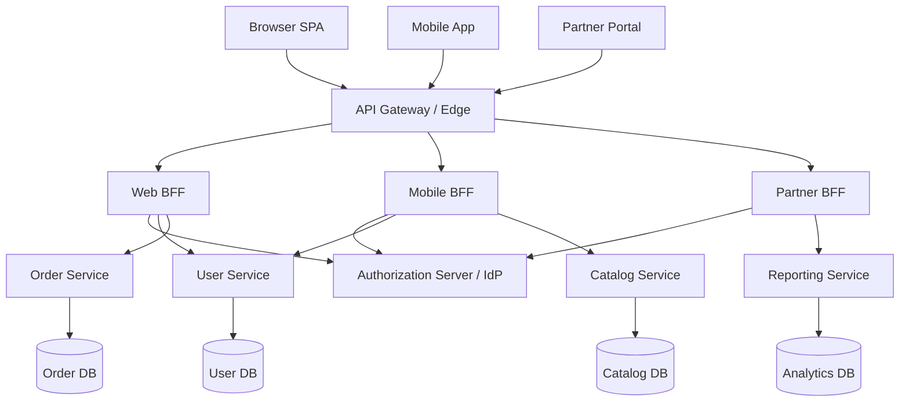
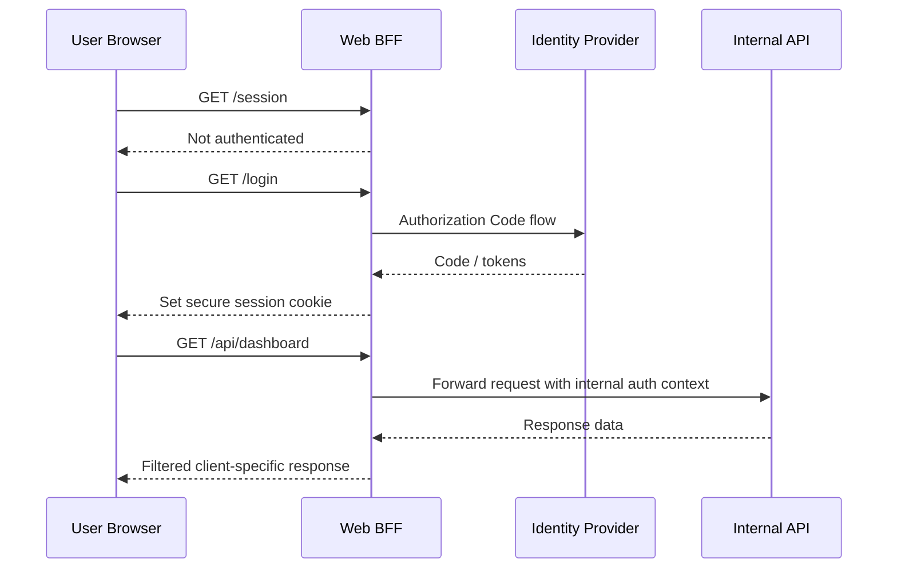

# Backend For Frontend (BFF)

> **A Backend for Frontend is a client-specific backend layer that sits between a frontend and the underlying APIs, shaping requests, sessions, and responses for one user experience.**

> **Authorized testing only:** Use the ideas in this note only on systems you own or are explicitly permitted to assess. The goal is to understand trust boundaries, validate controls, and improve API security—not to abuse production systems.

---

## 🧠 What Is It? (Beginner Explanation)

A **Backend for Frontend (BFF)** is a backend made for a specific frontend.

Instead of letting a browser app, mobile app, smart TV app, and partner portal all talk directly to the same backend services, a team places a dedicated middle layer in front of those services. That layer knows what **that one frontend** needs and hides the rest.

Think of a large hotel:

- the **kitchen** is the internal service layer
- the **front desk** is the public entry point
- a **VIP concierge** is the BFF

The concierge knows the needs of one type of guest, translates requests, coordinates internal staff, and returns only the information that guest needs. The guest does not need to know which room service system, inventory system, or billing system is involved behind the scenes.

That is why BFFs are popular:

- **web** frontends often want richer pages and aggregation
- **mobile** frontends want fewer round trips and smaller payloads
- **browser-based apps** may want safer token handling through server-side sessions
- **frontend teams** want a layer they can change without constantly redesigning core services

For security testers, the important point is this:

**A BFF changes the trust boundary.**

Authentication, authorization, caching, request shaping, and logging might now happen in a different place than the underlying business logic.

---

## 🎯 Why Teams Use a BFF

Teams usually adopt the pattern for a mix of product, performance, and security reasons.

| Driver | What the BFF does | Why it matters to testers |
|---|---|---|
| Client-specific payloads | Returns different data for web vs mobile | Different clients may expose different attack surface |
| Aggregation | Calls multiple backend services and combines results | One request may trigger many downstream trust decisions |
| Token handling | Keeps OAuth tokens on the server side and gives the browser a session cookie instead | Reduces browser token exposure, but adds cookie and CSRF risk |
| Protocol translation | Accepts REST from the frontend and calls gRPC, GraphQL, or internal APIs behind the scenes | Public and internal protocols may have different validation logic |
| Team autonomy | Frontend team owns its own backend edge layer | Security policy can drift between teams and client types |
| Performance tuning | Caches, paginates, filters, compresses, and reshapes responses | Caching and filtering bugs can cause cross-user or cross-tenant leaks |

Sam Newman popularized the pattern with the idea that a user experience may deserve its own backend. Microsoft Azure's architecture guidance describes the same pattern as a way to tailor a backend to different interfaces while reducing pressure on one general-purpose API.

---

## 🏗️ How It Works (Technical Deep Dive)

At a high level, a BFF sits between the client and backend services.

**Step 1:** A frontend calls the BFF, not the internal services directly.  
**Step 2:** The BFF validates the session, token, or client identity.  
**Step 3:** The BFF may translate the request into several downstream calls.  
**Step 4:** It may add service credentials, user claims, correlation IDs, or internal headers.  
**Step 5:** It aggregates or reshapes the responses.  
**Step 6:** It returns a response tailored to that frontend.  
**Step 7:** Logging, rate limiting, caching, and observability may happen at the BFF, gateway, services, or all three.

This sounds simple, but it creates important security questions:

- Is the **BFF** enforcing authorization, or do the backend services still check it too?
- Are backend services reachable **without** the BFF?
- Does the BFF return only the fields the client should see?
- Does the BFF trust headers like `X-Forwarded-For` or `X-User-Id` too easily?
- If the BFF is compromised or bypassed, does the backend still protect the data?

### BFF vs API Gateway vs Direct Client Access

These concepts are related, but they are not the same.

| Pattern | Main purpose | Typical scope | Security testing focus |
|---|---|---|---|
| Direct client → services | Simple access path | Client talks straight to backend APIs | Per-service auth, protocol exposure, service inventory |
| API gateway | Shared edge controls | Routing, auth, rate limits, WAF, logging | Gateway bypass, policy drift, origin exposure |
| BFF | One backend per user experience | Client-specific shaping, aggregation, token/session handling | Per-client authorization drift, cookie security, downstream trust |

An API gateway often handles **cross-cutting concerns** for many clients.  
A BFF usually handles **client-specific behavior** for one client or one class of client.

In many real architectures, both exist:

`Client -> API Gateway -> BFF -> Internal Services`

That layering is powerful, but it also means there are more places where security controls can disagree.

---

## 📊 Architecture Diagram — BFF in a Modern API Stack



### Key idea

The gateway is the **shared front door**.  
Each BFF is the **client-specific coordinator**.  
The services still hold the real business logic and data.

---

## 📊 Flow Diagram — Session, Token, and API Call Path



This pattern is especially important in browser-based OAuth designs. Current IETF guidance for browser-based applications treats the BFF as the **confidential client**, so the browser does not need direct access to access tokens and refresh tokens.

---

## ⚙️ Technical Details

### Core BFF responsibilities

| Responsibility | Typical behavior | Security implication |
|---|---|---|
| Session handling | Tracks user sessions with cookies | Session security becomes critical |
| Token management | Stores or refreshes OAuth tokens | Token leakage risk moves server-side |
| Request aggregation | Calls multiple internal APIs | One client request may touch many trust zones |
| Response shaping | Removes fields, combines objects, reformats data | Filtering bugs can leak sensitive properties |
| Client adaptation | Different pagination, caching, or workflows per client | Web and mobile paths may enforce different controls |
| Translation | REST in, gRPC or GraphQL out | Validation may differ between layers |

### Common deployment shapes

| Shape | Example | Benefits | Risks |
|---|---|---|---|
| One BFF for web only | `web.example.com` uses `web-bff` | Clear ownership | Easy to over-trust one layer |
| Separate web and mobile BFFs | `web-bff`, `mobile-bff` | Smaller surface per client | Policy drift between clients |
| BFF behind gateway | Gateway routes `/web/*` and `/mobile/*` | Central edge controls plus client-specific logic | Harder debugging, more policy layers |
| Protocol-bridging BFF | Public REST to internal gRPC | Hides internal complexity | Translation bugs, missing auth parity |

### Session models

| Model | How it works | Strengths | Risks |
|---|---|---|---|
| Server-side session | Browser stores only a session ID; tokens stay on the server | Good revocation and control | Session store complexity, scaling challenges |
| Client-side signed session | Browser stores a signed, often encrypted, session object | Less server state | Revocation and rotation become harder |

For sensitive browser-based BFF designs, authoritative guidance strongly favors secure cookie handling:

- `Secure`
- `HttpOnly`
- `SameSite=Strict` where possible
- path scoped to `/`
- no broad `Domain` attribute
- `__Host-` cookie prefix where possible

Example:

```http
Set-Cookie: __Host-bff_session=opaque-value; Path=/; Secure; HttpOnly; SameSite=Strict
```

### A BFF is not a magic security boundary

A well-designed BFF can improve security, but it is not a replacement for backend authorization.

If a service trusts the BFF too much, problems appear fast:

- the BFF checks only whether a user is logged in, but not whether they own the object
- the BFF filters fields for the web client, but another BFF returns the full internal record
- the BFF sends internal identity headers that a backend blindly trusts
- the backend assumes "if it came from the BFF, it must already be authorized"

That is exactly the kind of design drift API testers should look for.

---

## 🔐 Security Benefits of a Well-Built BFF

When implemented properly, a BFF can improve an API security posture.

### 1. Reduced browser token exposure

Instead of giving a SPA long-lived tokens to hold in browser storage, the BFF can keep tokens server-side and expose only a session cookie. That does not stop all browser-side attacks, but it reduces direct token exposure.

### 2. Smaller public protocol surface

The client may only see the BFF's public REST endpoints, while internal services remain private and can use different protocols or network controls.

### 3. Consistent client-specific policy

A mobile BFF can enforce small payloads, limited scopes, narrow fields, stricter pagination, and platform-aware rate limits.

### 4. Better aggregation and filtering

The BFF can gather data from many services and return only the fields required for that client view.

### 5. Better auditing

A single choke point for one frontend can make user actions easier to log, correlate, and investigate.

---

## 🔴 Security Risks & Attack Surface

A BFF reduces some risks, but it also creates new ones.

### High-value testing areas

| Area | What can go wrong | What authorized testers should verify |
|---|---|---|
| Session cookies | Weak flags, fixation, poor lifetime handling | Cookie flags, rotation, logout invalidation, session renewal |
| CSRF | Cookie-authenticated endpoints accept forged state-changing requests | CSRF defenses, Origin/Referer checks, SameSite behavior |
| Authorization drift | BFF allows actions or fields that backend should still block | Object, property, and function checks at every layer |
| Direct backend access | Services reachable without BFF or gateway path | Private networking, mTLS, access control, origin restrictions |
| Header trust | Backend trusts user-controlled forwarding headers | Trusted proxy boundaries and header sanitation |
| Caching | User A receives data cached from User B | Cache keys include tenant, user, scope, locale, and role |
| Data shaping | BFF fetches too much then filters incorrectly | Downstream queries scoped correctly, not just client-side filtered |
| URL fetch / webhook helpers | BFF fetches user-supplied URLs | Strict allowlists, parser safety, redirect handling, no raw response reflection |
| Logging | Tokens, PII, or internal URLs leak to logs | Redaction, structured audit fields, access control for logs |
| Versioning | Old mobile BFF or beta BFF left online | Inventory of all BFFs, deprecation, retirement, access control |

### Important BFF-specific failure patterns

#### 1. Authentication is centralized, but authorization is not

A BFF often validates **who** the user is. That does **not** guarantee the BFF or service correctly validates **what** that user may do.

This aligns directly with OWASP API risks such as:

- **Broken Object Level Authorization**
- **Broken Function Level Authorization**

Every endpoint that takes an object ID, action, tenant ID, role, or resource selector still needs proper authorization checks.

#### 2. Cookie-based sessions shift risk

Moving tokens out of the browser is often good, but now the BFF depends heavily on session correctness:

- strong session identifiers
- secure cookie attributes
- logout and revocation behavior
- session expiration alignment with token lifetime
- CSRF protection on state-changing routes

#### 3. Proxy behavior can hide dangerous features

Some BFFs expose helper endpoints such as:

- import by URL
- link previews
- avatar fetchers
- remote file processors
- webhook test endpoints

These can introduce SSRF risk if the BFF fetches user-controlled URLs without strict validation and outbound restrictions.

#### 4. "Internal" does not mean safe

If the BFF talks to internal APIs, teams sometimes weaken controls behind it. That is dangerous. Internal services should still authenticate callers, validate claims, and enforce resource-level authorization.

#### 5. One client path may be safer than another

A web BFF, mobile BFF, and partner BFF may all expose the same business capability differently. That means:

- one client path may leak more fields
- one path may have weaker pagination limits
- one path may skip CSRF because it is "API only"
- one path may still expose deprecated admin functions

For testers, **client parity** is a major review theme.

---

## 🧪 Practical Authorized Testing Workflow

The safest way to test a BFF is to treat it as both:

1. a **client-facing API layer**
2. a **policy translation layer** between the client and internal services

Use an approved test tenant and stay within scope.

### Phase 1: Inventory the architecture

Document:

- every BFF hostname and base path
- which frontend uses which BFF
- whether an API gateway sits in front
- which internal services each BFF calls
- which identity provider or token service is involved
- whether any direct-to-service hostnames are reachable

Good questions:

- Is there a separate `mobile-bff` or `partner-bff`?
- Are there beta, legacy, or versioned BFF paths still online?
- Do docs, mobile apps, or frontend bundles reveal additional BFF routes?

### Phase 2: Understand session and token handling

Check whether the BFF:

- acts as a confidential OAuth client
- stores access and refresh tokens server-side
- exposes only a secure session cookie to the browser
- rotates or invalidates sessions correctly
- leaks user identity or token details through `/session` or profile endpoints

Safe validation ideas:

```bash
# Inspect headers and cookie attributes in an approved environment
curl -isk https://app.example.test/login | sed -n '/^Set-Cookie:/p'

# Check what the session endpoint reveals after authentication
curl -isk https://app.example.test/session
```

You are not trying to break production behavior here. You are verifying whether session state is exposed too broadly or protected too weakly.

### Phase 3: Validate authorization at both layers

This is the most important part.

For each important action, ask:

- does the BFF verify the user can access **this object**?
- does the downstream service verify it **again**, or does it trust the BFF blindly?
- are sensitive fields filtered by **policy**, or only hidden by UI assumptions?

Examples of things to validate safely in a test tenant:

- viewing another user's object should fail
- reading internal-only fields should fail
- admin-only actions should fail for non-admins
- switching client types should not widen access

### Phase 4: Compare client experiences

If there are multiple BFFs, compare them.

| Comparison | Why it matters |
|---|---|
| Web vs mobile payload | Mobile paths sometimes expose "lightweight" but less-validated endpoints |
| Web vs partner roles | Partner BFFs may have wider data export behavior |
| New vs legacy version | Old BFFs may miss newer auth or rate-limit controls |
| JSON fields across clients | One client may hide fields another client still returns |

This is where real-world drift often appears.

### Phase 5: Review proxy and translation features

If the BFF translates requests or fetches remote content, verify:

- strict schema validation before forwarding
- clear allowlists for outbound URL fetches
- no blind trust in user-supplied hostnames
- redirect handling is controlled
- internal network ranges are blocked where appropriate
- raw downstream responses are not reflected without filtering

Use approved benign targets when validating outbound fetch behavior. Do **not** aim URL-based tests at cloud metadata endpoints or internal hosts unless your scope explicitly authorizes that and the environment is designed for it.

### Phase 6: Test operational controls

Check:

- per-client rate limits
- pagination bounds
- request body size limits
- expensive search/export/report operations
- cache separation between users and tenants
- correlation IDs and audit fields

A BFF can be secure in auth terms but still unsafe operationally if one request fans out into many expensive downstream operations.

### Phase 7: Confirm backend isolation

In an approved internal or staging environment, verify that backend services are not casually reachable outside the intended trust path.

Expected secure patterns include:

- private networking
- mTLS between services
- gateway-only ingress
- service-level caller authentication
- service-level authorization

If a service can be reached directly and behaves differently than through the BFF, that is a major architecture finding.

---

## 🛠️ Useful Validation Checklist

| Question | Why it matters | Expected secure answer |
|---|---|---|
| Does the browser receive raw access or refresh tokens? | Direct browser token exposure increases risk | Ideally no for BFF-based browser flows |
| Are session cookies `Secure` and `HttpOnly`? | Protects session from easier theft and misuse | Yes |
| Is `SameSite` used appropriately? | Helps reduce CSRF risk | Usually `Strict` or carefully chosen |
| Does `/session` expose unnecessary user or token metadata? | Recon and privacy leakage | Minimal necessary data only |
| Do backend services re-check authorization? | Prevents blind trust in the BFF | Yes |
| Are user/tenant-specific cache keys used? | Prevents cross-user data leaks | Yes |
| Are internal APIs unreachable directly from the internet? | Prevents BFF/gateway bypass | Yes |
| Are forwarded headers sanitized and trusted only from real proxies? | Prevents spoofed identity or IP logic | Yes |
| Are URL-fetch features constrained? | Prevents SSRF and unsafe outbound requests | Yes |
| Are old BFF versions retired? | Reduces zombie API surface | Yes |

---

## 🔍 Detection & Monitoring

A BFF is a useful place to detect misuse because it sees requests before they fan out downstream.

### Good monitoring signals

- repeated access to mobile-only BFF routes from unusual clients
- spikes in session creation, refresh, or logout failures
- many downstream `403` responses after successful BFF authentication
- unusually large responses from routes that normally return small mobile payloads
- cache anomalies where one user sees another user's record shape
- state-changing requests missing expected CSRF tokens or origin headers
- direct hits to backend services that should only receive BFF traffic
- sudden use of legacy BFF versions after a new version release

### Useful log fields

- user ID / subject
- tenant ID
- client type
- route name
- correlation ID
- downstream service called
- authorization result
- response size
- rate-limit decision

Be careful not to log:

- raw bearer tokens
- session secrets
- sensitive personal data unless absolutely required and protected

---

## 🛡️ Mitigation & Defense

### Secure design principles

1. **Treat the BFF as a convenience layer, not the only security layer.**  
   Services should still authenticate and authorize what they receive.

2. **Keep browser tokens out of the browser when the architecture calls for it.**  
   For browser-based OAuth patterns, let the BFF act as the confidential client and expose only a hardened session cookie.

3. **Protect cookie-authenticated endpoints against CSRF.**  
   SameSite helps, but do not stop there. Use proper CSRF defenses and origin validation where appropriate.

4. **Do not trust forwarded headers from untrusted sources.**  
   Accept identity or client IP headers only from known gateways or proxies.

5. **Make caches authorization-aware.**  
   Cache keys should include all identity and tenant boundaries that affect the response.

6. **Restrict outbound fetch features.**  
   URL-based helper endpoints need allowlists, safe parsing, redirect control, and network egress controls.

7. **Retire old BFFs and old versions aggressively.**  
   Shadow and zombie APIs are common architecture debt.

8. **Log enough to investigate abuse, but not enough to create a new leak.**

### Defensive checklist

- [ ] Use `Secure` and `HttpOnly` cookies
- [ ] Use `SameSite` appropriately and add CSRF protection for state-changing routes
- [ ] Prefer server-side token storage for sensitive browser-based flows
- [ ] Validate object, property, and function authorization on every request
- [ ] Require backend services to authenticate the caller, not just trust the network
- [ ] Sanitize and re-create internal trust headers at the trusted edge
- [ ] Separate web, mobile, and partner policy where needed, but keep parity reviews mandatory
- [ ] Key caches by user, tenant, role, locale, and scope as needed
- [ ] Enforce pagination and response-size limits
- [ ] Block direct public access to internal services
- [ ] Maintain a current inventory of all BFFs and versions

---

## 🧠 Key Takeaways

- A **BFF is a client-specific backend**, not just a generic gateway.
- It can **improve security** by reducing browser token exposure and narrowing public surface area.
- It can also **introduce new risks** around cookies, CSRF, authorization drift, caching, header trust, and direct-to-service bypass.
- The main testing question is not only **"Does the BFF authenticate the user?"** but also **"Do all layers consistently enforce what that user may access and do?"**

---

## 📚 References

- [Microsoft Azure Architecture Center - Backends for Frontends pattern](https://learn.microsoft.com/en-us/azure/architecture/patterns/backends-for-frontends)
- [Microsoft Azure Architecture Center - API gateway design](https://learn.microsoft.com/en-us/azure/architecture/microservices/design/gateway)
- [Sam Newman - The Backend For Frontend pattern](https://samnewman.io/patterns/architectural/bff/)
- [IETF - OAuth 2.0 for Browser-Based Applications](https://datatracker.ietf.org/doc/draft-ietf-oauth-browser-based-apps/)
- [OWASP API Security Project](https://owasp.org/API-Security/)
- [OWASP API Security Top 10 2023 - Broken Object Level Authorization](https://owasp.org/API-Security/editions/2023/en/0xa1-broken-object-level-authorization/)
- [OWASP API Security Top 10 2023 - Broken Function Level Authorization](https://owasp.org/API-Security/editions/2023/en/0xa5-broken-function-level-authorization/)
- [OWASP API Security Top 10 2023 - Server Side Request Forgery](https://owasp.org/API-Security/editions/2023/en/0xa7-server-side-request-forgery/)
- [OWASP Authorization Cheat Sheet](https://cheatsheetseries.owasp.org/cheatsheets/Authorization_Cheat_Sheet.html)
- [OWASP Cross-Site Request Forgery Prevention Cheat Sheet](https://cheatsheetseries.owasp.org/cheatsheets/Cross-Site_Request_Forgery_Prevention_Cheat_Sheet.html)
- [OWASP Session Management Cheat Sheet](https://cheatsheetseries.owasp.org/cheatsheets/Session_Management_Cheat_Sheet.html)
