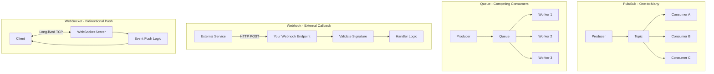
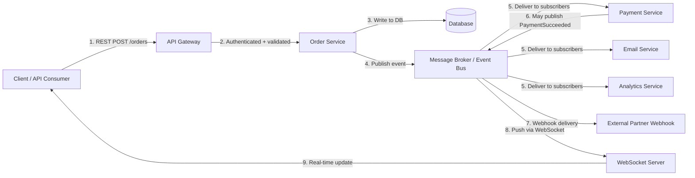

# Event-Driven API Architecture

> **Event-driven APIs extend API attack surface beyond synchronous HTTP: asynchronous events, message queues, webhooks, and streaming endpoints introduce new trust boundaries, replay risks, weak validation, and policy gaps that authorized testers must map and validate.**

---

## 📚 Table of Contents

1. [What Is It? (Beginner Explanation)](#what-is-it-beginner-explanation)
2. [Authorized Testing Framing](#authorized-testing-framing)
3. [Why Event-Driven Architecture Matters](#why-event-driven-architecture-matters)
4. [Core Components and Patterns](#core-components-and-patterns)
5. [Request-Response vs Event-Driven vs Hybrid](#request-response-vs-event-driven-vs-hybrid)
6. [Event Flow and Trust Boundaries](#event-flow-and-trust-boundaries)
7. [Common Event-Driven Technologies](#common-event-driven-technologies)
8. [Security Failure Patterns](#security-failure-patterns)
9. [What to Extract from API Specs](#what-to-extract-from-api-specs)
10. [Beginner-to-Advanced Testing Workflow](#beginner-to-advanced-testing-workflow)
11. [Advanced Testing Topics](#advanced-testing-topics)
12. [Practical Authorized Checks](#practical-authorized-checks)
13. [Detection and Monitoring](#detection-and-monitoring)
14. [Reporting Guidance](#reporting-guidance)
15. [Key Takeaways](#key-takeaways)
16. [References](#references)

---

## What Is It? (Beginner Explanation)

### 🧠 The mental model

Most people think of APIs as **request-response**: client asks, server answers, connection ends.

```text
Client → "GET /orders/123" → Server
Client ← "200 OK + JSON" ← Server
```

But modern APIs increasingly rely on **events**: actions happen, and systems react **later**, **somewhere else**, sometimes by sending messages to many systems at once.

```text
User places order → "OrderCreated" event published → Queue/Broker
                                                         ↓
                         Payment Service ← reads event and charges card
                         Email Service ← reads event and sends confirmation
                         Inventory Service ← reads event and reserves stock
                         Analytics Service ← reads event and tracks metrics
```

No one waits for everyone to finish. Each service processes the event **asynchronously** on its own schedule.

### Real-world example

When you order from a food delivery app:

1. The app sends a REST request: `POST /orders`
2. The backend creates the order and **publishes an event**: `OrderPlaced`
3. Multiple backend services **subscribe** to that event:
   - Restaurant service notifies the kitchen
   - Payment service charges your card
   - Delivery assignment service finds a driver
   - Notification service sends you a confirmation
4. Each service works independently and may trigger **more events** (DriverAssigned, PaymentSucceeded, etc.)

That web of asynchronous messages is **event-driven architecture**.

### Why systems use it

- **Decoupling**: Services don't need to know about each other directly
- **Scalability**: Async processing handles spikes better
- **Resilience**: If one consumer fails, others keep working
- **Real-time updates**: WebSockets and Server-Sent Events push data to clients

### Why security testing changes

In traditional REST, you test one endpoint at a time. In event-driven systems, you must also think about:

- **Who can publish events?**
- **Who can subscribe to them?**
- **Are events validated and authenticated?**
- **Can old events be replayed maliciously?**
- **Do async consumers enforce the same authorization as REST APIs?**

---

## ✅ Authorized Testing Framing

> **This topic should always be applied in a defensive, authorized context.**

Event-driven systems often involve:

- internal message brokers (Kafka, RabbitMQ, AWS SQS, Azure Service Bus)
- webhook endpoints that may accept external input
- WebSocket or SSE connections with long-lived state
- asynchronous workers that process untrusted messages
- event streams that cross trust boundaries

**Safe authorized testing:**

- map event flows from documentation, IaC, and architecture diagrams
- test webhook endpoints for signature validation, replay protection, and injection risks
- validate consumer authorization in lab/staging environments
- review event schemas for sensitive data exposure
- assess monitoring and audit capabilities for async paths
- recommend improved event validation, signing, and defense-in-depth

**Unsafe or prohibited testing:**

- flooding production queues with malicious events
- replaying captured production events without explicit permission
- publishing events directly to internal brokers outside authorized scope
- disrupting async workers or consumer groups in live systems
- harvesting event payloads that may contain PII or secrets

Always confirm scope, change-control windows, and rollback plans before testing event infrastructure.

---

## 🏗️ Why Event-Driven Architecture Matters

### OWASP API Security Top 10 2023 connections

Event-driven patterns intersect with multiple OWASP API risks:

| OWASP API Risk | Event-Driven Connection |
|---|---|
| **API1:2023 — Broken Object Level Authorization** | Async consumers may skip object ownership checks that REST endpoints enforce |
| **API2:2023 — Broken Authentication** | Webhooks, SSE, or message consumers may trust headers or unsigned payloads |
| **API3:2023 — Broken Object Property Level Authorization** | Event payloads often contain full objects, exposing fields not intended for all consumers |
| **API4:2023 — Unrestricted Resource Consumption** | Malicious event floods can overwhelm queues, workers, or WebSocket connections |
| **API6:2023 — Unrestricted Access to Sensitive Business Flows** | Async flows may bypass rate limits applied only to synchronous APIs |
| **API8:2023 — Security Misconfiguration** | Queue permissions, webhook secrets, and event schemas often drift from REST hardening |
| **API9:2023 — Improper Inventory Management** | Webhook endpoints, internal consumers, and legacy event subscriptions are often undocumented |
| **API10:2023 — Unsafe Consumption of APIs** | Services consuming external webhooks or partner events may trust input too much |

### Real-world attack scenarios (defensive framing)

These examples show vulnerabilities that authorized testers might discover:

- **Webhook signature bypass**: An e-commerce platform accepts Stripe webhooks but doesn't verify signatures, allowing forged payment-success events
- **Event replay**: Deleted records reappear because a replayed "ItemCreated" event bypasses timestamp validation
- **Missing authorization in consumers**: A REST API enforces row-level security, but the background worker reading "DataExport" events returns all rows
- **Queue poisoning**: An attacker with low-privilege API access publishes malformed events that crash downstream workers
- **WebSocket authorization bypass**: A user subscribes to `/ws/orders/{id}` but no check validates they own that order

---

## 🧩 Core Components and Patterns

### Key terminology

| Term | Definition | Example |
|---|---|---|
| **Event** | A fact that something happened | `OrderCreated`, `UserLoggedIn`, `PaymentFailed` |
| **Producer / Publisher** | System that emits events | Order service publishes `OrderCreated` |
| **Consumer / Subscriber** | System that reacts to events | Email service subscribes to `OrderCreated` |
| **Message broker / Event bus** | Middleware that routes events | Kafka, RabbitMQ, AWS SNS/SQS, Azure Event Hubs |
| **Topic / Queue** | Named channel for event delivery | `orders.created`, `user-events`, `payment-notifications` |
| **Webhook** | HTTP callback delivering events to external or internal endpoints | `POST https://partner.example.com/webhook` with event payload |
| **WebSocket / SSE** | Persistent connection for real-time push | Chat apps, live dashboards, stock tickers |
| **Event sourcing** | Storing events as the primary source of truth | Append-only event log, replay to rebuild state |
| **CQRS** | Separating command (write) and query (read) models | Write goes to event store, read uses materialized view |

### Common event-driven patterns



---

## 📊 Request-Response vs Event-Driven vs Hybrid

| Aspect | Request-Response (REST/GraphQL) | Event-Driven (Async) | Hybrid (Both) |
|---|---|---|---|
| **Client expectation** | Immediate response | Fire-and-forget, async callback, or streaming | Sync for reads, async for writes |
| **Coupling** | Client knows server endpoint | Client and backend decoupled through broker | Mixed |
| **Scaling** | Scale API servers | Scale workers and broker independently | Scale different layers independently |
| **Failure handling** | Return error code immediately | Retry, dead-letter queue, circuit breaker | Context-dependent |
| **Security model** | Per-request auth + authz | Per-event signing, consumer identity, topic ACLs | Layered: both sync and async controls |
| **Typical protocols** | HTTP/HTTPS, gRPC | AMQP, Kafka protocol, WebSocket, HTTP webhooks | All of the above |
| **Audit trail** | Request logs, access logs | Event logs, consumer offsets, dead-letter analysis | Unified observability challenge |

### Example: Order placement in different styles

**Request-Response (REST):**

```http
POST /orders HTTP/1.1
Authorization: Bearer <token>
Content-Type: application/json

{
  "items": [{"productId": "A123", "quantity": 2}],
  "shippingAddress": {...}
}

HTTP/1.1 201 Created
Location: /orders/9876
{
  "orderId": "9876",
  "status": "processing",
  "total": 49.99
}
```

Client waits for the full order pipeline to complete or gets a queued status.

**Event-Driven (Async):**

```text
Client → POST /orders → API accepts quickly, returns 202 Accepted
API → publishes OrderCreatedEvent to broker
  → Inventory service reserves stock
  → Payment service charges card
  → Shipping service creates label
  → Notification service emails customer
Each service processes independently.
Client polls /orders/9876 or receives webhook/WebSocket update.
```

**Hybrid (Common in production):**

```text
POST /orders → sync validation, auth, writes to DB, returns 201
           └─→ publishes OrderCreatedEvent for async follow-up
                 └─→ Email, analytics, audit trail handled async
```

---

## 🔐 Event Flow and Trust Boundaries

### Typical flow in a microservices system



### Trust boundaries to analyze

| Boundary | Question | Security concern |
|---|---|---|
| **Gateway → Producer** | Does the gateway validate the initial request? | Weak input validation may propagate through events |
| **Producer → Broker** | Who can publish to this topic? | Unauthorized publishers can inject malicious events |
| **Broker → Consumer** | Does the consumer authenticate the event source? | Consumers may trust broker too much |
| **Consumer → Business logic** | Does the consumer validate event schema and authorization? | Replayed, stale, or unauthorized events may succeed |
| **Internal → External webhook** | Is the outbound event sanitized? | Sensitive data leakage to partners |
| **External → Internal webhook** | Is the signature validated? | Forged events from attackers |
| **WebSocket connection** | Is the socket authorized per-message or just on connect? | Long-lived connections may outlive token expiry |

---

## 🛠️ Common Event-Driven Technologies

### Message brokers and event streaming

| Technology | Type | Common Use Cases | Security Features | Testing Considerations |
|---|---|---|---|---|
| **Apache Kafka** | Distributed event streaming platform | High-throughput logs, event sourcing, real-time analytics | SASL/SCRAM, mTLS, ACLs, schema registry integration | Topic permissions, consumer group access, schema validation |
| **RabbitMQ** | AMQP message broker | Task queues, pub/sub, RPC patterns | TLS, user/vhost permissions, plugin-based auth | Queue access control, message TTL, dead-letter handling |
| **AWS SQS/SNS** | Managed queue/pub-sub | Decoupling microservices, fan-out notifications | IAM policies, encryption at rest/in transit, VPC endpoints | Policy drift, overly permissive cross-account access |
| **Azure Service Bus** | Enterprise messaging | Reliable message delivery, sessions, transactions | Managed identity, RBAC, key rotation | Namespace isolation, topic/subscription rules |
| **Google Pub/Sub** | Global pub/sub messaging | Real-time event ingestion, streaming analytics | IAM, encryption, VPC Service Controls | Topic/subscription permissions, push vs pull endpoints |
| **Redis Streams** | In-memory data structure | Lightweight event streams, caching + messaging | AUTH, ACLs (Redis 6+), TLS | Network exposure, weak default passwords |
| **NATS** | Cloud-native messaging | Microservices, IoT, edge computing | TLS, user/account auth, JWTs | Subject-based permissions, leaf node security |

### Webhook and real-time APIs

| Pattern | Protocol | Example | Security Focus |
|---|---|---|---|
| **Webhooks (inbound)** | HTTP POST callbacks | Stripe payment events, GitHub push notifications | Signature validation (HMAC), IP allowlisting, replay protection |
| **Webhooks (outbound)** | HTTP POST from your API | Sending events to customer systems | Sanitization, secret management, retry/backoff, TLS enforcement |
| **WebSockets** | Persistent TCP, bidirectional | Chat apps, live dashboards, gaming | Token/session validation, message-level authz, rate limiting |
| **Server-Sent Events (SSE)** | HTTP streaming, server → client only | Live notifications, progress updates | Same-origin policy, token in query/header, DoS risk |
| **gRPC Streaming** | HTTP/2 streams | Microservice event streams | mTLS, metadata-based auth, schema enforcement |

---

## 🚨 Security Failure Patterns

### 1. Missing or weak webhook signature validation

**What it looks like:**

An API receives webhook POST requests but doesn't verify HMAC signatures or simply checks for a static `Authorization` header.

**Example vulnerable code (Python):**

```python
@app.route('/webhook/stripe', methods=['POST'])
def stripe_webhook():
    payload = request.get_json()
    # ❌ NO signature validation
    if payload['type'] == 'payment_intent.succeeded':
        mark_order_paid(payload['data']['object']['id'])
    return '', 200
```

**Attack scenario (defensive framing):**

An attacker sends a forged POST to `/webhook/stripe` with:

```json
{
  "type": "payment_intent.succeeded",
  "data": {"object": {"id": "any-order-id"}}
}
```

Result: Any order is marked paid without payment.

**Secure pattern:**

```python
import hmac
import hashlib

@app.route('/webhook/stripe', methods=['POST'])
def stripe_webhook():
    payload = request.data
    sig_header = request.headers.get('Stripe-Signature')
    secret = os.environ['STRIPE_WEBHOOK_SECRET']
    
    # ✅ Verify signature
    try:
        event = stripe.Webhook.construct_event(payload, sig_header, secret)
    except ValueError:
        return 'Invalid payload', 400
    except stripe.error.SignatureVerificationError:
        return 'Invalid signature', 400
    
    if event['type'] == 'payment_intent.succeeded':
        mark_order_paid(event['data']['object']['id'])
    return '', 200
```

### 2. Event replay attacks

**What it looks like:**

Events lack timestamps or nonce validation. An attacker captures a legitimate event and replays it later.

**Example:**

1. User deletes a resource → `ResourceDeleted` event published
2. Attacker captures event from logs or network
3. Admin restores resource from backup
4. Attacker replays `ResourceDeleted` event
5. Resource is deleted again

**Mitigations:**

- Include event timestamp and reject old events (e.g., older than 5 minutes)
- Use nonce/idempotency keys and track processed event IDs
- Implement event versioning with monotonic sequence numbers

**Example event schema with replay protection:**

```json
{
  "eventId": "evt_1a2b3c4d5e",
  "eventType": "OrderCancelled",
  "timestamp": "2024-03-15T14:32:10Z",
  "version": "1.0",
  "nonce": "unique-idempotency-key",
  "data": {
    "orderId": "12345",
    "reason": "customer-request"
  },
  "signature": "sha256=..."
}
```

Consumer logic:

```python
def process_event(event):
    # Check timestamp
    event_time = datetime.fromisoformat(event['timestamp'])
    if datetime.utcnow() - event_time > timedelta(minutes=5):
        log_warning('Event too old, ignoring')
        return
    
    # Check idempotency
    if redis.exists(f"processed:{event['eventId']}"):
        log_info('Event already processed')
        return
    
    # Process event
    handle_order_cancellation(event['data']['orderId'])
    
    # Mark as processed
    redis.setex(f"processed:{event['eventId']}", 86400, '1')
```

### 3. Insufficient authorization in async consumers

**What it looks like:**

REST API enforces object-level authorization, but background consumers process events without checking permissions.

**Example:**

REST endpoint:

```python
@app.route('/orders/<order_id>', methods=['GET'])
@require_auth
def get_order(order_id):
    order = db.get_order(order_id)
    # ✅ Check user owns this order
    if order.user_id != current_user.id:
        abort(403)
    return jsonify(order)
```

Event consumer:

```python
def handle_order_export_event(event):
    order_id = event['data']['orderId']
    order = db.get_order(order_id)
    # ❌ NO ownership check
    export_to_s3(order)
```

**Attack scenario:**

1. Attacker calls `POST /orders/export` with `orderId=victim-order`
2. API publishes `OrderExportRequested` event
3. Consumer exports the order without verifying ownership
4. Attacker downloads victim's order data

**Mitigation:**

Include user context in events and validate in consumers:

```json
{
  "eventType": "OrderExportRequested",
  "data": {
    "orderId": "12345",
    "requestedBy": {
      "userId": "user-abc",
      "permissions": ["order:read"]
    }
  }
}
```

```python
def handle_order_export_event(event):
    order_id = event['data']['orderId']
    user_id = event['data']['requestedBy']['userId']
    
    order = db.get_order(order_id)
    # ✅ Validate authorization
    if order.user_id != user_id:
        log_security_event('Unauthorized export attempt')
        return
    
    export_to_s3(order)
```

### 4. Queue/topic permission sprawl

**What it looks like:**

IAM policies or broker ACLs grant overly broad publish/subscribe permissions.

**Example (AWS SQS policy):**

```json
{
  "Effect": "Allow",
  "Principal": "*",
  "Action": "sqs:SendMessage",
  "Resource": "arn:aws:sqs:us-east-1:123456789012:critical-orders"
}
```

Any AWS principal can publish to this queue.

**Better approach:**

```json
{
  "Effect": "Allow",
  "Principal": {
    "AWS": "arn:aws:iam::123456789012:role/OrderServiceRole"
  },
  "Action": "sqs:SendMessage",
  "Resource": "arn:aws:sqs:us-east-1:123456789012:critical-orders"
}
```

Only the Order Service role can publish.

### 5. Sensitive data in event payloads

**What it looks like:**

Events contain full objects including PII, secrets, or internal metadata.

**Example:**

```json
{
  "eventType": "UserRegistered",
  "data": {
    "userId": "user-123",
    "email": "victim@example.com",
    "passwordHash": "$2b$10$...",
    "ssn": "123-45-6789",
    "internalNotes": "High-value customer, VIP support"
  }
}
```

Multiple consumers receive this event. Analytics, logging, and partner systems now have access to SSN and password hashes.

**Mitigation:**

- Use event payload minimization (include only IDs, consumers fetch details with proper authz)
- Apply field-level encryption for sensitive data
- Use separate topics for different sensitivity levels

**Improved event:**

```json
{
  "eventType": "UserRegistered",
  "data": {
    "userId": "user-123",
    "email": "victim@example.com",
    "registeredAt": "2024-03-15T14:32:10Z"
  }
}
```

Consumers that need more data call `GET /users/{userId}` with proper authorization.

### 6. WebSocket authorization gaps

**What it looks like:**

Authorization happens only at connection time, not per-message.

**Example vulnerable code:**

```javascript
// Server
io.on('connection', (socket) => {
  // ✅ Check auth on connect
  if (!socket.handshake.auth.token) {
    socket.disconnect();
    return;
  }
  
  // ❌ No per-message authorization
  socket.on('subscribe', (data) => {
    socket.join(`order:${data.orderId}`);
  });
  
  socket.on('update_order', (data) => {
    updateOrder(data.orderId, data.updates);
    io.to(`order:${data.orderId}`).emit('order_updated', data);
  });
});
```

**Attack scenario:**

1. Attacker connects with valid token
2. Attacker subscribes to `order:victim-order-id`
3. Attacker sends `update_order` for victim's order
4. No ownership check occurs

**Mitigation:**

```javascript
socket.on('subscribe', async (data) => {
  const user = await validateToken(socket.handshake.auth.token);
  const order = await getOrder(data.orderId);
  
  // ✅ Validate per-message authorization
  if (order.userId !== user.id) {
    socket.emit('error', {message: 'Unauthorized'});
    return;
  }
  
  socket.join(`order:${data.orderId}`);
});
```

### 7. Unbounded event processing (resource exhaustion)

**What it looks like:**

No rate limiting or backpressure on event consumers.

**Attack scenario:**

1. Attacker floods API with `POST /orders` requests
2. Each creates an `OrderCreated` event
3. Downstream workers process each event (email, analytics, inventory)
4. Workers overwhelm databases, external APIs, or run out of memory

**Mitigations:**

- Consumer-side rate limiting and backpressure
- Queue depth alarms and circuit breakers
- Worker autoscaling with upper limits
- Event filtering and deduplication

---

## 📄 What to Extract from API Specs

Modern API documentation increasingly includes event-driven components.

### OpenAPI extensions

Some organizations extend OpenAPI/Swagger with async info:

```yaml
# Custom extension
x-async-api:
  events:
    - name: OrderCreated
      channel: orders.created
      schema:
        $ref: '#/components/schemas/OrderEvent'
    - name: PaymentSucceeded
      channel: payments.succeeded
      schema:
        $ref: '#/components/schemas/PaymentEvent'
```

### AsyncAPI Specification

AsyncAPI is the standard for documenting event-driven APIs (see References).

**Example AsyncAPI document:**

```yaml
asyncapi: 2.6.0
info:
  title: Order Service Events
  version: 1.0.0
servers:
  production:
    url: kafka.example.com:9092
    protocol: kafka
channels:
  orders.created:
    subscribe:
      summary: Receive order creation events
      message:
        $ref: '#/components/messages/OrderCreated'
  orders.cancelled:
    subscribe:
      message:
        $ref: '#/components/messages/OrderCancelled'
components:
  messages:
    OrderCreated:
      payload:
        type: object
        properties:
          orderId:
            type: string
          userId:
            type: string
          total:
            type: number
          createdAt:
            type: string
            format: date-time
```

### What to look for in specs

| Documentation Element | Testing Value |
|---|---|
| **Event/message schemas** | Validate required fields, identify injection points, check for sensitive data |
| **Channel/topic names** | Map subscription permissions, look for overly permissive wildcards |
| **Producer/consumer roles** | Identify which services can publish and subscribe |
| **Security schemes** | Check for SASL, TLS, OAuth, HMAC signature requirements |
| **Webhook endpoints** | Test signature validation, replay protection, error handling |
| **WebSocket/SSE routes** | Validate authentication, per-message authorization, connection limits |

### Inventory questions

- Are all event channels documented?
- Are internal-only topics separated from partner-facing webhooks?
- Do schemas match actual payloads (schema drift)?
- Are deprecated events still being produced?
- Do webhook endpoints have documented signature algorithms?

---

## 🔬 Beginner-to-Advanced Testing Workflow

### Beginner: Map the async landscape

**Objective:** Understand what event-driven components exist.

**Steps:**

1. **Review documentation**
   - Look for AsyncAPI specs, webhook docs, WebSocket endpoints
   - Check infrastructure-as-code (Terraform, CloudFormation) for queues, topics, brokers

2. **Identify event endpoints**
   - Webhook receivers: `POST /webhooks/*`
   - WebSocket/SSE: `ws://`, `wss://`, `/events`, `/stream`
   - Admin/debugging endpoints: `/kafka/topics`, `/queues/list`

3. **Map producers and consumers**
   - Which services publish events?
   - Which services subscribe?
   - Are there external partners receiving webhooks?

4. **Catalog event types**
   - `UserCreated`, `OrderPlaced`, `PaymentFailed`, etc.
   - What data do they carry?

**Deliverable:** An inventory of async components and event flows.

### Intermediate: Test webhook and WebSocket security

**Objective:** Validate authentication, authorization, and input handling.

**Webhook testing:**

1. **Signature validation**
   - Send webhook without signature → should reject
   - Send with invalid signature → should reject
   - Send with valid signature → should accept
   - Test signature algorithm (HMAC-SHA256, etc.)

2. **Replay protection**
   - Capture legitimate webhook
   - Replay immediately → behavior?
   - Replay after 10 minutes → should reject if timestamp validation exists

3. **Input validation**
   - Send malformed JSON → should handle gracefully
   - Send unexpected fields → should ignore or reject
   - Send injection payloads in event data → check for SQLi, command injection, XSS

**Example test (using curl):**

```bash
# Test webhook without signature
curl -X POST https://api.example.com/webhook/payment \
  -H "Content-Type: application/json" \
  -d '{"type":"payment.succeeded","id":"fake-123"}'

# Expected: 401 Unauthorized or 400 Bad Request

# Test with valid signature (example using HMAC-SHA256)
payload='{"type":"payment.succeeded","id":"order-123","timestamp":"2024-03-15T14:32:10Z"}'
signature=$(echo -n "$payload" | openssl dgst -sha256 -hmac "webhook-secret" | awk '{print $2}')

curl -X POST https://api.example.com/webhook/payment \
  -H "Content-Type: application/json" \
  -H "X-Webhook-Signature: sha256=$signature" \
  -d "$payload"

# Expected: 200 OK
```

**WebSocket testing:**

1. **Connection authentication**
   - Connect without token → should reject
   - Connect with expired token → should reject
   - Connect with valid token → should succeed

2. **Per-message authorization**
   - Subscribe to resource you don't own → should reject
   - Update resource you don't own → should reject

3. **Rate limiting**
   - Send rapid messages → should throttle or disconnect

**Example test (using wscat):**

```bash
# Install wscat: npm install -g wscat

# Test connection without auth
wscat -c wss://api.example.com/ws
# Expected: Connection rejected

# Test with token in query parameter
wscat -c "wss://api.example.com/ws?token=valid-jwt"
# Expected: Connection accepted

# Send subscribe message
> {"action":"subscribe","resource":"order","id":"12345"}
# Expected: Success if you own order 12345, error otherwise
```

### Advanced: Test async consumer authorization and event injection

**Objective:** Validate that background workers enforce proper authorization and handle untrusted events safely.

**This requires authorized access to staging/test environments and proper scoping.**

1. **Event injection testing**
   - Publish test events directly to broker (if in scope)
   - Validate that consumers:
     - Authenticate event source
     - Validate event schema
     - Enforce object-level authorization
     - Handle malformed events gracefully

2. **Authorization bypass via events**
   - Scenario: REST API checks `user_id == current_user.id`
   - Test: Publish event with different `user_id`
   - Expected: Consumer should also validate ownership

**Example (Kafka testing with kafkacat in authorized lab):**

```bash
# Produce a test event to a topic
echo '{"eventType":"OrderExport","data":{"orderId":"victim-order","userId":"attacker-id"}}' | \
  kafkacat -P -b kafka.lab.internal:9092 -t order-events

# Observe consumer behavior:
# ✅ Secure: Consumer validates userId matches order ownership
# ❌ Vulnerable: Consumer exports order without validation
```

3. **Dead letter queue analysis**
   - Review events that failed processing
   - Look for error messages that leak internal details
   - Check if poisoned messages can DoS the consumer

4. **Event schema validation**
   - Send events with missing required fields
   - Send events with type confusion (string vs int)
   - Send events exceeding size limits

---

## 🔒 Advanced Testing Topics

### Event sourcing and CQRS security

**Event sourcing** stores all changes as immutable events. This creates unique testing considerations:

- **Event log access control**: Who can read the full event history?
- **Replay security**: Rebuilding state from events must apply current authorization rules
- **Event schema evolution**: Older events may lack security fields added later
- **Snapshot poisoning**: If snapshots are used for performance, are they validated?

**Testing approach:**

1. Identify event store (e.g., EventStore, custom Kafka topic)
2. Check read permissions (can regular users access event log?)
3. Test replay: If state is rebuilt from events, are all security checks reapplied?

### Schema registries

Technologies like Confluent Schema Registry enforce event schemas.

**Security questions:**

- Who can register new schemas?
- Can schemas be deleted or modified?
- Are breaking changes prevented?
- Do schemas enforce field-level encryption for sensitive data?

**Testing:**

```bash
# Query schema registry (if accessible)
curl http://schema-registry.internal:8081/subjects

# Attempt to register a malicious schema
curl -X POST http://schema-registry.internal:8081/subjects/orders-value/versions \
  -H "Content-Type: application/vnd.schemaregistry.v1+json" \
  -d '{"schema":"{\"type\":\"record\",\"name\":\"FakeOrder\",\"fields\":[{\"name\":\"adminAccess\",\"type\":\"boolean\"}]}"}'

# Expected: Rejected if not authorized
```

### Distributed tracing for event flows

Event-driven systems benefit from distributed tracing (OpenTelemetry, Jaeger, Zipkin).

**Security testing value:**

- Trace context may leak internal service names, versions, timing
- Trace IDs in events can help correlate async flows
- Missing trace context may indicate shadow consumers

**What to check:**

- Are trace headers (`traceparent`, `X-B3-TraceId`) propagated through events?
- Do logs expose sensitive trace data?
- Can attackers inject malicious trace IDs?

### Multi-tenancy in event systems

**Challenge:** Ensuring events for Tenant A don't leak to Tenant B.

**Common approaches:**

- Separate topics per tenant: `tenant-a.orders`, `tenant-b.orders`
- Topic partitioning with tenant-based routing
- Consumer filtering with tenant context validation

**Testing:**

1. Subscribe to another tenant's topic/partition (should fail)
2. Publish event with forged `tenantId` field
3. Check if consumers validate tenant context against authentication

---

## 🧪 Practical Authorized Checks

### Pre-testing reconnaissance (documentation and mapping)

| Check | Command/Tool | What to look for |
|---|---|---|
| AsyncAPI spec review | `cat asyncapi.yaml` | Event schemas, channels, security schemes |
| Infrastructure as code | `grep -r "SNS\|SQS\|Kafka" terraform/` | Topic names, queue ARNs, ACL definitions |
| Application logs | Search for `"event published"`, `"message consumed"` | Event types, consumer behavior |
| Webhook documentation | Check `/docs`, `/api`, Postman collections | Signature algorithms, expected headers |
| WebSocket endpoint discovery | `grep -r "ws://" src/` or check docs | Connection URLs, auth mechanisms |

### Active testing (authorized staging/lab environments)

| Test | Method | Expected Secure Behavior |
|---|---|---|
| **Webhook signature validation** | Send POST without signature | 401/400 response |
| **Webhook signature bypass** | Send POST with invalid signature | 401/403 response |
| **Webhook replay** | Capture and replay legitimate request | Reject if timestamp > 5min old |
| **WebSocket auth** | Connect without token | Connection refused |
| **WebSocket per-message authz** | Subscribe to unauthorized resource | Error response, not data |
| **Event schema validation** | Publish event missing required fields | Event rejected or dead-lettered |
| **Event authorization** | Publish event for resource you don't own | Consumer should reject during processing |
| **Rate limiting** | Flood webhooks or WebSocket messages | Throttling, circuit breaker, or disconnect |
| **Event injection** | Publish malformed/malicious event | Graceful error handling, no crash |
| **Queue permission check** | Attempt to publish/subscribe with wrong role | Access denied |

### Example webhook signature validation test script

**Python script for authorized testing:**

```python
import requests
import hmac
import hashlib
import time
import json

WEBHOOK_URL = "https://staging.example.com/webhook/github"
WEBHOOK_SECRET = "test-secret-for-staging"  # From staging config

def test_webhook_signature():
    payload = {
        "action": "opened",
        "pull_request": {"id": 12345},
        "timestamp": int(time.time())
    }
    payload_bytes = json.dumps(payload).encode()
    
    # Test 1: No signature
    print("[TEST] Webhook without signature")
    resp = requests.post(WEBHOOK_URL, json=payload)
    assert resp.status_code in [401, 400, 403], f"Expected auth failure, got {resp.status_code}"
    print("✅ Rejected correctly")
    
    # Test 2: Invalid signature
    print("[TEST] Webhook with invalid signature")
    resp = requests.post(
        WEBHOOK_URL,
        json=payload,
        headers={"X-Hub-Signature-256": "sha256=fakesignature"}
    )
    assert resp.status_code in [401, 403], f"Expected auth failure, got {resp.status_code}"
    print("✅ Rejected correctly")
    
    # Test 3: Valid signature
    print("[TEST] Webhook with valid signature")
    sig = hmac.new(WEBHOOK_SECRET.encode(), payload_bytes, hashlib.sha256).hexdigest()
    resp = requests.post(
        WEBHOOK_URL,
        json=payload,
        headers={"X-Hub-Signature-256": f"sha256={sig}"}
    )
    assert resp.status_code == 200, f"Expected success, got {resp.status_code}"
    print("✅ Accepted correctly")
    
    # Test 4: Replay attack (old timestamp)
    print("[TEST] Replay with old timestamp")
    old_payload = payload.copy()
    old_payload['timestamp'] = int(time.time()) - 600  # 10 minutes ago
    old_payload_bytes = json.dumps(old_payload).encode()
    old_sig = hmac.new(WEBHOOK_SECRET.encode(), old_payload_bytes, hashlib.sha256).hexdigest()
    resp = requests.post(
        WEBHOOK_URL,
        json=old_payload,
        headers={"X-Hub-Signature-256": f"sha256={old_sig}"}
    )
    # Should reject if replay protection is implemented
    if resp.status_code in [400, 403]:
        print("✅ Replay protection working")
    else:
        print(f"⚠️  Potential replay vulnerability (status {resp.status_code})")

if __name__ == "__main__":
    test_webhook_signature()
```

---

## 📡 Detection and Monitoring

### What to monitor in event-driven systems

| Metric/Log | Why it matters for security |
|---|---|
| **Webhook signature validation failures** | May indicate attack attempts or misconfigured partners |
| **Event schema validation failures** | Potential malicious or malformed events |
| **Dead letter queue depth** | High depth may indicate poisoned messages or DoS |
| **Consumer lag** | Unusual lag may indicate resource exhaustion attack |
| **Unauthorized publish/subscribe attempts** | ACL violations, privilege escalation attempts |
| **Event replay detections** | Duplicate `eventId` or old timestamps |
| **WebSocket connection spikes** | Potential connection flooding |
| **High-volume event bursts** | May indicate event injection or compromised producer |

### Example CloudWatch/Prometheus alerts

```yaml
# Prometheus alert example
- alert: HighWebhookSignatureFailureRate
  expr: rate(webhook_signature_failures[5m]) > 10
  labels:
    severity: warning
  annotations:
    summary: "High rate of webhook signature validation failures"
    
- alert: DeadLetterQueueBacklog
  expr: aws_sqs_approximate_number_of_messages{queue="orders-dlq"} > 100
  labels:
    severity: critical
  annotations:
    summary: "Dead letter queue has over 100 messages"

- alert: UnauthorizedKafkaPublish
  expr: rate(kafka_acl_denials{operation="WRITE"}[5m]) > 5
  labels:
    severity: warning
  annotations:
    summary: "Multiple unauthorized Kafka publish attempts detected"
```

### Logging best practices

**What to log:**

```json
{
  "timestamp": "2024-03-15T14:32:10Z",
  "eventType": "webhook.received",
  "source": "github",
  "signatureValid": true,
  "eventId": "evt_abc123",
  "processingStatus": "success",
  "ipAddress": "140.82.112.0",
  "userAgent": "GitHub-Hookshot/abc"
}
```

**What NOT to log:**

- Webhook secrets or signing keys
- Full event payloads containing PII
- Authentication tokens in event headers
- Sensitive business data

---

## 📝 Reporting Guidance

### Finding template: Webhook signature validation bypass

**Title:** Webhook Endpoint Lacks Signature Validation

**Severity:** High

**Affected Component:** `POST /webhooks/payment-provider`

**Description:**

The payment provider webhook endpoint accepts POST requests without validating HMAC signatures. This allows an attacker to forge payment success events, marking orders as paid without actual payment.

**Steps to Reproduce (Authorized Testing):**

1. Send POST request to `https://staging-api.example.com/webhooks/payment-provider`
2. Payload: `{"type":"payment.success","orderId":"12345"}`
3. No `X-Signature` header included
4. Response: `200 OK`, order marked as paid

**Expected Behavior:**

Endpoint should validate HMAC-SHA256 signature in `X-Signature` header using shared webhook secret. Requests without valid signature should return `401 Unauthorized`.

**Recommendation:**

Implement signature validation using the provider's SDK or library. Example:

```python
import hmac
import hashlib

def verify_webhook(payload_bytes, signature_header, secret):
    expected_sig = hmac.new(secret.encode(), payload_bytes, hashlib.sha256).hexdigest()
    return hmac.compare_digest(signature_header, expected_sig)
```

**References:**

- OWASP API Security Top 10 2023: API2:2023 Broken Authentication
- OWASP API10:2023 Unsafe Consumption of APIs

---

### Finding template: Missing authorization in event consumer

**Title:** Order Export Consumer Bypasses Object-Level Authorization

**Severity:** High

**Affected Component:** `OrderExportConsumer` processing `order.export.requested` events

**Description:**

The background worker that processes order export events does not validate whether the requesting user owns the order. While the REST API correctly enforces authorization, events published to the `order.export.requested` topic bypass this control.

**Steps to Reproduce (Authorized Lab Testing):**

1. User A authenticates and calls `POST /api/orders/export` with `orderId` belonging to User B
2. API publishes event: `{"eventType":"order.export.requested","orderId":"user-b-order","requestedBy":"user-a"}`
3. `OrderExportConsumer` processes event and exports User B's order to User A's S3 bucket
4. No authorization check occurs in the consumer

**Expected Behavior:**

Consumer should validate that `requestedBy` user ID matches the `userId` field of the order before processing export.

**Recommendation:**

Add authorization check in consumer:

```python
def handle_export_event(event):
    order = db.get_order(event['orderId'])
    if order.user_id != event['requestedBy']:
        log_security_event('Unauthorized export attempt', event)
        return
    process_export(order)
```

**Impact:**

- Broken Object Level Authorization (BOLA/IDOR)
- Unauthorized access to customer order data

**References:**

- OWASP API1:2023 Broken Object Level Authorization
- CWE-639: Authorization Bypass Through User-Controlled Key

---

### Finding template: Event replay vulnerability

**Title:** Webhook Endpoint Vulnerable to Replay Attacks

**Severity:** Medium

**Affected Component:** `POST /webhooks/shipment-tracking`

**Description:**

The shipment tracking webhook does not implement timestamp validation or nonce tracking. Captured legitimate webhook requests can be replayed indefinitely, potentially causing duplicate notifications, inventory updates, or state changes.

**Steps to Reproduce:**

1. Capture legitimate webhook POST request
2. Replay request 1 hour later
3. Observe that endpoint processes event again, triggering duplicate actions

**Expected Behavior:**

Endpoint should reject events with timestamps older than 5 minutes or track processed event IDs to prevent duplicate processing.

**Recommendation:**

1. Add timestamp validation:
```python
event_time = datetime.fromisoformat(event['timestamp'])
if datetime.utcnow() - event_time > timedelta(minutes=5):
    return {'error': 'Event too old'}, 400
```

2. Track processed event IDs in Redis/database:
```python
if redis.exists(f"webhook:{event['id']}"):
    return {'error': 'Event already processed'}, 200
redis.setex(f"webhook:{event['id']}", 86400, '1')
```

**Impact:**

- Duplicate order fulfillment
- Incorrect inventory counts
- Repeated customer notifications

---

## 🎯 Key Takeaways

### For beginners

- Event-driven APIs extend security testing beyond HTTP request-response
- Webhooks, WebSockets, and message queues create new attack surfaces
- Always verify signatures on inbound webhooks
- Authorization must be enforced in async consumers, not just REST endpoints

### For intermediate practitioners

- Map both synchronous and asynchronous API flows
- Test webhook signature validation, replay protection, and input handling
- Validate WebSocket authentication and per-message authorization
- Review event schemas for sensitive data exposure

### For advanced testers

- Analyze event flow authorization across producer → broker → consumer
- Test queue/topic ACLs and IAM policies for least privilege
- Investigate event sourcing replay security and schema evolution
- Assess monitoring and alerting for async security events
- Consider multi-tenancy isolation in shared event infrastructure

### Defense-in-depth principles for event-driven APIs

1. **Sign all events**: Use HMAC, JWS, or message-level signing
2. **Validate everything async**: Don't assume broker-delivered messages are safe
3. **Enforce authorization everywhere**: Consumers must check permissions, not just REST layers
4. **Implement replay protection**: Timestamps, nonces, and idempotency keys
5. **Monitor async paths**: Dead letter queues, validation failures, ACL denials
6. **Minimize event payloads**: Include only necessary data, reference IDs for sensitive fields
7. **Separate concerns**: Use different topics/queues for different security contexts

---

## 📚 References

### Standards and specifications

- **AsyncAPI Specification**: [https://www.asyncapi.com/](https://www.asyncapi.com/) — Standard for documenting event-driven APIs
- **CloudEvents Specification**: [https://cloudevents.io/](https://cloudevents.io/) — CNCF standard for describing event data
- **OWASP API Security Top 10 2023**: [https://owasp.org/API-Security/](https://owasp.org/API-Security/)
- **WebSocket Protocol (RFC 6455)**: [https://datatracker.ietf.org/doc/html/rfc6455](https://datatracker.ietf.org/doc/html/rfc6455)
- **Server-Sent Events (W3C)**: [https://html.spec.whatwg.org/multipage/server-sent-events.html](https://html.spec.whatwg.org/multipage/server-sent-events.html)

### Technology documentation

- **Apache Kafka Security**: [https://kafka.apache.org/documentation/#security](https://kafka.apache.org/documentation/#security)
- **RabbitMQ Access Control**: [https://www.rabbitmq.com/access-control.html](https://www.rabbitmq.com/access-control.html)
- **AWS SNS/SQS Security**: [https://docs.aws.amazon.com/sns/latest/dg/sns-security-best-practices.html](https://docs.aws.amazon.com/sns/latest/dg/sns-security-best-practices.html)
- **Stripe Webhook Signatures**: [https://stripe.com/docs/webhooks/signatures](https://stripe.com/docs/webhooks/signatures)
- **GitHub Webhook Security**: [https://docs.github.com/en/webhooks/securing-your-webhooks](https://docs.github.com/en/webhooks/securing-your-webhooks)

### Research and best practices

- **Martin Fowler - Event-Driven Architecture**: [https://martinfowler.com/articles/201701-event-driven.html](https://martinfowler.com/articles/201701-event-driven.html)
- **OWASP Cheat Sheet - WebSocket Security**: [https://cheatsheetseries.owasp.org/cheatsheets/WebSocket_Security_Cheat_Sheet.html](https://cheatsheetseries.owasp.org/cheatsheets/WebSocket_Security_Cheat_Sheet.html)
- **NIST SP 800-204C - DevSecOps for Microservices**: [https://csrc.nist.gov/publications/detail/sp/800-204c/final](https://csrc.nist.gov/publications/detail/sp/800-204c/final)
- **Microsoft - Asynchronous messaging primer**: [https://learn.microsoft.com/en-us/azure/architecture/patterns/async-request-reply](https://learn.microsoft.com/en-us/azure/architecture/patterns/async-request-reply)
- **PortSwigger - WebSockets security vulnerabilities**: [https://portswigger.net/web-security/websockets](https://portswigger.net/web-security/websockets)

### Tools

- **wscat**: CLI WebSocket client — [https://github.com/websockets/wscat](https://github.com/websockets/wscat)
- **kafkacat/kcat**: Kafka producer/consumer CLI — [https://github.com/edenhill/kcat](https://github.com/edenhill/kcat)
- **AsyncAPI Studio**: Visual editor for AsyncAPI specs — [https://studio.asyncapi.com/](https://studio.asyncapi.com/)
- **Postman**: Supports WebSocket and async testing — [https://www.postman.com/](https://www.postman.com/)
- **Hookdeck**: Webhook testing and debugging — [https://hookdeck.com/](https://hookdeck.com/)

---

**Last Updated:** March 2024  
**Scope:** Event-driven API architecture security for authorized penetration testing and security assessments
