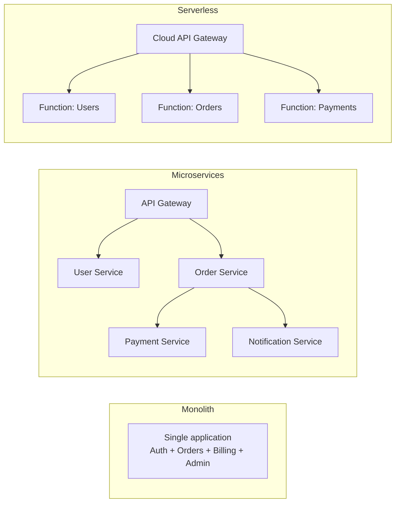
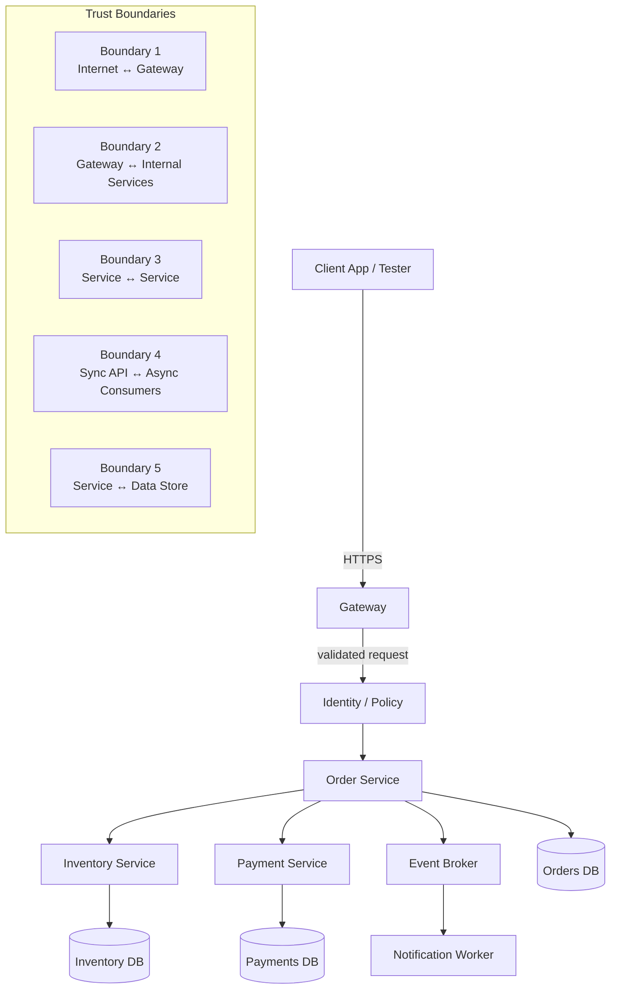
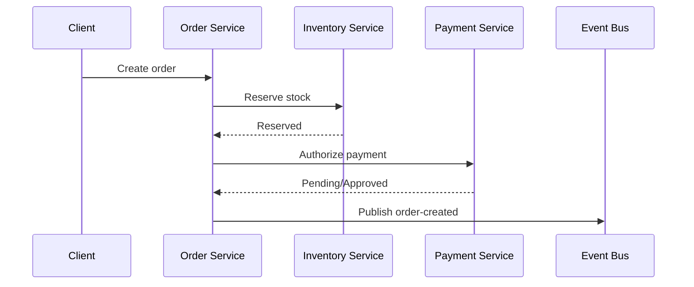

# 🧩 Microservices Architecture

> **Audience:** Beginner → Advanced | **Focus:** Understanding how microservices change API attack surface, trust boundaries, and authorized testing strategy

> **Authorized testing only:** Use this note for approved security reviews, design reviews, internal assessments, and lab environments. Do not probe internal services, queues, or control-plane components outside explicit scope and change-control approval.

---

## 📚 Table of Contents

1. [What Microservices Architecture Means](#what-microservices-architecture-means)
2. [Why It Matters for API Pentesting](#why-it-matters-for-api-pentesting)
3. [Monolith vs Microservices vs Serverless](#monolith-vs-microservices-vs-serverless)
4. [Core Building Blocks](#core-building-blocks)
5. [Request Flow and Trust Boundaries](#request-flow-and-trust-boundaries)
6. [What to Extract from an API Spec](#what-to-extract-from-an-api-spec)
7. [Beginner-to-Advanced Testing Workflow](#beginner-to-advanced-testing-workflow)
8. [Common Security Failure Patterns](#common-security-failure-patterns)
9. [Advanced Architecture Topics](#advanced-architecture-topics)
10. [Practical Authorized Checks](#practical-authorized-checks)
11. [Reporting Guidance](#reporting-guidance)
12. [Key Takeaways](#key-takeaways)
13. [References](#references)

---

## What Microservices Architecture Means

### 🧠 Beginner explanation

A **microservices architecture** breaks one application into multiple smaller services. Each service usually owns a specific business capability such as:

- user accounts
- payments
- orders
- notifications
- search
- inventory

Instead of one large application handling everything, requests move through several services that talk to each other over APIs, RPC, or message brokers.

A simple mental model:

- **Monolith** = one large building with many rooms
- **Microservices** = a campus of smaller buildings connected by roads

That separation helps teams deploy faster and scale parts independently, but it also creates **more network paths, more identities, more policy decisions, and more places where trust can fail**.

### 🏗️ Technical definition

A microservices system is typically:

- composed of **independently deployable services**
- organized around **business capabilities** rather than technical layers
- connected by **network calls** instead of in-process function calls
- built with **service-specific contracts** such as REST, gRPC, events, or messaging
- operated with shared platform components like **API gateways, service discovery, observability, and service meshes**

This matches the common industry descriptions from Martin Fowler and microservices.io: small, loosely coupled services with explicit remote interfaces, often owned by separate teams and deployed independently.

---

## Why It Matters for API Pentesting

In a monolith, a tester often focuses on a smaller set of entry points. In microservices, the real challenge is not just “is endpoint X vulnerable?” but:

- **Which service actually enforces authentication?**
- **Where does authorization happen: gateway, service, or both?**
- **Does internal traffic get the same security controls as external traffic?**
- **Do asynchronous consumers validate input as strictly as synchronous APIs?**
- **Can one weak service become a pivot into others?**

### Security shift in one sentence

Microservices move risk from a single application boundary to **many smaller trust boundaries**.

### Why testers care

| Architectural property | Operational benefit | Security consequence |
|---|---|---|
| Independent services | Faster releases | Inconsistent auth, validation, and logging across services |
| Network-based communication | Flexible scaling | More exposed paths, headers, metadata, and routing logic |
| API gateway | Centralized entry | Teams may wrongly assume gateway auth is sufficient |
| Per-service datastore | Team autonomy | Data consistency and authorization rules can diverge |
| Async messaging | Resilience and decoupling | Validation may be weaker off the main request path |
| Service mesh | Better traffic control | mTLS may protect transport while business authorization still fails |
| Multiple protocols | Fit-for-purpose engineering | REST/gRPC/events can drift in policy and visibility |

---

## Monolith vs Microservices vs Serverless



| Property | Monolith | Microservices | Serverless |
|---|---|---|---|
| Deployable unit | Single app | Many services | Many functions |
| Internal network surface | Lower | High | Medium–High |
| Auth consistency | Usually simpler | Often inconsistent | Depends on gateway + function policies |
| Data ownership | Shared DB common | Database per service common | Often managed services |
| Failure mode | One app fails | Cascading service failures | Event/gateway/permission failures |
| Testing challenge | Route/function flaws | Trust-boundary flaws | IAM, triggers, event flows |
| Best tester mindset | Endpoint-centric | **Flow-centric** | Identity- and event-centric |

---

## Core Building Blocks

### 1. API gateway

The gateway is the **north-south** entry point for external clients. It commonly handles:

- routing
- TLS termination
- authentication
- rate limiting
- request normalization
- logging

**Important security lesson:** a secure gateway does **not** guarantee secure downstream services.

### 2. Service-to-service communication

Once inside the platform, services talk **east-west** using:

- REST/JSON
- gRPC/Protobuf
- message brokers
- event streams
- internal GraphQL/RPC patterns

Every internal call creates a new trust decision:

- who is calling?
- what identity is propagated?
- what authorization context is forwarded?
- what happens if the caller lies or omits context?

### 3. Service discovery

Microservices often use dynamic discovery rather than hardcoded IPs. In Kubernetes, a Service gives a stable endpoint while Pods come and go. That operational convenience is great for reliability, but it means the effective attack surface can shift as services scale, move, or get re-exposed through new ingress rules.

### 4. Service-specific data stores

A common microservices pattern is **database per service**. That reduces tight coupling, but it also means:

- authorization logic can diverge per service
- one service may cache or replicate sensitive fields another service protects more carefully
- stale copies can leak data after access is revoked

### 5. Messaging and events

Not all business actions happen inline. Order placement might publish events consumed by:

- billing
- shipping
- analytics
- notification workers

Security reviews must include **message producers and consumers**, not only HTTP endpoints.

### 6. Observability stack

Microservices depend heavily on:

- logs
- metrics
- traces
- correlation IDs

These tools are critical for defenders, but they can also expose internal topology, service names, tenant identifiers, or sensitive payload fragments if implemented poorly.

### 7. Service mesh

A service mesh such as Istio typically adds:

- mTLS between workloads
- policy enforcement
- telemetry
- traffic shaping

This is powerful, but testers must remember:

> **Transport security is not the same as business authorization.**

A service mesh can prove “service A talked to service B securely” while the application still accepts unauthorized actions.

---

## Request Flow and Trust Boundaries



### The five boundaries a tester should map

| Boundary | What changes there? | Typical risk |
|---|---|---|
| Internet → Gateway | Client identity enters system | Missing auth, poor normalization, weak rate limits |
| Gateway → Service | External policy becomes internal trust | Downstream services assume gateway already checked everything |
| Service → Service | Caller identity is propagated or re-created | Impersonation, over-trust, missing authorization |
| Sync API → Async consumer | Request becomes message/event | Validation gap, replay issues, hidden processing paths |
| Service → Data store | Business rule becomes data access | Over-broad queries, stale replicas, tenant mixing |

### A beginner-friendly example

A user calls:

```http
GET /api/v1/orders/12345 HTTP/1.1
Host: api.example.com
Authorization: Bearer <approved-test-token>
X-Correlation-ID: 8f5c7d1c-1234-4d95-9c4c-a2f6e1f00b44
```

What may happen internally:

1. the **gateway** validates the token
2. the **order service** checks whether the user can view order `12345`
3. the **payment service** returns masked payment status
4. the **notification service** is not called at all for this flow
5. the **trace platform** records the cross-service path

A security finding can exist at any of those points, even if the external endpoint itself looks normal.

---

## What to Extract from an API Spec

Even when testing a microservices platform, your first map often comes from an **OpenAPI/Swagger specification**, API catalog, Postman collection, or gateway route definition.

### Example API spec excerpt

```yaml
openapi: 3.0.3
info:
  title: Orders API
  version: 1.4.0
servers:
  - url: https://api.example.com
paths:
  /v1/orders/{orderId}:
    get:
      tags: [orders]
      security:
        - bearerAuth: [orders.read]
      parameters:
        - in: path
          name: orderId
          required: true
          schema:
            type: string
      responses:
        '200':
          description: Order returned
components:
  securitySchemes:
    bearerAuth:
      type: http
      scheme: bearer
      bearerFormat: JWT
```

### What a tester should pull from the spec

| Spec element | Why it matters in microservices testing |
|---|---|
| `servers` | Shows entry points, environments, and versioning patterns |
| `paths` | Identifies exposed routes and route groups |
| `tags` | Often hint at service ownership or business capability |
| `security` / `securitySchemes` | Reveals where auth is expected and which scopes matter |
| request/response schemas | Highlights object IDs, tenant identifiers, callback URLs, and privileged fields |
| versions | Helps detect deprecated routes still wired to old services |
| webhooks/callbacks | Surfaces async flows often missed in API-only reviews |

### Practical spec-driven questions

- Does the spec show **one public route** that fans out to several services?
- Are different route groups protected by **different scopes**?
- Do path names or tags hint at **internal admin** or **partner-only** services?
- Are callback URLs, file imports, or webhook targets present anywhere?
- Is the documented auth model consistent with **actual runtime behavior**?

### Safe, authorized ways to inspect a spec

```bash
# List documented routes
jq -r '.paths | keys[]' openapi.json

# Show declared security schemes
jq '.components.securitySchemes' openapi.json

# Find routes with no explicit security block
jq -r '.paths | to_entries[] | select(.value | tostring | contains("security") | not) | .key' openapi.json
```

The point is not to “attack the spec.” The point is to use the spec as an **architectural map** and compare it with the real behavior you are authorized to validate.

---

## Beginner-to-Advanced Testing Workflow

### Phase 1 — Beginner: map the visible architecture

Goal: understand the public-facing system before touching deeper components.

1. identify the gateway hostname(s)
2. collect the API spec, docs, or route inventory
3. note versions such as `/v1/`, `/v2/`, `/internal/`, `/partner/`
4. identify protocols in use: REST, GraphQL, gRPC, webhooks
5. capture headers tied to tracing, tenancy, or routing

**Good outputs:** route list, auth model summary, business capability map.

### Phase 2 — Intermediate: map trust boundaries

Goal: determine where the system **actually** makes security decisions.

Focus questions:

- Is authentication only at the gateway, or repeated per service?
- Is object-level authorization handled consistently across services?
- Are admin and partner routes separated by policy or only by naming?
- Does the system trust headers like tenant ID, role, region, or user ID from upstream services?
- Are async consumers applying the same input and policy rules as synchronous APIs?

**Good outputs:** trust-boundary diagram, service interaction notes, policy mismatch candidates.

### Phase 3 — Advanced: review distributed behavior

Goal: understand failures that only appear across multiple services.

Advanced review themes:

- fallback behavior during partial outages
- token exchange and service impersonation patterns
- replay/idempotency controls for retries
- stale data in read replicas, caches, or event consumers
- observability leakage through traces and debug headers
- route drift between gateway config and service implementation

**Good outputs:** multi-step abuse paths, consistency failures, high-confidence architectural findings.

---

## Common Security Failure Patterns

### 1. Gateway-only trust

**Pattern:** the gateway authenticates the user, but downstream services trust any request coming from the internal network.

**Why this happens:** teams confuse “inside the cluster” with “trusted.”

**What to validate safely:** whether downstream services independently verify identity and authorization when accessed through approved paths or staging routes.

### 2. Inconsistent authorization across services

**Pattern:** `GET /orders/{id}` checks ownership, but `GET /shipments/{id}` or `GET /invoice/{id}` does not.

**Why this happens:** different teams implement different checks for the same business object.

**What to validate safely:** whether adjacent services expose the same object under different access-control logic.

### 3. Header-based identity confusion

**Pattern:** internal services trust headers such as:

- `X-User-Id`
- `X-Tenant-Id`
- `X-Role`
- `X-Forwarded-Client-Cert`
- custom “verified user” headers

**Risk:** if a header is accepted from the wrong hop, identity becomes spoofable.

**Testing mindset:** verify which headers are added by trusted proxies and which are rejected from direct client input.

### 4. Shadow or stale APIs

**Pattern:** old versions remain reachable even though docs show only the new gateway routes.

**Risk:** weaker auth, missing rate limits, or outdated schemas survive behind “temporary” compatibility paths.

### 5. Async validation gap

**Pattern:** the main API validates input, but queue consumers, webhooks, import jobs, or retry workers assume the producer already sanitized everything.

**Risk:** invalid states, duplicate actions, tenant mix-ups, or hidden workflow abuse.

### 6. Overexposed observability

**Pattern:** traces, debug endpoints, or verbose errors leak:

- internal hostnames
- service names
- cloud metadata
- queue names
- stack details
- partial secrets or tokens

### 7. Transport security mistaken for authorization

**Pattern:** mTLS or mesh identity exists, but business rules are not enforced.

**Risk:** “securely authenticated service” still performs unauthorized actions on behalf of the wrong user or tenant.

---

## Advanced Architecture Topics

### 1. Sagas and eventual consistency

Microservices often replace one big ACID transaction with **many smaller local transactions**. A business action such as placing an order may involve:

- order created
- inventory reserved
- payment authorized
- shipment queued

If one step fails, compensating actions may run later.

**Security implication:** authorization and fraud checks must hold across the full workflow, not just the first API call.



Questions for advanced review:

- What happens if retries duplicate a step?
- Are compensating actions authenticated and authorized?
- Can stale events update the wrong tenant or order?

### 2. Idempotency and replay resistance

Distributed systems retry. Safe services use:

- idempotency keys
- message deduplication
- deadlines/timeouts
- monotonic state transitions

Without them, legitimate retries can become security-impacting state changes.

### 3. gRPC inside microservices

gRPC is common for east-west communication because it is strongly typed and efficient. It also adds security review considerations:

- reflection exposure
- metadata-based auth context
- method-level authorization
- streaming behavior and backpressure
- deadline handling

Safe, authorized inspection can include reviewing `.proto` files, gateway mappings, or approved `grpcurl` usage against in-scope services.

```bash
# Only against explicitly approved targets
grpcurl api.internal.example:443 list
grpcurl api.internal.example:443 describe orders.OrderService
```

### 4. Service mesh reality check

Istio and similar meshes provide strong infrastructure controls:

- workload identity
- mTLS
- traffic policy
- telemetry

But they do not magically solve:

- object-level authorization
- tenant isolation
- business-rule validation
- unsafe data propagation between services

### 5. Multi-tenant context propagation

In SaaS systems, a request often carries tenant context across multiple services.

High-value review questions:

- Is tenant context derived from a signed token or from mutable headers?
- Do background workers preserve tenant isolation?
- Are caches partitioned by tenant?
- Can trace IDs or job IDs accidentally bridge tenant data?

---

## Practical Authorized Checks

### Read-only and low-risk checks

| Check | Why it helps | Safer evidence |
|---|---|---|
| Review OpenAPI / route config | Maps external surface | Documented paths, scopes, servers |
| Compare gateway docs to runtime headers | Finds proxies and trust signals | Response headers, trace IDs, route metadata |
| Inspect error handling consistency | Finds service drift | Controlled invalid requests in staging or approved prod windows |
| Review `.proto` or async schemas | Finds hidden methods and events | Contract files, approved catalogs |
| Review service ownership tags | Finds boundary mismatches | API catalog, repo metadata, internal docs |
| Trace one business transaction end-to-end | Shows actual downstream path | Approved logs/traces with sensitive data masked |

### Checks that need explicit approval

These can be valid in mature engagements, but should be planned and authorized before execution:

- direct testing of internal-only services
- queue or topic interaction
- service mesh policy validation in production
- failover, retry, or chaos-style tests
- rate-limit and resource-consumption testing against shared gateways

### What “good” looks like

A mature microservices platform usually shows:

- authentication at the edge **and** authorization where business actions happen
- strong service identity for east-west traffic
- minimal trust in caller-supplied headers
- documented ownership per service and per route group
- explicit handling of retries and duplicate events
- observability that helps defenders without leaking secrets
- a clean inventory of active, deprecated, and internal APIs

---

## Reporting Guidance

Microservices findings are often misunderstood if written like single-endpoint bugs. Report them as **architectural weaknesses with concrete evidence**.

### Good report structure

1. **Entry point** — where the issue was observed
2. **Trust boundary** — where control should have been enforced
3. **Affected services** — which downstream systems are involved
4. **Impact path** — what could happen in the business flow
5. **Evidence gathered** — safe proof from approved testing
6. **What was intentionally not executed** — to keep the test defensive
7. **Remediation direction** — edge, service, platform, or workflow fix

### Example write-up language

> The gateway correctly authenticated the session, but downstream order-processing behavior relied on internally propagated identity without re-validating tenant context. In an authorized test scenario, this created inconsistent authorization outcomes across related services. No destructive actions were executed; evidence was limited to access-control variance and trace-confirmed service flow.

That style explains the real risk without overselling or including unnecessary attack detail.

---

## Key Takeaways

- Microservices do not remove API risk; they **redistribute** it across many trust boundaries.
- API testing in microservices is less about single endpoints and more about **flows, identities, and consistency**.
- The gateway is important, but it is **not** the whole security model.
- Service meshes protect transport; they do not replace authorization.
- Async consumers, callbacks, and background jobs belong in scope for serious architecture reviews.
- The API spec is one of your best starting points for building an architectural map.
- The best findings often come from noticing where two services implement the **same business rule differently**.

---

## References

- [Martin Fowler — Microservices](https://martinfowler.com/articles/microservices.html)
- [microservices.io — Microservice Architecture Pattern](https://microservices.io/patterns/microservices.html)
- [Kubernetes Documentation — Service](https://kubernetes.io/docs/concepts/services-networking/service/)
- [gRPC Documentation — Core Concepts, Architecture and Lifecycle](https://grpc.io/docs/what-is-grpc/core-concepts/)
- [Istio Documentation — What Is Istio?](https://istio.io/latest/docs/concepts/what-is-istio/)
- [OWASP API Security Top 10 (2023)](https://owasp.org/API-Security/)
- [OWASP Microservices Security Cheat Sheet](https://cheatsheetseries.owasp.org/cheatsheets/Microservices_Security_Cheat_Sheet.html)
