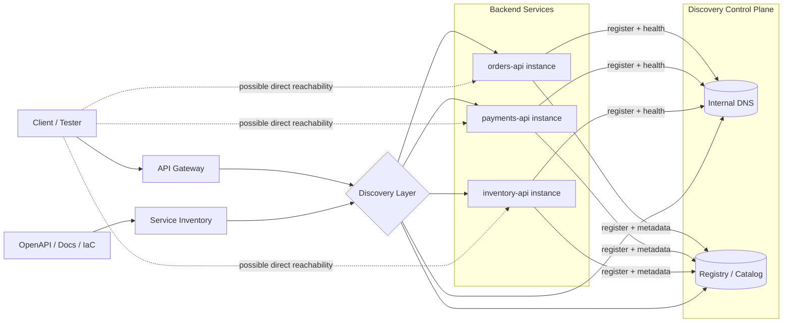
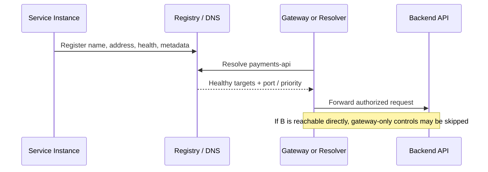

# Service Discovery

> **Service discovery is how API clients, gateways, and microservices find the current network location of a backend service. In modern API estates, weak discovery controls often create shadow APIs, internal hostname leakage, gateway bypass paths, and overly trusted east-west traffic.**

---

## 🧠 What Is It? (Beginner Explanation)

In a modern API environment, backends do **not** stay on one fixed IP forever.

- Containers restart
- Pods scale up and down
- Instances fail health checks
- Blue/green or canary deployments shift traffic
- Different environments use different hostnames

If every client hardcoded a backend like `10.0.14.23:8080`, the application would constantly break.

**Service discovery** solves that problem by giving applications a stable way to find the *current* healthy backend for a service.

Instead of saying:

```text
Send payment requests to 10.0.14.23:8080
```

applications say something closer to:

```text
Send payment requests to payments-api
```

Then DNS, a service registry, a gateway, or a service mesh resolves that logical name to the right live instance.

### Simple mental model

Think of service discovery as the **phone book + traffic controller** for APIs:

- The **phone book** maps a logical name to current endpoints
- The **traffic controller** avoids dead or unhealthy instances
- The **security problem** appears when the phone book is exposed too broadly, inaccurate, or bypasses central controls

### Service discovery vs endpoint discovery

These are related, but not the same thing:

| Topic | Question it answers | Example |
|---|---|---|
| **Endpoint discovery** | What API routes exist? | `/v1/users`, `/v1/orders/{id}` |
| **Service discovery** | Where does a client or gateway send those requests? | `orders.default.svc.cluster.local`, `orders.service.consul` |

A tester who only maps routes sees the **front door**. A tester who understands service discovery sees the **internal roads** behind that door.

> **Authorized testing only:** Service registries, internal DNS zones, cluster metadata, and mesh control planes are often sensitive infrastructure. Query them only from an approved vantage point and only when they are explicitly in scope.

---

## 🎯 Why Service Discovery Matters in API Security Testing

Service discovery is where **inventory, routing, and trust** meet.

| Tester question | Why it matters |
|---|---|
| **What names resolve to real backends?** | Reveals internal inventory, service boundaries, and shadow APIs |
| **Can a backend be reached directly without the gateway?** | May bypass WAF, auth, schema validation, rate limits, or logging |
| **Who can query the registry?** | Registry metadata often leaks internal IPs, ports, tags, environments, or health URLs |
| **Do health/status endpoints expose too much?** | Can reveal versions, dependency names, build info, or admin-only topology |
| **Does the API spec match live discovery data?** | Mismatches often indicate deprecated, hidden, or undocumented APIs |
| **How is service-to-service trust enforced?** | Weak east-west trust can turn a small foothold into broad internal reach |

This topic also overlaps strongly with:

- **Improper inventory management** in APIs
- **Deprecated or shadow services**
- **Gateway bypass**
- **Service-to-service authentication gaps**
- **Exposed infrastructure metadata**

---

## 🏗️ How It Works (Technical Deep Dive)

### Common service discovery patterns

| Pattern | Typical technologies | How resolution happens | Main strengths | Main security testing angle |
|---|---|---|---|---|
| **DNS-based discovery** | Kubernetes Service DNS, SRV records, internal DNS zones | Client/gateway resolves a name to an IP or set of targets | Simple, universal, fast | Headless services, namespace leakage, direct pod reachability |
| **Registry-based discovery** | Consul, Eureka, AWS Cloud Map | Client or platform queries a catalog of registered services | Rich metadata, health-aware | Exposed catalog APIs, weak ACL/IAM, stale entries |
| **Server-side discovery** | API gateways, reverse proxies, load balancers | Gateway resolves backend locations and forwards requests | Clients stay simple | Direct-backend access may bypass controls |
| **Mesh-assisted discovery** | Istio, Consul Connect, Linkerd-style patterns | Sidecars/proxies receive dynamic config and route internally | Strong identity and policy potential | Admin interfaces, policy drift, confusing trust boundaries |

### Key terms

| Term | Meaning |
|---|---|
| **Service** | Logical application unit, such as `payments-api` |
| **Instance** | A running copy of that service |
| **Registry** | A catalog that stores service names, instances, metadata, and health |
| **Resolver** | The component that turns a service name into an endpoint |
| **Health check** | Signal used to decide whether an instance should receive traffic |
| **Client-side discovery** | Client queries discovery system directly and chooses a target |
| **Server-side discovery** | Gateway/load balancer chooses a target for the client |
| **Headless service** | DNS returns the backing instances directly instead of one virtual IP |

---

## 📊 Diagram — Registration, Resolution, and Bypass Risk



### Security meaning of the diagram

A mature API environment usually expects traffic to flow through a **gateway or trusted internal resolver**. Security issues appear when:

- the **registry** is readable by too many identities
- the **DNS names** reveal internal structure or tenant boundaries
- the **service instance** is directly reachable from a broader network than intended
- the **gateway** applies controls that the backend does not re-check
- the **spec/documentation inventory** differs from the **live discovery inventory**

---

## 📘 Using the API Spec as a Service Discovery Map

A good API specification is not just an endpoint list. It is often a **discovery artifact**.

The OpenAPI Specification states that the `servers` array provides **connectivity information to a target server**, and it also defines objects such as `webhooks`, `security`, `tags`, and vendor extensions that can reveal how an API estate is segmented.

### What to mine from an API spec

| Spec field | What it can reveal | Why it matters for service discovery |
|---|---|---|
| **`servers`** | Environment hostnames, base paths, stage URLs, versioned gateways | May expose internal, staging, regional, or deprecated entry points |
| **`paths`** | Functional surface area | Helps map which services probably sit behind the gateway |
| **`tags`** | Service boundaries, domain ownership, team naming | Often hints at microservice names or internal responsibility split |
| **`security`** | Expected auth model | Useful when validating whether direct backend paths enforce the same controls |
| **`webhooks` / callbacks** | Inbound dependencies and asynchronous receivers | Can reveal additional hosts or services outside the main request path |
| **`externalDocs`, `contact`, support URLs** | Portals, docs hosts, support systems | May identify adjacent service domains |
| **Vendor extensions (`x-...`)** | Gateway IDs, internal upstream names, deployment hints | Often leak implementation details accidentally |

### Example OpenAPI clues

```yaml
openapi: 3.1.0
info:
  title: Billing API
  version: 1.4.0
servers:
  - url: https://api.example.com/v1
    description: Production gateway
  - url: https://billing.staging.example.net/v1
    description: Staging
paths:
  /invoices:
    get:
      tags: [billing, invoices]
webhooks:
  invoiceReady:
    post:
      description: Billing service notifies subscriber systems
x-service-name: billing-api
x-upstream-cluster: billing-v1
```

From a tester's perspective, this tiny spec already suggests:

- a **production gateway**
- a separate **staging host**
- a likely **billing microservice** boundary
- at least one **asynchronous integration path**
- internal implementation details through **vendor extensions**

### Safe, authorized ways to review an API spec

```bash
# Extract declared server URLs from an OpenAPI file
jq -r '.servers[]?.url' openapi.json | sort -u

# List documented routes
jq -r '.paths | keys[]' openapi.json

# List declared tags (often approximate service boundaries)
jq -r '.tags[]?.name' openapi.json | sort -u

# Surface webhook names if present
jq -r '.webhooks? | keys[]?' openapi.json
```

### Important limitation

A spec is only one inventory source.

- It may be **newer** than production
- It may be **older** than production
- It may omit internal services entirely
- It may describe a gateway path while the real backend topology is more complex

That is why good service discovery work always compares:

1. **Documented inventory**
2. **Discoverable infrastructure inventory**
3. **Actually reachable runtime inventory**

---

## 📊 Diagram — Client-Side vs Server-Side Discovery



### Why testers care about this distinction

- In **client-side discovery**, applications often know more about backend names and instances
- In **server-side discovery**, the gateway knows more, but backends may still be accidentally exposed
- In **mesh-based routing**, identity and policy may live in the proxy layer instead of the application layer

That means the question is never just *"Can I resolve the service?"*.

The better question is:

> **Which layer is supposed to enforce trust, and can traffic bypass that layer?**

---

## 🌐 DNS-Based Discovery

DNS remains one of the most common discovery mechanisms because every application already understands names.

### What authoritative public docs tell us

- The Kubernetes documentation explains that **Services get DNS names** and that clients can resolve them instead of tracking Pod IPs directly.
- Kubernetes also documents that **headless Services** return the set of backing Pod IPs rather than a single virtual IP.
- RFC 2782 defines **SRV records**, which carry **priority, weight, port, and target** for a service.

### Why that matters in API environments

DNS-based discovery is common for:

- Kubernetes services
- gRPC services using SRV-style records or named ports
- internal enterprise service directories
- multi-environment API platforms where names encode region or tenant

### Kubernetes-specific concepts worth understanding

| Concept | What it means | Security/testing relevance |
|---|---|---|
| **Service DNS name** | Stable name for a logical service | Good source of internal inventory |
| **Namespace-qualified name** | Example: `payments.prod` | Can reveal environment/tenant boundaries |
| **FQDN** | Example: `payments.prod.svc.cluster.local` | Useful for mapping actual routing scope |
| **Headless service** | Returns backing pod IPs directly | May expose instance identity and create direct-to-pod paths |
| **Search domain behavior** | Short names resolve differently by namespace | Namespace confusion can hide or reveal unexpected targets |

### SRV records at a glance

| SRV field | Meaning | Why a tester cares |
|---|---|---|
| **Priority** | Preferred order of targets | Can reveal primary/secondary topology |
| **Weight** | Relative load balancing within same priority | May reveal canary or skewed traffic patterns |
| **Port** | Actual service port | Useful when the port is not obvious from the gateway |
| **Target** | Canonical target host | Strong inventory clue |

### Safe, authorized validation examples

```bash
# Resolve a Kubernetes service FQDN from an approved pod or jump host
# Authorized environments only

dig +short payments.default.svc.cluster.local

# Query SRV records for a named service port
# Authorized environments only

dig SRV _grpc._tcp.payments.default.svc.cluster.local

# Read-only cluster inventory if you have approved access
kubectl get svc,endpoints,endpointslices -A
```

### Common findings in DNS-based discovery

- Internal names leak environment naming schemes like `admin`, `canary`, `legacy`, or `private`
- Headless services expose backend instance names more broadly than intended
- Direct service DNS names remain reachable from networks that should only see the gateway
- Retired or stale names still resolve, pointing to deprecated API versions

---

## 🗂️ Registry-Based Discovery

A registry stores service information directly instead of relying only on DNS.

Typical registry data includes:

- service name
- instance address
- port
- tags or metadata
- health state
- sometimes status, build, or environment info

### Consul

HashiCorp's documentation describes Consul DNS and service lookups such as `*.service.consul` and notes that **ACLs may be required** to query node and service data. That is an important testing clue: if your authorized test identity can query the catalog, check whether access is intentionally scoped and whether metadata is appropriately minimized.

### Eureka

Spring Cloud's Eureka documentation explains that clients register metadata including **host, port, health indicator URL, status page URL, and homepage details**, and send heartbeats to remain present in the registry. From a security perspective, that means a registry can become a very rich internal map if exposed beyond trusted clients.

### AWS Cloud Map

AWS documents Cloud Map as a system for mapping logical names to backend services using **DNS queries or API calls**, often returning only **healthy** instances. The security question becomes: who can call discovery APIs, and what IAM boundaries prevent over-broad inventory access?

### Comparison table

| Registry technology | Common clues | Read-only checks in an authorized environment | Main risk area |
|---|---|---|---|
| **Consul** | `service.consul`, tags, node names, datacenter labels | Review catalog visibility, ACL scope, metadata minimization | Exposed catalog or weak ACLs |
| **Eureka** | App names, health URLs, status URLs, home pages | Verify registry isolation and metadata exposure | Internal topology leakage |
| **AWS Cloud Map** | Namespace/service/instance model, API-based discovery, health-aware results | Review IAM policy scope and discoverable instance metadata | Over-broad discovery permissions |

### Safe, authorized examples

```bash
# Consul catalog queries in an authorized lab or internal test environment
curl -s http://consul.example.internal:8500/v1/catalog/services | jq .

# Eureka application inventory in an authorized environment
curl -s https://eureka.example.internal/eureka/apps

# AWS Cloud Map discovery from an approved role/profile
aws servicediscovery discover-instances \
  --namespace-name corp.internal \
  --service-name payments
```

### What to look for

- Can low-privilege identities query the full registry?
- Does the registry return **internal IPs**, **ports**, **health URLs**, or **node names** that should stay private?
- Are there entries for **deprecated**, **legacy**, **admin**, or **test** services that are still live?
- Do tags or metadata reveal tenancy, environment, or security posture?

---

## 🚪 Gateways, Reverse Proxies, and Service Meshes

Many API programs focus only on the **north-south** path:

```text
Client -> API Gateway -> Backend API
```

But in real environments, service discovery also shapes the **east-west** path:

```text
Service A -> discovery layer -> Service B
```

### Why this matters

If the gateway is the intended enforcement point for:

- authentication
- rate limiting
- schema validation
- centralized logging
- WAF rules
- IP allowlists

then direct backend access becomes a major security question.

### High-value validation questions

| Question | Why it matters |
|---|---|
| **Is the backend reachable directly from outside the intended trust boundary?** | Could bypass gateway protections |
| **Does the backend repeat authz checks, or trust the gateway too much?** | Weak trust assumptions can become severe findings |
| **Does the mesh enforce service identity, or just connectivity?** | Network reachability without strong identity is fragile |
| **Are sidecar/admin/metrics interfaces restricted?** | Control-plane visibility can leak topology and policy |

### Practical mindset

A secure design assumes:

- discovery metadata is **not public by default**
- service identity is **verified, not assumed**
- direct backend exposure is **intentionally constrained**
- inventory stays **consistent** across spec, gateway, registry, and runtime

---

## 🔎 Practical Authorized Testing Workflow

This is a **defensive, read-first methodology** for real API assessments.

### 1. Confirm scope and vantage point

Before touching discovery infrastructure, confirm:

- whether internal DNS is in scope
- whether service registries are in scope
- whether Kubernetes/Consul/Eureka/AWS control planes are in scope
- whether you are allowed to test from an internal pod, VPN, bastion, or only from the public edge

### 2. Build a documented inventory

Start with approved design and documentation sources:

- OpenAPI / Swagger specs
- gateway route definitions
- deployment manifests or IaC
- architecture diagrams
- service naming conventions
- environment-specific docs

### 3. Collect passive runtime clues

Without doing anything aggressive, observe what live systems already reveal.

| Passive source | Example clue | Why it helps |
|---|---|---|
| **TLS certificates** | SANs containing internal hostnames | Can reveal backend naming patterns |
| **HTTP headers** | `Via`, proxy headers, tracing headers | May identify gateway or mesh components |
| **Error messages** | Upstream hostnames or cluster names | Often leak routing internals |
| **Docs portals** | Stage-specific base URLs | May reveal alternate environments |
| **OpenAPI `servers`** | Extra domains or regions | Good first-pass inventory source |

Example:

```bash
# Review certificate subject alternative names for discovery clues
# Only against systems you are authorized to assess
openssl s_client -connect api.example.com:443 -servername api.example.com </dev/null 2>/dev/null \
  | openssl x509 -noout -text
```

### 4. Compare discoverable inventory against documented inventory

You want to answer:

- Which services are documented **and** discoverable?
- Which services are discoverable but **undocumented**?
- Which services are documented but **not actually present**?
- Which environments are accidentally mixed together?

### 5. Validate trust boundaries

In an approved environment, check whether:

- direct backend names resolve where they should not
- health/status endpoints are readable more broadly than intended
- registry APIs expose unnecessary metadata
- service-to-service paths enforce the same auth expectations as gateway paths

### 6. Report mismatches, not just exposures

A strong service discovery finding is often a **delta**:

- documented inventory says one thing
- live discovery plane says another
- reachable runtime behavior says a third thing

That delta is usually where shadow APIs and unintended reachability live.

---

## 📋 Discovery Clues From Different Sources

| Source | Strong clue types | Typical weakness if mishandled |
|---|---|---|
| **OpenAPI spec** | Server URLs, versioning, webhook targets, tags | Internal/staging hosts accidentally documented |
| **Internal DNS** | Service names, namespaces, SRV targets | Broadly resolvable internal inventory |
| **Registry** | Tags, metadata, health URLs, nodes | Full topology disclosure |
| **Gateway config** | Upstream cluster names, route grouping, versions | Route-to-service mapping leaks |
| **Kubernetes objects** | Service names, selectors, EndpointSlices | Direct pod topology exposure |
| **Tracing/telemetry** | Service names, spans, upstream clusters | Operational metadata leaks |

---

## 🚨 Common Findings and Why They Matter

| Finding | Why it matters | Good evidence to collect | Likely remediation |
|---|---|---|---|
| **Registry readable without intended auth** | Exposes service inventory and metadata to too many identities | Registry response, auth context, visible fields | Require ACL/IAM/authn; reduce exposed metadata |
| **Direct backend reachable outside gateway boundary** | May bypass gateway-only controls | Reachability path, security difference between gateway vs backend | Restrict routing, enforce backend authz, segment networks |
| **Stale or deprecated services still discoverable** | Often leads to shadow APIs and unmaintained versions | Registry/DNS evidence, version mismatch, runtime response | Remove stale entries, retire old backends, tighten inventory management |
| **Verbose health/status metadata** | Leaks versions, dependencies, internal names | Health endpoint output, visible build info | Minimize health data and gate access |
| **Spec exposes internal or staging hosts** | Creates unnecessary attack surface visibility | Spec excerpt showing `servers` or related objects | Publish environment-specific specs, scrub internal hosts |
| **Namespace/tenant naming leaks** | Reveals internal structure, privileged paths, or customer boundaries | DNS names, tags, registry metadata | Use least-revealing names externally; restrict visibility |
| **Inconsistent service-to-service auth** | Internal traffic may be over-trusted | Compare gateway vs direct/internal behavior | Enforce identity-based east-west auth |

---

## 🧠 Advanced Concepts

### 1. Discovery data is often cached

Even if a service is removed, clients, sidecars, or DNS resolvers may keep stale data for a while. That creates short windows where:

- traffic still reaches deprecated services
- different clients have different views of the backend set
- partial rollouts create inconsistent behavior

For testers, this means **timing matters**. A discrepancy is not always random; it may reflect TTLs, heartbeats, or cache duration.

### 2. Headless services change the exposure model

A normal service often resolves to one logical front door. A headless service can expose the backing instances directly. That is sometimes necessary for stateful systems, but it changes:

- how much topology is visible
- whether instance identity becomes externally observable
- how easy it is to accidentally bypass central policy

### 3. Tags, weights, and priorities reveal rollout intent

SRV weights, registry tags, canary labels, and environment markers can reveal:

- blue/green deployments
- canary percentages
- failover ordering
- regional routing

That is valuable operational information. Treat it as sensitive unless there is a clear reason to expose it broadly.

### 4. Service identity is stronger than network location

In mature environments, the question is not merely:

> "Can I reach the service?"

It is:

> "Can I prove I am the right caller for that service?"

This is why mTLS, workload identity, and service-level authorization matter so much. If discovery returns an endpoint but identity is weak, the environment is still fragile.

### 5. Webhooks and callbacks expand discovery scope

The OpenAPI Specification also documents **webhooks**. Those are easy to overlook because they are not traditional client-initiated routes, but they still form part of the API estate.

For testers, webhook definitions can reveal:

- callback receiver domains
- additional trust boundaries
- asynchronous backend relationships
- shadow services not obvious from the normal request flow

---

## 🛡️ Defensive Reporting Guidance

A strong finding report should explain all four parts:

1. **What was discoverable?**  
   Example: registry entries, internal DNS names, staging `servers` URLs, direct backend addressability.

2. **Who could discover it?**  
   Anonymous users, low-privileged internal users, any authenticated developer, a specific IAM role, etc.

3. **Why does that matter?**  
   Inventory exposure, gateway bypass, shadow API reachability, weak east-west trust, or operational metadata leakage.

4. **What should change?**  
   Access control, metadata minimization, inventory cleanup, segmentation, backend auth reinforcement, or environment-specific specs.

### Good remediation themes

- Restrict discovery planes with **ACLs, IAM, RBAC, or network segmentation**
- Minimize exposed metadata in registries and health endpoints
- Ensure **backends enforce security assumptions**, not just the gateway
- Keep **specs, registries, and runtime inventory aligned**
- Remove deprecated services and stale discovery entries promptly
- Separate public documentation from internal discovery data

---

## ✅ Quick Checklist

- [ ] Confirm discovery systems in scope before testing them
- [ ] Extract all `servers` values from the API spec
- [ ] Review tags, webhooks, and vendor extensions for topology clues
- [ ] Identify whether discovery is DNS-based, registry-based, gateway-based, or mesh-assisted
- [ ] Compare documented inventory with live discovery inventory
- [ ] Check whether direct backend paths exist outside intended trust boundaries
- [ ] Review registry/DNS visibility for least privilege
- [ ] Inspect health/status metadata for unnecessary disclosure
- [ ] Look for deprecated, legacy, canary, admin, or staging services still discoverable
- [ ] Report mismatches between spec, gateway, registry, and runtime behavior

---

## 📚 References & Further Reading

- **OpenAPI Specification 3.1** — `servers`, `webhooks`, and related discovery-relevant fields  
  https://spec.openapis.org/oas/v3.1.0.html
- **Kubernetes: DNS for Services and Pods** — service and pod DNS behavior  
  https://kubernetes.io/docs/concepts/services-networking/dns-pod-service/
- **Kubernetes: Service** — Service abstraction and discovery model  
  https://kubernetes.io/docs/concepts/services-networking/service/
- **RFC 2782** — DNS SRV records (priority, weight, port, target)  
  https://www.rfc-editor.org/rfc/rfc2782.txt
- **HashiCorp Consul DNS overview** — DNS-based service discovery and query formats  
  https://developer.hashicorp.com/consul/docs/discover/dns
- **HashiCorp Consul static service lookups** — service and node lookup formats, ACL considerations  
  https://developer.hashicorp.com/consul/docs/discover/service/static
- **Spring Cloud Netflix Eureka Clients** — registration metadata, health, and service URLs  
  https://docs.spring.io/spring-cloud-netflix/docs/current/reference/html/#service-discovery-eureka-clients
- **AWS Cloud Map** — namespace/service/instance model and discovery APIs  
  https://docs.aws.amazon.com/cloud-map/latest/dg/what-is-cloud-map.html
