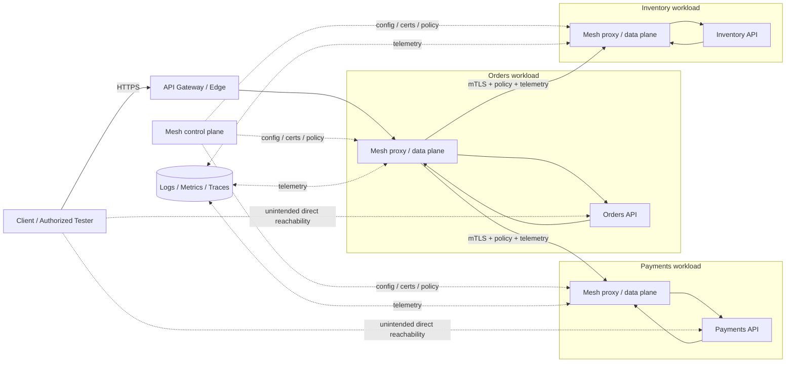
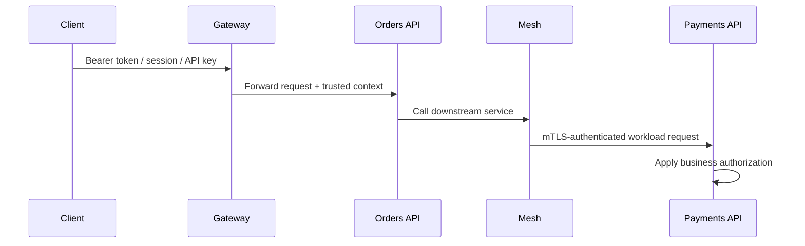

# Service Mesh Basics

> **Difficulty:** Beginner → Advanced | **Category:** API Pentesting / Architecture
>
> **Focus:** Understand how a service mesh changes API routing, workload identity, observability, and policy enforcement so authorized testers can validate real trust boundaries without mistaking transport security for application security.

> **Authorized testing only:** Service meshes often expose sensitive topology, certificate, and policy metadata. Use this note only for approved architecture reviews, internal API assessments, purple-team exercises, and lab validation. Prefer read-only evidence gathering first, stay inside the agreed vantage point, and do not test control-plane components unless they are explicitly in scope.

---

## Table of Contents

1. [Why Service Mesh Matters](#why-service-mesh-matters)
2. [Beginner Mental Model](#beginner-mental-model)
3. [Service Mesh vs API Gateway vs Service Discovery](#service-mesh-vs-api-gateway-vs-service-discovery)
4. [Core Building Blocks](#core-building-blocks)
5. [How Request Flow Changes in a Mesh](#how-request-flow-changes-in-a-mesh)
6. [The Identity Layer Most Beginners Miss](#the-identity-layer-most-beginners-miss)
7. [What to Extract From the API Spec](#what-to-extract-from-the-api-spec)
8. [Sidecar vs Ambient or Sidecarless Patterns](#sidecar-vs-ambient-or-sidecarless-patterns)
9. [Security Capabilities — and Their Limits](#security-capabilities--and-their-limits)
10. [Practical Authorized Testing Workflow](#practical-authorized-testing-workflow)
11. [Common Failure Patterns](#common-failure-patterns)
12. [Reporting Guidance](#reporting-guidance)
13. [Quick Checklist](#quick-checklist)
14. [References & Further Reading](#references--further-reading)

---

## Why Service Mesh Matters

In a microservices environment, many of the most important API security decisions no longer happen only at the public edge.

They also happen:

- between services
- between namespaces or environments
- at retry, timeout, and failover layers
- inside proxy policy
- inside telemetry and tracing pipelines

A **service mesh** is the infrastructure layer that manages much of this **east-west** communication.

For an authorized API tester, that matters because a mesh can:

- encrypt service-to-service traffic with **mTLS**
- assign and verify **workload identity**
- apply network and request policy
- generate **metrics, logs, and traces**
- route traffic for canary, failover, or A/B behavior

But it can also create false confidence if teams assume:

> “We have mTLS and mesh policy, so authorization is handled.”

That is not necessarily true.

### Why this is security-relevant

| Tester question | Why it matters |
|---|---|
| **Where is identity verified?** | The answer may be gateway-only, mesh-only, app-only, or some mix of all three |
| **Which paths are protected by the mesh?** | Partial adoption often leaves some workloads or namespaces outside the real policy boundary |
| **Does secure transport equal allowed business action?** | mTLS proves *which workload* talked to another workload, not whether a user should view or modify an object |
| **Can traffic bypass the intended enforcement point?** | Direct service exposure can skip edge logging, WAF rules, schema validation, or gateway auth |
| **What does telemetry reveal?** | Traces, headers, metrics labels, and admin interfaces can leak internal service names, tenant IDs, or routing details |

### How this connects to API risk

Service mesh issues often amplify or expose:

- **API2: Broken Authentication**
- **API5: Broken Function Level Authorization**
- **API8: Security Misconfiguration**
- **API9: Improper Inventory Management**
- **API10: Unsafe Consumption of APIs**

The mesh is therefore not “just networking.” It is part of the API trust model.

---

## Beginner Mental Model

The easiest way to think about a service mesh is:

> **API gateway for internal service-to-service traffic, plus identity, plus telemetry, plus traffic policy.**

That is not a perfect definition, but it is a useful starting point.

### Simple analogy

Imagine a city:

- the **API gateway** is the main border checkpoint for outside visitors
- **service discovery** is the street directory
- the **service mesh** is the network of smart internal checkpoints and traffic controllers between important buildings

Without a mesh, one service talks directly to another and must implement many communication concerns itself.

With a mesh, much of that logic moves into a proxy or platform layer.

### Beginner view vs advanced view

| Level | How people describe it | What they are missing |
|---|---|---|
| **Beginner** | “It adds sidecars and mTLS.” | Sidecars are one implementation pattern, not the whole security story |
| **Intermediate** | “It handles east-west traffic and policy.” | Policy can be L4-only, L7-only, workload-only, or incomplete |
| **Advanced** | “It is a distributed identity, routing, and observability layer that changes where trust is enforced.” | This is the level testers need |

### One sentence to remember

> **A service mesh secures and manages service-to-service communication, but it does not automatically secure business logic.**

---

## Service Mesh vs API Gateway vs Service Discovery

These concepts are related, but they are not the same thing.

| Component | Main scope | Typical traffic direction | Main job | Security meaning |
|---|---|---|---|---|
| **API gateway** | Public or partner edge | North-south | Entry routing, auth, rate limiting, normalization | Often the first enforcement point, but not always the last |
| **Service discovery** | Internal name/location resolution | Mostly east-west | Find the current healthy destination for a service | Exposed discovery data can leak internal inventory and create bypass paths |
| **Service mesh** | Internal service-to-service communication | East-west | Identity, mTLS, policy, telemetry, traffic control | Changes where trust, logging, and routing decisions happen |

### Common misunderstanding

A mature environment may use all three together:

```text
Client -> API Gateway -> Service A -> Service Mesh -> Service B
                                    -> Service Mesh -> Service C
```

If testers only review the gateway, they may miss the actual trust boundary between internal services.

---

## Core Building Blocks

Public service mesh documentation from projects like **Istio** and **Linkerd** consistently describes a mesh as having a **data plane** and a **control plane**.

### Main components

| Component | What it does | Why an API tester cares |
|---|---|---|
| **Data plane** | Proxies or node-level components that handle real traffic | This is where encryption, routing, retries, and telemetry often occur |
| **Control plane** | Distributes config, certificates, policy, and service information | Misconfigurations here can change behavior across many services at once |
| **Workload identity** | Gives services cryptographic identity, often via short-lived certificates | Strong workload identity helps, but does not replace user-level authorization |
| **Authorization policy** | Decides which workloads or requests are allowed | Scope, match conditions, and policy drift are major review areas |
| **Telemetry pipeline** | Exports metrics, access logs, and traces | Rich source of evidence, but also a source of leakage |
| **Ingress / egress integration** | Connects mesh traffic to outside systems | Good place to review trust transitions and outbound restrictions |

### Key terms

| Term | Meaning |
|---|---|
| **Workload** | A running service instance, pod, VM process, or task |
| **mTLS** | Mutual TLS; both sides of a connection authenticate with certificates |
| **East-west traffic** | Service-to-service traffic inside the environment |
| **North-south traffic** | Traffic entering or leaving the environment |
| **Policy** | Rules that allow, deny, or shape traffic |
| **Telemetry** | Metrics, logs, traces, and correlation data about requests |

### Why the data plane matters so much

When a mesh handles traffic, the proxy layer may decide:

- where the request goes
- whether the destination is considered healthy
- whether the caller has a valid workload identity
- whether retries happen
- what headers or metadata are forwarded
- what gets logged or traced

That is a large part of the practical API attack surface.

---

## How Request Flow Changes in a Mesh

### Diagram — External request, internal mesh path, and bypass risk



### Security meaning of the diagram

A mesh usually inserts an additional enforcement layer between services.

That can be very good for:

- workload authentication
- encrypted internal traffic
- traffic shaping
- centralized visibility

But the diagram also shows a crucial API-security lesson:

> **If a backend workload is reachable outside the intended mesh or gateway path, teams may accidentally rely on controls that are never applied on that path.**

### A practical flow to keep in mind

1. the **client** authenticates to the gateway
2. the **gateway** forwards a validated request
3. service **A** calls service **B**
4. the mesh authenticates **A as a workload**
5. service **B** still has to decide whether the **user or business action** is allowed

That last step is where many teams fail.

---

## The Identity Layer Most Beginners Miss

One request can carry more than one identity concept at the same time.

### Diagram — User identity, workload identity, and business authorization



### Three identities that can coexist

| Identity layer | Example | What it proves | What it does **not** prove |
|---|---|---|---|
| **End-user identity** | JWT subject, session, OAuth token | Which user or client app initiated the API request | That every downstream service correctly enforces the user's permissions |
| **Workload identity** | Service account, SPIFFE-like certificate identity, mTLS cert | Which workload is speaking to another workload | That the workload is acting on behalf of the right user or tenant |
| **Business authorization context** | order ownership, tenant binding, scope, role, approval state | Whether this action is allowed in the application | Whether the transport or proxy layer is secure |

### Most important rule in this note

> **Workload identity answers “who is the service?”**  
> **Application authorization answers “should this action happen?”**

A mesh is excellent at the first question.  
It does **not** automatically solve the second.

This is why a mesh can be perfectly healthy while the API still has:

- BOLA / IDOR
- broken function-level authorization
- tenant-mixing bugs
- unsafe header trust
- business workflow abuse

---

## What to Extract From the API Spec

Even though service mesh behavior is often implemented in platform configuration, your **API specification is still one of the best starting maps**.

### What the spec can reveal

| Spec area | What it may reveal | Why it matters for service mesh analysis |
|---|---|---|
| **`servers`** | public, internal, partner, staging, or region-specific base URLs | Helps identify where edge traffic enters before mesh routing begins |
| **`securitySchemes`** | bearer auth, OAuth, API keys, `mutualTLS` | Shows expected client-to-edge identity model and may hint at sender-constrained designs |
| **`tags`** | logical service boundaries such as `orders`, `payments`, `admin` | Useful for reconstructing likely service ownership behind the mesh |
| **`paths`** | route groups and admin/internal naming | Helps map which downstream services probably exist |
| **`webhooks` / callbacks** | asynchronous receivers or outbound integrations | Expands the trust map beyond simple request/response APIs |
| **Vendor extensions (`x-...`)** | internal upstream names, cluster hints, environment tags | Sometimes accidentally leak implementation details about gateways or mesh routing |

### Example OpenAPI clues

```yaml
openapi: 3.1.0
info:
  title: Orders API
  version: 1.4.0
servers:
  - url: https://api.example.com
    description: Public gateway
  - url: https://partner-api.example.com
    description: Partner edge
tags:
  - name: orders
  - name: payments
components:
  securitySchemes:
    bearerAuth:
      type: http
      scheme: bearer
      bearerFormat: JWT
    clientCert:
      type: mutualTLS
x-upstream-service: orders-api
```

From that small example alone, an authorized tester can infer:

- more than one edge entry point may exist
- at least two business domains likely exist behind the API
- mutual TLS may matter somewhere in the design
- vendor extensions may expose internal service naming

### Safe, spec-driven review examples

```bash
# List documented server URLs
jq -r '.servers[]?.url' openapi.json | sort -u

# Show declared security schemes
jq '.components.securitySchemes' openapi.json

# Find possible mesh or internal routing clues
rg -n 'mutualTLS|mtls|spiffe|x-internal|x-upstream|mesh|envoy|linkerd|istio' openapi.*
```

### Important limitation

The API spec usually describes the **contract** at the edge.

It may **not** fully describe:

- internal workload identities
- mesh authorization policy
- retry budgets and failover behavior
- telemetry collection details
- sidecar or ambient deployment scope

So the right mindset is:

> **Use the API spec to build the intended architecture, then compare it to approved runtime evidence.**

---

## Sidecar vs Ambient or Sidecarless Patterns

Many people use “service mesh” and “sidecar” as if they are synonyms. They are not.

Public Istio documentation now explicitly distinguishes traditional **sidecar mode** from **ambient mode**, where Layer 4 handling happens per node and Layer 7 features can be added separately.

### Comparison

| Pattern | How it works | Strengths | Trade-offs | Testing angle |
|---|---|---|---|---|
| **Sidecar mesh** | A proxy runs alongside each workload | Rich L7 visibility, per-workload isolation, mature ecosystem | More resource overhead, more moving parts per pod | Good place to inspect per-pod policy, headers, and telemetry behavior |
| **Ambient / node-proxy style** | A node-level L4 component handles traffic, with optional L7 waypoint-style processing | Lower overhead, easier onboarding, less per-pod management | L7 visibility may exist only on selected paths | Testers must know whether they are observing L4-only or L7-enforced behavior |
| **Other sidecarless designs** | Some platforms move features into node agents, kernel hooks, or combined networking layers | Operational simplicity in some environments | Visibility and policy semantics vary by implementation | Do not assume “no sidecar” means “no mesh” |

### Why this matters for API testing

If you misunderstand the deployment model, you may misread evidence:

- an L4-only path may show encryption but no per-route authorization
- one namespace may have waypoint/L7 policy while another only has transport controls
- telemetry depth may differ between workloads even inside the same mesh

That means:

> **Do not ask only “Is there a mesh?” Ask “Which mesh mode applies to this path, and what is enforced there?”**

---

## Security Capabilities — and Their Limits

A mesh is powerful, but every capability has a limit.

| Mesh capability | What it is good at | What it does **not** guarantee |
|---|---|---|
| **mTLS** | Encrypts traffic and authenticates workloads | Correct end-user authorization, safe business logic, or tenant isolation |
| **Service-to-service policy** | Restricts which workloads can call which workloads | That the called API verifies object ownership or user scope |
| **Traffic routing** | Canary, failover, load balancing, retries, circuit breaking | Safe state transitions or replay-safe business actions |
| **Telemetry** | Strong visibility into paths, latency, and errors | Safe redaction of tokens, headers, PII, or tenant identifiers |
| **Egress control** | Central outbound policy and allowlisting | Complete SSRF prevention if policy is too broad or inconsistent |
| **Centralized config** | Repeatable policy across many services | Correct policy logic or safe defaults |

### A zero-trust connection

NIST SP 800-207 emphasizes that **network location alone should not grant implicit trust**.

A service mesh helps move environments in that direction by using:

- verified workload identity
- policy before connection or request handling
- tighter service-to-service trust

But a mesh is only one part of zero trust.

If application logic still says:

- “internal caller = trusted”
- “header from upstream = verified”
- “mesh-authenticated service = allowed to do anything”

then the architecture is still weak.

### The easiest mistake to remember

> **Transport security protects the path. Authorization protects the action.**

You need both.

---

## Practical Authorized Testing Workflow

This workflow is intentionally **defensive, low-impact, and read-first**.

### 1. Confirm scope and vantage point

Before reviewing mesh behavior, confirm:

- whether internal namespaces or clusters are in scope
- whether control-plane resources are in scope
- whether you are allowed to test from the public edge only, or also from a pod, bastion, or VPN
- whether logs, traces, policy objects, and cert metadata may be inspected

### 2. Build the intended architecture from docs

Start with:

- the API spec
- gateway docs
- architecture diagrams
- Kubernetes manifests or service catalogs
- route and auth documentation

Your goal is to answer:

- what the public edge is supposed to be
- which services exist
- which identities are expected
- where traffic should and should not flow

### 3. Collect passive runtime clues

Without doing anything aggressive, review what the system already reveals.

| Passive clue | Example | Why it helps |
|---|---|---|
| **Response headers** | `server`, `via`, `x-envoy-upstream-service-time`, `traceparent`, `x-request-id` | Can reveal proxies, trace layers, or upstream routing behavior |
| **TLS cert metadata** | SANs or URI identities | May hint at internal naming or workload identity models |
| **Pod / namespace labels** | injection or dataplane mode labels | Helps identify mesh coverage |
| **Telemetry names** | service names in traces or dashboards | Useful for inventory and trust-boundary mapping |
| **Error details** | upstream cluster or route names | Can expose implementation details accidentally |

Read-only examples in an approved environment:

```bash
# Check edge response headers for proxy or tracing clues
curl -si https://api.example.com/health \
  | rg -i 'server|via|x-envoy|traceparent|x-request-id'

# Review certificate metadata from an authorized endpoint
openssl s_client -connect api.example.com:443 -servername api.example.com </dev/null 2>/dev/null \
  | openssl x509 -noout -text \
  | rg 'DNS:|URI:'
```

### 4. Identify mesh coverage

In an approved cluster context, determine whether all relevant workloads are actually in the mesh.

```bash
# Namespace labels often reveal injection or dataplane mode
kubectl get ns --show-labels

# Find pods that clearly include a common sidecar name
kubectl get pods -A -o json \
  | jq -r '.items[]
    | select([.spec.containers[].name] | any(. == "istio-proxy" or . == "linkerd-proxy"))
    | [.metadata.namespace, .metadata.name, ([.spec.containers[].name] | join(","))]
    | @tsv'
```

Why this matters:

- partial adoption creates blind spots
- one namespace may be mesh-enforced while another is not
- control assumptions often fail during migrations

### 5. Review policy at the correct layer

For authorized architecture review, ask:

- is policy only at Layer 4, or also Layer 7?
- are auth decisions tied to workload identity, user identity, or both?
- are there exceptions for admin, batch, or legacy services?
- do retries or failover paths change which policy applies?

Read-only examples:

```bash
# Review common Kubernetes-native policy objects
kubectl get networkpolicy -A

# If the environment uses Istio and review is approved
kubectl get peerauthentication,authorizationpolicy -A
```

### 6. Compare gateway expectations with backend reality

This is one of the most valuable review steps.

Look for differences between:

1. **what the API spec says**
2. **what the gateway enforces**
3. **what the mesh allows**
4. **what the backend service still accepts or trusts**

Typical mismatch areas:

- route is documented as protected, but backend trusts only internal location
- gateway strips or adds headers that backend assumes are always trustworthy
- mesh authenticates the workload, but backend never re-checks user context
- staging or legacy routes remain reachable with different policy

### 7. Review telemetry exposure

Telemetry is extremely useful, but it can leak:

- internal hostnames
- tenant IDs
- path templates
- raw authorization headers
- personal data in traces
- route names or upstream cluster names

Check whether dashboards, trace stores, and debug interfaces follow least privilege and redaction rules.

### 8. Focus on evidence, not theory

A strong finding usually shows a mismatch such as:

- the spec promises one trust model
- runtime behavior reveals another
- the organization assumed the mesh solved a problem the application still has

---

## Common Failure Patterns

### 1. “Internal means trusted”

**Pattern:** Downstream APIs trust calls from inside the cluster or mesh too broadly.

**Why it happens:** Teams believe workload identity alone is enough.

**Risk:** Securely authenticated internal traffic still performs unauthorized actions.

### 2. Mesh adoption is incomplete

**Pattern:** Some services are in the mesh, some are not, or some namespaces still allow permissive/plaintext operation.

**Risk:** Security posture becomes inconsistent and hard to reason about.

### 3. Gateway-only authorization

**Pattern:** The gateway checks the token, but downstream services assume that means every forwarded action is valid.

**Risk:** Function-level or object-level authorization gaps survive behind a “secure” edge.

### 4. Header trust confusion

**Pattern:** Services trust headers such as:

- `X-User-Id`
- `X-Tenant-Id`
- `X-Role`
- `X-Forwarded-Client-Cert`
- custom “already-authenticated” headers

**Risk:** If the wrong hop can influence those headers, identity becomes muddled or spoofable.

### 5. Over-broad mesh policy

**Pattern:** Policy is written at namespace or service-group level and ends up allowing too many callers.

**Risk:** Lateral movement and unintended service access become easier than expected.

### 6. Telemetry leaks topology or secrets

**Pattern:** Traces or logs expose route names, internal hostnames, tokens, or sensitive payload fragments.

**Risk:** Defensive tooling becomes an information-disclosure surface.

### 7. Retry and failover logic changes security behavior

**Pattern:** Retries, circuit breakers, or alternate destinations shift a request onto a path with different policy or validation.

**Risk:** The system behaves securely on the “happy path” but not on degraded paths.

### 8. Secure transport is mistaken for safe business logic

**Pattern:** Teams highlight mTLS and mesh auth as proof that the API is secure.

**Risk:** The app still has BOLA, broken function auth, tenant confusion, or workflow abuse.

### Failure patterns mapped to API risk

| Failure pattern | Closely related API risk |
|---|---|
| Internal trust without re-checking | API2 / API5 |
| Partial adoption and permissive modes | API8 |
| Hidden direct-backend paths | API8 / API9 |
| Mesh-authenticated service overreach | API5 / API10 |
| Telemetry or config leakage | API8 / API9 |

---

## Reporting Guidance

A strong service-mesh finding should explain four things clearly.

### 1. What was expected

Examples:

- all service-to-service traffic should require workload identity
- only the gateway should be reachable from outside the trust boundary
- backend services should re-check authorization on sensitive actions
- telemetry should redact sensitive fields

### 2. What was observed

Examples:

- a workload was outside the mesh
- policy existed only at Layer 4
- a backend accepted overly trusted forwarded context
- traces exposed internal route names and raw headers

### 3. Why it matters

Examples:

- secure transport exists, but authorization remains weak
- direct paths may bypass edge controls
- partial mesh coverage creates inconsistent security assumptions
- observability systems leak architectural intelligence

### 4. What should change

Good remediation themes:

- extend mesh coverage consistently or document intentional exceptions
- enforce workload identity and user authorization at the proper layers
- remove direct reachability where the gateway is the intended boundary
- narrow mesh authorization rules
- minimize and redact telemetry
- keep the API spec, gateway config, and runtime policy aligned

### Evidence that makes reports stronger

| Evidence type | Example |
|---|---|
| **Spec evidence** | `servers`, `securitySchemes`, tags, internal extensions |
| **Runtime evidence** | response headers, cert metadata, route behavior, policy objects |
| **Architecture evidence** | diagrams, namespace labels, service ownership mapping |
| **Risk evidence** | mismatch between expected enforcement and actual enforcement |

---

## Quick Checklist

- [ ] Confirm whether mesh components and namespaces are in scope
- [ ] Read the API spec first and extract `servers`, tags, and security schemes
- [ ] Identify the intended gateway boundary
- [ ] Determine whether traffic controls are L4-only, L7, or mixed
- [ ] Map mesh coverage across namespaces and workloads
- [ ] Distinguish end-user identity from workload identity
- [ ] Review whether backend services re-check business authorization
- [ ] Look for direct backend reachability outside intended trust boundaries
- [ ] Review mesh and telemetry metadata for information leakage
- [ ] Check for policy drift during retries, failover, or legacy-path handling
- [ ] Report mismatches between documentation, gateway behavior, mesh policy, and application logic

---

## References & Further Reading

- **Istio — What is Istio?**  
  High-level description of service mesh capabilities including security, observability, and traffic management.  
  https://istio.io/latest/docs/concepts/what-is-istio/

- **Istio — Sidecar or ambient?**  
  Clear explanation of data plane vs control plane and sidecar vs ambient modes.  
  https://istio.io/latest/docs/overview/dataplane-modes/

- **Linkerd — What is a service mesh?**  
  Strong explanation of the data plane, control plane, and why service mesh exists in cloud-native systems.  
  https://linkerd.io/what-is-a-service-mesh/

- **NIST SP 800-207 — Zero Trust Architecture**  
  Useful mental model for understanding why network location should not create implicit trust.  
  https://csrc.nist.gov/pubs/sp/800/207/final

- **OWASP API Security Project**  
  Good overview of API-specific risks that service mesh can influence but not automatically solve.  
  https://owasp.org/www-project-api-security/

- **OWASP API8:2023 — Security Misconfiguration**  
  Relevant when mesh rollout, policy, headers, TLS posture, or telemetry are misconfigured.  
  https://owasp.org/API-Security/editions/2023/en/0xa8-security-misconfiguration/

- **OpenAPI Specification 3.1**  
  Useful for extracting `servers`, `securitySchemes`, tags, callbacks, and other architecture clues from the API contract.  
  https://spec.openapis.org/oas/v3.1.0.html
