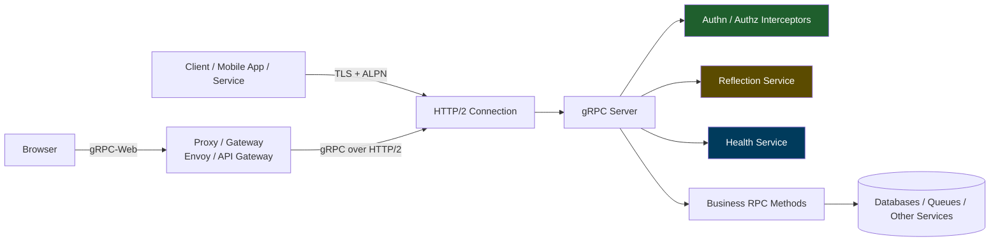
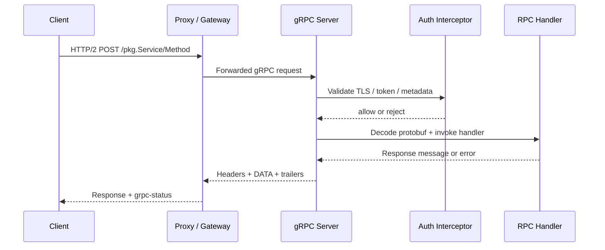

# gRPC Protocol Security

> **Module:** API Pentesting → API Protocols  
> **Difficulty:** Beginner → Advanced  
> **Tags:** `#grpc` `#protobuf` `#http2` `#grpcurl` `#reflection` `#mtls` `#grpc-web`

---

## 🧠 What Is gRPC?

gRPC is a **remote procedure call (RPC) framework** that lets one system call functions on another system as if they were local methods.

Instead of exposing mostly human-readable HTTP endpoints like:

```http
GET /api/v1/users/123
```

gRPC usually exposes method-style paths such as:

```text
/company.user.v1.UserService/GetProfile
```

and sends data as **Protocol Buffers (Protobuf)**, which is a compact binary format.

### Beginner mental model

Think of REST as filling out web forms and gRPC as calling strongly typed functions across the network:

- **REST:** “Send JSON to this URL”
- **gRPC:** “Call this exact method with this exact message type”

That makes gRPC:

- fast
- compact
- strongly typed
- common in microservices and internal APIs
- less transparent to testers unless they have the right tooling

For an authorized API assessment, gRPC matters because teams often assume “binary + HTTP/2 + internal use” means “safe by default.” It does not.

---

## 🎯 Why Security Testers Care

gRPC changes the testing surface, but not the core security principles.

The same problems still exist:

- broken authentication
- broken authorization
- excessive data exposure
- unsafe defaults
- weak transport trust boundaries
- resource exhaustion issues

What changes is **where** those problems appear:

| In REST | In gRPC |
|---|---|
| Endpoints like `/users/123` | Methods like `/pkg.Service/GetUser` |
| JSON bodies | Protobuf messages |
| Swagger / OpenAPI | `.proto`, reflection, protosets |
| HTTP status drives logic | `grpc-status` trailers often matter more |
| Browser can speak it directly | Browsers often need **gRPC-Web** proxies |

So the tester's job is not “learn a totally different security model.” It is:

1. understand the transport and schema,
2. map the actual trust boundaries,
3. validate authn/authz and input handling per RPC,
4. verify the gateway, proxy, and backend all enforce the same rules.

---

## 🏗️ Core Architecture and Request Flow



### Key idea

The protocol stack usually looks like this:

```text
Application method call
        ↓
Protocol Buffers message
        ↓
gRPC framing
        ↓
HTTP/2
        ↓
TLS (usually) / TCP
```

For browser clients, native gRPC is often replaced with **gRPC-Web**, which introduces an extra proxy or gateway. That proxy becomes part of the security boundary and must be tested too.

---

## 🧩 The Four RPC Types

Official gRPC core concepts define four RPC styles. Each has different operational and security implications.

| RPC Type | Behavior | Typical Use | Security Testing Focus |
|---|---|---|---|
| **Unary** | One request, one response | Profile lookup, create/update actions | Per-method authn/authz, input validation, data exposure |
| **Server streaming** | One request, many responses | Event feeds, logs, notifications | Long-lived authorization, output filtering, message volume controls |
| **Client streaming** | Many requests, one response | Uploads, telemetry ingestion | Message count limits, size limits, parser stability |
| **Bidirectional streaming** | Many requests, many responses | Chat, sync, live control planes | Session trust, replay/cancellation handling, stream lifetime controls |

### Example `.proto`

```proto
syntax = "proto3";
package company.user.v1;

service UserService {
  rpc GetProfile (GetProfileRequest) returns (Profile);
  rpc StreamAuditEvents (AuditRequest) returns (stream AuditEvent);
}

message GetProfileRequest {
  string user_id = 1;
}

message Profile {
  string user_id = 1;
  string email = 2;
  string role = 3;
}
```

That unary method is typically exposed over HTTP/2 as:

```text
/company.user.v1.UserService/GetProfile
```

---

## 🔬 How gRPC Works on the Wire

### HTTP/2 request structure

According to the gRPC over HTTP/2 protocol documentation, a normal gRPC call uses:

- `:method POST`
- `:path /Service/Method`
- `content-type: application/grpc`
- `te: trailers`
- optional headers like `grpc-timeout`, `grpc-encoding`, metadata, and auth headers

### Important headers and trailers

| Field | Example | Why It Matters |
|---|---|---|
| `:method` | `POST` | Standard gRPC calls use POST |
| `:path` | `/company.user.v1.UserService/GetProfile` | Identifies the exact RPC method |
| `content-type` | `application/grpc+proto` | Signals gRPC semantics |
| `te` | `trailers` | Helps detect incompatible proxies |
| `grpc-timeout` | `5S` | Client deadline; useful for resilience and abuse resistance |
| `authorization` | `Bearer <token>` | Common auth transport |
| custom metadata | `x-tenant-id: blue` | Often used for authz context or routing |
| `grpc-status` | `0`, `7`, `16` | Real RPC result code |
| `grpc-message` | error text | Often leaks implementation detail if not sanitized |

### The message envelope

Each gRPC message is wrapped in a small binary envelope:

```text
Byte 0      : Compressed-Flag (0 or 1)
Bytes 1 - 4 : Message-Length (big-endian)
Bytes 5+    : Protobuf message bytes
```

This matters because:

- HTTP/2 frame boundaries do **not** equal gRPC message boundaries
- logging or proxy tooling may show transport frames but not decoded messages
- message size, compression, and stream behavior become security-relevant controls

### Very important testing nuance

In gRPC, an HTTP status of `200` does **not** always mean the business action succeeded.

Many application errors are carried in **trailers**, especially:

| `grpc-status` | Meaning |
|---|---|
| `0` | OK |
| `4` | DEADLINE_EXCEEDED |
| `7` | PERMISSION_DENIED |
| `8` | RESOURCE_EXHAUSTED |
| `12` | UNIMPLEMENTED |
| `16` | UNAUTHENTICATED |

If your tooling only watches HTTP status codes, you can miss real failures, authz rejections, or noisy error patterns.

---

## 📊 Diagram — Unary Call Lifecycle



---

## 📚 Discovery: How You Learn What Exists

Unlike REST, you may not get a friendly OpenAPI page. In authorized testing, the main discovery sources are:

| Source | What It Gives You | Security Relevance |
|---|---|---|
| **Server reflection** | Lists services, methods, and message schemas | Great for testing, but often too revealing if exposed broadly |
| **`.proto` files** | Full schema and service contracts | Best source for precise method testing |
| **Protoset / descriptor sets** | Compiled schema bundle | Useful when source `.proto` is not available |
| **gRPC-Web stubs** | Browser-accessible client methods | Reveals externally reachable methods and headers |
| **Health service** | Service names and health state | Helps map architecture; can leak internal naming |
| **Gateway / Envoy config** | Routing and auth boundaries | Critical for finding proxy/backend mismatches |
| **Telemetry / traces** | Real method names and status codes | Useful for validating inventory and exposure |

### Reflection

Reflection is a standardized gRPC service that lets clients discover exported APIs and referenced types. Official gRPC docs compare it to the role OpenAPI plays in the REST world.

Reflection is extremely helpful during authorized testing, but it is also a real exposure point:

- it tells you what services exist
- it reveals message types
- it reduces the “security through obscurity” effect some teams rely on

That does **not** make reflection automatically insecure. It means access decisions around reflection should be deliberate.

### Health checking

gRPC also standardizes a `grpc.health.v1.Health` service. This is useful operationally, but it can leak:

- service names
- deployment state
- internal dependencies
- differences between public and internal routing

### gRPC-Web

Browsers usually do not speak native gRPC directly. They often use **gRPC-Web**, which adds a proxy layer. Official gRPC-Web documentation notes:

- unary RPCs are supported
- server-streaming is supported in `grpcwebtext` mode
- client-streaming and bidirectional streaming are not generally supported in browsers

For testing, that means:

- the browser-visible surface may differ from the backend surface
- auth or CORS-like gateway rules may apply at the proxy, not only the app
- proxy translation issues can create inconsistent enforcement

---

## 🛠️ Practical Authorized Testing Workflow

This is the safe, professional workflow for an approved engagement.

### Phase 1: Confirm scope and trust boundaries

Before sending traffic, confirm:

- which hosts and ports are in scope
- whether you are testing native gRPC, gRPC-Web, or both
- whether reflection and health services are approved to query
- whether mTLS client certificates are required
- which test accounts and roles are available

### Phase 2: Obtain the schema

Best to worst:

1. approved `.proto` files
2. approved protoset / descriptor set
3. server reflection
4. reverse-engineered client stubs from approved app artifacts

### Phase 3: Build a method inventory

For every service, capture:

- service name
- method name
- RPC type
- request fields
- response fields
- auth requirement
- role requirement
- expected error behavior

### Phase 4: Validate authentication and authorization

For each in-scope RPC, test:

| Check | Safe Validation Idea |
|---|---|
| Unauthenticated access | Send one request without auth and confirm `UNAUTHENTICATED` |
| Wrong-role access | Use an approved lower-privilege account and confirm `PERMISSION_DENIED` |
| Object-level authorization | Use your own two test identities and verify cross-user access is blocked |
| Metadata trust | Check whether user/tenant context is derived from signed identity, not caller-controlled headers |

### Phase 5: Validate resilience and exposure controls

Check carefully, with agreed rate limits:

- max message size behavior
- max stream duration
- request deadlines and cancellation handling
- reflection exposure
- health service exposure
- verbose error leakage in `grpc-message` or debug metadata
- gateway/backend consistency

### Phase 6: Report clearly

Good gRPC findings should identify:

- exact full method name
- transport path
- auth context used
- whether issue exists at gateway, backend, or both
- evidence from `grpc-status`, trailers, or decoded responses

---

## ⚙️ Safe Tools and Commands

These are appropriate for defensive, authorized assessment work.

| Tool | Purpose | Example |
|---|---|---|
| `grpcurl` | Invoke and inspect gRPC services | `grpcurl api.example.com:443 list` |
| `grpcui` | Browser UI for exploring schemas | `grpcui -plaintext localhost:50051` |
| `protoc` | Compile `.proto` and build protosets | `protoc --descriptor_set_out=api.protoset --include_imports api.proto` |
| Postman | Interactive gRPC requests | Useful for approved manual validation |
| Envoy / gateway configs | Understand routing and auth | Review route, TLS, and reflection policy |

### Safe command examples

```bash
# 1. List services when reflection is approved and enabled
grpcurl api.example.com:443 list

# 2. Describe a specific service
grpcurl api.example.com:443 describe company.user.v1.UserService

# 3. Read-only health check
grpcurl -d '{"service":""}' \
  api.example.com:443 \
  grpc.health.v1.Health/Check

# 4. Call an approved read-only method with an approved test token
grpcurl \
  -H 'authorization: Bearer <approved-test-token>' \
  -d '{"user_id":"test-user-01"}' \
  api.example.com:443 \
  company.user.v1.UserService/GetProfile
```

### When mTLS is required

```bash
grpcurl \
  -cacert ca.pem \
  -cert client.pem \
  -key client.key \
  api.example.com:443 list
```

### When reflection is disabled but you have approved schema files

```bash
grpcurl \
  -import-path ./protos \
  -proto user_service.proto \
  -d '{"user_id":"test-user-01"}' \
  api.example.com:443 \
  company.user.v1.UserService/GetProfile
```

> **Note:** Keep testing controlled. For streaming, resource limits, or large-message validation, coordinate with the client and stay within agreed throughput and duration limits.

---

## 🔴 gRPC Attack Surface for Defenders

This section is about what to look for and validate during an authorized review, not how to abuse systems unlawfully.

| Area | What Can Go Wrong | Defensive Validation Focus |
|---|---|---|
| **Reflection exposure** | Public users can enumerate service inventory and schemas | Restrict reflection by environment, network, or identity |
| **Health service exposure** | Service names and status leak internal topology | Expose only what operations needs |
| **Authn mismatch** | Gateway checks auth but backend trusts internal network too much | Verify direct backend access is blocked or equally protected |
| **Authz gaps per RPC** | User can call methods or access objects outside role/ownership | Test every sensitive method with multiple approved roles |
| **Metadata trust** | Server trusts caller-supplied tenant/user headers | Ensure identity comes from verified token/cert, not arbitrary metadata |
| **Plaintext/internal transport** | Internal h2c or unencrypted service mesh segments weaken trust boundary | Validate encryption and peer authentication assumptions |
| **gRPC-Web proxy mismatch** | Proxy blocks some methods, backend still reachable elsewhere | Compare browser path, proxy path, and native gRPC path |
| **Verbose errors** | `grpc-message`, debug headers, or reflection leak internals | Review production error hygiene |
| **Resource exhaustion** | Large messages, endless streams, expensive fan-out RPCs | Check limits, quotas, deadlines, cancellation |
| **Schema evolution mistakes** | New fields bypass validation or change auth logic | Review proto change control and backward-compatibility assumptions |

### Common high-value findings

- admin or internal RPC methods reachable from user networks
- auth enforced at the gateway but not on direct service listeners
- reflection enabled externally without clear need
- weak mTLS validation between services
- `PERMISSION_DENIED` never returned because object-level auth is missing
- oversized or long-lived streams leading to instability
- sensitive internal details returned in trailer messages

---

## 🧪 Method-by-Method Test Ideas

Use these as a defensive checklist during an engagement.

| Test Theme | Questions to Answer |
|---|---|
| **Inventory** | Do we know every exposed service and method, including reflection and health? |
| **Transport** | Is TLS mandatory? Is mTLS required internally? Are weak trust shortcuts used? |
| **Authn** | What happens with no token, wrong token, expired token, wrong client cert? |
| **Authz** | Can role A call role B methods? Can one test user access another test user's object? |
| **Input validation** | Are enums, `oneof`, repeated fields, and nested messages validated correctly? |
| **Error handling** | Do `grpc-status` and `grpc-message` reveal stack traces, SQL errors, internal hostnames, or package names? |
| **Resource controls** | Are there message size, depth, rate, deadline, and stream lifetime limits? |
| **Proxy consistency** | Does gRPC-Web, gateway-transcoded REST, and native gRPC enforce the same policy? |

### Special note on Protobuf semantics

Protobuf is strongly typed, but that does **not** guarantee safe business logic.

Security reviewers should pay attention to:

- optional vs absent fields
- default values such as `0`, `false`, or empty string
- `oneof` behavior
- repeated fields with unexpected length
- maps with unexpected keys
- nested object depth and parser cost

In other words: wire safety is not business safety.

---

## 📈 Detection and Logging

gRPC observability should capture more than “HTTP 200 happened.”

### Log these fields where possible

| Field | Why |
|---|---|
| full method name | Identify exact RPC being called |
| authenticated principal | Tie action to user/service identity |
| peer certificate or SPIFFE/SAN data | Important for service-to-service trust |
| source IP / proxy chain | Useful at public edges |
| request deadline | Detect abusive or brittle client behavior |
| request and response sizes | Spot oversized payloads |
| stream duration / message count | Important for streaming abuse and stability |
| `grpc-status` | True RPC outcome |
| reflection / health access | High-value reconnaissance signal |

### Detection ideas

- alert on external access to reflection or health services
- alert on repeated `UNAUTHENTICATED` or `PERMISSION_DENIED` across many methods
- watch for unusual spikes in `RESOURCE_EXHAUSTED` or `DEADLINE_EXCEEDED`
- flag long-lived streams that exceed normal session behavior
- compare gateway logs to backend logs to catch bypass paths

### Example structured log

```json
{
  "ts": "2026-03-12T10:15:00Z",
  "service": "company.user.v1.UserService",
  "method": "GetProfile",
  "principal": "qa-user-01",
  "peer_subject": "spiffe://prod/ns/api/sa/gateway",
  "grpc_status": 7,
  "deadline_ms": 5000,
  "request_bytes": 42,
  "response_bytes": 0,
  "reflection": false
}
```

---

## 🛡️ Mitigation and Defense

### Secure design principles

1. **Require TLS everywhere gRPC crosses trust boundaries**
2. **Use mTLS for service-to-service identity where appropriate**
3. **Perform authorization on every sensitive RPC and object**
4. **Do not trust caller-supplied metadata for identity**
5. **Restrict reflection and health services**
6. **Set sane message size, rate, and stream lifetime limits**
7. **Sanitize trailer errors and debug metadata**
8. **Keep proxy and backend policy aligned**

### Secure interceptor pattern

```go
func authzUnaryInterceptor(
    ctx context.Context,
    req any,
    info *grpc.UnaryServerInfo,
    handler grpc.UnaryHandler,
) (any, error) {
    principal, err := identityFromVerifiedContext(ctx)
    if err != nil {
        return nil, status.Error(codes.Unauthenticated, "authentication required")
    }

    if !isAllowed(principal, info.FullMethod, req) {
        return nil, status.Error(codes.PermissionDenied, "not allowed")
    }

    return handler(ctx, req)
}
```

### Operational checklist

- [ ] Reflection disabled externally unless explicitly needed
- [ ] Health service restricted and minimally revealing
- [ ] Direct backend listeners not reachable from untrusted networks
- [ ] TLS/mTLS configuration reviewed and certificate validation enforced
- [ ] Every privileged RPC tested with low-privilege accounts
- [ ] Message size, timeout, concurrency, and rate limits configured
- [ ] `grpc-status` and trailers logged and monitored
- [ ] gRPC-Web or gateway policy matches backend policy
- [ ] `.proto` changes go through security-sensitive review

---

## 🧠 Key Takeaways

- gRPC is not “just binary REST”; it has its own transport and visibility model
- reflection, health checking, and gRPC-Web proxies are major parts of the real attack surface
- HTTP `200` is often not the real success signal; `grpc-status` matters
- the most important findings are still authn, authz, exposure, and trust-boundary failures
- in authorized testing, schema discovery plus method-by-method validation is the winning workflow

---

## 📚 References

- [gRPC — Core Concepts](https://github.com/grpc/grpc.io/blob/master/content/en/docs/what-is-grpc/core-concepts.md)
- [gRPC — Protocol over HTTP/2](https://github.com/grpc/grpc/blob/master/doc/PROTOCOL-HTTP2.md)
- [gRPC — Reflection Guide](https://github.com/grpc/grpc.io/blob/master/content/en/docs/guides/reflection.md)
- [gRPC — Authentication Guide](https://github.com/grpc/grpc.io/blob/master/content/en/docs/guides/auth.md)
- [gRPC — Health Checking Guide](https://github.com/grpc/grpc.io/blob/master/content/en/docs/guides/health-checking.md)
- [Protocol Buffers Overview](https://protobuf.dev/overview/)
- [grpcurl README](https://github.com/fullstorydev/grpcurl)
- [gRPC-Web README](https://github.com/grpc/grpc-web)
