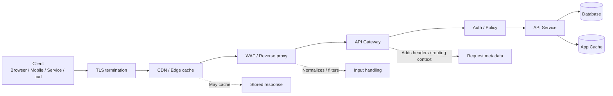
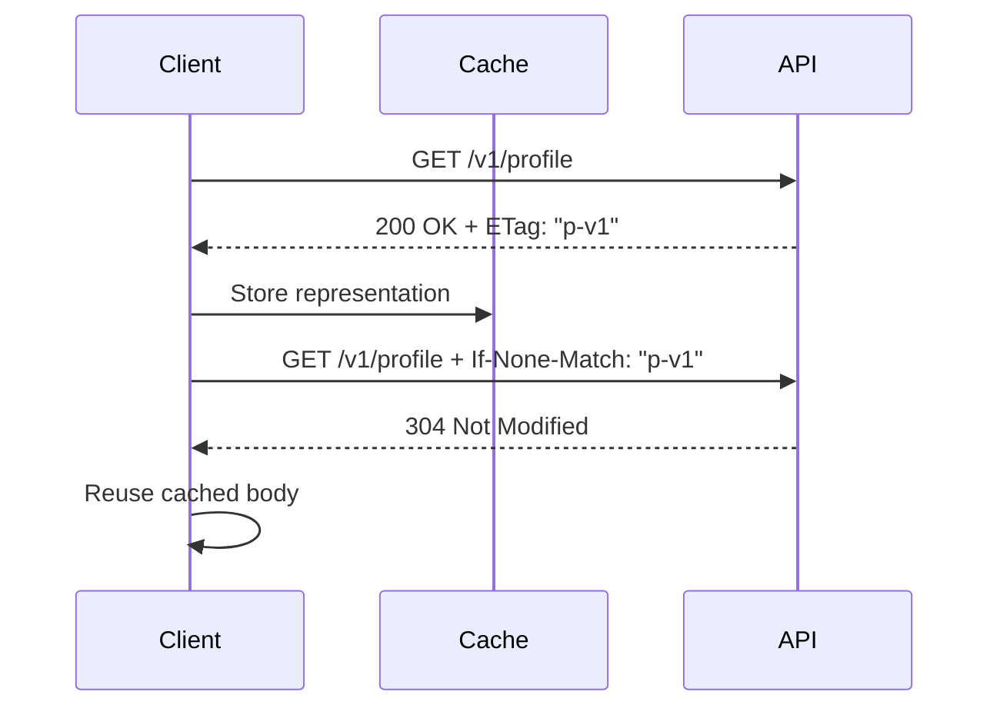

# HTTP In API

> **HTTP is the transport language most APIs speak. If you cannot read raw HTTP confidently, you cannot reliably test modern APIs.**

---

## ⚠️ Authorized Testing Only

Everything in this note is framed for **defensive security work, lab environments, and authorized API assessments**. The goal is to understand how HTTP behaves in API stacks so you can verify controls, spot weak design decisions, and report risk safely — not to abuse systems you do not own or have explicit permission to test.

---

## 🧠 What Is It? (Beginner Explanation)

HTTP (**Hypertext Transfer Protocol**) is the set of rules a client and a server use to talk to each other.

In API work, the “client” is usually:
- a browser
- a mobile app
- another backend service
- a CLI tool like `curl`
- a security testing proxy like Burp Suite

The “server” is the API.

When a client wants something, it sends an **HTTP request**:
- **where** it wants to send it (`/v1/users/42`)
- **what action** it wants (`GET`, `POST`, `PATCH`, etc.)
- **extra context** in headers (`Authorization`, `Content-Type`, `Accept`)
- **data** in the body if needed

The server sends back an **HTTP response**:
- a **status code** (`200`, `401`, `404`, `500`)
- **headers** explaining metadata
- often a **body** containing JSON or another representation

A simple way to remember it:

| Question | HTTP element |
|---|---|
| Where am I sending this? | URL / path / host |
| What do I want to do? | HTTP method |
| What data am I sending? | Headers + body |
| Who am I? | Auth headers, cookies, mTLS |
| What happened? | Status code + response body |

If you understand those five questions, you understand the foundation of HTTP in APIs.

---

## Why HTTP Matters So Much in API Security

Many API vulnerabilities are not “magic API bugs.” They are **HTTP misunderstandings** showing up in an API context.

Examples:
- A `GET` response containing personal data is cached incorrectly.
- A proxy trusts `X-Forwarded-For` when it should not.
- `Content-Type` parsing differs between gateway and backend.
- `PUT`, `PATCH`, and `DELETE` are authorized differently from `GET`.
- `401`, `403`, and `404` are used inconsistently, leaking behavior or confusing clients.
- A reverse proxy and backend disagree about where one request ends and the next begins.

So when you test an API, you are not just testing endpoints. You are testing:
- **HTTP semantics**
- **message parsing**
- **intermediaries**
- **caching**
- **routing**
- **authentication and authorization over HTTP**

---

## 📊 HTTP at a Glance for API Testers

| Concept | Meaning | Why it matters in APIs |
|---|---|---|
| **Resource** | The thing identified by a URL | `/v1/orders/9001` may represent one order |
| **Representation** | The format returned for a resource | Usually JSON, sometimes XML, text, protobuf, etc. |
| **Method** | The requested action | `GET`, `POST`, `PATCH`, `DELETE` shape semantics and security expectations |
| **Headers** | Metadata about the message | Carry auth, caching, negotiation, tracing, routing hints |
| **Status code** | Server result | Tells you whether auth, validation, rate limiting, or server logic triggered |
| **Statelessness** | Each request stands alone | APIs usually must carry auth and context on every request |
| **Intermediary** | Something between client and API | CDN, WAF, reverse proxy, API gateway, load balancer |
| **Cache** | A stored response reused later | Powerful for performance, dangerous for private API data |
| **Negotiation** | Choosing a response format | Controlled with `Accept`, `Content-Type`, `Vary`, and related headers |
| **Conditional request** | Request using validators like `ETag` | Important for caching, concurrency, and stale-data handling |

---

## 📊 Diagram — How an API HTTP Request Usually Travels



### What a tester should learn from this diagram

A “single API request” often passes through **multiple HTTP-speaking components** before it reaches the application. That means:
- the client may see one behavior while the backend sees another
- one layer may enforce auth or rate limits while another does not
- one layer may parse headers or bodies differently from the next
- cache behavior may be controlled at the edge, not only in the app

That is why good API testing always thinks in terms of **the entire request path**, not just the final application code.

---

## 🧩 Anatomy of an HTTP API Exchange

### Example Request

```http
POST /v1/orders HTTP/1.1
Host: api.lab.local
Authorization: Bearer eyJhbGciOi...
Content-Type: application/json
Accept: application/json
Idempotency-Key: 2c7f2a1b-2be6-47d6-8b57-0f3fbbf7f4d1
X-Request-ID: 6f2f5d32-f9e3-42ba-bcb3-6390ad299501

{
  "sku": "HN-100",
  "quantity": 1
}
```

### Example Response

```http
HTTP/1.1 201 Created
Content-Type: application/json
Location: /v1/orders/9001
Cache-Control: no-store
ETag: "order-9001-v1"
X-Request-ID: 6f2f5d32-f9e3-42ba-bcb3-6390ad299501

{
  "id": 9001,
  "status": "created",
  "sku": "HN-100",
  "quantity": 1
}
```

### What each part means

| Part | Example | Why it matters |
|---|---|---|
| **Method** | `POST` | Signals creation/action semantics |
| **Path** | `/v1/orders` | Identifies API resource or action |
| **HTTP version** | `HTTP/1.1` | Affects transport behavior and tooling expectations |
| **Host** | `api.lab.local` | Important for routing and virtual hosting |
| **Authorization** | `Bearer ...` | Carries identity/session context |
| **Content-Type** | `application/json` | Tells server how to parse the body |
| **Accept** | `application/json` | Tells server what response formats are acceptable |
| **Idempotency-Key** | UUID | Helps avoid duplicate processing for retried unsafe actions |
| **Location** | `/v1/orders/9001` | Often tells client where the created resource lives |
| **Cache-Control** | `no-store` | Prevents sensitive response storage |
| **ETag** | `"order-9001-v1"` | Supports validation and optimistic concurrency |
| **X-Request-ID** | UUID | Useful for tracing through logs and gateways |

---

## 🔤 HTTP Methods and What They Mean in APIs

Per MDN and RFC 9110 semantics, methods have important behavioral expectations. For API testers, two terms matter a lot:

- **Safe**: should not change server state as part of normal use
- **Idempotent**: repeating the same request should have the same intended effect as sending it once

### Method Reference Table

| Method | Safe? | Idempotent? | Typical API use | Security testing focus |
|---|---|---|---|---|
| `GET` | Yes | Yes | Read data | Should not cause writes or hidden side effects; check caching |
| `HEAD` | Yes | Yes | Fetch headers only | Good for inspecting metadata and cache behavior |
| `OPTIONS` | Yes | Yes | Capability discovery / CORS preflight | Review allowed methods and cross-origin behavior |
| `POST` | No | No | Create resource / trigger action | Check replay handling, validation, auth, rate limits |
| `PUT` | No | Yes | Replace a resource | Verify repeated sends do not create duplicates |
| `PATCH` | No | No | Partial update | Check field-level authorization and parser consistency |
| `DELETE` | No | Yes | Delete resource | Confirm repeat behavior is controlled and auditable |
| `TRACE` | Yes | Yes | Diagnostic echo | Usually unnecessary in APIs; often disabled |
| `CONNECT` | No | No | Establish tunnel | Rare in API applications |

### Practical interpretation for API testers

#### `GET`
`GET` should be a retrieval method. If an API uses `GET` for actions like password reset, invoice generation, or state changes, that is a design smell because:
- caches may replay or store it incorrectly
- link previewers and crawlers may trigger it accidentally
- defenders may miss that a “read” endpoint actually changes state

#### `POST`
`POST` is flexible and very common in APIs, but that flexibility can hide design problems. In assessments, verify:
- repeated submissions do not create duplicate high-value actions unless intended
- idempotency handling exists where business impact is high (payments, orders, provisioning)
- validation and authorization occur before backend processing

#### `PUT` and `PATCH`
These often reveal differences between **whole-object authorization** and **field-level authorization**. The core question is not just “Can I update this object?” but also “Can I update every property I sent?”

#### `DELETE`
`DELETE` should be authorized carefully and logged clearly. The second identical request may return `404`, `204`, or another controlled result, but it should not behave unpredictably.

---

## 📦 Status Codes That Matter in API Assessments

HTTP status codes are one of the best clues in API testing. They tell you which control layer is making the decision.

| Code | Meaning | API testing interpretation |
|---|---|---|
| `200 OK` | Request succeeded | Baseline success response |
| `201 Created` | New resource created | Check `Location` and returned representation |
| `202 Accepted` | Accepted for async processing | Confirm job tracking and eventual status handling |
| `204 No Content` | Success with no body | Common for delete/update results |
| `301/302/307/308` | Redirect | Important for protocol enforcement and method preservation |
| `304 Not Modified` | Cached representation still valid | Check validators and auth-aware caching behavior |
| `400 Bad Request` | Malformed request | Parsing/validation rejected early |
| `401 Unauthorized` | Authentication required/failed | Should usually include `WWW-Authenticate` |
| `403 Forbidden` | Authenticated but not allowed | Authorization barrier worked |
| `404 Not Found` | Resource absent or intentionally hidden | Some APIs use it to avoid disclosing existence |
| `405 Method Not Allowed` | Method unsupported | Review `Allow` header if present |
| `406 Not Acceptable` | Response format cannot satisfy `Accept` | Useful when checking negotiation behavior |
| `409 Conflict` | Request conflicts with current state | Common in versioning or duplicate operations |
| `412 Precondition Failed` | Conditional request failed | Important for `If-Match` / concurrency control |
| `415 Unsupported Media Type` | Request body type unsupported | Good sign that parsing is explicit rather than loose |
| `422 Unprocessable Content` | Syntax is okay, semantics are invalid | Often used for business validation failures |
| `429 Too Many Requests` | Rate limit triggered | Check consistency and `Retry-After` semantics |
| `500/502/503/504` | Server-side error chain | Helps locate whether failure is app, upstream, or gateway |

### 401 vs 403 vs 404

This is a classic API testing triad:

- **401** = “I do not accept your identity or you did not provide one.”
- **403** = “I know who you are, but you are not allowed.”
- **404** = “I am not telling you whether this resource exists.”

A mature API often uses these deliberately. During authorized testing, focus on **consistency** more than any one “perfect” answer.

---

## 🧾 Headers Every API Tester Should Understand

| Header | Direction | Why it matters |
|---|---|---|
| `Host` | Request | Selects virtual host / route; critical in proxy and gateway environments |
| `Authorization` | Request | Common bearer token, Basic auth, signed request, or custom scheme carrier |
| `Cookie` | Request | Important when APIs rely on browser sessions instead of tokens |
| `Content-Type` | Request/Response | Defines how a body should be parsed or interpreted |
| `Accept` | Request | Negotiates response representation |
| `Accept-Encoding` | Request | Can affect compression behavior and debugging |
| `Origin` | Request | Core to browser-driven CORS decisions |
| `Cache-Control` | Both | Controls caching policy |
| `ETag` | Response | Resource validator for cache validation and concurrency |
| `If-None-Match` | Request | Conditional retrieval based on `ETag` |
| `If-Match` | Request | Prevents lost updates when version changed |
| `Vary` | Response | Tells caches which request headers influence the response |
| `Location` | Response | Used in redirects and resource creation responses |
| `WWW-Authenticate` | Response | Tells client which auth challenge applies after `401` |
| `Retry-After` | Response | Useful with `429` or maintenance responses |
| `Forwarded` / `X-Forwarded-For` / `X-Forwarded-Proto` | Request | Important trust-boundary headers in proxied deployments |
| `X-Request-ID` / trace headers | Both | Help correlate client requests with logs and distributed traces |
| `X-HTTP-Method-Override` | Request | Can alter effective method if enabled |

### Headers that deserve extra security attention

#### `Content-Type`
If the server accepts a body, it should parse it according to the declared media type. Good APIs reject unsupported types cleanly, often with `415 Unsupported Media Type`.

#### `Accept`
This controls what response representation the client wants. If an API behaves very differently based on `Accept`, make sure validation, authorization, and caching remain consistent across representations.

#### `Cache-Control` and `Vary`
These determine whether a response is reusable and under what conditions. If a response contains user-specific or confidential data, caching policy must reflect that carefully.

#### `WWW-Authenticate`
On a `401` response, this header tells the client what kind of authentication is expected. Clear challenges improve interoperability and reduce ambiguous auth flows.

---

## 🔄 Content Negotiation and Representation Handling

HTTP does not only carry data. It also helps client and server agree on **which representation** to use.

### Two headers to keep straight

| Header | Sent by | Purpose |
|---|---|---|
| `Content-Type` | Sender of the body | “This body is JSON/XML/form-data/etc.” |
| `Accept` | Client | “I can accept JSON/XML/etc. in the response.” |

### Example

```http
GET /v1/profile HTTP/1.1
Host: api.lab.local
Accept: application/json
Authorization: Bearer eyJ...
```

The same resource might also support another representation:

```http
GET /v1/profile HTTP/1.1
Host: api.lab.local
Accept: application/xml
Authorization: Bearer eyJ...
```

### Safe, authorized checks to perform

Against a lab or in-scope API, verify:
- unsupported request body formats are rejected cleanly
- the same authorization rules apply across JSON, XML, form, and multipart parsers
- alternate representations do not expose more fields than the default representation
- the response includes a correct `Content-Type`
- caches understand when different `Accept` values produce different output

### Useful lab commands

```bash
# Inspect a standard JSON response
curl -i https://api.lab.local/v1/profile \
  -H "Authorization: Bearer $TOKEN" \
  -H "Accept: application/json"

# Compare another allowed representation
curl -i https://api.lab.local/v1/profile \
  -H "Authorization: Bearer $TOKEN" \
  -H "Accept: application/xml"

# Confirm unsupported body types are rejected explicitly
curl -i -X POST https://api.lab.local/v1/orders \
  -H "Authorization: Bearer $TOKEN" \
  -H "Content-Type: text/plain" \
  --data 'sku=HN-100'
```

---

## 🔐 HTTP Is Stateless — But APIs Still Need Session Context

RFC 9110 and MDN describe HTTP as **stateless**. That means the protocol itself does not remember previous requests.

A beginner-friendly analogy:

> HTTP is like a receptionist with no memory. Every time you walk up to the desk, you must show your badge again.

APIs work around this by carrying identity and context in each request, such as:
- `Authorization: Bearer <token>`
- `Cookie: session=...`
- client certificates (mTLS)
- signed headers in HMAC-style APIs

### Why this matters in security testing

If the server is stateless but the application still needs user context, then every request becomes a policy decision:
- Who is this user?
- What tenant are they in?
- What scopes/roles apply?
- Is this object or field allowed for them?

That is why API testing often focuses heavily on **per-request authorization**, not just login flows.

### Example auth challenge

```http
HTTP/1.1 401 Unauthorized
WWW-Authenticate: Bearer realm="api", error="invalid_token"
Content-Type: application/json

{
  "error": "authentication_required"
}
```

A well-designed API makes auth failures explicit and predictable.

---

## 🗃️ Caching, Validators, and Conditional Requests

Caching is one of the most important HTTP topics for API security because it directly affects:
- confidentiality
- stale data exposure
- edge/CDN behavior
- concurrency control
- performance tuning that can accidentally weaken controls

MDN and RFC 9111 distinguish between **private caches** and **shared caches**.

- **Private cache**: tied to one client, such as a browser cache
- **Shared cache**: reusable by multiple users, such as a proxy or CDN

### Core caching headers

| Header | Example | Meaning |
|---|---|---|
| `Cache-Control: no-store` | Sensitive responses | Do not store this response |
| `Cache-Control: private` | Personalized data | Store only in a private cache |
| `Cache-Control: public, max-age=60` | Public metadata | Shared caches may reuse for 60 seconds |
| `ETag: "user-42-v7"` | Version validator | Representation fingerprint/version marker |
| `If-None-Match: "user-42-v7"` | Conditional GET | “Send body only if changed” |
| `If-Match: "user-42-v7"` | Conditional update | “Only update if my version is still current” |
| `Vary: Accept` | Negotiated output | Cache key depends on `Accept` header |

### Conditional request flow



### Safe checks for authorized assessments

- Are authenticated responses incorrectly cacheable by shared infrastructure?
- Are personalized responses missing `private` or `no-store` where appropriate?
- Does `304 Not Modified` still preserve correct authorization expectations?
- Does the API use `If-Match` to prevent lost updates on concurrent edits?
- Does `Vary` reflect real representation differences such as `Accept`?

### Example lab commands

```bash
# Retrieve headers only to inspect caching policy
curl -I https://api.lab.local/v1/profile \
  -H "Authorization: Bearer $TOKEN"

# Revalidate with a known ETag
curl -i https://api.lab.local/v1/profile \
  -H "Authorization: Bearer $TOKEN" \
  -H 'If-None-Match: "p-v1"'
```

### Important defensive lesson

A response can be perfectly correct functionally and still be a security problem if it is cached in the wrong place.

---

## 🌐 Intermediaries, Routing, and Trust Boundaries (Advanced)

HTTP APIs rarely sit directly on the Internet. Usually there is a chain of intermediaries:
- CDN
- reverse proxy
- WAF
- ingress controller
- load balancer
- API gateway
- service mesh sidecar

Each layer may:
- terminate TLS
- rewrite headers
- normalize paths
- add client IP metadata
- enforce size limits
- apply auth or rate limiting
- cache responses
- transform protocols internally

### Why advanced testers care

Security bugs often appear when **two layers disagree**.

Examples of disagreement classes:
- one layer trusts `X-Forwarded-For`, another does not
- one layer allows a method, another assumes it was blocked upstream
- one layer normalizes a path differently from another
- one layer parses duplicated headers differently
- one layer uses one message-framing interpretation while another uses a different one

You do **not** need to memorize every parser edge case to be useful. Instead, remember this principle:

> **Whenever multiple HTTP-speaking components sit in series, consistency becomes a security requirement.**

### Intermediary review table

| Layer | Typical job | What to verify during an authorized review |
|---|---|---|
| CDN / edge | Cache and accelerate | Sensitive API responses are not publicly cacheable |
| Reverse proxy | Routing / normalization | Host/path/method handling is consistent |
| WAF | Filtering | It does not create false trust assumptions or inconsistent parsing |
| API gateway | Auth, quotas, routing | Policies match backend expectations |
| Load balancer / ingress | Forwarding | Forwarded headers are only trusted from valid upstreams |
| Backend service | Business logic | Performs its own authorization and validation, not blind trust |

### High-value advanced review areas

- **Header trust:** Only trusted proxies should be allowed to supply client IP or scheme information.
- **Method override behavior:** If features like `X-HTTP-Method-Override` exist, they should be deliberate and well-controlled.
- **Message framing consistency:** All intermediaries should parse request boundaries consistently.
- **Canonicalization:** Path normalization and route matching should not change security decisions unexpectedly.
- **Policy placement:** Backend services should not assume the gateway always handled auth correctly.

---

## 🚀 HTTP Versions in API Environments

| Version | Main idea | What changes for API testers |
|---|---|---|
| **HTTP/1.1** | Text-based, persistent connections | Easiest to read manually; still dominant in many APIs |
| **HTTP/2** | Binary framing, multiplexing, header compression | More efficient; requires tooling awareness; same core semantics from RFC 9110 |
| **HTTP/3** | HTTP over QUIC/UDP | Transport changes, but request/response semantics still feel familiar |

Important point:

> The **semantics** of methods, status codes, headers, caching, and auth remain the core ideas. The transport mechanics change, but the security reasoning still starts with HTTP semantics.

If you want deeper HTTP/2-specific details, pair this note with the dedicated **HTTP/2 For Security Testers** topic.

---

## 🛠️ Practical Authorized Workflow for HTTP-Level API Testing

This is a safe, useful workflow for labs and in-scope assessments.

### 1. Capture a clean baseline request

Start with one known-good request and save:
- full request line
- headers
- body
- full response
- timing
- any correlation IDs

```bash
curl -i https://api.lab.local/v1/profile \
  -H "Authorization: Bearer $TOKEN" \
  -H "Accept: application/json"
```

### 2. Map method semantics

For each important endpoint, record:
- which methods are supported
- which methods require auth
- whether responses make sense for those methods
- whether side effects line up with HTTP expectations

```bash
curl -i -X OPTIONS https://api.lab.local/v1/profile
curl -I https://api.lab.local/v1/profile -H "Authorization: Bearer $TOKEN"
```

### 3. Compare representation handling

Check whether the API behaves consistently across expected media types.

```bash
curl -i https://api.lab.local/v1/profile \
  -H "Authorization: Bearer $TOKEN" \
  -H "Accept: application/json"
```

### 4. Review auth and error semantics

Confirm that:
- unauthenticated requests fail clearly
- invalid tokens fail clearly
- forbidden operations return consistent policy responses
- auth challenges are understandable to clients

### 5. Inspect cache behavior

Look for:
- missing `Cache-Control`
- overly broad `public` caching on private data
- conditional request support where useful
- correct behavior for personalized responses

### 6. Think in layers, not just endpoints

Ask:
- Did the gateway enforce this, or the backend?
- Is the response cached at the edge?
- Which layer added the response headers?
- Which layer returned this error code?

That mindset is what separates basic request replay from strong API protocol analysis.

---

## 🚨 Common HTTP-Level Findings in API Assessments

| Finding pattern | What it looks like | Why it matters | Typical fix |
|---|---|---|---|
| Plain HTTP still exposed | API responds on `http://` | Credentials and tokens can be exposed in transit | Serve only HTTPS or redirect safely, enforce TLS |
| Sensitive response cached unsafely | Private data lacks `no-store` / `private` | Data may be exposed through shared caches | Set correct caching policy, review CDN behavior |
| Inconsistent auth by method | `GET` protected, `PATCH` weaker | Same resource has different policy by verb | Centralize and test auth per endpoint + method |
| Loose content-type handling | Unexpected formats still processed | Parser confusion and validation gaps become possible | Strict media type allowlists and `415` handling |
| Proxy header trust issue | App trusts client-supplied forwarded headers | IP-based controls and audit accuracy break down | Trust only known proxy chain |
| Missing concurrency controls | Last write silently wins | Users overwrite each other’s changes | Use validators like `ETag` + `If-Match` |
| Weak rate-limit signaling | Throttling is inconsistent or opaque | Clients retry badly; defenders lose visibility | Use clear `429` responses and `Retry-After` |
| Overly verbose 5xx errors | Stack traces or internal headers leak | Gives attackers and testers unnecessary internals | Sanitize error output, preserve internal logging |
| Method override enabled carelessly | Alternate verb path bypasses policy assumptions | Security controls may apply unevenly | Disable unless needed; secure explicitly |
| Intermediary parsing inconsistency | Gateway and backend disagree | Policy bypass or routing confusion can appear | Standardize HTTP parsing, patch intermediaries |

---

## ✅ Testing Checklist

```text
[ ] Confirm the API uses HTTPS appropriately and does not expose sensitive operations over plain HTTP
[ ] Capture a full baseline request/response pair for each important workflow
[ ] Record supported methods per endpoint and compare them with intended behavior
[ ] Check whether GET endpoints are truly read-only in practice
[ ] Review 401 / 403 / 404 behavior for consistency
[ ] Inspect Content-Type handling and confirm unsupported types are rejected cleanly
[ ] Compare alternate Accept values and representations where supported
[ ] Check response Content-Type for correctness
[ ] Review Cache-Control, ETag, Vary, and conditional request behavior
[ ] Ensure personalized responses are not broadly cacheable
[ ] Inspect Location, Retry-After, and WWW-Authenticate where relevant
[ ] Identify which headers are added or trusted by proxies/gateways
[ ] Verify forwarded-header trust assumptions match deployment reality
[ ] Check whether the backend enforces auth rather than blindly trusting the gateway
[ ] Review whether idempotency matters for create/retry-sensitive operations
[ ] Confirm request IDs or trace headers exist for troubleshooting and auditability
[ ] Investigate verbose 4xx/5xx responses for excessive detail
[ ] Think about the full HTTP path: client → edge → proxy → gateway → backend
```

---

## Key Takeaways to Remember

1. **HTTP is the foundation beneath almost every modern API.**
2. **Methods, headers, status codes, and caching rules are security-relevant, not just developer details.**
3. **APIs live behind intermediaries, so consistency across layers matters as much as application logic.**
4. **A good API tester reads raw HTTP fluently and thinks in terms of trust boundaries.**
5. **The best findings often come from understanding semantics deeply, not just sending more requests.**

---

## References

- RFC 9110 — HTTP Semantics: <https://datatracker.ietf.org/doc/html/rfc9110>
- RFC 9111 — HTTP Caching: <https://datatracker.ietf.org/doc/html/rfc9111>
- MDN — HTTP Overview: <https://developer.mozilla.org/en-US/docs/Web/HTTP/Overview>
- MDN — HTTP Methods: <https://developer.mozilla.org/en-US/docs/Web/HTTP/Methods>
- MDN — HTTP Status Codes: <https://developer.mozilla.org/en-US/docs/Web/HTTP/Reference/Status>
- MDN — HTTP Caching: <https://developer.mozilla.org/en-US/docs/Web/HTTP/Caching>
- MDN — Content Negotiation: <https://developer.mozilla.org/en-US/docs/Web/HTTP/Guides/Content_negotiation>
- MDN — WWW-Authenticate: <https://developer.mozilla.org/en-US/docs/Web/HTTP/Headers/WWW-Authenticate>
- OWASP REST Security Cheat Sheet: <https://cheatsheetseries.owasp.org/cheatsheets/REST_Security_Cheat_Sheet.html>
