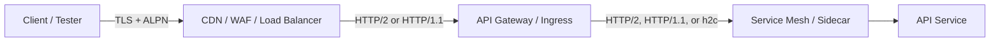
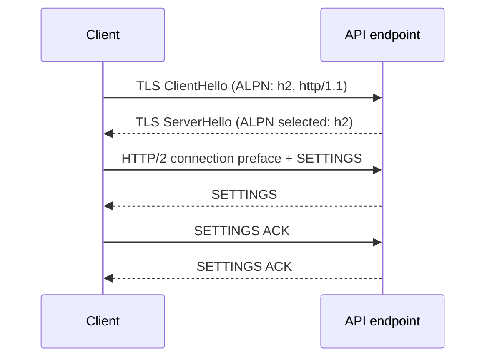
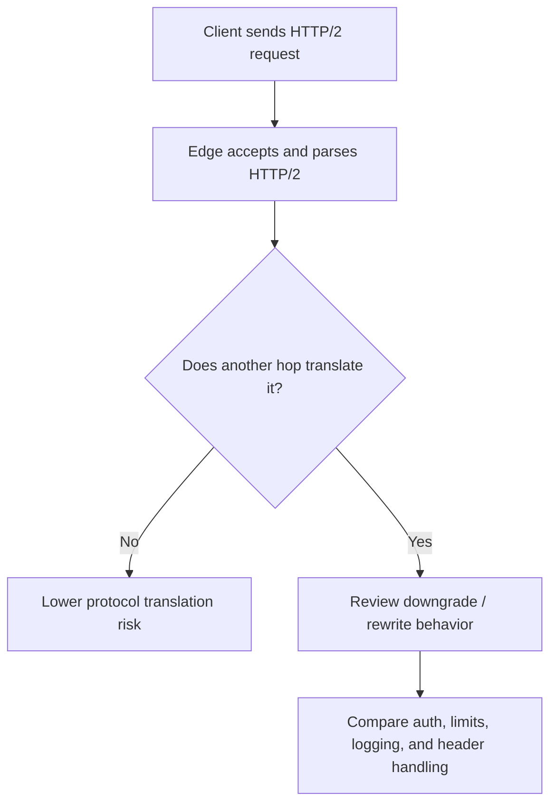

# HTTP/2 For Security Testers

> **Phase 03 — API Communication Protocols**  
> **Focus:** What HTTP/2 changes for authorized API testing, especially around gateways, multiplexing, protocol translation, and resource controls.  
> **Safety note:** This note is for **authorized API assessment, secure design review, purple teaming, and defense**. It focuses on protocol behavior, safe validation ideas, and reporting patterns. It does **not** provide destructive or step-by-step abuse instructions.

---

**Relevant standards and guidance:** RFC 9113 (HTTP/2), RFC 7541 (HPACK), OWASP API Security Top 10 2023, PortSwigger HTTP/2 research, and curl HTTP/2 documentation.

---

## Table of Contents

1. [Why HTTP/2 matters in API testing](#why-http2-matters-in-api-testing)
2. [Beginner mental model](#beginner-mental-model)
3. [How HTTP/2 starts](#how-http2-starts)
4. [Core building blocks testers must recognize](#core-building-blocks-testers-must-recognize)
5. [Why APIs create special HTTP/2 risk](#why-apis-create-special-http2-risk)
6. [Practical authorized testing workflow](#practical-authorized-testing-workflow)
7. [Safe commands and tooling](#safe-commands-and-tooling)
8. [Common defensive finding patterns](#common-defensive-finding-patterns)
9. [Reporting guidance](#reporting-guidance)
10. [Defensive controls](#defensive-controls)
11. [Key takeaways](#key-takeaways)
12. [References](#references)

---

## Why HTTP/2 Matters in API Testing

HTTP/2 is not just a performance upgrade. For API testers, it changes **how requests are carried**, **where security controls are enforced**, and **which trust boundaries deserve attention**.

Most modern APIs do not look like this:

```text
Client -> API server
```

They usually look more like this:



That matters because security issues often appear at the **translation boundary**:

- the edge speaks **HTTP/2**
- an upstream gateway downgrades to **HTTP/1.1**
- internal services speak **HTTP/2** or **h2c** again
- logging, authentication, WAF decisions, or rate limits may happen on only one hop

For API work, HTTP/2 commonly intersects with:

- **OWASP API4:2023 — Unrestricted Resource Consumption**
- **OWASP API8:2023 — Security Misconfiguration**
- **OWASP API9:2023 — Improper Inventory Management**

In other words: HTTP/2 is part protocol knowledge, part traffic analysis, and part architecture review.

---

## Beginner Mental Model

A simple way to think about it:

- **HTTP/1.1** is like sending requests one after another over a conversation.
- **HTTP/2** is like opening **multiple numbered lanes** inside one conversation.

### The mental picture

```text
One TCP connection
└── many HTTP/2 streams
    ├── Stream 1 -> GET /users/me
    ├── Stream 3 -> GET /projects
    └── Stream 5 -> POST /audit/search
```

### The key terms

| Term | Simple meaning | Why a tester cares |
|---|---|---|
| **Connection** | The underlying client-to-server session | Security controls may differ per hop |
| **Stream** | One request/response exchange inside the connection | Many requests can exist at once |
| **Frame** | The binary unit HTTP/2 sends on the wire | Parsing bugs live here and in translation layers |
| **Pseudo-headers** | Special fields like `:method`, `:path`, `:scheme`, `:authority` | Tools show them even though the wire format is binary |
| **HPACK** | Header compression for HTTP/2 | Impacts performance, memory, and header-handling security |
| **SETTINGS** | Limits and preferences peers advertise | Great place to understand resource controls |
| **GOAWAY** | Graceful connection shutdown signal | Helps you reason about retries and in-flight requests |

### What an HTTP/2 request looks like conceptually

Tools usually reconstruct it in a readable way:

```text
:method: GET
:scheme: https
:authority: api.example.com
:path: /v1/profile
accept: application/json
authorization: Bearer <redacted>
```

But on the wire, HTTP/2 is **binary framed**, not raw text like HTTP/1.1.

### HTTP/1.1 vs HTTP/2 from a security tester's viewpoint

| Area | HTTP/1.1 | HTTP/2 | Testing takeaway |
|---|---|---|---|
| Request format | Text | Binary frames | You rely more on tooling than raw packet reading |
| Concurrency | Usually one active request per connection | Many concurrent streams | Connection behavior and rate limiting can change |
| Message length | Headers like `Content-Length` / chunked encoding | Frame lengths define message boundaries | Pure end-to-end HTTP/2 avoids classic CL/TE ambiguity, but downgrades can reintroduce it |
| Header handling | Repetitive plain headers | HPACK compression + state | Header volume and compression state matter |
| Head-of-line blocking | Application-layer problem is worse | Multiplexing helps at HTTP layer | HTTP/2 improves app-level concurrency, but RFC 9113 notes it still runs on TCP |
| Attack surface | Parser ambiguity, smuggling, caching, auth flaws | Translation gaps, hidden support, flow-control abuse, header/state issues | Protocol version itself becomes part of the test plan |

---

## How HTTP/2 Starts

### 1. HTTPS: negotiate `h2` with ALPN

For normal HTTPS APIs, HTTP/2 is selected during the TLS handshake using **ALPN**.



Key point: if the server does **not** advertise `h2`, many clients fall back to HTTP/1.1.

### 2. Cleartext HTTP/2 (`h2c`) is different

RFC 9113 says support for HTTP/2 on `http://` URIs requires **prior knowledge**. It also says the historical `h2c` upgrade token and `HTTP2-Settings` upgrade path are **deprecated** and were never widely deployed.

That makes `h2c` especially interesting in **internal** API environments:

- service meshes
- sidecars
- ingress controllers
- internal gRPC services
- trusted east-west traffic paths

If cleartext HTTP/2 appears where the platform team did not expect it, treat that as an **inventory and trust-boundary issue**, not just a protocol curiosity.

### 3. The connection preface

An advanced detail worth recognizing: RFC 9113 defines a client connection preface that begins with:

```text
PRI * HTTP/2.0\r\n\r\nSM\r\n\r\n
```

You are unlikely to see that on ordinary internet captures because most API traffic is TLS-protected, but it is useful to recognize in controlled internal labs or plaintext environments.

### Hidden HTTP/2 support

PortSwigger notes that some servers actually support HTTP/2 but fail to advertise it correctly through ALPN. That means:

- normal clients may silently fall back to HTTP/1.1
- testers may miss HTTP/2-only behavior
- gateways may behave differently when forced to speak HTTP/2

That is why comparing **approved** HTTP/1.1 and HTTP/2 requests to the same harmless endpoint is so useful.

---

## Core Building Blocks Testers Must Recognize

### 1. Streams and multiplexing

HTTP/2 lets one connection carry many streams at once.

```text
Connection A
├── Stream 1  -> GET /health
├── Stream 3  -> GET /v1/me
├── Stream 5  -> POST /v1/search
└── Stream 7  -> GET /v1/teams
```

Important advanced details:

- client-initiated streams use **odd** numbers
- server-initiated pushed streams use **even** numbers
- stream 0 is for **connection-level** control frames such as `SETTINGS`, `PING`, and `GOAWAY`

Why testers care:

- some controls are applied **per connection**
- others are applied **per request**, **per identity**, or **per stream**
- weak assumptions here can create rate-limit, observability, or availability issues

### 2. Common frame types

| Frame | What it does | Why it matters in testing |
|---|---|---|
| **HEADERS** | Starts a request or response header block | Where pseudo-headers and many translation issues begin |
| **DATA** | Carries the body | Subject to flow control |
| **SETTINGS** | Announces peer limits and preferences | Great source of security-relevant configuration clues |
| **WINDOW_UPDATE** | Grants more flow-control credit | Helps you reason about throughput and buffering |
| **PING** | Measures liveness / RTT | Useful for understanding connection health |
| **RST_STREAM** | Cancels one stream | Indicates stream-level resets, errors, or policy decisions |
| **GOAWAY** | Stops new streams and begins shutdown | Important for safe retries and graceful maintenance |
| **PUSH_PROMISE** | Server push announcement | Optional, less common in APIs, but still architecturally relevant |
| **CONTINUATION** | Continues a header block | Large header sets can trigger parser and limit edge cases |

### A critical nuance: some features are connection-wide, not request-wide

This is easy to forget. In HTTP/2, some behavior is about the **connection**, not only the request:

- HPACK compression state is connection-scoped
- `SETTINGS` are connection-scoped
- flow control exists both **per stream** and **per connection**
- `GOAWAY` shuts down the connection, not just one request

That means an API can look fine when tested with single, isolated requests but behave differently under realistic multiplexed traffic.

### 3. SETTINGS that deserve special attention

| Setting | Meaning | Security/testing relevance |
|---|---|---|
| `SETTINGS_HEADER_TABLE_SIZE` | Max HPACK dynamic table size | Impacts memory use and header compression behavior |
| `SETTINGS_ENABLE_PUSH` | Enables or disables server push | APIs usually do not need push; unexpected use deserves review |
| `SETTINGS_MAX_CONCURRENT_STREAMS` | Max simultaneous streams peer allows | Important for resource control and fair-use enforcement |
| `SETTINGS_INITIAL_WINDOW_SIZE` | Starting per-stream flow-control window | Impacts how much data can be sent before updates |
| `SETTINGS_MAX_FRAME_SIZE` | Largest frame payload accepted | Large values can change buffering and parsing behavior |
| `SETTINGS_MAX_HEADER_LIST_SIZE` | Advisory limit for uncompressed header size | Helps control token/header bloat |

A security tester does not need to memorize every byte of these settings, but should understand what weak limits might imply:

- easier resource exhaustion
- uneven enforcement between edge and backend
- hidden operational bottlenecks
- oversized JWT or header handling problems

### 4. HPACK: header compression with security consequences

HPACK exists because HTTP headers are repetitive and expensive. RFC 7541 introduced it to reduce latency while avoiding known problems that earlier compression approaches helped create.

### The two big HPACK ideas

| HPACK concept | Meaning | Why it matters |
|---|---|---|
| **Static table** | Predefined common header entries | Efficient reuse of standard headers |
| **Dynamic table** | Connection-specific header entries learned over time | Stateful behavior, memory use, and sensitivity concerns |

### What advanced testers should remember about HPACK

RFC 7541 explicitly discusses:

- **probing dynamic table state**
- **memory consumption**
- **implementation limits**
- a **never-indexed** representation for sensitive values

Practical takeaway:

- very large or highly variable headers can become an **availability** issue
- sensitive values such as `Authorization` and cookies deserve careful handling
- compression is a performance feature, but it is also a **security boundary input**

### 5. Flow control and graceful shutdown

HTTP/2 flow control is hop-by-hop. That means each peer relationship has its own flow-control behavior.

Example:

```text
Client <-> CDN <-> API gateway <-> backend
```

Each of those links can have different windows, buffering, and timing behavior.

That is important because one hop may appear healthy while another is constrained.

Also note:

- `RST_STREAM` kills one stream quickly
- `GOAWAY` signals graceful shutdown and tells peers which streams might already have been processed

For APIs, this affects:

- retry safety
- idempotency handling
- rollout behavior during maintenance or deploys
- false positives when a tester mistakes graceful drain behavior for application failure

---

## Why APIs Create Special HTTP/2 Risk

HTTP/2 is especially important in API environments because APIs are usually **proxy-rich** and **policy-heavy**.

### Common API-specific realities

1. **The API gateway often enforces authentication, schema, or rate limits** before the app sees the request.
2. **The backend may trust upstream components** and assume normalization already happened.
3. **Service meshes and gRPC commonly depend on HTTP/2 semantics**, sometimes including cleartext internal transport.
4. **Logs may flatten or reconstruct requests** in ways that hide what was really negotiated on the wire.
5. **Different teams own different hops**, which creates inventory gaps.

### The most important architecture lesson

> **End-to-end safety is not guaranteed just because the client-facing side speaks HTTP/2 correctly.**

A gateway can negotiate HTTP/2 perfectly at the edge and still create risk if it:

- downgrades to HTTP/1.1 upstream
- normalizes headers differently than the backend expects
- enforces rate limits per connection instead of per identity
- fails to preserve security decisions across protocol boundaries

### A useful mental model



---

## Practical Authorized Testing Workflow

This is the safe, high-value way to test HTTP/2 in API engagements.

| Step | What to do safely | What evidence to collect |
|---|---|---|
| **1. Inventory the path** | Ask which hops terminate TLS, which hops speak HTTP/2, HTTP/1.1, or h2c, and whether gRPC/service mesh is involved | Architecture notes, owner confirmation, ingress/gateway product names |
| **2. Confirm negotiation** | Verify whether the endpoint advertises `h2`, falls back to HTTP/1.1, or behaves differently under forced approved HTTP/2 testing | ALPN result, curl/Burp behavior, response protocol version |
| **3. Compare harmless requests** | Send the same benign endpoint request over HTTP/1.1 and HTTP/2 | Status codes, headers, auth behavior, caching, error shape |
| **4. Review translation boundaries** | Look for differences caused by proxies, gateways, or upstream rewrites | Header normalization differences, `Via` or forwarding clues, owner-confirmed upstream protocol |
| **5. Exercise concurrency gently** | Use low-rate parallel requests only against approved canary endpoints | `429`, `503`, `RST_STREAM`, `GOAWAY`, latency changes |
| **6. Check observability** | Confirm whether logs and telemetry record negotiated protocol and upstream protocol | Access logs, trace metadata, gateway metrics, stream reset counters |

### What to compare between HTTP/1.1 and HTTP/2

Use the **same harmless route** and compare:

- authentication outcome
- authorization outcome
- rate-limit behavior
- response headers
- error bodies and status codes
- cache behavior
- retry behavior during connection drain
- observability and trace fields

### When to stop and escalate carefully

If you observe clear evidence of **differential parsing** between HTTP/2 and HTTP/1.1, that is already a meaningful finding.

At that point:

- stop short of harmful payloads
- document the inconsistency
- switch to a dedicated safe test plan with the client
- use non-destructive canary endpoints only

That is the right professional move for protocol desynchronization risk.

---

## Safe Commands and Tooling

These examples are for **authorized testing and benign endpoints**.

### 1. Confirm curl supports HTTP/2

```bash
curl -V | grep -i http2
```

### 2. Ask curl to use HTTP/2 and print the negotiated version

```bash
curl --http2 -sS -o /dev/null \
  -w 'http_version=%{http_version}\n' \
  https://api.example.com/health
```

### 3. Inspect response headers from a harmless endpoint over HTTP/2

```bash
curl --http2 -sS -D - -o /dev/null \
  https://api.example.com/health
```

### 4. Check ALPN negotiation with OpenSSL

```bash
openssl s_client -connect api.example.com:443 \
  -alpn h2,http/1.1 < /dev/null 2>/dev/null | grep -i 'ALPN protocol'
```

### 5. Low-rate parallel requests to observe multiplexing behavior safely

```bash
curl --http2 --parallel --parallel-max 3 \
  https://api.example.com/health \
  https://api.example.com/version \
  https://api.example.com/status
```

Use this gently. Do not treat “parallel” as permission to stress production.

### 6. Controlled internal-only prior-knowledge test

Use this **only** when the environment is owned, approved, and expected to support cleartext HTTP/2.

```bash
curl --http2-prior-knowledge \
  http://internal-api.example.net/health
```

RFC 9113 makes this a special case for environments where support is already known.

### 7. View detailed HTTP/2 exchange metadata with nghttp

```bash
nghttp -nv https://api.example.com/health
```

Useful for:

- connection setup details
- SETTINGS visibility
- stream lifecycle observation
- understanding whether you are really testing HTTP/2

### Tooling map

| Tool | Best use | Why it helps |
|---|---|---|
| **curl** | Quick protocol confirmation and repeatable probes | Easy to script and compare HTTP versions |
| **OpenSSL** | ALPN inspection | Confirms what TLS actually negotiated |
| **nghttp / nghttp2 tools** | Detailed HTTP/2 visibility | Great for streams and SETTINGS |
| **Burp Suite** | Compare HTTP/1.1 vs HTTP/2 behavior in a controlled way | Excellent for approved differential analysis |
| **Wireshark / tshark** | TLS handshake and lab captures | Useful when you control keys or plaintext traffic |

---

## Common Defensive Finding Patterns

These are the types of findings HTTP/2 testing often surfaces in API environments.

| Pattern | Safe observation | Why it matters |
|---|---|---|
| **Hidden HTTP/2 support** | Endpoint looks like HTTP/1.1 by default but behaves differently when approved HTTP/2 is forced | Inventory gap; protocol-specific bugs may be missed |
| **HTTP/2-to-HTTP/1.1 downgrade boundary** | Same harmless request produces different normalization, auth, or rate-limit behavior across versions | Translation gaps can expose parsing and trust issues |
| **Unexpected `h2c` or cleartext internal HTTP/2** | Internal service accepts cleartext HTTP/2 where owners did not expect it | Misconfiguration and trust-boundary exposure |
| **Weak concurrency/resource controls** | Low-rate multiplexed traffic triggers uneven throttling or excessive backend work | Maps to OWASP API4 resource consumption risk |
| **Header size / HPACK sensitivity issues** | Large headers, tokens, or repeated fields cause instability or inconsistent rejection | Compression and header limits affect availability and reliability |
| **Unexpected server push behavior** | Optional push appears in an API path where it is not needed | Increases complexity and cache assumptions |
| **Telemetry blind spots** | Logs omit negotiated protocol or upstream protocol | Makes incident response and forensics weaker |

### The downgrade lesson

Pure end-to-end HTTP/2 has a stronger, frame-based message boundary model than HTTP/1.1. But many real deployments are **not** end-to-end HTTP/2.

That is why testers care so much about:

- where downgrades occur
- whether normalization is consistent
- whether security controls live before or after translation

### The resource lesson

Multiplexing is efficient, but efficiency features can become **resource control problems** if limits are weak.

Look for signs that the platform lacks sane bounds on:

- concurrent streams
- header size
- connection count
- timeouts
- backend buffering
- per-identity rather than per-connection throttling

### The logging lesson

A high-quality API platform should let you answer all of these:

- Did the client negotiate HTTP/2 or HTTP/1.1?
- Did the gateway keep HTTP/2 upstream or downgrade it?
- Which hop applied the auth and rate-limit decision?
- Did any `RST_STREAM` or `GOAWAY` events occur?
- Did the service observe unusual header sizes or stream counts?

If the answer is “we cannot tell,” that is usually a real finding.

---

## Reporting Guidance

HTTP/2 findings are often misunderstood if written too narrowly.

Bad reporting sounds like this:

> “Server supports HTTP/2.”

That is not a finding.

Better reporting explains:

- **where** HTTP/2 is used
- **where** it is translated
- **which** control behaves differently
- **what** risk that creates for the API
- **how** you validated it safely

### Example finding language

> The API edge negotiated HTTP/2 with clients, but the upstream gateway path downgraded requests to HTTP/1.1 before they reached the backend service. During benign differential testing against approved canary endpoints, request handling differed between HTTP/1.1 and HTTP/2 with respect to header normalization and rate-limit behavior. This creates a protocol-translation trust gap that could expose request-parsing inconsistencies, control bypass conditions, or misleading telemetry. No destructive testing was performed.

### Evidence checklist

| Evidence | Why it matters |
|---|---|
| Negotiated protocol / ALPN result | Proves what the client-side hop used |
| Harmless HTTP/1.1 vs HTTP/2 comparison | Shows differential behavior safely |
| Upstream protocol confirmation | Identifies downgrade or h2c exposure |
| Stream reset / GOAWAY observations | Helps explain stability and retry effects |
| Header or limit-related responses | Supports resource-control conclusions |
| Log or trace screenshots | Demonstrates observability gaps |

### Severity thinking

Severity depends less on “HTTP/2 exists” and more on impact such as:

- auth or authorization inconsistency
- request parsing inconsistency at translation boundaries
- bypass of rate-limit or monitoring assumptions
- backend resource exhaustion exposure
- inability to investigate incidents accurately

---

## Defensive Controls

| Control | Why it helps |
|---|---|
| **Prefer end-to-end HTTP/2 where practical, or normalize strictly before downgrading** | Reduces translation ambiguity |
| **Disable or tightly scope `h2c` unless it is explicitly required** | Shrinks internal cleartext attack surface |
| **Apply auth, WAF, and rate-limit logic consistently across protocol versions** | Prevents version-specific trust gaps |
| **Set sane bounds for streams, header list size, frame size, and timeouts** | Reduces API4-style resource exhaustion risk |
| **Treat sensitive headers carefully in compression-aware environments** | Limits header-state and memory risk |
| **Log negotiated protocol and upstream protocol separately** | Improves incident response and root-cause analysis |
| **Test ingress, gateway, and mesh behavior during platform changes** | Protocol issues often appear after config drift |
| **Maintain inventory of which APIs, proxies, and internal services use HTTP/2 or h2c** | Aligns with OWASP API9 inventory needs |
| **Use graceful GOAWAY-based draining during maintenance** | Helps clients retry safely and reduces false outages |

### What mature teams do well

Mature API teams do not just “turn on HTTP/2.” They also:

- document every protocol hop
- understand which control lives on which hop
- validate that security logic is version-agnostic
- measure resource limits under realistic concurrency
- capture enough telemetry to reconstruct what happened later

---

## Key Takeaways

- HTTP/2 changes API testing because it changes **transport behavior**, **concurrency**, and **trust boundaries**.
- The biggest real-world risk is usually **protocol translation**, not the existence of HTTP/2 itself.
- End-to-end HTTP/2 removes some classic HTTP/1.1 ambiguity, but **downgrades can reintroduce risk**.
- HPACK, stream limits, flow control, and graceful shutdown are not just performance topics; they also affect security and availability.
- The highest-value testing pattern is safe differential analysis of **HTTP/1.1 vs HTTP/2** against approved canary endpoints.
- Report **architecture and control gaps**, not just “supports HTTP/2.”

---

## References

- **RFC 9113 — HTTP/2**: protocol overview, startup, streams, SETTINGS, flow control, GOAWAY, and security considerations  
  https://datatracker.ietf.org/doc/html/rfc9113
- **RFC 7541 — HPACK: Header Compression for HTTP/2**: dynamic table behavior, security considerations, and implementation limits  
  https://datatracker.ietf.org/doc/html/rfc7541
- **PortSwigger Web Security Academy — Advanced HTTP request smuggling**: hidden HTTP/2 support and downgrade-based risk framing  
  https://portswigger.net/web-security/request-smuggling/advanced
- **everything curl — HTTP/2**: practical curl behavior for HTTP/2 and prior-knowledge usage  
  https://everything.curl.dev/http/versions/http2.html
- **OWASP API Security Top 10 (2023)**: resource consumption, misconfiguration, and inventory context for API risk  
  https://owasp.org/API-Security/editions/2023/en/0x11-t10/
