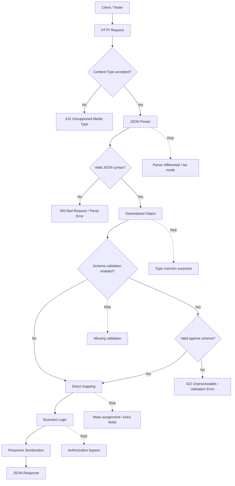

# JSON Format in APIs

> **JSON is the dominant data format in modern REST, GraphQL, and webhook APIs; if you understand its syntax, parsing behavior, security edge cases, and content negotiation, you can test JSON-based APIs safely and comprehensively.**

> **Module:** API Pentesting → API Protocols  
> **Difficulty:** Beginner → Advanced  
> **Tags:** `#json` `#rest` `#content-type` `#parsing` `#validation` `#defensive-testing`

---

## 🧠 What Is It? (Beginner Explanation)

**JSON (JavaScript Object Notation)** is a lightweight text format for representing structured data.

Think of JSON as a shipping label: clean, minimal, and easy for both humans and machines to read.

```json
{
  "userId": 1001,
  "username": "security_analyst",
  "role": "tester",
  "active": true
}
```

JSON is built from just a few simple pieces:

- **Objects**: `{ "key": "value" }` — like dictionaries or maps
- **Arrays**: `[1, 2, 3]` — ordered lists
- **Strings**: `"hello"` — text in double quotes
- **Numbers**: `42`, `3.14` — integers or decimals
- **Booleans**: `true`, `false`
- **Null**: `null` — represents absence of value

Why do API testers care so much about JSON?

- **REST APIs** default to JSON almost universally
- **GraphQL** uses JSON for queries and responses
- **Webhooks** deliver events as JSON payloads
- **Configuration and state** are often stored as JSON
- **Error messages, logs, and debugging info** are frequently JSON-formatted

For defenders and authorized testers, JSON matters because:

- Parsers can behave differently across languages and libraries
- Type coercion and validation gaps create security issues
- Content negotiation mismatches cause unexpected behavior
- Large or deeply nested JSON can exhaust resources
- Special characters and encoding edge cases reveal implementation flaws

**Analogy:** JSON is like a standardized form where every field has a clear label. But if the receiver doesn't validate what's written in each field, or if two systems interpret the same form differently, security problems emerge.

---

## 🏗️ How It Works (Technical Deep Dive)

At a high level, a JSON API request moves through several processing stages:

**Step 1: Client serializes data to JSON**

The application converts internal objects or data structures into JSON text.

**Step 2: HTTP transport layer identification**

The `Content-Type` header tells the server what format to expect:

- `application/json` — standard JSON
- `application/json; charset=utf-8` — with explicit encoding
- `application/*+json` — vendor-specific JSON variants
- `text/json` — older, less common

**Step 3: JSON parser deserializes the text**

The server's JSON library reads the text and builds an in-memory structure:

- Objects become maps/dictionaries
- Arrays become lists
- Primitives become native types

**Step 4: Schema validation (sometimes)**

Many APIs validate against:

- **JSON Schema** — structural and type rules
- **OpenAPI specification** — REST contract
- **Custom validators** — business rule checks

**Step 5: Type mapping and object conversion**

The parsed data gets mapped to application models:

- DTOs (Data Transfer Objects)
- ORM entities
- Internal message types

**Step 6: Business logic processes the request**

Only after parsing, validation, and mapping does the application typically enforce authorization, execute business rules, and persist changes.

**Critical insight:** Many JSON-related vulnerabilities happen **before** business logic security controls activate. Parser behavior, type coercion, and validation gaps matter because they affect what the application even sees.

---

## 📊 Diagram — JSON API Processing Flow



---

## ⚙️ Technical Details

### JSON Syntax Rules (RFC 8259)

| Element | Syntax | Example | Notes |
|---|---|---|---|
| **Object** | `{ "key": value }` | `{ "id": 1 }` | Keys must be strings; values can be any type |
| **Array** | `[ value1, value2 ]` | `[1, 2, 3]` | Ordered collection; values can be mixed types |
| **String** | `"text"` | `"Hello, World!"` | Double quotes required; supports Unicode escapes |
| **Number** | Numeric literal | `42`, `-3.14`, `1.2e10` | No leading zeros; no NaN or Infinity |
| **Boolean** | `true` or `false` | `true` | Lowercase only |
| **Null** | `null` | `null` | Represents absence of value |
| **Whitespace** | Space, tab, newline, carriage return | Ignored between tokens | Can affect signatures or canonicalization |

### Valid JSON Examples

```json
{
  "user": {
    "id": 1001,
    "email": "analyst@example.com",
    "roles": ["reader", "auditor"],
    "metadata": {
      "loginCount": 42,
      "verified": true,
      "notes": null
    }
  }
}
```

### Invalid JSON Examples (What Parsers Should Reject)

```json
// Syntax errors
{ id: 1001 }                    // ❌ Keys must be quoted
{ "id": 1001, }                 // ❌ Trailing comma
{ "value": NaN }                // ❌ NaN not allowed
{ "date": 2024-01-15 }          // ❌ Must be string or number
{ 'id': 1001 }                  // ❌ Single quotes not allowed
{ "id": 0001 }                  // ❌ Leading zeros prohibited
```

### JSON Media Types in the Wild

| Media Type | Usage | Testing Notes |
|---|---|---|
| `application/json` | Standard JSON | Most common; default for REST APIs |
| `application/vnd.api+json` | JSON:API specification | Structured JSON with specific relationship conventions |
| `application/json-patch+json` | JSON Patch operations (RFC 6902) | Array of operation objects for partial updates |
| `application/merge-patch+json` | Merge Patch (RFC 7386) | Simpler partial update format |
| `application/problem+json` | RFC 7807 Problem Details | Structured error format |
| `application/hal+json` | Hypertext Application Language | JSON with hypermedia links |
| `text/json` | Legacy JSON | Avoid; use `application/json` instead |

### JSON vs XML for API Security Work

| Topic | JSON | XML |
|---|---|---|
| **Syntax complexity** | Simple | More complex (elements, attributes, namespaces) |
| **Human readability** | High | Moderate to high |
| **Parser ecosystem** | Wide variety; behavior varies | Standardized but feature-rich |
| **Schema validation** | JSON Schema | XSD, DTD, RELAX NG |
| **Typical use** | REST, GraphQL, webhooks, modern APIs | SOAP, SAML, legacy enterprise APIs |
| **Common parsing risks** | Type coercion, prototype pollution, duplicate keys | XXE, DTD processing, XInclude, entity expansion |
| **Signature support** | JWS, custom implementations | XML Signature (built-in canonicalization) |
| **Size on wire** | Compact | Verbose |

### JSON Parsing Behavior Differences

Different languages and libraries handle edge cases differently:

| Scenario | Strict Parsers | Lax Parsers | Security Impact |
|---|---|---|---|
| **Duplicate keys** | Error or last value wins | May merge, take first, or take last | Gateway and backend may see different values |
| **Trailing commas** | Syntax error | Accepted | Inconsistent validation |
| **Comments** | Not allowed per spec | Some parsers accept `//` or `/* */` | Smuggling or bypass via parser differential |
| **Large numbers** | Limited by spec precision | May truncate or overflow | Authorization checks using numeric IDs can break |
| **Deep nesting** | Recursion or stack limits | May process slowly or crash | DoS via parser exhaustion |
| **Non-string object keys** | Error | Coerce to string | Type confusion attacks |

### Common JSON Encoding Edge Cases

```json
{
  "unicode": "\u0048\u0065\u006C\u006C\u006F",
  "escapes": "Line 1\nLine 2\tTabbed",
  "quotes": "She said, \"Hello!\"",
  "backslash": "Path: C:\\Users\\test",
  "emoji": "🔒 Security",
  "control": "Null byte: \u0000 (usually rejected)"
}
```

**Testing insight:** Control characters, null bytes, and unusual Unicode can reveal:

- Input sanitization gaps
- Database encoding issues
- Log injection vulnerabilities
- Parser tolerance differences

---

## 🔴 Attack Surface

JSON itself is not inherently insecure. Risks come from **how parsers handle edge cases**, **how applications validate and map data**, and **how different components interpret the same JSON**.

### High-Value JSON Risk Areas

| Risk Area | Why It Happens | Safe Validation Goal | Secure Behavior |
|---|---|---|---|
| **Parser differential** | Different parsers interpret edge cases differently | Confirm all layers use compatible parsing modes | Consistent rejection of ambiguous input |
| **Type confusion** | Parser or mapper coerces types unexpectedly | Validate types explicitly before use | Reject wrong types instead of coercing |
| **Mass assignment** | Application blindly maps JSON to objects | Use DTOs with explicit field whitelisting | Extra fields are ignored or rejected |
| **Prototype pollution (JavaScript)** | Special keys like `__proto__` modify object prototypes | Block dangerous property names | Parser or validator strips unsafe keys |
| **Large payloads** | No size limits on JSON input | Enforce payload size limits | 413 Payload Too Large before parsing |
| **Deep nesting** | Recursive parsing exhausts stack | Limit object/array nesting depth | Controlled error, not crash |
| **Duplicate keys** | Spec allows but doesn't define behavior | Choose deterministic parser behavior | Reject duplicates or document which wins |
| **Content-Type mismatch** | Gateway and backend disagree on format | Normalize or validate Content-Type headers | Reject mismatched or missing types |
| **Schema bypass** | Validation is optional or incomplete | Require schema validation on all inputs | 422 Unprocessable for schema violations |

### JSON Risks Commonly Seen in API Programs

1. **Content negotiation confusion**
   - API accepts both JSON and XML, but validation differs between formats
   - `Content-Type` header is ignored or defaulted incorrectly
   - Gateway interprets JSON while backend expects XML (or vice versa)

2. **Type coercion bypasses**
   - Application expects `{ "userId": 42 }` but accepts `{ "userId": "42" }`
   - Type-based authorization checks fail when strings become numbers
   - Boolean flags accept `1`/`0` or `"true"`/`"false"` inconsistently

3. **Mass assignment vulnerabilities**
   - Client sends `{ "email": "user@example.com", "role": "admin" }`
   - Application maps all fields to internal user object
   - Privilege escalation via unexpected field inclusion

4. **Prototype pollution (Node.js)**
   - Malicious JSON: `{ "__proto__": { "isAdmin": true } }`
   - Unsafe merge or assignment modifies Object prototype
   - Can affect all objects in the application

5. **Parser tolerance differences**
   - WAF uses strict parser; backend uses lax parser
   - Comments, trailing commas, or duplicate keys bypass validation
   - Attack payload reaches backend undetected

6. **Numeric precision issues**
   - Large integer IDs exceed JavaScript's `Number.MAX_SAFE_INTEGER`
   - Authorization checks compare wrong values after precision loss
   - Can lead to IDOR or privilege escalation

> **Important:** In authorized testing, focus on reproducible, documented findings. Use non-destructive checks first. For resource exhaustion tests (large payloads, deep nesting), coordinate with operations teams and use staging environments.

---

## 💥 Authorized Testing Workflow (Safe Checks)

This section focuses on **defensive validation** and **contract verification**, not exploitation.

### 1) Start with the API Specification

Before touching requests, review the contract:

- **OpenAPI/Swagger** spec shows expected schemas
- **JSON Schema** files define structure and types
- **GraphQL schema** defines query structure and types
- **Example payloads** in documentation

Build a baseline understanding:

- Required vs optional fields
- Expected types for each field
- Allowed ranges and formats (email, UUID, date)
- Nested object and array structures
- Enum values

### 2) Capture a Known-Good Baseline

Send a valid request first:

```bash
curl -i https://api.example.com/users \
  -H 'Content-Type: application/json' \
  -H 'Authorization: Bearer <token>' \
  -d '{
    "username": "test_analyst",
    "email": "analyst@example.com",
    "role": "reader"
  }'
```

Record:

- Expected status code (usually `200`, `201`, `204`)
- Response headers (`Content-Type`, `Cache-Control`, etc.)
- Response body structure
- Response time

This baseline helps you detect when validation behavior changes.

### 3) Check Content-Type Enforcement

Validate that the API enforces correct media types:

```bash
# Test 1: Send JSON with wrong Content-Type
curl -i https://api.example.com/users \
  -H 'Content-Type: text/plain' \
  -H 'Authorization: Bearer <token>' \
  -d '{"username":"test"}'

# Test 2: Send JSON without Content-Type
curl -i https://api.example.com/users \
  -H 'Authorization: Bearer <token>' \
  -d '{"username":"test"}'

# Test 3: Try XML content-type with JSON body
curl -i https://api.example.com/users \
  -H 'Content-Type: application/xml' \
  -H 'Authorization: Bearer <token>' \
  -d '{"username":"test"}'
```

**Expected secure behavior:**

- `415 Unsupported Media Type` for wrong Content-Type
- `400 Bad Request` for missing Content-Type
- No silent acceptance or type guessing

### 4) Check Syntax Validation

Test basic JSON syntax rules:

```bash
# Invalid: Missing closing brace
curl -i -X POST https://api.example.com/users \
  -H 'Content-Type: application/json' \
  -H 'Authorization: Bearer <token>' \
  -d '{"username":"test"'

# Invalid: Trailing comma
curl -i -X POST https://api.example.com/users \
  -H 'Content-Type: application/json' \
  -H 'Authorization: Bearer <token>' \
  -d '{"username":"test",}'

# Invalid: Unquoted key
curl -i -X POST https://api.example.com/users \
  -H 'Content-Type: application/json' \
  -H 'Authorization: Bearer <token>' \
  -d '{username:"test"}'
```

**Expected secure behavior:**

- `400 Bad Request` for syntax errors
- Generic parser error message
- No stack traces or internal paths
- No partial processing

### 5) Check Type Validation

Test type enforcement for each field:

```bash
# Send string instead of number
curl -i -X POST https://api.example.com/orders \
  -H 'Content-Type: application/json' \
  -H 'Authorization: Bearer <token>' \
  -d '{"userId":"1001","quantity":"five"}'

# Send number instead of string
curl -i -X POST https://api.example.com/users \
  -H 'Content-Type: application/json' \
  -H 'Authorization: Bearer <token>' \
  -d '{"username":42,"email":"test@example.com"}'

# Send boolean instead of string
curl -i -X POST https://api.example.com/users \
  -H 'Content-Type: application/json' \
  -H 'Authorization: Bearer <token>' \
  -d '{"username":true,"email":"test@example.com"}'
```

**Expected secure behavior:**

- `422 Unprocessable Entity` or `400 Bad Request`
- Clear validation error messages
- No type coercion (string `"1001"` should not become integer `1001` silently)

### 6) Check Schema Enforcement

Test required fields, extra fields, and constraints:

```bash
# Test 1: Missing required field
curl -i -X POST https://api.example.com/users \
  -H 'Content-Type: application/json' \
  -H 'Authorization: Bearer <token>' \
  -d '{"username":"test"}'

# Test 2: Extra unexpected field
curl -i -X POST https://api.example.com/users \
  -H 'Content-Type: application/json' \
  -H 'Authorization: Bearer <token>' \
  -d '{"username":"test","email":"test@example.com","isAdmin":true}'

# Test 3: Invalid enum value
curl -i -X POST https://api.example.com/users \
  -H 'Content-Type: application/json' \
  -H 'Authorization: Bearer <token>' \
  -d '{"username":"test","email":"test@example.com","role":"superadmin"}'
```

**Expected secure behavior:**

- Missing required fields → `422` or `400` with clear error
- Extra fields → ignored or rejected (documented behavior)
- Invalid enum → `422` with allowed values listed

### 7) Check Duplicate Key Handling

Test parser behavior with duplicate keys:

```bash
curl -i -X POST https://api.example.com/users \
  -H 'Content-Type: application/json' \
  -H 'Authorization: Bearer <token>' \
  -d '{"username":"regularuser","username":"admin"}'
```

**Questions to answer:**

- Does parser accept duplicate keys?
- Which value wins (first or last)?
- Is behavior consistent across all layers (gateway, API, database)?
- Could an attacker bypass validation using duplicates?

**Expected secure behavior:**

- Reject duplicates with clear error, OR
- Document deterministic behavior (e.g., "last value wins")

### 8) Check Numeric Precision

Test large numbers and edge cases:

```bash
# Very large integer (beyond JavaScript safe integer range)
curl -i -X POST https://api.example.com/transactions \
  -H 'Content-Type: application/json' \
  -H 'Authorization: Bearer <token>' \
  -d '{"userId":9007199254740992,"amount":100}'

# Scientific notation
curl -i -X POST https://api.example.com/transactions \
  -H 'Content-Type: application/json' \
  -H 'Authorization: Bearer <token>' \
  -d '{"userId":1e10,"amount":100}'
```

**Expected secure behavior:**

- Numbers are parsed without precision loss
- Large integers are handled correctly or rejected with error
- No silent truncation that could affect authorization

### 9) Check Resource Limits

Test payload size and nesting depth:

```bash
# Large payload (adjust size based on API limits)
curl -i -X POST https://api.example.com/users \
  -H 'Content-Type: application/json' \
  -H 'Authorization: Bearer <token>' \
  -d @large_payload.json

# Deep nesting (generate programmatically)
curl -i -X POST https://api.example.com/users \
  -H 'Content-Type: application/json' \
  -H 'Authorization: Bearer <token>' \
  -d '{"a":{"b":{"c":{"d":{"e":{"f":{"g":"deep"}}}}}}}}'
```

**Expected secure behavior:**

- `413 Payload Too Large` for oversized payloads
- `400 Bad Request` or `422` for excessive nesting
- No timeout or crash
- Limits documented in API specification

### 10) Check Parser Differential (Multi-Layer)

If your API has multiple layers (WAF, gateway, backend), verify they parse identically:

```bash
# Send edge cases that lax parsers might accept
curl -i -X POST https://api.example.com/users \
  -H 'Content-Type: application/json' \
  -H 'Authorization: Bearer <token>' \
  -d '{"username":"test"/*comment*/,"email":"test@example.com"}'
```

**Questions:**

- Do all layers reject invalid JSON consistently?
- Can comments or other extensions bypass validation at one layer?
- Are error messages consistent across environments?

---

## 🛠️ Tools & Commands

| Tool | Purpose | Example |
|---|---|---|
| `curl` | Send and inspect JSON API requests | `curl -i -H 'Content-Type: application/json' -d '{"key":"value"}' https://api.example.com` |
| `jq` | Parse and query JSON from command line | `echo '{"user":{"id":1}}' \| jq '.user.id'` |
| `jq` | Validate JSON syntax | `cat request.json \| jq empty` |
| `jq` | Format JSON | `cat request.json \| jq .` |
| Burp Suite | Intercept, modify, and replay JSON requests | Repeater, Intruder, and Comparer |
| Postman | API client with JSON formatting and validation | Import OpenAPI specs, send requests |
| `jsonschema` (Python) | Validate JSON against JSON Schema | `jsonschema -i data.json schema.json` |
| HTTPie | User-friendly curl alternative | `http POST api.example.com/users username=test email=test@example.com` |

### Helpful Command-Line Examples

```bash
# Validate JSON syntax with jq
cat request.json | jq empty
# No output = valid JSON
# Error message = invalid JSON

# Pretty-print JSON
cat minified.json | jq .

# Extract specific field
curl -s https://api.example.com/user/1001 | jq '.email'

# Test JSON Schema validation (Python)
pip install jsonschema
jsonschema -i user.json user-schema.json

# Generate large JSON payload for testing
jq -n '{users:[range(1000) | {id:., name:"user\(.)"}]}'

# Send JSON from file with curl
curl -i -X POST https://api.example.com/users \
  -H 'Content-Type: application/json' \
  -H 'Authorization: Bearer <token>' \
  --data @user.json

# Pretty-print API response
curl -s https://api.example.com/users/1001 | jq .
```

### Practical Tester Notes

- Keep a library of **valid baseline requests** for each endpoint
- Use `jq` to validate syntax locally before sending to API
- Save interesting edge cases (large numbers, deep nesting, duplicates) for regression testing
- Compare parser behavior between staging and production
- Document which parser library and version each layer uses

---

## 🔍 Detection

Defenders monitoring JSON APIs should track different signals than traditional web applications.

### Indicators Worth Logging

- **Content-Type mismatches:**
  - Body is JSON but `Content-Type` is not
  - `Content-Type` is JSON but body is not
  - Multiple `Content-Type` headers
  
- **Parser errors:**
  - Malformed JSON syntax
  - Invalid UTF-8 encoding
  - Payload size exceeded
  - Nesting depth exceeded
  
- **Validation failures:**
  - Missing required fields
  - Type mismatches
  - Schema violations
  - Invalid enum values
  
- **Suspicious patterns:**
  - Requests with `__proto__` or `constructor` keys
  - Duplicate keys in JSON objects
  - Unusual character sequences (null bytes, control characters)
  - Rapid payload size escalation from same source

### Example Log Patterns

```text
[PARSER_ERROR] Invalid JSON syntax: unexpected token at position 42
[VALIDATION_ERROR] Field 'userId' type mismatch: expected number, got string
[SCHEMA_VIOLATION] Unknown field 'isAdmin' in request body
[SUSPICIOUS] Prototype pollution attempt: __proto__ key detected
[LIMIT_EXCEEDED] Payload size 15MB exceeds limit of 10MB
[TYPE_CONFUSION] Duplicate key 'role' in request JSON
```

### What Good Detection Looks Like

- Parse errors are logged with request ID and timestamp
- Schema validation failures include field names (but not values containing PII)
- Prototype pollution attempts trigger immediate alerts
- Unusual Content-Type combinations are flagged
- Metrics track parser error rate by endpoint and client

---

## 🛡️ Mitigation & Defense

### Secure JSON Processing Principles

1. **Use strict JSON parsers**
   - Reject comments, trailing commas, non-standard extensions
   - Fail on malformed syntax
   - Document parser library and version

2. **Enforce Content-Type strictly**
   - Require `application/json` (or specific variant)
   - Reject mismatched or missing headers
   - Don't guess or auto-detect formats

3. **Validate against schema**
   - Use JSON Schema for structural validation
   - Validate all inputs, not just some endpoints
   - Keep schemas versioned and in sync with code

4. **Apply resource limits**
   - Maximum payload size (e.g., 10MB)
   - Maximum nesting depth (e.g., 20 levels)
   - Maximum array/object size
   - Parsing timeouts

5. **Use DTOs with explicit whitelisting**
   - Don't map JSON directly to domain objects
   - Use Data Transfer Objects (DTOs)
   - Explicitly list allowed fields
   - Reject or ignore unexpected fields

6. **Prevent prototype pollution**
   - Block dangerous keys: `__proto__`, `constructor`, `prototype`
   - Use `Object.create(null)` or `Map` instead of plain objects
   - Use libraries with built-in protection

7. **Handle type strictly**
   - Don't auto-coerce types
   - Validate expected types explicitly
   - Reject type mismatches early

8. **Normalize and canonicalize carefully**
   - If you need deterministic JSON (e.g., for signatures), use tested canonicalization
   - Document whitespace handling
   - Test with multiple parser implementations

### Secure Node.js Example

```javascript
const express = require('express');
const Ajv = require('ajv');

const app = express();
const ajv = new Ajv({ strict: true });

// Schema definition
const userSchema = {
  type: 'object',
  properties: {
    username: { type: 'string', minLength: 3, maxLength: 50 },
    email: { type: 'string', format: 'email' },
    role: { type: 'string', enum: ['reader', 'writer', 'admin'] }
  },
  required: ['username', 'email', 'role'],
  additionalProperties: false  // Reject unknown fields
};

const validate = ajv.compile(userSchema);

// Strict JSON parsing with size limit
app.use(express.json({ 
  strict: true,
  limit: '10mb',
  type: 'application/json'
}));

// Validation middleware
app.post('/users', (req, res) => {
  // Block prototype pollution
  if (req.body.__proto__ || req.body.constructor || req.body.prototype) {
    return res.status(400).json({ error: 'Invalid field names' });
  }
  
  // Schema validation
  const valid = validate(req.body);
  if (!valid) {
    return res.status(422).json({ 
      error: 'Validation failed',
      details: validate.errors 
    });
  }
  
  // Process with validated data
  // ...
});
```

### Secure Python Example

```python
from flask import Flask, request, jsonify
from jsonschema import validate, ValidationError
import json

app = Flask(__name__)

# Schema definition
USER_SCHEMA = {
    "type": "object",
    "properties": {
        "username": {"type": "string", "minLength": 3, "maxLength": 50},
        "email": {"type": "string", "format": "email"},
        "role": {"type": "string", "enum": ["reader", "writer", "admin"]}
    },
    "required": ["username", "email", "role"],
    "additionalProperties": False
}

# Maximum payload size (10MB)
app.config['MAX_CONTENT_LENGTH'] = 10 * 1024 * 1024

@app.before_request
def validate_content_type():
    if request.method in ['POST', 'PUT', 'PATCH']:
        if request.content_type != 'application/json':
            return jsonify({'error': 'Content-Type must be application/json'}), 415

@app.route('/users', methods=['POST'])
def create_user():
    try:
        data = request.get_json(force=False, silent=False)
        
        # Block prototype pollution attempts
        dangerous_keys = ['__proto__', 'constructor', 'prototype']
        if any(key in data for key in dangerous_keys):
            return jsonify({'error': 'Invalid field names'}), 400
        
        # Schema validation
        validate(instance=data, schema=USER_SCHEMA)
        
        # Process validated data
        # ...
        
        return jsonify({'message': 'User created'}), 201
        
    except json.JSONDecodeError:
        return jsonify({'error': 'Invalid JSON syntax'}), 400
    except ValidationError as e:
        return jsonify({'error': 'Validation failed', 'details': str(e)}), 422
```

### Secure Java Example

```java
import com.fasterxml.jackson.databind.ObjectMapper;
import com.fasterxml.jackson.databind.DeserializationFeature;
import com.networknt.schema.JsonSchema;
import com.networknt.schema.JsonSchemaFactory;
import com.networknt.schema.ValidationMessage;

public class SecureJsonHandler {
    
    private static final ObjectMapper mapper = new ObjectMapper();
    private static final JsonSchemaFactory factory = JsonSchemaFactory.getInstance();
    
    static {
        // Strict parsing
        mapper.configure(DeserializationFeature.FAIL_ON_UNKNOWN_PROPERTIES, true);
        mapper.configure(DeserializationFeature.FAIL_ON_NULL_FOR_PRIMITIVES, true);
    }
    
    public UserDTO validateAndDeserialize(String json, JsonSchema schema) 
            throws ValidationException, JsonProcessingException {
        
        // Schema validation first
        JsonNode jsonNode = mapper.readTree(json);
        Set<ValidationMessage> errors = schema.validate(jsonNode);
        
        if (!errors.isEmpty()) {
            throw new ValidationException("Schema validation failed", errors);
        }
        
        // Deserialize to DTO (not domain object)
        UserDTO dto = mapper.readValue(json, UserDTO.class);
        
        // Additional validation
        if (dto.getRole() != null && 
            !Arrays.asList("reader", "writer", "admin").contains(dto.getRole())) {
            throw new ValidationException("Invalid role");
        }
        
        return dto;
    }
}
```

### Operational Hardening Checklist

- [ ] Inventory all endpoints that accept JSON
- [ ] Document which JSON parser library and version each service uses
- [ ] Implement JSON Schema validation for all input endpoints
- [ ] Set maximum payload size limits (recommend 10MB or less)
- [ ] Set maximum nesting depth limits (recommend 20 levels or less)
- [ ] Enforce strict `Content-Type` validation
- [ ] Block prototype pollution keys in all layers
- [ ] Use DTOs, not direct domain object mapping
- [ ] Test parser differential across all layers (WAF, gateway, backend)
- [ ] Log parse errors and schema violations separately
- [ ] Add security tests for edge cases (duplicates, large numbers, deep nesting)
- [ ] Document type coercion behavior explicitly
- [ ] Implement rate limiting on parse errors per client
- [ ] Return generic validation errors (don't expose schema details to attackers)

---

## 📚 References

- [IETF RFC 8259 - The JavaScript Object Notation (JSON) Data Interchange Format](https://www.rfc-editor.org/rfc/rfc8259)
- [IETF RFC 6901 - JavaScript Object Notation (JSON) Pointer](https://www.rfc-editor.org/rfc/rfc6901)
- [IETF RFC 6902 - JavaScript Object Notation (JSON) Patch](https://www.rfc-editor.org/rfc/rfc6902)
- [JSON Schema](https://json-schema.org/)
- [OpenAPI Specification](https://spec.openapis.org/oas/latest.html)
- [OWASP - Mass Assignment](https://cheatsheetseries.owasp.org/cheatsheets/Mass_Assignment_Cheat_Sheet.html)
- [PortSwigger - Prototype Pollution](https://portswigger.net/web-security/prototype-pollution)
- [IETF RFC 7807 - Problem Details for HTTP APIs](https://www.rfc-editor.org/rfc/rfc7807)
- [MDN Web Docs - JSON](https://developer.mozilla.org/en-US/docs/Web/JavaScript/Reference/Global_Objects/JSON)
- [NIST - Security Considerations for JSON](https://csrc.nist.gov/publications/detail/sp/800-204a/draft)

---

## 💡 Key Takeaways

- **JSON is simple but parsers vary** — Different libraries handle edge cases differently; test across all layers
- **Content-Type matters** — Enforce strict media type validation to prevent format confusion attacks
- **Schema validation is essential** — JSON Schema prevents many common security issues
- **Type coercion is dangerous** — Validate types explicitly; don't rely on automatic conversion
- **Resource limits prevent DoS** — Set payload size and nesting depth limits
- **Prototype pollution is real** — Block dangerous keys in JavaScript/Node.js environments
- **Mass assignment needs DTOs** — Never map JSON directly to domain objects
- **Parser differential creates gaps** — Ensure WAF, gateway, and backend parse identically
- **Testing starts with the spec** — Know the contract before testing edge cases

---

> **Remember:** JSON's simplicity is both its strength and its weakness. The format itself is straightforward, but real security issues emerge from parser differences, validation gaps, and type handling inconsistencies. Authorized testing focused on contract compliance, parser behavior, and resource limits will reveal the most valuable findings.
