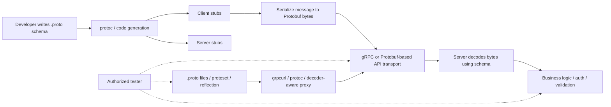
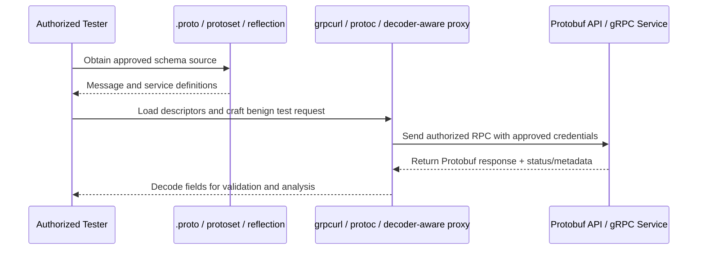

# Protobuf Basics

> **Understanding Protocol Buffers from first principles, and how to inspect Protobuf-based APIs safely in authorized environments.**

## 🧠 What Is Protobuf? (Beginner Explanation)

**Protocol Buffers** (usually called **Protobuf**) are a compact way to represent structured data.

If JSON is a labeled cardboard box where every field name is written out in plain text, Protobuf is more like a shipping manifest with numeric field IDs and a shared blueprint. The payload is usually **smaller**, **faster to parse**, and **harder to read by eye** — but it is **not encryption** and **not security by itself**.

A Protobuf system usually has two pieces:

1. A **schema** in a `.proto` file that defines messages and services.
2. A **binary wire format** generated from that schema.

That schema is the key to everything. Without it, you may still see bytes on the wire, but you will not understand them reliably.

---

## Why API Testers Care

Protobuf appears all over modern APIs, especially when applications use:

- **gRPC** over HTTP/2
- **gRPC-Web** through a browser-compatible proxy
- **Mobile app backends** that want compact messages
- **Internal microservice APIs** where efficiency matters
- **Binary endpoints** that are not obvious from normal REST tooling

For an authorized tester, Protobuf matters because it changes **visibility**, not the underlying risk model.

- Authorization bugs are still authorization bugs.
- Rate-limit failures are still rate-limit failures.
- Unsafe business logic is still unsafe business logic.
- The difference is that **traditional HTTP tooling may not decode the data automatically**.

### Important security reality

| Myth | Reality |
|---|---|
| “It’s binary, so it’s secure.” | Binary only makes traffic less human-readable. It does **not** add confidentiality or access control. |
| “The schema guarantees safe input handling.” | The schema constrains structure and types, but business logic flaws still happen above it. |
| “gRPC automatically means strong transport security.” | Many deployments terminate TLS at a gateway or mix internal plaintext and external TLS. |
| “If I can’t see the fields in Burp, the attack surface is gone.” | The attack surface still exists; you may just need `.proto` files, descriptors, or reflection to inspect it properly. |

---

## Protobuf vs gRPC vs gRPC-Web

These terms are related, but they are not the same thing.

| Term | What it is | Why the distinction matters |
|---|---|---|
| **Protobuf** | A schema language and binary serialization format | Defines message structure; often the reason traffic looks opaque |
| **gRPC** | An RPC framework commonly layered over HTTP/2 | Defines how methods are called and how metadata/status are transported |
| **gRPC-Web** | A browser-friendly adaptation of gRPC, usually via a proxy | Adds translation layers that can create validation and auth differences |

You can have:

- **Protobuf without gRPC** — for example, internal binary payloads over custom HTTP endpoints
- **gRPC that uses Protobuf** — the most common case
- **gateway setups** where browsers talk JSON or gRPC-Web while backend services speak native gRPC

For testers, this matters because the bug may live in:

- the **message schema**
- the **RPC method**
- the **proxy/gateway translation**
- or the **business logic behind all of them**

---

## 📊 JSON vs XML vs Protobuf

| Feature | JSON | XML | Protobuf |
|---|---|---|---|
| Human-readable | ✅ Yes | ✅ Yes | ❌ Usually no |
| Size on wire | Medium | Large | Small |
| Parsing speed | Good | Usually slower | Very good |
| Self-describing on wire | ✅ Field names visible | ✅ Tag names visible | ❌ Needs schema/descriptors |
| Common API use | REST, GraphQL | SOAP, legacy APIs | gRPC, internal APIs, mobile |
| Easy to inspect manually | ✅ Very | ✅ Moderate | ⚠️ Only with schema/tooling |
| Good for browser-native APIs | ✅ Yes | ⚠️ Sometimes | ⚠️ Usually via gRPC-Web or custom handling |
| Security implications | Familiar attack surface | Parsing complexity, XXE class risks | Visibility, schema drift, transport/gateway mismatch |

---

## 📊 Diagram — Where Protobuf Fits in an API Stack



---

## Core Building Blocks

### 1. Messages

A **message** is the basic unit of structured data.

```proto
syntax = "proto3";

package notes.profile.v1;

message GetProfileRequest {
  string user_id = 1;
}

enum Tier {
  TIER_UNSPECIFIED = 0;
  FREE = 1;
  PRO = 2;
}

message Profile {
  string user_id = 1;
  string email = 2;
  repeated string roles = 3;
  optional string phone = 4;
  map<string, string> labels = 5;
  Tier tier = 6;
}

service ProfileService {
  rpc GetProfile(GetProfileRequest) returns (Profile);
}
```

### 2. What each part means

| Part | Meaning | Why a tester cares |
|---|---|---|
| `syntax = "proto3";` | Uses proto3 rules | Proto3 has important default/presence behavior |
| `package` | Namespace for messages/services | Helps map fully-qualified RPC names |
| `message` | Structured request/response object | Defines what can be sent or returned |
| `field = number` | Stable numeric wire identifier | The **number**, not the name, matters on the wire |
| `repeated` | A list field | Check size limits, duplicates, and resource handling |
| `optional` | Explicit presence tracking | Useful when “missing” and “empty/default” mean different things |
| `map<K,V>` | Key-value collection | Check duplicate-key handling and normalization |
| `enum` | Restricted set of values | Zero/default enum handling can matter for authorization or workflow state |
| `service` / `rpc` | Remote callable API method | Treat each RPC like a separate endpoint with its own auth and input rules |

### 2.1 Field numbers are a design and security concern

Field numbers are not just implementation detail.

- They must be **unique** within a message.
- They should **never be reused** after release.
- Frequently used fields often use **1–15** because they encode more compactly.
- The range **19000–19999** is reserved by Protobuf implementations and should not be used.

For security testers, bad field-number hygiene can signal:

- schema drift between client and server
- unsafe migrations across API versions
- hidden compatibility bugs that only appear with older clients

### 3. `oneof` means “exactly one branch”

```proto
message LoginRequest {
  oneof credential {
    string api_key = 1;
    string oauth_token = 2;
  }
}
```

This is common in real APIs. For testing, confirm the server behaves correctly when clients:

- send one valid branch
- omit all branches
- try equivalent values through different gateway paths
- hit edge cases around default values and serialization

The important point is defensive: verify the server enforces the intended business rule, not just the client SDK.

---

## How Protobuf Is Encoded

At a high level, Protobuf serializes data as **field tags + encoded values**.

A few important ideas:

### 1. The wire format uses field numbers, not field names

If a field is defined as:

```proto
string email = 2;
```

the number `2` is what matters on the wire. This is why **reusing field numbers is dangerous**.

### 2. Small integers are compact

Protobuf uses **varints** for many integer types, so smaller values often take fewer bytes.

### 3. Strings, bytes, nested messages, and packed repeated fields are length-delimited

That means the wire format stores a length and then the payload.

### 4. Protobuf is not self-describing

A payload does **not** normally include enough metadata for you to reconstruct the original field names and meanings without:

- the `.proto` file
- a compiled descriptor set (`.protoset`)
- server reflection
- another trusted source of the schema

### Simplified wire-type view

| Wire type | Common field kinds | Tester takeaway |
|---|---|---|
| `VARINT` | `int32`, `int64`, `bool`, `enum` | Small integers are compact; booleans and enums often look tiny on the wire |
| `LEN` | `string`, `bytes`, nested messages, packed repeated fields | A huge amount of interesting application data lives here |
| `I32` | `fixed32`, `sfixed32`, `float` | Fixed-width 32-bit values |
| `I64` | `fixed64`, `sfixed64`, `double` | Fixed-width 64-bit values |

### Tiny example

Schema:

```proto
message Test1 {
  int32 a = 1;
}
```

If `a = 150`, the encoded bytes are compact because Protobuf stores a field tag and a varint value, not the text `"a": 150`.

You usually do **not** need to hand-decode bytes during an assessment. What matters is knowing why the traffic is opaque until you load the schema.

---

## Presence, Defaults, and Why Advanced Testers Care

This is where many Protobuf-based bugs become confusing.

### Proto3 default behavior

In proto3, many scalar fields behave as though the **default value** and **not present** are very close unless you use explicit presence (`optional`).

That matters when the application logic distinguishes between:

- “user did not send this field”
- “user sent the field with value `0`”
- “user sent the field with an empty string”
- “user intentionally cleared the field”

### Presence pitfalls table

| Situation | What can happen | Why it matters for testing |
|---|---|---|
| Field omitted | Server may treat it as default | Can hide business logic bugs around patch/update behavior |
| Empty string or zero value | May look similar to “unset” in some flows | Check whether validation and authorization treat them differently |
| Duplicate singular field on wire | “Last one wins” behavior can apply | Useful to understand for gateways, translators, and odd parser edge cases |
| Unknown field received | Older services may ignore it | Relevant when testing backward compatibility or schema drift |
| Deleted field number reused | Old/new clients decode differently | Can cause data corruption or misinterpretation across versions |

### Safe schema evolution example

When a field is removed, reserve it instead of reusing it later.

```proto
message Profile {
  reserved 7, 9 to 11;
  reserved "legacy_status";
}
```

For a tester, schema evolution issues often appear as:

- old mobile app behavior not matching current backend expectations
- proxy/gateway translation behaving differently from direct gRPC
- “invisible” fields surviving between internal services
- partial update bugs where defaults unintentionally overwrite data

---

## 📊 Diagram — Authorized Testing Workflow for Protobuf APIs



---

## Where You Will Encounter Protobuf in Real API Work

| Scenario | What you will see | What to verify |
|---|---|---|
| Native gRPC service | HTTP/2, RPC method names, binary frames | Auth per RPC, reflection exposure, status codes, message size controls |
| gRPC-Web | Browser traffic plus proxy translation | Header handling, CORS, gateway validation mismatch |
| Mobile app backend | Binary blobs or app-generated stubs | Descriptor discovery, version drift, auth metadata |
| Internal microservice calls | East-west service traffic | mTLS assumptions, trust boundaries, service-to-service authorization |
| Hybrid REST + Protobuf setup | JSON externally, Protobuf internally | Translation consistency, dropped fields, default-value confusion |

---

## Practical, Defensive Testing Workflow

All examples below assume you are working on a system you **own** or are **explicitly authorized** to assess.

### 1. Get the schema first

Your best sources are usually:

1. the repository’s `.proto` files
2. a provided descriptor set (`.protoset`)
3. server reflection in an approved environment
4. vendor or internal API documentation

### 2. Use tooling that understands Protobuf

`grpcurl` is often the easiest starting point for gRPC because it lets you send **JSON input** while it handles **Protobuf encoding** underneath.

```bash
# List services exposed by an approved target
grpcurl api.example.test:443 list

# Describe one service
grpcurl api.example.test:443 describe notes.profile.v1.ProfileService

# Call a method with approved credentials
grpcurl \
  -H "authorization: Bearer $TOKEN" \
  -d '{"user_id":"12345"}' \
  api.example.test:443 \
  notes.profile.v1.ProfileService/GetProfile
```

If reflection is disabled but you have schema files:

```bash
grpcurl \
  -import-path ./protos \
  -proto profile.proto \
  describe notes.profile.v1.ProfileService
```

If you have a captured binary payload from an authorized lab or test environment, `protoc` can help decode it.

```bash
# Raw decode when you do not yet know the full schema
protoc --decode_raw < response.bin

# Schema-aware decode when you do know the message type
protoc \
  --decode=notes.profile.v1.Profile \
  profile.proto < response.bin
```

### 3. Map RPC methods like real endpoints

Treat each RPC as its own API function.

Document for every method:

- request message type
- response message type
- required auth mechanism
- role/tenant restrictions
- expected input limits
- error/status behavior
- whether the same business action is exposed through a gateway or alternate path

### 4. Verify security controls at the RPC level

High-signal checks for authorized testing:

| Check | Why it matters |
|---|---|
| Reflection exposure | Can reveal internal services, methods, and message structures |
| Per-method authorization | Teams often secure the gateway but miss a specific RPC |
| Metadata handling | Auth tokens, tenant IDs, and custom headers may be trusted inconsistently |
| Message size limits | Unbounded `repeated` fields or `bytes` fields can create resource issues |
| Default-value behavior | “Unset” vs `0`/`false`/empty can change business logic outcomes |
| Gateway parity | JSON gateway and native gRPC path may not validate the same way |
| Version compatibility | Old clients may trigger unintended logic in new services |

### 5. Compare transport layers

A mature assessment often compares:

- direct gRPC behavior
- gRPC-Web behavior
- REST/JSON gateway behavior
- internal service-to-service behavior if it is in scope

You are looking for **mismatch**, not magic.

Examples of mismatch:

- gateway strips unknown fields but direct gRPC path accepts them
- gateway validates a field as required but internal service treats it as optional
- browser-facing path enforces auth differently from internal RPC path
- status/error translation leaks extra details through one path but not another

---

## Common Protobuf Security Misunderstandings

### “Binary means hidden fields are safe”

No. If the server accepts a field, the field exists in the attack surface whether or not a default web proxy decodes it nicely.

### “The client SDK is the source of truth”

No. The server is the source of truth. Client-side generated code may hide optional branches, omit fields, or normalize defaults in ways that the server does not.

### “Reflection is always bad”

Not always. In a development environment, reflection can be useful. In production, it becomes an **inventory and information disclosure** decision. Treat it as an exposure that should be justified and access-controlled.

### “If the schema compiles, the design is safe” 

No. Protobuf solves serialization problems. It does not solve:

- broken object level authorization
- broken function level authorization
- unsafe business flows
- excessive resource consumption
- insecure trust in upstream APIs

Those are application design and access-control problems.

---

## High-Value Things to Look For in Authorized Assessments

### 1. Reflection and descriptor exposure

- Is reflection enabled in production?
- Can low-privilege users enumerate services they should not know about?
- Are `.proto` or `.protoset` artifacts exposed through repositories, debug endpoints, or build artifacts?

### 2. Authn/authz inconsistencies between RPCs

- Does every sensitive RPC enforce the same identity and tenant checks?
- Are read methods protected differently from write methods?
- Are admin-only RPCs merely hidden in clients, or actually enforced server-side?

### 3. Presence and patch semantics

- Does “field omitted” behave differently from “field sent as empty/default”?
- Are partial updates safe?
- Can default enum or boolean values accidentally bypass intended review steps?

### 4. Resource controls

- Are `repeated` collections bounded?
- Are `bytes` fields capped?
- Are streaming RPCs governed by message count, size, and timeouts?
- Are decompression and parsing costs visible to defenders?

### 5. Translation-layer mismatches

- Does JSON-to-Protobuf transcoding drop or transform fields?
- Are camelCase vs snake_case mappings consistent?
- Do null handling and presence rules differ between JSON and native Protobuf paths?

---

## Quick Reference — Common Schema Features and Testing Meaning

| Feature | Example | What it means for testing |
|---|---|---|
| Scalar | `int32 count = 1;` | Check boundary values and default handling |
| String | `string name = 2;` | Check required-vs-optional semantics, normalization, length limits |
| Bytes | `bytes blob = 3;` | Check size limits and content handling |
| Repeated | `repeated string roles = 4;` | Check count limits and duplicate handling |
| Optional | `optional string phone = 5;` | Distinguish absent from explicitly set |
| Enum | `Role role = 6;` | Check zero/default value semantics |
| Map | `map<string,string> tags = 7;` | Check collisions, overwrite rules, normalization |
| Oneof | `oneof auth { ... }` | Verify mutually exclusive behavior |
| Nested message | `Address addr = 8;` | Check validation of embedded structures |
| Service method | `rpc UpdateUser(...)` | Treat as a discrete endpoint with its own authorization |

---

## Defensive Checklist for Builders and Reviewers

If you are reviewing or hardening a Protobuf-based API, this is a good baseline:

- Disable or restrict **server reflection** in production unless there is a real operational need.
- Protect `.proto` files and descriptor sets like other sensitive interface documentation.
- Use **explicit presence** where business logic depends on distinguishing omitted from default values.
- Never reuse deleted field numbers; **reserve** them.
- Enforce authorization **per RPC**, not just at the gateway.
- Set message size, stream, and timeout limits.
- Validate business meaning, not only schema shape.
- Log method name, caller identity, outcome, and policy decisions for investigation.
- Test JSON/gateway behavior and native gRPC behavior separately.

---

## What To Remember

If you remember only a few things about Protobuf, remember these:

1. **Protobuf is a serialization format, not a security control.**
2. **The schema is everything** — without `.proto`, descriptors, or reflection, the wire data is hard to interpret.
3. **Field numbers are the real wire identity**, so schema evolution mistakes matter.
4. **Proto3 presence/default behavior can hide subtle bugs** in updates, validation, and authorization logic.
5. **For API testing, each RPC is an endpoint** with its own auth, input, and business logic risks.

---

## References

- [Protocol Buffers Overview](https://protobuf.dev/overview/)
- [Proto3 Language Guide](https://protobuf.dev/programming-guides/proto3/)
- [Protocol Buffer Encoding Guide](https://protobuf.dev/programming-guides/encoding/)
- [Field Presence Guide](https://protobuf.dev/programming-guides/field_presence/)
- [gRPC Concepts Overview](https://github.com/grpc/grpc/blob/master/CONCEPTS.md)
- [grpcurl Project](https://github.com/fullstorydev/grpcurl)
- [OWASP API Security Project](https://owasp.org/www-project-api-security/)
