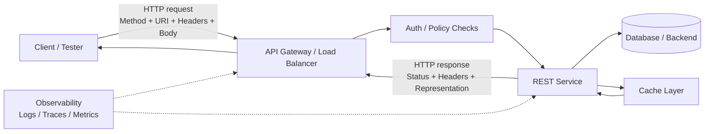
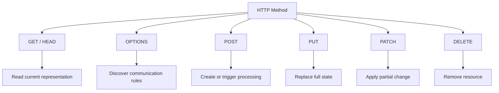
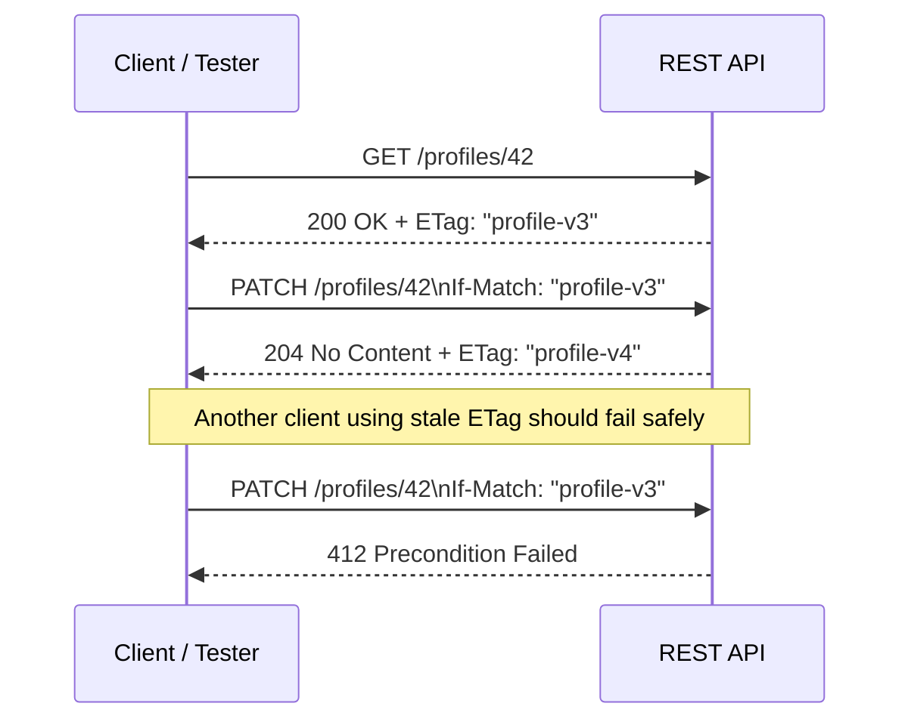

# REST Communication for API Security Testers

> **How REST uses HTTP to move resource representations between clients, gateways, caches, and services — and how to validate that behavior safely in authorized environments.**

> **Authorized testing only:** Everything in this note is framed for systems you own or are explicitly permitted to assess. Prefer test tenants, test accounts, and non-production data whenever possible.

## 🧠 What Is REST Communication? (Beginner Explanation)

REST communication is the way a client and server exchange **resource representations** over HTTP.

- A **resource** is the thing the API exposes, such as a user, invoice, ticket, or order.
- A **representation** is how that resource is sent over the wire, usually JSON.
- HTTP carries the request using a **method**, **URL**, **headers**, and sometimes a **body**.
- REST adds the architectural ideas: **statelessness**, **resource-oriented URLs**, **standard HTTP semantics**, and predictable responses.

A simple mental model:

- `GET /users/42` → "give me the current representation of user 42"
- `POST /orders` → "create a new order from this submitted representation"
- `PATCH /profile` → "apply these partial changes to the current profile"

REST is **not** a separate wire protocol like gRPC. It is an **architectural style built on top of HTTP semantics**.

---

## 🎯 Why REST Communication Matters in API Pentesting

Many important API findings come from communication mistakes rather than exotic bugs:

- the wrong method is accepted
- the wrong status code hides a failure
- caches store sensitive data incorrectly
- partial updates overwrite fields unexpectedly
- gateways and origin services disagree about headers or authorization
- clients send one media type, but the server parses another

If you understand REST communication deeply, you can test APIs more systematically:

1. **Map what each endpoint is supposed to mean**
2. **Compare that meaning with actual HTTP behavior**
3. **Document mismatches as security or reliability risks**

---

## 🧩 REST in One Diagram



### Read the diagram like a tester

A REST request is rarely just "client talks directly to app". Real systems usually include:

- **gateways** that enforce auth, rate limits, and routing
- **caches/CDNs** that may change response behavior
- **microservices** that interpret headers differently
- **logging/tracing layers** that expose correlation IDs or leak internals

That is why you validate communication **end-to-end**, not just JSON bodies.

---

## 🧱 Core Building Blocks of REST Communication

| Building block | What it means | Example | Why a tester cares |
|---|---|---|---|
| **Resource URI** | The address of the resource | `/api/v1/orders/123` | Checks whether URLs are noun-based, predictable, and consistently protected |
| **HTTP method** | The operation semantics | `GET`, `POST`, `PUT`, `PATCH`, `DELETE` | Method confusion and unsafe fallbacks often create security issues |
| **Headers** | Metadata about the request/response | `Authorization`, `Accept`, `ETag` | Auth, caching, content negotiation, and proxy behavior all live here |
| **Representation** | The transmitted form of the resource | JSON, XML | Parsing differences can create validation gaps |
| **Status code** | The protocol-level outcome | `200`, `201`, `404`, `412` | Accurate codes help clients behave safely and reveal true server behavior |
| **Statelessness** | Each request carries its own context | Bearer token in every request | Missing context handling often causes auth and cache issues |
| **Hypermedia (optional)** | Links to related actions/resources | `links.self`, `links.next` | Useful for discovery; uncommon but worth recognizing |
| **Caching metadata** | Freshness and validation rules | `Cache-Control`, `ETag`, `Vary` | Sensitive data leaks and stale responses often start here |

---

## ⚙️ REST Communication vs. Plain HTTP

| HTTP concept | Plain HTTP meaning | REST interpretation |
|---|---|---|
| **URI** | Addressable target | Resource identifier |
| **Method** | Requested action | Uniform interface for resource operations |
| **Body** | Message content | Representation of current or intended resource state |
| **Headers** | Metadata | Negotiation, auth, caching, concurrency control |
| **Status code** | Result of processing | Contract clients depend on for safe behavior |

A practical takeaway: **REST depends on HTTP semantics being used correctly**. If an API tunnels everything through `POST` or always replies `200 OK`, it becomes harder to reason about, test, and secure.

---

## 📬 HTTP Methods in REST: The Semantics You Must Know

MDN and RFC 9110 classify methods by whether they are **safe**, **idempotent**, and potentially **cacheable**. These concepts matter a lot during testing.

### Safe vs. Idempotent vs. Cacheable

- **Safe** → intended to read, not change state
- **Idempotent** → repeating the same request should leave the resource in the same final state
- **Cacheable** → intermediaries may reuse the response under defined conditions

| Method | Typical REST use | Safe | Idempotent | Notes for testers |
|---|---|---:|---:|---|
| `GET` | Read a resource or collection | ✅ | ✅ | Verify read-only behavior, cache headers, pagination, filtering |
| `HEAD` | Same as `GET` without body | ✅ | ✅ | Useful for checking metadata, `Content-Length`, validators, caching |
| `OPTIONS` | Discover communication options | ✅ | ✅ | Check `Allow`, CORS behavior, and supported methods |
| `POST` | Create resource or trigger non-idempotent action | ❌ | ❌ | Often overused; confirm validation, status codes, `Location` on creation |
| `PUT` | Full replacement of a resource | ❌ | ✅ | Check whether omitted fields are deleted, reset, or preserved |
| `PATCH` | Partial modification of a resource | ❌ | ❌* | Confirm patch media type, merge behavior, and concurrency controls |
| `DELETE` | Remove a resource | ❌ | ✅ | Repeated deletes should not produce unsafe side effects |

> `PATCH` can behave idempotently in some designs, but it is not inherently idempotent in the specification.

### Why this matters in authorized testing

If a supposedly safe method changes server state, or if a repeated `PUT` produces different outcomes each time, the API contract is misleading. Misleading contracts lead to fragile clients, cache errors, and sometimes authorization bypass conditions around method handling.

---

## 🧪 Diagram — Method Semantics at a Glance



---

## 🧭 URI Design: What Good REST URLs Usually Look Like

Microsoft's REST API guidance emphasizes **resource-oriented URIs**, usually based on **nouns**, not verbs.

### Usually good

```text
GET    /users
GET    /users/42
POST   /orders
GET    /orders/9001/items
PATCH  /profiles/42
DELETE /sessions/current
```

### Usually less RESTful / harder to reason about

```text
POST /createUser
POST /deleteOrder
POST /getInvoiceById
POST /updateProfileField
```

### Testing notes

Resource-oriented naming is not just stylistic:

- it makes access control easier to reason about
- it makes documentation and OpenAPI contracts clearer
- it makes unexpected endpoints stand out faster during reviews

RPC-style endpoints are not automatically insecure, but they often hide semantics that standard HTTP methods would otherwise communicate clearly.

---

## 📨 Anatomy of a REST Request and Response

### Example: Reading a resource safely

```http
GET /api/v1/orders/123 HTTP/1.1
Host: api.example.test
Authorization: Bearer eyJ...demo
Accept: application/json
If-None-Match: "ord-123-v5"
X-Request-ID: 1f7639d7-demo
```

```http
HTTP/1.1 200 OK
Content-Type: application/json
Cache-Control: private, no-store
ETag: "ord-123-v6"
Vary: Accept, Authorization
X-Request-ID: 1f7639d7-demo

{
  "id": 123,
  "status": "processing",
  "total": 99.95,
  "currency": "USD"
}
```

### What to notice

| Part | Why it matters |
|---|---|
| `Authorization` | Confirms each request carries identity context |
| `Accept` | Tells the server which representation the client wants |
| `If-None-Match` | Supports cache revalidation using a previous `ETag` |
| `Cache-Control: private, no-store` | Good default for sensitive user-specific data |
| `Vary` | Tells caches which request headers influence the response |
| `X-Request-ID` | Helpful for tracing behavior across gateways and services |

---

## 🧾 Content Negotiation and Media Types

REST communication is not just about JSON existing; it is about the client and server agreeing on **what representation is being sent and accepted**.

| Header | Direction | Purpose | Practical tester question |
|---|---|---|---|
| `Accept` | Request | Which response media type the client wants | Does the server honor it, ignore it, or behave inconsistently? |
| `Content-Type` | Request/Response | What media type is actually being sent | Does the server parse only what it claims to parse? |
| `Accept-Encoding` | Request | Compression preferences | Do proxies/CDNs change behavior with compression? |
| `Accept-Language` | Request | Language preference | Does localization affect error handling or caches? |
| `Vary` | Response | Which request headers influence cache keys | Could one user's response be served to another due to missing `Vary`? |

### Common healthy behavior

- `415 Unsupported Media Type` when the client submits an unsupported body format
- `406 Not Acceptable` when the requested response format cannot be produced
- a clear `Content-Type` on every meaningful response

### Authorized testing idea

In your own lab or approved scope, send the same logical request with different `Accept` and `Content-Type` combinations and verify that validation, parsing, and error handling stay consistent.

---

## 🔁 PUT vs. PATCH: One of the Most Important REST Distinctions

| Aspect | `PUT` | `PATCH` |
|---|---|---|
| Intent | Replace the full resource representation | Modify only part of the resource |
| Body expectation | Usually complete state | Partial state or patch document |
| Idempotency | Yes by definition | Not guaranteed |
| Common mistake | Treating it like a partial update | Accepting vague or undocumented patch formats |
| Tester focus | Do omitted fields get reset? | Does the server safely apply partial changes? |

### Example: `PUT`

```http
PUT /api/v1/profiles/42 HTTP/1.1
Host: api.example.test
Content-Type: application/json
If-Match: "profile-v3"

{
  "displayName": "Alice",
  "timezone": "UTC",
  "marketingOptIn": false
}
```

A tester should verify what happens if a field is omitted:

- is it removed?
- is it preserved?
- is it reset to a default?
- is the behavior documented?

### Example: `PATCH`

```http
PATCH /api/v1/profiles/42 HTTP/1.1
Host: api.example.test
Content-Type: application/merge-patch+json
If-Match: "profile-v3"

{
  "timezone": "Europe/Berlin"
}
```

RFC 5789 introduced `PATCH` because `PUT` means full replacement, while `PATCH` means partial modification. Servers can advertise supported patch formats with `Accept-Patch`.

```http
HTTP/1.1 204 No Content
Accept-Patch: application/merge-patch+json, application/json-patch+json
ETag: "profile-v4"
```

---

## Conditional Requests, ETags, and Lost Update Protection

One of the most valuable advanced REST topics is **concurrency control**.

Without conditional requests, two clients can overwrite each other's changes accidentally.

### Sequence Diagram — Safe Update with `ETag` + `If-Match`



### Why this matters

MDN's `ETag` guidance highlights two major uses:

1. **Cache validation** with `If-None-Match` → efficient `304 Not Modified`
2. **Mid-air collision prevention** with `If-Match` → safer updates

### Tester checklist for conditional requests

- Does the API return validators like `ETag` or `Last-Modified` where useful?
- Do updates support `If-Match` for high-value mutable resources?
- Does a stale write fail with `412 Precondition Failed` instead of silently overwriting?
- Are validators scoped correctly per representation/version?

---

## 🗃️ Caching in REST Communication

Caching is good for performance and bad when implemented carelessly around sensitive or user-specific data.

### Important cache-related headers

| Header | Purpose | Tester concern |
|---|---|---|
| `Cache-Control` | Freshness and storage rules | Is sensitive data marked `private` / `no-store` where needed? |
| `ETag` | Validator for revalidation and concurrency | Are stale responses or conflicting writes handled safely? |
| `Last-Modified` | Timestamp-based validator | Does it leak unnecessary metadata or support predictable comparisons? |
| `Age` | How long the response has lived in cache | Helpful when confirming CDN/proxy behavior |
| `Vary` | Cache key inputs | Missing `Vary` can cause cross-user content mix-ups |

### Sensitive data rule of thumb

If a response is:

- personalized,
- authenticated,
- or contains secrets, tokens, account data, invoices, or internal details,

then caching behavior deserves explicit review.

### Practical signs of healthy design

- user-specific responses use `Cache-Control: private` or `no-store`
- shared caches do not serve authenticated content across users
- `304 Not Modified` works only when the same representation is still valid
- cache keys properly consider `Authorization`, `Accept`, and other varying inputs when relevant

---

## 📊 Status Codes REST Testers Should Read Carefully

| Code | Meaning | Typical REST use | Tester note |
|---|---|---|---|
| `200 OK` | Success with body | Standard read/update response | Fine, but do not hide errors behind `200` |
| `201 Created` | New resource created | Successful `POST` creation | Prefer a `Location` header to the new resource |
| `202 Accepted` | Accepted for async processing | Queued jobs, exports, workflows | Verify follow-up status resource exists |
| `204 No Content` | Success without body | Delete or update where body isn't needed | Good for idempotent operations and quiet updates |
| `304 Not Modified` | Cached copy still valid | Revalidation with validators | Check validators are stable and meaningful |
| `400 Bad Request` | Malformed request | Syntax/shape issues | Good for protocol-level problems |
| `401 Unauthorized` | Missing or invalid auth | Authentication required | Should include consistent auth challenge behavior where applicable |
| `403 Forbidden` | Authenticated but not allowed | Authorization failure | Important distinction from `401` |
| `404 Not Found` | Resource absent or hidden | Missing object/route | Compare with auth rules; some APIs intentionally mask existence |
| `405 Method Not Allowed` | Method unsupported here | Wrong verb on valid resource | `Allow` header should help document permitted methods |
| `409 Conflict` | State conflict | Duplicate creation, workflow/state clash | Useful when business state blocks action |
| `412 Precondition Failed` | Conditional request failed | Stale `ETag` or validator mismatch | Strong signal of good concurrency protection |
| `415 Unsupported Media Type` | Body type not accepted | Wrong `Content-Type` | Important for parser and deserializer behavior |
| `422 Unprocessable Content` | Semantically invalid payload | Validation failed | Often used for schema/business validation |
| `429 Too Many Requests` | Rate limit triggered | Resource protection | Review headers such as `Retry-After` |
| `5xx` | Server-side failure | Unexpected backend or proxy issues | Verbose errors may leak internals |

---

## 🔐 Statelessness Does Not Mean "No Security State"

RFC 9110 defines HTTP as stateless, and OWASP stresses that REST APIs should remain stateless at the protocol level.

That means:

- each request should carry what the server needs to evaluate it
- the server should not depend on hidden conversation state between requests
- identity and authorization context should be explicit and verifiable

### Common patterns you will see

| Pattern | REST-friendly? | Notes |
|---|---|---|
| Bearer token in `Authorization` header | Usually yes | Common for stateless APIs |
| API key in header | Common | Better than query string from a logging perspective |
| Session cookie | Works over HTTP, less purely stateless | Common in browser-backed APIs |
| API key in query string | Poor practice | More likely to leak via logs, browser history, and referrers |

During an authorized assessment, confirm that authentication context is handled consistently across:

- direct requests
- cached responses
- redirects
- error paths
- async workflows and callbacks

---

## 🔎 Practical Authorized REST Communication Checklist

Use this checklist when reviewing a REST API in scope.

| Check area | What to verify | Healthy signal | Red flag |
|---|---|---|---|
| **Resource modeling** | URIs reflect resources, not hidden actions | Predictable nouns and collections | Everything tunneled through action endpoints |
| **Method handling** | Only expected methods are accepted | Unsupported methods return `405` + `Allow` | Multiple methods unexpectedly perform same sensitive action |
| **Status code accuracy** | Responses match protocol meaning | `201` on create, `412` on stale update | `200` returned for validation/auth failures |
| **Media types** | `Accept` / `Content-Type` enforced | Unsupported formats rejected cleanly | Server silently parses unexpected content |
| **Conditional requests** | Updates support validators where needed | `ETag` + `If-Match` prevent lost updates | Silent overwrites on concurrent changes |
| **Caching** | Sensitive responses are not shared unsafely | `private` / `no-store`, correct `Vary` | Personalized content cacheable by shared proxies |
| **Error consistency** | Errors are structured and non-verbose | Stable schema, correlation IDs | Stack traces, framework banners, parser details |
| **Intermediary behavior** | Gateway and origin agree on rules | Same auth/method behavior end-to-end | Proxy strips headers or changes semantics |
| **Pagination/filtering** | Collection endpoints behave predictably | Bounded results, clear cursors/limits | Unbounded responses or ambiguous sorting |
| **Documentation alignment** | Runtime matches OpenAPI/docs | Methods, fields, codes match contract | Undocumented behavior or stale contracts |

---

## 🛠️ Safe Command Examples for Your Own Lab or Approved Scope

These examples are for **inspection and validation**, not abuse.

### View response headers and body

```bash
curl -i https://api.example.test/api/v1/orders/123 \
  -H 'Accept: application/json'
```

### Check supported methods on a resource

```bash
curl -i -X OPTIONS https://api.example.test/api/v1/orders/123
```

### Compare `HEAD` with `GET`

```bash
curl -I https://api.example.test/api/v1/orders/123
curl -i https://api.example.test/api/v1/orders/123
```

### Revalidate a cached representation with `ETag`

```bash
curl -i https://api.example.test/api/v1/orders/123 \
  -H 'If-None-Match: "ord-123-v6"'
```

### Test a safe partial update path in your lab

```bash
curl -i -X PATCH https://api.example.test/api/v1/profiles/42 \
  -H 'Content-Type: application/merge-patch+json' \
  -H 'If-Match: "profile-v3"' \
  -d '{"timezone":"UTC"}'
```

When you use commands like these during a real engagement, keep the scope narrow, use accounts you control, and avoid causing destructive state changes unless the rules of engagement explicitly allow it.

---

## ⚠️ Common REST Communication Mistakes

| Mistake | Why it matters |
|---|---|
| Using `POST` for everything | Hides semantics, weakens tooling, complicates caching and authorization reviews |
| Returning `200 OK` for errors | Breaks client logic and obscures actual security-relevant failures |
| Treating `PUT` like partial update | Causes accidental field loss or undocumented behavior |
| Implementing `PATCH` without defined patch format | Leads to parser confusion and inconsistent updates |
| Missing `Location` on `201 Created` | Makes resource discovery less predictable |
| Accepting unexpected methods | Increases attack surface and proxy/origin mismatches |
| Missing `Vary` on cacheable negotiated responses | Can create cache poisoning or cross-user response mix-ups |
| Caching authenticated responses carelessly | Risks sensitive data exposure |
| Putting secrets in query parameters | Increases leakage through logs and browser history |
| Letting docs drift from runtime behavior | Causes testers and developers to make unsafe assumptions |

---

## 📈 Beginner → Advanced Learning Path for REST Communication

| Level | What you should understand |
|---|---|
| **Beginner** | Resources, URIs, methods, status codes, JSON bodies |
| **Intermediate** | Idempotency, `PUT` vs `PATCH`, `Accept` vs `Content-Type`, pagination |
| **Advanced** | `ETag`, `If-Match`, `If-None-Match`, cache layers, `Vary`, gateway/origin mismatches |
| **Expert tester mindset** | Treat REST as a protocol contract: verify semantics, intermediaries, and security controls together |

---

## 🧠 Key Takeaways

- REST is an **architectural style over HTTP**, not a separate protocol.
- Good REST communication depends on **clear resource URIs**, **correct method semantics**, **accurate status codes**, and **explicit headers**.
- Advanced testing often centers on **conditional requests**, **caching**, **intermediary behavior**, and **contract consistency**.
- In authorized API assessments, many impactful findings come from simple communication mismatches rather than complex exploitation chains.

---

## 📚 References and Recommended Reading

- **RFC 9110 — HTTP Semantics**: https://www.rfc-editor.org/rfc/rfc9110.html
- **RFC 9111 — HTTP Caching**: https://www.rfc-editor.org/rfc/rfc9111.html
- **RFC 5789 — PATCH Method for HTTP**: https://www.rfc-editor.org/rfc/rfc5789.html
- **MDN — HTTP request methods**: https://developer.mozilla.org/en-US/docs/Web/HTTP/Methods
- **MDN — ETag header**: https://developer.mozilla.org/en-US/docs/Web/HTTP/Headers/ETag
- **MDN — Accept-Patch header**: https://developer.mozilla.org/en-US/docs/Web/HTTP/Reference/Headers/Accept-Patch
- **MDN — 405 Method Not Allowed**: https://developer.mozilla.org/en-US/docs/Web/HTTP/Reference/Status/405
- **Microsoft Learn — Best practices for RESTful web API design**: https://learn.microsoft.com/en-us/azure/architecture/best-practices/api-design
- **OWASP REST Security Cheat Sheet**: https://cheatsheetseries.owasp.org/cheatsheets/REST_Security_Cheat_Sheet.html
