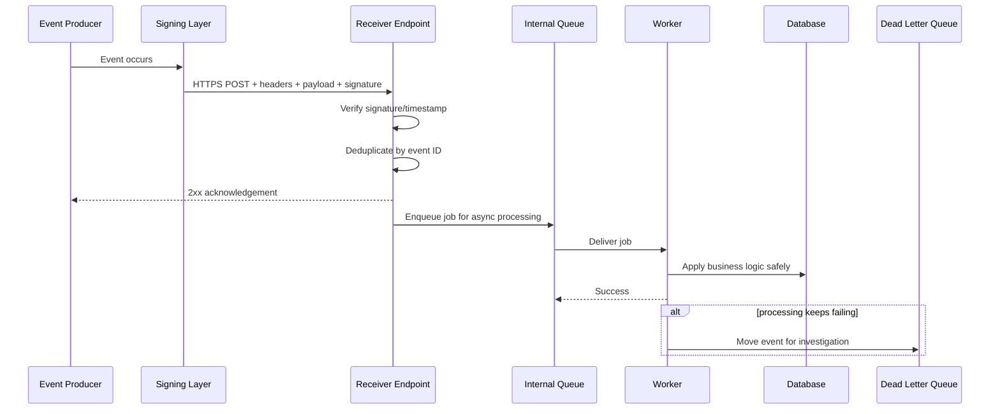
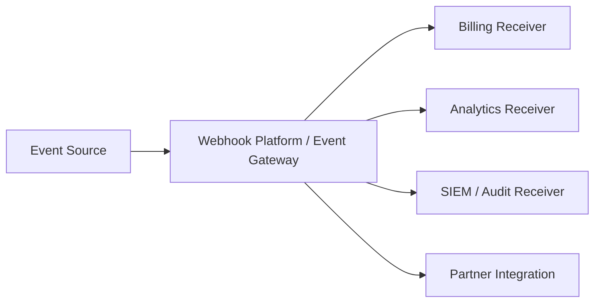
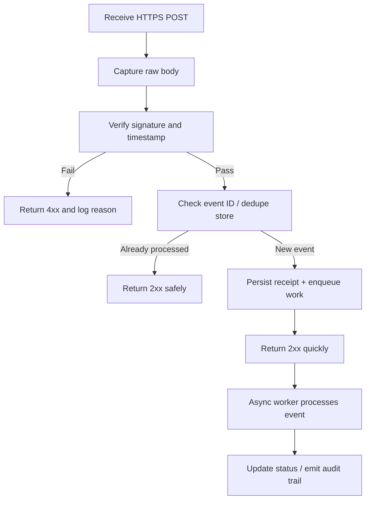

# Webhook Delivery Models

> **How webhook-based APIs deliver events, why duplicates happen, and how to test them safely in authorized environments.**

## 🧠 What Is It? (Beginner Explanation)

A **webhook** is an API delivery pattern where one system pushes an event to another system over HTTP when something happens.

Instead of asking an API every few seconds:

- “Did a payment succeed yet?”
- “Was a ticket updated?”
- “Did a user sign up?”

…the sender **calls your endpoint** as soon as the event occurs.

Think of it like this:

- **Polling** = repeatedly checking your mailbox
- **Webhook** = the mail carrier ringing your doorbell when mail arrives

For defenders and authorized API testers, webhooks matter because they sit at a **trust boundary**:

- an external platform sends data into an internal workflow
- the receiving app often triggers money movement, access changes, notifications, or provisioning
- delivery is **asynchronous**, so timing, retries, duplicates, and ordering all matter

That combination makes webhooks operationally useful and security-sensitive.

---

## Why Webhooks Exist

Webhooks are common when an API event happens **later** than the original request.

Examples:

- payment provider confirms a payment after fraud checks
- source control platform notifies CI/CD after a push
- identity provider reports a user lifecycle event
- SaaS platform notifies your app when data changes

A webhook is usually just an **HTTP POST** to a callback URL you registered earlier.

---

## 📊 Polling vs Webhooks vs Message Queues

| Pattern | How it works | Strengths | Trade-offs | Security testing focus |
|---|---|---|---|---|
| **Polling** | Client repeatedly asks for updates | Simple mental model, easy to retry | Wasteful, delayed, rate-limit heavy | Auth, rate limits, stale state handling |
| **Webhook push** | Provider sends HTTP request to your callback URL | Near real-time, efficient, simple for integrations | Duplicates, retries, ordering issues, trust boundary | Signature verification, replay defense, idempotency |
| **Queue / event bus** | Producer writes to broker; consumers pull | Reliable, buffered, scalable fan-out | More infrastructure, less browser-friendly | Access control, topic isolation, consumer auth |
| **Hybrid webhook + fetch** | Webhook announces change; consumer fetches full data via API | Smaller payloads, less sensitive data in webhook | More moving parts, second API dependency | Auth between systems, stale object fetch, TOCTOU logic |

**Important:** many mature platforms combine these patterns. A webhook might be only the **notification layer**, while the authoritative data comes from a follow-up API call.

---

## 🔄 Core Delivery Flow



**Defensive lesson:** a secure receiver usually **acknowledges quickly** and performs heavier business logic asynchronously. Stripe explicitly recommends returning a successful `2xx` before complex work that could time out.

---

## The Main Webhook Delivery Models

Webhook systems look similar on the surface, but their delivery models differ in ways that matter for design and testing.

### 1. Direct Push Model

The provider sends the full event directly to your endpoint.

```text
Producer → HTTPS POST → Consumer
```

**Common traits:**
- simplest model to understand
- low latency
- receiver depends on sender retries for resilience
- payload often includes enough data to act immediately

**Testing focus:**
- does the endpoint verify authenticity before acting?
- what status codes cause retries?
- can duplicates create duplicate side effects?

---

### 2. Push-Then-Process-Asynchronously Model

The provider still pushes directly, but the receiver only validates, persists, and queues the event before acknowledging.

```text
Producer → Receiver → Queue → Worker
```

**Why teams use it:**
- avoids provider timeouts
- isolates spikes in event volume
- reduces chance that slow downstream systems cause lost events

**Testing focus:**
- fast acknowledgement behavior
- queue durability
- whether a worker replay causes duplicate actions
- whether observability links the HTTP delivery to internal processing

---

### 3. Thin Event / Notification Model

The webhook only tells you **what changed**, not the full object. The receiver then fetches the latest object from the provider API.

```text
Producer → Webhook notice → Consumer
Consumer → Provider API → Full object fetch
```

**Why teams use it:**
- smaller payloads
- less sensitive data in transit
- avoids acting on stale embedded snapshots

**Risks and testing focus:**
- race conditions between event time and fetch time
- broken authorization on the follow-up API call
- object state drift if the consumer assumes the webhook payload is authoritative

---

### 4. Snapshot Event Model

The webhook includes a **full or near-full object snapshot**.

**Why teams use it:**
- less need for follow-up API calls
- simpler integrations
- faster local decision making

**Risks and testing focus:**
- trusting mutable fields in the snapshot without verification
- large payload parsing and schema validation
- downstream injection or business logic abuse if third-party data is treated as trusted

---

### 5. Fan-Out / Brokered Delivery Model

A platform, event gateway, or broker handles retries, filtering, transformation, and delivery to multiple destinations.



**Why teams use it:**
- centralized retry policies
- easier tenant management
- observability and replay tooling
- one producer, many consumers

**Testing focus:**
- tenant separation
- destination authentication
- replay permissions
- whether transformations change the signed content or validation assumptions

---

### 6. Verification / Handshake Model

Some providers require the receiver to prove ownership of the callback URL during registration.

Examples include:
- challenge-response flows
- echoing a token
- clicking a verification link
- verifying a shared secret during endpoint creation

**Testing focus:**
- does the registration flow prevent unauthorized endpoint ownership?
- can stale or reused verification tokens be abused?
- does the app validate the final callback URL before storing it?

---

### 7. Batch Delivery Model

Instead of one event per HTTP request, the provider sends a batch.

**Why teams use it:**
- higher throughput
- lower HTTP overhead
- better efficiency at large scale

**Testing focus:**
- partial failure handling
- per-event deduplication inside a batch
- maximum payload size limits
- whether one malformed item breaks all processing

---

## 📦 Delivery Semantics: What Guarantees Are Realistic?

This is where many developers and testers get confused.

### Common Semantics

| Semantic | Meaning | Practical reality for webhooks |
|---|---|---|
| **At-most-once** | Event is delivered zero or one time | Fewer duplicates, but more risk of silent loss |
| **At-least-once** | Event may be delivered more than once until acknowledged | Most realistic and most common model |
| **Effectively-once** | Duplicates may occur, but receiver logic makes repeated processing safe | The usual engineering goal |
| **Exactly-once** | Event is processed once and only once everywhere | Usually not realistic across internet-facing distributed systems |

### The Important Point

Public webhook systems are normally **at-least-once**. That means:

- duplicates are normal
- retry behavior is normal
- out-of-order arrivals are possible
- consumers must design for idempotency

Both Hookdeck and Postmark emphasize this: the receiver should assume duplicate deliveries can happen even when the first attempt appeared successful.

---

## Why Duplicates Happen Even When Everything “Looks Fine”

Distributed systems fail in messy ways:

- the receiver processes the event but responds too slowly
- the `200 OK` is sent but network confirmation is lost
- the sender cannot safely determine whether the receiver committed the work
- internal bookkeeping on the sender fails after transmission

That is why duplicate delivery is not a bug by itself. It is usually the cost of preferring **reliability over silent data loss**.

---

## 🧪 Practical Authorized Testing Mindset

When testing webhook systems, keep the work **defensive and authorized**:

- use staging or provider-supported test modes whenever possible
- coordinate with the system owner before replaying events
- avoid production side effects such as emails, billing actions, or account state changes
- prefer provider test tools, sandboxes, CLIs, and documented replay features
- treat callback URLs, secrets, and event data as sensitive

A webhook test is usually not about “can I hit the endpoint?” It is about:

1. **Can the receiver prove the sender is legitimate?**
2. **Can the receiver survive duplicates, delays, and reordering?**
3. **Can the sender recover safely from transient failures?**
4. **Can both sides explain what happened through logs and event IDs?**

---

## Anatomy of a Typical Webhook Request

```http
POST /webhooks/provider HTTP/1.1
Host: app.example.com
Content-Type: application/json
User-Agent: Provider-Webhook/1.0
X-Event-Id: evt_01JYEXAMPLE
X-Event-Type: invoice.paid
X-Timestamp: 1730999999
X-Signature: sha256=5f2d...redacted

{
  "id": "evt_01JYEXAMPLE",
  "type": "invoice.paid",
  "created": "2025-02-14T10:15:03Z",
  "data": {
    "invoice_id": "inv_12345",
    "customer_id": "cus_12345",
    "amount": 4999,
    "currency": "usd"
  }
}
```

Typical verification steps:

1. read the **raw body** exactly as received
2. extract timestamp and signature headers
3. compute the expected HMAC using the shared secret
4. compare in constant time
5. reject old timestamps outside the replay window
6. store or check the event ID to prevent duplicate processing
7. acknowledge quickly, then process asynchronously

### Why “raw body” matters

If the receiver parses JSON and then re-serializes it before verifying the signature, whitespace or key ordering changes can break validation.

---

## ✅ Secure Receiver Pattern



This pattern is common because it aligns with real-world webhook behavior:

- sender wants a fast HTTP acknowledgment
- receiver wants time for durable processing
- both sides need a stable event identity for troubleshooting

---

## Provider Responsibilities vs Consumer Responsibilities

| Area | Provider should do | Consumer should do |
|---|---|---|
| **Transport** | Use HTTPS, stable TLS, clear timeout behavior | Enforce HTTPS, validate certificates, terminate safely |
| **Authenticity** | Sign requests, document header format, support secret rotation | Verify signature on raw body, use constant-time compare |
| **Retries** | Retry transient failures with backoff and jitter | Return correct status codes, remain idempotent |
| **Identity** | Include stable event ID | Deduplicate by event ID or object/action key |
| **Ordering** | Document whether ordering is guaranteed | Never assume ordering unless explicitly guaranteed |
| **Observability** | Expose delivery logs or replay tools | Correlate event ID across logs, queue, worker, and DB |
| **Failure handling** | Support replay or DLQ visibility | Detect stuck events, alert on repeated failures |
| **Schema** | Version events and document changes | Validate schema and reject unsafe assumptions |

---

## Retry Behavior: What Good Systems Usually Do

Based on vendor documentation and webhook platform guidance, resilient systems usually have:

- **exponential backoff** between retries
- **jitter** to avoid many endpoints being retried at once
- a clear rule for which status codes trigger retries
- a maximum retry window or count
- a **dead letter queue** or failure log after repeated failure
- documentation that explains the schedule clearly

Svix explicitly highlights exponential backoff, jitter, dead-letter handling, and documentation clarity as core webhook retry practices.

---

## Common Status Code Expectations

| Receiver response | Typical sender interpretation |
|---|---|
| **2xx** | Delivery accepted; usually stop retrying |
| **4xx** | Permanent problem, though provider behavior varies |
| **5xx** | Temporary failure; often retry |
| **Timeout / network failure** | Unknown result; often retry |

**Important:** behavior is provider-specific. In an authorized assessment, verify what the target platform actually documents and implements.

---

## Idempotency: The Core Defensive Requirement

If webhooks are at-least-once, the consumer must make repeated delivery safe.

### Common Idempotency Strategies

| Strategy | How it works | Good for | Caveats |
|---|---|---|---|
| **Store processed event IDs** | Keep a unique record for each webhook event | Generic deduplication | Needs durable storage and expiry policy |
| **Use domain object uniqueness** | Enforce unique business identifiers | Orders, invoices, tickets | Only works when the business key is stable |
| **Transactional processing** | Record dedupe state and side effects atomically | Financial or high-integrity flows | More complex implementation |
| **Queue + worker status tracking** | Mark event as processing/completed/failed | Async architectures | Must handle crash recovery correctly |

Hookdeck and Postmark both stress that the correct response to a duplicate event is often still a **successful 2xx**, because the desired state may already exist.

---

## Ordering: Another Place Systems Break

Many receivers incorrectly assume events arrive in the order they occurred.

That assumption breaks when:

- retries interleave with fresh deliveries
- multiple workers process events concurrently
- network latency differs by route
- batch splitting or broker fan-out changes arrival order

### Safe Design Pattern

Prefer logic like:

- “apply this event if it is newer than the current version”
- “fetch current authoritative state before irreversible action”
- “ignore stale state transitions”

…instead of:

- “the next webhook must always be the next business step”

---

## Thin Events, Snapshot Events, and CloudEvents

### Thin vs Snapshot

| Model | Description | Benefit | Risk |
|---|---|---|---|
| **Thin event** | Small event saying what changed | Minimal payload, less exposure | Requires extra fetch and careful auth/state handling |
| **Snapshot event** | Full object included in payload | Faster local processing | More trust in third-party data and schema stability |

### CloudEvents

CloudEvents is a CNCF specification for describing events in a common way. It helps standardize fields such as:

- `id`
- `source`
- `type`
- `specversion`
- `time`

That consistency helps with routing, tooling, tracing, and cross-platform event handling.

Example CloudEvents-style JSON:

```json
{
  "specversion": "1.0",
  "id": "evt_01JYEXAMPLE",
  "source": "https://api.vendor.example/events",
  "type": "invoice.paid",
  "time": "2025-02-14T10:15:03Z",
  "subject": "invoice/inv_12345",
  "data": {
    "invoice_id": "inv_12345",
    "amount": 4999,
    "currency": "usd"
  }
}
```

For testers, standardized event envelopes make it easier to reason about:

- replay detection
- logging consistency
- cross-system correlation
- schema validation

---

## 🔍 Authorized Webhook Test Matrix

Use this matrix for defensive testing in approved environments.

| Test area | Safe test idea | Secure behavior you want |
|---|---|---|
| **Signature validation** | Send provider-supported test events and verify unsigned or wrongly signed requests are rejected | Receiver rejects unauthenticated requests before business logic |
| **Timestamp / replay window** | Re-send an old captured test event in staging if policy permits | Receiver rejects stale requests outside allowed tolerance |
| **Idempotency** | Replay the same test event ID through approved tooling | No duplicate orders, emails, credits, or state changes |
| **Retry handling** | Temporarily return controlled `5xx` or simulate timeout in staging | Provider retries according to documented policy |
| **Ordering assumptions** | Deliver two related test events out of order in staging | Receiver handles state safely and avoids stale transitions |
| **Queue durability** | Stop a worker after acknowledgement in staging | Event remains recoverable and is not lost silently |
| **Secret rotation** | Test old/new secrets during a planned rotation window | Receiver supports documented rotation model without false accepts |
| **Schema validation** | Send provider-generated test events for older/newer schemas | Receiver fails safely and logs parse issues without unsafe fallback |
| **Endpoint registration** | Register and verify callback URLs through the normal workflow | Ownership checks and URL validation prevent unsafe destinations |
| **Observability** | Trace one event ID across ingress, queue, worker, and DB | Full auditability from delivery to final outcome |

---

## Safe Practical Workflow for an Authorized Assessment

### 1. Read the Provider Documentation First

Before sending anything:

- identify how the provider signs requests
- identify retry-triggering status codes
- identify timestamp tolerance or replay windows
- identify whether event ordering is guaranteed
- identify whether test/replay tooling exists

### 2. Use Test Modes and Staging Endpoints

For example, Stripe documents local forwarding and test event generation through the Stripe CLI.

```bash
stripe listen --forward-to localhost:4242/webhook
stripe trigger payment_intent.succeeded
```

This is a strong defensive workflow because it validates:

- local receiver correctness
- signature handling
- event parsing
- asynchronous processing behavior

…without touching live customer events.

### 3. Observe Before You Change Anything

Capture:

- raw headers
- raw body
- event ID
- signature outcome
- processing latency
- downstream side effects

### 4. Test Negative Cases Safely

Good negative tests include:

- invalid signature
- expired timestamp
- duplicate delivery
- slow processing / timeout
- dependency outage after acknowledgement

Do these in **authorized staging** so you do not trigger real billing, messaging, or provisioning actions.

---

## Outbound Webhooks: Do Not Forget the Sender Side

Many products are not only **receiving** webhooks — they also let customers **register callback URLs** so the product can send webhooks outward.

That introduces another security surface.

### Defensive questions for outbound webhook features

| Question | Why it matters |
|---|---|
| Can users register arbitrary callback URLs? | URL registration can create trust and SSRF-like risks if not controlled |
| Are private or internal destinations blocked? | Prevents delivery to internal-only resources |
| Are secrets unique per destination? | Limits blast radius if one secret leaks |
| Can secrets be rotated safely? | Reduces long-term key exposure |
| Are retries bounded? | Prevents accidental delivery storms |
| Are failed deliveries visible? | Needed for support and incident response |
| Is replay controlled and audited? | Prevents unauthorized or accidental repeated side effects |

When assessing outbound webhook features, stay within the authorized scope and avoid testing internal destinations unless the owner explicitly approved that scenario.

---

## Common Design Mistakes

| Mistake | Why it is dangerous | Better pattern |
|---|---|---|
| Trusting webhook source IP alone | IP ranges change and can be spoofed indirectly in some architectures | Use cryptographic signatures, IP controls only as a supplement |
| Parsing JSON before signature verification | Body transformation can break validation or hide tampering | Verify on the raw body first |
| Doing heavy work before responding | Causes timeouts and unnecessary retries | Acknowledge quickly, then queue work |
| Assuming exactly-once delivery | Leads to duplicate side effects | Design for at-least-once plus idempotency |
| Assuming in-order delivery | Causes stale state bugs | Make logic version-aware or fetch latest state |
| No event correlation ID in logs | Makes incident response difficult | Log stable event IDs end-to-end |
| Shared secrets across many tenants | Increases impact of compromise | Use per-endpoint or per-tenant secrets |
| No replay tooling controls | Makes recovery and abuse harder to manage | Audit and authorize replay actions |

---

## 🛡️ Defensive Checklist

```text
[ ] Endpoint uses HTTPS and is documented
[ ] Request signatures are verified on the raw body
[ ] Timestamp tolerance / replay window is enforced
[ ] Event IDs are stored for deduplication
[ ] Receiver returns 2xx quickly after minimal safe checks
[ ] Heavy processing happens asynchronously
[ ] Duplicate deliveries do not create duplicate side effects
[ ] Ordering assumptions are documented and tested
[ ] Retry schedule is documented and observable
[ ] Failed deliveries can be investigated or replayed safely
[ ] Secrets can be rotated without downtime
[ ] Logs correlate event receipt, processing, and outcome
```

---

## Key Takeaways

1. **Most real webhook systems are at-least-once, not exactly-once.**
2. **Idempotency is mandatory**, not optional.
3. **Fast acknowledgement + async processing** is usually the safest receiver design.
4. **Signature verification, timestamp checks, and replay defense** protect the trust boundary.
5. **Ordering is often weaker than developers assume.**
6. **Authorized testing should focus on resilience and authenticity**, not just request delivery.

---

## Sources Consulted

- Stripe Docs — Webhooks: endpoint behavior, quick `2xx`, signature verification, CLI testing
- Svix — webhook retry best practices: exponential backoff, jitter, DLQ, documentation
- Hookdeck — webhook idempotency strategies and duplicate handling
- Postmark — why at-least-once delivery leads to duplicate webhooks and why idempotency matters
- CloudEvents (CNCF) — standardized event envelope concepts and interoperability
