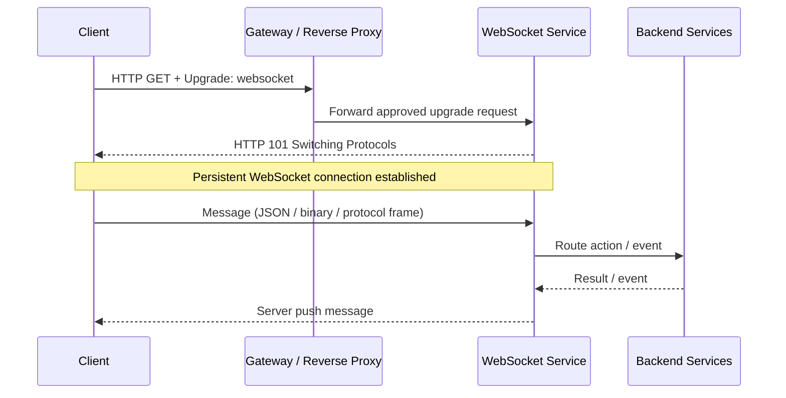
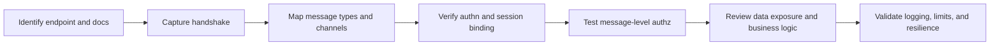
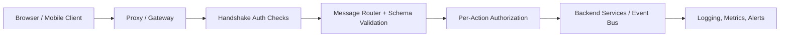

# 🔌 WebSocket APIs

> **Difficulty:** Beginner → Advanced | **Category:** API Pentesting — API Protocols  
> **Focus:** Authorized security testing of real-time, bidirectional APIs that communicate over WebSocket.

WebSocket APIs matter because they often carry **live state, sensitive events, and privileged actions** after a single HTTP upgrade. For an authorized tester, that changes the job: instead of testing isolated requests, you test a **long-lived session plus every message flowing through it**.

---

## Table of Contents

1. [What a WebSocket API Is](#1-what-a-websocket-api-is)
2. [Why WebSocket APIs Matter in API Security](#2-why-websocket-apis-matter-in-api-security)
3. [How the Protocol Works](#3-how-the-protocol-works)
4. [What You Actually Test](#4-what-you-actually-test)
5. [Authorized Testing Workflow](#5-authorized-testing-workflow)
6. [Common Security Failure Patterns](#6-common-security-failure-patterns)
7. [Practical Tools and Safe Testing Examples](#7-practical-tools-and-safe-testing-examples)
8. [Advanced Protocol and Architecture Considerations](#8-advanced-protocol-and-architecture-considerations)
9. [Detection and Hardening Guidance](#9-detection-and-hardening-guidance)
10. [Key Takeaways](#10-key-takeaways)
11. [References](#11-references)

---

## 1. What a WebSocket API Is

A **WebSocket API** is an API that begins with an HTTP request, then upgrades into a persistent two-way channel where the client and server can both send messages whenever they need to.

### Beginner mental model

A REST API is like mailing letters:
- client sends request
- server sends response
- conversation ends

A WebSocket API is more like opening a phone call:
- one side opens the connection
- both sides can speak
- the call stays open until someone hangs up

That design is perfect for:
- chat and collaboration features
- live dashboards and notifications
- trading and market feeds
- multiplayer games
- operational control panels
- device and event streaming

---

## 2. Why WebSocket APIs Matter in API Security

WebSocket APIs are not "just another transport." They change how trust, authorization, and monitoring work.

### Why they matter to authorized API testing

| Characteristic | Security impact |
|---|---|
| Long-lived connections | Access may continue long after the initial handshake unless session state is revalidated |
| Bidirectional messaging | Sensitive data can flow server → client without a new HTTP request |
| Message-based actions | Authorization bugs can hide inside message handlers instead of URL routes |
| Browser support with cookies | Cross-site handshake risks appear if `Origin` and session controls are weak |
| Real-time business flows | Abuse can target live operations, subscriptions, notifications, and workflow events |
| Limited visibility in some stacks | Traditional HTTP logging may capture the upgrade but miss later messages |

### WebSocket vs other API styles

| API style | Communication model | Typical strength | Typical security blind spot |
|---|---|---|---|
| REST | Request/response | Clear resource modeling, mature tooling | Teams assume every action is visible in HTTP routes |
| GraphQL | Structured query/mutation API | Flexible data access | Schema depth and object/property authorization |
| gRPC streaming | Binary RPC, often service-to-service | Strong contracts, efficient transport | Internal trust assumptions, weak edge visibility |
| SSE | Server → client events only | Simpler than full duplex | Still easy to leak sensitive events |
| **WebSocket** | Full duplex persistent channel | Low-latency real-time workflows | Handshake-only logging, message-level auth gaps, session longevity |

### Important defensive framing

In authorized testing, the goal is not to "break chat" or "spam events." The goal is to determine:
- whether the connection is authenticated safely
- whether each message type is authorized correctly
- whether sensitive events are exposed too broadly
- whether real-time flows can be abused in ways the organization did not intend

---

## 3. How the Protocol Works

### High-level lifecycle



### The opening handshake

A browser or client starts with an HTTP request similar to this:

```http
GET /ws/notifications HTTP/1.1
Host: api.example.test
Upgrade: websocket
Connection: Upgrade
Sec-WebSocket-Key: <random-base64>
Sec-WebSocket-Version: 13
Origin: https://app.example.test
Cookie: session=<authorized-session>
Sec-WebSocket-Protocol: json-stream
Sec-WebSocket-Extensions: permessage-deflate
```

If the server accepts the upgrade, it replies with:

```http
HTTP/1.1 101 Switching Protocols
Upgrade: websocket
Connection: Upgrade
Sec-WebSocket-Accept: <derived-from-client-key>
Sec-WebSocket-Protocol: json-stream
```

### Handshake fields that matter to testers

| Header / field | Why it matters |
|---|---|
| `Upgrade: websocket` + `Connection: Upgrade` | Required for the HTTP/1.1 upgrade path |
| `Sec-WebSocket-Key` / `Sec-WebSocket-Accept` | Confirms both sides are intentionally switching protocols |
| `Origin` | Critical for browser-based cross-site protection decisions |
| `Cookie` or auth header | Often determines the user identity bound to the socket |
| `Sec-WebSocket-Protocol` | Negotiates the application subprotocol; often overlooked in access-control logic |
| `Sec-WebSocket-Extensions` | Compression and other extensions can create security and observability implications |

### Key protocol facts to remember

- RFC 6455 is the core WebSocket standard.
- Browser clients normally use an **origin-based security model**.
- After the upgrade, the application is no longer in ordinary HTTP request/response mode.
- Many defenses that are strong for REST endpoints become weaker if the team does not inspect **messages** as carefully as URLs.

---

## 4. What You Actually Test

Once the handshake succeeds, the real API surface is usually inside the **messages**, not the URL.

### Think in layers

| Layer | Example | What the tester cares about |
|---|---|---|
| Transport | `ws://` vs `wss://`, TLS, proxy behavior | Confidentiality, integrity, downgrade and interception risks |
| Handshake | Upgrade request, cookies, origin, subprotocol | Authentication binding, CSWSH exposure, infrastructure policy |
| Framing | Text, binary, fragmentation, ping/pong, close codes | Parser behavior, size handling, state transitions |
| Message schema | JSON fields, protobuf objects, event names | Validation, type handling, field trust, unsafe deserialization |
| Business action | `subscribe`, `updateProfile`, `approveOrder` | Message-level authorization and workflow abuse |
| Monitoring | Audit logs, tracing, metrics | Whether defenders can reconstruct what happened after connection establishment |

### Frame-level basics

Most API testers do not need to memorize every bit, but they should understand the shape:

```text
Client/Server Message
    └─ WebSocket frame(s)
         ├─ opcode (text, binary, close, ping, pong)
         ├─ payload length
         ├─ masking rules
         ├─ optional fragmentation
         └─ payload bytes
```

### Common opcodes

| Opcode | Meaning | Security relevance |
|---|---|---|
| `0x1` | Text frame | Often carries JSON API messages |
| `0x2` | Binary frame | Common with protobuf, MessagePack, custom protocols |
| `0x8` | Close | Useful for state handling and error analysis |
| `0x9` | Ping | Liveness and timeout behavior |
| `0xA` | Pong | Response to ping; useful in keepalive design |

### Important application-level point

A WebSocket endpoint such as `/ws` often tells you very little. The real surface may be:
- action names
- event names
- channel names
- subscription filters
- object IDs
- role-specific commands
- binary message types

That is why **inventory and schema understanding** matter so much. In WebSocket environments, AsyncAPI or internal event documentation may be more useful than OpenAPI alone.

---

## 5. Authorized Testing Workflow

This is the safe, practical workflow for a scoped engagement.



### Step-by-step mindset

| Phase | What to do | Questions to answer | Safe evidence to collect |
|---|---|---|---|
| Inventory | Find endpoints, docs, subprotocols, clients, mobile usage, AsyncAPI docs | Where are WebSockets used? Which messages exist? | Endpoint list, sample handshake, message catalog |
| Handshake review | Inspect cookies, headers, origin handling, TLS, proxy behavior | How is identity bound to the socket? | Redacted handshake capture |
| Authentication review | Test approved accounts, roles, and token/session states | Can unauthenticated or expired sessions still connect? | Access matrix by role/state |
| Authorization review | Compare what each role can send, subscribe to, or receive | Are actions and objects checked per message? | Message/action authorization table |
| Input validation | Review message schemas, parser behavior, size limits | Are malformed, oversized, or unexpected types handled safely? | Validation outcomes and close/error codes |
| Business logic | Observe channel subscriptions and state transitions | Can users access events or actions outside their workflow? | Screen captures, redacted events, workflow notes |
| Resilience & telemetry | Review rate limits, connection limits, heartbeat, logs | Can defenders detect and contain abuse? | Limit behavior, logging examples, monitoring gaps |

### Good authorized-testing habits

- Use a **staging or scope-approved tenant** where message replay and malformed test cases are allowed.
- Prefer **test accounts for each role** instead of modifying production data.
- Keep captures **redacted** because WebSocket streams often include more live data than a single HTTP response.
- Record both **handshake context** and **message context**; findings often depend on both.

---

## 6. Common Security Failure Patterns

### Quick mapping to API risk themes

| Failure pattern | Why it happens | API impact |
|---|---|---|
| Cross-Site WebSocket Hijacking (CSWSH) | Browser sends cookies during handshake and server trusts weak origin checks | Broken authentication / session abuse |
| Missing message-level authorization | Team authenticates the socket once, then trusts every action on it | BOLA, BFLA, property-level abuse |
| Sensitive event overexposure | Broad subscriptions or verbose event payloads | Data leakage and privacy exposure |
| Parser / validation flaws | Teams treat messages as "internal" after connection | Injection, unsafe deserialization, business logic abuse |
| Connection and message exhaustion | Persistent channels consume memory, CPU, and backend fan-out capacity | Unrestricted resource consumption |
| Inventory and observability gaps | Upgrade is documented, but message schemas and telemetry are not | Improper inventory management, slower response |

### 6.1 Cross-Site WebSocket Hijacking (CSWSH)

CSWSH is one of the most important WebSocket-specific risks. If the application relies on browser cookies and does not validate `Origin` strictly, a malicious site can sometimes cause the victim's browser to open an authenticated WebSocket to the target application.

**Authorized testing focus:**
- Does the server enforce a strict origin allowlist?
- Are cookies marked with appropriate `SameSite` settings where the design allows it?
- Is a CSRF-style token or equivalent handshake control required for browser-initiated sockets?
- Are non-browser clients handled separately rather than weakening browser protections?

**Safe validation idea:**
Use a lab or scope-approved alternate origin and verify whether the handshake is rejected with invalid `Origin` values. Do not build real user-targeting pages or attempt unapproved cross-site abuse.

### 6.2 Weak connection authentication and stale sessions

A common design flaw is assuming that once a socket is open, it stays trustworthy forever.

Questions to test:
- What happens when the underlying session expires?
- Does logout close active sockets promptly?
- Are revoked or rotated tokens still accepted on long-lived connections?
- Are multiple devices and role changes reflected quickly?

**Defensive lesson:** WebSocket security must track **identity lifecycle**, not only initial login state.

### 6.3 Missing message-level authorization

This is where WebSocket APIs often mirror classic API authorization failures.

Examples of risky assumptions:
- "If the user reached `/ws`, they can call any action on that socket."
- "If the user is subscribed to a workspace, they can see every object in it."
- "If the client sends an object ID, it must belong to them."

**What to verify:**
- action-level authorization
- object-level authorization
- property-level filtering in responses and events
- role-based channel subscriptions
- server-side enforcement instead of UI-only gating

### 6.4 Input handling and parser issues

WebSocket messages are still untrusted input.

Review for:
- JSON schema validation
- binary parser robustness
- safe protobuf / MessagePack decoding
- size limits and nesting limits
- unexpected field rejection vs silent acceptance
- safe handling of malformed fragmented messages

The protocol may be real-time, but the defensive rule is unchanged: **parse strictly, validate early, reject safely**.

### 6.5 Sensitive data exposure in events and subscriptions

Because servers can push data automatically, it is easy to leak too much.

Common patterns:
- verbose profile objects broadcast to too many listeners
- admin-only event fields delivered to standard users
- channel names that allow guessing or broad wildcard subscription
- internal metadata leaking through debug or status events

### 6.6 Resource exhaustion and monitoring gaps

WebSocket APIs are excellent at moving data continuously, which also makes them good at consuming resources continuously.

Check for:
- connection limits per user / IP / tenant
- message rate limits
- subscription fan-out protections
- server behavior on very large payloads
- heartbeat and idle timeout strategy
- whether the SOC can see more than the initial `101` upgrade

---

## 7. Practical Tools and Safe Testing Examples

Use tools only against systems you are explicitly authorized to assess.

### Useful tools

| Tool | Why it helps |
|---|---|
| Browser DevTools | Observe native browser WebSocket traffic, frames, and timing |
| Burp Suite | Intercept handshake traffic and replay or edit messages in an authorized test flow |
| `wscat` | Quick manual interaction with text-based WebSocket endpoints |
| `websocat` | Flexible scripting, header testing, and piping for labs |
| AsyncAPI docs / internal event catalogs | Understand message schemas and channel purpose |
| Application logs and traces | Confirm what the server believed happened |

### Safe command examples

#### Connect to an approved lab endpoint with `wscat`

```bash
wscat -c 'wss://api.example.test/ws/notifications'
```

#### Connect with a specific `Origin` header in a scoped environment using `websocat`

```bash
websocat -H='Origin: https://app.example.test' \
  'wss://api.example.test/ws/notifications'
```

#### Send a benign test message

```json
{"action":"ping"}
```

#### Subscribe to a non-sensitive status stream in a test tenant

```json
{"action":"subscribe","channel":"system-status"}
```

### What to look for while testing

| Observation | Why it matters |
|---|---|
| Handshake succeeds without expected auth context | Possible authentication bypass or misbinding |
| Socket stays alive after logout or revocation | Session lifecycle weakness |
| Different roles receive identical events | Likely authorization or filtering issue |
| Oversized messages trigger unstable behavior | Input handling or resource controls may be weak |
| Security tools only log the handshake | Message-level blind spot for defenders |

---

## 8. Advanced Protocol and Architecture Considerations

### 8.1 Subprotocols are part of the attack surface

Many "WebSocket APIs" are really **application protocols over WebSocket**.

Examples include:
- custom JSON action/event formats
- STOMP over WebSocket
- GraphQL subscriptions
- Socket.IO-style message layers
- binary protocols using protobuf or MessagePack

A tester should verify whether access control is enforced in the **application subprotocol**, not just at the raw socket layer.

### 8.2 Compression can create risk

`permessage-deflate` improves performance, but compression can also create side-channel and visibility concerns. If secrets and attacker-influenced data share compressed contexts, review the design carefully.

### 8.3 HTTP/2 WebSockets exist

RFC 8441 defines bootstrapping WebSockets over HTTP/2 using extended `CONNECT`. Advanced environments may use this behind modern proxies or gateways. That means testers should not assume every WebSocket deployment follows only the classic HTTP/1.1 `101 Switching Protocols` pattern.

### 8.4 Infrastructure matters as much as code

| Layer | What can go wrong |
|---|---|
| CDN / reverse proxy | Upgrade headers mishandled, idle timeouts too short, incomplete inspection |
| API gateway | Strong REST controls but weak WebSocket message inspection |
| Load balancer | Session affinity and stickiness assumptions break authorization or revocation behavior |
| Service mesh / backend | Internal services trust upstream identity without re-checking message actions |
| Observability pipeline | Traces end at handshake, leaving message actions invisible |

### 8.5 Documentation quality is a security control

OpenAPI usually documents the handshake-adjacent HTTP layer better than the message stream. AsyncAPI and internal event catalogs help defenders and testers answer:
- what messages exist
- what schemas are expected
- who may publish or subscribe
- which events contain sensitive fields

If that documentation does not exist, the organization often has an **inventory problem**, not just a documentation problem.

---

## 9. Detection and Hardening Guidance

### Defensive architecture mental model



### Hardening priorities

1. **Use `wss://` in production** with modern TLS.
2. **Validate `Origin` strictly** for browser-based connections.
3. **Require strong authentication** and bind identity clearly to the socket.
4. **Re-check authorization per message**, not just once per connection.
5. **Expire or revoke sockets** when sessions, tokens, or roles change.
6. **Validate message schemas** and enforce tight size/rate limits.
7. **Review channel and subscription design** for overbroad data exposure.
8. **Log meaningful message actions** with tenant, user, channel, and outcome context.
9. **Document message types and roles** with AsyncAPI or equivalent.
10. **Test infrastructure behavior** at the proxy, gateway, and backend layers.

### Handy review checklist

- [ ] Only trusted origins can open browser-based authenticated sockets
- [ ] Session expiry, logout, and token revocation close or invalidate active sockets
- [ ] Every action/event subscription is authorized server-side
- [ ] Sensitive fields are filtered per role and object ownership
- [ ] Binary and text payloads have schema, size, and type validation
- [ ] Connection counts, rate limits, and heartbeat timeouts are enforced
- [ ] Message traffic is observable enough for incident response
- [ ] WebSocket APIs are included in API inventory and version management

---

## 10. Key Takeaways

If you remember only a few things, remember these:

1. **A WebSocket API is not just an HTTP endpoint.** The real surface is the long-lived message channel after the upgrade.
2. **Authentication at connection time is not enough.** Authorization must be enforced per action, object, field, and subscription.
3. **Browser-based WebSockets need origin-aware defenses.** Cookies plus weak `Origin` checks can create serious session abuse risks.
4. **Real-time systems leak through events as easily as through responses.** Subscription design and event filtering matter.
5. **Visibility is part of security.** If defenders only see the handshake, they may miss the attack.

---

## 11. References

- [RFC 6455 — The WebSocket Protocol](https://datatracker.ietf.org/doc/html/rfc6455)
- [RFC 8441 — Bootstrapping WebSockets with HTTP/2](https://www.rfc-editor.org/rfc/rfc8441.html)
- [OWASP WebSocket Security Cheat Sheet](https://cheatsheetseries.owasp.org/cheatsheets/WebSocket_Security_Cheat_Sheet.html)
- [OWASP API Security Top 10 (2023)](https://owasp.org/API-Security/editions/2023/en/0x11-t10/)
- [MDN WebSockets API](https://developer.mozilla.org/en-US/docs/Web/API/WebSockets_API)
- [MDN — Writing WebSocket Servers](https://developer.mozilla.org/en-US/docs/Web/API/WebSockets_API/Writing_WebSocket_servers)
- [PortSwigger Web Security Academy — WebSockets](https://portswigger.net/web-security/websockets)
- [AsyncAPI — Why use AsyncAPI with WebSocket](https://www.asyncapi.com/blog/websocket-part1)
- [GitHub Advisory Database — CVE-2023-0957 / Gitpod CSWSH context](https://github.com/advisories/GHSA-f53g-frr2-jhpf)
