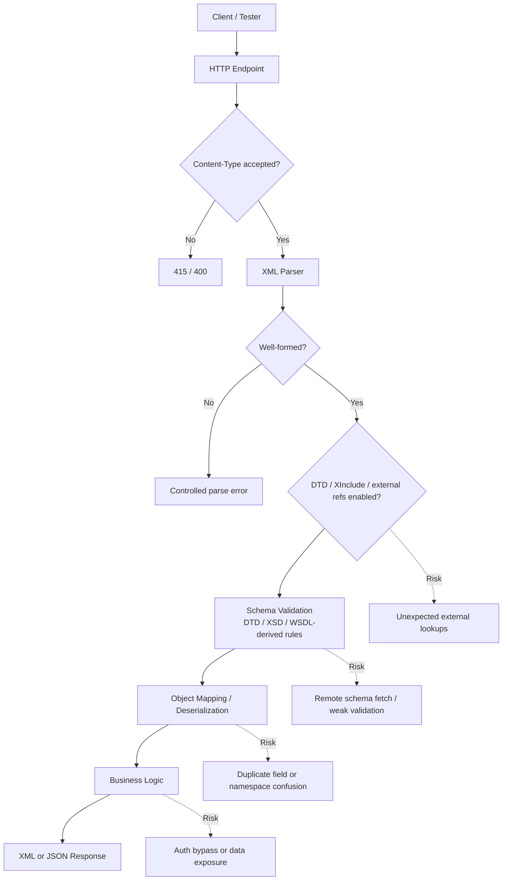

# XML Format in APIs

> **XML is a structured text format still used by SOAP, SAML, legacy REST endpoints, webhooks, and enterprise integrations; if you understand its syntax, namespaces, schemas, and parser behavior, you can test XML-based APIs safely and effectively.**

> **Module:** API Pentesting → API Protocols  
> **Difficulty:** Beginner → Advanced  
> **Tags:** `#xml` `#soap` `#xsd` `#wsdl` `#content-type` `#xxe` `#defensive-testing`

---

## 🧠 What Is It? (Beginner Explanation)

**XML (Extensible Markup Language)** is a way to represent data using nested tags.

If JSON looks like a lightweight shipping label:

```json
{ "userId": 42, "role": "analyst" }
```

XML looks like a document with labeled sections:

```xml
<user>
  <userId>42</userId>
  <role>analyst</role>
</user>
```

Why do API testers still care about XML?

- **SOAP APIs** are XML-native
- **Older REST endpoints** may accept `application/xml`
- **Identity and enterprise protocols** like **SAML** depend heavily on XML
- **Message buses, ESBs, and B2B integrations** often validate XML with schemas
- Some file formats and upload workflows hide XML internally

For defenders and authorized testers, XML matters because the parser is part of the attack surface. The security story is not just about the endpoint itself — it is also about:

- how XML is parsed
- whether **DTDs**, **external entities**, or **XInclude** are enabled
- whether the service trusts **remote schemas**
- how the app handles **namespaces**, **duplicate elements**, and **type validation**

**Analogy:** XML is like a warehouse manifest with labeled boxes inside bigger boxes. If the receiving system trusts every label without strict rules, the parser can be tricked before business logic even starts.

---

## 🏗️ How It Works (Technical Deep Dive)

At a high level, an XML API request moves through several layers:

**Step 1: The client serializes data into XML**

The client sends a structured document rather than JSON form fields.

**Step 2: The HTTP layer identifies the format**

Common media types include:

- `application/xml`
- `text/xml`
- `application/soap+xml`
- vendor-specific `application/*+xml`

**Step 3: An XML parser checks well-formedness**

Before the application can use the data, the parser checks whether the XML is structurally valid enough to read:

- tags open and close correctly
- attributes are quoted
- nesting is valid
- the document encoding is understood

If the document is not **well-formed**, parsing should stop with a controlled client error.

**Step 4: Optional validation happens**

Depending on the stack, the service may validate against:

- **DTD** — older grammar format
- **XSD (XML Schema Definition)** — richer type and structure rules
- **WSDL** — SOAP contract that often references XSDs

**Step 5: The application maps XML into objects**

The parsed tree may be converted into language objects, DTOs, ORM models, or internal messages.

**Step 6: Business logic processes the request**

Only after parsing and validation does the application usually enforce authorization, business rules, rate limits, and storage operations.

That ordering matters: many XML risks happen **before** the application reaches its normal security controls.

---

## 📊 Diagram — XML API Processing Flow



---

## ⚙️ Technical Details

### XML Building Blocks for API Testers

| Component | What It Does | Why It Matters in API Testing |
|---|---|---|
| **Prolog** | Declares XML version and optional encoding | Encoding mismatches can cause parser errors or inconsistent behavior |
| **Element** | Main tagged data unit | Repeated or unexpected elements often reveal mapping bugs |
| **Attribute** | Metadata attached to an element | Apps sometimes validate elements but forget attributes |
| **Namespace** | Disambiguates names with URIs | Critical in SOAP, SAML, and mixed-vocabulary XML |
| **Entity** | Reusable reference defined in markup | Dangerous if external resolution is enabled |
| **CDATA** | Raw text block | Useful for safely carrying markup-like text |
| **DTD** | Document grammar format | Legacy feature frequently tied to XXE risk |
| **XSD** | Typed schema validation | Great for contract testing, but remote fetching or lax validation can be risky |

### Well-Formed Baseline Request

```xml
<?xml version="1.0" encoding="UTF-8"?>
<CreateOrderRequest xmlns="https://api.example.com/order/v1"
                    xmlns:com="https://api.example.com/common/v1">
  <com:requestId>lab-001</com:requestId>
  <customerId>1001</customerId>
  <items>
    <item sku="BK-100" quantity="1"/>
  </items>
</CreateOrderRequest>
```

Things to notice:

- the XML declaration includes encoding
- there is a **default namespace**
- `com:` is just a prefix; the real identity is the namespace URI
- structure is hierarchical and typed only if the server applies a schema

### Namespaces — Why Prefixes Matter

W3C's Namespaces in XML defines a namespace as a URI-backed naming mechanism used to avoid collisions between vocabularies. In practice:

- `soapenv:Body` and `app:Body` can have the same local name but different meanings
- prefixes are **not** the security boundary
- the **namespace URI + local name** is what parsers and validators care about

```xml
<root xmlns:acct="https://api.example.com/account/v1"
      xmlns:bill="https://api.example.com/billing/v1">
  <acct:id>1001</acct:id>
  <bill:id>INV-9001</bill:id>
</root>
```

As a tester, always ask:

- Does the server enforce the expected namespace URI?
- Does it ignore prefixes and just match local names?
- Does XML-to-object mapping collapse different elements into one internal field?

### XML Media Types You Will See in APIs

| Media Type | Typical Use | Testing Note |
|---|---|---|
| `application/xml` | General XML payloads | Common for custom XML REST-style APIs |
| `text/xml` | Older XML endpoints | RFC 7303 treats this as an alias pattern with historical baggage |
| `application/soap+xml` | SOAP 1.2 | Often paired with SOAP envelopes and action metadata |
| `application/*+xml` | Vendor-specific XML | Good clue that XML parsing exists even if docs hide it |
| `application/xml-dtd` | DTD documents | Rare on public APIs, but relevant in integrations |

### XML vs JSON for API Security Work

| Topic | XML | JSON |
|---|---|---|
| Structure | Tag-based tree | Key-value objects/arrays |
| Namespacing | Built in | Usually application-defined only |
| Schema ecosystem | DTD, XSD, WSDL | JSON Schema / OpenAPI |
| Typical enterprise use | SOAP, SAML, B2B, middleware | Modern REST and GraphQL wrappers |
| Parser risk profile | Entities, DTD, XInclude, canonicalization issues | Prototype pollution, type confusion, parser differentials |
| Signature-heavy workflows | Common | Less common |
| Verbosity | High | Lower |

### SOAP-Specific XML Shape

SOAP 1.2 defines an XML messaging framework with an **Envelope**, optional **Header**, and **Body**.

```xml
<?xml version="1.0" encoding="UTF-8"?>
<soapenv:Envelope xmlns:soapenv="http://www.w3.org/2003/05/soap-envelope"
                  xmlns:usr="https://api.example.com/user/v1">
  <soapenv:Header/>
  <soapenv:Body>
    <usr:GetUserRequest>
      <usr:userId>1001</usr:userId>
    </usr:GetUserRequest>
  </soapenv:Body>
</soapenv:Envelope>
```

SOAP adds useful testing questions:

- Is the **WSDL** exposed?
- Are all operations authenticated?
- Are SOAP faults overly verbose?
- Does the service enforce headers like `mustUnderstand` correctly?
- Are signature or canonicalization assumptions consistent end-to-end?

### DTD vs XSD vs WSDL

| Artifact | Purpose | Defensive Testing Relevance |
|---|---|---|
| **DTD** | Old grammar for allowable XML structure | High-risk legacy feature; disable if not needed |
| **XSD** | Stronger schema with types, sequences, constraints | Excellent for contract testing; pin locally and validate strictly |
| **WSDL** | SOAP service contract describing operations and types | Valuable recon source in authorized tests; often references XSD |

---

## 🔴 Attack Surface

XML itself is not insecure. The risk comes from **parser features**, **contract handling**, and **application assumptions** around XML data.

### High-Value XML Risk Areas

| Risk Area | Why It Happens | Safe Authorized Validation Goal | Secure Behavior |
|---|---|---|---|
| **DTD / external entity processing** | Legacy parser settings allow external references | Confirm DTDs are disabled unless explicitly required | Parser rejects or ignores entity declarations safely |
| **XInclude / external references** | Server assembles XML from external sources | Verify inclusion is disabled or tightly scoped | No unexpected local or network fetches |
| **Remote schema retrieval** | Validator downloads referenced XSDs | Confirm schemas are pinned locally and egress is filtered | Validation works without outbound lookups |
| **Namespace confusion** | App matches local names instead of full qualified names | Check whether wrong namespaces are rejected | Strict namespace-aware parsing |
| **Duplicate elements / ambiguous mapping** | XML-to-object mappers pick first/last value silently | Test repeated fields and unexpected order | Deterministic validation failure |
| **XPath/XSLT injection** | User input is embedded in queries or transforms | Review or test whether untrusted data reaches XML query logic | Parameterized or safe transform usage |
| **Resource exhaustion** | Oversized, deeply nested, or expensive documents | Verify depth, size, and entity expansion limits | Predictable 413/400/422, not 500/timeouts |
| **Verbose SOAP / parser faults** | Error handlers expose internals | Check that schema/parser errors are generic | Minimal, non-debug responses |

### XML Risks Commonly Seen in API Programs

1. **Forgotten XML support**
   - The API docs emphasize JSON, but the backend still accepts XML.
   - A shared framework parser may process XML differently than the JSON path.

2. **Legacy integration endpoints**
   - SOAP and B2B services often have older parser defaults.
   - Schemas and WSDLs may reveal deprecated operations.

3. **Mixed trust boundaries**
   - Public request → gateway → XML mapper → internal SOAP service.
   - Even if the edge endpoint looks modern, internal XML processing can still matter.

4. **Signature and canonicalization issues**
   - Especially relevant in SOAP and SAML ecosystems.
   - Validation may happen on one XML representation while business logic consumes another.

> **Important:** In real engagements, stay inside scope and rules of engagement. Use harmless, reversible validation checks first. For potentially disruptive tests like parser stress, external lookups, or signature edge cases, use staging or get explicit approval.

---

## 💥 Authorized Testing Workflow (Safe Checks)

This section focuses on **defensive, contract-aware validation**, not abusive payloads.

### 1) Start with the API Contract

Use the available spec before touching requests:

- **OpenAPI** may show XML object mappings for REST endpoints
- **WSDL** lists SOAP operations and message shapes
- **XSD** defines required elements, datatypes, sequences, and enums

Build a checklist from the contract:

- root element name
- required namespaces
- required headers
- expected order and multiplicity of elements
- valid datatypes and enumerations
- maximum sizes

### 2) Capture a Known-Good Baseline

Send one valid request first.

```bash
curl -i https://api.example.com/orders/xml \
  -H 'Content-Type: application/xml' \
  -H 'Accept: application/xml' \
  --data-binary @create-order.xml
```

What you want to learn:

- Does the endpoint really accept XML?
- Which status code is normal?
- Does it return XML, JSON, or both?
- Are parser or schema errors distinguishable from auth errors?

### 3) Check Well-Formedness Handling

Use harmless malformed input in an authorized environment:

- missing closing tag
- unquoted attribute
- invalid encoding declaration

Expected secure behavior:

- `400`, `415`, or `422`
- generic parser error
- no stack trace
- no partial processing

### 4) Check Schema Enforcement

Use benign contract violations:

- unexpected extra element
- wrong datatype
- invalid enum value
- repeated element where only one is allowed

```xml
<?xml version="1.0" encoding="UTF-8"?>
<CreateOrderRequest xmlns="https://api.example.com/order/v1">
  <customerId>1001</customerId>
  <priority>ultra-fast</priority>
</CreateOrderRequest>
```

Questions to answer:

- Is the unknown element rejected?
- Is the response consistent across environments?
- Does the validator stop before business logic?

### 5) Check Namespace Enforcement

Namespace handling bugs cause real issues in SOAP and signed XML workflows.

Safe checks:

- swap the expected namespace URI with a wrong one
- keep the same local name but different namespace
- move from default namespace to explicit prefix form

Expected secure behavior:

- the service validates by full qualified name, not local name alone

### 6) Check Content Negotiation and Hidden XML Support

Some APIs officially document JSON but still accept XML.

```bash
curl -i https://api.example.com/profile \
  -H 'Content-Type: application/xml' \
  -H 'Accept: application/json' \
  --data-binary @profile.xml
```

Questions:

- Is XML accepted unexpectedly?
- Does XML input hit the same auth and validation path as JSON?
- Are rate limits and logging identical?

### 7) Review Parser Hardening

For XML-specific risk areas, the safest verification methods are often:

- secure code review
- configuration review
- staging validation
- outbound egress monitoring

Look for:

- DTD disabled by default
- external entity resolution disabled
- XInclude disabled
- remote schema resolution disabled or pinned
- strict size, depth, and timeout limits

### 8) SOAP-Focused Checks

If the API is SOAP-based:

- request the WSDL only if in scope
- map operations to roles/auth requirements
- compare normal business errors vs parser faults
- verify deprecated operations are not still reachable
- confirm SOAP faults do not expose classes, filesystem paths, or backend hosts

---

## 🛠️ Tools & Commands

| Tool | Purpose | Example |
|---|---|---|
| `curl` | Replay XML requests | `curl -H 'Content-Type: application/xml' --data-binary @req.xml https://api.example.com` |
| `xmllint` | Format and validate XML locally | `xmllint --format req.xml` |
| `xmllint` + XSD | Validate against schema before testing | `xmllint --noout --schema api.xsd req.xml` |
| `xmlstarlet` | Query or edit XML quickly | `xmlstarlet sel -t -v '//customerId' req.xml` |
| Burp Suite | Intercept and replay XML traffic | Repeater and Comparer are especially useful |
| SOAP UI / Postman | SOAP and XML API exploration | Import WSDL or craft raw XML |

### Helpful Local Commands

```bash
# Pretty-print an XML document
xmllint --format create-order.xml

# Validate against an XSD you already have
xmllint --noout --schema order-v1.xsd create-order.xml

# Extract values with xmlstarlet
xmlstarlet sel -t -m '/*/*' -v 'name()' -o ': ' -v '.' -n create-order.xml
```

### Practical Tester Notes

- Prefer `--data-binary` for XML so newlines and bytes stay intact
- Keep a library of **known-good baseline XML** samples
- If the service signs XML, preserve whitespace and canonicalization assumptions when replaying
- Do schema validation locally first when you have the XSD; it saves time and reduces noisy test traffic

---

## 🔍 Detection

Defenders should monitor XML endpoints differently from JSON-only APIs.

### Indicators Worth Logging

- Requests with XML media types:
  - `application/xml`
  - `text/xml`
  - `application/soap+xml`
  - vendor `+xml` types
- Parser failures caused by:
  - malformed XML
  - invalid namespaces
  - schema violations
  - prohibited DTD processing
- Outbound DNS or HTTP from API hosts during XML parsing or validation
- Sudden spikes in large or deeply nested XML requests
- SOAP faults with unusually verbose detail

### Example Log Clues

```text
Content-Type=application/xml
SOAPAction=GetUser
XML parse error: mismatched tag
DTD is prohibited in this XML document
Schema validation failed: element 'priority' is not expected
XInclude processing disabled
```

### What Good Detection Looks Like

- parser errors are grouped separately from app errors
- outbound connections during parsing are alertable
- XML endpoint metrics track size, depth, and validation failures
- faults are logged internally with detail but returned externally as generic responses

---

## 🛡️ Mitigation & Defense

### Secure Parser Principles

1. **Disable DTD processing unless absolutely required**
2. **Disable external entity resolution**
3. **Disable XInclude unless there is a strong business need**
4. **Use local, pinned schemas instead of fetching remote ones**
5. **Apply strict size, depth, and timeout limits**
6. **Validate namespaces, order, and multiplicity explicitly**
7. **Return generic parse/validation errors to clients**
8. **Restrict outbound network access from API workers**

### Secure Java Example

```java
import javax.xml.parsers.DocumentBuilderFactory;

DocumentBuilderFactory dbf = DocumentBuilderFactory.newInstance();
dbf.setNamespaceAware(true);
dbf.setXIncludeAware(false);
dbf.setExpandEntityReferences(false);

dbf.setFeature("http://apache.org/xml/features/disallow-doctype-decl", true);
dbf.setFeature("http://xml.org/sax/features/external-general-entities", false);
dbf.setFeature("http://xml.org/sax/features/external-parameter-entities", false);
dbf.setFeature("http://apache.org/xml/features/nonvalidating/load-external-dtd", false);
```

### Secure .NET Example

Microsoft's `XmlReaderSettings` guidance is straightforward: prohibit DTD processing unless you explicitly need it.

```csharp
using System.Xml;

var settings = new XmlReaderSettings
{
    DtdProcessing = DtdProcessing.Prohibit,
    XmlResolver = null,
    MaxCharactersFromEntities = 0
};

using var reader = XmlReader.Create(stream, settings);
```

### Operational Hardening Checklist

- [ ] Inventory every endpoint that accepts XML or SOAP
- [ ] Require auth and rate limits on XML endpoints just like JSON endpoints
- [ ] Pin XSDs/WSDL imports locally where possible
- [ ] Block parser-driven outbound network access by default
- [ ] Reject unknown namespaces and duplicate elements cleanly
- [ ] Normalize and validate signed XML consistently
- [ ] Remove debug parser faults from production responses
- [ ] Add tests for malformed, oversized, and schema-invalid XML

### When XML Is Unnecessary

If the API does not need XML-specific features like document-style messaging, namespaces, or signed XML workflows, **prefer JSON**. Simpler formats reduce parser complexity and shrink the pre-auth attack surface.

---

## 📚 References

- [W3C - Extensible Markup Language (XML) 1.1](https://www.w3.org/TR/xml11/)
- [W3C - Namespaces in XML 1.0](https://www.w3.org/TR/xml-names/)
- [W3C - XML Schema Definition Language (XSD) 1.1 Part 1: Structures](https://www.w3.org/TR/xmlschema11-1/)
- [W3C - SOAP Version 1.2 Part 1: Messaging Framework](https://www.w3.org/TR/soap12-part1/)
- [IETF RFC 7303 - XML Media Types](https://www.rfc-editor.org/rfc/rfc7303)
- [PortSwigger Web Security Academy - XML External Entity (XXE) Injection](https://portswigger.net/web-security/xxe)
- [Microsoft - XmlReaderSettings.DtdProcessing](https://learn.microsoft.com/en-us/dotnet/fundamentals/runtime-libraries/system-xml-xmlreadersettings-dtdprocessing)
