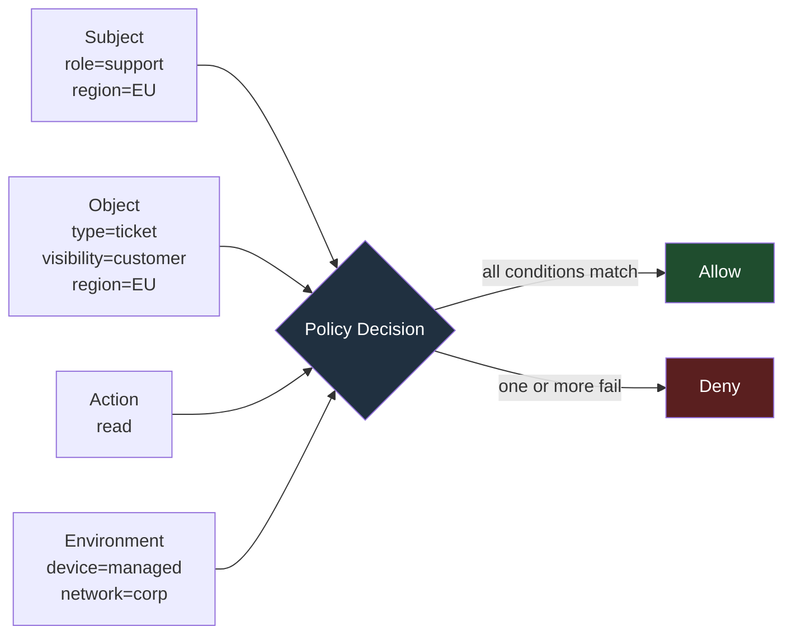
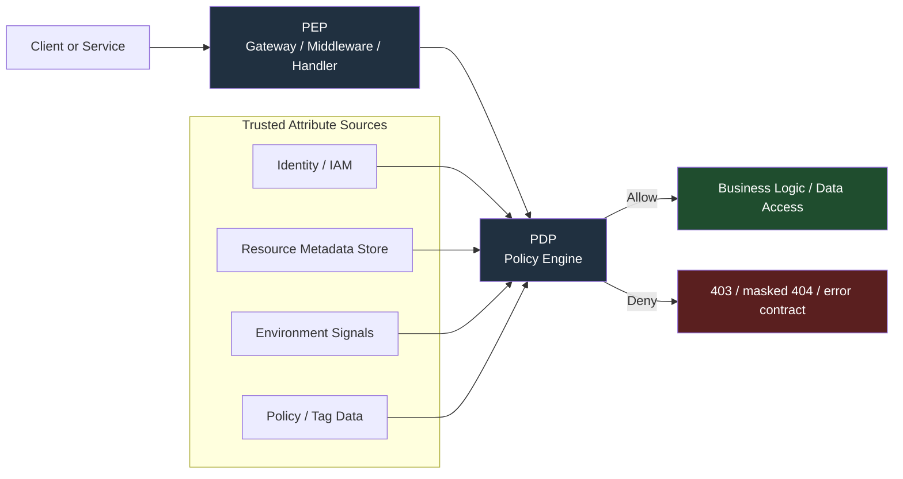
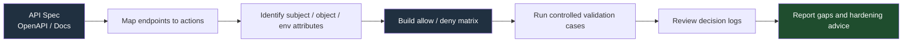

# Attribute Based Access Control

> **Difficulty:** Beginner → Advanced | **Category:** API Pentesting | **Related Risks:** OWASP API1:2023, API3:2023, API5:2023
>
> **Authorized use only:** This note is for approved API security reviews, design reviews, and lab validation. The goal is to verify least privilege, policy correctness, and consistency across the stack — **not** to abuse production access or obtain real users' data.

---

## Table of Contents

1. [What ABAC Means in APIs](#1-what-abac-means-in-apis)
2. [Why Teams Adopt ABAC](#2-why-teams-adopt-abac)
3. [The Core Building Blocks](#3-the-core-building-blocks)
4. [ABAC vs RBAC vs ReBAC](#4-abac-vs-rbac-vs-rebac)
5. [How an API Authorization Decision Is Made](#5-how-an-api-authorization-decision-is-made)
6. [Using the API Spec to Derive an Authorization Matrix](#6-using-the-api-spec-to-derive-an-authorization-matrix)
7. [A Safe, Practical ABAC Testing Workflow](#7-a-safe-practical-abac-testing-workflow)
8. [Common ABAC Failure Modes in APIs](#8-common-abac-failure-modes-in-apis)
9. [Advanced Design Challenges](#9-advanced-design-challenges)
10. [Detection and Observability](#10-detection-and-observability)
11. [Hardening Guidance](#11-hardening-guidance)
12. [How to Report ABAC Findings Well](#12-how-to-report-abac-findings-well)
13. [References](#13-references)

---

## 1. What ABAC Means in APIs

**Attribute Based Access Control (ABAC)** is an authorization model in which access is decided by evaluating **attributes** about:

- the **subject** making the request
- the **object/resource** being accessed
- the **action** being requested
- the **environment** around the request

NIST defines ABAC as determining whether a requested operation is allowed by evaluating subject, object, operation, and environment attributes against policy.

### Beginner view

RBAC asks:

> “Does this user have the `manager` role?”

ABAC asks:

> “Is this user a manager, in the right department, accessing the right data set, from an approved context, for an allowed action?”

That difference matters a lot in APIs, because APIs often expose:

- many resource types
- many sensitive fields
- many tenants or business units
- machine-to-machine traffic
- context-sensitive rules such as geography, device trust, or time windows

### Simple example

An API may allow:

- a **support agent** to read tickets
- only for **their own region**
- only for tickets marked **customer-visible**
- and only from a **managed device**

That is classic ABAC thinking.



### Important reminder

ABAC is about **authorization**, not authentication.

- **Authentication** proves who or what is calling the API.
- **Authorization** decides what that caller may do.

A perfectly valid JWT, API key, or mTLS identity can still be **unauthorized** for a specific resource, field, or action.

---

## 2. Why Teams Adopt ABAC

Teams usually adopt ABAC when plain role-based rules stop being expressive enough.

### Common reasons

| Why ABAC is attractive | What it solves in APIs |
|---|---|
| Too many roles | Avoids “role explosion” like `eu_finance_reader`, `us_finance_reader`, `eu_finance_editor`, etc. |
| Dynamic business rules | Access can depend on project, data classification, region, clearance, tenant, or workflow state |
| Fine-grained data protection | Decisions can vary by object, property, or request context |
| Multi-tenant platforms | Tenant, account, subscription, project, or workspace attributes can narrow access |
| Zero-trust style controls | Device posture, network path, or time window can influence decisions |

### Why ABAC is also risky

ABAC improves flexibility, but it also increases **complexity**.

| Benefit | Security cost |
|---|---|
| More precise access rules | More opportunities for logic mistakes |
| Fewer hard-coded roles | More dependence on accurate metadata and tagging |
| Easier business alignment | Harder troubleshooting when a decision is wrong |
| Central policy engines | Risk of cache drift, policy drift, or inconsistent enforcement |

### Why this matters to API testers

In API security, ABAC failures often show up as:

- **object-level access mistakes** when resource attributes are ignored
- **function-level mistakes** when action rules are incomplete
- **property-level mistakes** when field redaction does not match policy
- **cross-tenant access** when tenant or workspace attributes are mishandled
- **stale access** when claims change but tokens or caches do not

This is why ABAC is tightly connected to OWASP API1, API3, and API5.

---

## 3. The Core Building Blocks

### 3.1 Attribute categories

| Category | Question answered | API examples |
|---|---|---|
| **Subject attributes** | Who/what is calling? | user ID, service account, role, department, tenant, clearance, device trust |
| **Object attributes** | What is being accessed? | owner ID, tenant ID, project tag, data classification, lifecycle state |
| **Action attributes** | What operation is requested? | read, list, export, approve, delete, rotate-key |
| **Environment attributes** | Under what conditions? | time of day, source network, region, private link, MFA present, break-glass mode |

### 3.2 The decision system around ABAC

Many ABAC designs use the following logical components:

| Component | Meaning | API interpretation |
|---|---|---|
| **PAP** | Policy Administration Point | where policy is written and managed |
| **PDP** | Policy Decision Point | where allow/deny is calculated |
| **PEP** | Policy Enforcement Point | where the request is blocked or allowed |
| **PIP** | Policy Information Point | where attributes come from |

### 3.3 Attribute sources

Not all attributes are equally trustworthy.

| Attribute source | Example | Trust level | Testing implication |
|---|---|---|---|
| Token claims | `role`, `tenant`, `department` in JWT | Medium | Claims may be stale if user state changed after token issuance |
| Server-side identity store | HR group, entitlement DB, IAM directory | High | Usually better source of truth than the client token alone |
| Resource metadata | `owner_id`, `classification`, `project_tag` | High | Missing or wrong tags often break ABAC |
| Request data | header, path, body, query | Low unless validated | Dangerous if policy trusts client-supplied attributes |
| Environment signals | device posture, private network, time window | Medium to High | Must come from reliable telemetry, not client-controlled headers |

### The key design lesson

ABAC is only as strong as the **quality and integrity of the attributes** it evaluates.

If the policy is correct but the attributes are:

- missing
- stale
- user-controlled
- inconsistently normalized
- or not enforced everywhere

then the effective authorization can still fail.

---

## 4. ABAC vs RBAC vs ReBAC

Real systems rarely use only one model. Most mature APIs use a **hybrid**.

| Model | Core idea | Strength | Weakness | Typical API use |
|---|---|---|---|---|
| **RBAC** | Access depends on role | Simple and understandable | Roles multiply quickly | baseline access like admin, analyst, support |
| **ABAC** | Access depends on evaluated attributes | Fine-grained and dynamic | Harder to reason about and test | region, tenant, classification, device, time-based restrictions |
| **ReBAC** | Access depends on relationships | Great for collaboration graphs | Graph logic becomes complex | owner/member/editor/viewer relationships in shared apps |

### A practical mental model

Many modern systems work like this:

1. **RBAC** grants the broad capability.
2. **ABAC** narrows that capability with conditions.
3. **ReBAC** handles sharing or graph-based exceptions.

For example:

- role says the user is a `document_reader`
- ABAC says they can only read documents in their tenant and region
- ReBAC says they may also read a document explicitly shared with them

### Important real-world point

Microsoft's Azure documentation describes ABAC conditions as a way to add more fine-grained filtering **on top of RBAC**. That is a useful mindset for API testing too: many “ABAC” systems are really **RBAC + conditions**.

---

## 5. How an API Authorization Decision Is Made

In secure designs, the request is not trusted just because it carries a valid token. The API must still evaluate policy against trusted attributes.



### What a policy decision may evaluate

| Dimension | Example check |
|---|---|
| Subject | `user.department == "finance"` |
| Object | `resource.classification != "restricted"` |
| Action | `action in ["read", "list"]` |
| Environment | `request.network == "private"` |
| Cross-check | `user.tenant == resource.tenant` |

### Safe example policy logic

```text
Allow READ on invoice if:
  subject.role in ["finance-analyst", "finance-manager"]
  AND subject.tenant_id == resource.tenant_id
  AND subject.region == resource.region
  AND resource.classification != "executive-only"
  AND environment.device_trust == "managed"
```

### Where implementations go wrong

The system may look “centralized,” but failures often happen because:

- the gateway enforces policy and a backend service does not
- one endpoint checks `tenant_id`, another forgets
- list endpoints filter correctly, but export endpoints do not
- property redaction is handled separately from object authorization
- token claims are accepted long after the underlying entitlement changed

ABAC is therefore not only a policy problem. It is also a **consistency problem**.

---

## 6. Using the API Spec to Derive an Authorization Matrix

For authorized API testing, the API specification is one of your best sources of truth.

Even if the spec does **not** fully describe authorization, it still reveals:

- endpoints
- methods
- resources
- input parameters
- response shapes
- security schemes
- admin or bulk-style operations

### 6.1 What to pull from the API spec

From an OpenAPI or similar API spec, extract:

| Spec element | Why it matters for ABAC |
|---|---|
| Path + method | Defines the action surface |
| Resource identifiers | Shows where object-level checks must occur |
| Request schema | Reveals user-controlled fields that may influence policy |
| Response schema | Reveals sensitive fields that may require property-level rules |
| Security scheme | Shows authentication, not full authorization |
| Tags / summaries / descriptions | Often hint at admin, export, approval, billing, or tenant-sensitive behavior |

### 6.2 A critical tester mindset

If the spec says only:

```yaml
security:
  - bearerAuth: []
```

that means:

> “A token is required.”

It does **not** mean:

> “Authorization is correct.”

Authentication requirements in the spec are only the starting point. You still need to determine:

- which actor types should be allowed
- which resource attributes must match
- which fields should be hidden
- which context conditions must apply

### 6.3 Build an authorization matrix from the spec

OWASP's authorization testing guidance recommends formalizing expectations into a matrix. That is especially useful for ABAC because roles alone are not enough.

#### Example matrix

| Endpoint | Action | Subject attributes | Resource attributes | Environment attributes | Expected |
|---|---|---|---|---|---|
| `GET /v1/projects/{id}` | read project | `role=analyst`, `tenant=A`, `region=EU` | `tenant=A`, `region=EU`, `classification=internal` | `device=managed` | allow |
| `GET /v1/projects/{id}` | read project | `role=analyst`, `tenant=A`, `region=EU` | `tenant=A`, `region=US`, `classification=internal` | `device=managed` | deny |
| `GET /v1/projects/{id}` | read project | `role=analyst`, `tenant=A`, `region=EU` | `tenant=A`, `region=EU`, `classification=restricted` | `device=managed` | deny |
| `POST /v1/projects/{id}/export` | export project | `role=analyst`, `tenant=A` | `tenant=A`, `classification=internal` | `device=managed` | deny |
| `POST /v1/projects/{id}/export` | export project | `role=manager`, `tenant=A`, `clearance=export` | `tenant=A`, `classification=internal` | `device=managed` | allow |

### 6.4 A useful workflow



### 6.5 Questions the API spec should trigger

- Does every path carrying an object identifier have an object-level check?
- Are list, search, export, and bulk endpoints governed by the same policy as single-object reads?
- Are sensitive response fields filtered or redacted per attribute policy?
- Are admin or approval actions separated clearly from normal user actions?
- Does the spec reveal hidden “internal” or legacy paths that may bypass newer policy layers?

---

## 7. A Safe, Practical ABAC Testing Workflow

ABAC testing should be done like a controlled validation exercise, not a free-form attack.

### 7.1 Safety rules first

Only test in ways explicitly approved for the engagement:

- use test accounts or designated user personas
- use seeded test data instead of real customer records
- avoid broad enumeration or bulk extraction
- avoid changing production attributes unless change windows and rollback exist
- coordinate with owners if environment-based checks involve network, region, or device posture changes

### 7.2 The most useful test pattern

Instead of “admin vs user,” think in **attribute deltas**.

Change **one attribute at a time** in a controlled scenario and confirm that the decision changes only when it should.

| Test pattern | What it validates |
|---|---|
| Same role, different tenant | tenant isolation |
| Same role, different region | geography-based rules |
| Same role, different data classification | sensitivity-based restrictions |
| Same user before/after entitlement change | stale claims and revocation behavior |
| Same user from approved vs unapproved context | environment-aware enforcement |
| Same object via normal endpoint vs export/bulk endpoint | policy consistency |
| Same object, different fields returned | property-level enforcement |

### 7.3 A practical authorized sequence

1. **Map expected policy** from the API spec, business rules, and owner input.
2. **Create test personas** that differ in one meaningful attribute.
3. **Seed test resources** with clear metadata such as tenant, region, owner, classification, and workflow state.
4. **Run positive cases** to confirm intended access works.
5. **Run negative cases** to confirm closely related requests are denied.
6. **Check side channels** such as exports, search, async jobs, GraphQL fields, or alternate API versions.
7. **Review logs** to confirm the denial reason and evaluated policy path are sensible.

### 7.4 Safe request examples

These are **validation examples** using fictional data, not instructions for abusing real systems.

```http
GET /v1/reports/rpt-1001 HTTP/1.1
Authorization: Bearer [token for tenant=A, region=EU, role=auditor]

Expected result:
200 OK
Only if report tenant=A, region=EU, and classification <= auditor clearance
```

```http
GET /v1/reports/rpt-1002 HTTP/1.1
Authorization: Bearer [token for tenant=A, region=EU, role=auditor]

Controlled test condition:
report tenant=A, region=US

Expected result:
403 Forbidden
because the subject and resource region attributes do not match
```

```http
POST /v1/reports/rpt-1001/export HTTP/1.1
Authorization: Bearer [token for tenant=A, role=auditor]

Expected result:
403 Forbidden
if export requires an additional attribute such as clearance=export
```

### 7.5 Response interpretation

| Response | What it may mean |
|---|---|
| **401 Unauthorized** | authentication failed or missing |
| **403 Forbidden** | request was authenticated but policy denied it |
| **404 Not Found** | some systems intentionally mask existence; still verify whether authorization is actually correct |
| **200 OK with partial fields** | property-level ABAC may be working — or silently leaking too much |
| **200 OK on a near-match negative case** | strong sign of ABAC enforcement failure |

### 7.6 High-value places to validate

- bulk exports
- search endpoints
- list endpoints with filters
- async job creation and result download
- GraphQL field resolution
- file or report generation APIs
- webhook management
- admin tools embedded under normal-looking paths
- legacy or versioned endpoints

These are the places where “normal endpoint protected, alternate path forgotten” shows up most often.

---

## 8. Common ABAC Failure Modes in APIs

### 8.1 Failure patterns

| Failure mode | What goes wrong | Safe testing signal |
|---|---|---|
| **Client-controlled attributes trusted** | API trusts a header or body field like `department=finance` without authoritative verification | decision changes based on user-supplied metadata alone |
| **Missing attribute defaults to allow** | absent tag, null field, or lookup failure falls through to allow | untagged resources become readable |
| **Stale claims in long-lived tokens** | user changed team/tenant/clearance but old token still authorizes | access persists after entitlement change |
| **Gateway-only enforcement** | gateway checks policy, backend or internal route does not | alternate path or internal endpoint behaves differently |
| **List/search inconsistency** | single-object read is protected, list or search leaks objects | forbidden objects appear in list results or counts |
| **Property-level mismatch** | object access denied correctly, but sensitive fields still leak somewhere | export, detail, or GraphQL view returns extra properties |
| **Normalization mismatch** | `Finance`, `finance`, and `FINANCE` are treated inconsistently | same logical attribute produces different decisions |
| **Cross-tenant joins** | backend combines data across tenant boundaries | aggregate or report includes foreign-tenant rows |
| **Cache drift** | cached allow decision outlives policy or attribute change | revoke action does not take effect quickly |
| **TOCTOU gap** | attributes checked once, but resource changes before completion | workflow transition bypasses intended rule |

### 8.2 API-specific anti-patterns

#### Trusting the token too much

A token is often a **snapshot** of identity, not a live view of current authorization state.

That is dangerous when access depends on fast-changing attributes such as:

- team membership
- contract status
- data sensitivity approval
- emergency or break-glass flags
- device posture

#### Treating tags as optional decoration

ABAC frequently depends on metadata tags and labels. If the organization treats those tags as operationally optional, the policy becomes fragile.

In practice, insecure outcomes often come from:

- resources created without required tags
- legacy records missing classification
- incorrect ownership metadata
- manual backfills that never completed

#### Protecting reads but forgetting derived outputs

ABAC may be implemented on direct reads, while derived outputs remain weakly protected:

- CSV exports
- scheduled reports
- data warehouse sync jobs
- notification payloads
- AI or search indexes

The policy must follow the data, not just the main endpoint.

---

## 9. Advanced Design Challenges

### 9.1 ABAC in distributed systems

In microservices, the “same” authorization decision may be evaluated in:

- an API gateway
- a backend service
- an async worker
- a data export service
- a GraphQL resolver

If those components do not use the **same policy**, **same attribute definitions**, and **same source of truth**, drift appears.

### 9.2 Policy-as-code

Many organizations use policy engines such as OPA to keep authorization logic centralized and reviewable.

A simplified example:

```rego
package api.authz

default allow := false

allow if {
  input.action == "read"
  input.subject.tenant == input.resource.tenant
  input.subject.region == input.resource.region
  input.subject.device_trust == "managed"
  input.resource.classification != "restricted"
}
```

This is not automatically secure. The important questions remain:

- who supplies `input.subject.region`?
- who guarantees `input.resource.classification` is correct?
- how quickly do changes propagate?
- is the same policy used for export, list, and background jobs?

### 9.3 Decision freshness

One of the hardest ABAC problems is balancing:

- **speed**
- **availability**
- **freshness**

If you recompute every decision from live sources, latency increases.

If you cache aggressively, revocation and attribute changes lag behind.

### 9.4 Explainability

RBAC decisions are easy to explain:

> “You are an admin.”

ABAC decisions can be much harder:

> “Denied because your region mismatched the resource tag after a fallback classification lookup returned null and policy rule 17 took precedence.”

If defenders cannot explain decisions, they will struggle to debug outages and spot security errors.

### 9.5 Hybrid models are normal

Mature systems often combine:

- RBAC for broad job function
- ABAC for narrowing conditions
- ReBAC for sharing and collaboration
- explicit emergency overrides with heavy logging

That is usually more realistic than trying to force every decision into a pure ABAC design.

---

## 10. Detection and Observability

ABAC without strong telemetry becomes very hard to validate and maintain.

### 10.1 What should be logged

| Field | Why it matters |
|---|---|
| request ID / trace ID | correlates decision across services |
| subject identifier | shows who or what requested access |
| action | shows what operation was attempted |
| resource identifier and type | ties decision to the target object |
| evaluated attributes | makes policy behavior explainable |
| policy version / rule ID | helps identify drift after deployments |
| decision result | allow / deny / indeterminate |
| deny reason | useful for triage and validation |
| cache hit / miss | reveals stale-decision risk |
| attribute source | shows whether values came from token, DB, IAM, etc. |

### 10.2 Example decision log

```json
{
  "trace_id": "8a5d4f3c",
  "subject": { "id": "user-42", "tenant": "A", "region": "EU" },
  "action": "read",
  "resource": { "type": "report", "id": "rpt-1002", "tenant": "A", "region": "US" },
  "environment": { "device_trust": "managed" },
  "policy_version": "2026-03-01",
  "decision": "deny",
  "reason": "subject.region != resource.region",
  "attribute_sources": {
    "subject.region": "iam-directory",
    "resource.region": "resource-metadata-store"
  }
}
```

### 10.3 Useful detection signals

| Signal | Why it matters |
|---|---|
| sudden spike in denied requests after policy deployment | possible policy bug |
| allowed requests with missing tags | likely default-allow or metadata hygiene problem |
| same token accessing multiple tenants unexpectedly | tenant scoping issue |
| access persists after role/team change | stale claims or stale cache |
| different decisions across equivalent endpoints | enforcement inconsistency |
| repeated client-supplied entitlement headers | possible design flaw or probing of trust boundaries |

---

## 11. Hardening Guidance

### 11.1 Design principles

| Principle | Why it matters |
|---|---|
| **Deny by default** | unmatched or missing conditions should not silently allow access |
| **Validate every request** | a single missed endpoint can break the model |
| **Use authoritative attributes** | avoid trusting client input for entitlements |
| **Keep policy centralized** | reduces drift between services |
| **Protect metadata quality** | ABAC fails when tags and ownership data are wrong |
| **Log decisions clearly** | helps audit, debug, and detect regressions |

### 11.2 Practical hardening steps

1. **Define a real authorization matrix**
   - Map actors, resources, actions, fields, and context rules.
   - Keep it versioned and reviewable.

2. **Separate authentication from authorization**
   - Do not treat “valid token” as “authorized for this object.”

3. **Prefer server-side source of truth**
   - Pull sensitive attributes from trusted stores when possible.
   - Be cautious with long-lived claims embedded in tokens.

4. **Enforce the same policy on all paths**
   - Single-object reads, list views, export APIs, async jobs, and admin tooling should agree.

5. **Plan for attribute freshness**
   - Decide which attributes can be cached and for how long.
   - Document revocation expectations.

6. **Test property-level outcomes**
   - Not every failure is a full object exposure.
   - Field leakage may still be significant.

7. **Review metadata lifecycle**
   - Who sets `owner_id`, `classification`, `tenant_id`, `project`, `region`?
   - What happens when a value is missing?

8. **Automate authorization tests**
   - OWASP recommends formalizing authorization expectations and testing them repeatedly.
   - ABAC is too dynamic to rely on ad hoc manual checks alone.

### 11.3 What “good” looks like

```text
Authentication succeeds
→ server fetches trusted subject/resource attributes
→ centralized policy evaluates action + context
→ default deny on missing data
→ consistent enforcement across all endpoints
→ decision is logged with reason and policy version
```

---

## 12. How to Report ABAC Findings Well

ABAC findings are strongest when they describe the **policy gap**, not just the HTTP result.

### Weak vs strong reporting

| Weak finding | Strong finding |
|---|---|
| “User could access another report.” | “A regional attribute check was enforced on the primary read endpoint but not on the export endpoint, allowing an EU analyst to export a US report in the same tenant.” |
| “Authorization issue exists.” | “The API relied on stale JWT claims for department membership, so access remained valid for 30 minutes after entitlement removal.” |
| “ABAC misconfiguration.” | “Resources missing classification tags defaulted to readable, creating a deny-bypass condition for newly created records.” |

### Include these details

- **expected policy**
- **actual policy behavior**
- **which attribute(s) were relevant**
- **where the attribute came from**
- **which endpoint(s) were inconsistent**
- **business impact**
- **whether the issue affects object, property, function, or tenant boundaries**
- **recommended remediation**

### Example impact framing

| Technical issue | Better business framing |
|---|---|
| stale token claims | terminated or reassigned users may retain sensitive API access longer than intended |
| missing classification tags | new records can bypass sensitivity controls during creation or migration windows |
| export endpoint ignores region | data residency or regulatory controls may be bypassed through a secondary workflow |
| property-level leak | restricted fields may appear in downstream exports, dashboards, or audit feeds |

### Reporting lesson

The most useful ABAC report explains:

1. **what policy should have happened**
2. **why the implementation disagreed**
3. **how broad the inconsistency is**
4. **how defenders can prevent recurrence**

---

## 13. References

- NIST SP 800-162, **Guide to Attribute Based Access Control (ABAC) Definition and Considerations**  
  https://csrc.nist.gov/pubs/sp/800/162/upd2/final

- OWASP, **Authorization Cheat Sheet**  
  https://cheatsheetseries.owasp.org/cheatsheets/Authorization_Cheat_Sheet.html

- OWASP, **Authorization Testing Automation Cheat Sheet**  
  https://cheatsheetseries.owasp.org/cheatsheets/Authorization_Testing_Automation_Cheat_Sheet.html

- OWASP API Security Top 10 2023, **API1: Broken Object Level Authorization**  
  https://owasp.org/API-Security/editions/2023/en/0xa1-broken-object-level-authorization/

- OWASP API Security Top 10 2023, **API5: Broken Function Level Authorization**  
  https://owasp.org/API-Security/editions/2023/en/0xa5-broken-function-level-authorization/

- Open Policy Agent, **Policy Language**  
  https://www.openpolicyagent.org/docs/latest/policy-language/

- Microsoft Learn, **Azure role assignment conditions overview**  
  https://learn.microsoft.com/en-us/azure/role-based-access-control/conditions-overview
