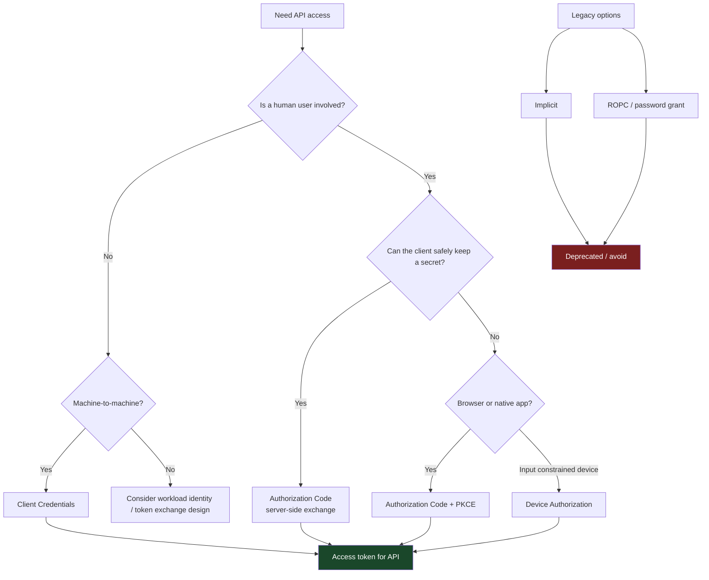
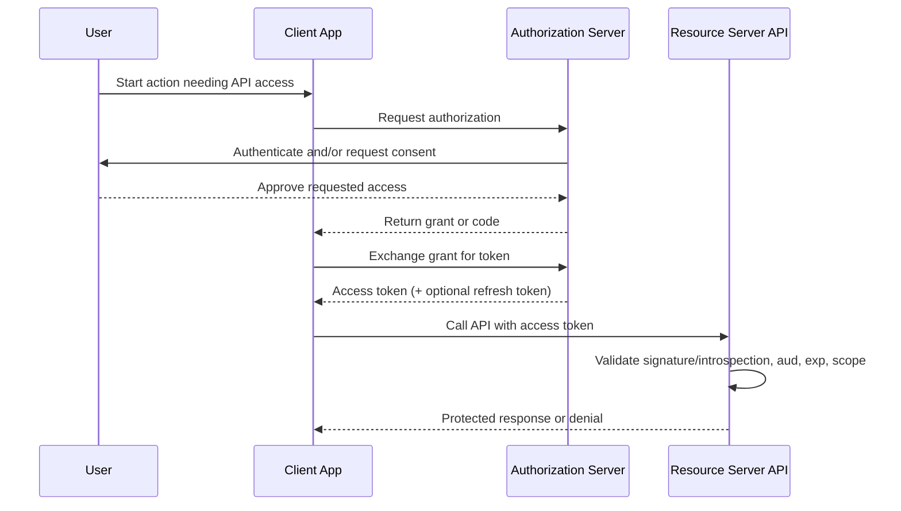
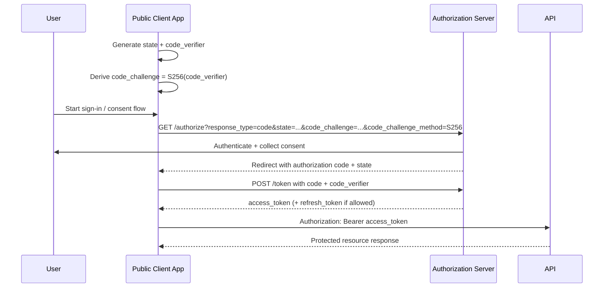
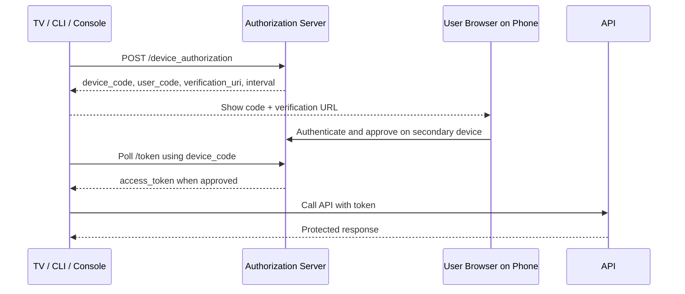
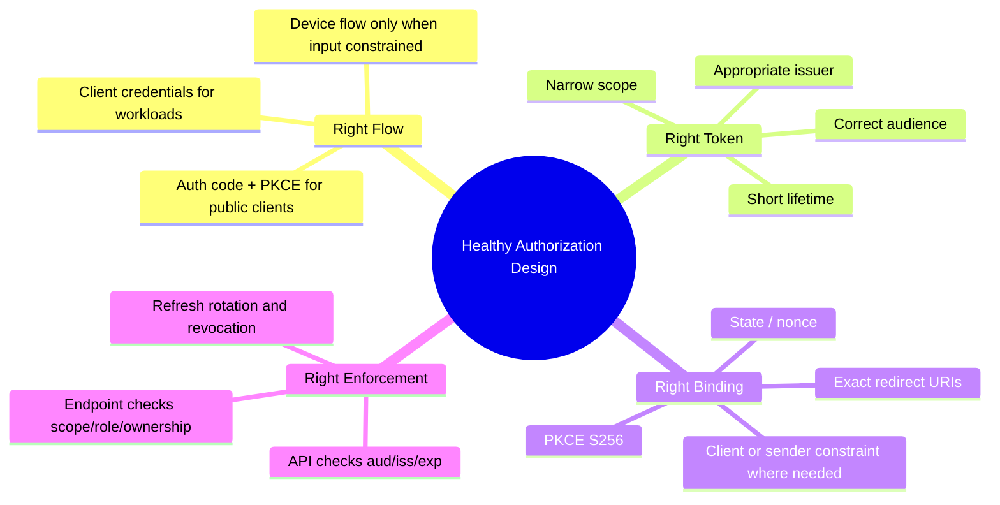

# Authorization Flows

> **Authorization flows are the routes by which users, applications, and services obtain permission to call an API. In authorized API testing, your goal is not just to see whether a token is issued, but whether the right subject gets the right token for the right resource, with the right scope, over the right channel.**

---

## 🧠 What Is It? (Beginner Explanation)

Think of an office building with different ways to get access:

- A **full-time employee** signs in at the lobby and gets a badge.
- A **delivery driver** gets temporary access to one loading area.
- A **machine in the basement** uses a service badge that never goes through the lobby.
- A **visitor kiosk** cannot type much, so it shows a code that the visitor completes on their phone.

Those are different **authorization flows**.

In APIs, a flow answers questions like:

- **Who is asking for access?** A user, a mobile app, a backend service, a device?
- **How do they prove identity?** Login page, client secret, certificate, PKCE, device code?
- **What are they allowed to do?** Read profile, send messages, manage billing, access admin APIs?
- **Where is the token meant to be used?** A specific API, tenant, or audience?

### Authentication vs Authorization

| Concept | Question | Example |
|---|---|---|
| **Authentication** | Who are you? | “This is Alice” or “this is service `billing-worker`” |
| **Authorization** | What are you allowed to do? | “Alice may read her invoices but not admin reports” |
| **Authorization Flow** | How do you obtain that permission? | OAuth authorization code + PKCE, client credentials, device authorization |

A common beginner mistake is to think “I have a valid token, so access should work.” Not necessarily. A valid token can still be:

- for the **wrong audience**,
- missing the **required scope**,
- tied to the **wrong client**,
- or valid for **authentication** but not for **API authorization**.

### Easy Memory Model

A simple way to remember most modern API flows is:

1. **Front channel** — the user or client is redirected or guided to the authorization server.
2. **Back channel** — the client exchanges something valuable for a token.
3. **API channel** — the token is presented to the resource server.

If you can identify those three legs, most authorization flows become much easier to reason about.

---

## 🏗️ How It Works (Technical Deep Dive)

### Core Actors

| Actor | What it does | Example |
|---|---|---|
| **Resource Owner** | The owner of the protected data or resource | End user, organization, or workload identity |
| **Client** | The app requesting access | SPA, mobile app, server-side app, CLI, microservice |
| **Authorization Server (AS)** | Authenticates users/clients and issues tokens | Okta, Auth0, Entra ID, Keycloak, custom IdP |
| **Resource Server (RS)** | Hosts the protected API | `api.example.com` |

### Important Terms

| Term | Meaning | Why testers care |
|---|---|---|
| **Access token** | Credential used to call the API | Must have correct audience, scope, expiry, and binding |
| **Refresh token** | Used to obtain new access tokens | Long-lived; high-value if not rotated or constrained |
| **Scope** | Permission label | Reveals intended access boundaries |
| **Audience (`aud`)** | Intended API/resource | Prevents token substitution across APIs |
| **Redirect URI** | Callback location after login/consent | High-risk trust boundary |
| **State** | Client-generated value to bind request/response | Helps defend against CSRF and mix-up style issues |
| **PKCE** | Code challenge/verifier pair for public clients | Critical for SPA/mobile/native flows |
| **Nonce** | OIDC value to bind ID token to a transaction | Important when identity tokens are involved |
| **Confidential client** | Can keep a secret safely | Server-side app, backend service |
| **Public client** | Cannot safely store a secret | SPA, mobile app, desktop app |

### Flow Selection Logic



### End-to-End View



### The Most Important Design Question

For API testing, the key design question is not “Does OAuth exist?”

It is:

> **Is the chosen flow appropriate for this client type and threat model?**

Examples:

- A **SPA** should generally use **authorization code + PKCE**, not the implicit flow.
- A **mobile/native app** should use the browser/external user-agent model with **PKCE**.
- A **backend service** should not pretend to be a user; it should use **client credentials** or another workload identity pattern.
- A **TV app or CLI on a limited-input device** may legitimately use **device authorization**.

---

## 📊 Flow Reference Matrix

| Flow | Typical clients | User present? | Secret stored client-side? | Main strengths | Main review points | Current recommendation |
|---|---|---:|---:|---|---|---|
| **Authorization Code + PKCE** | SPA, mobile, native, modern web apps | Yes | No | Best fit for public clients; protects code exchange | `state`, PKCE `S256`, redirect URI validation, audience/scope | **Recommended default** |
| **Authorization Code (confidential client)** | Traditional server-rendered web apps | Yes | Secret stays server-side | Strong separation of browser and token exchange | Exact redirect URIs, session binding, token storage | **Recommended** |
| **Client Credentials** | Backend jobs, daemons, microservices | No | Yes | Clear machine identity; no user session | Over-privileged scopes, tenant boundaries, secret/cert rotation | **Recommended for M2M** |
| **Device Authorization** | Smart TVs, consoles, printers, CLI tooling | Yes | Usually public client | Works without full browser/input on device | User-code entropy, polling interval, verification flow binding | **Recommended when needed** |
| **Refresh Token Flow** | Companion mechanism for long-lived sessions | Maybe | Depends on client type | Avoids repeated login prompts | Rotation, reuse detection, scope widening, revocation | **Use carefully** |
| **Implicit** | Old SPAs | Yes | No | Historically simple | Tokens in front channel, browser history/referrer leakage | **Deprecated / avoid** |
| **ROPC / Password Grant** | Legacy trusted apps only | Yes | Often yes | Simple but dangerous | Password handling, MFA bypass risk, federation incompatibility | **Deprecated / avoid** |

---

## 🔎 Using the API Spec Before You Touch Traffic

When the API has an OpenAPI document, discovery metadata, or vendor docs, start there. The spec often tells you the intended flow before you send a single request.

### OpenAPI Example

```yaml
openapi: 3.1.0
components:
  securitySchemes:
    OAuth2:
      type: oauth2
      flows:
        authorizationCode:
          authorizationUrl: https://auth.example.com/oauth2/authorize
          tokenUrl: https://auth.example.com/oauth2/token
          scopes:
            profile.read: Read profile data
            invoices.read: Read invoice data
        clientCredentials:
          tokenUrl: https://auth.example.com/oauth2/token
          scopes:
            metrics.read: Read service metrics
            jobs.run: Execute background jobs
security:
  - OAuth2:
      - profile.read
```

### OIDC / Authorization Server Discovery Example

```json
{
  "issuer": "https://auth.example.com",
  "authorization_endpoint": "https://auth.example.com/oauth2/authorize",
  "token_endpoint": "https://auth.example.com/oauth2/token",
  "device_authorization_endpoint": "https://auth.example.com/oauth2/device_authorization",
  "jwks_uri": "https://auth.example.com/.well-known/jwks.json",
  "grant_types_supported": [
    "authorization_code",
    "client_credentials",
    "refresh_token",
    "urn:ietf:params:oauth:grant-type:device_code"
  ],
  "code_challenge_methods_supported": ["S256"]
}
```

### What to Extract From the Spec

| Spec field | Why it matters in testing |
|---|---|
| `authorizationUrl` / `authorization_endpoint` | Tells you the front-channel entry point |
| `tokenUrl` / `token_endpoint` | Tells you the back-channel exchange point |
| `device_authorization_endpoint` | Indicates device flow support |
| `grant_types_supported` | Quickly identifies modern vs legacy posture |
| `code_challenge_methods_supported` | Shows whether PKCE is implemented and how |
| `scopes` | Defines the permission model you should validate |
| `security` requirements per operation | Lets you build an authorization matrix by endpoint |
| `jwks_uri` or introspection metadata | Tells you how APIs likely validate tokens |

### Practical Spec-First Workflow

1. **List every declared flow** in scope.
2. **Map each client type** to its expected flow.
3. **Record scopes per endpoint** from the spec.
4. **Check for legacy grants** still enabled even if unused.
5. **Compare documentation to reality** by observing one clean login/exchange for each in-scope flow.

This prevents a common mistake in API testing: staring only at tokens while ignoring the design contract that the API is supposed to enforce.

---

## ⚙️ Technical Details

### 1) Authorization Code + PKCE

This is the modern baseline for browser-based public clients, SPAs, and native apps.



#### Normal HTTP shape

```http
GET /oauth2/authorize?
  response_type=code&
  client_id=spa-client&
  redirect_uri=https%3A%2F%2Fapp.example.com%2Fcallback&
  scope=openid%20profile.read%20invoices.read&
  state=RANDOM_TRANSACTION_VALUE&
  code_challenge=BASE64URL_SHA256_VERIFIER&
  code_challenge_method=S256 HTTP/1.1
Host: auth.example.com
```

```http
POST /oauth2/token HTTP/1.1
Host: auth.example.com
Content-Type: application/x-www-form-urlencoded

grant_type=authorization_code&
code=AUTHORIZATION_CODE&
redirect_uri=https%3A%2F%2Fapp.example.com%2Fcallback&
client_id=spa-client&
code_verifier=ORIGINAL_RANDOM_VERIFIER
```

#### What a tester should verify

| Check | Healthy behavior |
|---|---|
| **Redirect URI validation** | Exact registered URI matching, not broad wildcard trust |
| **State binding** | Missing/mismatched `state` causes rejection |
| **PKCE enforcement** | Public clients must use PKCE; `S256` is preferred |
| **Code reuse** | Authorization codes are single-use and short-lived |
| **Audience and scope** | Token is limited to the intended API and permissions |
| **Token placement** | Access token stays out of URL fragments and browser-visible front-channel responses |

### 2) Client Credentials

Used when a service needs API access on **its own behalf**, not as a user.

```http
POST /oauth2/token HTTP/1.1
Host: auth.example.com
Content-Type: application/x-www-form-urlencoded
Authorization: Basic BASE64(client_id:client_secret)

grant_type=client_credentials&scope=metrics.read%20jobs.run
```

#### What makes this flow different?

- There is **no end-user consent page**.
- The resulting token should represent the **application identity**, not a person.
- Scope design matters enormously because these tokens often have broad backend reach.

#### What a tester should verify

| Check | Healthy behavior |
|---|---|
| **No user identity confusion** | Token does not pretend to be a human user unless explicitly designed to |
| **Least privilege** | Service gets only service-appropriate scopes |
| **Tenant isolation** | A token for tenant A cannot reach tenant B resources |
| **Credential hygiene** | Secret or certificate rotation exists and old credentials are revoked |
| **Audience restriction** | Token for one internal API is not accepted by unrelated APIs |

### 3) Device Authorization

Used for devices or apps with poor input capability.



#### Normal HTTP shape

```http
POST /oauth2/device_authorization HTTP/1.1
Host: auth.example.com
Content-Type: application/x-www-form-urlencoded

client_id=tv-app&scope=profile.read%20media.play
```

```http
POST /oauth2/token HTTP/1.1
Host: auth.example.com
Content-Type: application/x-www-form-urlencoded

grant_type=urn:ietf:params:oauth:grant-type:device_code&
device_code=DEVICE_CODE_FROM_SERVER&
client_id=tv-app
```

#### What a tester should verify

| Check | Healthy behavior |
|---|---|
| **User-code strength** | User codes are sufficiently unpredictable for the intended lifetime |
| **Polling control** | Server enforces `interval` and rate limits excessive polling |
| **Approval binding** | Approval on the secondary device is bound to the right pending transaction |
| **Expiry handling** | Expired codes fail cleanly and predictably |
| **User clarity** | Verification URL and app identity are clear enough to reduce phishing risk |

### 4) Refresh Tokens

Refresh is not usually the user-visible “main” flow, but it is central to real systems because it determines how long access persists.

```http
POST /oauth2/token HTTP/1.1
Host: auth.example.com
Content-Type: application/x-www-form-urlencoded

grant_type=refresh_token&
refresh_token=LONGER_LIVED_REFRESH_TOKEN&
client_id=mobile-app
```

#### What a tester should verify

| Check | Healthy behavior |
|---|---|
| **Rotation** | Refresh token rotates or is otherwise strongly protected |
| **Reuse detection** | Old refresh token reuse is detected and handled |
| **No privilege widening** | Refreshed tokens do not silently gain broader scope |
| **Session lifecycle** | Logout, password reset, or admin revocation meaningfully affects token renewal |
| **Client binding** | Refresh token is only usable by the client/session it was issued to |

### 5) Legacy Grants to Recognize and Phase Out

#### Implicit Flow

Historically used by older SPAs. It returned tokens directly through the browser-facing channel. Modern guidance deprecates it in favor of authorization code + PKCE.

#### Resource Owner Password Credentials (ROPC)

The client collects the user’s password directly and exchanges it for tokens. This is operationally simple but weak from a security and architecture perspective because it bypasses many of the protections available in browser-based flows.

| Legacy flow | Why it is risky |
|---|---|
| **Implicit** | Tokens are exposed to browser-visible channels; harder to protect from leakage and modern browser complexity |
| **ROPC** | Encourages password handling by clients; poor fit for MFA, federation, and phishing-resistant design |

---

## 🧪 Authorized API Testing Workflow

This section is intentionally framed for **authorized** testing, design review, and validation inside your scope.

### 1. Build an Authorization Matrix

Create a matrix from the API spec and observed traffic.

| Endpoint / Resource | Actor | Flow | Expected scope | Expected audience | Expected outcome |
|---|---|---|---|---|---|
| `GET /v1/profile` | End user SPA | Auth code + PKCE | `profile.read` | `api://profile` | Allowed for owner |
| `GET /v1/admin/users` | Admin portal | Auth code + PKCE | `admin.users.read` | `api://admin` | Allowed for admins only |
| `POST /internal/jobs/run` | Worker service | Client credentials | `jobs.run` | `api://jobs` | Allowed for worker only |
| `GET /v1/device/link-status` | TV app | Device authorization | `media.play` | `api://media` | Allowed after approval |

This one table often exposes logic problems immediately:

- same token accepted across too many APIs,
- service scopes overlapping with user scopes,
- undocumented grants still enabled,
- admin permissions mixed into normal user apps.

### 2. Capture One Clean Execution Per Flow

For each in-scope client type:

- record the **authorize request**,
- record the **token request**,
- note the **scopes requested vs granted**,
- inspect token claims such as `iss`, `aud`, `azp`, `sub`, `exp`, and scope/role claims,
- then map the token to the actual API endpoints it can call.

The point is not to “hack the flow” first. The point is to understand the intended trust model accurately before validating it.

### 3. Validate the Trust Boundaries

| Trust boundary | Questions to ask |
|---|---|
| **Client ↔ Authorization Server** | Is the client using the correct flow for its type? Is PKCE required where it should be? |
| **Authorization Server ↔ Redirect URI** | Are callback destinations tightly controlled? |
| **Authorization Server ↔ Token** | Are scope, audience, lifetime, and client binding appropriate? |
| **Resource Server ↔ Token** | Does the API verify issuer, audience, expiry, and required authorization claims? |
| **User ↔ Consent** | Is the user clearly told what app is requesting what access? |

### 4. Review Failure Paths, Not Just Success Paths

Safe, non-destructive validation often means checking that the system rejects the wrong thing cleanly:

- mismatched `state`,
- missing PKCE values for public clients,
- expired codes,
- wrong audience token presented to the API,
- missing required scope,
- revoked refresh token,
- device polling faster than allowed.

For production systems, use low-risk endpoints and avoid destructive actions. The goal is to validate policy enforcement, not create avoidable impact.

---

## 🚩 Common Review Findings in Authorization Flows

| Finding | Why it matters | Safe validation angle |
|---|---|---|
| **PKCE optional for public clients** | Makes code interception or transaction substitution defenses weaker | Confirm whether public clients can complete flow without `code_challenge` |
| **Redirect URI trust is too broad** | Expands where sensitive authorization responses can be sent | Compare registered URIs to actual accepted callback patterns |
| **Scope model is overly coarse** | One token may unlock far more than intended | Compare requested scopes, granted scopes, and reachable endpoints |
| **Audience not enforced by APIs** | Token for API A may work on API B | Present a token intended for one API to another low-risk API endpoint and observe rejection/acceptance |
| **Client credentials used for user-like actions** | Blurs accountability and increases blast radius | Check whether workload tokens can reach user-owned or admin-sensitive endpoints |
| **Refresh tokens are long-lived and static** | Increases persistence if stolen | Observe whether refresh token value changes after use and whether reuse is rejected |
| **Device flow lacks polling controls** | Encourages abusive retry patterns and weakens transaction controls | Verify `interval`, expiry, and rate-limit behavior non-destructively |
| **Implicit or ROPC still enabled** | Usually indicates outdated security posture | Check discovery docs and client registrations for legacy grants |
| **ID token used as API bearer token** | Identity token != authorization token | Compare API behavior when given proper access token vs ID token |

---

## 🛡️ Defensive Design Principles

### What “Good” Looks Like



### Recommended Baseline

| Area | Defensive recommendation |
|---|---|
| **Browser/native apps** | Use authorization code + PKCE |
| **Server-side web apps** | Use authorization code with server-side token exchange |
| **Machine identities** | Use client credentials or a workload identity model |
| **Legacy grant support** | Disable implicit and ROPC unless there is a very strong documented exception |
| **Redirect handling** | Require exact callback matching and avoid open redirect behavior |
| **Token scope** | Keep scopes small and task-specific |
| **Audience design** | Issue tokens for specific APIs/resources, not generic “works everywhere” tokens |
| **Refresh handling** | Prefer rotation and meaningful revocation |
| **High-value tokens** | Consider sender-constrained approaches such as mTLS- or proof-of-possession-style designs |

---

## 📝 Reporting Notes for Pentesters

When documenting authorization-flow issues, record:

| Evidence item | Why it matters |
|---|---|
| Flow name and client type | Shows whether the design choice itself is appropriate |
| Authorization and token endpoints | Identifies affected trust boundaries |
| Requested vs granted scopes | Demonstrates over-privilege or incorrect narrowing |
| Token claims (`iss`, `aud`, `sub`, `azp`, `exp`) | Supports audience/client/subject analysis |
| API endpoints successfully reached | Connects token issuance problems to real impact |
| Rejection behavior for invalid cases | Shows what controls are working or missing |
| Screenshots / sanitized traffic traces | Makes the finding reproducible without exposing secrets |

A strong report ties the issue back to business impact, for example:

- cross-API token acceptance,
- excessive service-to-service privileges,
- weak session persistence controls,
- or legacy flow support that undermines MFA and modern browser-based protections.

---

## 📚 References & Standards

This note aligns with public guidance from:

- **RFC 6749** — *The OAuth 2.0 Authorization Framework*
- **RFC 7636** — *Proof Key for Code Exchange (PKCE)*
- **RFC 8252** — *OAuth 2.0 for Native Apps*
- **RFC 8628** — *OAuth 2.0 Device Authorization Grant*
- **RFC 9700** — *OAuth 2.0 Security Best Current Practice*
- **OWASP OAuth 2.0 Cheat Sheet**
- Vendor implementation guidance such as **Microsoft identity platform authorization code flow** documentation

If you remember one thing, remember this:

> **Modern API authorization is not about “getting a token.” It is about preserving trust boundaries from the initial request all the way to the final API decision.**
