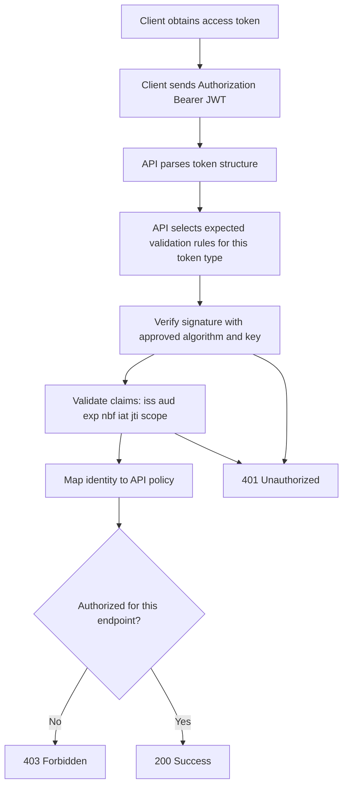

# JWT Security

> **JWT security in APIs is about verifying that the server treats tokens as signed identity artifacts, not as trusted user input. In authorized API testing, your goal is to validate signature handling, claim validation, key management, replay resistance, and authorization boundaries without abusing real users or production systems.**

---

## 🧠 What Is It? (Beginner Explanation)

A **JWT (JSON Web Token)** is a compact token format commonly sent in API requests like this:

```http
Authorization: Bearer <token>
```

Think of it like a digitally signed visitor badge:

- the **payload** contains statements about the holder
- the **signature** is what makes tampering detectable
- the **server** decides whether the badge is still valid, meant for this API, and allowed to perform the requested action

That last point matters the most:

> A JWT does **not** magically grant access. The API still needs to verify the token correctly and then enforce authorization correctly.

So in practice, JWT security testing sits at the intersection of:

- **authentication** — is this token genuine and valid?
- **authorization** — should this authenticated principal be allowed to do this?
- **key management** — are signing keys rotated, protected, and selected safely?
- **session design** — can stolen or replayed tokens be reused?

---

## 🔍 Start With The API Spec

Before touching requests, read the API documentation and authentication metadata.

In an **OpenAPI/Swagger** document, JWT-protected APIs usually expose clues like:

```yaml
openapi: 3.1.0
components:
  securitySchemes:
    bearerAuth:
      type: http
      scheme: bearer
      bearerFormat: JWT
security:
  - bearerAuth: []
paths:
  /v1/profile:
    get:
      security:
        - bearerAuth: []
      responses:
        '401':
          description: Missing or invalid token
        '403':
          description: Authenticated but not authorized
```

### What to extract from the spec first

| What to look for | Why it matters to testing |
|---|---|
| `components.securitySchemes` | Tells you whether the API expects HTTP bearer auth, OAuth, OIDC, or something custom |
| Global `security` vs operation-level `security` | Helps identify endpoints that should be protected but may not be |
| `401` vs `403` responses | Shows the intended distinction between invalid token and insufficient privilege |
| Scope requirements | Lets you build a role/scope test matrix instead of guessing |
| Auth server / OIDC links | Often leads to discovery docs, JWKS endpoints, and token metadata |
| Separate user vs service auth flows | Prevents mixing human tokens, machine tokens, and admin tokens during testing |

### Also check discovery metadata

For OIDC-backed APIs, a discovery document often reveals:

- issuer
- authorization endpoint
- token endpoint
- JWKS URI
- supported signing algorithms

Common locations include:

```text
/.well-known/openid-configuration
/.well-known/jwks.json
```

### Important note

`bearerFormat: JWT` is only a **documentation hint** in OpenAPI. It does **not** enforce validation by itself. Your testing still needs to verify the server's real behavior.

---

## 🏗️ How JWT Validation Should Work



A secure API should treat JWT validation as a chain:

1. **Is the token well-formed?**
2. **Was it signed with an approved algorithm?**
3. **Was the signature verified with the correct key?**
4. **Are the claims valid for this API, now, and for this client?**
5. **Does the caller still have permission for this action?**

If any step is skipped, the token may be accepted when it should not be.

---

## 🧩 JWT Anatomy

A typical JWT has three Base64URL-encoded parts:

```text
HEADER.PAYLOAD.SIGNATURE
```

Example:

```text
eyJhbGciOiJSUzI1NiIsInR5cCI6IkpXVCJ9.eyJpc3MiOiJodHRwczovL2F1dGguZXhhbXBsZS5jb20iLCJzdWIiOiIxMjM0NSIsImF1ZCI6ImFwaTovL2JpbGxpbmciLCJzY29wZSI6InJlYWQ6aW52b2ljZXMiLCJleHAiOjE3MDAwMDAwMDB9.signature
```

### Header

The header describes how the token was protected.

```json
{
  "alg": "RS256",
  "typ": "JWT",
  "kid": "key-2025-01"
}
```

### Payload

The payload contains claims.

```json
{
  "iss": "https://auth.example.com",
  "sub": "12345",
  "aud": "api://billing",
  "scope": "read:invoices",
  "iat": 1700000000,
  "exp": 1700003600
}
```

### Signature

The signature protects integrity. If the payload changes, the signature should no longer validate.

### JWS vs JWE

This is a common beginner mistake:

- **JWS** = signed token
- **JWE** = encrypted token

Most API bearer tokens you see in practice are **signed**, not encrypted. That means the payload is usually **readable** after Base64URL decoding. It is not secret just because it looks random.

---

## 📋 Claims That Matter Most In API Testing

| Claim / Field | Meaning | Why testers care |
|---|---|---|
| `alg` | Signature algorithm | Must be allowlisted and enforced strictly |
| `kid` | Key identifier | Unsafe key lookup can cause bad key selection behavior |
| `typ` | Token type | Helps prevent cross-token confusion when multiple JWT types exist |
| `iss` | Issuer | Stops tokens from untrusted identity providers being accepted |
| `sub` | Subject | Identifies the principal; changes here can become account confusion |
| `aud` | Audience | Prevents a token issued for one API from being accepted by another |
| `exp` | Expiration time | Short lifetime reduces replay window |
| `nbf` | Not before | Prevents early use |
| `iat` | Issued at | Helps with token age checks and anomaly detection |
| `jti` | Token ID | Useful for replay detection, revocation, and rotation tracking |
| `scope` / `scp` | Granted scopes | Should align with endpoint-level privilege checks |
| `roles` / `permissions` | Authorization hints | Should never bypass server-side authorization logic |
| `azp` | Authorized party | Useful when multiple clients can receive tokens |

---

## ⚙️ Common JWT Failure Modes In APIs

| Weakness | What it looks like | Why it matters |
|---|---|---|
| Signature not enforced | Modified token is still accepted | Authentication can be bypassed |
| Algorithm confusion / unsafe algorithm handling | Server accepts unexpected `alg` values | Can break trust in the signature layer |
| Weak symmetric secret | HS256 tokens rely on guessable secrets | Makes forgery risk much more realistic |
| Missing issuer validation | Tokens from the wrong identity provider still work | Cross-environment or cross-tenant confusion |
| Missing audience validation | Token for API A is accepted by API B | Lateral token reuse |
| Expiration ignored | Old tokens remain valid | Replay window becomes too large |
| Refresh rotation missing | Reused refresh tokens still work | Stolen refresh token stays valuable |
| Token replay not constrained | Same token works from many contexts | Sidejacking impact increases |
| JWT treated as authorization | Role claim alone grants powerful actions | BOLA/BFLA issues get hidden behind “valid token” |
| Unsafe JWKS/key selection | Poor handling of `kid`, `jku`, `jwk`, `x5u` | Wrong verification key may be selected |
| Token leakage in URLs/logs | Tokens appear in query strings or logs | Easy credential exposure |
| Key rotation failures | Old or revoked keys keep working unexpectedly | Revocation and incident response suffer |

---

## 📊 Diagram: Authorized JWT Testing Workflow

```mermaid
flowchart LR
    A[Read OpenAPI / Swagger] --> B[Map protected endpoints]
    B --> C[Collect your own valid tokens]
    C --> D[Decode header and claims offline]
    D --> E[Build role / scope test matrix]
    E --> F[Run safe negative tests]
    F --> G[Check JWKS, expiry, rotation, replay behavior]
    G --> H[Validate authn versus authz decisions]
    H --> I[Report evidence, impact, remediation]
```



---

## 🧪 Practical Authorized Testing Approach

This section is intentionally defensive and assumes:

- you have permission to test the target
- you use **your own accounts**, test tenants, or staging
- you avoid actions that would affect other users or production availability

### 1) Collect a baseline token from a legitimate flow

Start by logging in normally and capturing:

- the access token
- refresh token behavior, if present
- token lifetime
- required scopes/roles
- which endpoints return `401` vs `403`

Questions to answer immediately:

- Is the token JWT-shaped?
- Which algorithm is declared?
- Does the API use the same token type everywhere?
- Are admin and normal-user tokens structurally different?
- Is there a clear issuer and audience model?

### 2) Decode the token offline

Decoding is safe; it does not verify trust.

```bash
TOKEN='eyJ...'
python3 - <<'PY' "$TOKEN"
import sys, json, base64

def b64url_decode(s):
    s += '=' * (-len(s) % 4)
    return base64.urlsafe_b64decode(s.encode())

token = sys.argv[1]
header, payload, _ = token.split('.')
print('HEADER:')
print(json.dumps(json.loads(b64url_decode(header)), indent=2))
print('\nPAYLOAD:')
print(json.dumps(json.loads(b64url_decode(payload)), indent=2))
PY
```

What you want from this step:

- exact `alg`
- `kid` values
- `iss`, `aud`, `sub`
- `exp`, `nbf`, `iat`
- `scope`, `roles`, `permissions`
- tenant, environment, or client identifiers

### 3) Compare the token to the API spec

Build a small matrix from the OpenAPI spec:

| Endpoint | Spec says auth required? | Expected scope/role | Actual behavior |
|---|---|---|---|
| `GET /v1/profile` | Yes | Any authenticated user |  |
| `GET /v1/admin/users` | Yes | `admin` or `users:read` |  |
| `POST /v1/tokens/refresh` | Yes | Refresh token only |  |
| `GET /v1/public/status` | No | None |  |

This catches two high-value classes of issues:

- **unprotected operations** the spec intended to protect
- **authorization drift** where the token is valid but privilege checks are weaker than documented

### 4) Run safe negative tests

These tests verify rejection paths without trying to forge credentials.

#### A. Signature rejection check

Corrupt a single character in the token and confirm the API rejects it.

```bash
BROKEN_TOKEN="${TOKEN%?}X"
curl -i https://api.example.com/v1/profile \
  -H "Authorization: Bearer $BROKEN_TOKEN"
```

Expected result:

- `401 Unauthorized`
- no partial access
- no claim data trusted after signature failure

#### B. Expiry handling

Use an **already expired token from your own session** or a short-lived staging token.

Expected result:

- expired token is rejected consistently
- refresh flow behaves as documented
- old access token does not keep working after refresh if policy says it should be invalidated

#### C. Audience / issuer separation

Where your test scope explicitly allows multiple apps or environments, verify that a token issued for one API or environment is **not** accepted by another.

Expected result:

- wrong audience → rejected
- wrong issuer / environment → rejected

#### D. Privilege separation

Use legitimate low-privilege and high-privilege accounts.

Expected result:

- low-privilege token gets `403` on admin-only operations
- high-privilege token succeeds only where intended
- object-level authorization still holds even with a valid token

### 5) Inspect discovery and key material behavior

If the system exposes OIDC discovery or JWKS:

- confirm the issuer in tokens matches discovery metadata
- confirm the API uses expected signing algorithms
- observe `kid` changes during key rotation events
- check whether stale keys remain accepted longer than expected

### 6) Test refresh-token lifecycle carefully

Refresh-token testing is often more valuable than access-token testing.

Look for:

- rotation on every use
- detection of refresh token reuse
- revocation after logout or password reset
- device/session visibility for users
- bounded lifetime and inactivity timeout

A strong implementation treats refresh tokens like long-term secrets, not convenience strings.

---

## 🛡️ JWT Checks That Are Especially Useful In APIs

### API-specific checklist

| Check | Good behavior |
|---|---|
| Missing token | `401` with no sensitive data |
| Invalid signature | `401`, no fallback parsing |
| Wrong audience | `401` or equivalent deny |
| Wrong issuer | Rejected |
| Expired token | Rejected consistently |
| Low-privilege token on admin route | `403` |
| Token in query string | Not accepted or strongly discouraged |
| Refresh token reuse | Detected and blocked |
| Key rotation | New key works, revoked key sunsets correctly |
| Spec vs reality | Protected routes match documented security requirements |

### Why `401` vs `403` matters

A useful rule of thumb:

- **401** = the API does not accept the presented credentials
- **403** = the credentials are valid, but the action is not allowed

This distinction helps you tell apart:

- broken authentication logic
- broken authorization logic
- inconsistent error handling across gateways and microservices

---

## 🚨 Advanced JWT Topics Worth Understanding

### 1) Cross-JWT confusion

Many platforms issue multiple JWT types:

- access tokens
- ID tokens
- refresh-like JWTs
- service-to-service assertions
- password reset or invitation tokens

A mature API should not validate all of them with one generic rule set. Different token types need **mutually exclusive validation rules**.

Examples:

- an **ID token** should not be accepted as an API **access token**
- a token minted for **service A** should not be accepted by **service B** just because the signature is valid
- a password reset token should never be processed as a session token

### 2) Key selection risks

JWT ecosystems often rely on metadata such as:

- `kid`
- `jku`
- `jwk`
- `x5u`
- `x5c`

From a testing perspective, the question is simple:

> Does the server choose verification keys only from trusted, preconfigured sources?

Safe design patterns include:

- algorithm allowlisting
- trusted JWKS endpoints only
- strict issuer binding
- no dynamic trust based solely on token-controlled metadata

### 3) Replay resistance

Bearer tokens are usable by whoever possesses them. That is why short expiry alone is not enough.

Defenses may include:

- short-lived access tokens
- refresh token rotation
- `jti` tracking for high-risk flows
- sender-constrained tokens such as **mTLS** or **DPoP**
- device/session binding for sensitive operations

### 4) Authorization drift in microservices

In distributed systems, the gateway may validate the token while downstream services trust forwarded claims too much.

Questions to ask:

- does every service enforce the same issuer/audience rules?
- do internal services trust headers from the gateway blindly?
- can one microservice token be replayed to another?
- do internal admin APIs rely on role claims without resource-level checks?

---

## 🧭 Safe Examples Of What Good Evidence Looks Like

Good JWT findings are usually backed by controlled, minimal evidence.

| Finding type | Safe evidence |
|---|---|
| Invalid signature accepted | Same request works with a corrupted token when it should fail |
| Audience not enforced | Token valid for one documented audience is accepted by another API in allowed test scope |
| Expired token accepted | Expired token from your own account still succeeds |
| Missing privilege check | Low-privilege account reaches admin-only route and receives data |
| Refresh token reuse not detected | Same refresh token remains usable more than once contrary to design |
| Token leakage | Token appears in URL, logs, analytics, or error traces |

That is usually enough. You do **not** need dramatic proof if the control failure is already clear.

---

## 🔐 Remediation Guidance

| Problem | Better practice |
|---|---|
| Accepting unexpected algorithms | Hardcode allowed algorithms per token type |
| No issuer or audience validation | Validate `iss` and `aud` strictly for each API |
| Overlong token lifetime | Use short-lived access tokens and rotate refresh tokens |
| Weak replay defenses | Add refresh reuse detection, sender-constrained tokens, or `jti` tracking for sensitive flows |
| JWT used as authorization source of truth | Re-check authorization server-side against policy and resource ownership |
| Unsafe key lookup | Bind verification keys to trusted issuer metadata and approved JWKS sources only |
| Token leakage in URLs | Use `Authorization` headers over HTTPS, never query parameters |
| Poor key rotation | Publish JWKS cleanly, rotate predictably, retire old keys on schedule |
| Confusing token types | Use explicit typing and different validation rules for ID/access/service tokens |

---

## 📝 Reporting Tips For JWT Issues

When writing a finding, capture:

- token type tested
- environment tested
- affected endpoints
- expected behavior from spec or docs
- actual behavior observed
- whether the issue is authentication, authorization, replay, or key-management related
- minimum evidence needed to reproduce safely
- business impact in API terms: account access, tenant crossover, admin action exposure, long-lived replay, or session persistence

A strong report avoids vague wording like “JWT vulnerable” and instead says exactly what failed:

- **signature validation not enforced**
- **audience validation missing**
- **expired access tokens accepted**
- **refresh token reuse not detected**
- **valid authentication but broken function-level authorization**

---

## ✅ Quick Mental Model

If you want one sentence to remember:

> A JWT is only as trustworthy as the API's signature checks, claim validation, key management, and authorization logic.

Or even shorter:

> **Valid token ≠ allowed action.**

---

## 📚 References & Further Reading

- RFC 7519 — JSON Web Token (JWT)
- RFC 7517 — JSON Web Key (JWK)
- RFC 8725 — JSON Web Token Best Current Practices
- OpenAPI Specification 3.1 — `security` and security schemes
- OpenID Connect Discovery 1.0 — provider metadata and discovery
- OWASP API Security Top 10 (2023) — Broken Authentication
- OWASP JSON Web Token Cheat Sheet
- Auth0 documentation on JWT structure and validation
