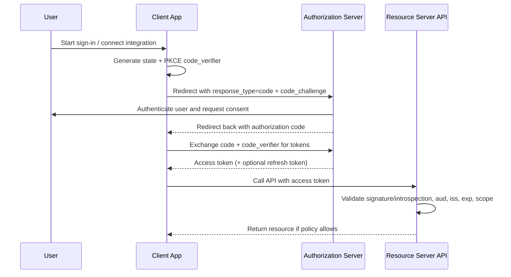
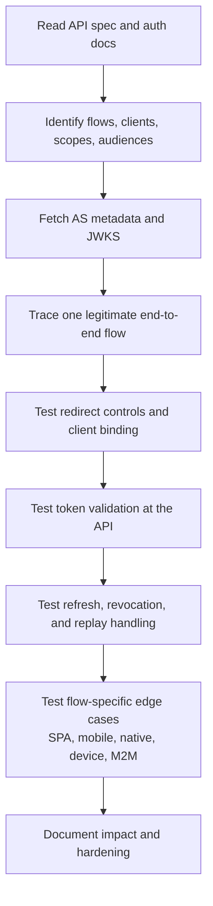

# OAuth Security

> **OAuth security in APIs is about controlling who can obtain tokens, what those tokens can do, where they can be used, and how quickly you can stop replay when those tokens leak.**

---

## 1. Overview

OAuth 2.0 is a **delegated authorization framework**. In plain English, it lets one application obtain limited access to an API **without collecting the user's password**.

That sounds simple, but real API environments make it messy:

- browsers, mobile apps, CLIs, and backends all use different flows
- OAuth is often mixed with login, federation, and API gateways
- bearer tokens are powerful and replayable if stolen
- many production incidents involve **valid tokens used in the wrong place**, not a flashy payload exploit

For an API tester, OAuth work is not just “does login work?” It is:

1. mapping the trust boundaries
2. checking how tokens are issued
3. checking how APIs validate and constrain those tokens
4. checking what happens when tokens are replayed, rotated, revoked, or mis-scoped

### 🧠 Beginner mental model

Think of OAuth as a ticket system:

- the **Authorization Server** issues the ticket
- the **Client** asks for the ticket
- the **Resource Server** checks the ticket
- the **User** decides whether access should be granted

If the ticket can be copied, sent to the wrong service, or never expires, the API problem is no longer “authentication” alone — it becomes an **authorization and token handling** problem too.

### Core roles

| Role | What it does | API example |
| --- | --- | --- |
| Resource Owner | Owns the data or approves access | A user authorizing a mobile banking app |
| Client | Requests tokens | SPA, mobile app, backend service, CLI |
| Authorization Server (AS) | Authenticates user/client and issues tokens | `auth.example.com` |
| Resource Server (RS) | API that accepts tokens | `api.example.com` |

### Token and artifact quick reference

| Artifact | Purpose | Typical lifetime | Main security concern |
| --- | --- | --- | --- |
| Authorization code | Temporary artifact returned after user approval | Very short | Interception or injection if not bound correctly |
| Access token | Presented to the API | Short-lived | Replay if stolen |
| Refresh token | Gets new access tokens | Longer-lived | Persistent access if leaked |
| ID token | Identity statement for the client in OIDC | Short-lived | Confusing identity with API authorization |

**Important:** OAuth itself is about **authorization**. If you see ID tokens, identity claims, or “Login with X”, you are already in OAuth-plus-federation territory, often overlapping with OIDC.

---

## 2. Why It Matters

OAuth sits at the center of modern API ecosystems:

- third-party integrations
- mobile app login
- single-page applications
- B2B service integrations
- device and CLI authorization
- cloud and SaaS delegated access

That also means it sits at the center of modern failure patterns.

### Why defenders care so much

| Theme | Why it matters in APIs |
| --- | --- |
| Bearer token replay | If possession is enough, theft often becomes immediate API access |
| Over-privileged scopes | A valid token can unlock much more data than intended |
| Audience confusion | A token for one API may be wrongly accepted by another |
| Long-lived refresh tokens | Small leaks become durable access |
| Loose redirect handling | Codes or tokens can be exposed before they ever reach the API |
| OAuth used as login glue | Identity assumptions can break account linking and authorization logic |

The API pentesting plan for this repository explicitly emphasizes **valid-account abuse**, **token replay**, **refresh token rotation**, **sender-constrained tokens**, and **device-code/token capture themes**. That is exactly the right mindset: many real incidents are not exotic parser bugs — they are trust failures around identity and tokens.

---

## 3. How OAuth Appears in APIs

In real assessments, OAuth usually shows up in four places at once:

1. the **API spec**
2. authorization server metadata
3. client-side traffic or app configuration
4. backend/API validation logic

### OpenAPI / API-spec view

If the API publishes an OpenAPI definition, start there.

```yaml
components:
  securitySchemes:
    oauth:
      type: oauth2
      flows:
        authorizationCode:
          authorizationUrl: https://auth.example.com/oauth2/authorize
          tokenUrl: https://auth.example.com/oauth2/token
          refreshUrl: https://auth.example.com/oauth2/token
          scopes:
            notes:read: Read notes
            notes:write: Modify notes
security:
  - oauth:
      - notes:read
```

That snippet already tells you a lot:

- the API expects OAuth 2.0
- the documented flow is `authorizationCode`
- there is a token endpoint and probably refresh support
- the API claims to enforce scopes

### Minimal protocol view

Even when the API spec is high-level, it helps to reduce OAuth to a concrete request chain:

```http
# Step 1: Browser is redirected to the authorization endpoint
GET /oauth2/authorize?
    response_type=code&
    client_id=notes-web&
    redirect_uri=https%3A%2F%2Fapp.example.com%2Fcallback&
    scope=notes%3Aread&
    state=RANDOM_CSRF_VALUE&
    code_challenge=BASE64URL_SHA256(verifier)&
    code_challenge_method=S256 HTTP/1.1
Host: auth.example.com

# Step 2: Client exchanges the code for tokens
POST /oauth2/token HTTP/1.1
Host: auth.example.com
Content-Type: application/x-www-form-urlencoded

grant_type=authorization_code&
code=AUTH_CODE&
redirect_uri=https%3A%2F%2Fapp.example.com%2Fcallback&
client_id=notes-web&
code_verifier=ORIGINAL_RANDOM_VERIFIER

# Step 3: Client calls the API with the access token
GET /v1/notes HTTP/1.1
Host: api.example.com
Authorization: Bearer ACCESS_TOKEN
```

That is the simplest end-to-end lens for testing:

- was the authorization request bound correctly?
- was the code exchanged safely?
- is the resulting token accepted only where it should be?

### Metadata and discovery endpoints

Common places to inspect during an authorized test:

| Location | Why it matters |
| --- | --- |
| OpenAPI `securitySchemes` | Documents flows, scopes, and sometimes auth URLs |
| `/.well-known/openid-configuration` | Common discovery source even when the target says “OAuth login” |
| `/.well-known/oauth-authorization-server` | Authorization server metadata |
| `jwks_uri` | Tells you where signing keys are published |
| Revocation/introspection endpoints | Shows whether token lifecycle controls exist |
| Consent UI and client registration | Reveals scopes, redirect URIs, and grant types |

### Minimal authorized recon commands

```bash
# Discovery metadata
curl -s https://auth.example.com/.well-known/openid-configuration | jq .

# OAuth authorization server metadata
curl -s https://auth.example.com/.well-known/oauth-authorization-server | jq .

# OpenAPI security schemes
curl -s https://api.example.com/openapi.json | jq '.components.securitySchemes'
```

These are safe, high-value first steps in an **authorized** assessment because they document intended behavior before you test implementation details.

### 📊 Diagram — Authorization Code + PKCE in an API environment



### A crucial API lesson

> **OAuth success does not equal API authorization success.**
>
> A token can be genuine and still be too broad, for the wrong audience, tied to the wrong client, or accepted by an endpoint that should require stronger policy.

---

## 4. How an Authorized Tester Validates It

The API-section spec for this repository recommends that each note explain **how an authorized tester validates the issue**. For OAuth, that means following a structured, defensive workflow instead of jumping straight to “attack tricks”.

### 4.1 Build the trust map first

Before sending test traffic, map:

- which authorization servers exist
- which clients exist per platform/environment
- which APIs accept which tokens
- which grant types are actually enabled
- where scopes, audiences, and consent are defined
- where revocation, logout, and refresh happen

### 📊 Diagram — OAuth testing workflow for APIs



### 4.2 Validate the documented flow against reality

A common problem is **documentation drift**. The OpenAPI spec may say one thing while the platform actually behaves differently.

| What to compare | Questions to ask |
| --- | --- |
| OpenAPI flow vs live flow | Does the app really use `authorizationCode`, or is there still an old implicit flow path? |
| Scope list vs API behavior | Are undocumented scopes accepted? Are documented scopes ignored? |
| Metadata endpoints vs token contents | Do `issuer`, `jwks_uri`, and token claims line up? |
| Registered redirect URIs vs runtime behavior | Is the AS enforcing only the documented/registered callbacks? |
| Token type vs API acceptance | Does the API accept access tokens only, or does it mistakenly accept ID tokens too? |

### 4.3 Test redirect-based flow protections safely

This is one of the highest-value areas in OAuth testing.

#### What good looks like

- exact redirect URI matching
- transaction-specific `state`
- PKCE for public clients, preferably `S256`
- consistent issuer binding when multiple authorization servers exist
- no open redirectors in OAuth-related paths

#### Safe validation checklist

| Control | Safe authorized validation | Healthy behavior |
| --- | --- | --- |
| `state` handling | Start multiple login attempts in your own test account and confirm callback values are one-time, session-bound, and rejected when mismatched | Callback rejected if `state` is missing or wrong |
| PKCE enforcement | Observe whether public clients send `code_challenge` and whether token exchange requires matching `code_verifier` | Public clients cannot redeem codes without PKCE |
| Redirect URI validation | Use only approved test client registrations and verify that unregistered benign callback variants are rejected | Exact match required, except documented native-app localhost cases |
| Open redirect exposure | Review client/AS redirect endpoints for arbitrary forwarding behavior using harmless internal test URLs | OAuth endpoints do not forward codes/tokens to arbitrary URLs |
| Multi-AS confusion | If multiple IdPs are supported, verify responses are bound to the correct issuer | Wrong-issuer responses are rejected |

### 4.4 Validate token controls at the API layer

This is where OAuth becomes **API security**, not just identity plumbing.

#### Minimum token checks every API should perform

| Check | Why it matters |
| --- | --- |
| Signature or introspection validity | Rejects forged or expired tokens |
| `iss` | Prevents accepting tokens from the wrong issuer |
| `aud` / resource binding | Prevents cross-API token reuse |
| `exp`, `nbf`, `iat` | Prevents stale or early use |
| Scope / permissions | Enforces least privilege |
| Client binding where relevant | Prevents tokens from one client being replayed by another |

#### Practical authorized tests

| Test focus | What to validate safely |
| --- | --- |
| Audience restriction | Confirm a token minted for API A is rejected by API B in your test environment |
| Scope enforcement | Use two test tokens with different scopes and verify endpoint decisions actually differ |
| ID token misuse | Confirm resource APIs do not accept ID tokens in place of access tokens |
| Expiry handling | Verify expired tokens are rejected consistently across gateway and backend |
| Introspection consistency | If gateway introspects but backend trusts headers, confirm there is no policy mismatch |

### 4.5 Validate refresh-token lifecycle

Refresh tokens deserve separate attention because they turn a short-lived access model into a long-lived trust model.

#### What to look for

- rotation enabled or not
- reuse detection present or not
- revocation endpoint available or not
- token family invalidation behavior
- device/session binding strength
- visibility in logs, mobile storage, browser storage, or crash dumps

#### Why rotation matters

Per the OAuth Security BCP and vendor guidance, refresh token rotation reduces replay value by issuing a new refresh token every time one is used. Reuse detection can then flag that an already-spent token came back.

| Refresh behavior | Risk |
| --- | --- |
| One static long-lived refresh token | High replay value if leaked |
| Rotation without reuse detection | Better, but still weaker against duplicate use |
| Rotation with family invalidation | Stronger replay detection and containment |
| Rotation plus sender-constraining | Best modern posture for high-value use cases |

### 4.6 Validate flow-specific caveats

Different OAuth flows fail in different ways.

| Flow | Typical API use | What an authorized tester should validate | Current security posture |
| --- | --- | --- | --- |
| Authorization Code + PKCE | SPAs, mobile, native, modern web apps | PKCE enforced, `state`/issuer binding, exact redirects, short-lived codes | Recommended |
| Client Credentials | Service-to-service APIs | Narrow scopes, audience restriction, strong client auth, secret/cert rotation | Recommended for M2M when hardened |
| Device Authorization | TVs, CLIs, kiosks | Code lifetime, polling interval enforcement, consent clarity, monitoring for abuse | Useful but sensitive |
| Native App | Mobile/desktop | External browser use, loopback/custom-scheme safety, PKCE | Recommended with RFC 8252 practices |
| Implicit | Legacy browser apps | Confirm it is not still enabled or accepted | Deprecated / discouraged |
| Resource Owner Password Credentials | Legacy internal or migration paths | Confirm it is removed or strictly isolated | Not recommended |

### 4.7 Validate service-to-service OAuth separately

Client credentials flows are often treated as “safe because no user is involved”. That is exactly why they become dangerous.

Check whether:

- each service has its own client identity
- non-production and production clients are separated
- secrets or certificates rotate cleanly
- scopes are service-specific rather than global
- tokens are audience-restricted to the intended API
- logs make it possible to distinguish one service caller from another

### 4.8 Validate modern replay protections

Bearer tokens are easy to deploy because possession is enough. That is also their weakness.

Modern defenses to assess:

| Control | Purpose | What to verify |
| --- | --- | --- |
| DPoP | Binds token use to a client-held key at the application layer | API actually verifies proof and rejects replayed/invalid proofs |
| mTLS-bound tokens | Binds token to client certificate | Token is unusable without the bound certificate |
| Token protection / device binding | Reduces replay from other devices | Platform enforces token use from the intended device/context |
| Audience restriction | Limits blast radius of leakage | Token cannot be replayed across unrelated APIs |

### 4.9 Validate high-risk business workflows around OAuth

OAuth flaws often appear in workflows rather than endpoints:

- “Connect your Google/Microsoft account”
- account linking
- delegated admin approval
- consent grants to third-party integrations
- device authorization in CLI/admin workflows
- long-lived offline access for automation

A safe authorized assessment should confirm that these flows:

- clearly show what is being authorized
- require appropriate user verification for sensitive linking
- do not silently escalate scopes
- log consent, approval, linking, and revocation events
- can be revoked without waiting for token expiry

---

## 5. Common Weakness Patterns

This section stays high-level on purpose: the goal is to help testers and defenders recognize patterns without turning the note into an abuse playbook.

| Weakness pattern | What it means in practice | Safe validation idea |
| --- | --- | --- |
| Missing or weak PKCE | Stolen authorization codes may be redeemable | Verify public clients cannot complete code exchange without the correct verifier |
| Loose redirect URI validation | Codes/tokens may be sent somewhere unintended | Confirm only exact pre-registered callbacks are accepted |
| Missing `state` or weak request binding | Login/consent flow can be completed in the wrong browser state | Verify callback requests are rejected when transaction binding is broken |
| Token leakage in URLs, logs, or Referer | Secrets escape even if crypto is correct | Inspect browser history, proxy logs, and third-party requests in a test flow |
| Over-broad scopes | Valid token has more power than needed | Compare granted scopes with actual endpoint access |
| Audience confusion | One token works against multiple APIs | Test with separate test APIs/tenants and verify strict rejection |
| ID token accepted as API bearer | Identity token becomes an API credential | Confirm RS accepts only proper access tokens |
| Static long-lived refresh tokens | Leak becomes persistent access | Review refresh behavior over time and after reuse/revocation |
| No sender-constraining for sensitive APIs | Stolen bearer tokens remain usable elsewhere | Assess whether DPoP/mTLS/device binding is needed but absent |
| Legacy implicit or password flow still enabled | Old compatibility path widens risk | Confirm deprecated flows are disabled end to end |
| Weak issuer binding in federated environments | Wrong IdP responses may be trusted | Validate issuer checks when multiple authorization servers exist |

### Advanced failure modes worth understanding

| Failure mode | Why advanced testers care |
| --- | --- |
| Mix-up attacks | Matter when a client talks to more than one authorization server |
| Code injection / response confusion | A real risk if callback handling is loosely bound to transaction state |
| PKCE downgrade or weak methods | “PKCE supported” is not the same as “PKCE required and enforced safely” |
| Gateway/backend validation mismatch | One layer may trust headers or claims the other layer would reject |
| Consent and linking confusion | Identity workflows can become authorization failures if claims are trusted blindly |

---

## 6. Common Impact

OAuth security issues often create **clean-looking malicious traffic**. The requests are authenticated, syntactically valid, and sometimes fully signed. That makes impact especially serious.

| Impact | Example outcome |
| --- | --- |
| Token replay | Stolen token used to call APIs from another client or device |
| Cross-resource access | Token for one API reused against another API |
| Privilege expansion | Broader scopes or claims unlock stronger API operations |
| Persistent unauthorized access | Leaked refresh token keeps renewing access |
| Account linking confusion | User is logged into or linked with the wrong identity |
| Third-party integration abuse | Excessive or unrevoked delegated access to sensitive APIs |
| Monitoring blind spots | “Looks like a valid user” delays detection and response |

---

## 7. Detection Ideas

Strong OAuth design should be paired with strong telemetry.

### What defenders should log

| Event | Why it helps |
| --- | --- |
| Authorization request and consent events | Shows which client asked for what |
| Token issuance events | Lets you correlate user, client, scope, audience, and device |
| Refresh token exchange events | Needed for replay and token-family analysis |
| Revocation and logout events | Confirms lifecycle controls are used |
| DPoP / mTLS failures | Signals replay or client-binding problems |
| API authorization failures by scope/audience | Reveals misconfigured clients and active probing |
| Account linking / consent grant changes | High-value events for detection |

### Practical detection patterns

- alert on refresh-token reuse or token-family invalidation
- alert when the same token or session appears from inconsistent device/network contexts
- alert on tokens used against the wrong audience or resource
- alert on clients suddenly requesting broader scopes than normal
- review device-code and third-party consent workflows for unusual approval spikes
- monitor for APIs accepting expired, wrong-audience, or ID-token traffic that should never succeed

### Defensive mental model

> **If an attacker steals a valid OAuth artifact, your first question should not be “can they log in?”**
>
> It should be: **how far can they move before the API notices, contains, or revokes the trust?**

---

## 8. Mitigation and Hardening

The major public guidance is very consistent here: modern OAuth security is mostly about **safer defaults, tighter binding, and shorter trust windows**.

### Hardening priorities

| Priority | Recommendation | Why |
| --- | --- | --- |
| 1 | Prefer Authorization Code + PKCE for public clients | Reduces code interception/injection risk |
| 2 | Use exact redirect URI matching | Prevents code/token leakage via loose callbacks |
| 3 | Disable implicit and avoid password grant | Removes older, weaker patterns |
| 4 | Enforce `iss`, `aud`, `exp`, and scope at the API | Prevents cross-context token acceptance |
| 5 | Use short-lived access tokens | Shrinks replay window |
| 6 | Rotate refresh tokens and detect reuse | Limits persistence after leakage |
| 7 | Use sender-constrained tokens for sensitive APIs | Makes stolen tokens less reusable |
| 8 | Separate clients by app, environment, and trust level | Reduces blast radius |
| 9 | Use external browsers for native apps | Aligns with modern native-app guidance |
| 10 | Log consent, linking, refresh, and revocation events | Improves containment and response |

### Practical hardening checklist

```text
[ ] Public clients use Authorization Code + PKCE (S256)
[ ] Authorization server enforces exact redirect URI matching
[ ] Deprecated implicit and password grant paths are disabled
[ ] APIs reject ID tokens as bearer credentials
[ ] APIs verify issuer, audience, expiry, and scopes/permissions
[ ] Access tokens are short-lived and audience-restricted
[ ] Refresh tokens rotate and reuse is detectable
[ ] Sensitive APIs use DPoP, mTLS, or equivalent token binding where feasible
[ ] Separate client registrations exist for prod/non-prod and per platform
[ ] Consent, linking, revocation, and device flows are auditable
```

### Storage and lifecycle guidance

- keep tokens out of URLs
- avoid casual long-term storage of high-value tokens
- make revocation real, not purely theoretical
- ensure gateway and backend validate the same security properties
- design for token theft as an expected incident, not an impossible one

---

## 9. Protocol-Specific Caveats

### SPA caveats

- “Works in the browser” is not the same as “safe for the browser”
- silent auth changes and browser privacy controls affect token handling design
- avoid legacy implicit assumptions
- watch for token exposure through frontend logging, browser storage, and third-party scripts

### Native app caveats

Per RFC 8252, native apps should use the system browser or another external user-agent, not embedded credential collection patterns that collapse trust boundaries.

### Device authorization caveats

Device flows are useful, but they create a human approval step that must be monitored carefully. A secure implementation needs:

- short-lived device codes
- enforced polling intervals
- clear consent text
- strong detection around suspicious approvals

### Service identity caveats

OAuth for machines is still identity and authorization. Over-trusted service identities can become the cleanest path to broad API access.

---

## 10. Related Notes

- `api-authentication-models.md`
- `token-authentication.md`
- `jwt-security.md`
- `oidc-security.md`
- `authorization-flows.md`
- `service-to-service-authentication.md`
- `sender-constrained-tokens.md`
- `refresh-token-rotation.md`

---

## 11. References

Reputable public sources used or aligned with this note:

- RFC 6749 — OAuth 2.0 Authorization Framework  
  `https://datatracker.ietf.org/doc/html/rfc6749`
- RFC 7636 — Proof Key for Code Exchange (PKCE)  
  `https://datatracker.ietf.org/doc/html/rfc7636`
- RFC 8252 — OAuth 2.0 for Native Apps  
  `https://datatracker.ietf.org/doc/html/rfc8252`
- RFC 9449 — OAuth 2.0 Demonstrating Proof of Possession (DPoP)  
  `https://datatracker.ietf.org/doc/html/rfc9449`
- RFC 9700 — OAuth 2.0 Security Best Current Practice  
  `https://datatracker.ietf.org/doc/html/rfc9700`
- OWASP OAuth 2.0 Protocol Cheatsheet  
  `https://github.com/OWASP/CheatSheetSeries/blob/master/cheatsheets/OAuth2_Cheat_Sheet.md`
- PortSwigger Web Security Academy — OAuth overview  
  `https://portswigger.net/web-security/oauth`
- Auth0 — Sender Constraining  
  `https://auth0.com/docs/secure/sender-constraining`
- Auth0 — Refresh Token Rotation  
  `https://auth0.com/docs/secure/tokens/refresh-tokens/refresh-token-rotation`
- Microsoft Learn — Token Protection  
  `https://learn.microsoft.com/en-us/entra/identity/conditional-access/concept-token-protection`

---

## 12. If You Remember Only a Few Things

1. **OAuth is not just login; it is delegated API trust.**
2. **A valid token can still be wrong for the API, audience, scope, client, or device.**
3. **Authorization Code + PKCE is the modern default for public clients.**
4. **Refresh token rotation and sender-constraining matter because token theft is realistic.**
5. **Great OAuth security is measured by how well the system contains replay, drift, and misuse after issuance — not just by whether the user can sign in.**
