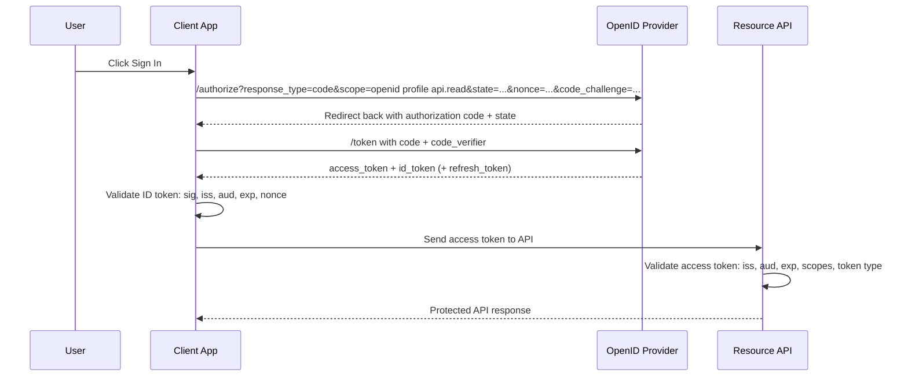
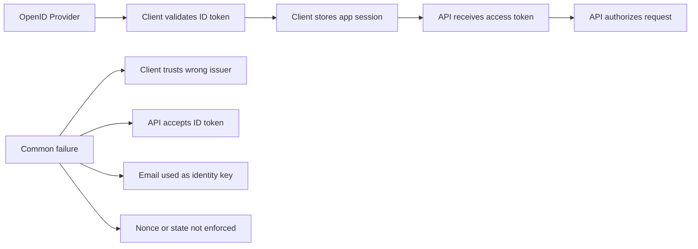

# OIDC Security

> **OpenID Connect (OIDC) is the identity layer on top of OAuth 2.0 — OAuth answers “what can this client access?”, while OIDC adds “who just authenticated?”**

---

## 🧠 What Is It? (Beginner Explanation)

Imagine a company campus with two different badges:

- **Access badge** = lets you enter approved rooms
- **Identity badge** = proves who you are

In API ecosystems, **OAuth access tokens** are the access badge. They are meant for APIs.

**OIDC ID tokens** are the identity badge. They are meant for the client application so it can understand who signed in.

That difference is one of the most important OIDC security lessons:

- **Client validates the ID token**
- **API validates the access token**
- **An ID token should not be treated as an API bearer token**

For authorized API testing, OIDC matters because many real systems mix together:

- browser or mobile login
- API access with bearer tokens
- third-party identity providers
- account linking
- logout and session management
- key rotation and discovery metadata

When those trust boundaries blur, authentication bugs quickly become **broken authentication, account mix-up, token misuse, or authorization bypass**.

> **Authorized testing only:** The goal is to validate identity flows, token handling, and defensive controls in systems you are explicitly permitted to assess.

---

## ⚖️ OAuth vs OIDC at a Glance

| Topic | OAuth 2.0 | OIDC |
|---|---|---|
| Primary purpose | Authorization | Authentication + identity layer on top of OAuth |
| Main question answered | “What can this client do?” | “Who is the authenticated user?” |
| Main token for APIs | Access token | Access token |
| Main token for client identity | Not defined by OAuth itself | ID token |
| Typical extra endpoints | Authorize, token | Authorize, token, UserInfo, discovery, JWKS |
| API security risk | Over-broad scope, replay, wrong audience | All OAuth risks plus identity mix-up, bad claim validation, trusting the wrong issuer |

**Easy rule to remember:**

- **Access token → resource server / API**
- **ID token → relying party / client app**

---

## 📊 Diagram

### OIDC Authorization Code + PKCE Flow for APIs



### Trust Boundary to Remember



---

## 🏗️ Core OIDC Building Blocks

### Important Endpoints and Artifacts

| Component | What it does | Why testers care |
|---|---|---|
| `/.well-known/openid-configuration` | Publishes issuer metadata and endpoints | Shows supported flows, signing algs, JWKS URI, logout endpoints |
| Authorization endpoint | Starts login/consent flow | Check `response_type`, `scope`, `state`, `nonce`, `redirect_uri`, PKCE |
| Token endpoint | Exchanges code for tokens | Check code reuse protection, PKCE enforcement, client auth, refresh handling |
| `jwks_uri` | Publishes public signing keys | Review `kid`, algs, rotation behavior, cache handling |
| UserInfo endpoint | Returns profile claims via access token | Check scope-to-claim mapping and privacy exposure |
| ID token | Proves authentication to client | Validate signature and claims correctly |
| Access token | Grants API access | Confirm the API expects this, not the ID token |
| Refresh token | Gets new access tokens | High-value credential; check rotation, replay detection, storage controls |

### Discovery Example

```http
GET /.well-known/openid-configuration HTTP/1.1
Host: login.example.com
```

Typical fields worth reviewing:

```json
{
  "issuer": "https://login.example.com",
  "authorization_endpoint": "https://login.example.com/authorize",
  "token_endpoint": "https://login.example.com/oauth/token",
  "userinfo_endpoint": "https://login.example.com/userinfo",
  "jwks_uri": "https://login.example.com/.well-known/jwks.json",
  "response_types_supported": ["code"],
  "subject_types_supported": ["public", "pairwise"],
  "id_token_signing_alg_values_supported": ["RS256"]
}
```

For API assessments, compare discovery metadata against the **OpenAPI or API specification**:

- documented auth flow vs actual behavior
- expected scopes vs observed scopes
- issuer and audience values vs what APIs enforce
- whether the spec incorrectly implies that an ID token can call APIs

---

## 🔍 ID Token Anatomy

An ID token is usually a JWT. It commonly contains identity claims such as:

```json
{
  "iss": "https://login.example.com",
  "sub": "248289761001",
  "aud": "client-123",
  "exp": 1735689600,
  "iat": 1735686000,
  "nonce": "n-0S6_WzA2Mj",
  "auth_time": 1735685980,
  "email": "alice@example.com",
  "email_verified": true,
  "amr": ["pwd", "mfa"]
}
```

### Claims That Matter Most

| Claim | Meaning | Security importance |
|---|---|---|
| `iss` | Issuer | Must match the trusted OpenID Provider exactly |
| `sub` | Subject identifier | Best stable identity key; safer than email for account mapping |
| `aud` | Audience | Must match the client application's `client_id` |
| `exp` | Expiry | Expired ID tokens must be rejected |
| `iat` / `nbf` | Issued-at / not-before | Helps detect stale or premature tokens |
| `nonce` | Anti-replay value bound to login request | Critical for browser-based login flows |
| `auth_time` | Time user authenticated | Important when reauthentication is required |
| `azp` | Authorized party | Important when multiple audiences or brokered flows exist |
| `acr` / `amr` | Assurance / auth methods | Useful for checking MFA or step-up claims, but only if semantics are understood |
| `email` | User email | Helpful for UX, but risky as the primary identity key |
| `email_verified` | Email verification state | Must be checked before account linking decisions |

### The Identity Mapping Rule

If you remember one thing, remember this:

- **Use `sub` as the durable identity key**
- **Use `email` as an attribute, not as the root of trust**

Why? Email can change, be unverified, be aliased, or be handled differently across identity providers and tenants. `sub` is designed to be the provider's stable subject identifier.

### Advanced Details Worth Recognizing

| Detail | Why it matters |
|---|---|
| `at_hash` | In flows where an access token is returned alongside the ID token, helps bind the access token to that authentication response |
| `c_hash` | In hybrid-style responses, helps bind the authorization code to the ID token |
| `sid` | Useful for session correlation and logout-related reviews |
| `subject_types_supported` | Tells you whether the provider uses `public` or `pairwise` subject identifiers |

**Pairwise subject identifiers** are especially important in privacy-sensitive designs. They reduce cross-client correlation by giving the same person different `sub` values for different relying parties.

---

## ⚙️ Validation Logic: What Good OIDC Looks Like

### Client-Side ID Token Validation

A relying party or client application should validate:

1. **signature** using trusted issuer keys from JWKS
2. **issuer (`iss`)** exactly matches the configured provider
3. **audience (`aud`)** matches the client application's `client_id`
4. **expiry (`exp`)** and any relevant time claims
5. **nonce** matches the login transaction that started in this browser or app session
6. **authorized party (`azp`)** when relevant
7. **authentication context claims** only if the application depends on them

### API-Side Validation

The API should independently validate the **access token**, including:

- issuer
- audience / resource indicator
- expiry
- signature or introspection result
- scopes / roles
- sender-constraining information if used (`cnf`, DPoP, mTLS binding)

**Important:** A secure OIDC login flow does **not** guarantee secure API authorization.

The API still needs:

- object-level authorization
- function-level authorization
- property-level authorization
- business-rule validation

---

## 🧩 Common OIDC Security Mistakes in API Environments

### 1. Using the ID Token as an API Token

This is extremely common in mobile, SPA, and gateway-heavy architectures.

**Why it is dangerous:**

- the ID token audience is the client, not the API
- scopes may not describe API permissions
- APIs may accidentally treat identity proof as authorization proof
- downstream services may inherit an invalid trust assumption

**What good looks like:**

- client uses the ID token locally
- client sends the access token to the API
- API rejects ID tokens presented in `Authorization: Bearer ...`

### 2. Missing or Weak `nonce`

`nonce` helps bind the ID token to the authentication request that started in the user's current session.

Without strong nonce handling, clients are more exposed to:

- replay of old ID tokens
- login/session confusion
- mix-up across browser tabs or parallel login attempts

### 3. Missing or Weak `state`

`state` is an OAuth/OIDC transaction-binding value used to prevent cross-site request forgery and authorization response mix-up.

A practical distinction:

- **`state` protects the flow**
- **`nonce` protects the ID token**

Both matter in browser-based OIDC implementations.

### 4. Trusting Email Instead of Subject

If the application links accounts purely on `email`, especially without checking `email_verified`, account confusion or unauthorized linking becomes much more likely.

### 5. Accepting the Wrong Issuer or Tenant

Multi-tenant identity setups are powerful but dangerous.

Failure modes include:

- app accepts tokens from any tenant instead of approved tenants
- app trusts user-controlled issuer values during discovery
- app mixes test and production identity providers
- client supports multiple providers but does not bind the response to the intended issuer

### 6. Loose `redirect_uri` Handling

OIDC inherits OAuth redirect risks.

Defensively, the authorization server should use:

- exact redirect URI matching
- no wildcards for sensitive clients
- no dependency on open redirects in the relying party
- short-lived, single-use authorization codes

### 7. Weak Discovery and JWKS Trust

OIDC discovery is useful, but trust still has to be anchored.

Problems appear when applications:

- fetch metadata from unapproved issuers
- treat user input as a trusted issuer URL
- over-trust remote JWKS without issuer binding
- cache keys forever and fail on rotation
- accept unsupported or unexpected signing algorithms

### 8. Ignoring Session and Logout Semantics

OIDC login may be correct while logout remains inconsistent.

Examples of defensive review areas:

- RP logout clears the local session but leaves refresh tokens active
- OP logout happens, but the app session continues unchanged
- session timeout at the app does not match identity timeout expectations
- front-channel or back-channel logout is documented but not enforced consistently

---

## 📋 Recommended Flows for Modern API Clients

| Client type | Recommended approach | Why |
|---|---|---|
| Server-rendered web app | Authorization Code Flow | Server can protect client secret; clean separation of sessions and tokens |
| SPA | Authorization Code + PKCE | Public client needs PKCE; avoids legacy implicit flow risks |
| Native mobile app | Authorization Code + PKCE | Protects authorization code against interception better than plain code flow |
| Machine-to-machine service | OAuth client credentials, not OIDC user login | Usually no end-user identity is involved |
| CLI / device workflows | Device Authorization + careful phishing-resistant UX | Common in enterprise tools but needs strong user-verification messaging |

### Legacy Flows to Treat Carefully

| Flow | Status | Main concern |
|---|---|---|
| Implicit flow | Legacy / discouraged for new builds | Tokens exposed to browser context and URL handling risks |
| Hybrid flow | Specialized use only | More moving parts, more validation complexity |
| Resource owner password flow | Deprecated in modern identity programs | Breaks federation and centralizes password risk |

---

## 🛠️ Practical Authorized Testing Methodology

The goal is not to “break login for the sake of it.” The goal is to verify that the organization's identity trust chain is correct.

### Phase 1: Map the Identity Architecture

Document:

- which OpenID Provider issues tokens
- which clients rely on it
- which APIs consume access tokens
- what audiences and scopes exist
- whether multiple issuers, tenants, or environments are in play
- whether the OpenAPI spec matches reality

### Phase 2: Inspect Discovery and JWKS

Check:

- issuer value
- supported response types and grant types
- signing algorithms
- JWKS key identifiers and rotation behavior
- whether logout endpoints are published
- whether metadata exposes legacy or unnecessary features

### Phase 3: Observe a Normal Login

In an approved environment, capture the normal sequence:

1. authorize request
2. callback response
3. token exchange
4. ID token validation in the client
5. access token use at the API

This shows whether the system really uses OIDC the way the documentation claims.

### Phase 4: Run Controlled Negative Tests

Perform only approved validation tests that prove the system rejects bad states.

| Test area | Safe negative test | Expected secure result |
|---|---|---|
| `state` binding | Send a callback with missing or mismatched `state` in staging | Login flow aborts; no session created |
| `nonce` binding | Reuse an older ID token or mismatch the stored nonce in a lab flow | Client rejects token |
| Audience separation | Present an ID token to an API endpoint in a test environment | API rejects it |
| Issuer binding | Use a token from an unapproved issuer or tenant in a controlled lab | Client/API rejects it |
| Code replay | Redeem the same authorization code twice in staging | Second attempt fails |
| Redirect URI validation | Change path/query/host to a non-registered value | Authorization server blocks request |
| Key rotation handling | Simulate or observe `kid` rotation in test | Verifier fetches new keys or safely rejects unknown key |
| Account linking | Attempt link flow with unverified or mismatched email in lab | Linking requires stronger identity checks |

### Phase 5: Verify API Authorization Separately

After authentication is confirmed, review whether the API still enforces:

- object ownership
- tenant isolation
- role checks
- property visibility
- transaction approvals / business rules

OIDC can authenticate a user perfectly while the API still suffers from BOLA, broken function-level authorization, or excessive data exposure.

---

## 🔬 Safe Hands-On Checks and Commands

### 1. Pull OIDC Discovery Metadata

```bash
curl -s https://login.example.com/.well-known/openid-configuration | jq '{
  issuer,
  authorization_endpoint,
  token_endpoint,
  userinfo_endpoint,
  jwks_uri,
  response_types_supported,
  subject_types_supported,
  id_token_signing_alg_values_supported
}'
```

### 2. Review JWKS Keys

```bash
JWKS_URI=$(curl -s https://login.example.com/.well-known/openid-configuration | jq -r '.jwks_uri')
curl -s "$JWKS_URI" | jq '.keys[] | {kid, kty, use, alg}'
```

Look for:

- unexpected algorithms
- missing `use` or confusing key purposes
- stale keys that never rotate
- multiple keys with unclear lifecycle management

### 3. Decode a Lab-Issued ID Token Safely

```bash
export TOKEN='HEADER.PAYLOAD.SIGNATURE'
python3 - <<'PY'
import base64, json, os

def b64url_decode(data):
    data += '=' * (-len(data) % 4)
    return base64.urlsafe_b64decode(data.encode())

token = os.environ['TOKEN']
header, payload, _ = token.split('.')
print('Header:')
print(json.dumps(json.loads(b64url_decode(header)), indent=2))
print('\nPayload:')
print(json.dumps(json.loads(b64url_decode(payload)), indent=2))
PY
```

Then verify whether the observed claims align with what the client and API are supposed to trust.

### 4. Compare the API Specification to Runtime Behavior

```bash
curl -s https://api.example.com/openapi.json | jq '.components.securitySchemes'
```

Questions to answer:

- Does the API spec clearly describe bearer access tokens?
- Does it incorrectly blur ID tokens and access tokens?
- Are scopes documented consistently with the provider configuration?
- Are multiple audiences or issuers documented anywhere?

### 5. Confirm the API Rejects Identity Tokens

In an approved test environment:

```http
GET /v1/account HTTP/1.1
Host: api.example.com
Authorization: Bearer <ID_TOKEN_USED_AS_BEARER>
```

**Expected result:** `401` or `403`, with server-side evidence that the wrong token type or audience was rejected.

---

## 🧪 OIDC Review Checklist for API Pentests

| Area | Questions to answer |
|---|---|
| Discovery | Is the issuer pinned to an approved provider? Are metadata endpoints authentic and expected? |
| Flow security | Are `state`, `nonce`, PKCE, and exact `redirect_uri` validation present where expected? |
| Token separation | Does the client use ID tokens locally and APIs use access tokens? |
| Claim validation | Are `iss`, `aud`, `exp`, `nonce`, and `azp` validated appropriately? |
| Identity mapping | Is `sub` the primary identifier instead of raw email? |
| Multi-tenant safety | Are tenant and issuer restrictions explicit? |
| Key management | Does the verifier handle JWKS rotation safely? |
| Logout | Are RP sessions, refresh tokens, and OP logout behavior consistent? |
| API authorization | After login, do per-object and per-function controls still hold? |

---

## 🚨 What Findings Often Look Like

| Finding | Typical impact | Why it matters |
|---|---|---|
| API accepts ID token as bearer token | Broken authorization model | Identity proof is being confused with resource authorization |
| Client fails to validate `nonce` | Token replay / login confusion | Old or mismatched authentication responses may be accepted |
| App trusts `email` instead of `sub` | Account linking or identity confusion | Mutable attributes become authentication roots |
| Wrong issuer or tenant accepted | Unauthorized federation trust | Tokens from unintended identity sources become valid |
| Overly permissive redirect handling | Code interception risk | Authorization response can be redirected incorrectly |
| No refresh token rotation or replay detection | Long-lived session abuse after token theft | Stolen refresh tokens stay useful |
| Stale JWKS / broken rotation | Auth outages or unsafe fallback behavior | Key lifecycle is part of security, not just availability |

---

## 🕵️ Detection and Logging Ideas

Defenders should monitor for:

- repeated failed `state` or `nonce` checks
- repeated authorization code redemption attempts
- tokens presented to APIs with the wrong audience
- ID tokens presented to resource endpoints
- unexpected issuer or tenant values
- refresh token reuse events
- sudden account linking events after identity-provider changes
- JWKS fetch failures or unexpected `kid` churn

Simple log questions help a lot:

- Which issuers are actually seen in production?
- Which clients still use legacy response types?
- Are APIs seeing bearer tokens whose `aud` does not match them?
- Are refresh tokens being reused from different devices or IP ranges?

---

## 🛡️ Hardening Guidance

| Control | Good practice |
|---|---|
| Flow choice | Prefer Authorization Code + PKCE for public clients; avoid legacy implicit flow for new builds |
| Transaction binding | Always validate strong `state`; use `nonce` for OIDC browser login flows |
| Identity binding | Use `sub` as the durable user key; treat `email` as an attribute |
| Token separation | Never use ID tokens for API authorization |
| Claim validation | Verify `iss`, `aud`, `exp`, `iat`/`nbf`, `nonce`, and `azp` where relevant |
| Redirect safety | Enforce exact redirect URI registration |
| Key trust | Pin trusted issuers, validate alg expectations, handle JWKS rotation safely |
| Refresh security | Use rotation and replay detection; consider sender-constrained tokens where feasible |
| Tenant control | Restrict accepted issuers and tenant contexts explicitly |
| Logout | Align app session logout, OP logout, and token revocation behavior |
| API authorization | Keep least privilege, deny-by-default, and per-object checks independent of login success |

---

## 🧭 Beginner-to-Advanced Mental Model

### Beginner

OIDC helps a client application know **who logged in**.

### Intermediate

OIDC introduces new objects to validate correctly:

- discovery metadata
- ID tokens
- JWKS keys
- UserInfo responses
- logout/session signals

### Advanced

OIDC security is really about **trust binding**:

- is this the right issuer?
- is this the right key?
- is this token for this client?
- is this token fresh for this transaction?
- is this identity mapped safely to the right account?
- is the API still authorizing each action independently?

If those bindings are correct, OIDC is strong. If they are loose, authentication may look polished while trust is fundamentally wrong.

---

## 📚 References

- [OpenID Connect Core 1.0](https://openid.net/specs/openid-connect-core-1_0-final.html)
- [OpenID Connect Discovery 1.0](https://openid.net/specs/openid-connect-discovery-1_0-final.html)
- [RFC 7636 — Proof Key for Code Exchange (PKCE)](https://datatracker.ietf.org/doc/html/rfc7636)
- [OWASP OAuth 2.0 Protocol Cheat Sheet](https://cheatsheetseries.owasp.org/cheatsheets/OAuth2_Cheat_Sheet.html)
- [Auth0 — Authorization Code Flow with PKCE](https://auth0.com/docs/get-started/authentication-and-authorization-flow/authorization-code-flow-with-pkce)
- [Microsoft Identity Platform — ID Tokens](https://learn.microsoft.com/en-us/entra/identity-platform/id-tokens)
