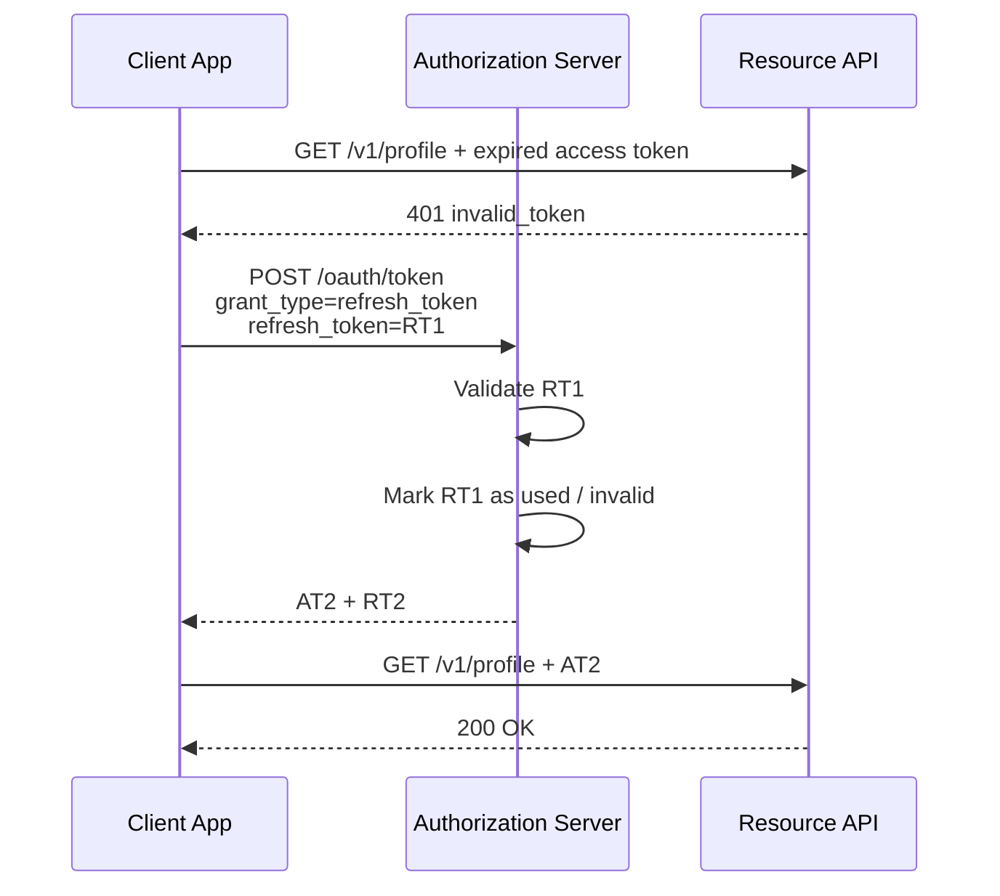
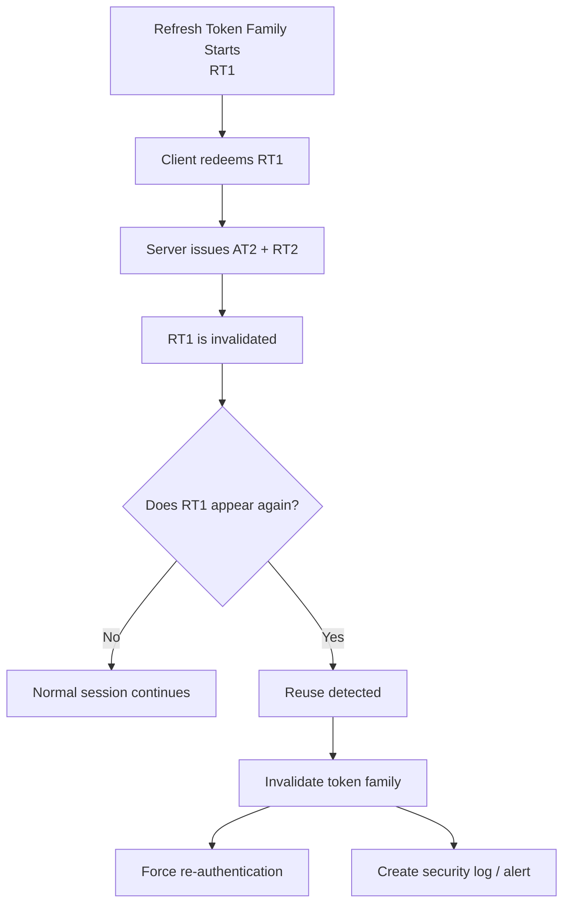
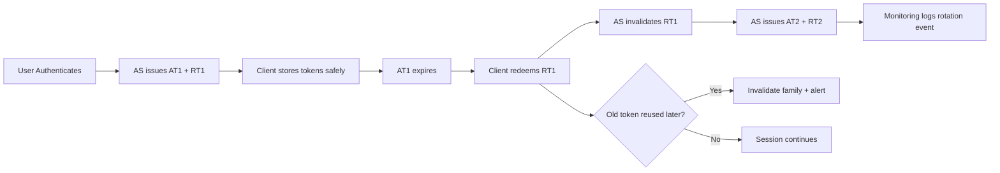

# Refresh Token Rotation

> **Refresh token rotation turns a long-lived refresh token from a reusable “master key” into a one-time credential chain: every successful refresh returns a new refresh token and invalidates the old one. For authorized API testing, this is one of the most important places to verify session resilience, replay detection, and revocation logic.**

---

## 🧠 What Is It? (Beginner Explanation)

When a user logs into an API-backed application, they often receive:

- an **access token** for calling the API right now
- a **refresh token** for getting a new access token later without logging in again

Why two tokens?

- **Access tokens** should be short-lived because they are sent frequently.
- **Refresh tokens** last longer so the user does not have to log in every few minutes.

That creates a problem:

> If a refresh token can be used over and over, anyone who gets a copy may be able to keep renewing access for a long time.

**Refresh token rotation** solves this by making refresh tokens effectively **single-use**:

1. Client sends refresh token `RT1`
2. Authorization server issues new access token `AT2`
3. Authorization server also issues new refresh token `RT2`
4. `RT1` is now invalid

Think of it like an airport pass that self-destructs after you trade it in for a new one.

---

## 🎯 Why It Matters in Authorized API Testing

In real assessments, refresh logic is often weaker than login logic.

A target may:

- rotate tokens but still accept the old one
- issue multiple valid descendants during races
- forget to revoke the whole token family on logout or password reset
- let one client refresh another client’s token
- accidentally expand scopes during refresh

These are not “just auth bugs.” They can become:

- persistent unauthorized sessions
- failed logout / failed account lockout
- replay opportunities
- broken session invalidation after security events

**Testing note:** Keep all work strictly within authorization, your assigned tenant, and your own test identities. Do not attempt to replay or reuse another person’s tokens.

---

## 🏗️ How It Works (Technical Deep Dive)

OAuth 2.0 defines the refresh flow in **RFC 6749 Section 6**:

```http
POST /oauth/token HTTP/1.1
Host: auth.example.com
Content-Type: application/x-www-form-urlencoded

grant_type=refresh_token
&refresh_token=REFRESH_TOKEN_VALUE
&client_id=CLIENT_ID
```

The server responds with a new access token and may also return a new refresh token:

```json
{
  "access_token": "eyJ...",
  "token_type": "Bearer",
  "expires_in": 900,
  "refresh_token": "rt_2_example"
}
```

### Static vs Rotating Refresh Tokens

| Model | What Happens | Risk Level | Tester Focus |
|---|---|---:|---|
| **Static refresh token** | Same refresh token works repeatedly | High | Can one copied token maintain access indefinitely? |
| **Rotating only** | New refresh token issued, old one should fail | Better | Does the previous token truly become invalid? |
| **Rotating + reuse detection** | Old token reuse triggers family invalidation or forced re-auth | Strong | Does replay of an old token trigger a defensive response? |
| **Sender-constrained + rotating** | Token also bound to client proof (mTLS/DPoP) | Strongest | Can another client/device use the token at all? |

### Core Concepts

| Term | Meaning |
|---|---|
| **Access token** | Short-lived token used at the resource server |
| **Refresh token** | Long-lived token used only at the authorization server |
| **Rotation** | Issuing a new refresh token whenever one is redeemed |
| **Token family** | The chain of refresh tokens derived from the original one |
| **Reuse detection** | Detecting that an already-used refresh token appeared again |
| **Revocation event** | Logout, password reset, account disablement, admin sign-out, etc. |

According to **RFC 9700 (OAuth 2.0 Security BCP)**, refresh tokens for public clients should be protected through **sender-constrained tokens** or **refresh token rotation**. That is the standards-based reason this topic matters so much in modern API testing.

---

## 📊 Diagram

### Normal Refresh Rotation



### Reuse Detection / Token Family Invalidation



---

## ⚙️ Technical Details

### Why Rotation Exists

Without rotation, a stolen refresh token may let an attacker continuously renew access.

With rotation:

- each token is worth less because it should work only once
- replay becomes easier to detect
- the authorization server gets a chance to notice anomalies

This is especially important for:

- **SPAs**
- **mobile apps**
- **desktop/native apps**
- any **public client** that cannot safely hold a traditional client secret

### Rotation Does Not Mean “Problem Solved”

Rotation improves security, but it does **not** fix:

- XSS that steals tokens from browser storage
- weak client-side storage choices
- missing logout revocation
- over-scoped tokens
- poor device/session visibility
- missing telemetry

Rotation is one control in a larger session security design.

### Public vs Confidential Clients

| Client Type | Example | Can keep client secret? | Rotation Importance |
|---|---|---:|---|
| **Public client** | SPA, mobile app, desktop app | No | Very high |
| **Confidential client** | Server-side web app, backend worker | Yes | Still important, but client auth adds protection |

### Related Controls

| Control | Purpose | Relationship to Rotation |
|---|---|---|
| **PKCE** | Protects authorization code exchange | Helps before token issuance, not after refresh token theft |
| **DPoP / mTLS** | Sender-constrains tokens to a client proof | Makes stolen tokens harder to reuse |
| **Revocation endpoint** | Lets apps invalidate tokens | Needed for logout / compromise handling |
| **Idle + absolute expiry** | Limits how long refresh tokens survive | Reduces long-tail risk |
| **Device/session inventory** | Shows active sessions to users/admins | Helps investigate reuse events |

---

## 🔍 Practical Authorized Testing Workflow

The goal is **validation**, not abuse. Use a dedicated test account and perform only bounded, documented checks.

### 1) Identify the Token Endpoints and Client Context

Review:

- OpenID Connect discovery document (`/.well-known/openid-configuration`) if present
- API auth documentation
- mobile/web client behavior
- logout / revocation documentation

You want to know:

- token endpoint location
- whether refresh tokens are used at all
- whether the app is a public or confidential client
- whether DPoP, mTLS, device binding, or revocation are supported

### 2) Capture a Baseline Refresh Flow

Using your own account in Postman, Burp Suite, HTTPie, or curl:

```bash
curl -s https://auth.example.com/oauth/token \
  -H "Content-Type: application/x-www-form-urlencoded" \
  --data "grant_type=refresh_token&refresh_token=RT1_PLACEHOLDER&client_id=CLIENT_ID_PLACEHOLDER"
```

Check for:

- new access token issued
- new refresh token issued
- expected scopes preserved
- expected audience preserved
- sane expiry values

### 3) Verify Single-Use Behavior

After redeeming `RT1`, immediately try the same refresh token again in your controlled test session.

**Expected secure behavior:**

- old refresh token is rejected, typically with `invalid_grant`

**Red flag:**

- old refresh token still works

That means rotation is cosmetic rather than real.

### 4) Safely Check Reuse Detection

In a controlled test, use **two authorized client instances** for the **same test account**:

- Client A redeems `RT1` and gets `RT2`
- Client B tries `RT1` afterward

What you are checking is not “can I take over an account,” but:

- does the authorization server recognize old-token reuse?
- does it simply reject the old token?
- does it invalidate the token family?
- does it log the event?

**Stronger behavior:** family invalidation and re-authentication requirement after reuse detection.  
**Weaker behavior:** only the old token fails, while the newest token remains valid.

Document the observed design carefully rather than assuming all products behave identically.

### 5) Test Concurrency / Race Handling

Refresh logic often breaks under simultaneous requests.

Safe test:

- send two near-simultaneous refresh requests with the same old refresh token from your own test account

**Healthy outcomes:**

- one request succeeds, one fails deterministically
- only one descendant refresh token remains valid

**Problematic outcomes:**

- both requests succeed
- multiple valid child refresh tokens exist
- session state becomes inconsistent across regions or nodes

### 6) Test Security Event Revocation

After getting a valid rotated token chain, test whether refresh capability is revoked after:

- logout
- password change
- MFA reset / re-enrollment
- account disablement
- admin “log out all sessions”
- user-initiated session termination

If refresh still works afterward, the app may have **broken session invalidation**.

### 7) Check Binding and Scope Rules

A refresh request should not become a privilege escalation path.

Validate that refresh:

- does **not** increase scopes unless explicitly allowed
- does **not** switch audience/resource silently
- stays bound to the correct `client_id`
- cannot be replayed from a different client context if sender-constrained

### 8) Review Logging and Detection

A mature implementation should log:

- refresh success
- refresh failure
- reuse detection
- family invalidation
- suspicious device/IP changes when relevant

Poor logging makes incident response much harder.

---

## ✅ Tester Checklist

| Check | Secure Result | Red Flag |
|---|---|---|
| Old refresh token reused after redemption | Rejected | Old token still works |
| Reuse detection | Event logged; family or session handled defensively | No alerting, no visible security response |
| Parallel refresh requests | One succeeds, one fails | Two valid descendants |
| Logout / password reset / admin revoke | Refresh chain invalidated | Refresh still works |
| Scope on refresh | Same or narrower | Broader permissions appear |
| Client binding | Wrong client cannot refresh | Different client context accepted |
| Storage / transport | No URL exposure, HTTPS only, safe client storage | Tokens in URLs, logs, weak browser storage patterns |
| Error handling | Controlled errors like `invalid_grant` | Overly verbose responses leaking internals |

---

## 🚨 Common Weaknesses You May Find

### 1) “Rotates” But Previous Token Still Works

This is the most common logic flaw.

The application returns `RT2`, but `RT1` remains valid.  
Effectively, the system behaves like a static refresh token scheme while pretending to rotate.

### 2) Broken Token Family Tracking

The server issues child tokens but does not track lineage well enough to:

- revoke descendants
- handle replay correctly
- respond cleanly to races

This often appears in distributed systems with multiple auth nodes or eventual consistency problems.

### 3) No Revocation After Security-Sensitive Events

Refresh token chains that survive password changes, MFA resets, or admin disablement can keep a compromised session alive.

### 4) Scope or Audience Drift

Refreshing a token should not silently increase privileges.  
If the refreshed token gains stronger scopes, additional APIs, or a different audience, that is a high-value authorization issue.

### 5) Weak Client-Side Storage Decisions

Even good server-side rotation can be undermined if the client stores refresh tokens unsafely:

- browser `localStorage` exposed to XSS
- tokens written to logs
- tokens included in URLs
- long-term plaintext storage on mobile without platform protections

### 6) Missing Detection and Response

If reuse happens and nobody notices, defenders lose one of rotation’s biggest benefits.

---

## 🧪 Example Secure vs Insecure Behavior

### Healthy Rotation Pattern

```text
RT1  --redeem-->  AT2 + RT2
RT1  --reuse---->  invalid_grant + security event
RT2  --after reuse detection--> blocked or re-auth required
```

### Weak Rotation Pattern

```text
RT1  --redeem-->  AT2 + RT2
RT1  --reuse---->  AT3 + RT3   ❌
RT2  --still valid--> multiple active branches   ❌
```

---

## 🛡️ Defensive Design Recommendations

If you are reviewing or advising on remediation, prioritize:

1. **Use rotation for public clients**
2. **Invalidate the presented refresh token immediately after successful redemption**
3. **Maintain token family state**
4. **Detect reuse and trigger a defensive response**
5. **Revoke refresh capability after logout and other security events**
6. **Bind tokens to the correct client**
7. **Prefer sender-constrained tokens where feasible**
8. **Use short-lived access tokens and bounded refresh token lifetimes**
9. **Log reuse detection and session invalidation events**
10. **Store tokens safely on the client side**

### Simple Architecture Pattern



---

## 📝 Reporting Guidance

When you write up a finding, be precise about **what failed**:

- Was rotation missing entirely?
- Did rotation happen, but the previous token stayed valid?
- Was reuse detection absent?
- Did revocation fail after logout/password reset?
- Did refresh escalate scopes or bypass client binding?

### Example Finding Language

> The authorization server issues a new refresh token during the refresh flow, but the previously redeemed refresh token remains valid and can be reused. This defeats the security objective of refresh token rotation and allows a copied refresh token to continue minting new access tokens. In testing, the issue persisted across logout and was not accompanied by defensive session invalidation or security telemetry.

---

## 🧠 Key Takeaways

- Refresh token rotation is about **limiting replay value** and **detecting reuse**
- A “new refresh token in the response” is **not enough**; the old one must truly stop working
- Strong implementations track the **entire token family**
- The best authorized tests focus on **single-use behavior, concurrency, revocation, scope integrity, and telemetry**
- Rotation is stronger when combined with **PKCE, sender-constrained tokens, safe storage, and good revocation design**

---

## 📚 References

- **RFC 6749 — OAuth 2.0 Authorization Framework**, Section 6: Refreshing an Access Token
- **RFC 9700 — OAuth 2.0 Security Best Current Practice**: refresh token protection guidance
- **RFC 7636 — PKCE**: protecting public clients during the authorization code flow
- **oauth.com**: practical explanation of refreshing access tokens and why rotation is safer
- **Auth0 documentation**: token family concepts and automatic reuse detection examples
