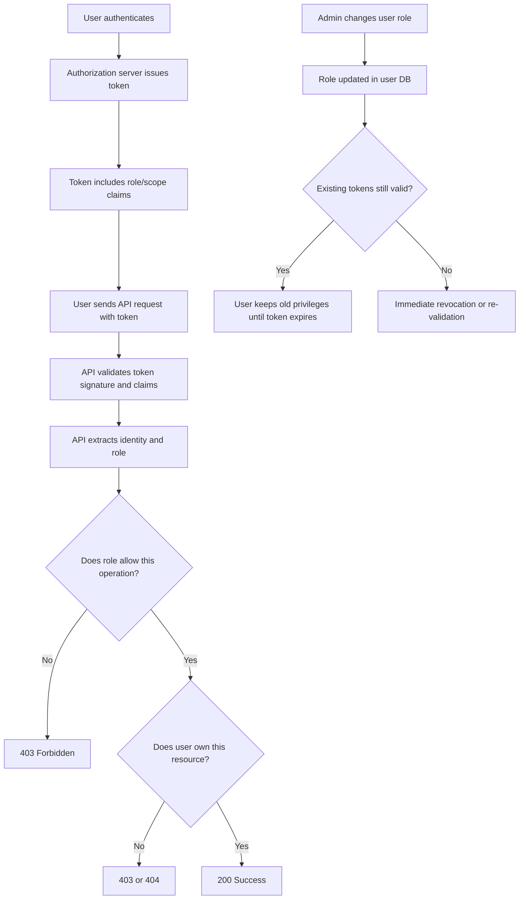
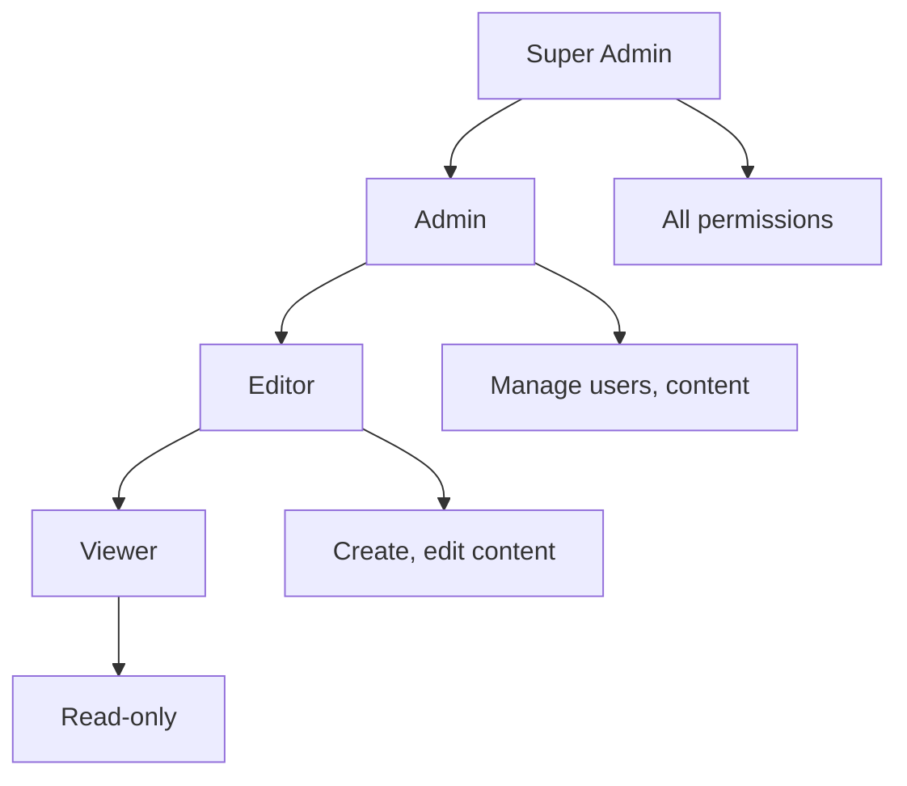

# Role-Based Access Control (RBAC)

> **RBAC in APIs is about verifying that authenticated principals are constrained to actions appropriate for their role. In authorized API testing, your goal is to validate that permissions are correctly assigned, enforced at every endpoint, and cannot be escalated through parameter manipulation, token tampering, or role confusion.**

---

## 🧠 What Is It? (Beginner Explanation)

**Role-Based Access Control (RBAC)** is a permission model where access is granted based on a user's **role** rather than individual identity.

Think of it like job titles in an office:

- A **viewer** can read documents but not edit them
- An **editor** can modify documents but not delete the entire project
- An **admin** can manage users, delete projects, and change settings
- A **billing-manager** can access invoices but not engineering reports

The key idea:

> When someone authenticates, the API checks "what is their role?" and then enforces "what can that role do?" for every request.

This is different from:

- **No authorization** — anyone with a valid token can do anything
- **Identity-based access** — permissions are managed per individual user (doesn't scale)
- **Attribute-based access (ABAC)** — permissions depend on dynamic attributes like location, time, or resource metadata

### Why it matters in APIs

| Scenario | Risk if RBAC is broken |
|---|---|
| User changes `role=admin` in their JWT payload | Escalation to full admin control |
| API checks role on login but not on every request | Any token holder can call admin endpoints |
| Frontend hides buttons but API allows requests | Role enforcement is cosmetic, not real |
| Separate admin and user APIs share authentication | Users can call admin API with valid tokens |
| Role stored in client-side state or cookies | Tampering grants elevated privileges |
| No role re-evaluation after assignment change | Fired admin still has access until token expires |

In authorized API testing, RBAC testing is **not** about exploiting production for privilege escalation. It is about:

1. Verifying that role enforcement exists at the **API layer**, not just the UI
2. Testing authorization boundaries between different roles
3. Confirming tokens cannot be tampered to claim higher privileges
4. Validating that role changes propagate correctly
5. Ensuring horizontal and vertical access controls are both enforced

---

## 🔍 Start With The API Spec

Before testing role boundaries, identify what the API claims about roles, permissions, and scopes.

### OpenAPI clues

In well-designed APIs, roles and permissions may be documented via:

```yaml
openapi: 3.1.0
components:
  securitySchemes:
    bearerAuth:
      type: http
      scheme: bearer
      bearerFormat: JWT
  schemas:
    User:
      properties:
        id:
          type: string
        email:
          type: string
        role:
          type: string
          enum: [viewer, editor, admin]
paths:
  /v1/users:
    get:
      summary: List all users (admin only)
      security:
        - bearerAuth: []
      responses:
        '200':
          description: User list
        '403':
          description: Forbidden - requires admin role
  /v1/documents/{id}:
    put:
      summary: Update a document
      security:
        - bearerAuth: []
      parameters:
        - name: id
          in: path
          required: true
          schema:
            type: string
      responses:
        '200':
          description: Updated
        '403':
          description: Requires editor or admin role
```

### What to extract

| What to look for | Testing value |
|---|---|
| Role or permission enumeration | Build a matrix of roles and endpoints to test |
| Per-operation security requirements | Identify which endpoints should be restricted to which roles |
| `403` vs `404` response handling | Check if unauthorized users see "forbidden" or "not found" (info leak) |
| Admin-only operations | Prime targets for privilege escalation testing |
| Scope or permission claims in token format | Tells you whether roles are in tokens or looked up server-side |
| Role hierarchy or inheritance | Understand whether `admin` inherits `editor` permissions |

### Also check discovery metadata

For OAuth/OIDC-backed APIs:

```bash
# Check if roles or scopes are documented
curl -s https://auth.example.com/.well-known/openid-configuration | jq '.scopes_supported'

# Sample token introspection to see role claims
curl -X POST https://auth.example.com/oauth2/introspect \
  -u client_id:client_secret \
  -d "token=${ACCESS_TOKEN}" | jq '.scope, .role, .permissions'
```

Common role claim locations in tokens:

- `scope` — OAuth scopes like `read:users` or `admin:write`
- `role` or `roles` — explicit role claim
- `permissions` — granular permission list
- `groups` — user groups that map to roles
- `realm_access` or `resource_access` — Keycloak-style role structures

---

## 🏗️ How RBAC Should Work



### Secure RBAC validation flow

A correctly implemented API should:

1. **Authenticate the token** — verify signature, issuer, audience, expiration
2. **Extract identity and role claims** — from the token or by lookup
3. **Check role/permission for the operation** — before processing the request
4. **Enforce resource-level ownership** — even if role allows the action type
5. **Re-evaluate permissions for long-lived tokens** — via introspection or short token lifetimes

### Common RBAC architectures

| Pattern | How it works | Pros | Cons |
|---|---|---|
| **Roles in token claims** | JWT includes `"role": "admin"` | Fast, no DB lookup needed | Role changes require new token or short expiry |
| **Roles via token introspection** | API queries AS to get current role | Real-time role updates | Adds latency and AS dependency |
| **Policy engine (e.g., OPA)** | Centralized policy service decides | Flexible, auditable, consistent | Requires external service |
| **Database lookup per request** | API checks user table for role | Always current | DB load, slower |
| **Hybrid: token + re-check** | Token has role, critical ops re-verify | Balance speed and freshness | More complex logic |

---

## 🧪 Testing RBAC in Authorized API Assessments

Your objective is to **validate that role-based authorization is enforced by the API**, not the client.

### Test categories

#### 1. **Vertical privilege escalation**

Can a low-privilege user perform admin-only actions?

**Test cases:**

| Test | What to check |
|---|---|
| Call admin endpoint with user token | Should return `403`, not `200` or `500` |
| Modify `role` claim in JWT payload (if not verified) | Should reject tampered token |
| Replay admin token from different account | Should fail if token is subject-bound |
| Change `user_id` but keep `role=user` | Should not access another user's resources |
| Enumerate admin-only endpoints without admin role | Should not reveal admin routes via `404` vs `403` |

**Example test (authorized, using your own accounts):**

```bash
# Authenticate as regular user
USER_TOKEN=$(curl -s -X POST https://auth.example.com/oauth2/token \
  -d "grant_type=password&username=testuser@example.com&password=testpass" | jq -r '.access_token')

# Try to call admin-only endpoint
curl -i -H "Authorization: Bearer $USER_TOKEN" \
  https://api.example.com/v1/admin/users

# Expected: 403 Forbidden
# Red flag: 200 OK or sensitive data returned
```

#### 2. **Horizontal privilege escalation**

Can a user with the same role access another user's resources?

**Test cases:**

| Test | What to check |
|---|---|
| User A reads User B's profile | Should fail if not public |
| Editor A modifies Editor B's document | Should fail unless shared |
| User changes `user_id` parameter to another user | API should validate ownership |
| Token for User A replayed with User B's resource ID | Should reject |

**Example:**

```bash
# Authenticate as Alice
ALICE_TOKEN=$(curl -s -X POST https://auth.example.com/oauth2/token \
  -d "grant_type=password&username=alice@example.com&password=alicepass" | jq -r '.access_token')

# Alice creates a note
ALICE_NOTE=$(curl -s -X POST https://api.example.com/v1/notes \
  -H "Authorization: Bearer $ALICE_TOKEN" \
  -H "Content-Type: application/json" \
  -d '{"title":"Alice private note"}' | jq -r '.id')

# Authenticate as Bob
BOB_TOKEN=$(curl -s -X POST https://auth.example.com/oauth2/token \
  -d "grant_type=password&username=bob@example.com&password=bobpass" | jq -r '.access_token')

# Bob tries to read Alice's note
curl -i -H "Authorization: Bearer $BOB_TOKEN" \
  https://api.example.com/v1/notes/$ALICE_NOTE

# Expected: 403 or 404
# Red flag: 200 with Alice's data
```

#### 3. **Role claim tampering**

Can the client manipulate role information to gain access?

**Test cases:**

| Test | What to check |
|---|---|
| Decode JWT, change `"role": "user"` to `"role": "admin"`, re-encode | Should reject due to invalid signature |
| Use `alg: none` to bypass signature | Should reject unsigned tokens |
| Replay token from admin account on different API | Should reject if audience is wrong |
| Inject role via request parameters or headers | API should not trust client-provided role |

**Example (safe, authorized testing):**

```bash
# Decode a valid user token (assuming RS256)
echo $USER_TOKEN | cut -d. -f2 | base64 -d | jq .

# Output might show:
# {
#   "sub": "user123",
#   "role": "user",
#   "iat": 1700000000,
#   "exp": 1700003600
# }

# Attempt to manipulate (this should fail signature check)
# Modify payload to "role": "admin"
# Re-encode without signature (alg: none)
TAMPERED_TOKEN="eyJhbGciOiJub25lIiwidHlwIjoiSldUIn0.eyJzdWIiOiJ1c2VyMTIzIiwicm9sZSI6ImFkbWluIn0."

curl -i -H "Authorization: Bearer $TAMPERED_TOKEN" \
  https://api.example.com/v1/admin/users

# Expected: 401 Unauthorized (invalid signature or algorithm)
# Red flag: 200 OK
```

#### 4. **Missing authorization checks**

Are all endpoints actually protected?

**Test cases:**

| Test | What to check |
|---|---|
| Call admin endpoints with no token | Should return `401` |
| Call admin endpoints with expired token | Should return `401` |
| Call admin endpoints with token for wrong audience | Should return `403` |
| Fuzz endpoints with various role combinations | Map actual enforcement |

#### 5. **Role transition and token lifetime**

Do role changes take effect immediately?

**Test cases:**

| Test | What to check |
|---|---|
| Admin demotes user; does old token still work? | Token should be revoked or short-lived |
| Admin promotes user; does new privilege apply? | Depends on architecture (introspection vs token claims) |
| User logs out but token is still valid | Should fail if revocation is implemented |

---

## 🛠️ RBAC Testing Tools

### Decode and inspect tokens

```bash
# Decode JWT header and payload
echo $TOKEN | cut -d. -f1 | base64 -d | jq .  # Header
echo $TOKEN | cut -d. -f2 | base64 -d | jq .  # Payload

# Use jwt.io or jwt-cli
jwt decode $TOKEN
```

### Token introspection

```bash
# OAuth 2.0 introspection endpoint
curl -X POST https://auth.example.com/oauth2/introspect \
  -u client_id:client_secret \
  -d "token=$TOKEN" | jq .
```

### Test matrix tracking

Create a test matrix to systematically validate role enforcement:

| Endpoint | Expected Role | User Token | Editor Token | Admin Token | No Token |
|---|---|---|---|---|---|
| `GET /v1/profile` | any | ✅ 200 | ✅ 200 | ✅ 200 | ❌ 401 |
| `PUT /v1/profile` | any | ✅ 200 | ✅ 200 | ✅ 200 | ❌ 401 |
| `GET /v1/documents` | any | ✅ 200 | ✅ 200 | ✅ 200 | ❌ 401 |
| `POST /v1/documents` | editor+ | ❌ 403 | ✅ 201 | ✅ 201 | ❌ 401 |
| `DELETE /v1/documents/{id}` | admin | ❌ 403 | ❌ 403 | ✅ 200 | ❌ 401 |
| `GET /v1/admin/users` | admin | ❌ 403 | ❌ 403 | ✅ 200 | ❌ 401 |
| `POST /v1/admin/users` | admin | ❌ 403 | ❌ 403 | ✅ 201 | ❌ 401 |

Automate this with a script:

```bash
#!/bin/bash
# rbac-test.sh

API="https://api.example.com"
USER_TOKEN="..."
EDITOR_TOKEN="..."
ADMIN_TOKEN="..."

test_endpoint() {
  local method=$1
  local path=$2
  local token=$3
  local role=$4
  
  status=$(curl -s -o /dev/null -w "%{http_code}" -X $method \
    -H "Authorization: Bearer $token" \
    "$API$path")
  
  echo "$method $path | Role: $role | Status: $status"
}

echo "Testing /v1/admin/users with different roles:"
test_endpoint GET /v1/admin/users "$USER_TOKEN" "user"
test_endpoint GET /v1/admin/users "$EDITOR_TOKEN" "editor"
test_endpoint GET /v1/admin/users "$ADMIN_TOKEN" "admin"
```

### Burp Suite / ZAP

- Use **match/replace** to swap tokens between accounts
- Use **intruder** to test endpoints with different role tokens
- Compare responses to identify missing authorization checks

---

## 🎯 Common RBAC Vulnerabilities

### 1. **Role checked in UI, not API**

**Symptom:** Frontend hides buttons for certain roles, but API allows requests.

**Test:**

```bash
# Admin button hidden in UI for user role
# But API allows request
curl -X DELETE -H "Authorization: Bearer $USER_TOKEN" \
  https://api.example.com/v1/admin/users/target-user-id

# Vulnerable if: 200 OK
# Secure if: 403 Forbidden
```

**Why it happens:**

- Developers assume frontend enforcement is enough
- Backend lacks middleware or policy checks
- Role-based UI rendering is conflated with authorization

### 2. **Role stored client-side**

**Symptom:** Role or permissions are in cookies, local storage, or URL parameters.

**Test:**

```bash
# Role in cookie
curl -i https://api.example.com/v1/admin/dashboard \
  -H "Cookie: session=abc123; role=admin"

# Role in query parameter
curl -i "https://api.example.com/v1/data?user_id=123&role=admin"
```

**Why it happens:**

- Session state includes role for convenience
- Backend trusts client-provided role without verification

**Fix:** Role must be determined server-side from authenticated identity.

### 3. **Missing role validation on indirect paths**

**Symptom:** Direct endpoint is protected, but indirect methods bypass checks.

**Example:**

```bash
# Protected
GET /v1/admin/users → 403 for non-admin

# But mass assignment allows privilege escalation
PUT /v1/users/me
{
  "role": "admin"
}
→ 200 OK, user promoted to admin
```

**Why it happens:**

- Role enforcement on reads but not writes
- Mass assignment vulnerabilities
- Inconsistent validation across related endpoints

### 4. **Role in JWT but no signature verification**

**Symptom:** API accepts unsigned or weakly signed tokens.

**Test:**

```bash
# Craft token with alg: none
HEADER='{"alg":"none","typ":"JWT"}'
PAYLOAD='{"sub":"user123","role":"admin","exp":9999999999}'
FAKE_TOKEN=$(echo -n "$HEADER" | base64 -w0).$(echo -n "$PAYLOAD" | base64 -w0).

curl -i -H "Authorization: Bearer $FAKE_TOKEN" \
  https://api.example.com/v1/admin/users

# Vulnerable if: 200 OK
# Secure if: 401 Unauthorized (rejects alg: none)
```

### 5. **No re-validation after role change**

**Symptom:** Admin demotes a user, but user's existing token retains old privileges.

**Why it happens:**

- Tokens are long-lived
- No revocation mechanism
- No periodic introspection

**Fix:**

- Use short-lived access tokens
- Implement token revocation or introspection
- Force re-authentication on role changes

### 6. **Information disclosure via error messages**

**Symptom:** Different error messages for "forbidden" vs "not found" leak information.

**Example:**

```bash
# Admin tries to access non-existent user
curl -i -H "Authorization: Bearer $ADMIN_TOKEN" \
  https://api.example.com/v1/users/99999
# Response: 404 Not Found

# Regular user tries same request
curl -i -H "Authorization: Bearer $USER_TOKEN" \
  https://api.example.com/v1/users/99999
# Response: 403 Forbidden

# Reveals: resource exists but user lacks permission
```

**Fix:** Return `404` for both cases when user lacks permission.

---

## 📊 Real-World Examples

### Example 1: GitHub's repository access control

GitHub uses a combination of:

- **Organization roles:** Owner, Member
- **Repository roles:** Admin, Write, Triage, Read
- **Team-based permissions**
- **Branch protection rules**

API enforcement:

```bash
# User with Read access tries to push
curl -X POST https://api.github.com/repos/org/repo/git/refs \
  -H "Authorization: Bearer $READ_TOKEN" \
  -d '{"ref":"refs/heads/test","sha":"abc123"}'

# Response: 403 Forbidden
```

Lessons:

- Granular roles for different resource types
- Consistent enforcement across Git, API, and UI
- Audit logs for role changes

### Example 2: AWS IAM roles and policies

AWS uses:

- **IAM roles** attached to users, groups, or services
- **Policies** defining allowed actions on resources
- **Resource-based policies** for cross-account access

Example API call:

```bash
# EC2 instance tries to access S3 bucket
aws s3 ls s3://private-bucket --profile instance-role

# If role lacks s3:ListBucket permission:
# Response: AccessDenied
```

Lessons:

- Explicit deny overrides allow
- Least privilege by default
- Policy simulator for testing before deployment

### Example 3: Kubernetes RBAC

Kubernetes uses:

- **Roles** and **ClusterRoles** defining permissions
- **RoleBindings** attaching roles to users or service accounts

Example:

```yaml
apiVersion: rbac.authorization.k8s.io/v1
kind: Role
metadata:
  namespace: production
  name: pod-reader
rules:
- apiGroups: [""]
  resources: ["pods"]
  verbs: ["get", "list"]
```

API enforcement:

```bash
kubectl get pods -n production --as=developer-user
# If user lacks role: Error from server (Forbidden)
```

Lessons:

- Namespace-scoped vs cluster-scoped permissions
- Verbs define action granularity (get, list, create, delete)
- Service accounts enable workload identity

---

## 🔬 Advanced RBAC Patterns

### 1. **Hierarchical roles**

Roles inherit permissions from lower roles.



**Testing consideration:** Verify that inheritance is implemented correctly and doesn't allow unintended privilege escalation.

### 2. **Role-scope matrix**

Combine roles with scopes for fine-grained control.

| Role | Scope | Allowed Actions |
|---|---|---|
| Admin | `org:acme` | Manage users, billing, content in org `acme` |
| Editor | `project:web-app` | Edit documents in `web-app` project |
| Viewer | `project:mobile-app` | Read documents in `mobile-app` project |

**Token example:**

```json
{
  "sub": "user123",
  "role": "editor",
  "scope": "project:web-app",
  "permissions": ["documents:read", "documents:write"]
}
```

### 3. **Dynamic role evaluation**

Roles determined at request time based on:

- User attributes
- Resource metadata
- Time of day
- IP address
- Device posture

**Example (Policy-as-Code with OPA):**

```rego
package api.authz

default allow = false

allow {
    input.method == "GET"
    input.role == "viewer"
}

allow {
    input.method == "POST"
    input.role == "editor"
    input.resource.owner == input.user.id
}

allow {
    input.role == "admin"
}
```

### 4. **Just-In-Time (JIT) privilege escalation**

Users request temporary elevated privileges with approval workflow.

**Flow:**

1. User requests admin access for 1 hour
2. Manager approves request
3. User receives temporary admin token
4. Token expires automatically

**Testing:** Verify that temporary tokens expire and cannot be renewed without re-approval.

---

## 🔐 Defensive Best Practices

| Practice | Why it matters |
|---|---|
| **Deny by default** | Require explicit permission grants |
| **Validate role on every request** | Do not cache authorization decisions in client |
| **Separate authentication and authorization** | Valid identity does not imply authorized action |
| **Use short-lived tokens** | Limit window for stolen token abuse |
| **Implement token revocation** | Allow immediate privilege withdrawal |
| **Log authorization failures** | Detect enumeration and escalation attempts |
| **Return consistent errors** | Avoid info leaks via `403` vs `404` differences |
| **Verify token audience and issuer** | Prevent token substitution across APIs |
| **Re-evaluate on critical actions** | Confirm current role via introspection for sensitive ops |
| **Audit role changes** | Track who modified whose permissions when |

---

## 📚 References and Further Reading

### OWASP

- [OWASP API Security Top 10 - API5:2023 Broken Function Level Authorization](https://owasp.org/API-Security/editions/2023/en/0xa5-broken-function-level-authorization/)
- [OWASP API Security Top 10 - API1:2023 Broken Object Level Authorization](https://owasp.org/API-Security/editions/2023/en/0xa1-broken-object-level-authorization/)
- [OWASP Access Control Cheat Sheet](https://cheatsheetseries.owasp.org/cheatsheets/Access_Control_Cheat_Sheet.html)

### Standards and specifications

- [NIST RBAC Model](https://csrc.nist.gov/projects/role-based-access-control)
- [OAuth 2.0 Token Introspection (RFC 7662)](https://datatracker.ietf.org/doc/html/rfc7662)
- [JWT Best Current Practices (RFC 8725)](https://datatracker.ietf.org/doc/html/rfc8725)

### Industry resources

- [PortSwigger: Access Control Vulnerabilities](https://portswigger.net/web-security/access-control)
- [Auth0: Role-Based Access Control](https://auth0.com/docs/manage-users/access-control/rbac)
- [CISA: Implementing Least Privilege](https://www.cisa.gov/sites/default/files/publications/Least%20Privilege%20Quick%20Guide%20v2%20508.pdf)

### Research papers

- Ferraiolo, D. F., & Kuhn, D. R. (1992). *Role-based access controls*. 15th National Computer Security Conference.
- Sandhu, R., et al. (1996). *Role-Based Access Control Models*. IEEE Computer, 29(2), 38-47.

### Tools

- [Open Policy Agent (OPA)](https://www.openpolicyagent.org/)
- [Casbin](https://casbin.org/) - Authorization library supporting RBAC, ABAC, ACL
- [Keycloak](https://www.keycloak.org/) - Identity and access management with RBAC support
- [jwt.io](https://jwt.io/) - JWT decoder and verifier
- [Burp Suite](https://portswigger.net/burp) - Authorization testing via token swapping
- [OWASP ZAP](https://www.zaproxy.org/) - Automated authorization testing

---

## ✅ Key Takeaways

1. **RBAC is enforced at the API layer, not the UI.** Always test with direct API requests.

2. **Roles in tokens must be verified.** Signature validation prevents tampering; audience and issuer claims prevent substitution.

3. **Test both vertical and horizontal authorization.** Privilege escalation can happen across roles or across users with the same role.

4. **Authorization is not a one-time check.** Every request must validate that the current principal is allowed to perform the current action on the current resource.

5. **Short-lived tokens + introspection** provide better security than long-lived tokens with static claims.

6. **Map the RBAC model before testing.** Understand role hierarchy, permission structure, and enforcement points.

7. **Combine RBAC with resource ownership checks.** Role allows the action type; ownership check ensures access to the specific resource.

8. **Audit and monitor authorization failures.** Failed privilege escalation attempts are high-signal security events.

9. **Use standardized patterns.** OAuth scopes, OIDC claims, and policy engines provide battle-tested RBAC foundations.

10. **In authorized testing, focus on validation, not exploitation.** Your goal is to prove controls work, not to abuse them.

---

## Next Steps

After mastering RBAC, explore related authorization topics:

- **Attribute-Based Access Control (ABAC)** — dynamic policies based on user, resource, and environmental attributes
- **Policy-as-Code** — centralized authorization with Open Policy Agent or Cedar
- **Token introspection and revocation** — real-time permission validation
- **Multi-tenancy isolation** — ensuring role boundaries respect tenant boundaries
- **Audit logging for authorization events** — detection and forensics for privilege abuse

RBAC is the foundation of API authorization. When combined with strong authentication, least privilege, and defense in depth, it provides robust access control for modern APIs.
