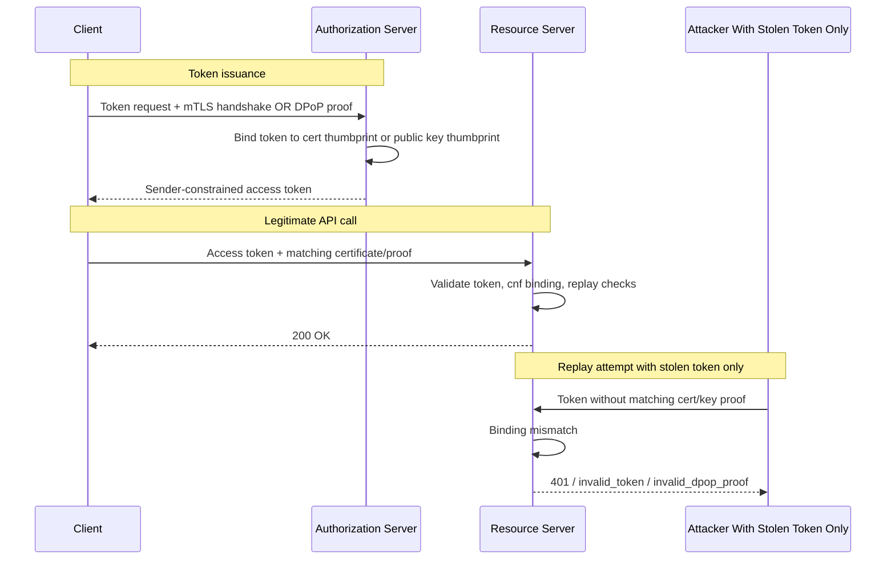
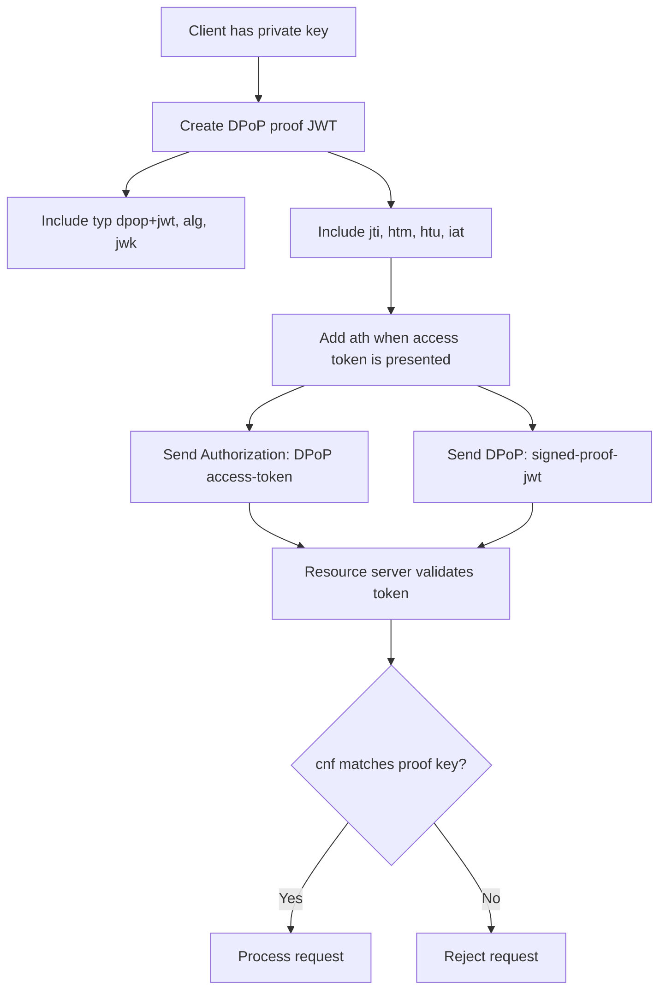

# Sender Constrained Tokens

> **Sender constrained tokens are access or refresh tokens that are cryptographically bound to a specific client key or certificate, so stealing the token alone should not be enough to use it against an API.**

---

## 🧠 What Is It? (Beginner Explanation)

A normal **bearer token** works like a hotel keycard: whoever holds it can usually use it.

A **sender constrained token** adds another check: the API expects not just the token, but also proof that the caller controls the right private key or client certificate.

That means the server is asking two questions instead of one:

1. **Do you have a valid token?**
2. **Are you the same client that this token was issued to?**

The two most common ways to do this in modern APIs are:

- **mTLS-bound tokens** — the token is tied to an X.509 client certificate
- **DPoP-bound tokens** — the token is tied to an application-level public/private key pair

### Easy analogy

Think of a bearer token like a concert ticket. If someone drops it, anyone can pick it up and walk in.

A sender constrained token is like a concert ticket that also requires a matching ID at the gate. The ticket still matters, but the person presenting it must also prove they are the intended holder.

### Why API testers should care

In authorized API testing, sender-constrained tokens matter because they are designed to reduce the impact of:

- token leakage in logs, proxies, browser storage, or crash dumps
- replay across different devices or workloads
- misuse of stolen refresh tokens
- abuse of tokens taken from one client and presented by another

They **do not** replace authorization checks. A perfectly bound token can still reach an API with broken object-level authorization, broken function-level authorization, or overbroad scopes.

---

## 🏗️ How It Works (Technical Deep Dive)

At a high level, sender constraint turns a token from **"something you possess"** into **"something you possess and can prove you legitimately hold."**

### Step 1: The client has key material

Before the token is used, the client already has one of these:

- an **X.509 client certificate + private key** for mTLS, or
- an **asymmetric key pair** for DPoP

### Step 2: The client asks the authorization server for a token

When requesting a token, the client proves possession of its key material:

- **mTLS**: by completing a mutual TLS handshake
- **DPoP**: by sending a signed `DPoP` proof JWT in the HTTP request

### Step 3: The authorization server binds the token

The authorization server issues an access token and records, embeds, or exposes binding information that says:

- “this token belongs with **certificate thumbprint X**” or
- “this token belongs with **public key thumbprint Y**”

This usually appears through the JWT **`cnf`** claim or equivalent introspection metadata.

### Step 4: The client calls the API

When the token is used against the resource server:

- **mTLS**: the client must present the same certificate again at the TLS layer
- **DPoP**: the client must send a fresh signed proof for that exact HTTP request

### Step 5: The resource server validates both pieces

The resource server must verify:

- the token is valid
- the token is intended for this API
- the token’s binding information matches the presented proof material
- replay protections are satisfied

If the token is stolen but the attacker does **not** have the private key or certificate, the request should fail.

### Bearer vs sender-constrained mental model

| Model | What the API trusts | Replay resistance |
|---|---|---|
| **Bearer token** | Token alone | Low |
| **mTLS-bound token** | Token + matching client certificate | High when TLS path is correctly enforced |
| **DPoP-bound token** | Token + per-request signed proof using the bound key | High against off-client replay, with caveats |

### Important distinctions

#### Sender constraint is not the same as client authentication

These concepts often appear together, but they are not identical:

- **Client authentication** answers: *which client is calling the token endpoint?*
- **Sender constraint** answers: *can this caller prove it is the rightful holder of this token?*

A deployment can use sender-constrained tokens even when the client is a public client.

#### Sender constraint is not the same as PKCE

- **PKCE** protects the **authorization code** during the OAuth flow.
- **Sender-constrained tokens** protect the **access token and often the refresh token** after issuance.

#### Sender constraint is not a complete XSS defense

DPoP helps if a token is exfiltrated **without** the private key. But if malicious code runs inside the same client context and can use the private key or signing API, sender constraint may not save you.

---

## 📊 Architecture / Flow Diagram



### DPoP request anatomy



---

## ⚙️ Technical Details

### Core terminology

| Term | Meaning | Where you see it |
|---|---|---|
| **PoP / Proof-of-Possession** | The client proves it holds a private key | OAuth specs, vendor docs |
| **Holder-of-key** | Older/common term for the same idea | RFC 7800 concepts |
| **`cnf` claim** | JWT claim carrying token-binding information | JWT access tokens or introspection |
| **`x5t#S256`** | SHA-256 thumbprint of an X.509 certificate | mTLS-bound tokens |
| **`jkt`** | JWK thumbprint confirmation method | DPoP-bound tokens |
| **Replay detection** | Rejecting reuse of the same proof or invalid binding | Resource server logic |

### The `cnf` claim

RFC 7800 defines the **`cnf`** (“confirmation”) claim for expressing proof-of-possession key semantics in JWTs.

### Example: mTLS-bound access token

```json
{
  "iss": "https://auth.example.com",
  "sub": "service-client",
  "aud": "https://api.example.com",
  "scope": "payments.read",
  "cnf": {
    "x5t#S256": "bwcK0esc3ACC3DB2Y5_lESsXE8o9ltc05O89jdN-dg2"
  }
}
```

### Example: DPoP-bound access token

```json
{
  "iss": "https://auth.example.com",
  "sub": "mobile-app-user-123",
  "aud": "https://api.example.com",
  "scope": "profile.read",
  "cnf": {
    "jkt": "0ZcOCWlQ0cD8k3Y4F9b0m4S4k2QxqQ3W7T9i0g4yF6E"
  }
}
```

### mTLS vs DPoP

| Attribute | mTLS-bound token | DPoP-bound token |
|---|---|---|
| Layer | TLS / transport | HTTP / application |
| Proof material | Client certificate | Signed JWT proof |
| Token binding value | `cnf.x5t#S256` | `cnf.jkt` |
| Best fit | Service-to-service, controlled clients | SPAs, mobile apps, native/public clients |
| Main operational risk | TLS termination and cert propagation mistakes | Proof validation and replay-cache mistakes |
| API spec support | Native `mutualTLS` in OpenAPI | Usually documented via bearer scheme + required `DPoP` header |

### DPoP proof JWT fields

A DPoP proof is a JWT in the `DPoP` HTTP header. Per RFC 9449, the proof typically includes:

| Field | Location | Purpose |
|---|---|---|
| `typ=dpop+jwt` | JOSE header | Explicitly types the proof |
| `alg` | JOSE header | Must be an asymmetric signature algorithm |
| `jwk` | JOSE header | The public key corresponding to the client’s private key |
| `jti` | Payload | Unique identifier for replay detection |
| `htm` | Payload | HTTP method being used |
| `htu` | Payload | Target URI without query/fragment |
| `iat` | Payload | Proof creation time |
| `ath` | Payload | Hash of the presented access token |
| `nonce` | Payload | Optional server-provided nonce when required |

### Conceptual DPoP proof

```json
{
  "header": {
    "typ": "dpop+jwt",
    "alg": "ES256",
    "jwk": {
      "kty": "EC",
      "crv": "P-256",
      "x": "...",
      "y": "..."
    }
  },
  "payload": {
    "jti": "1b9d7de2-9b2a-4308-a1c9-2bc8e79c673d",
    "htm": "GET",
    "htu": "https://api.example.com/v1/profile",
    "iat": 1735689600,
    "ath": "base64url(sha256(access_token))"
  }
}
```

### Where the API spec helps

For an authorized assessment, your API specification is often the fastest way to understand whether sender constraint is expected.

### OpenAPI example: mTLS

OpenAPI 3.1 has first-class support for mutual TLS:

```yaml
openapi: 3.1.0
components:
  securitySchemes:
    clientCertificate:
      type: mutualTLS
paths:
  /payments:
    get:
      security:
        - clientCertificate: []
```

### OpenAPI example: documenting DPoP

OpenAPI does **not** currently have a first-class `dpop` security scheme type, so teams usually document it with a bearer scheme plus an explicit required `DPoP` header and descriptive text.

```yaml
openapi: 3.1.0
components:
  securitySchemes:
    oauthAccessToken:
      type: http
      scheme: bearer
      bearerFormat: DPoP
  parameters:
    DPoPHeader:
      name: DPoP
      in: header
      required: true
      schema:
        type: string
      description: Signed DPoP proof JWT for this exact request.
paths:
  /v1/profile:
    get:
      security:
        - oauthAccessToken: []
      parameters:
        - $ref: '#/components/parameters/DPoPHeader'
      x-sender-constrained-token: dpop
```

That last `x-sender-constrained-token` line is a **vendor extension example**, not an OpenAPI standard field.

### Typical HTTP patterns

### DPoP token request

```http
POST /oauth/token HTTP/1.1
Host: auth.example.com
Content-Type: application/x-www-form-urlencoded
DPoP: <signed-dpop-proof-jwt>

grant_type=authorization_code&client_id=spa-client&code=<code>&code_verifier=<verifier>
```

### DPoP-protected resource request

```http
GET /v1/profile HTTP/1.1
Host: api.example.com
Authorization: DPoP <access-token>
DPoP: <fresh-signed-dpop-proof-jwt>
```

### mTLS-protected resource request

```http
GET /v1/payments HTTP/1.1
Host: api.example.com
Authorization: Bearer <access-token>
```

In the mTLS case, the proof is not in the HTTP header; it happens during the TLS handshake.

---

## 🔴 Attack Surface

In an authorized assessment, the most valuable findings usually come from **implementation gaps**, not from the crypto design itself.

| Risk area | What goes wrong | Why it matters | Safe tester signal |
|---|---|---|---|
| **Bearer fallback** | API still accepts a bound token without proof | Defeats sender constraint | Bound token works when `DPoP` header or client cert is omitted |
| **Binding not enforced at RS** | Authorization server binds token, resource server ignores it | Token theft still works in practice | `cnf` exists, but RS accepts mismatched proof material |
| **No replay cache** | Same `jti` proof can be replayed inside validity window | Lets captured proof be reused | Exact same DPoP proof succeeds twice |
| **Missing `ath` validation** | DPoP proof not tied to the actual token value | Proof can be mixed with the wrong token | Token substitution is not rejected |
| **Weak URI/method validation** | `htu` or `htm` checked loosely | Proof may be reused on a different request | Same proof accepted for changed method/path |
| **Nonce handling gaps** | Nonce required inconsistently or ignored | Makes pre-generated proofs more useful | RS emits nonce but later accepts proof without it |
| **TLS termination mistakes** | Edge verifies client cert but backend trusts spoofable headers | mTLS trust can be bypassed internally | Backend accepts untrusted `X-SSL-Client-Cert` style headers |
| **Introspection loses `cnf`** | Token metadata reaches RS without confirmation info | RS cannot enforce binding | Introspection response lacks `cnf` for a supposedly bound token |
| **Refresh tokens left as bearer** | Access token is protected but refresh token is not | Long-term token theft remains possible | Refresh flow works without the original proof material |
| **Docs/spec drift** | OpenAPI says sender constraint is required, live API does something else | Consumers and testers get false assurance | Behavior does not match the published spec |

### Vulnerable scenario

```yaml
# Example of dangerous documentation/implementation mismatch
components:
  securitySchemes:
    clientCertificate:
      type: mutualTLS

# But the live gateway is actually configured with optional client certificates
# or forwards unverified client-cert headers from an untrusted hop.
```

### What this means practically

If sender constraint is implemented only at the authorization server, or only documented in the API spec, it can create **false confidence**. Real protection exists only when the **resource server or API gateway actively enforces the binding on every protected request**.

---

## 💥 Authorized Validation (Step-by-Step)

This section is intentionally framed for **authorized API testing in your own environment or with explicit permission**. The goal is to verify that sender constraint is truly enforced, not to provide abuse instructions.

**Prerequisites:**

- written authorization and a test account or lab tenant
- the API spec or OpenAPI description
- a test client that legitimately supports mTLS or DPoP
- access to non-production logs if your engagement allows it

### Step 1: Map expected behavior from the API spec

Start with the specification before touching live endpoints.

```bash
# YAML OpenAPI
rg -n "securitySchemes|mutualTLS|DPoP|bearerFormat|token|introspect" openapi.yaml

yq '.components.securitySchemes' openapi.yaml

# JSON OpenAPI
jq '.components.securitySchemes' openapi.json
```

Questions to answer:

- Which endpoints issue tokens?
- Which endpoints require sender-constrained access tokens?
- Does the spec mention `mutualTLS`, `DPoP`, or `cnf` behavior?
- Are error conditions documented for missing proof material?

### Step 2: Obtain a legitimate sender-constrained token

Use the normal, approved client flow.

#### mTLS example

```bash
curl --silent --show-error https://auth.example.com/oauth/token \
  --cert client.pem \
  --key client.key \
  --data 'grant_type=client_credentials&client_id=payments-svc&scope=payments.read'
```

#### DPoP example

```bash
curl --silent --show-error https://auth.example.com/oauth/token \
  -H 'DPoP: <valid-proof-generated-by-approved-client-or-sdk>' \
  --data 'grant_type=authorization_code&client_id=spa-client&code=<code>&code_verifier=<verifier>'
```

For DPoP, prefer a vendor SDK or your own lab helper that already generates compliant proofs. In an assessment, you usually do **not** need to handcraft proofs manually to validate enforcement.

### Step 3: Confirm the happy path succeeds

```bash
# DPoP-protected endpoint
curl --silent --show-error https://api.example.com/v1/profile \
  -H "Authorization: DPoP $ACCESS_TOKEN" \
  -H "DPoP: $VALID_DPOP_PROOF"

# mTLS-protected endpoint
curl --silent --show-error https://api.example.com/v1/payments \
  --cert client.pem \
  --key client.key \
  -H "Authorization: Bearer $ACCESS_TOKEN"
```

### Step 4: Run safe negative tests

These are the highest-value checks in most authorized engagements.

#### Test A: Omit the proof material

Expected result: rejection.

```bash
# DPoP token without DPoP header should fail
curl -i https://api.example.com/v1/profile \
  -H "Authorization: DPoP $ACCESS_TOKEN"

# mTLS-bound token without presenting the client cert should fail
curl -i https://api.example.com/v1/payments \
  -H "Authorization: Bearer $ACCESS_TOKEN"
```

#### Test B: Reuse the exact same DPoP proof

Expected result: replay should be detected or the request should fail due to nonce/timing checks.

```bash
curl -i https://api.example.com/v1/profile \
  -H "Authorization: DPoP $ACCESS_TOKEN" \
  -H "DPoP: $SAME_PROOF"

curl -i https://api.example.com/v1/profile \
  -H "Authorization: DPoP $ACCESS_TOKEN" \
  -H "DPoP: $SAME_PROOF"
```

#### Test C: Change the request semantics

Expected result: a proof minted for one method or URI should not validate for another.

```bash
# Example: same token, different endpoint or method, newly observed proof should be required
curl -i https://api.example.com/v1/admin/profile \
  -X POST \
  -H "Authorization: DPoP $ACCESS_TOKEN" \
  -H "DPoP: $PROOF_FOR_OLD_REQUEST"
```

#### Test D: Inspect whether the token is actually bound

If the access token is a JWT, decode it and look for `cnf`.

```bash
python3 - <<'PY'
import base64, json, os

token = os.environ.get('ACCESS_TOKEN', '')
parts = token.split('.')
if len(parts) >= 2:
    payload = parts[1] + '=' * (-len(parts[1]) % 4)
    payload = base64.urlsafe_b64decode(payload.encode()).decode()
    print(json.dumps(json.loads(payload), indent=2))
else:
    print('Opaque token: use introspection or vendor tooling instead')
PY
```

Look for values like:

- `cnf.x5t#S256` for mTLS binding
- `cnf.jkt` for DPoP binding

If the token is opaque, ask whether the RS obtains equivalent binding data from introspection.

### Step 5: Validate refresh-token behavior

Sender constraint is weaker than it looks if refresh tokens stay bearer-style.

Questions to verify:

- Is the refresh token also bound?
- Does refresh require the same certificate or DPoP key?
- Is refresh token rotation also enabled?

### Step 6: Document precise evidence

A strong finding usually includes:

- what the API spec promised
- what the live endpoint actually accepted
- the exact endpoint and token type involved
- the expected error vs the actual response
- why the mismatch weakens replay resistance

---

## 🛠️ Tools & Commands

| Tool | Purpose | Command |
|---|---|---|
| `rg` | Find sender-constraint requirements in an API spec | `rg -n "mutualTLS|DPoP|securitySchemes|bearerFormat" openapi.*` |
| `yq` | Read OpenAPI YAML security schemes | `yq '.components.securitySchemes' openapi.yaml` |
| `jq` | Read OpenAPI JSON security schemes / introspection output | `jq '.' token.json` |
| `curl` | Exercise token and resource endpoints | `curl -i https://api.example.com/...` |
| `openssl` | Inspect client certificate details and thumbprints | `openssl x509 -in client.pem -noout -fingerprint -sha256` |
| `python3` | Decode JWT payloads safely in a lab | `python3 decode_jwt.py` |

### Useful commands

```bash
# Show SHA-256 thumbprint of a client certificate
openssl x509 -in client.pem -noout -fingerprint -sha256

# Quickly inspect an OpenAPI file for sender-constrained auth hints
rg -n "mutualTLS|DPoP|cnf|x5t#S256|jkt|token_endpoint|introspect" openapi.yaml openapi.json

# Example introspection call in a test environment
curl --silent --show-error https://auth.example.com/oauth/introspect \
  -u 'rs-client:rs-secret' \
  --data "token=$ACCESS_TOKEN"
```

---

## 🔍 Detection

Defenders should treat sender-constrained tokens as both a **preventive control** and a **detection opportunity**.

### What to monitor

| Signal | Why it matters |
|---|---|
| Repeated `invalid_dpop_proof` errors | May indicate broken clients, replay attempts, or incorrect proof generation |
| `invalid_token` for mTLS-bound resources | Often shows missing or mismatched client certificates |
| Same token observed with different cert thumbprints or JWK thumbprints | Strong sign of replay or enforcement failure |
| Same `jti` seen more than once | DPoP replay indicator |
| Missing `DPoP` header on routes that require it | Misconfigured client or bypass attempt |
| Sudden spike in nonce issuance | Client clock problems, replay handling, or probing |
| Backend seeing spoofable client-cert headers | Dangerous proxy trust boundary issue |

### Indicators

- token introspection responses missing `cnf` for supposedly bound tokens
- successful API calls where the published spec required `mutualTLS` or DPoP but proof material was absent
- DPoP proofs reappearing with the same `jti`
- mismatches between edge TLS logs and application-layer identity logs

### Example log signatures

```json
{
  "event": "token_binding_mismatch",
  "token_id": "at_01J...",
  "expected_cnf": { "jkt": "0ZcOCW..." },
  "presented_jkt": "x4uN9m...",
  "result": "rejected",
  "path": "/v1/profile",
  "status": 401
}
```

```json
{
  "event": "dpop_replay_detected",
  "jti": "1b9d7de2-9b2a-4308-a1c9-2bc8e79c673d",
  "path": "/v1/profile",
  "method": "GET",
  "result": "rejected"
}
```

### Practical defender advice

Correlate at least two views:

1. **identity / authorization server logs**
2. **API gateway or resource server logs**

That correlation often reveals whether the authorization server issued a properly bound token but the resource server failed to enforce the binding.

---

## 🛡️ Mitigation & Defense

### Secure validation logic

```javascript
async function validateSenderConstrainedRequest(req, token) {
  assert(token.active === true);
  assert(token.aud === 'https://api.example.com');

  if (token.cnf?.jkt) {
    const proof = parseAndVerifyDpop(req.headers.dpop);
    assert(proof.header.typ === 'dpop+jwt');
    assert(isAsymmetricAlg(proof.header.alg));
    assert(proof.payload.htm === req.method);
    assert(proof.payload.htu === canonicalUriWithoutQuery(req));
    assert(proof.payload.ath === sha256base64url(req.accessToken));
    assert(!seenRecently(proof.payload.jti));
    assert(token.cnf.jkt === jwkThumbprint(proof.header.jwk));
    cacheJti(proof.payload.jti);
  }

  if (token.cnf?.['x5t#S256']) {
    const cert = getVerifiedMutualTlsCertificate(req);
    assert(cert);
    assert(token.cnf['x5t#S256'] === sha256Thumbprint(cert));
  }

  return true;
}
```

### Configuration principles

```yaml
security-controls:
  require_https: true
  require_sender_constraint_for:
    - privileged_api_scopes
    - service_to_service_calls
    - refresh_tokens
  reject_bearer_fallback: true
  validate_cnf_at_resource_server: true
  enforce_replay_cache: true
  log_binding_mismatches: true
```

### Defensive checklist

- [ ] Use HTTPS everywhere; sender constraint is not a replacement for transport security
- [ ] Bind high-value access tokens and refresh tokens with DPoP or mTLS
- [ ] Enforce the binding at the **resource server**, not only at the authorization server
- [ ] Validate `cnf` on every protected request
- [ ] For DPoP, validate `typ`, `alg`, `jwk`, `jti`, `htm`, `htu`, `iat`, and `ath`
- [ ] Maintain a replay cache for recent DPoP `jti` values
- [ ] Consider nonce support for stricter replay resistance in higher-risk deployments
- [ ] For mTLS, ensure verified client-cert identity survives proxies and load balancers safely
- [ ] Do not trust client-cert headers from untrusted internal hops
- [ ] Keep token lifetimes short and scopes narrow
- [ ] Combine sender constraint with audience restriction, PKCE, and refresh token rotation
- [ ] Keep API specs accurate so clients and testers know proof requirements

### What good looks like

A mature deployment usually has all of the following:

- a clearly documented token type and proof requirement
- a consistent policy across the authorization server, gateway, and resource server
- negative tests in CI for missing proof, wrong proof, and replayed proof
- logs that clearly distinguish invalid token, invalid proof, and binding mismatch

---

## 📚 References

- [RFC 9449 - OAuth 2.0 Demonstrating Proof of Possession (DPoP)](https://datatracker.ietf.org/doc/html/rfc9449)
- [RFC 8705 - OAuth 2.0 Mutual-TLS Client Authentication and Certificate-Bound Access Tokens](https://datatracker.ietf.org/doc/html/rfc8705)
- [RFC 7800 - Proof-of-Possession Key Semantics for JSON Web Tokens (JWTs)](https://www.rfc-editor.org/rfc/rfc7800)
- [OWASP OAuth 2.0 Protocol Cheat Sheet](https://cheatsheetseries.owasp.org/cheatsheets/OAuth2_Cheat_Sheet.html)
- [OWASP API Security Top 10 2023](https://owasp.org/API-Security/editions/2023/en/0x11-t10/)
- [OpenAPI Specification 3.1](https://swagger.io/specification/)
- [Auth0 - Sender Constraining](https://auth0.com/docs/secure/sender-constraining)
