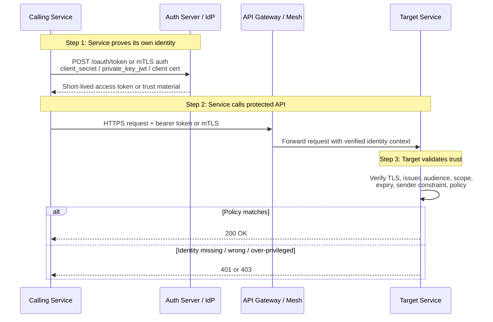
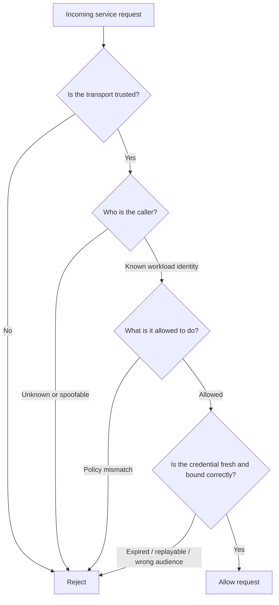
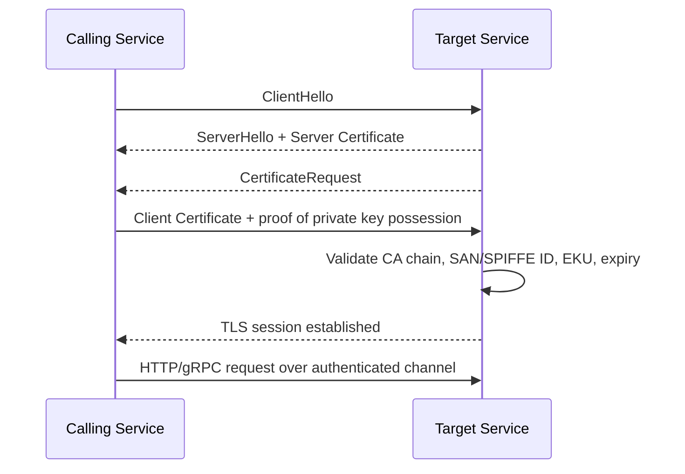

# Service-to-Service Authentication

> **Service-to-service authentication is how one workload proves its identity to another workload without a human in the loop. In modern API environments, this is often the difference between a contained incident and an attacker moving freely between internal services.**

---

## 🧠 What Is It? (Beginner Explanation)

When a user logs into an app, the app authenticates a **person**.

When `checkout-service` calls `inventory-service`, or an API gateway calls an internal billing API, the system must authenticate a **workload** instead. That is **service-to-service (S2S) authentication**.

Typical examples:

- a backend API calling another backend API
- a cron job pulling data from an internal service
- a worker consuming a queue and then calling a payment API
- a service mesh sidecar presenting identity for a workload

If this trust is weak, an attacker who gets:

- an internal foothold,
- SSRF into a trusted network segment,
- a leaked service secret,
- or access to a compromised workload

may be able to impersonate one service to another.

That is why S2S authentication matters so much in **authorized API testing**: many modern applications are secure at the user-facing edge, but fragile in their east-west service trust.

---

## 👤 User Authentication vs 🤖 Service Authentication

| Topic | User Authentication | Service-to-Service Authentication |
|---|---|---|
| Identity being proven | Human user | Application, workload, daemon, job, sidecar |
| Common credentials | Password, MFA, session cookie, OIDC login | Client secret, private key, client certificate, signed assertion, workload identity |
| Common protocols | OIDC, SAML, session auth | OAuth 2.0 client credentials, mTLS, private\_key\_jwt, HMAC, SPIFFE/SPIRE |
| Main risk | Account takeover | Lateral movement, replay, trust-boundary collapse |
| Main policy question | “Who is this user?” | “Which service is calling, and what is it allowed to do?” |

---

## 🎯 Why API Pentesters Care

Service-to-service authentication failures often appear as:

- internal APIs trusting **network location** instead of identity
- bearer tokens that work against the **wrong audience**
- gateways enforcing auth while **direct backend paths** do not
- mTLS enabled at the edge but **not enforced end-to-end**
- shared client secrets reused across many services
- identity headers such as `X-Client-Id` or `X-Forwarded-Client-Cert` being trusted without sanitization

In OWASP terms, these issues often contribute to:

- **API2: Broken Authentication**
- **API5: Broken Function Level Authorization**
- **API8: Security Misconfiguration**
- **API9: Improper Inventory Management**

---

## 📊 Big Picture Diagram



---

## 🏗️ Common S2S Authentication Models

| Model | How identity is proven | Strengths | Common weaknesses | Good defensive testing focus |
|---|---|---|---|---|
| **API key** | Static secret in header or query parameter | Simple, easy to integrate | Secret leakage, no strong identity, often no expiry, poor attribution | Verify key storage, rotation, scope, and rejection of missing/invalid keys |
| **OAuth 2.0 client credentials** | Client authenticates to token endpoint, gets access token | Standardized, scoped, short-lived tokens possible | Overbroad scopes, long-lived bearer tokens, audience mistakes | Verify `aud`, `scope`, TTL, token reuse, and direct-backend bypass |
| **mTLS** | TLS client certificate proves workload identity | Strong channel + identity binding | Operational complexity, proxy termination mistakes, weak CA trust | Verify cert request/enforcement, SAN/SPIFFE mapping, and header spoofing resistance |
| **private\_key\_jwt / JWT client assertion** | Client signs a JWT assertion with private key | Better than shared secrets, supports key rotation | Replay, bad audience validation, bad algorithm handling | Verify `aud`, `iss`, `sub`, `exp`, `jti`, JWKS rotation, and replay controls |
| **HMAC request signing** | Request is signed with shared secret | Better integrity than raw API keys | Canonicalization bugs, replay, secret sprawl | Verify nonce/timestamp handling and signature verification consistency |
| **Workload identity (SPIFFE/SPIRE / service mesh)** | Short-lived workload cert or JWT identifies service | Strong automation, short-lived credentials, less secret sprawl | Trust-domain confusion, fallback to insecure legacy auth, weak authorization between workloads | Verify trust domain, identity-to-policy mapping, rotation, and mesh bypass paths |

> In mature environments, these mechanisms are often **combined**. Example: mTLS for transport identity, plus OAuth access tokens for authorization context.

---

## 🔐 Four Questions Every Target Service Should Answer



As an authorized tester, you are usually validating these four areas:

1. **Transport trust** — TLS/mTLS, cert validation, trusted proxies  
2. **Caller identity** — client ID, service certificate, SPIFFE ID, signed assertion  
3. **Authorization policy** — scope, audience, service ACLs, method/path restrictions  
4. **Credential binding and freshness** — expiry, replay resistance, sender constraints, rotation

---

## 1) OAuth 2.0 Client Credentials

### What it is

The **client credentials grant** is the classic OAuth 2.0 machine-to-machine pattern. Per RFC 6749, the client obtains an access token **on its own behalf**, not on behalf of a user.

This is common for:

- internal microservice calls
- backend batch jobs
- CI/CD automation calling APIs
- gateway-to-service or service-to-service API access

### Basic flow

```http
POST /oauth/token HTTP/1.1
Host: auth.example.com
Content-Type: application/x-www-form-urlencoded
Authorization: Basic BASE64(<TEST_CLIENT_ID>:<TEST_CLIENT_SECRET>)

grant_type=client_credentials&scope=inventory.read
```

```http
HTTP/1.1 200 OK
Content-Type: application/json

{
  "access_token": "<ACCESS_TOKEN>",
  "token_type": "Bearer",
  "expires_in": 300,
  "scope": "inventory.read"
}
```

Then the service uses the token:

```http
GET /internal/inventory/stock HTTP/1.1
Host: inventory.example.com
Authorization: Bearer <ACCESS_TOKEN>
```

### What to test safely

| Check | Why it matters | Safe, authorized validation idea |
|---|---|---|
| Missing token returns `401` | Confirms auth is actually enforced | Send the same request without `Authorization` |
| Wrong scope returns `403` | Prevents overreach between services | Use an approved lower-privilege test client or token |
| Wrong audience is rejected | Stops token replay across APIs | Present a token issued for Service A to Service B only if scope and RoE permit |
| Token lifetime is short | Limits blast radius if leaked | Review `exp` / `expires_in` values and config |
| No refresh token is issued unexpectedly | Client credentials usually rely on re-authentication, not user-style refresh | Inspect token response shape |
| Direct backend paths still enforce auth | Prevents gateway-only security | Test in-scope internal paths or direct service routes with approval |

### Common implementation mistakes

- same client secret reused by many services
- bearer token accepted by multiple unrelated APIs because `aud` is ignored
- token scopes mapped too broadly, such as `admin.*` for all internal callers
- backend trusts gateway identity but also exposes a **bypass route**
- long-lived tokens stored in config files, CI variables, or container images

### Safe command examples

Use only approved **test credentials**:

```bash
# Request a token for an authorized test client
curl -s https://auth.example.com/oauth/token \
  -u '<TEST_CLIENT_ID>:<TEST_CLIENT_SECRET>' \
  -H 'Content-Type: application/x-www-form-urlencoded' \
  -d 'grant_type=client_credentials&scope=inventory.read'

# Verify the protected API rejects unauthenticated access
curl -i https://inventory.example.com/internal/inventory/stock
```

---

## 2) Mutual TLS (mTLS)

### What it is

In normal TLS, the **server** proves its identity to the client.

In **mutual TLS**, the **client also presents a certificate**, so both sides authenticate each other during the TLS handshake. This makes mTLS a strong fit for service-to-service trust, especially inside microservices, service meshes, and gRPC deployments.

### Handshake view



### What strong mTLS looks like

- client certs are **short-lived**
- service identity comes from a trusted CA or workload identity system
- authorization policy maps the certificate identity to allowed actions
- proxies do not blindly trust spoofable identity headers
- direct service access without the client cert fails before application logic

### What to test safely

| Check | Why it matters | Safe validation idea |
|---|---|---|
| Server requests a client certificate | Confirms mTLS is actually configured | Observe handshake with `openssl s_client` |
| Requests without a client cert fail | Confirms enforcement, not just support | Compare response without cert vs with approved test cert |
| Certificate identity maps correctly | Prevents trust-domain confusion | Review SAN, URI SAN, or SPIFFE ID in the test cert |
| TLS terminator forwards verified identity safely | Prevents header spoofing | Review whether downstream services trust only sanitized proxy-added headers |
| Certificate expiry/revocation is meaningful | Prevents stale workload access | Review rotation behavior and revocation handling with the client team |

### Safe observation commands

```bash
# Observe whether the server requests a client certificate
openssl s_client -connect api.example.com:443 -servername api.example.com

# Call an API with an approved test client certificate
curl -vk https://api.example.com/health \
  --cert ./approved-test-client.pem \
  --key ./approved-test-client.key
```

### Common mTLS findings

- mTLS is enabled only between the gateway and internet clients, not between internal services
- service accepts traffic from a “trusted” subnet even when no client cert is presented
- downstream service trusts `X-Forwarded-Client-Cert` from any source
- certificate subject is checked, but **authorization** is not, so any valid cert can call any method
- expired or rotated certificates remain valid due to stale trust bundles

---

## 3) JWT Client Assertions (`private_key_jwt`)

### What it is

Instead of authenticating to the token endpoint with a shared secret, a service can authenticate by sending a **signed JWT assertion**. This is standardized in RFC 7523 and commonly appears as `private_key_jwt`.

This is attractive because:

- no symmetric secret has to be shared with the authorization server
- keys can be rotated via JWKS
- compromise of one verifier does not automatically let every verifier mint new assertions

### Typical token endpoint request

```http
POST /oauth/token HTTP/1.1
Host: auth.example.com
Content-Type: application/x-www-form-urlencoded

grant_type=client_credentials&
client_id=<TEST_CLIENT_ID>&
client_assertion_type=urn:ietf:params:oauth:client-assertion-type:jwt-bearer&
client_assertion=<SIGNED_JWT_ASSERTION>&
scope=payments.read
```

### Important assertion claims

| Claim | Purpose | What the server should verify |
|---|---|---|
| `iss` | Issuer | Must match the registered client |
| `sub` | Subject | Usually also the client ID |
| `aud` | Audience | Must match the token endpoint or expected audience exactly |
| `exp` | Expiration | Must be short-lived |
| `iat` | Issued at | Should be recent |
| `jti` | Unique ID | Helps prevent replay |

### What to test safely

| Check | Why it matters | Safe validation idea |
|---|---|---|
| Audience must match exactly | Stops assertion replay at another endpoint | Confirm config and approved negative tests |
| Replay protection exists | Prevents reuse of captured assertions | Ask for a lab or test environment to validate repeated `jti` rejection |
| Algorithm handling is strict | Prevents verification confusion | Review allowed algorithms and JWKS config |
| JWKS rotation is safe | Prevents stale or orphaned trust | Check whether old keys remain trusted too long |

### Common weaknesses

- `aud` checked loosely or not at all
- `jti` absent, making assertion replay harder to detect
- old signing keys never removed
- unsigned or unexpected algorithms accepted by misconfigured libraries
- same keypair reused across environments and unrelated services

---

## 4) HMAC Signatures, API Keys, and Legacy Internal Headers

Not every internal API uses OAuth or mTLS. Older environments often rely on:

- static API keys
- HMAC-signed requests
- internal headers like `X-Service-Name`, `X-Internal-Auth`, or `X-Consumer-ID`
- IP allowlists plus a weak shared secret

These approaches are not always wrong, but they are frequently weaker and easier to misconfigure.

### Quick comparison

| Mechanism | Typical failure mode | Defensive testing focus |
|---|---|---|
| Static API key | Leaked in code, logs, CI, or query strings | Rotation, scope, storage, and rejection of bad keys |
| HMAC request signing | Replay if no nonce/timestamp; parser mismatch | Timestamp skew, nonce reuse, canonicalization consistency |
| Internal identity header | Header spoofing from untrusted paths | Verify only trusted proxies can inject identity headers |
| IP allowlist only | SSRF or internal foothold becomes “trusted caller” | Confirm network location is not the only control |

### Practical warning

If an API says “internal only” but its identity model is:

- source IP
- a static header
- or a long-lived API key shared by many services

then it is usually worth reviewing very carefully in an authorized engagement.

---

## 5) Workload Identity, Service Meshes, and SPIFFE/SPIRE

Modern platforms increasingly avoid hard-coded service secrets. Instead, they issue workloads **short-lived identities** automatically.

A common model is **SPIFFE/SPIRE**, where a workload receives:

- an **X.509-SVID** certificate, or
- a **JWT-SVID**

that identifies the workload, such as:

```text
spiffe://prod.example.internal/payments/charge-service
```

### Why this is useful

- no secret baked into the container image
- identities are short-lived and rotated automatically
- trust is centered on workload identity, not just network location

### Important nuance

JWT-style identities are easier to pass through some proxies, but replay risk is generally higher than with X.509-based identities. In many environments, X.509 workload identities are preferred when possible.

### What to test safely

| Check | Why it matters | Safe validation idea |
|---|---|---|
| Trust domain is correct | Prevents staging/prod confusion | Review trust bundle and identity namespace |
| Authorization is workload-specific | Prevents “any valid mesh cert can call anything” | Map service identity to allowed methods/paths |
| Rotation actually happens | Limits credential lifetime | Review certificate or token TTLs and renewal behavior |
| Legacy fallback is disabled | Prevents bypass of modern identity controls | Check whether a missing mesh identity falls back to an API key or trusted header |

---

## 🧪 Authorized Testing Workflow

Use a **safe, non-destructive** methodology. Avoid ad hoc credential manipulation with production secrets unless the engagement explicitly authorizes it and supplies controlled test identities.

| Step | Goal | Example evidence |
|---|---|---|
| 1. Map trust boundaries | Understand who talks to whom | Architecture diagrams, OpenAPI docs, mesh policy, gateway config |
| 2. Identify auth method | Learn whether the API uses OAuth, mTLS, HMAC, or headers | Traffic captures, config review, token endpoint docs |
| 3. Validate negative cases | Confirm auth fails safely | `401/403` for missing, wrong, or lower-privilege credentials |
| 4. Validate binding | Confirm token/cert is only valid where intended | Audience, scope, cert SAN/SPIFFE ID checks |
| 5. Check bypass paths | Ensure direct routes do not skip auth | Internal hostname, alternate port, old version, debug path |
| 6. Review lifecycle | Reduce blast radius from leakage | Secret rotation, cert rotation, short TTLs, revocation |
| 7. Review logging and alerting | Make misuse visible | Auth failure logs, certificate failures, repeated denied calls |

---

## 🚩 Common Findings and What They Mean

| Finding | Why it is dangerous | Likely impact |
|---|---|---|
| Same client secret shared across many services | One compromise expands to many callers | Lateral movement across APIs |
| Token audience not enforced | Token issued for one API works on another | Cross-service replay |
| Any valid mTLS cert is fully trusted | Authentication exists, authorization does not | Over-broad internal access |
| Proxy-added identity headers are spoofable | Caller can self-assert identity | Internal auth bypass |
| Long-lived service credentials in CI or images | Secrets linger far beyond intended use | Persistent unauthorized access |
| Direct backend route skips gateway checks | Edge looks secure, backend is not | Authentication bypass |
| Legacy fallback remains enabled | Modern control can be bypassed with older mechanism | Policy downgrade |

---

## 🛡️ What Good Service-to-Service Authentication Looks Like

Good S2S designs usually have most of these properties:

- **short-lived credentials** instead of permanent shared secrets
- **TLS everywhere**, with **mTLS** where risk justifies it
- **service identity** tied to a certificate, keypair, or signed assertion
- **authorization policy** based on caller identity, audience, method, and scope
- **no trust based only on network location**
- **credential rotation** and revocation that actually work
- **separation between staging and production trust domains**
- **clear logging** for failed auth, rejected certs, denied scopes, and replay indicators

---

## 🔍 Practical Review Checklist

```text
[ ] Does every internal API require an explicit identity proof?
[ ] Is auth enforced at the backend, not only at the gateway?
[ ] Are bearer tokens scoped and audience-restricted?
[ ] Are client secrets unique per service and rotated?
[ ] Are mTLS client certs actually required and validated?
[ ] Are proxy identity headers sanitized and trusted only from known components?
[ ] Are workload identities short-lived and environment-specific?
[ ] Are denied auth events logged and visible to defenders?
```

---

## 📚 Standards and References Worth Knowing

- **RFC 6749** — OAuth 2.0 Authorization Framework, especially client credentials grant
- **RFC 7523** — JWT profile for OAuth 2.0 client authentication
- **RFC 8705** — OAuth 2.0 mutual-TLS client authentication and certificate-bound tokens
- **OWASP REST Security Cheat Sheet** — guidance on HTTPS, access control, JWT validation, and API keys
- **SPIFFE concepts documentation** — workload identity, trust domains, X.509-SVIDs, and JWT-SVIDs

---

## 🧩 Key Takeaways

- Service-to-service authentication is about **workload identity**, not human login.
- In real APIs, the main patterns are **client credentials**, **mTLS**, **JWT client assertions**, **HMAC/API keys**, and **workload identity systems**.
- Strong designs authenticate the caller, bind credentials to the right audience or certificate, and enforce **authorization** per service and per action.
- During an authorized API assessment, focus on **scope, audience, replay resistance, gateway bypass, cert validation, header spoofing, and credential lifecycle**.
- Never assume “internal” means “safe.” In modern breaches, broken internal trust is often the pivot point.
