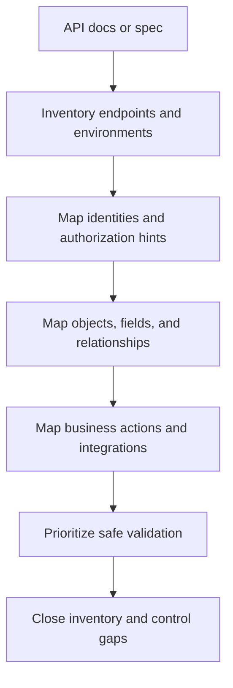
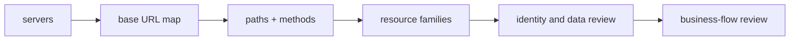
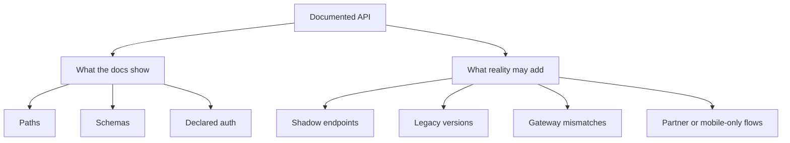

# API Documentation Analysis

> **Systematically reading API documentation and specifications to build an accurate, defensive map of endpoints, identities, data flows, and trust boundaries before any deeper testing.**

> **Authorized-use note:** This topic is about analyzing documentation you are permitted to access. The goal is to improve inventory, reduce blind spots, and prioritize safe validation work — not to provide harmful abuse playbooks.

---

## 🧠 What Is It? (Beginner Explanation)

API documentation analysis is the practice of treating documentation as a **high-signal reconnaissance source**.

Instead of starting with guesswork, you begin with what the API itself claims about:

- which endpoints exist
- which parameters they accept
- which objects they expose
- which authentication models they expect
- which versions and environments are in play
- which business actions are considered important enough to document

A good API spec is like a building blueprint. It does **not** prove the building is safe, and it may not show every hidden room, but it tells you where the doors, hallways, locks, and utility lines are supposed to be.

That matters because modern API risk is often an **inventory and trust problem**, not just an input-validation problem. OWASP API9:2023 explicitly calls out improper inventory management, stale documentation, old versions, and exposed hosts as a major API security failure mode.

---

## 🏗️ How It Works (Technical Deep Dive)

### Core Mental Model

Documentation is not just reference material. It is a **set of truth claims** about the API.

Your job is to read those claims in four layers:

1. **Surface layer** — hosts, paths, methods, versions, transports
2. **Identity layer** — auth schemes, scopes, roles, service trust
3. **Data layer** — objects, schemas, sensitive fields, examples
4. **Business layer** — workflows, privileged actions, integrations, webhooks



### A practical rule

**Documentation tells you what the designers intended.**  
**Observed traffic and runtime behavior tell you what the system actually does.**

High-quality recon compares both.

---

## Why Documentation Analysis Matters in API Recon

API documentation often reveals more than a simple endpoint list.

It can expose:

- undocumented or forgotten **versions** (`/v1`, `/beta`, `/internal`)
- **identity models** such as API keys, OAuth scopes, JWT bearer flows, or service credentials
- **sensitive object types** such as users, invoices, orders, balances, tokens, webhooks, admin tasks
- **high-value business flows** like signup, checkout, password reset, invite, export, refund, upload, approval
- **integration points** with third parties, callback receivers, or event consumers
- **environment clues** that distinguish production, staging, partner, mobile, or internal traffic

From a defender's perspective, this is exactly why documentation must be accurate, access-controlled where appropriate, and tied to inventory.

---

## 📚 Documentation Artifact Types You Should Recognize

| Artifact | What it usually contains | Why it matters for recon | Defensive review focus |
|---|---|---|---|
| **OpenAPI / Swagger** | Paths, methods, parameters, schemas, auth schemes, examples, servers | Best source for REST inventory | Version drift, stale endpoints, weak examples, overbroad schemas |
| **Swagger UI / ReDoc** | Human-readable rendering of OpenAPI | Fast visual map of the API surface | Public exposure, outdated rendering, hidden but linked specs |
| **Postman Collection** | Requests, environments, auth headers, variables, tests | Shows real client usage patterns | Hardcoded secrets, stale hosts, internal-only requests |
| **GraphQL introspection / SDL** | Types, fields, mutations, descriptions | Maps schema and business objects | Production introspection exposure, sensitive types, admin mutations |
| **WSDL** | Service operations, messages, bindings, endpoints | Strong signal for SOAP operations and contracts | Old endpoints, weak bindings, legacy exposure |
| **gRPC `.proto` / reflection** | Services, methods, message types | Reveals binary RPC attack surface | Reflection exposure, internal methods, missing auth context |
| **AsyncAPI / webhook docs** | Event channels, payloads, callback flows | Exposes event-driven and receiver surfaces | Signature verification, replay controls, callback trust |
| **Human-written docs / changelogs** | Business context, version history, examples | Reveals intent and operational history | Deprecated flows still live, partner-only features, rollout drift |

---

## ⚙️ Technical Details

### OpenAPI / Swagger: The Main Documentation Source

The official OpenAPI Specification defines a machine-readable description of HTTP APIs so humans and tools can discover capabilities **without source code or packet capture**. That makes OpenAPI the highest-value documentation format in most REST-centric recon.

The most important mental shift is this:

> An OpenAPI document is not merely a manual. It is a structured graph of **routes, data models, trust expectations, and business capabilities**.

### High-value OpenAPI fields

| Field | What it tells you | Why it matters |
|---|---|---|
| `openapi` | Spec version | Parser expectations, feature support, maturity clues |
| `info` | Title, description, contact, version | Ownership, scope, environment hints, stale docs |
| `servers` | Base URLs or relative URLs | Environment mapping, version prefixes, hidden hostnames |
| `tags` | Domain grouping | Business capability clusters |
| `paths` | Route inventory | Main endpoint map |
| `parameters` | Query, path, header, cookie inputs | Input surface and identifier structure |
| `requestBody` | Writable payload models | Creation/update surface |
| `responses` | Return shapes and error handling | Data exposure and workflow behavior |
| `components.schemas` | Object models | Sensitive fields, nested objects, relationships |
| `components.securitySchemes` | API key, OAuth2, bearer, etc. | Identity and trust model |
| `security` | Global or operation-level requirements | Least privilege vs broad defaults |
| `callbacks` / `webhooks` | Outbound calls and async trust | SSRF-adjacent design review, receiver inventory |
| `deprecated` | Retirement signal | Inventory drift and old-version risk |
| `examples` / `example` | Sample identifiers and payloads | Data classification, sanitization, realism |
| `externalDocs` | Additional docs | Linked attack surface and supporting context |

---

## 🧪 Working Example: Reading a Public OpenAPI Spec Safely

This note uses the public **Swagger Petstore OpenAPI 3.0.4** document as a harmless example of how to read an API spec.

### Small excerpt

```json
{
  "openapi": "3.0.4",
  "servers": [{ "url": "/api/v3" }],
  "paths": {
    "/pet/{petId}": {
      "get": {
        "operationId": "getPetById",
        "parameters": [
          { "name": "petId", "in": "path", "schema": { "type": "integer", "format": "int64" } }
        ],
        "security": [
          { "api_key": [] },
          { "petstore_auth": ["write:pets", "read:pets"] }
        ]
      }
    },
    "/pet/{petId}/uploadImage": {
      "post": {
        "requestBody": {
          "content": {
            "application/octet-stream": {
              "schema": { "type": "string", "format": "binary" }
            }
          }
        }
      }
    }
  }
}
```

### What a defensive analyst extracts immediately

| Observation from the spec | Why it matters |
|---|---|
| `"/api/v3"` appears in `servers` | There is an explicit versioned base path, so inventory should verify whether older versions still exist |
| `"/pet/{petId}"` uses an object identifier in the path | Object-level authorization and ID handling must be reviewed wherever object IDs appear |
| The same operation allows different security schemes | Mixed auth modes can create policy drift or inconsistent enforcement |
| `uploadImage` accepts binary content | File handling, size limits, scanning, and storage controls become part of the review |
| Tags and operation IDs describe domains and actions | Documentation can reveal business capabilities before you ever inspect runtime traffic |

### The key lesson

A useful spec tells you more than **how to call** the API. It tells you **what should be controlled**.

---

## 🔍 A Structured Workflow for Documentation Analysis

### Phase 1: Establish scope and ownership

Before reading details, answer these questions:

| Question | Why it matters |
|---|---|
| Who owns this API? | Determines escalation path and change control |
| Is the document for public, partner, internal, or admin use? | Changes expected trust level |
| Which environment is described? | Prevents production/staging confusion |
| What version is current, and what versions still exist? | Directly tied to API inventory risk |
| Is the spec authoritative or aspirational? | Some docs are generated from code; others are manually maintained and stale |

### Phase 2: Build the route map

Start with route inventory:

- normalize base URLs from `servers`
- list every `path + method`
- group by `tags`, resource families, and business domains
- mark create, read, update, delete, search, export, import, upload, admin, and webhook operations



### Phase 3: Map identities and trust boundaries

Look for:

- `components.securitySchemes`
- global `security`
- operation-specific `security`
- OAuth scopes
- API key location (`header`, `query`, `cookie`)
- service-to-service hints such as internal endpoints or machine identities

Ask defensive questions such as:

- Is auth defined globally but missing on sensitive operations?
- Are admin or partner functions documented next to general user functions?
- Are scope names overly broad?
- Are multiple auth schemes declared without clear separation?

### Phase 4: Map objects, fields, and relationships

Inspect `components.schemas`, request bodies, and responses for:

- primary identifiers
- foreign keys and object references
- writable fields
- role or permission fields
- account, payment, token, profile, export, and audit objects
- nested objects that may cause excessive data exposure

Good documentation analysis turns schemas into a **data sensitivity map**.

### Phase 5: Map business actions

Documentation often reveals which actions are security-critical even when the payloads look simple.

High-signal examples include:

- login, registration, password reset, MFA, device registration
- refund, transfer, payout, invoice, coupon, loyalty, trial, credit
- invite, approval, role change, account suspension, API key rotation
- file upload, export, import, bulk update, webhook registration

These are business-control checkpoints, not just endpoints.

### Phase 6: Compare documented intent to observed reality

A mature review compares:

- **documented** paths vs **observed** traffic
- **documented** auth requirements vs **actual** enforcement
- **documented** versions vs **deployed** versions
- **documented** schemas vs **runtime** responses
- **documented** webhooks/callbacks vs **real** integration inventory

This is where documentation analysis becomes inventory validation rather than passive reading.

---

## 🧭 Reading Documentation Like a Security Engineer

### 1. Read names as clues

Names matter. A route like `/admin/users/export`, a tag like `internal`, or a schema called `ImpersonationSession` says a lot before any request is made.

Common high-signal naming patterns include:

- `admin`, `internal`, `partner`, `backoffice`, `ops`
- `export`, `bulk`, `search`, `audit`, `debug`
- `beta`, `legacy`, `deprecated`, `v1`, `v2`
- `keys`, `tokens`, `sessions`, `approvals`, `roles`

### 2. Read examples as data-classification hints

Examples frequently reveal:

- identifier shape
- enum values
- internal naming conventions
- field sensitivity
- integration semantics

They should also be reviewed for defensive hygiene:

- Are examples sanitized?
- Do sample emails, tenant IDs, or tokens look real?
- Are secrets or internal hostnames accidentally included?

### 3. Read schemas as authorization clues

Documentation is full of indirect authorization hints.

If a schema includes fields like:

- `role`
- `isAdmin`
- `status`
- `accountBalance`
- `permissions`
- `tenantId`
- `ownerId`
- `approvedBy`

then the review should explicitly ask:

- who may read each field?
- who may write each field?
- which fields are server-controlled?
- which fields are copied between services?

### 4. Read response models as exposure clues

Response bodies show whether the API returns:

- full objects vs minimal projections
- nested data from related entities
- internal metadata
- debugging information
- rate limit information
- workflow timing and state transitions

### 5. Read deprecation markers as inventory clues

If the documentation uses:

- `deprecated: true`
- changelog references
- sunset notices
- old version prefixes
- “do not use” descriptions

then the inventory review should confirm that older surfaces are actually retired, not merely hidden from the main docs.

---

## 📊 Documentation Clues → Security Questions

| Documentation clue | Security question to ask |
|---|---|
| Path parameters like `/users/{userId}` or `/orders/{orderId}` | Is access checked per object, per tenant, and per relationship? |
| Bulk endpoints (`/bulk`, `/export`, `/search`) | Are rate limits, authorization scopes, and data projections constrained? |
| Upload endpoints or binary request bodies | Are type, size, malware, and storage controls documented and enforced? |
| Multiple `servers` entries or relative server URLs | Are all environments and hosts inventoried and protected equally? |
| OAuth scopes such as `admin:*` or very broad scopes | Are scopes too coarse for the actions exposed? |
| Deprecated endpoints still described | Are older versions still reachable or sharing production data? |
| `callbacks`, webhook URLs, or external integrations | Are receiver trust, signature validation, and replay controls defined? |
| Very permissive schemas (`additionalProperties`, weak typing) | Can server-side field allowlists and validation prevent unsafe input handling? |
| Response examples with rich nested data | Is there a risk of returning more data than the client needs? |
| Human docs mention partner/mobile/internal usage | Are segmentation and authorization models actually different and enforced? |

---

## Safe, Local Analysis Techniques

When you have an authorized copy of a spec, you can extract structure locally without touching any production endpoint.

### JSON spec: list methods and paths

```bash
jq -r '
  .paths
  | to_entries[]
  | .key as $path
  | .value
  | keys[]
  | "\(.|ascii_upcase) \($path)"
' openapi.json
```

### JSON spec: list declared auth schemes

```bash
jq -r '.components.securitySchemes | keys[]' openapi.json
```

### YAML spec: inspect server URLs and versions

```bash
yq '.servers[]?.url' openapi.yaml
```

### JSON spec: find deprecated operations

```bash
jq -r '
  .paths
  | to_entries[]
  | .key as $path
  | .value
  | to_entries[]
  | select(.value.deprecated == true)
  | "\(.key|ascii_upcase) \($path)"
' openapi.json
```

### JSON spec: identify file-handling or binary operations

```bash
jq -r '
  .paths
  | to_entries[]
  | .key as $path
  | .value
  | to_entries[]
  | select(
      (.value.requestBody.content["application/octet-stream"] != null) or
      (.value.requestBody.content["multipart/form-data"] != null)
    )
  | "\(.key|ascii_upcase) \($path)"
' openapi.json
```

These are inventory and prioritization techniques. They help you build a review plan without unsafe interaction.

---

## Beyond REST: How Other Documentation Formats Change Recon

### GraphQL documentation analysis

Official GraphQL guidance explains that introspection can reveal the schema's types, fields, descriptions, and root operations. That makes GraphQL introspection both a developer convenience and a powerful recon source.

Defensive takeaways:

- introspection can expose the full schema map
- descriptions and type names often reveal business intent
- production exposure should be evaluated in context
- documentation review should include queries, mutations, subscriptions, and custom directives

### WSDL analysis

WSDL separates a service description into abstract functionality and concrete binding/endpoint details. For recon, that means a WSDL can reveal:

- operation names
- message structures
- bindings and endpoints
- transport expectations
- legacy or parallel service exposures

### gRPC and protobuf analysis

Whether documentation is a `.proto` file, generated docs, or reflection data, the security value is similar:

- service and method inventory
- message schemas and enums
- admin or internal method names
- indications of trust between gateway and backend services

The common theme across REST, GraphQL, SOAP, and gRPC is the same: **documentation is a map of reachable capability**.

---

## Documentation Blind Spots: What the Spec Usually Does *Not* Tell You

A strong note on API documentation analysis must also teach skepticism.

Documentation often fails to show:

- real authorization decisions deep in application logic
- hidden or undocumented endpoints
- gateway-to-backend policy mismatches
- shadow APIs used by mobile apps or internal tools
- runtime-only rate limits and anomaly controls
- feature flags and tenant-specific behavior
- stale non-production deployments sharing production data
- third-party integrations that were never added to the official docs



This is why documentation analysis should feed, not replace, traffic analysis and asset validation.

---

## A Reviewer's Triage Checklist

Use documentation to prioritize which areas deserve the earliest validation.

| Priority area | Documentation signals |
|---|---|
| **Inventory drift** | Multiple versions, deprecated operations, unclear environments, missing retirement signals |
| **Object authorization** | Many path IDs, nested object references, tenant/account ownership fields |
| **Property-level controls** | Rich schemas with role, status, balance, flags, permissions, or nested private data |
| **Function-level controls** | Admin tags, approval flows, role changes, internal/partner functions |
| **Business-flow abuse resistance** | Signup, checkout, invite, export, reset, upload, bulk, webhook registration |
| **Sensitive integrations** | Callback objects, webhooks, third-party APIs, event delivery docs |
| **Resource protection** | Search, export, report generation, batch operations, upload/download endpoints |
| **Legacy exposure** | `v1`, `beta`, `legacy`, old hosts, parallel environments |

---

## 🛡️ Defensive Uses of Documentation Analysis

Documentation analysis is not only for testers. It is a core defensive discipline.

### For engineering teams

- generate specs automatically from code or source-of-truth contracts where possible
- review examples so they do not contain real data, secrets, or internal hostnames
- mark deprecated operations clearly and attach retirement dates
- separate public, partner, internal, and admin documentation where appropriate
- ensure auth requirements are explicit at both global and operation levels

### For AppSec and API security teams

- compare the spec against observed traffic and service inventory
- use documentation to build authorization matrices
- tie documented business actions to abuse-case reviews
- feed documentation changes into threat modeling and security regression reviews
- monitor for shadow APIs not represented in the authoritative inventory

### For defenders and incident responders

- use specs to understand likely object relationships and sensitive flows during triage
- map which integrations and callback receivers may be involved in an incident
- identify whether old documented versions still exist and share data stores
- confirm whether exposed docs leak operational details that help attackers orient quickly

---

## Common Mistakes When Reading API Docs

| Mistake | Better approach |
|---|---|
| Treating the spec as complete truth | Treat it as one evidence source and verify against reality |
| Looking only at endpoint count | Also map identities, schemas, examples, and business actions |
| Ignoring `servers` and version markers | Use them to drive inventory review |
| Focusing only on auth schemes | Also inspect object models, writable fields, and privileged workflows |
| Skipping deprecated operations | Old versions are often where inventory debt hides |
| Reading docs without context | Always ask who the intended consumers are: public, partner, internal, admin |
| Ignoring generated examples | Examples often leak data shape, trust assumptions, and field sensitivity |

---

## Field Guide: What “Good” Looks Like

A mature API documentation posture usually has these traits:

- an authoritative spec or contract for each active API
- explicit environment labeling
- version ownership and retirement metadata
- documented auth and authorization expectations
- sanitized examples
- documented rate-limit and error behavior
- documented webhooks/callbacks and third-party dependencies
- CI/CD workflows that regenerate or validate docs
- access controls for sensitive internal documentation

That posture directly reduces API9-style inventory risk.

---

## Key Takeaways

- API documentation analysis is one of the fastest ways to convert a vague API target into a structured security model.
- OpenAPI/Swagger is especially valuable because it encodes paths, schemas, auth, and examples in a machine-readable graph.
- GraphQL introspection, WSDL, gRPC schemas, Postman collections, and webhook docs play the same role in other ecosystems.
- The best analysts read docs in four layers: **surface, identity, data, and business**.
- Documentation is powerful, but incomplete. It must be compared against observed traffic, deployed inventory, and runtime controls.
- Defensively, good documentation hygiene is not just convenience — it is part of API security governance.

---

## 📚 References

- [OpenAPI Initiative — OpenAPI Specification](https://spec.openapis.org/oas/latest.html)
- [Swagger — Specification Overview](https://swagger.io/specification/)
- [Swagger Petstore — Example OpenAPI 3.0 document](https://petstore3.swagger.io/api/v3/openapi.json)
- [OWASP API Security Top 10 2023](https://owasp.org/API-Security/editions/2023/en/0x11-t10/)
- [OWASP API9:2023 — Improper Inventory Management](https://owasp.org/API-Security/editions/2023/en/0xa9-improper-inventory-management/)
- [GraphQL — Introspection](https://graphql.org/learn/introspection/)
- [W3C — Web Services Description Language (WSDL) 2.0](https://www.w3.org/TR/wsdl20/)
