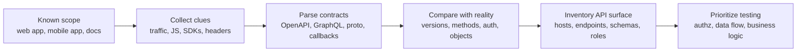
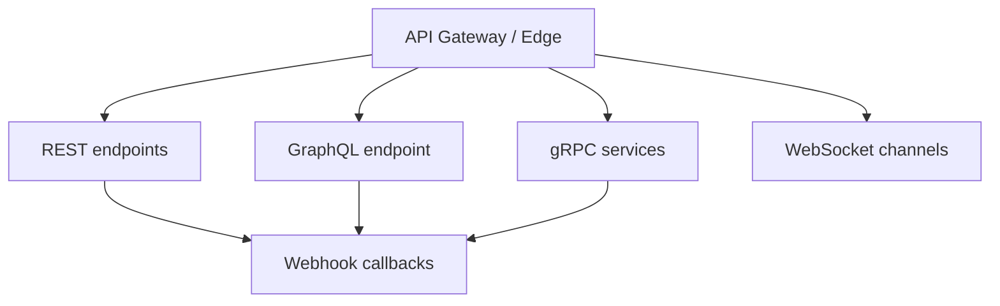

# API Reconnaissance

> **Systematic discovery of an API's real surface area — hosts, versions, schemas, endpoints, identities, and trust boundaries — during authorized security testing.**

> **Authorized testing only:** API reconnaissance should stay inside written scope, favor low-impact discovery first, and avoid destructive actions, brute-force behavior, or production disruption. The goal is to build an accurate map so later validation is precise, safe, and explainable.

---

## 🧠 What Is It? (Beginner Explanation)

API reconnaissance is the process of learning **how an API is exposed and how clients use it** before testing deeper security controls.

If an API pentest starts with guessing random paths, it becomes noisy and incomplete. Good recon is different: it builds a structured inventory of:

- **where the API lives** — domains, subdomains, paths, gateways, and versions
- **how clients talk to it** — REST, GraphQL, gRPC, WebSockets, webhooks, or mixed patterns
- **how identity flows** — cookies, bearer tokens, API keys, OAuth, service tokens, mTLS
- **what objects matter** — users, orders, tenants, invoices, exports, reports, admin actions
- **what documentation exists** — OpenAPI, Swagger UI, GraphQL schema clues, `.proto` files, Postman collections, developer docs
- **what is undocumented** — beta routes, deprecated versions, internal-only endpoints, mobile-only functionality, partner integrations

A useful mental model is: **API recon is attack-surface mapping for interfaces, not pages.**

A browser UI might show five features. The underlying API may expose fifty operations supporting web, mobile, partner, automation, and internal service clients.

**Simple analogy:** a website is the shopfront; API recon maps the loading docks, staff doors, delivery routes, badge readers, and service corridors behind it.

---

## 🏗️ How It Works (Technical Deep Dive)

Professional API recon moves from **documented surface → observed behavior → hidden surface → prioritized inventory**.

### Phase 1: Start with known assets

Begin with what the engagement already gives you:

- in-scope domains and mobile apps
- test accounts and user roles
- known API base URLs
- developer portals and docs
- captured traffic from the real application

This immediately lowers noise and keeps discovery tied to real business flows.

### Phase 2: Extract machine-readable contracts

Modern APIs often describe themselves through structured artifacts:

- **OpenAPI / Swagger** for REST APIs
- **GraphQL schema metadata** and introspection-related responses
- **gRPC reflection** or `.proto` definitions
- **Postman / Insomnia collections**
- **callback or webhook definitions** in API docs and specs

These artifacts are valuable because they reveal more than endpoint names. They often disclose:

- supported methods
- parameter names and types
- authentication schemes
- versioning conventions
- deprecated operations
- example payloads
- callback destinations and event names

### Phase 3: Observe real client behavior

Documentation is helpful, but real clients often reveal what the docs miss.

High-value recon sources include:

- browser developer tools and proxy captures
- SPA JavaScript bundles
- mobile app configuration and network traces
- error messages returned by the API
- request/response differences between user roles
- SDKs, public repos, and integration snippets

This is where testers often find:

- alternate base paths
- feature-flagged endpoints
- mobile-only routes
- legacy versions still in use
- internal service names leaked in errors or headers

### Phase 4: Compare documented and observed surface

This comparison is where recon becomes useful.

Ask:

- Is every documented endpoint actually reachable?
- Are there reachable endpoints not present in docs?
- Do older versions expose weaker behavior?
- Do different clients call different backends?
- Are there protocol transitions, such as REST at the edge and gRPC behind a gateway?
- Do webhook receivers or async flows introduce separate trust boundaries?

### Phase 5: Build a testing inventory

The recon output should become an inventory, not a pile of notes.

For each API host or operation, capture:

- host / base path / version
- protocol
- auth mechanism
- user roles involved
- object identifiers used
- parameters and body fields
- data sensitivity
- source of discovery
- whether it is documented, deprecated, beta, internal, or partner-facing

That inventory becomes the foundation for later notes such as endpoint mapping, authorization testing, property-level authorization testing, and business-logic analysis.

---

## 📊 Diagram — Reconnaissance Flow



---

## ⚙️ Technical Details

### 1. What strong API recon should collect

| Recon artifact | Why it matters | Examples of useful clues |
|---|---|---|
| **Hosts and base paths** | Defines where testing should start and where shadow surface may exist | `api.example.com`, `partner-api.example.com`, `/v1/`, `/internal/` |
| **Protocol type** | Changes tooling, parsing, and trust assumptions | REST, GraphQL, gRPC, WebSocket, webhook receivers |
| **Authentication model** | Tells you how identity reaches the service | Bearer token, cookie session, API key, OAuth access token, service token, mTLS |
| **Methods and content types** | Shows how the API expects input and where parsing differs | `GET`, `POST`, `PATCH`, `OPTIONS`, `application/json`, `multipart/form-data`, `application/grpc` |
| **Objects and identifiers** | Essential for later BOLA/BOPLA/function-level testing | `userId`, `tenantId`, `invoiceId`, `orderNumber`, UUIDs |
| **Versioning patterns** | Old versions often create inventory drift | `/v1/`, `/v2/`, `/beta/`, header-based versioning |
| **Schema or contract files** | Fastest route to understanding capabilities | `openapi.json`, `swagger.yaml`, GraphQL schema clues, `.proto` definitions |
| **Async interfaces** | Often missed during normal web testing | webhooks, WebSocket events, queues, callback URLs |
| **Error and metadata leakage** | Can reveal internal architecture or hidden services | stack traces, service names, debug headers, `grpc-status`, verbose validation errors |

### 2. Spec-first review: OpenAPI and Swagger

The OpenAPI Specification defines a standard machine-readable description for HTTP APIs. When present, it removes guesswork and lets both humans and tools understand paths, operations, parameters, servers, and authentication models.

For recon, do not stop at “the docs exist.” Read the contract like an attacker and a defender:

#### Fields worth reviewing first

| Spec area | Recon value | Why testers care |
|---|---|---|
| **`servers`** | Lists base URLs and environment hints | May expose prod, staging, partner, or region-specific hosts |
| **`paths`** | Enumerates operations quickly | Shows object patterns, admin functions, bulk actions, exports |
| **HTTP operations** | Reveals supported verbs | `GET`/`POST` may be documented, but `PATCH`/`DELETE` behavior may differ |
| **`parameters`** | Maps query/path/header/cookie inputs | Highlights identifiers, filters, feature switches, tenant selectors |
| **`requestBody` / `content`** | Shows accepted formats | Useful for spotting JSON/XML/form-data differences |
| **`securitySchemes`** | Describes auth expectations | API keys, bearer auth, OAuth scopes, cookie auth |
| **`deprecated`** | Flags old but still-live routes | Common signal for inventory drift |
| **`tags`, summaries, examples** | Adds business context | Helps prioritize high-value operations |
| **`callbacks` / webhook definitions** | Surfaces async trust boundaries | Often overlooked in normal endpoint-only recon |

#### Safe example workflow with a local OpenAPI file

```bash
# List documented paths
jq -r '.paths | keys[]' openapi.json

# Show method coverage for each path
jq -r '.paths | to_entries[] | "\(.key) -> \(.value | keys | join(", "))"' openapi.json

# Review advertised authentication schemes
jq -r '.components.securitySchemes | keys[]?' openapi.json

# Find deprecated operations
jq -r '.paths | to_entries[] | .key as $p | .value | to_entries[] | select(.value.deprecated == true) | "\($p) [\(.key)] deprecated"' openapi.json
```

These examples are low impact because they analyze **an already obtained contract file** rather than probing the target aggressively.

#### What to compare against reality

A mature tester always compares the contract with observed behavior:

- documented endpoints that return `404` or redirect elsewhere
- undocumented endpoints visible in traffic but absent from the spec
- auth documented in the spec but not consistently enforced in practice
- “deprecated” operations still reachable with production data
- environment URLs in `servers` that were not mentioned in scope notes

### 3. Human-readable docs, browser clues, and client-side artifacts

Machine-readable specs are not the only goldmine.

| Source | Typical clues | Common recon value |
|---|---|---|
| **Developer portal / API reference** | version names, auth flows, rate limits, examples | baseline understanding of intended usage |
| **Browser network traffic** | real endpoints, headers, tokens, pagination, object IDs | shows how the live app actually behaves |
| **SPA JavaScript bundles** | hardcoded base URLs, route names, feature flags | exposes hidden or pre-release functionality |
| **Mobile traffic and config** | alternate hosts, mobile-only APIs, device headers | often reveals endpoints the web client never calls |
| **SDKs / public repos / Postman collections** | endpoint naming, request examples, environments | useful when docs are partial or stale |
| **Error responses** | internal service names, validation schema details | identifies backend shape and hidden constraints |

Safe examples during authorized testing:

```bash
# Review a captured JS bundle for obvious API base paths
grep -Eo "https://[^\" ]+|/api/[A-Za-z0-9_./-]+" app.bundle.js | sort -u

# Review a saved HAR or proxy-exported requests for repeated API hosts
jq -r '.. | .url? // empty' traffic.har | grep '/api/' | sort -u

# Check which methods a known in-scope endpoint advertises
curl -isk -X OPTIONS https://api.example.com/v1/profile
```

These examples focus on **captured artifacts and known endpoints**, which is safer and more professional than blind spraying.

### 4. Recon across modern API protocols

APIs are rarely “just REST” anymore. Recon should match the protocol surface.

| API style | Where to look first | High-value recon clues | Low-impact validation idea |
|---|---|---|---|
| **REST / HTTP APIs** | OpenAPI, Swagger UI, browser traffic, SDK docs | paths, verbs, media types, auth schemes, versioning | review spec, compare with captured requests, test `OPTIONS` on known routes |
| **GraphQL** | `/graphql`, GraphiQL/Playground references, front-end queries | schema names, operation names, field aliases, batching support | verify whether introspection or schema errors expose metadata if explicitly permitted |
| **gRPC** | `.proto` files, client SDKs, service names, reflection | service list, message types, unary vs streaming methods | check whether reflection is enabled on known services within scope |
| **WebSockets** | JS bundles, proxy captures, upgrade requests | channel names, message types, auth at connect vs message level | review handshake and documented event formats |
| **Webhooks / callbacks** | docs, OpenAPI callbacks, partner guides | signing headers, retry behavior, event names, callback URL expectations | validate signature and replay controls in a test tenant |

### 5. Diagram — Modern API surface is wider than one endpoint



### 6. Protocol-specific notes that matter in recon

#### GraphQL

GraphQL introspection exists to help clients and tooling understand a schema. That is useful for developers, but it can also expand exposed metadata in production if not intentionally managed.

What to note during recon:

- whether schema information is available without strong access controls
- whether different roles see different schema or error behavior
- whether batching, aliases, or deeply nested operations are visible in client traffic
- whether the environment uses trusted documents / persisted queries for first-party clients

Minimal authorized check on a known GraphQL endpoint:

```http
POST /graphql HTTP/1.1
Host: api.example.com
Content-Type: application/json

{"query":"{__schema{queryType{name}}}"}
```

This kind of metadata check should be done only when the endpoint is in scope and the rules of engagement allow it.

#### gRPC

gRPC reflection is an optional server feature that helps runtime tools discover methods and protobuf descriptors without precompiled stubs. For defenders it is operationally useful; for testers it can reveal service metadata very quickly.

Useful recon questions:

- Is reflection enabled on internet-exposed or partner-exposed services?
- Are service names aligned with public docs, or do they disclose internal-only capabilities?
- Are there unary and streaming methods with different trust assumptions?
- Does a gateway expose REST outward but gRPC internally, creating policy drift?

Safe example against an authorized service:

```bash
grpcurl api.example.com:443 list
```

#### WebSockets and webhooks

These are often missed because they do not look like classic endpoint lists.

During recon, capture:

- handshake URL and upgrade path
- auth performed during connection establishment versus per-message authorization
- message types and channel names
- webhook event types, signing scheme, retry semantics, and source-IP assumptions

### 7. Modern attacker patterns mature testers should anticipate

Recon is not only about finding endpoints. It is about finding **where trust is broader than visibility**.

| Pattern | Why it matters now | Safe validation focus |
|---|---|---|
| **Shadow and zombie APIs** | Old or unofficial hosts remain reachable | compare inventory, DNS, docs, and client traffic |
| **Deprecated versions with real data** | Older routes may lack newer controls | confirm version coverage and retirement status |
| **Valid-account abuse** | Many API incidents use real credentials or tokens | map roles, scopes, and high-value business actions |
| **Spec and schema leakage** | Contracts reveal capability faster than crawling | review who can access docs, introspection, reflection |
| **Alternate transport blind spots** | REST may be protected while GraphQL/gRPC/WebSockets lag behind | ensure recon includes every protocol in the trust path |
| **Partner and callback trust** | Data-sharing and webhook flows create hidden exposure | map third-party integrations and callback handling |
| **Machine identity sprawl** | API keys and service tokens often sit directly in the trust path | inventory non-human identities and their reach |
| **AI / automation clients** | APIs increasingly serve bots and agents, not just users | document rate, cost, and business-flow sensitivity |

---

## 🔴 Attack Surface — Signals Worth Escalating

Recon should surface the places where later security testing is most likely to matter.

### High-value signals

- **Identifiers everywhere** — object IDs in paths, body fields, filters, exports, and nested relationships
- **Role-specific operations** — admin, support, partner, finance, reporting, and bulk-management routes
- **Inventory drift** — `/v1/`, `/v2/`, `/beta/`, `/internal/`, `/mobile/`, or region-specific hosts that behave differently
- **Bulk and asynchronous actions** — exports, imports, search, reporting, queues, callbacks, subscriptions
- **Machine-readable metadata** — OpenAPI, schema endpoints, reflection, SDK collections, `.proto` references
- **Sensitive business flows** — signup, password reset, payment, coupon, referral, invite, approval, workflow state changes
- **Debug and support features** — verbose errors, health/debug endpoints, test-only routes, environment banners

### Example of an inventory clue set

```yaml
servers:
  - url: https://api.example.com/v1
  - url: https://partner-api.example.com/v1
paths:
  /users/{userId}/exports:
    get:
      deprecated: true
      security: []
  /internal/reports/run:
    post:
      tags: [admin, reporting]
  /webhooks/orders:
    post:
      summary: Receive order events
```

What this suggests to a tester:

- there may be **multiple trust zones** (`api` vs `partner-api`)
- a **deprecated route** may still be online
- an **internal/admin-style function** exists and should be documented carefully
- there is a **webhook receiver** that likely has separate authentication and replay requirements

The point is not to jump straight into abuse. The point is to know **which areas deserve controlled follow-up testing**.

---

## ✅ Authorized Testing Workflow

This is the practical workflow for safe, professional API reconnaissance.

### Step 1: Confirm scope and safe handling rules

Before touching the API, document:

- allowed hosts and environments
- production versus staging restrictions
- whether automated discovery is allowed
- which accounts, tenants, or seed data are safe to use
- whether schema introspection, reflection, or documentation endpoints are explicitly permitted

### Step 2: Start passive or near-passive

Prefer the lowest-impact sources first:

- supplied docs and collections
- captured traffic from normal application use
- source-visible client artifacts such as JS bundles
- existing API contracts and sample requests

This often reveals most of the useful surface without creating operational risk.

### Step 3: Validate known endpoints non-destructively

Examples:

```bash
# Review response headers on a known documentation endpoint
curl -isk https://api.example.com/openapi.json | sed -n '1,20p'

# Review allowed methods on a known low-risk resource
curl -isk -X OPTIONS https://api.example.com/v1/profile

# Extract endpoints from an obtained OpenAPI file
jq -r '.paths | keys[]' openapi.json
```

Good recon requests are:

- idempotent where possible
- targeted at known resources
- easy to explain in a report
- unlikely to create, modify, or delete business data

### Step 4: Build an inventory table

A simple inventory is better than scattered screenshots.

| Host / Path | Protocol | Version | Auth | Source | Notes |
|---|---|---|---|---|---|
| `api.example.com/v1/users` | REST | v1 | Bearer token | OpenAPI + browser traffic | uses UUID object IDs |
| `api.example.com/graphql` | GraphQL | current | Session cookie | SPA bundle | schema metadata visible in errors |
| `partner-api.example.com/v1/orders` | REST | v1 | API key | partner docs | partner-only trust boundary |
| `stream.example.com/socket` | WebSocket | current | JWT on connect | proxy capture | events include tenant-scoped channels |
| `api.example.com/webhooks/orders` | Webhook receiver | current | HMAC signature | docs | async callback trust path |

### Step 5: Ask the questions that unlock later findings

By the end of recon, you should be able to answer:

1. **What API hosts and versions actually exist?**
2. **What protocols are in play besides REST?**
3. **What identities can call what operations?**
4. **Which operations are documented, deprecated, hidden, or role-specific?**
5. **Which objects, properties, and business actions are highest value?**
6. **Which areas deserve deeper testing for authorization, business logic, and inventory drift?**

If you cannot answer those questions yet, recon is not finished.

---

## 🔍 Detection

Defenders can often spot reconnaissance even when it is low volume.

| Signal | What it may indicate |
|---|---|
| Requests to docs or schema endpoints | spec discovery or endpoint inventory work |
| Sudden `OPTIONS` or uncommon method usage on many resources | method-capability mapping |
| GraphQL introspection-related requests | schema enumeration |
| gRPC reflection calls | service and protobuf discovery |
| Requests across multiple API versions or partner hosts | inventory comparison or version hunting |
| Repeated access to low-traffic metadata endpoints | targeted recon rather than normal user behavior |
| Error-heavy exploration of parameter or content-type variations | request-shape discovery |

Useful logging and telemetry include:

- endpoint, method, status, and authenticated principal
- version and host requested
- GraphQL operation names and introspection events
- gRPC service/method names and reflection usage
- webhook signature failures and replay indicators
- user-agent and automation fingerprints where lawful and appropriate

---

## 🛡️ Mitigation & Defense

Good defense makes recon less revealing and inventory drift less dangerous.

### Defensive priorities

- **Maintain a real API inventory** across hosts, versions, environments, and protocols
- **Generate API docs automatically** from source or deployment pipelines so docs stay current
- **Restrict documentation and schema metadata exposure** to the audiences that truly need it
- **Retire old versions aggressively** and avoid leaving production data reachable through legacy deployments
- **Apply security controls consistently** across REST, GraphQL, gRPC, WebSockets, and webhook receivers
- **Inventory machine identities** such as service accounts, CI/CD tokens, and partner API keys
- **Monitor for recon signals** including schema access, reflection, version hunting, and metadata endpoint usage

### Practical hardening checklist

- [ ] Document every API host, version, protocol, and audience
- [ ] Track whether each endpoint is public, partner, internal, mobile-only, or admin-only
- [ ] Review OpenAPI `servers`, `securitySchemes`, and deprecated operations during release cycles
- [ ] Disable or tightly gate GraphQL introspection in production where it is not needed
- [ ] Disable or restrict gRPC reflection on exposed production services unless there is a strong operational need
- [ ] Protect webhook receivers with signing, replay defense, and clear source validation
- [ ] Ensure gateways and backend services enforce the same authn/authz expectations
- [ ] Remove or protect debug, beta, and staging endpoints before internet exposure

---

## 📚 References

- [OWASP API Security Top 10 2023](https://owasp.org/API-Security/editions/2023/en/0x11-t10/)
- [OWASP API9:2023 Improper Inventory Management](https://owasp.org/API-Security/editions/2023/en/0xa9-improper-inventory-management/)
- [PortSwigger Web Security Academy - API testing](https://portswigger.net/web-security/api-testing)
- [OpenAPI Specification](https://spec.openapis.org/oas/latest.html)
- [GraphQL - Introspection](https://graphql.org/learn/introspection/)
- [GraphQL - Security](https://graphql.org/learn/security/)
- [gRPC Server Reflection Protocol](https://github.com/grpc/grpc/blob/master/doc/server-reflection.md)
