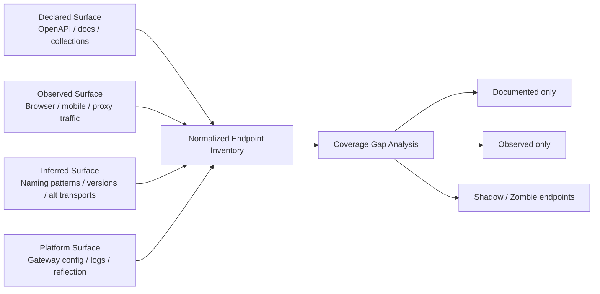
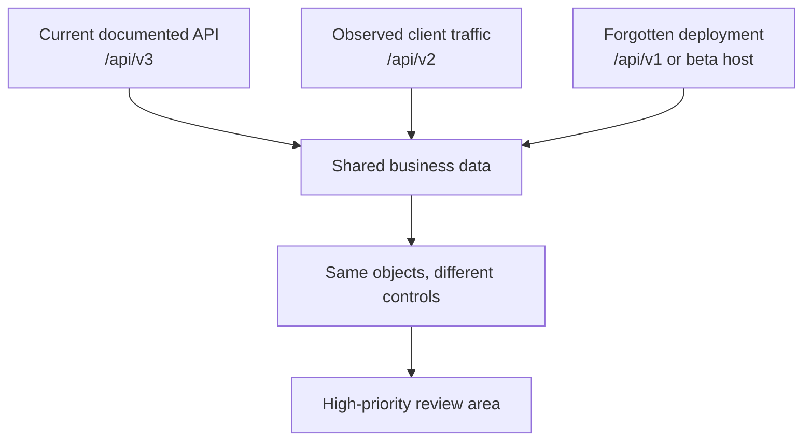

# Endpoint Discovery

> **Difficulty:** Beginner → Advanced | **Category:** API Pentesting  
> **Use only on systems you own or are explicitly authorized to assess.** Prefer passive evidence, documentation review, and low-impact validation before any active probing.

**Endpoint discovery** is the process of building a complete inventory of how an API can actually be reached in the real world — not just what the public documentation claims exists. In modern environments, the true surface often includes **documented endpoints, undocumented routes, deprecated versions, alternate transports, internal-only paths accidentally exposed externally, and client-specific entry points**.

The key lesson is simple:

> **The API contract shows intended behavior. Traffic shows actual behavior. Drift reveals risk.**

That matters because endpoint discovery feeds directly into the biggest API security problems called out by modern guidance, especially **improper inventory management, security misconfiguration, broken function-level authorization, and exposure of old API versions**.

---

## Table of Contents

1. [Why Endpoint Discovery Matters](#why-endpoint-discovery-matters)
2. [Mental Model: One Path Is Not One Endpoint](#mental-model-one-path-is-not-one-endpoint)
3. [Discovery Sources and Signal Quality](#discovery-sources-and-signal-quality)
4. [An Authorized, Low-Risk Workflow](#an-authorized-low-risk-workflow)
5. [Reading the API Contract First](#reading-the-api-contract-first)
6. [Observing Real Client Traffic](#observing-real-client-traffic)
7. [Mining Client Artifacts](#mining-client-artifacts)
8. [Version Drift, Shadow APIs, and Zombie Endpoints](#version-drift-shadow-apis-and-zombie-endpoints)
9. [Non-REST Endpoint Discovery](#non-rest-endpoint-discovery)
10. [Building a Useful Endpoint Inventory](#building-a-useful-endpoint-inventory)
11. [Prioritizing What to Review Next](#prioritizing-what-to-review-next)
12. [Defender Guidance](#defender-guidance)
13. [Research Basis and Further Reading](#research-basis-and-further-reading)

---

## Why Endpoint Discovery Matters

APIs usually expose **more surface area than developers think**. That happens because modern systems are built from:

- public and partner-facing APIs
- browser-facing backend APIs for SPAs
- mobile-specific endpoints
- internal admin or support routes
- deprecated versions still kept alive for compatibility
- GraphQL, gRPC, WebSocket, and webhook interfaces beside REST
- gateway routes that differ from backend service routes

If you only look at the official docs, you often miss the riskiest parts of the system.

### Common discovery gaps

| Gap | What it looks like | Why it matters |
|---|---|---|
| **Documented but not observed** | Exists in OpenAPI, never seen in traffic | May be stale, admin-only, or dormant but still reachable |
| **Observed but undocumented** | Seen in HAR/proxy/mobile traffic, absent from docs | Strong signal for shadow APIs or spec drift |
| **Deprecated but reachable** | `/v1/` still works while `/v3/` is current | Old auth, weaker validation, older business logic |
| **Transport blind spot** | Team inventories REST but forgets GraphQL or gRPC | Same data, different controls, different exposure |
| **Environment drift** | `beta-api`, `staging-api`, or partner host exposes same objects | Often weaker rate limits, auth, and monitoring |

### The security connection

OWASP API Security Top 10 2023 explicitly highlights **Improper Inventory Management** as a major risk because organizations frequently lose track of old versions, exposed debug endpoints, and undocumented hosts. Endpoint discovery is how a tester or defender closes that visibility gap.

---

## Mental Model: One Path Is Not One Endpoint

Beginners often think an endpoint is just a URL path such as `/api/users/123`.

For API work, that is too shallow.

A better model is:

> **Endpoint identity = transport + host + version/base path + route + method + representation + auth context**

That means these may all be meaningfully different attack surfaces even when they look similar:

- `GET https://api.example.com/v1/users/123`
- `PATCH https://api.example.com/v1/users/123`
- `GET https://beta-api.example.com/v1/users/123`
- `POST https://api.example.com/graphql`
- `grpc://api.example.com:50051 UserService/GetUser`
- `wss://api.example.com/realtime`

### Endpoint identity dimensions

| Dimension | Example | Why it changes the surface |
|---|---|---|
| **Transport** | REST, GraphQL, gRPC, WebSocket, SOAP | Different discovery methods and security controls |
| **Host / environment** | `api`, `staging-api`, `partner-api` | Same business objects may appear behind weaker controls |
| **Version / base path** | `/v1`, `/v2`, `/internal` | Old versions often keep old behavior |
| **Route template** | `/users/{id}` | Reveals object handling and trust boundaries |
| **HTTP method / RPC method** | `GET`, `POST`, `DELETE`, `GetUser` | Same route can expose read, write, and admin actions |
| **Representation** | JSON, form, multipart, protobuf | Different parsing and validation paths |
| **Auth context** | anonymous, user token, admin token, service account | Real access control is often context-specific |



The goal is not to collect random URLs. The goal is to produce a **reliable inventory of reachable operations**.

---

## Discovery Sources and Signal Quality

Not every source is equally trustworthy. A mature workflow uses several sources and compares them.

| Source | What it reveals best | Strengths | Blind spots |
|---|---|---|---|
| **OpenAPI / Swagger** | Intended REST paths, methods, parameters, schemas | High structure, fast coverage, machine-readable | May be incomplete, stale, or sanitized |
| **Postman / Insomnia collections** | Real client workflows and example payloads | Often closer to real usage than public docs | Can lag behind production |
| **Browser proxy / HAR** | What the SPA truly calls | Excellent for authenticated flows and hidden AJAX calls | Misses dormant or role-restricted paths |
| **Mobile app traffic / SDKs** | Mobile-only endpoints, alternate hosts, feature-flagged calls | Great for APIs hidden from web users | May require app-specific decoding or build analysis |
| **Gateway / reverse proxy config** | Published routes, rewrites, internal upstreams | Strong truth source for deployment reality | Access often limited to defenders/internal teams |
| **Service logs / telemetry** | Actually used endpoints and methods | Great for prioritization and validation | Rarely complete for dead or rare paths |
| **GraphQL introspection / schema registry** | Query, mutation, and type surface | Powerful for schema-based APIs | May be disabled in production |
| **gRPC reflection / proto descriptors** | Service names, methods, message types | High-fidelity for gRPC estates | Optional; not always enabled |
| **Error messages / response metadata** | Hidden prefixes, version hints, framework leaks | Useful drift signal | Noisy and easy to misread |

### A practical rule

Use this order whenever possible:

1. **Declared surface** — specs, docs, collections, gateway config
2. **Observed surface** — browser, mobile, proxies, logs, analytics
3. **Inferred surface** — versions, naming conventions, alternate protocols, environment drift
4. **Low-impact validation** — only enough to confirm existence and classify behavior

That keeps discovery both safer and more accurate.

---

## An Authorized, Low-Risk Workflow

A good endpoint discovery workflow should increase coverage **without creating operational risk**.

### Phase 1 — Establish safety rails

Before collecting anything:

- verify scope, allowed hosts, allowed environments, and prohibited actions
- identify whether testing is limited to passive review, safe methods, or full active validation
- define rate limits and windows for any active confirmation
- clarify whether staging/beta/partner APIs are in scope

### Phase 2 — Collect declared interfaces

Start with:

- OpenAPI / Swagger documents
- API portals and developer docs
- Postman collections
- SDKs and generated clients
- reverse proxy or gateway route tables when available

This gives the fastest path to a first-pass inventory.

### Phase 3 — Observe actual behavior

Then collect:

- browser traffic while using the application normally
- mobile traffic from the owned test app or emulator
- backend-to-backend traces if the engagement allows it
- API analytics, access logs, or gateway telemetry for defensive reviews

This shows what the clients **really** call.

### Phase 4 — Compare for drift

Ask these questions:

- Which documented operations never appear in traffic?
- Which observed operations have no documentation entry?
- Are there extra versions, hosts, or paths in mobile traffic?
- Are admin/support flows routed through separate prefixes or hosts?

### Phase 5 — Validate carefully

For initial validation, prefer low-impact methods and metadata checks.

| Method | Why it is useful early | Notes |
|---|---|---|
| **GET** | Standard safe retrieval | Use only when the route is designed for reads |
| **HEAD** | Confirms route behavior without full body | Helpful for existence and headers |
| **OPTIONS** | Can reveal allowed methods or CORS behavior | Not always enabled |

According to standard HTTP semantics, **GET, HEAD, and OPTIONS are the safest starting points** for non-destructive confirmation. Avoid assuming that POST, PATCH, or DELETE are harmless just because they “look like recon.”

---

## Reading the API Contract First

Official API descriptions are the fastest way to bootstrap endpoint discovery.

The OpenAPI Specification is specifically designed so humans and tools can understand API capabilities **without needing source code or captured traffic**. That makes it the best starting point for building a structured inventory — but not the final truth.

### What to extract from an OpenAPI file

From a security perspective, the important fields are not just `paths`.

| OpenAPI section | Why it matters for discovery |
|---|---|
| `servers` | Shows base URLs, environments, and sometimes region-specific hosts |
| `paths` | Route templates and supported HTTP operations |
| `parameters` | Query, path, header, and cookie inputs |
| `requestBody` | Required content types and nested JSON structures |
| `security` / `securitySchemes` | Whether endpoints are intended to be anonymous, API-key protected, OAuth-protected, etc. |
| tags / descriptions | Business context such as `Admin`, `Internal`, `Partner`, `Billing` |
| deprecated flags | Immediate signal for version-hunting and retirement drift |

### Safe local parsing example

If you have an exported OpenAPI JSON file from an authorized engagement, you can build an endpoint list offline:

```bash
jq -r '
  .paths
  | to_entries[]
  | .key as $path
  | .value
  | to_entries[]
  | select(.key | test("^(get|post|put|patch|delete|options|head)$"))
  | [(.key | ascii_upcase), $path, (.value.operationId // "-")]
  | @tsv
' openapi.json
```

That produces a normalized list like:

```text
GET     /v1/users/{id}        getUser
PATCH   /v1/users/{id}        updateUser
POST    /v1/tokens/refresh    refreshToken
```

### Why docs alone are not enough

A contract may be incomplete for several reasons:

- private or partner endpoints are excluded from public docs
- old versions are left deployed after docs move on
- internal rewrites hide backend route reality
- teams generate docs from one service but not from every service
- GraphQL, gRPC, or WebSocket interfaces are documented elsewhere or not at all

**Treat the contract as a starting map, not the territory.**

---

## Observing Real Client Traffic

If the API serves a browser, mobile app, desktop client, or partner integration, the client is often the best witness to the real surface.

### Browser traffic

For single-page applications, browser network traffic often exposes:

- JSON APIs not linked from navigation
- background polling endpoints
- feature-flag or experimentation routes
- role-specific calls triggered only after login
- preflight `OPTIONS` behavior and CORS policy hints
- WebSocket upgrade requests

A good defensive habit is to export a **HAR** file for representative user journeys and parse it offline.

```bash
jq -r '
  .log.entries[]
  | .request as $r
  | [$r.method, ($r.url | split("?")[0])]
  | @tsv
' browser.har | sort -u
```

That turns raw browsing into a clean list of observed operations.

### Mobile traffic

Mobile apps often have their own discovery value because they may include:

- separate API hosts
- older compatibility endpoints
- undocumented feature rollout calls
- GraphQL or gRPC usage not present in the web app
- device-registration and push-token flows

### Traffic comparison table

| Traffic source | What it commonly reveals |
|---|---|
| **Anonymous browsing** | Public health, login, registration, catalog, feature bootstrap routes |
| **Authenticated user flow** | Profile, settings, order history, notification, and object-specific endpoints |
| **Admin/support workflow** | Moderation, reporting, search, export, refund, impersonation endpoints |
| **Mobile app session** | Device, telemetry, mobile-only, sync, and background refresh calls |
| **Partner integration logs** | Webhooks, callback receivers, token exchange, bulk import/export APIs |

### Important interpretation rule

Observed traffic shows **used** endpoints, not the full reachable set.

If a route never appears in normal traffic, that can mean:

- it is dormant or rare
- it needs a higher-privilege role
- it is deprecated but still deployed
- it belongs to another client or environment
- it is a backend-only endpoint fronted by another service

That is why endpoint discovery always works best as a **comparison exercise**.

---

## Mining Client Artifacts

Captured traffic is only one side of the client story. Static artifacts often reveal routes that were not executed during your session.

### High-signal artifacts

| Artifact | Endpoint clues you can extract |
|---|---|
| **Built SPA JavaScript** | hardcoded path prefixes, GraphQL endpoints, feature-flag routes |
| **Source maps** | original filenames, route constants, internal comments |
| **Mobile app bundles** | base URLs, certificate pinning exceptions, fallback hosts |
| **SDKs / generated clients** | operation names, path templates, auth wrappers |
| **Postman collections** | real workflow ordering and environment variables |
| **CI/CD or IaC templates** | gateway mappings, service names, stage hosts |

### Safe local bundle mining

When you are reviewing an owned client bundle or build artifact, simple string extraction can be useful:

```bash
rg -o '(/api/[A-Za-z0-9_./?-]+)' dist/ public/ src/ | sort -u
```

That is not a substitute for deeper analysis, but it is excellent for finding:

- path prefixes
- version markers
- admin or support namespaces
- alternate environment hosts
- GraphQL or WebSocket bootstrap URLs

### What to look for in route naming

Look for patterns rather than isolated strings:

| Pattern | What it may suggest |
|---|---|
| `/v1/`, `/v2/`, `/beta/` | version drift or parallel deployments |
| `/admin/`, `/support/`, `/ops/` | higher-value functional surfaces |
| `/internal/`, `/private/` | internal paths accidentally exposed via gateway |
| `/graphql`, `/graphiql` | schema-based API surface |
| `/grpc`, service names, `.proto` references | gRPC or gRPC-web usage |
| `/ws`, `/socket`, `/realtime` | WebSocket channels |
| `/webhooks/`, `/callbacks/` | inbound integration endpoints |
| `/health`, `/metrics`, `/ready`, `/actuator` | operational and debug routes |

The important thing is not the string itself. It is what that string tells you about **ownership, trust boundaries, lifecycle stage, and access model**.

---

## Version Drift, Shadow APIs, and Zombie Endpoints

This is where discovery becomes truly valuable.

### Key terms

| Term | Meaning |
|---|---|
| **Shadow API** | An API used in practice but missing from official inventory or governance |
| **Zombie endpoint** | A route that should have been retired but still responds |
| **Version drift** | Different clients, gateways, or environments using different versions simultaneously |
| **Documentation blind spot** | The organization cannot confidently say what is exposed where |

### Why old versions are dangerous

Older versions often differ in ways that matter a lot for security:

- weaker authentication assumptions
- missing rate limits
- broader data fields
- legacy admin actions
- outdated input validation
- different gateway protections



### Strong signals of drift

- docs reference `/v3/`, but mobile still calls `/v2/`
- production uses `api.example.com`, while telemetry shows `beta-api.example.com`
- gateway config lists more upstream routes than docs describe
- OpenAPI marks routes as deprecated, but logs show active use
- support tools or back-office clients call routes absent from the public spec

A mature discovery process does not stop at “I found an endpoint.” It asks **which version, on which host, for which client, under which security controls**.

---

## Non-REST Endpoint Discovery

Modern API estates are not only REST.

Even when REST is the main surface, discovery should explicitly check for **GraphQL, gRPC, WebSockets, SOAP/WSDL, and webhook receivers**.

### Protocol-specific discovery clues

| API style | Discovery clue | What to inventory |
|---|---|---|
| **REST** | OpenAPI, route tables, browser/mobile traffic | method + path + version + auth model |
| **GraphQL** | `/graphql`, IDE endpoints, schema registries, introspection | endpoint URL, schema entry points, query/mutation names |
| **gRPC** | reflection, `.proto` descriptors, grpc-web bridges | service names, RPC methods, message types |
| **WebSocket** | `wss://` upgrades, JS bootstrap code, reverse proxy config | handshake URL, auth mechanism, message families |
| **SOAP** | WSDL references, XML tooling, service descriptions | service endpoints, actions, operations |
| **Webhooks** | event docs, integration settings, callback URLs | receiver paths, signature scheme, event types |

### GraphQL

The GraphQL Foundation documents introspection as a built-in way to ask a schema about its types, fields, and capabilities. For discovery, that means a single endpoint can hide a very large effective surface.

Important GraphQL inventory items:

- endpoint URL
- whether introspection is enabled
- query root, mutation root, subscription root
- operation names and object types
- whether separate IDE endpoints are exposed

### gRPC

gRPC server reflection is an optional feature that helps clients discover services, methods, and protobuf descriptors at runtime. If enabled in an authorized environment, it can dramatically improve inventory quality.

Important gRPC inventory items:

- host and port
- service names
- RPC methods
- unary vs streaming behavior
- protobuf message types
- whether the service is exposed directly or only through grpc-web / gateway translation

### WebSockets and webhooks

These are easy to miss because they are often documented outside the main REST contract.

Inventory at least:

- handshake URL or callback path
- authentication or signature mechanism
- allowed origins / callers
- message families or event names
- which systems originate or consume the traffic

---

## Building a Useful Endpoint Inventory

A useful inventory is not just a list of paths. It is a map of **operations, evidence, and context**.

### Suggested inventory fields

| Field | Why it matters |
|---|---|
| **host** | distinguishes prod, beta, partner, internal, and regional surfaces |
| **transport** | REST vs GraphQL vs gRPC vs WebSocket |
| **method / RPC** | separates read/write/admin actions |
| **path or operation** | identifies the surface itself |
| **version** | reveals drift and retirement issues |
| **auth model** | anonymous, API key, OAuth, session, mTLS, service account |
| **source of evidence** | spec, HAR, mobile app, logs, reflection, gateway config |
| **object domain** | users, billing, reports, admin, support, integrations |
| **environment** | prod, stage, test, partner |
| **status** | documented, observed, inferred, deprecated, unknown |
| **notes** | quirks such as CORS, file upload, bulk export, long polling |

### Minimal inventory example

| Host | Transport | Method/RPC | Path/Operation | Version | Evidence | Status |
|---|---|---|---|---|---|---|
| `api.example.test` | REST | `GET` | `/v3/users/{id}` | `v3` | OpenAPI + HAR | documented + observed |
| `beta-api.example.test` | REST | `POST` | `/v2/tokens/refresh` | `v2` | mobile traffic | observed only |
| `api.example.test` | GraphQL | `POST` | `/graphql` | n/a | SPA bundle | documented only |
| `grpc.example.test:50051` | gRPC | `UserService/GetUser` | `UserService/GetUser` | n/a | reflection | observed only |

### The most useful comparison

Once you have the inventory, sort each operation into one of these buckets:

| Bucket | Interpretation | Priority |
|---|---|---|
| **Documented + observed** | expected production surface | normal review |
| **Documented + not observed** | stale, rare, privileged, or dead | medium |
| **Observed + undocumented** | shadow API or documentation drift | high |
| **Deprecated + reachable** | lifecycle failure | high |
| **Unknown host + familiar objects** | possible beta/partner/internal exposure | very high |

This comparison is where endpoint discovery becomes useful for both testers and defenders.

---

## Prioritizing What to Review Next

After discovery, do not treat every endpoint equally.

### High-priority endpoints

Review first if the endpoint is:

- on an old version (`/v1`, `/beta`, legacy host)
- tied to sensitive objects such as users, billing, tokens, exports, support tooling, or admin actions
- present in traffic but absent from the contract
- exposed on a different host than the main API gateway
- available over multiple transports with inconsistent controls
- marked deprecated but still live
- associated with bulk operations, file handling, async jobs, or webhook processing

### Endpoint triage matrix

| Signal | Why it raises priority |
|---|---|
| **Old version + live traffic** | clients still depend on a risky surface |
| **Observed only in admin flow** | likely function-level authorization importance |
| **Different auth model than surrounding routes** | easy place for inconsistent enforcement |
| **Webhook or callback endpoint** | crosses trust boundaries with external systems |
| **Separate mobile or partner host** | often governed differently than the main web API |
| **Reflection/introspection enabled** | large surface becomes easier to map and assess |

Endpoint discovery is not the end of testing. It is the step that tells you **where deeper review is worth spending time**.

---

## Defender Guidance

Good defenders do not try to make every endpoint impossible to discover. That is unrealistic.

Instead, they make sure discovered endpoints are:

- expected
- documented
- governed
- consistently protected
- easy to retire

### Defensive improvements that matter most

| Control | Benefit |
|---|---|
| **Automatic API inventory generation in CI/CD** | reduces spec drift and stale documentation |
| **Per-host and per-version ownership** | prevents abandoned beta and legacy surfaces |
| **Gateway allowlists and route reviews** | reduces accidental exposure of internal paths |
| **Retirement plans for old versions** | eliminates zombie endpoints |
| **Unknown-route telemetry** | detects reconnaissance and routing mistakes |
| **Controlled access to API docs and admin tools** | reduces unnecessary exposure of sensitive metadata |
| **Review of GraphQL introspection and gRPC reflection settings** | aligns protocol-specific discoverability with risk |

### The defender's mental model

> **The problem is not that endpoints can be found. The problem is not knowing which ones exist, why they exist, and whether they still should exist.**

That is why endpoint discovery is as much an **inventory and governance discipline** as it is a testing technique.

---

## Research Basis and Further Reading

This note is aligned with the HackerNotes API blueprint for teaching endpoint discovery from **basic to advanced**, using diagrams, mental models, documentation analysis, captured traffic, version hunting, and alternate transport awareness.

Public references that informed the guidance above:

- **OWASP API Security Top 10 2023** — especially **API9: Improper Inventory Management**, which highlights outdated documentation, exposed old versions, and missing host inventories.
- **OpenAPI Specification** — describes OAS as a machine-readable interface contract that lets humans and tools understand API capabilities without source code or traffic capture.
- **Swagger / OpenAPI resources** — reinforce the role of OpenAPI as the standard contract layer for REST APIs.
- **GraphQL Foundation documentation on introspection** — explains how GraphQL schemas can expose their types and capabilities and notes that production deployments often restrict introspection.
- **gRPC server reflection documentation** — explains runtime discovery of services, methods, and protobuf descriptors when reflection is enabled.
- **MDN HTTP method semantics** — useful for planning low-impact initial validation with safe methods such as GET, HEAD, and OPTIONS.

---

## Key Takeaways

- **Start with the contract, but do not trust it blindly.**
- **Compare declared, observed, inferred, and platform-level evidence.**
- **Treat versions, hosts, and transports as separate surfaces.**
- **Inventory context, not just paths.**
- **The highest-value findings often come from drift: old versions, undocumented routes, and shadow APIs.**

