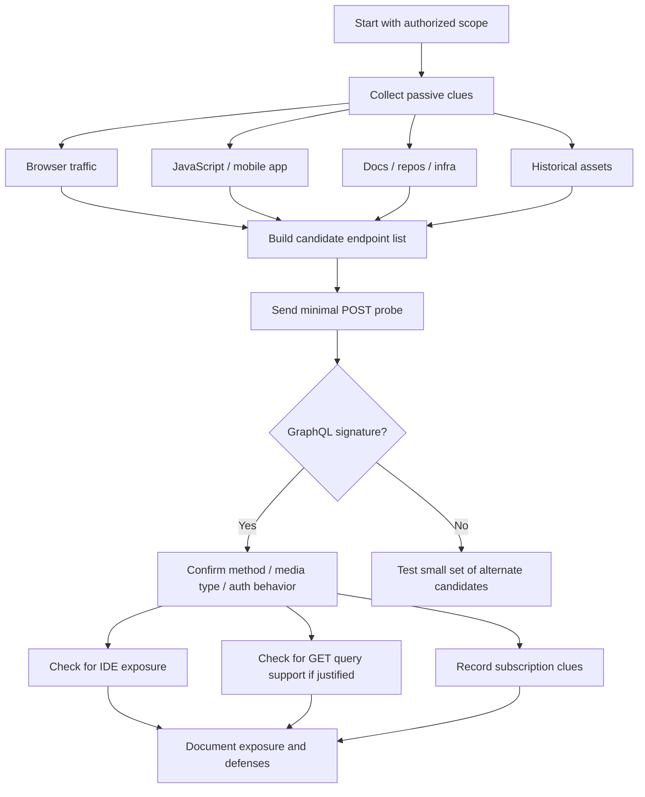

# GraphQL Endpoint Discovery

> **Difficulty:** Beginner → Advanced | **Category:** API Pentesting

**GraphQL endpoint discovery** is the process of finding where a GraphQL service is exposed, confirming that it is actually GraphQL, and mapping the surrounding developer tooling, authentication requirements, and transport behavior. Unlike REST, where functionality is spread across many routes, GraphQL often concentrates a large amount of capability behind one URL such as `/graphql`. That makes discovery strategically important during an **authorized** API assessment and equally important for defenders who want to inventory and reduce unnecessary exposure.

This note starts with the beginner mental model, then moves into practical discovery signals, safe validation patterns, false-positive handling, and defensive hardening. It uses guidance from the **GraphQL over HTTP draft**, the **GraphQL introspection documentation**, the **OWASP GraphQL Cheat Sheet**, and **PortSwigger Web Security Academy**.

---

## Table of Contents

1. [Why GraphQL Endpoint Discovery Matters](#why-it-matters)
2. [Mental Model — One Door, Many Rooms](#mental-model)
3. [What the HTTP API Spec Tells You Up Front](#http-spec)
4. [Where GraphQL Endpoints Commonly Live](#common-locations)
5. [Passive Discovery Sources](#passive-discovery)
6. [Safe Active Validation](#safe-validation)
7. [Reading GraphQL Response Signatures](#response-signatures)
8. [Developer IDEs and Companion Routes](#developer-ides)
9. [Subscriptions and Non-HTTP Clues](#subscriptions)
10. [Endpoint Discovery Workflow](#workflow)
11. [Characterizing a Confirmed Endpoint](#characterizing)
12. [False Positives and Common Mistakes](#false-positives)
13. [Defensive Hardening Checklist](#hardening)
14. [Tools That Help](#tools)
15. [Key Takeaways](#key-takeaways)
16. [Public References](#references)

---

## Why GraphQL Endpoint Discovery Matters

For a normal web app, finding one additional endpoint might expose one additional feature. For GraphQL, finding **the** endpoint can reveal the application’s main data access layer, its object relationships, and sometimes its developer tooling.

During an authorized assessment, discovering a GraphQL endpoint helps you answer questions like:

- Does the application expose **one unified API gateway** behind `/graphql`?
- Is the endpoint reachable **unauthenticated**, authenticated, or only from certain clients?
- Is **introspection** available in the current environment?
- Are developer IDEs like **GraphiQL**, **Apollo Sandbox**, or **GraphQL Playground** exposed?
- Does the application support **GET**, **POST**, or WebSocket-based subscriptions?
- Do the same backend capabilities appear under **multiple paths**, versions, or subdomains?

From a defender’s perspective, endpoint discovery is inventory management. If you do not know where GraphQL is exposed, you cannot reliably apply authentication, rate limiting, logging, query-cost controls, IDE disablement, or schema visibility rules.

---

## Mental Model — One Door, Many Rooms

The easiest way to remember GraphQL discovery is this:

> **REST discovery is about finding many routes. GraphQL discovery is about finding the dispatcher route and then understanding what sits behind it.**

```mermaid
flowchart TD
    A[Browser / Mobile App / SPA] --> B[/graphql or equivalent]
    C[Partner Integration] --> B
    D[Internal Admin UI] --> B

    B --> E[GraphQL Query Engine]
    E --> F[Queries]
    E --> G[Mutations]
    E --> H[Subscriptions]
    E --> I[Resolvers]
    I --> J[(Database)]
    I --> K[Internal APIs]
    I --> L[Third-party Services]

    M[Discovery Goal] --> N[Find endpoint]
    M --> O[Confirm protocol]
    M --> P[Map auth + tooling]
    M --> Q[Measure exposure]
```

That is why a single confirmed GraphQL endpoint often has outsized importance compared to a single REST route.

---

## What the HTTP API Spec Tells You Up Front

The **GraphQL over HTTP draft** gives useful discovery hints before you send a single request.

### Core spec observations

| Spec-guided behavior | Why it matters during discovery |
|---|---|
| A GraphQL schema is served via **one or more URLs** | The same schema may appear at multiple URLs, especially across versions, gateways, or internal/external edges |
| Servers **MUST accept POST** | A candidate endpoint that never accepts GraphQL-style POST requests is less likely to be a standard GraphQL HTTP endpoint |
| Servers **MAY accept GET** | Some environments allow GET for queries, so a POST-only test can miss a valid endpoint |
| `/graphql` is **recommended** but not required | Common names help, but discovery cannot stop at one path |
| JSON is the required baseline format | `Content-Type: application/json` is the safest confirmation choice |
| Clients should send `Accept: application/graphql-response+json` and often `application/json` for compatibility | A standards-aligned probe is more reliable and easier to interpret |

### Practical takeaway

When validating a suspected endpoint, use a **minimal, standards-aligned request** before drawing conclusions. Many “missed GraphQL endpoints” are really just “tested with the wrong method, headers, or body shape.”

---

## Where GraphQL Endpoints Commonly Live

Many deployments still follow recognizable naming patterns.

### Common path patterns

| Pattern | Typical meaning | Notes |
|---|---|---|
| `/graphql` | Canonical endpoint | Most common pattern |
| `/api/graphql` | GraphQL behind an API prefix | Common in monoliths and API gateways |
| `/v1/graphql` | Versioned endpoint | Useful when multiple API generations coexist |
| `/gql` | Short alias | Less common, but seen in some teams |
| `/query` | Generic query endpoint | Easy to misclassify without validation |
| `/graphql/` | Same endpoint with trailing slash | Reverse proxies sometimes normalize this differently |
| `/graphql/internal` | Environment or role-specific variant | Often visible only behind VPN, partner edge, or admin UI |

### Multi-environment patterns

GraphQL is frequently duplicated across:

- `app.example.com/graphql`
- `api.example.com/graphql`
- `staging-api.example.com/graphql`
- `partner.example.com/api/graphql`
- `admin.example.com/graphql`

A mature discovery mindset treats endpoint discovery as **surface mapping**, not just path guessing.

---

## Passive Discovery Sources

Passive discovery is usually the highest-value starting point because it shows what the application already exposes to legitimate clients.

### 1. Browser developer tools and proxy history

If the target has a web front end, the cleanest clue is often already present in normal application traffic.

Look for requests with:

- `POST /graphql`
- JSON bodies containing `query`, `variables`, or `operationName`
- response JSON objects containing `data` and/or `errors`
- headers or client code mentioning Apollo, Relay, urql, or GraphQL clients

### 2. JavaScript bundles

Single-page applications commonly leak GraphQL paths and client configuration in JS bundles.

Search for strings like:

- `/graphql`
- `graphql`
- `gql`
- `GraphQLClient`
- `ApolloClient`
- `createHttpLink`
- `graphql-ws`
- `graphiql`
- `playground`

```bash
# Search local JavaScript bundles collected during an authorized assessment
rg -n '(/graphql|graphql-ws|ApolloClient|createHttpLink|GraphQLClient|graphiql|playground)' ./downloaded-js/
```

### 3. Mobile applications

Mobile apps frequently contain hard-coded API base URLs, environment toggles, or GraphQL client references. During authorized mobile testing, static analysis often reveals:

- production and staging GraphQL URLs
- subscription endpoints
- feature-flagged alternate backends
- dev-only IDE or sandbox references left in non-production builds

### 4. Public documentation and API portals

OpenAPI does not describe GraphQL schemas, but docs portals and developer onboarding pages often mention GraphQL adjacent routes:

- `/docs`
- `/developers`
- `/api`
- `/api/reference`
- partner onboarding pages
- changelogs describing migration from REST to GraphQL

### 5. Repository and CI/CD artifacts

In an internal review or code-assisted assessment, useful indicators include:

- reverse-proxy rules forwarding `/graphql`
- infrastructure-as-code references to GraphQL gateways
- Apollo or Relay configuration
- frontend environment variables such as `GRAPHQL_URL`
- monitoring dashboards keyed on `operationName`

### 6. Historical and asset inventory sources

For authorized external recon, historical records can help identify old or parallel GraphQL exposures that teams forgot to retire.

Examples include:

- archived documentation pages
- historical DNS names
- old subdomains still resolving
- legacy mobile app builds
- deprecated staging URLs still reachable from the internet

---

## Safe Active Validation

Once you have a candidate URL, move to **low-noise, low-impact validation**. The goal is confirmation, not stress-testing.

> **Authorization note:** Only validate endpoints that are explicitly in scope. Use low request volume, avoid large wordlists unless approved, and prefer observing existing client behavior before probing.

### Phase 1: Start with a tiny candidate set

Rather than blasting thousands of paths, begin with a short, high-confidence list:

```text
/graphql
/api/graphql
/v1/graphql
/graphql/
/gql
/query
```

### Phase 2: Use a minimal POST confirmation request

A standards-aligned confirmation probe is usually the best first test.

```bash
curl -sS https://target.example/graphql \
  -X POST \
  -H 'Content-Type: application/json' \
  -H 'Accept: application/graphql-response+json, application/json;q=0.9' \
  --data '{"query":"query{__typename}"}'
```

Why this works:

- `POST` is required by the GraphQL over HTTP draft
- `application/json` is the safest baseline request type
- `query { __typename }` is a **minimal universal GraphQL query** often used to confirm protocol behavior
- The response is small and low impact compared to large schema requests

### Phase 3: If needed, test GET support for queries

Some GraphQL services accept GET for **query** operations.

```bash
curl -sS 'https://target.example/graphql?query=query%7B__typename%7D' \
  -H 'Accept: application/graphql-response+json, application/json;q=0.9'
```

This is especially useful when:

- the frontend uses persisted or cached GET requests
- CDNs sit in front of the API
- client-side code clearly shows GET-based GraphQL traffic

### Phase 4: Observe error semantics

Even when the exact request shape is wrong, GraphQL endpoints often produce recognizable responses such as:

- `{"errors":[{"message":"Must provide query string."}]}`
- `{"errors":[{"message":"Unexpected token ..."}]}`
- `{"errors":[{"message":"Cannot query field ..."}]}`
- `{"data":{"__typename":"Query"}}`

That is strong evidence that you reached GraphQL, even if your request needs adjustment.

### Phase 5: Stop after confirmation and characterize safely

After you confirm the endpoint, shift into **characterization** rather than aggressive enumeration:

- auth required or not
- method support
- response media type
- developer IDE exposure
- introspection policy
- whether subscriptions appear to exist

Avoid full schema dumping or heavy query testing unless it is explicitly approved and necessary for the engagement.

---

## Reading GraphQL Response Signatures

The fastest way to avoid false positives is to interpret responses systematically.

| Response pattern | Confidence it is GraphQL | Interpretation |
|---|---|---|
| `{"data":{"__typename":"Query"}}` | Very high | Confirmed GraphQL behavior |
| `{"errors":[{"message":"Must provide query string"}]}` | High | Likely GraphQL endpoint reached without a valid query |
| `{"errors":[{"message":"Cannot query field ..."}]}` | Very high | GraphQL parser/validator is responding |
| HTTP `405 Method Not Allowed` on GET mutation attempt | High | Consistent with spec behavior |
| HTML page with GraphiQL / Playground / Sandbox UI | Very high | Developer tooling exposed |
| Generic JSON error from an API gateway | Medium | Could be GraphQL behind a gateway, or just a generic API route |
| HTTP `404` or framework-specific not-found page | Low | Likely wrong path, though routing layers can still obscure the endpoint |

### A useful mental shortcut

Ask yourself:

1. **Did the server understand the request as GraphQL?**
2. **Did it reject my syntax, validation, or authorization?**
3. **Or did I simply hit the wrong route?**

That distinction saves time.

---

## Developer IDEs and Companion Routes

GraphQL exposure often includes more than the raw API endpoint.

### Common companion routes

| Route or clue | What it may indicate |
|---|---|
| `/graphiql` | GraphiQL IDE exposed |
| `/playground` | GraphQL Playground exposed |
| `/sandbox` | Apollo Sandbox or similar landing page |
| `/graphql` returning HTML to browsers | Landing page or IDE rather than pure JSON |
| `/graphql` plus JS bundle references to explorer tooling | Embedded in-app developer experience |

### Why this matters

Developer IDE exposure can tell you:

- the endpoint already exists and is reachable
- the team may be relying on browser-based introspection in that environment
- auth boundaries may differ between browser navigation and raw API requests
- headers, cookies, and CSRF behavior may be implemented inconsistently

From a blue-team perspective, public exposure of IDEs should trigger review of:

- authentication requirements
- whether introspection is enabled in production
- CSP / CORS / CSRF controls
- whether descriptions, examples, and schema docs leak internal details

---

## Subscriptions and Non-HTTP Clues

GraphQL discovery is not always limited to plain HTTP request/response traffic.

### Subscription clues

GraphQL subscriptions often introduce WebSocket indicators such as:

- `/graphql` upgraded to WebSocket
- `/subscriptions`
- `graphql-ws`
- `graphql-transport-ws`
- frontend code that opens a WS connection after loading the main app

### Important nuance

The **GraphQL over HTTP** draft focuses on HTTP requests and responses. Subscriptions are often implemented using WebSockets or related transports outside the core HTTP model. So a service may expose:

- HTTP GraphQL queries at `/graphql`
- WebSocket subscriptions on the same path
- a separate WS path for subscriptions only

When documenting a discovered endpoint, note both the **HTTP route** and any **subscription transport clues** you observe.

---

## Endpoint Discovery Workflow



### Good workflow habits

- Prefer **passive evidence first**
- Use **few, standards-aligned requests**
- Record **headers, status codes, and body shapes**
- Distinguish **transport confirmation** from **schema exploration**
- Treat **401/403** as useful discovery results, not failures

---

## Characterizing a Confirmed Endpoint

After confirmation, collect the details that matter for risk analysis.

### Endpoint characterization table

| Question | Why it matters |
|---|---|
| Does it require authentication? | Determines whether exposure is public, partner-only, or user-context only |
| Which methods are accepted? | POST is expected; GET support changes cache and CSRF considerations |
| Which media types are returned? | Helps distinguish standards-aligned vs legacy behavior |
| Is introspection available here? | Affects schema visibility and developer tooling exposure |
| Is an IDE exposed? | Often increases discoverability and operational risk |
| Are there separate staging, admin, or partner variants? | Surface sprawl often creates inconsistent controls |
| Are subscription transports present? | Expands the attack and monitoring surface |
| Do error messages reveal schema or implementation details? | Useful for both discovery quality and defensive hardening |

### Minimal characterization checklist

- URL and host
- environment (`prod`, `staging`, `partner`, `admin`, etc.)
- auth state required to reach it
- accepted method(s)
- whether GET supports queries
- whether HTML landing pages or IDEs are exposed
- whether the response includes standard GraphQL `data` / `errors`
- whether logs, WAF, or API gateway tagging identify it as GraphQL

---

## False Positives and Common Mistakes

### Mistake 1: Assuming every `/graphql` path is live

Some frameworks register the route only in certain environments, behind feature flags, or behind auth middleware.

### Mistake 2: Using the wrong body shape

A JSON body without the `query` key, the wrong `Content-Type`, or malformed JSON may produce confusing errors even when the endpoint is real.

### Mistake 3: Treating generic gateway errors as proof

An API gateway can return JSON errors that *look* API-like without being GraphQL. You still need a GraphQL-specific response signature.

### Mistake 4: Missing GraphQL because only POST was tested

If client code clearly shows GET-based query traffic, test that too. The HTTP spec allows GET for queries.

### Mistake 5: Jumping straight to full introspection

For safe, defensive validation, start with protocol confirmation. Full introspection is a separate question and should be treated carefully in production.

### Mistake 6: Ignoring HTML responses

If `/graphql` returns HTML in a browser, inspect it. It may be a GraphiQL or Sandbox landing page that confirms the endpoint indirectly.

---

## Defensive Hardening Checklist

Discovery is only half the story. Mature teams should assume GraphQL endpoints are discoverable and design accordingly.

| Control | Defensive value |
|---|---|
| Require authentication where appropriate | Prevents anonymous access to business data and operations |
| Disable or tightly control introspection in production | Reduces unnecessary schema visibility |
| Disable public IDEs in production | Removes a major discoverability and usability boost for attackers |
| Enforce POST and strict content types where possible | Reduces ambiguity and can improve CSRF posture |
| Review GET query support carefully | Useful for caching, but changes security and logging considerations |
| Add query depth, breadth, and cost controls | Recommended by OWASP to reduce abuse potential |
| Rate-limit by IP and user context | Helps contain brute-force and resource abuse |
| Log `operationName`, auth context, and response outcomes | Improves incident detection and inventory |
| Keep environment-specific endpoints consistent | Prevents “staging is looser than prod” drift |
| Inventory subscription transports too | WS paths are easy to forget during hardening |

### Defender mindset

> **Do not rely on obscurity of the endpoint path.** A GraphQL endpoint is usually discoverable through traffic, code, docs, or predictable naming. Security should come from strong controls, not from hoping nobody finds `/graphql`.

---

## Tools That Help

Use tools in a measured, authorized, and low-noise way.

| Tool | Best use during discovery | Notes |
|---|---|---|
| Browser DevTools | Observe legitimate frontend requests | Highest signal, lowest noise |
| Burp Suite | Proxy and replay minimal confirmation requests | Good for header/body comparisons |
| `curl` | Standards-aligned manual validation | Best for low-impact confirmation |
| `rg` / `grep` | Search JS bundles, configs, and app code | Excellent for passive discovery |
| `jq` | Read JSON responses cleanly | Helps compare `data` vs `errors` |
| InQL / GraphQL-aware Burp tooling | Organize confirmed GraphQL traffic | Use only after confirmation and within scope |
| Asset inventory / repo search | Find hidden environments and alternate hosts | Very high value for internal reviews |

A mature workflow uses **passive evidence first**, **manual confirmation second**, and **heavier tooling only after the endpoint is clearly confirmed and in scope**.

---

## Key Takeaways

- GraphQL endpoint discovery is about finding the **dispatcher endpoint**, not many resource routes.
- The **GraphQL over HTTP draft** gives reliable discovery hints: **POST is required**, **GET may exist**, JSON is the baseline, and `/graphql` is common but not mandatory.
- The highest-value clues usually come from **normal client traffic, JavaScript bundles, mobile apps, docs, and infrastructure configs**.
- A tiny `query { __typename }` probe is often enough to confirm GraphQL behavior without sending large or risky requests.
- Discovery should continue into **characterization**: auth, methods, IDE exposure, introspection policy, and subscription transports.
- Defenders should assume endpoints are discoverable and focus on **hardening, inventory, and visibility** rather than obscurity.

---

## Public References

- **GraphQL over HTTP Draft** — transport behaviors, methods, media types, and URL guidance: `https://graphql.github.io/graphql-over-http/draft/`
- **GraphQL.org: Introspection** — what introspection is, how it helps tooling, and why production environments often restrict it: `https://graphql.org/learn/introspection/`
- **OWASP GraphQL Cheat Sheet** — hardening guidance for introspection, IDE exposure, validation, DoS controls, and rate limiting: `https://cheatsheetseries.owasp.org/cheatsheets/GraphQL_Cheat_Sheet.html`
- **PortSwigger Web Security Academy: GraphQL** — practical endpoint-discovery observations and response signatures: `https://portswigger.net/web-security/graphql`

