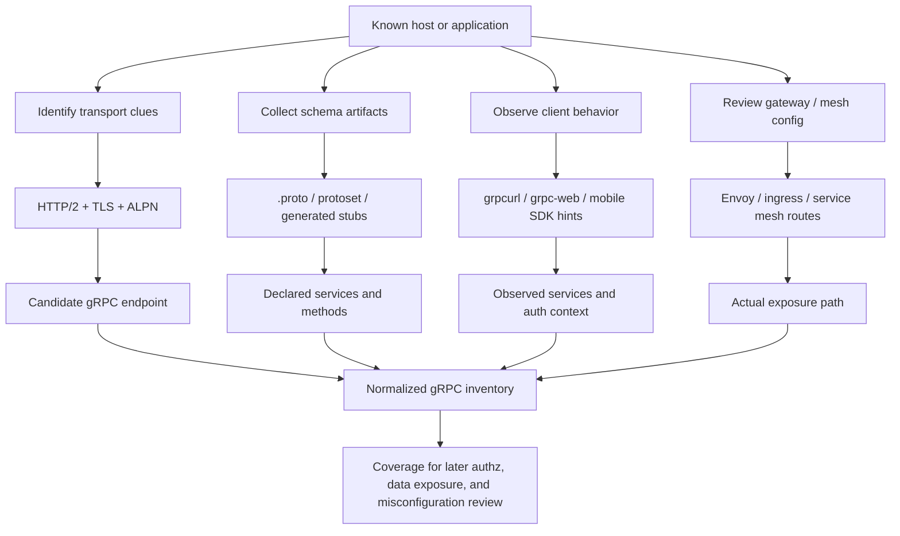
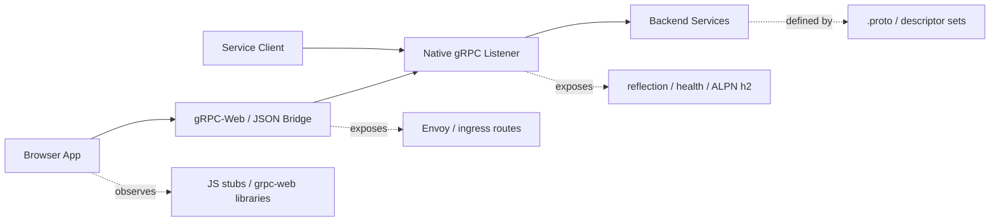
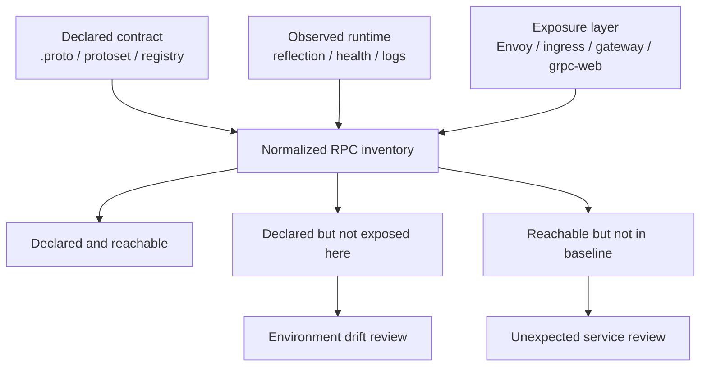

# gRPC Service Discovery

> **Module:** API Pentesting → Recon  
> **Difficulty:** Intermediate → Advanced  
> **Tags:** `#grpc` `#protobuf` `#reflection` `#grpcurl` `#http2` `#grpc-web` `#api-recon`

gRPC service discovery is the process of identifying **where gRPC is exposed, which services and methods exist, how the schema is defined, and what trust boundary surrounds the connection**. In authorized API testing, the goal is not noisy probing. The goal is to build a clean inventory of:

- transport endpoints (`host:port`, TLS, ALPN, proxy path)
- service and method names
- message schemas from `.proto` or descriptor artifacts
- auxiliary discovery surfaces such as **server reflection** and **health checking**
- gateway translations such as **gRPC-Web** or JSON transcoding
- authentication and identity context such as JWT, mTLS, or internal service identity

For defenders and authorized testers, gRPC discovery closes a common visibility gap: teams may document REST well while leaving internal RPC surfaces, reflection endpoints, and gateway bridges under-inventoried.

> **Authorized use only:** Even “lightweight” gRPC discovery sends real HTTP/2 traffic and can trigger authentication, telemetry, rate limits, or alerts. Keep discovery inside scope, prefer read-only methods, and start from approved specs and local artifacts before interacting with live services.

---

## Table of Contents

1. [Why gRPC Discovery Matters](#why-grpc-discovery-matters)
2. [Mental Model — What Counts as a gRPC "Service"](#mental-model--what-counts-as-a-grpc-service)
3. [Native gRPC vs gRPC-Web vs REST Gateways](#native-grpc-vs-grpc-web-vs-rest-gateways)
4. [High-Signal Discovery Sources](#high-signal-discovery-sources)
5. [Use the API Spec as Your Baseline](#use-the-api-spec-as-your-baseline)
6. [Transport and Edge Clues](#transport-and-edge-clues)
7. [Reflection, Health, and Descriptor Services](#reflection-health-and-descriptor-services)
8. [Low-Impact Discovery Workflow](#low-impact-discovery-workflow)
9. [Inventory Fields Worth Capturing](#inventory-fields-worth-capturing)
10. [Common False Positives and Blind Spots](#common-false-positives-and-blind-spots)
11. [Defensive Logging and Hardening Priorities](#defensive-logging-and-hardening-priorities)
12. [Authorized Discovery Checklist](#authorized-discovery-checklist)
13. [References and Public Research](#references-and-public-research)

---

## Why gRPC Discovery Matters

gRPC changes the shape of API recon.

With REST, the unit of discovery is often a **URL and method**. With gRPC, the more useful unit is:

```text
(transport endpoint) + (service name) + (RPC method) + (message schema) + (auth context)
```

That matters because the most important security questions are often **not obvious from the socket alone**:

- Does the server expose **reflection** publicly?
- Is the browser really speaking native gRPC, or **gRPC-Web via Envoy**?
- Are there internal-only services mounted behind the same gateway?
- Does the `.proto` contract describe more methods than the environment should expose?
- Is the same backend reachable through both gRPC and HTTP/JSON translation layers?
- Are health and reflection services leaking inventory that operators forgot to scope?

OWASP API9:2023 frames this as an **inventory problem**. If an organization cannot quickly answer which gRPC hosts, versions, methods, and gateway translations are live, the attack surface is already drifting away from intended design.



---

## Mental Model — What Counts as a gRPC "Service"

A gRPC target is not just `api.example.com:443`.

Treat it as a **6-layer object**:

| Layer | Questions to answer | Example |
|---|---|---|
| **Transport** | Which host, port, and protocol are in use? | `orders.internal.example:8443` over HTTP/2 |
| **Exposure path** | Native gRPC, gRPC-Web bridge, sidecar proxy, ingress route? | Envoy proxy forwarding to native gRPC backend |
| **Schema** | Where is the contract defined? | `orders.proto`, `descriptor_set.pb`, Buf registry |
| **RPC surface** | Which services and methods are live? | `acme.orders.v1.OrderService/GetOrder` |
| **Message model** | What request / response types and streaming modes exist? | unary `GetOrder`, server-streaming `WatchOrders` |
| **Security context** | What identity and policy gates apply? | JWT at edge, mTLS between services |

### The core mental shift

With REST, you usually ask:

> “Which route exists?”

With gRPC, the better question is:

> “Which remote procedures are reachable through this transport, and which schema tells me what they mean?”

That is why gRPC discovery depends so heavily on **schema artifacts**.

The gRPC core concepts documentation explains that gRPC is built around defining a service and specifying remotely callable methods with parameters and return types, typically using **Protocol Buffers**. In practice, that means:

- the endpoint tells you **where** to talk,
- the `.proto` or descriptor tells you **what** you can say,
- reflection or generated clients may tell you **what is actually exported right now**.

### If you remember one sentence

> **In gRPC, the schema is the map; the socket is just the road.**

---

## Native gRPC vs gRPC-Web vs REST Gateways

A lot of “gRPC discovery” confusion comes from mixing three related but different surfaces.

| Surface | Typical client | Transport reality | Discovery implication |
|---|---|---|---|
| **Native gRPC** | backend service, CLI tool, mobile app | HTTP/2 + protobuf frames | Look for reflection, `.proto`, descriptor sets, HTTP/2 clues |
| **gRPC-Web** | browser JavaScript client | Browser-friendly gRPC-Web protocol through a proxy | Look for Envoy / bridge config, JS stubs, `grpc-web` libraries |
| **REST / JSON gateway** | browsers, third-party API clients | HTTP/JSON translated into gRPC backend calls | OpenAPI may reveal the HTTP layer but not the full RPC layer |

### Why this matters

The gRPC-Web project documents that browser clients typically connect to gRPC services through a **special proxy**, and Envoy documents a dedicated **gRPC-Web HTTP filter** for that bridging. So when a frontend says it “uses gRPC,” you often need to discover **two surfaces**:

1. the **browser-facing gRPC-Web or JSON endpoint**, and
2. the **backend native gRPC service** behind the proxy.



### A frequent blind spot

Teams may inventory only the public HTTP gateway and miss that:

- an internal native gRPC port is also reachable,
- reflection is enabled on the backend but not documented,
- the translated REST surface is narrower than the actual RPC surface,
- browser clients cannot speak native gRPC directly, so the presence of gRPC in frontend code often implies a bridge somewhere.

---

## High-Signal Discovery Sources

The best gRPC discovery work starts from **high-confidence artifacts** instead of random network poking.

| Source | What it reveals | Confidence | Noise / risk | Why it matters |
|---|---|---|---|---|
| **`.proto` files** | Declared services, RPC names, messages, packages | Very high | Very low | Cleanest baseline for intended design |
| **Descriptor sets / protosets** | Compiled schema inventory | Very high | Very low | Useful when source `.proto` files are not shipped |
| **Server reflection** | Runtime-exposed service and type info | High | Low if scoped | Often the fastest live inventory source |
| **Health service** | Service names or liveliness hints | Medium–High | Low | Confirms real gRPC behavior and service naming |
| **Generated clients / stubs** | Package names, service names, call patterns | High | Very low | Great for mobile, desktop, or browser artifacts |
| **Ingress / Envoy / mesh config** | Real exposure path, routing, bridges | High | Very low | Shows what is reachable in this environment |
| **OpenAPI / gateway docs** | HTTP translation surface | Medium | Very low | May reveal only part of the underlying RPC surface |
| **Burp / browser / proxy history** | gRPC-Web traffic, auth headers, hostnames | High for web apps | Low | Useful for browser-exposed services |
| **Telemetry / traces / logs** | Service and method names actually invoked | Very high | Very low | Best source of truth for production usage |

### Strong keywords to search for locally

If you have source, config, or captured artifacts, search for clues like:

```bash
rg -n 'syntax = "proto3"|^service | rpc |grpcurl|grpc-web|application/grpc|x-grpc-web|proto descriptor|ServerReflection|grpc.health.v1|protoc-gen-grpc-web|buf.yaml|buf.gen.yaml|envoy' .
```

These searches often reveal:

- package namespaces and versioning
- unary vs streaming methods
- public vs internal service groupings
- bridge layers such as Envoy or grpc-gateway
- health and reflection services that were registered automatically

---

## Use the API Spec as Your Baseline

For gRPC, the “API spec” is usually **not OpenAPI first**. It is usually one or more of these:

- `.proto` source files
- compiled descriptor sets (`.protoset`, `.pb`, descriptor bundle)
- generated stubs checked into SDK repos
- Buf modules / schema registries
- grpc-gateway or transcoding definitions generated from `.proto`

That baseline matters because gRPC discovery is often a **set-difference exercise**.



### What the baseline should tell you

| Artifact | What to extract first | Why it matters |
|---|---|---|
| `.proto` | package, service, RPC names, streaming type | Core inventory and language of the API |
| descriptor set | same as above, even without source | Good for internal-only schemas |
| generated stubs | endpoint hints, method calls, auth bootstrap | Reveals how real clients use the service |
| gateway config | public paths and backend cluster mapping | Shows translation and hidden backend reachability |
| OpenAPI derived from gRPC | HTTP-facing routes | Helpful, but incomplete for native RPC review |

### Safe local extraction examples

These examples assume you are reviewing **approved local artifacts**, not blindly probing production.

```bash
# List services and RPC declarations from local proto files
rg -n '^(package|service|rpc)\b' ./protos
```

```bash
# Build a descriptor set from local proto sources for offline analysis
protoc \
  --proto_path=./protos \
  --descriptor_set_out=api.protoset \
  --include_imports \
  ./protos/**/*.proto
```

```bash
# If you have grpcurl and a protoset, inspect definitions without touching a server
grpcurl -protoset api.protoset list
grpcurl -protoset api.protoset describe acme.orders.v1.OrderService
```

### The key comparison question

> **Does this environment expose exactly the services, methods, and bridges that the approved schema and routing configuration say it should?**

If the answer is no, you may be looking at shadow services, stale deployments, or translation layers that bypass the inventory most teams rely on.

---

## Transport and Edge Clues

Even before reflection or schema work, transport details tell you a lot.

### Common network and protocol indicators

| Clue | What it suggests | Notes |
|---|---|---|
| **ALPN negotiates `h2`** | HTTP/2 is available | Necessary for native gRPC over TLS |
| **`application/grpc` content type** | Native gRPC semantics | Strong indicator in reverse proxy logs or configs |
| **`x-grpc-web` / `grpc-web` JS stubs** | Browser bridge is in play | Suggests proxy-based translation |
| **Envoy / ingress routes for gRPC** | Native or bridged exposure exists | Often best evidence of actual deployment |
| **Different internal and external ports** | Split exposure model | Public gateway may hide richer internal RPC surface |
| **Service mesh identity config** | mTLS / SPIFFE style auth boundary | Important for understanding “internal-only” trust assumptions |

### Low-impact confirmation examples

These commands are for **transport confirmation**, not method abuse.

```bash
# Check TLS + ALPN support for HTTP/2
openssl s_client -alpn h2 -connect api.example.com:443 </dev/null
```

```bash
# Inspect approved proxy or ingress configs locally for gRPC clues
rg -n 'grpc|http2_protocol_options|grpc_web|application/grpc|grpc_json_transcoder' ./config ./infra ./envoy
```

```bash
# Review browser bundle or SDK artifacts for grpc-web usage
rg -n 'grpc-web|x-grpc-web|protoc-gen-grpc-web|@improbable-eng/grpc-web|connect-web' ./frontend ./mobile
```

### Why edge clues are so valuable

A reverse proxy, ingress, or service mesh often knows more about exposure than the app team does. It may reveal:

- which virtual hosts forward to gRPC backends
- whether reflection is routed at all
- whether gRPC-Web is enabled for browsers
- whether JSON transcoding creates an alternate surface
- whether external and internal users hit different clusters

---

## Reflection, Health, and Descriptor Services

These are the discovery surfaces most people mean when they say “gRPC enumeration,” but they are only part of the story.

### 1. Server reflection

The gRPC reflection guide describes reflection as a standard RPC service through which a server can declare the protobuf-defined APIs it exports, including referenced types. The reflection design document adds an important nuance: a server is **not obligated** to return a complete list of all methods it supports, and reverse proxies may only reflect methods implemented directly on the proxy.

That means reflection is powerful, but it is not perfect.

| Reflection question | Why it matters |
|---|---|
| Is reflection enabled at all? | Fastest runtime inventory source |
| Which services are listed? | Method namespace and service count |
| Does the result match the approved schema? | Drift / shadow service detection |
| Is reflection routed through the gateway? | Common operational blind spot |
| Is reflection exposed publicly when it should be internal-only? | Inventory disclosure risk |

**Low-impact example:**

```bash
# List services via reflection on an authorized target
grpcurl api.example.com:443 list

# Describe one service to inspect methods and message types
grpcurl api.example.com:443 describe acme.orders.v1.OrderService
```

For plaintext lab or development listeners only:

```bash
grpcurl -plaintext 127.0.0.1:50051 list
```

> **Important:** Prefer `list` and `describe` during discovery. Save method invocation for later, scoped validation work.

### 2. Health service

The standard health proto defines `grpc.health.v1.Health` with methods such as `Check`, `List`, and `Watch`.

From a recon perspective, health is useful because it can reveal:

- that the endpoint is truly a gRPC service,
- which service names are recognized,
- whether service naming matches the schema and deployment inventory.

| Method | Recon value | Caution |
|---|---|---|
| `Check` | Confirms liveliness for a specific service or whole server | Still sends a real RPC |
| `List` | Can expose available services and statuses | May be restricted or rate-limited |
| `Watch` | Shows streaming support and health changes | Not ideal for first-pass discovery |

**Low-impact example:**

```bash
# Read-only health check against an approved service name
grpcurl -d '{"service":"acme.orders.v1.OrderService"}' \
  api.example.com:443 grpc.health.v1.Health/Check
```

### 3. Descriptor artifacts instead of reflection

Per the `grpcurl` documentation, if reflection is unavailable, you can still browse a gRPC schema using **proto source files** or compiled **protoset** files.

This is a crucial defensive takeaway:

- disabling reflection does **not** remove the need for inventory,
- it just means operators need another trustworthy schema source,
- testers should compare local descriptor artifacts against the live routing layer.

### The right mindset

> Reflection tells you what the server is willing to say. Descriptor artifacts tell you what the system was built to say. Good discovery compares both.

---

## Low-Impact Discovery Workflow

Use an inventory-first workflow that starts locally and adds live confirmation only when needed.

### Phase 1 — Review local and approved artifacts

Start with:

- `.proto` repositories
- descriptor bundles
- generated client stubs
- mobile app packages
- ingress / Envoy config
- service mesh or platform manifests
- OpenAPI generated from grpc-gateway, if present

Goal: build a **declared** service inventory.

### Phase 2 — Identify exposure path

Ask:

1. Is this native gRPC, gRPC-Web, or HTTP/JSON transcoding?
2. Which hostnames and ports expose each form?
3. Is the external surface narrower than the internal one?
4. Does the proxy explicitly route reflection and health services?

### Phase 3 — Confirm transport behavior

Use low-impact checks to confirm:

- HTTP/2 support
- ALPN negotiation
- TLS posture
- whether browser clients rely on a bridge layer

### Phase 4 — Use reflection or descriptors

If reflection is authorized and available:

```bash
grpcurl api.example.com:443 list
grpcurl api.example.com:443 describe acme.orders.v1.OrderService
```

If reflection is unavailable but you have approved local artifacts:

```bash
grpcurl -protoset api.protoset list
grpcurl -protoset api.protoset describe acme.orders.v1.OrderService/GetOrder
```

### Phase 5 — Record auth context, not just names

For every discovered service, capture:

- anonymous vs authenticated access
- browser cookie vs bearer token vs mTLS
- whether service identity is assumed because traffic is “internal”
- whether different gateways expose different policy layers

### Phase 6 — Compare declared vs reachable

This is where the best findings come from.

| Comparison | Possible meaning |
|---|---|
| **Declared and reachable** | Expected exposure |
| **Declared but unreachable here** | Environment scoping or deployment drift |
| **Reachable but absent from approved schema** | Shadow service, stale deployment, or undocumented backend |
| **Gateway exposes HTTP path but backend has richer RPC surface** | Translation layer hides additional attack surface |
| **Reflection exposed publicly but intended internal-only** | Inventory disclosure / misconfiguration |

---

## Inventory Fields Worth Capturing

A bare list of `service/method` names is not enough.

| Field | Example | Why it matters |
|---|---|---|
| Host / port | `api.example.com:443` | Transport endpoint |
| Exposure type | native gRPC / gRPC-Web / JSON bridge | Tells you how clients actually reach it |
| TLS / ALPN | TLS, `h2` negotiated | Confirms native gRPC posture |
| Package | `acme.orders.v1` | Namespace and version signal |
| Service | `OrderService` | Inventory unit |
| Method | `GetOrder` | Test planning unit |
| RPC type | unary / server-stream / client-stream / bidi | Changes observability and risk |
| Schema source | reflection / `.proto` / protoset / SDK | Confidence and provenance |
| Auth context | JWT / cookie / mTLS / internal identity | Trust boundary |
| Gateway path | `/grpc`, `/:authority`, Envoy route name | Exposure location |
| Supporting services | reflection, health, channelz if present | Auxiliary surfaces |
| Environment | prod / stage / partner / internal | Scope and risk |
| Owner | Platform / Orders / Billing | Remediation path |
| Notes | “Reflection routed externally” | Reporting context |

### Practical inventory example

```text
Host: api.example.com:443
Exposure: gRPC-Web at edge, native gRPC behind Envoy
Package: acme.orders.v1
Service: OrderService
Methods: GetOrder (unary), WatchOrders (server-stream)
Schema source: reflection + approved protoset
Auth: JWT at edge, mTLS service-to-service internally
Aux services: grpc.health.v1.Health exposed, reflection exposed
Notes: public bridge narrower than backend native listener
```

---

## Common False Positives and Blind Spots

Not every HTTP/2 service is gRPC, and not every “gRPC” frontend is native gRPC.

| Situation | Why people get fooled | Better interpretation |
|---|---|---|
| HTTP/2 enabled | HTTP/2 alone does not mean gRPC | Look for `application/grpc`, reflection, schema artifacts, or routing config |
| Browser app mentions gRPC | Browsers usually use gRPC-Web or another bridge | Find the proxy or generated web stubs |
| Reflection is disabled | Teams assume discovery is impossible | Use `.proto`, protosets, stubs, logs, and config artifacts |
| Reflection lists few services | Proxy may not expose everything | Compare with schema and ingress config |
| OpenAPI exists | Teams think the whole API is documented | It may only describe the HTTP translation layer |
| One port is tested | Internal listener may expose more than edge gateway | Review service mesh, sidecars, and internal DNS names |
| Health works | Teams assume authz is consistent | Health is not proof that application RPCs are equally protected |

### A particularly important blind spot: translation layers

A system may expose:

- public REST through grpc-gateway,
- browser gRPC-Web through Envoy,
- internal native gRPC directly,
- and different auth controls at each layer.

If you inventory only one of those, you do not have the full API surface.

---

## Defensive Logging and Hardening Priorities

Discovery notes are most useful when they translate into operational guidance.

### Logging priorities

| Priority | What to log or monitor | Why it matters |
|---|---|---|
| High | service and method names | Core RPC inventory and anomaly detection |
| High | caller identity / principal | Critical for method-level auth reviews |
| High | gateway path and backend cluster | Correlates public and internal exposure |
| High | reflection and health usage | Often low-volume but high-signal discovery events |
| Medium | RPC type and message size | Helpful for streaming and resource controls |
| Medium | negotiated protocol / ALPN | Confirms native gRPC vs translated traffic |
| Medium | auth mechanism used | JWT, mTLS, cookie, service account context |

### Hardening priorities

| Control | Why it helps |
|---|---|
| Restrict or segment reflection exposure | Prevents unnecessary public schema disclosure |
| Treat `.proto` / descriptor artifacts as inventory assets | Gives defenders a trustworthy baseline |
| Log and review health, reflection, and gateway bridge access | These are discovery-rich surfaces |
| Ensure gateway and backend inventories match | Reduces shadow and stale exposure |
| Document gRPC-Web and transcoding explicitly | Prevents blind spots in browser and partner surfaces |
| Apply method-level authorization consistently | gRPC method names are business actions, not just routes |
| Set sensible timeouts, size limits, and streaming controls | Important for abuse resistance and observability |
| Avoid assuming “internal traffic = trusted” | Microservice trust boundaries fail often in practice |

### One defensive rule to remember

> **If defenders cannot name every public, partner, and internal gRPC exposure path, neither can they secure it.**

---

## Authorized Discovery Checklist

Use this as a practical first-pass checklist.

- [ ] Collect approved `.proto`, descriptor, SDK, and gateway artifacts
- [ ] Build a declared inventory of packages, services, methods, and streaming modes
- [ ] Identify whether the environment uses native gRPC, gRPC-Web, JSON transcoding, or all three
- [ ] Confirm host, port, TLS, and ALPN behavior for each approved endpoint
- [ ] Determine whether reflection is enabled and whether that is appropriate for the environment
- [ ] Check whether the standard health service is exposed and how it is scoped
- [ ] Record auth model per exposure path: JWT, cookie, mTLS, service identity, or mixed
- [ ] Compare reflection results with local schema artifacts
- [ ] Compare external gateway exposure with internal listener exposure
- [ ] Record any service that is reachable but absent from the approved baseline
- [ ] Record any declared service that should not be reachable in this environment
- [ ] Hand a normalized inventory to later authorization, data exposure, and misconfiguration review

---

## References and Public Research

- [gRPC: Core concepts, architecture and lifecycle](https://grpc.io/docs/what-is-grpc/core-concepts/)
- [gRPC: Reflection guide](https://grpc.io/docs/guides/reflection/)
- [gRPC server reflection design document](https://github.com/grpc/grpc/blob/master/doc/server-reflection.md)
- [gRPC reflection protocol (`reflection.proto`)](https://github.com/grpc/grpc-proto/blob/master/grpc/reflection/v1/reflection.proto)
- [gRPC health checking protocol (`health.proto`)](https://github.com/grpc/grpc-proto/blob/master/grpc/health/v1/health.proto)
- [grpcurl README](https://github.com/fullstorydev/grpcurl)
- [gRPC-Web README](https://github.com/grpc/grpc-web)
- [Envoy gRPC-Web filter documentation](https://www.envoyproxy.io/docs/envoy/latest/configuration/http/http_filters/grpc_web_filter)
- [OWASP API Security Top 10 (2023)](https://owasp.org/API-Security/editions/2023/en/0x11-t10/)
