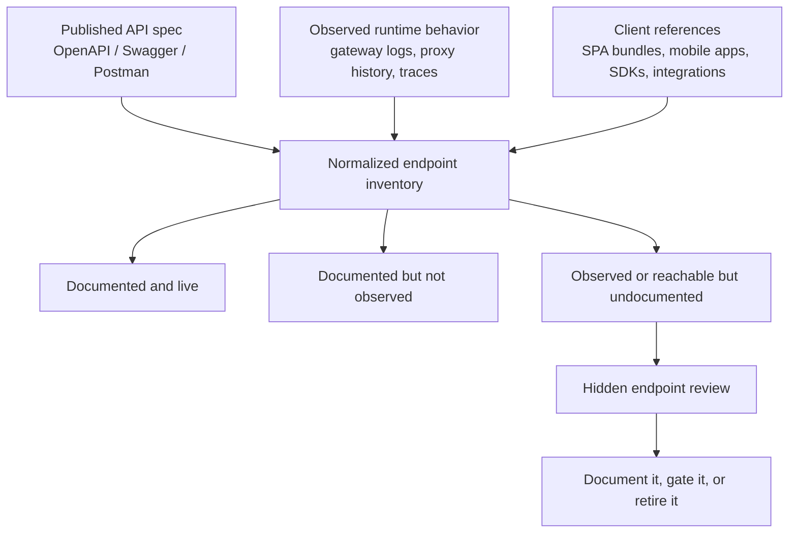
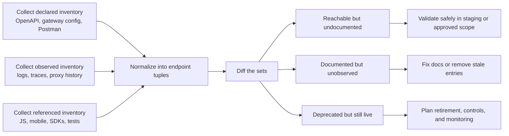

# Hidden Endpoints

> **Difficulty:** Intermediate → Advanced | **Category:** API Pentesting

**Hidden endpoints** are API operations that are reachable in runtime but missing from the normal inventory people rely on: public docs, the main frontend flow, or the current version's published contract. In practice, they are rarely “mystery URLs.” They are usually **inventory failures**: deprecated versions still deployed, alternate hosts, undocumented methods on a documented path, internal routes exposed through the same gateway, or feature-flagged operations that leaked into production.

The most useful mindset is to treat hidden-endpoint work as **defensive asset discovery**. OWASP API Security Top 10 calls out this problem as **Improper Inventory Management**: organizations lose track of API hosts, versions, environments, and data flows, and old or undocumented routes stay reachable longer than anyone intended.

> **Authorized use only:** Everything below is for environments you own or are explicitly permitted to assess. Favor internal inventories, staging validation, and low-impact confirmation over blind scanning.

---

## Table of Contents

1. [The Core Mental Model](#1-the-core-mental-model)
2. [Why Hidden Endpoints Exist](#2-why-hidden-endpoints-exist)
3. [Use the API Spec as Your Baseline](#3-use-the-api-spec-as-your-baseline)
4. [What Counts as an “Endpoint”](#4-what-counts-as-an-endpoint)
5. [High-Signal Sources of Evidence](#5-high-signal-sources-of-evidence)
6. [A Safe Discovery Workflow](#6-a-safe-discovery-workflow)
7. [Response Triage Without Over-Probing](#7-response-triage-without-over-probing)
8. [Common Hidden-Endpoint Patterns](#8-common-hidden-endpoint-patterns)
9. [Defensive Inventory and Remediation](#9-defensive-inventory-and-remediation)
10. [Quick Checklist](#10-quick-checklist)
11. [References](#11-references)

---

## 1. The Core Mental Model

The easiest way to understand hidden endpoints is as a **set difference problem**.



### The important set relationships

| Set relationship | Meaning | Why it matters |
|---|---|---|
| `Documented ∩ Live` | Expected surface | Normal inventory, normal testing |
| `Live - Documented` | **Hidden endpoints** | Highest-priority review set |
| `Documented - Live` | Stale docs, dead paths, retired routes | Causes confusion and weak incident response |
| `Referenced by clients - Documented` | Feature-flagged or internal-only behavior | Often reveals partner/admin/internal operations |

### Hidden does **not** always mean unknown URL

A route can be “hidden” even when the path itself is obvious. The hidden part may be the **method**, **host**, **version**, **content type**, or **header-gated behavior**.

Think in tuples, not strings:

```text
(host, base path, version, method, route, content-type, auth context, routing headers)
```

Examples:

- `GET /api/users/{id}` is documented, but `DELETE /api/users/{id}` is still enabled and undocumented.
- `api.example.com/v2/reports` is public, but `beta-api.example.com/v2/reports` is reachable with weaker controls.
- `/orders/export` exists only when a gateway sees `X-Internal-Client: true`.
- `/admin/reindex` is not in the public spec, but it still appears in an internal client SDK.

That is why hidden-endpoint work is really **surface-difference analysis**.

---

## 2. Why Hidden Endpoints Exist

OWASP's guidance on API inventory management maps almost perfectly to hidden-endpoint findings. The usual root causes are operational, not magical.

| Root cause | Typical symptom | Security consequence |
|---|---|---|
| Version drift | `v1`, `beta`, or partner routes remain deployed | Old auth models and weaker controls survive |
| Documentation blind spots | Public docs omit internal or legacy operations | Teams do not test or monitor the full surface |
| Environment sprawl | Staging, test, preview, or region-specific hosts stay reachable | Non-production exposure with production-like data |
| Gateway / backend mismatch | Gateway docs differ from what upstream services still expose | Shadow routes bypass expected policy layers |
| Feature flags and dark launches | Client code references endpoints not visible in UI | Hidden business logic and admin features |
| Method drift | Path is documented, but extra verbs still work | Unreviewed destructive operations |
| Integration leftovers | Webhooks, callback URLs, partner endpoints not retired | Data flow blind spots and unauthorized sharing |

### A simple mental rule

If an organization cannot answer all of the following quickly, hidden endpoints usually exist:

1. Which API hosts are live?
2. Which versions are deployed on each host?
3. Which routes and methods are supposed to exist there?
4. Who is allowed to call them?
5. Which routes are deprecated but still reachable?

---

## 3. Use the API Spec as Your Baseline

The OpenAPI Specification exists specifically to let humans and tools understand an API **without needing source code or network traffic inspection**. That makes it the best starting point for hidden-endpoint work.

OpenAPI also gives you more than just paths. A good spec reveals:

| OpenAPI element | Why it matters for hidden endpoints |
|---|---|
| `servers` | Alternate hosts, base paths, regions, and environment hints |
| `paths` | Canonical route inventory |
| HTTP operations (`get`, `post`, etc.) | Method-level surface, not just URL-level surface |
| `deprecated: true` | High-risk leftovers that often survive in runtime |
| `security` / `securitySchemes` | Which routes should require auth and how |
| `tags` | Internal/admin/partner grouping clues |
| `callbacks` / `webhooks` | Secondary surfaces that crawlers often miss |
| `components` schemas | Parameter names and object models that hint at adjacent operations |

### What the spec is good for

The API spec is your **declared contract**. Use it to build the expected inventory first, then compare reality against it.

### What the spec is **not** good for

It is not proof that the runtime matches the contract. Specs are often:

- stale
- filtered for public consumers only
- missing alternate hosts and older versions
- generated from code that excludes internal routers
- correct for one environment but wrong for another

The right question is not “Do we have a spec?”

The right question is:

> **What is reachable that the spec does not account for, and what does the spec describe that the platform no longer reflects?**

### Useful local extraction examples

These examples assume you are working with a local `openapi.json` from an authorized engagement or an internal codebase review.

```bash
# Extract METHOD + PATH pairs from an OpenAPI document
jq -r '
  .paths | to_entries[] as $p
  | $p.value
  | keys[]
  | select(test("^(get|put|post|delete|patch|options|head|trace)$"))
  | "\(ascii_upcase) \($p.key)"
' openapi.json | sort -u > documented-operations.txt

# Extract declared server URLs / base URLs
jq -r '.servers[]?.url' openapi.json | sort -u > documented-servers.txt

# Pull out deprecated operations for priority review
jq -r '
  .paths | to_entries[] as $p
  | $p.value
  | to_entries[]
  | select(.key | test("^(get|put|post|delete|patch|options|head|trace)$"))
  | select(.value.deprecated == true)
  | "\(.key | ascii_upcase) \($p.key)"
' openapi.json | sort -u
```

### A better inventory record than “path list”

When you normalize the spec, keep richer fields than just the route:

| Field | Example |
|---|---|
| Host / server | `https://api.example.com` |
| Environment | `prod`, `staging`, `partner`, `beta` |
| Version | `v1`, `2024-10`, `internal` |
| Method | `GET`, `POST`, `DELETE` |
| Path | `/reports/export/{id}` |
| Auth expectation | OAuth2, API key, mTLS, session |
| Status | current, deprecated, sunset planned |
| Source | OpenAPI, logs, gateway config, SDK |
| Owner | Team or service |
| Data sensitivity | public, internal, regulated, secrets-adjacent |

That table becomes the foundation for triage later.

---

## 4. What Counts as an “Endpoint”

Security teams often undercount endpoints because they think only in terms of visible URLs. For API work, hidden surface can hide in several dimensions.

| Dimension | Example hidden behavior |
|---|---|
| Host | `beta-api.example.com` exposes more routes than `api.example.com` |
| Base path | `/internal/` or `/partner/` mounted behind same gateway |
| Method | `PUT` or `DELETE` works even though docs mention only `GET` |
| Versioning | `v1` and `v2` share data store but have different protections |
| Content negotiation | Admin behavior only appears for a vendor-specific `Accept` header |
| Routing headers | Internal gateway headers unlock alternate behavior |
| Auth context | Same path behaves differently for service tokens vs browser sessions |
| Async paths | Webhooks and callback receivers are real API surface too |

### Why this matters

If you only compare path strings, you will miss:

- undocumented verbs on known routes
- alternate base paths on the same service
- partner-only or internal hosts
- content-type-specific handlers
- webhook receivers and callback flows

---

## 5. High-Signal Sources of Evidence

The strongest hidden-endpoint findings come from **comparing multiple weak signals**, not from a single noisy probe.

| Evidence source | What it reveals | Common hidden-endpoint clues |
|---|---|---|
| OpenAPI / Swagger docs | Declared contract | Missing versions, deprecated routes, forgotten servers |
| API gateway or ingress config | Runtime routing truth | Shadow prefixes, internal upstreams, alternate hosts |
| Proxy history or access logs | Real traffic | Undocumented methods, 401/403/405 on unseen routes |
| SPA JavaScript bundles | Client-side references | Feature-flagged endpoints, admin tools, private prefixes |
| Mobile apps / SDKs | Non-browser client behavior | Partner and internal paths absent from web UI |
| Postman collections / test fixtures | Operational drift | Legacy routes still used by QA or partners |
| CI/CD or IaC manifests | Deployment intent | Preview environments, blue/green paths, canary hosts |
| Error responses | Handler fingerprints | Structured validation errors instead of generic 404s |

### One especially useful clue: method discovery from `405`

MDN's HTTP documentation notes that **`405 Method Not Allowed`** indicates the resource exists but does not allow the attempted method, and the `Allow` header may disclose which methods are supported.

That makes a `405` response a high-value signal during authorized verification:

- `404` may mean “not here,” or it may be a uniform gateway response.
- `405` usually means “the route is real, but your verb is wrong.”
- `401` / `403` often mean “the route exists, but you are not allowed through.”

### Another useful clue: hidden inputs can change routing

PortSwigger's Burp documentation on hidden inputs highlights that headers, cookies, and parameters not used during normal interaction can still affect how the application behaves. In API programs, this matters because some “hidden endpoints” are actually **hidden endpoint variants** unlocked by:

- internal headers
- version headers
- tenant identifiers
- feature-flag cookies
- alternate media types

So the question is not only “Which path exists?” but also “Under which routing conditions does this operation exist?”

---

## 6. A Safe Discovery Workflow

Use a low-noise, inventory-first workflow.



### Step 1: Build the declared inventory

Start with the best contract sources you have:

- internal OpenAPI definitions
- public API reference
- gateway route exports
- Postman collections
- service catalog / internal inventory records

Do **not** assume the public docs are the whole truth.

### Step 2: Build the observed inventory

Prefer evidence you already have:

- reverse-proxy access logs
- service mesh traces
- API gateway analytics
- proxy history from normal product workflows
- synthetic monitoring route lists

This is much safer and usually much more accurate than brute-force enumeration.

### Step 3: Build the referenced inventory

Mine code and artifacts for paths the runtime contract forgot to document:

- SPA bundles
- mobile apps
- SDKs
- integration tests
- internal admin tooling
- IaC and deployment manifests

A route referenced by code but missing from the official spec deserves review even if it is currently gated.

### Step 4: Diff the sets

A very practical approach is to normalize everything into sorted text files and compare them.

```bash
# Example: compare documented operations with observed operations
sort -u documented-operations.txt > documented.sorted
sort -u observed-operations.txt   > observed.sorted

# Live but undocumented = highest-priority hidden endpoints
comm -13 documented.sorted observed.sorted > live-but-undocumented.txt

# Documented but not observed = stale docs, dead code, or low-usage routes
comm -23 documented.sorted observed.sorted > documented-but-unseen.txt
```

### Step 5: Validate with low-impact requests only

For approved environments, validate **specific candidates** rather than spraying a large wordlist.

Good candidates come from:

- deprecated routes in the spec
- alternate hosts in `servers`
- `405` / `401` / `403` responses in logs
- routes referenced by client code but absent from docs
- callbacks / webhooks omitted from normal API inventories

### Step 6: Triage by business meaning, not just reachability

The most important hidden endpoints are usually the ones that are:

- administrative
- export- or report-related
- cross-tenant
- partner-only but publicly reachable
- internal-only but exposed externally
- legacy versions with weaker auth or validation

---

## 7. Response Triage Without Over-Probing

A common mistake is to treat anything that is not `200 OK` as uninteresting. For hidden endpoints, many of the best signals are “failure” responses that still prove the handler exists.

| Response pattern | What it often means | Why it is useful |
|---|---|---|
| `200` / `204` | Route is reachable and accepted | Direct confirmation |
| `301` / `302` / `307` | Route exists but is relocated or forced through auth / versioning | Can reveal canonical host or path |
| `401 Unauthorized` | Route exists and expects auth | Confirms protected surface |
| `403 Forbidden` | Route exists but caller lacks privileges | Strong sign of real but gated functionality |
| `405 Method Not Allowed` + `Allow` | Path exists, wrong method used | Excellent clue for method-hidden operations |
| `415 Unsupported Media Type` | Handler exists, wrong body type | Suggests stricter parser or alternate content-type |
| `422 Unprocessable Content` / structured validation error | Route exists and attempted to parse input | High-confidence runtime handler |
| Uniform `404` from gateway | Inconclusive | Could still be masking a real upstream route |

### A safe validation mindset

For owned or approved environments:

- prefer **HEAD**, **OPTIONS**, and clearly non-destructive requests first
- validate in **staging** where possible
- rate-limit your checks
- avoid guessing large numbers of routes when you already have better evidence
- record why each candidate was tested

A small, evidence-driven candidate list is usually more valuable than a loud scan.

---

## 8. Common Hidden-Endpoint Patterns

### 8.1 Deprecated versions that never really died

OWASP explicitly calls out old API versions as a recurring problem area. These are high-risk because they often remain connected to the same data store while missing newer controls.

Look for:

- `v1`, `v0`, `beta`, `legacy`, `partner`, `internal`
- version headers in client code
- routes marked `deprecated: true` in the spec but still reachable
- separate hosts for old versions instead of separate paths

### 8.2 Alternate hosts and base paths

Some of the most valuable hidden endpoints live on the “same API, different door” pattern:

| Pattern | Example |
|---|---|
| Beta host | `beta-api.example.com` |
| Partner host | `partners-api.example.com` |
| Region-specific host | `eu-api.example.com` |
| Internal base path | `/internal/`, `/admin-api/`, `/ops/` |
| Preview environment | `pr-184.example.net` or `preview-api.example.com` |

These often bypass the assumptions baked into public documentation.

### 8.3 Undocumented methods on documented paths

This is one of the easiest things to miss.

The path exists in docs, but the operation inventory is incomplete:

- docs show `GET /users/{id}`
- runtime still supports `PATCH /users/{id}`
- a legacy admin client still calls `DELETE /users/{id}`

Method drift matters because authorization is often reviewed path-by-path in human terms while enforcement happens method-by-method in code.

### 8.4 Feature-flagged and dark-launched operations

Modern frontends commonly ship code for features not yet enabled in the visible UI. That creates a pattern where:

1. the route exists in JavaScript, mobile code, or SDKs
2. the public docs omit it
3. the backend accepts it for specific tenants, headers, or roles

This is why client references are such a strong evidence source.

### 8.5 Callback and webhook endpoints

Normal recon tends to focus on client-initiated requests, but OpenAPI can describe **callbacks** and **webhooks** too. These are easy to miss because they are:

- not reachable from the main web UI
- triggered asynchronously
- handled by separate components or workers
- often documented in a different place than the core REST surface

If you are reviewing API inventory defensively, they count.

### 8.6 Hidden variants controlled by headers or media types

Some routes are “hidden” only when a special request shape is present.

Examples of routing or behavior pivots:

- `Accept: application/vnd.company.admin+json`
- `X-API-Version: 2024-10-preview`
- `X-Internal-Client: true`
- service tokens vs user tokens
- tenant-specific hostnames

This is where hidden parameters and headers blend into hidden endpoints.

---

## 9. Defensive Inventory and Remediation

The real goal is not merely to find hidden endpoints. It is to make them difficult to create in the first place.

### Build one inventory that engineering and security both trust

A mature API inventory should answer:

| Question | Example answer |
|---|---|
| Which host exposes this route? | `api.example.com` only |
| Which environment is it in? | prod, staging, preview |
| Which version owns it? | `v2` current, `v1` sunset 2025-06 |
| Which team owns it? | Billing Platform |
| Which auth model applies? | OAuth2 + scopes |
| Is it deprecated? | yes / no |
| Does it handle sensitive data? | yes / no + classification |
| Is it externally reachable? | public, partner, internal-only |

### Controls that reduce hidden-endpoint risk

1. **Spec-as-code in CI/CD**
   - Generate or validate the API contract on every build.
   - Fail changes that add routes without updating the contract.

2. **Gateway allowlisting**
   - Route only what is declared and approved.
   - Deny unknown prefixes and stale versions by default.

3. **Version retirement discipline**
   - Track owners and sunset dates for every version.
   - Remove retired routes from deployment, not just from docs.

4. **Environment separation**
   - Keep staging, preview, and test hosts off the public internet when possible.
   - Never assume “non-production” means “low impact.”

5. **Document data flows and integrations**
   - OWASP stresses inventorying not just hosts and endpoints, but also data shared with third parties.
   - Hidden partner or integration routes often create the biggest surprises during incident response.

6. **Monitor for undocumented traffic**
   - Alert on requests to deprecated versions, internal prefixes, and unknown hosts.
   - Treat repeated requests to undocumented routes as either drift or abuse worth investigating.

### Good remediation outcomes

The best outcome for a hidden endpoint is usually one of four actions:

| Action | When to choose it |
|---|---|
| Document it | Legitimate route, current owner, valid business purpose |
| Gate it better | Legitimate route but wrong exposure or missing policy |
| Move it internal | Operational/admin route should not be public |
| Retire it | Legacy or unused route with no justified reason to exist |

---

## 10. Quick Checklist

### Hidden-endpoint review checklist

- [ ] Confirm written authorization and preferred environments for validation.
- [ ] Export the best available API spec or contract.
- [ ] Extract hosts, methods, paths, deprecated operations, and auth expectations.
- [ ] Build observed inventory from gateway logs, traces, or proxy history.
- [ ] Build referenced inventory from JS bundles, mobile apps, SDKs, tests, and collections.
- [ ] Normalize everything into endpoint tuples, not just path strings.
- [ ] Diff for `live - documented`, `documented - live`, and deprecated-but-live cases.
- [ ] Prioritize admin, export, partner, internal, and legacy routes.
- [ ] Use low-impact confirmation requests only on approved scope.
- [ ] Create remediation actions: document, gate, move internal, or retire.

### The shortest version to remember

> **Hidden endpoints are usually inventory drift.**
>
> Start from the spec, compare it to runtime evidence, and investigate the difference between **declared**, **observed**, and **referenced** API surface.

---

## 11. References

Public sources used to shape this note:

1. **OWASP API Security Top 10 2023 — API9: Improper Inventory Management**  
   https://raw.githubusercontent.com/OWASP/API-Security/master/editions/2023/en/0xa9-improper-inventory-management.md

2. **OpenAPI Specification 3.1 / Swagger Specification**  
   https://swagger.io/specification/  
   https://raw.githubusercontent.com/OAI/OpenAPI-Specification/main/versions/3.1.0.md

3. **MDN — 405 Method Not Allowed**  
   https://developer.mozilla.org/en-US/docs/Web/HTTP/Status/405

4. **PortSwigger Burp Documentation — Hidden inputs / Param Miner**  
   https://portswigger.net/burp/documentation/desktop/testing-workflow/analyzing/hidden-inputs

### What each source contributed

- **OWASP** grounded the inventory-management and old-version risk model.
- **OpenAPI / Swagger** grounded the idea of using the contract as a machine-readable baseline for hosts, paths, operations, and related metadata.
- **MDN** grounded the `405` / `Allow` response interpretation used for low-noise endpoint triage.
- **PortSwigger** grounded the idea that hidden behavior may depend on headers, cookies, or parameters, not only path discovery.
