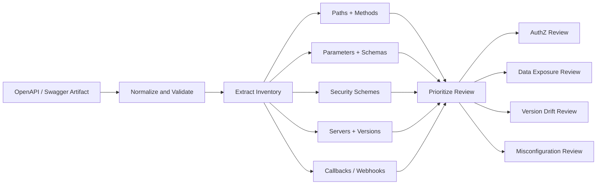
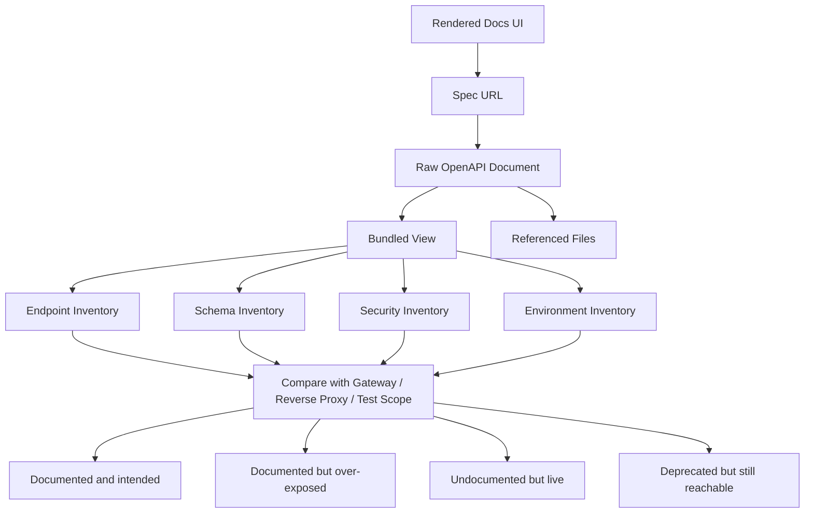
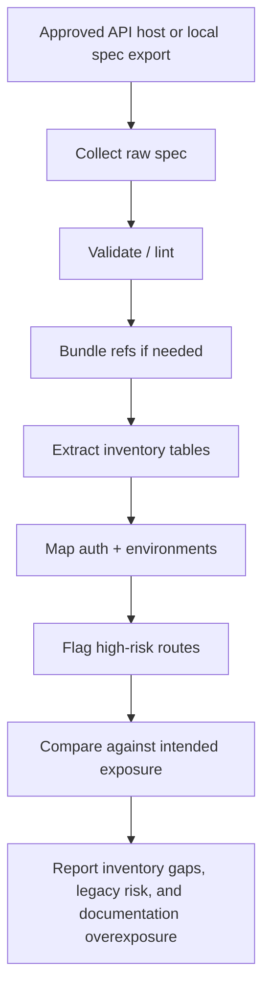

# OpenAPI Swagger Enumeration

> **An exposed OpenAPI description is not just “documentation” — it is a machine-readable map of routes, parameters, authentication assumptions, versions, and hidden business functions. In an authorized assessment, it often becomes the fastest path from vague API surface to precise inventory.**

---

## 🧠 What Is It? (Beginner Explanation)

**OpenAPI** is a standard way to describe how an HTTP API works.

It can tell you:

- which endpoints exist
- which HTTP methods they accept
- which parameters are required
- what authentication schemes are expected
- what requests and responses should look like
- which API versions, servers, callbacks, or webhooks exist

People still say **“Swagger”** a lot, but the terms are not identical:

| Term | What it really means | Practical takeaway |
|---|---|---|
| **Swagger 2.0** | Older API description format | Look for top-level `swagger: "2.0"` |
| **OpenAPI 3.x** | Newer standardized format | Look for top-level `openapi: 3.x.x` |
| **Swagger UI** | Browser UI that renders a spec | Useful sign that a spec likely exists nearby |
| **ReDoc** | Another documentation renderer for OpenAPI | Same idea: UI often points to raw spec |

If you want one sentence to remember, use this:

> **Swagger UI is the window; OpenAPI is the blueprint.**

---

## Why This Matters in Authorized API Recon

The OpenAPI Initiative describes OpenAPI as a language-agnostic interface that lets both humans and computers discover API capabilities without source code or traffic inspection. That is exactly why it matters during recon: a single spec can collapse hours of guesswork into a structured inventory.

From a defensive or authorized testing perspective, OpenAPI/Swagger enumeration helps you answer:

1. **What exists?** — paths, methods, versions, tags, callbacks, webhooks
2. **What is expected?** — parameters, schemas, content types, auth models
3. **What is risky?** — deprecated routes, admin tags, missing security, internal servers, stale versions
4. **What is drifting?** — docs that do not match the live service, or live endpoints missing from docs

OWASP API9:2023 ties this directly to **improper inventory management**: old versions, undocumented hosts, and stale documentation enlarge the attack surface and make weaknesses harder to detect and retire.

---

## 📊 Mental Model — Treat the Spec Like an Attack-Surface Database



The best mindset is not “I found docs.”

The better mindset is:

> **I found structured metadata that can be transformed into an API inventory, trust-boundary map, and review queue.**

---

## 🏗️ Anatomy of an OpenAPI Description

A high-quality recon workflow starts with knowing what the document can contain.

| Field / Area | What it tells you | Why it matters during recon |
|---|---|---|
| `openapi` or `swagger` | Spec version | Tells you whether you are reading Swagger 2.0 or OpenAPI 3.x |
| `info` | Title, version, contact, description | May reveal business context, environment, ownership, or deprecation notes |
| `servers` | Base URLs | Often exposes stage, dev, partner, internal, or legacy hosts |
| `paths` | Endpoints and operations | Your core route inventory |
| `parameters` | Query, path, header, cookie inputs | Defines expected input surface and hidden controls |
| `requestBody` | Accepted body shapes | Important for object and property-level analysis |
| `responses` | Success and error models | Shows what data can return and where verbose errors may exist |
| `components.schemas` | Shared object models | Reveals sensitive fields, hidden properties, or internal object names |
| `components.securitySchemes` | Auth mechanisms | Maps API keys, bearer auth, OAuth2, mTLS expectations |
| `security` | Global / operation auth requirements | Helps detect anonymous or weakly protected routes |
| `tags` | Functional grouping | Often exposes admin, billing, internal, partner, or beta capabilities |
| `deprecated` | Legacy operations | Strong signal for retirement and version-risk review |
| `$ref` | External or internal references | Means the full picture may span multiple files |
| `callbacks` / `webhooks` | Outbound interaction points | Expands recon beyond inbound request paths |

### Easy Way To Remember the Structure

Think in layers:

```text
OpenAPI recon = Where + What + How + Who + What returns
                servers  paths  parameters/auth  security  responses
```

---

## 🔎 What “Enumeration” Means Here

In this note, **enumeration** does **not** mean aggressive blind probing.

It means an **authorized, methodical process** of:

- locating OpenAPI/Swagger artifacts
- validating them safely
- extracting route and data models
- identifying inventory gaps and risky metadata
- comparing published docs with intended exposure

That is recon, not abuse.

---

## Common OpenAPI / Swagger Artifacts

These artifacts usually appear in one of three forms.

| Artifact Type | What it looks like | Recon value |
|---|---|---|
| **Raw spec file** | `openapi.yaml`, `openapi.json`, `swagger.json` | Best source of machine-readable inventory |
| **Rendered documentation UI** | Swagger UI, ReDoc, custom docs portal | May reveal spec URL, auth flow, examples, and hidden tags |
| **Generated service endpoint** | Framework-provided `/api-docs`, `/v3/api-docs`, etc. | Often tied directly to live code, so drift may be lower |

### A Safe Discovery Heuristic

Instead of thinking “what can I hit,” think:

1. **Which approved hosts expose documentation?**
2. **Is the UI public, internal, or partner-only?**
3. **Can I access the raw spec through approved means?**
4. **Does the raw spec include non-production hosts or internal references?**
5. **Does the documentation match the system actually intended for this environment?**

---

## 📈 Documentation Surface vs. Real API Surface



This is the core defender question:

> **Does the documentation faithfully represent the API surface that should exist in this environment?**

If the answer is no, you may be dealing with shadow APIs, stale versions, broken retirement, or overly broad publication.

---

## What To Extract First

When you obtain a spec, extract these items before anything else.

| Priority | Extract | Why it is first-order useful |
|---|---|---|
| 1 | Base URLs / `servers` | Establish scope, environments, and trust boundaries |
| 2 | Every path + method | Creates the route inventory |
| 3 | Auth requirements | Separates public routes from protected ones |
| 4 | Tags / groupings | Quickly highlights admin, internal, billing, webhook, partner areas |
| 5 | Deprecated operations | Often tied to legacy risk and version sprawl |
| 6 | Request / response schemas | Reveals object structure and potentially sensitive properties |
| 7 | Examples | May expose tokens, IDs, emails, internal hostnames, or business context |
| 8 | External refs / `$ref` | Tells you whether the visible file is incomplete |
| 9 | Callbacks / webhooks | Adds outbound and event-driven surface |
| 10 | Operation IDs | Useful for correlating docs, code, gateways, and logs |

---

## Safe Local Analysis Workflow

The safest pattern is to analyze a **local copy** of an approved spec rather than repeatedly interacting with a live target.

### 1) Validate the document

APIDevTools documents that Swagger/OpenAPI parsers can validate JSON or YAML and resolve `$ref` pointers. Validation is useful because badly formed specs produce bad inventories.

```bash
# Validate a local spec copy
npx swagger-cli validate openapi.yaml

# Or lint for quality / consistency
npx @redocly/cli lint openapi.yaml
```

### 2) Extract a path inventory

```bash
# JSON spec: list METHOD path pairs
jq -r '
  .paths
  | to_entries[]
  | .key as $path
  | .value
  | keys[]
  | "\(ascii_upcase) \($path)"
' openapi.json | sort -u
```

```bash
# YAML spec: same idea with yq
yq -r '
  .paths
  | to_entries[]
  | .key as $path
  | .value
  | keys
  | .[]
  | "\(upcase) \($path)"
' openapi.yaml | sort -u
```

### 3) Extract auth models

```bash
jq -r '.components.securitySchemes // {} | keys[]' openapi.json
jq -r '.security // []' openapi.json
```

### 4) Identify deprecated operations

```bash
jq -r '
  .paths
  | to_entries[]
  | .key as $path
  | .value
  | to_entries[]
  | select(.value.deprecated == true)
  | "\(.key | ascii_upcase) \($path)"
' openapi.json
```

### 5) Review environment exposure

```bash
jq -r '.servers[]?.url' openapi.json
```

If those URLs include `dev`, `stage`, `internal`, or partner-specific hosts, that is important inventory intelligence to verify and report.

---

## Field-by-Field Recon Questions

Use the following table as a practical checklist.

| Spec area | Ask this question | Why it matters |
|---|---|---|
| `servers` | Do published servers include non-production or internal environments? | Exposure and segmentation issues |
| `paths` | Are sensitive business functions clearly present? | Prioritizes high-impact review areas |
| `tags` | Do tag names suggest admin, support, finance, internal, or beta features? | Hidden functionality often advertises itself semantically |
| `securitySchemes` | Which auth models exist: API key, bearer, OAuth2, mTLS? | Defines trust assumptions and review paths |
| operation-level `security` | Are some routes intentionally anonymous? | Public endpoints deserve extra scrutiny |
| `parameters` | Are privilege decisions influenced by query/header values? | Good signal for authz and logic review |
| `schemas` | Do models contain `role`, `status`, `isAdmin`, `accountType`, or internal IDs? | Useful for property-level authorization thinking |
| `responses` | Are debug, stack, or implementation details documented? | Misconfiguration and information disclosure clues |
| `deprecated` | Has the organization retired this route, or only labeled it? | Version sprawl / API9 concern |
| `callbacks` / `webhooks` | Does the API call outward to consumer infrastructure? | Expands trust-boundary analysis |
| `examples` | Do example values include secrets, tokens, emails, or production-like data? | Common documentation hygiene problem |
| `$ref` | Is the file only a partial view? | You may need a bundled view to see the real surface |

---

## Swagger 2.0 vs OpenAPI 3.x — Why Recon Changes

| Topic | Swagger 2.0 | OpenAPI 3.x | Recon implication |
|---|---|---|---|
| Top-level version key | `swagger` | `openapi` | Easy first fingerprint |
| Servers | `host` + `basePath` + `schemes` | `servers` array | OAS 3 usually makes multi-environment exposure easier to spot |
| Request bodies | `parameters` with `in: body` | `requestBody` | OAS 3 is clearer for body analysis |
| Reusable content | `definitions`, `parameters`, `responses` | `components.*` | Richer shared inventory in OAS 3 |
| Callbacks / webhooks | Limited / indirect | Supported | Event-driven attack surface becomes more visible |
| Content types | `consumes` / `produces` | `content` object | Better view of multiple representations |

A quick mental shortcut:

> **Swagger 2.0 is often route-centric; OpenAPI 3.x is route + data + workflow centric.**

That makes OAS 3.x particularly useful for deeper recon.

---

## Multi-File Specs and `$ref` Blind Spots

A single `openapi.yaml` is not always the whole picture.

Many teams split specs into:

- per-domain path files
- reusable schema files
- shared parameter libraries
- external examples
- environment-specific overlays

That means a top-level file can be **incomplete until bundled or dereferenced**.

APIDevTools notes that parsers can resolve external `$ref` pointers and bundle them into a single document. That is operationally important because otherwise your endpoint list, schemas, or examples may be partial.

### Important Safety Note

APIDevTools also warns that parsers resolving `$ref` from **untrusted** documents can create local file inclusion risk if they resolve arbitrary files. Treat third-party or unknown specs as untrusted input and use tooling/configuration carefully.

---

## UI Enumeration vs Raw Spec Enumeration

Swagger UI and ReDoc are helpful, but they are not the final artifact.

| UI clue | What it often means | Better next step |
|---|---|---|
| Swagger UI is present | A raw spec URL is likely configured in the page | Obtain the actual spec file and work from that |
| ReDoc is present | Same: an OpenAPI definition exists somewhere | Capture the spec URL used by the page |
| “Try it out” is enabled | Docs may be wired to a live environment | Confirm whether this is intended and access-controlled |
| OAuth buttons are present | The docs may expose auth flow configuration | Review scopes, redirect URIs, and environment mapping |

Swagger UI’s own documentation emphasizes that it is automatically generated from an OpenAPI specification and lets consumers interact with resources without implementation logic. That is why public, unauthenticated UI exposure deserves review even when the backend itself is authenticated.

---

## High-Signal Findings OpenAPI Enumeration Often Reveals

Focus on findings that improve inventory, hardening, and review quality.

| Finding pattern | Why it matters | Typical defensive action |
|---|---|---|
| Public docs for internal-only API | Documentation exposure may disclose sensitive routes and schemas | Gate docs with auth or network controls |
| `servers` lists `dev`, `stage`, `internal`, or partner hosts | Environment leakage and trust-boundary confusion | Publish environment-specific specs or sanitize output |
| Deprecated operations remain documented and live | Inventory and retirement failure | Set deprecation deadlines and remove exposure |
| Auth scheme exists globally but is missing on sensitive operations | Potential anonymous access or documentation drift | Review route enforcement and regenerate docs |
| Tags reveal `admin`, `support`, `finance`, `internal` | Hidden functionality needs explicit authorization review | Prioritize access-control testing |
| Example payloads contain realistic secrets or personal data | Documentation hygiene issue | Replace with synthetic examples |
| Multiple versions share one docs portal | Version confusion and legacy exposure | Separate, label, and retire old versions |
| `callbacks` / webhook URLs are poorly documented | Outbound trust boundary may be weak | Validate signing, origin, and verification strategy |
| Large schema set with permissive object models | Can hint at mass assignment or property-level risk | Review allowlists and field-level authorization |

---

## From Recon to Review Prioritization

Once you have the inventory, triage it.

### Tier 1 — Review first

- admin or support operations
- money movement, billing, refund, payout, subscription flows
- user management, invitations, password reset, token issuance
- bulk operations and export endpoints
- file upload / import / webhook registration routes
- deprecated or versioned endpoints still reachable

### Tier 2 — Review next

- search and filter endpoints with complex query parameters
- reporting endpoints with rich object graphs
- integration connectors and third-party callbacks
- asynchronous jobs and status polling APIs

### Tier 3 — Still important

- simple metadata routes
- health-style endpoints if intentionally public
- docs and schema endpoints themselves

This prioritization keeps OpenAPI enumeration from becoming “just documentation reading.” It turns the document into a **test plan**.

---

## Practical Defender Workflow



If you only remember one workflow, remember this:

> **Collect → validate → bundle → extract → prioritize → compare → report.**

---

## Defensive Hardening Checklist

OWASP API9:2023 recommends documenting API hosts, versions, authentication, parameters, redirects, rate limits, and related controls, while making documentation available only to authorized users. In practice, that becomes the checklist below.

### Publication Controls

- Publish docs only to audiences that should have them
- Separate public developer docs from internal operational docs
- Disable or restrict interactive “try it out” features where inappropriate
- Avoid publishing stage, dev, or internal server URLs in production docs

### Inventory Controls

- Keep a current inventory of API hosts, versions, and owners
- Mark deprecated operations clearly and attach retirement dates
- Remove old versions instead of only documenting them as deprecated
- Track third-party integrations and webhook consumers as part of API inventory

### Spec Hygiene Controls

- Replace real secrets, emails, tenant IDs, and tokens in examples with synthetic data
- Review tags and descriptions for accidental disclosure of internal projects or admin functions
- Ensure operation-level auth requirements match real enforcement
- Bundle and lint specs in CI/CD so broken or partial docs do not ship silently

### Validation / Automation Controls

- Validate syntax before publication
- Lint for consistency and policy violations
- Compare generated docs against gateway routes or service inventory
- Use drift detection so “documented,” “deployed,” and “intended” stay aligned

---

## Tooling That Helps Defenders

These tools are helpful because they operate on the spec as structured data.

| Tool / Project | Useful for | Why it matters |
|---|---|---|
| **Swagger UI** | Human-readable interactive docs | Fast visual review of operations and auth flow |
| **ReDoc** | High-quality rendered docs | Good for large specs and schema-heavy APIs |
| **swagger-cli** | Validation | Quick syntax and structure checks |
| **Redocly CLI** | Linting, bundling, policy checks | Good for CI/CD governance |
| **APIDevTools Swagger Parser** | Parsing, resolving, dereferencing `$ref` | Essential for multi-file specs |
| **`jq` / `yq`** | Fast inventory extraction | Good for custom route/auth/report scripts |

---

## Common Mistakes During OpenAPI Recon

| Mistake | Why it hurts |
|---|---|
| Treating Swagger UI as the source of truth | The UI is only a renderer; the raw spec is richer and easier to analyze |
| Reading only the first file | Multi-file specs can hide much of the real surface behind `$ref` |
| Ignoring `servers` | Environment leakage and version sprawl are often obvious there |
| Ignoring examples | Example values frequently reveal data sensitivity and hygiene issues |
| Looking only at paths | Auth, schemas, callbacks, and deprecated flags carry equal recon value |
| Assuming docs equal reality | Documentation drift is itself a security and governance finding |
| Using untrusted parser settings on untrusted specs | `$ref` resolution can create parser-side risk |

---

## Reporting Guidance

When you write findings from OpenAPI/Swagger enumeration, prefer language like this:

- **“The API documentation published to this audience exposes internal route structure and environment metadata.”**
- **“The OpenAPI description includes non-production server URLs and deprecated operations, indicating incomplete inventory control.”**
- **“Operation-level security requirements in the published specification appear inconsistent with intended sensitivity and should be verified against enforcement.”**
- **“Documentation examples contain production-like identifiers and should be replaced with synthetic values.”**

That framing keeps the work anchored in authorization, governance, and exposure reduction.

---

## Key Takeaways

- OpenAPI is a **machine-readable inventory source**, not just developer help text.
- Swagger UI and ReDoc are **clues**; the raw spec is the main artifact.
- The most valuable fields during recon are usually **servers, paths, security, schemas, deprecated operations, examples, and refs**.
- Multi-file specs need **bundling or dereferencing** before analysis is complete.
- OWASP API9 makes clear that stale versions, unclear ownership, and bad inventory management are security problems, not just documentation problems.
- Good OpenAPI enumeration should end with a **prioritized review plan and a documentation-hardening checklist**.

---

## 📚 Sources and Further Reading

This note was informed by the following public sources:

1. **OpenAPI Initiative / OpenAPI Specification** — definition of OpenAPI as a machine-readable interface description and structure guidance  
   https://swagger.io/specification/  
   https://raw.githubusercontent.com/OAI/OpenAPI-Specification/main/README.md
2. **Swagger UI** — role of Swagger UI as an interactive renderer generated from an OpenAPI definition  
   https://swagger.io/tools/swagger-ui/  
   https://raw.githubusercontent.com/swagger-api/swagger-ui/master/README.md
3. **OWASP API Security Top 10 2023 — API9: Improper Inventory Management** — why stale docs, old versions, and unclear API inventory create real security risk  
   https://raw.githubusercontent.com/OWASP/API-Security/refs/heads/master/editions/2023/en/0xa9-improper-inventory-management.md
4. **OWASP REST Security Cheat Sheet** — guidance on HTTPS, access control, API keys, and method restrictions that help interpret documented security models  
   https://raw.githubusercontent.com/OWASP/CheatSheetSeries/master/cheatsheets/REST_Security_Cheat_Sheet.md
5. **APIDevTools Swagger Parser** — validation, `$ref` resolution, bundling/dereferencing concepts, and parser safety note  
   https://raw.githubusercontent.com/APIDevTools/swagger-parser/master/README.md
6. **ReDoc / Redocly** — how OpenAPI documents are rendered and organized for human analysis  
   https://raw.githubusercontent.com/Redocly/redoc/main/README.md

---

## One Last Thing To Remember

If you are doing authorized API recon and you find OpenAPI or Swagger docs, do not stop at “nice, docs exist.”

Ask:

- **What surface does this describe?**
- **What trust boundary does it reveal?**
- **What version or environment drift does it expose?**
- **What should not be visible to this audience?**

That is the difference between reading documentation and performing real OpenAPI enumeration.
