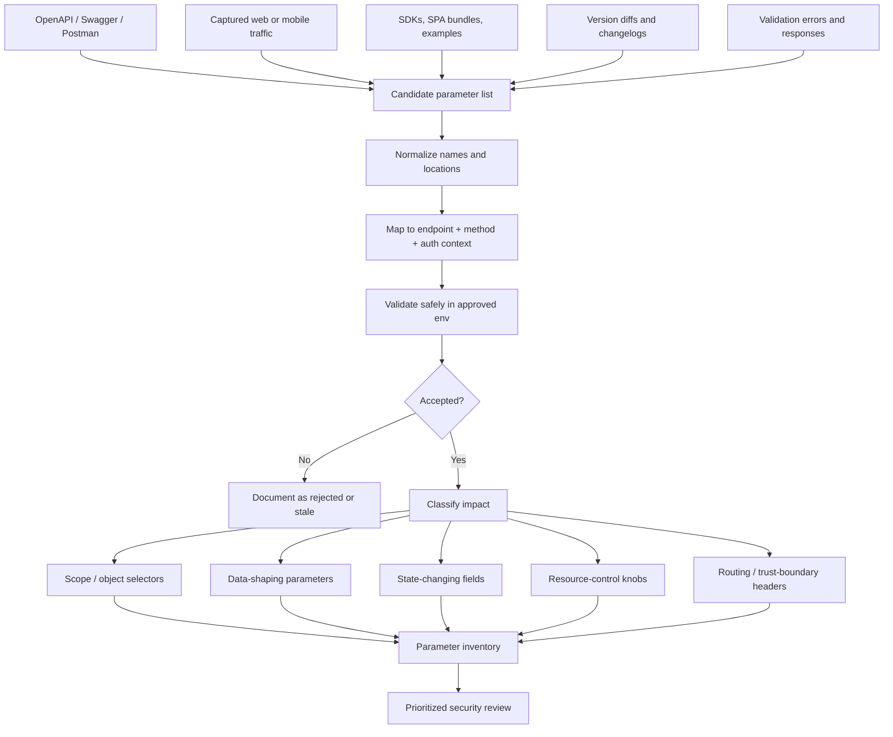
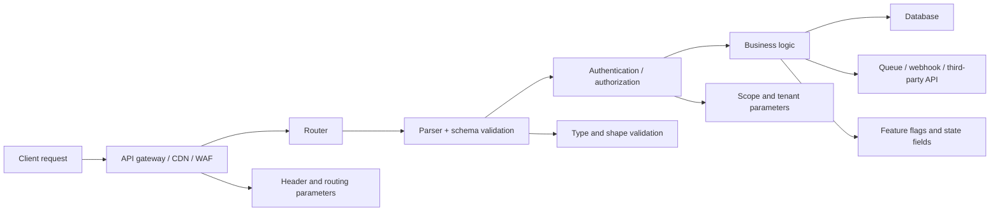

# Parameter Discovery

> **Parameter discovery is the process of finding every input an API can parse, trust, reject, route on, or forward — across path templates, query strings, headers, cookies, request bodies, multipart parts, and schema-driven inputs such as GraphQL variables.**

Parameter discovery sits in the middle of API reconnaissance. If endpoint discovery tells you **where** the API lives, parameter discovery tells you **how** the API is controlled. That matters because most meaningful API findings — object-level authorization flaws, mass assignment, excessive data exposure, resource exhaustion, and misconfiguration — depend on parameters that influence behavior.

This note is written for **authorized, defensive API testing only**. Focus on documentation, captured traffic, local schema analysis, and low-noise validation in approved environments. Do not treat parameter discovery as blind fuzzing; treat it as **inventory building**.

---

## Table of Contents

1. [Why Parameter Discovery Matters](#why-parameter-discovery-matters)
2. [A Mental Model That Sticks](#a-mental-model-that-sticks)
3. [Why Hidden Parameters Exist](#why-hidden-parameters-exist)
4. [Parameter Taxonomy for APIs](#parameter-taxonomy-for-apis)
5. [Diagram — The Discovery Funnel](#diagram--the-discovery-funnel)
6. [Start with the API Spec](#start-with-the-api-spec)
7. [Expand Beyond the Spec](#expand-beyond-the-spec)
8. [Safe Validation Without Excessive Noise](#safe-validation-without-excessive-noise)
9. [High-Value Parameter Families](#high-value-parameter-families)
10. [Mapping Parameters to the Stack](#mapping-parameters-to-the-stack)
11. [Building a Parameter Inventory](#building-a-parameter-inventory)
12. [Common False Positives](#common-false-positives)
13. [Tooling for Authorized Discovery](#tooling-for-authorized-discovery)
14. [Defensive Checklist](#defensive-checklist)
15. [Remediation and Engineering Controls](#remediation-and-engineering-controls)
16. [References and Further Reading](#references-and-further-reading)

---

## Why Parameter Discovery Matters

An API is not defined only by its endpoints. It is defined by the **inputs each endpoint will honor**.

A single route such as `GET /v1/projects/{projectId}` might be influenced by:

- a **path parameter** like `projectId`
- a **query parameter** like `fields=id,name`
- a **header** like `X-Tenant-ID`
- a **cookie** like `preview=true`
- a **body field** like `includeArchived`
- a **gateway-only parameter** such as a tracing or routing header

That means a security team that only inventories routes has mapped the doors, but not the **switches behind the doors**.

### What parameter discovery unlocks

| Security Goal | Why Parameters Matter |
|---|---|
| **Truthful attack surface mapping** | APIs often expose more inputs than the UI or docs show |
| **Authorization review** | IDs, tenant selectors, filters, and field selectors often control data scope |
| **Mass assignment testing** | Hidden body fields frequently reveal writable properties the client never displays |
| **Inventory management** | Deprecated versions and undocumented parameters are classic signs of drift |
| **Safe engineering fixes** | You cannot allowlist, validate, log, or deprecate what you have not catalogued |

---

## A Mental Model That Sticks

Think of an API parameter as a **control surface**.

- Some controls are clearly labeled in the UI or docs.
- Some are visible only in traffic or mobile apps.
- Some are defined in the schema but rarely used.
- Some are accepted by middleware, not the app.
- Some are ignored.
- Some are dangerous because they change **scope**, **privilege**, **data shape**, **resource consumption**, or **downstream calls**.

A good recon workflow moves each candidate parameter through five states:

| State | Question | Example Outcome |
|---|---|---|
| **Documented** | Is it named in the OpenAPI spec, docs, SDK, or examples? | `limit`, `cursor`, `sort` |
| **Observed** | Have you actually seen it in real traffic, logs, or client code? | `X-Tenant-ID` appears in mobile traffic |
| **Inferred** | Can you reasonably predict related names from patterns? | `fields`, `include`, `expand` family |
| **Accepted** | Does the API parse or validate it? | `400` with schema error proves parsing |
| **Security-relevant** | Does it influence data, authz, behavior, cost, or integrations? | `role`, `status`, `callback_url`, `tenantId` |

> **Easy rule to remember:** a parameter is most interesting when it changes **who**, **what**, **how much**, **how fast**, or **where** the API acts.

---

## Why Hidden Parameters Exist

Hidden or undocumented parameters usually come from normal engineering drift rather than magic.

| Cause | What It Looks Like | Why Security Cares |
|---|---|---|
| **Version drift** | `v1` accepts `debug`; `v3` does not document it | Old behavior may still work in production |
| **Framework defaults** | Paging, sorting, filtering, `_method`, `_format` | Framework features become external inputs |
| **Feature flags** | `preview`, `beta`, `experiment`, `rollout` | Hidden paths and pre-release behavior |
| **Mass assignment** | Extra JSON fields are silently accepted | Sensitive model properties become writable |
| **Gateway behavior** | `X-Forwarded-*`, `X-Tenant-*`, trace headers | Edge components may route or trust headers |
| **Client-specific fields** | Mobile app sends keys the browser never uses | Different clients expose different control planes |
| **Deprecated docs** | Postman collection shows old names | Zombie behavior remains reachable |
| **Third-party integrations** | Callback URLs, webhook secrets, import/export flags | Trust-boundary mistakes and SSRF exposure |

OWASP API Security Top 10 (2023) treats poor API inventory and version management as a first-class problem for exactly this reason: undocumented inputs often signal undocumented behavior.

---

## Parameter Taxonomy for APIs

OpenAPI 3.1 is a useful mental anchor here: it models **path**, **query**, **header**, and **cookie** as parameter locations, while request bodies are modeled separately under `requestBody`.

| Input Type | Typical Examples | Where It Often Appears | Why It Matters |
|---|---|---|---|
| **Path parameters** | `userId`, `tenantId`, `orderId` | `/users/{userId}` | Usually object selectors; often authz-sensitive |
| **Query parameters** | `limit`, `sort`, `fields`, `include`, `expand` | `?limit=50&fields=id,name` | Shape responses, control scope, or alter processing |
| **Header parameters** | `X-Tenant-ID`, `X-API-Version`, `Prefer`, `Idempotency-Key` | Request headers | May be consumed by gateways, caches, or business logic |
| **Cookie parameters** | `locale`, `preview`, `remember_device` | Browser-based API sessions | Often overlooked during API reviews |
| **JSON body fields** | `role`, `status`, `isAdmin`, `metadata.*` | `application/json` bodies | Highest-value area for mass assignment and logic flaws |
| **Form or multipart fields** | `metadata`, `visibility`, `folderId` | Upload or legacy forms | Important in import/export and file flows |
| **GraphQL variables / input fields** | `variables`, `filter`, nested input objects | GraphQL POST body | Schema-rich and highly expressive |
| **Webhook / callback fields** | `callbackUrl`, `target`, `endpoint` | Event subscriptions | Can influence outbound requests or trust boundaries |

---

## Diagram — The Discovery Funnel



---

## Start with the API Spec

If an API specification exists, it should be your **first source of truth**, not an afterthought.

The internal HackerNotes API blueprint for recon emphasizes using docs, captured traffic, and OpenAPI/Swagger definitions to build a parameter map. That is exactly the right order: begin with the schema, then verify reality.

### What to extract from an OpenAPI spec

| OpenAPI Location | What to Pull Out | Why It Helps |
|---|---|---|
| `paths.*.*.parameters` | Path/query/header/cookie parameters | The obvious starting inventory |
| `components.parameters` | Reusable shared parameters | Often hides auth, tenant, pagination, or preview controls |
| `requestBody.content.*.schema` | Writable fields and nested properties | Essential for body-field discovery and mass assignment review |
| `examples` / `example` | Realistic field names and optional flags | Shows what clients actually send |
| `deprecated`, `description`, `summary` | Legacy names, preview flags, migration notes | Helps find shadow behavior |
| `callbacks` / webhook schemas | Outbound URL and event fields | Important trust-boundary inputs |
| `securitySchemes` + operation security | Required auth context | Tells you whether a parameter is user input or auth material |
| `allOf` / `anyOf` / `oneOf` / discriminators | Alternate object shapes | Prevents missing conditional fields |

### Safe local parsing workflow

Use a **downloaded, approved spec file** and extract parameters offline before you send any validation traffic.

```bash
# List documented path/query/header/cookie parameters from a local OpenAPI file
jq -r '
  .paths
  | to_entries[]
  | .key as $path
  | .value
  | to_entries[]
  | select(.key | test("^(get|put|post|delete|patch|options|head)$"))
  | .key as $method
  | (.value.parameters // [])[]
  | [$method, $path, .in, .name, (.required // false)]
  | @tsv
' openapi.json
```

```bash
# Recursively list request-body properties from a local OpenAPI file
python3 - <<'PY'
import json
from pathlib import Path

spec = json.loads(Path('openapi.json').read_text())


def walk(schema, prefix=''):
    if not isinstance(schema, dict):
        return
    if '$ref' in schema:
        print(f"{prefix or '<root>'}\tREF\t{schema['$ref']}")
        return
    for name, child in (schema.get('properties') or {}).items():
        new_prefix = f"{prefix}.{name}" if prefix else name
        print(f"{new_prefix}\t{child.get('type', 'unknown')}")
        walk(child, new_prefix)

for path, item in spec.get('paths', {}).items():
    for method, operation in item.items():
        if method.lower() not in {'get','post','put','patch','delete','options','head'}:
            continue
        body = (operation.get('requestBody') or {}).get('content', {})
        for content_type, details in body.items():
            print(f"\n# {method.upper()} {path} [{content_type}]")
            walk(details.get('schema', {}))
PY
```

### Version diffs are parameter gold

A spec tells you what the API *should* accept today. A **diff** between approved versions often tells you what the platform may still accept in practice.

| Diff Type | What It Can Reveal |
|---|---|
| **Removed query field** | Old behavior still present on legacy route |
| **Added request body property** | New feature flag or business-control field |
| **Header renamed** | Gateway migration left old and new names active |
| **Deprecated endpoint** | Hidden compatibility surface still deployed |
| **Schema relaxed** | Validation gaps that permit extra values |

---

## Expand Beyond the Spec

The spec is the seed inventory, not the complete inventory.

### Provenance hierarchy for candidate parameters

| Source | What It Reveals | Trust Level |
|---|---|---|
| **OpenAPI / Swagger / Redoc** | Documented parameter names and schemas | High for intended design |
| **Captured browser traffic** | Real parameters used by the web client | High for production reality |
| **Mobile app traffic** | Client-specific flags and headers | High; mobile often exposes extra fields |
| **SDKs / typed clients** | Stable parameter naming and optional fields | Good for hints and naming families |
| **Postman collections / examples** | Legacy or partner-facing inputs | Medium–High |
| **Frontend bundles / source maps** | Hidden sort/filter/include names | Medium |
| **Validation errors** | Field names the parser recognizes | Medium; careful with false positives |
| **Release notes / changelogs** | Renamed, deprecated, or preview parameters | Medium |

### Good questions to ask during recon

- Which inputs exist in the **spec** but never appear in live traffic?
- Which inputs appear in **live traffic** but do not exist in the spec?
- Which names appear in **one client only**?
- Which parameters exist in **older versions**, beta paths, or internal subdomains?
- Which parameters are consumed by the **gateway** versus the application?
- Which body fields are present in **responses** but absent from documented writable schemas?

### Naming patterns worth grouping

Parameter discovery becomes easier when you think in **families**, not isolated strings.

| Family | Common Members |
|---|---|
| **Pagination** | `limit`, `offset`, `page`, `cursor`, `after`, `before` |
| **Projection** | `fields`, `select`, `include`, `expand`, `embed` |
| **Search / filtering** | `q`, `query`, `filter`, `sort`, `order`, `direction` |
| **Versioning / preview** | `version`, `api-version`, `preview`, `beta`, `experiment` |
| **Tenant / scope** | `tenantId`, `accountId`, `orgId`, `workspaceId` |
| **State / role** | `role`, `status`, `verified`, `enabled`, `approved` |
| **Execution control** | `async`, `dryRun`, `force`, `mode`, `priority` |
| **Callback / integration** | `url`, `callbackUrl`, `webhook`, `target`, `destination` |

---

## Safe Validation Without Excessive Noise

Authorized parameter discovery should be **low-noise, hypothesis-driven, and reversible**.

### The goal is classification, not chaos

For each candidate parameter, determine whether it is:

- **ignored**
- **parsed but rejected**
- **accepted and used**
- **accepted and forwarded**
- **accepted only in specific auth or version contexts**

### Signals to watch

| Signal | Likely Meaning | Safe Interpretation |
|---|---|---|
| **Status changes** (`200` → `400` / `422`) | Parser recognizes the parameter | Good evidence of validation logic |
| **Schema error mentions the field name** | Field is known to the validator | Strong signal the name is real |
| **Body shape changes** | Parameter affects projection, filtering, or expansion | Often confirms data-shaping behavior |
| **Response headers change** | Cache, gateway, or negotiation layer consumed it | May not reach application logic |
| **No visible change** | Ignored, masked, or auth-gated | Not automatically a dead end |
| **Different behavior across versions** | Drift or compatibility path | Important inventory finding |

### Low-risk comparison example

```bash
# Compare a baseline request with a candidate parameter in a test environment
curl -sS 'https://api.example.internal/v1/projects?limit=10' \
  -H 'Authorization: Bearer TEST_TOKEN' > baseline.json

curl -sS 'https://api.example.internal/v1/projects?limit=10&fields=id,name' \
  -H 'Authorization: Bearer TEST_TOKEN' > candidate.json

diff -u baseline.json candidate.json
```

This kind of validation is appropriate when:

- you are in a **test tenant or approved scope**
- the request is **read-only**
- the candidate value is **non-destructive**
- rate limits and change-management rules are respected

> Prefer **one precise validation request** over large, noisy guessing campaigns.

---

## High-Value Parameter Families

Not all parameters deserve equal attention. Some families repeatedly correlate with meaningful API findings.

| Family | Typical Names | Why It Matters | Common Risk Themes |
|---|---|---|---|
| **Object selectors** | `id`, `userId`, `projectId`, `tenantId` | Defines which record is touched | Object-level authorization |
| **Property selectors** | `fields`, `include`, `expand`, `embed` | Changes which fields are returned | Excessive data exposure, property-level authz |
| **State modifiers** | `role`, `status`, `enabled`, `approved`, `isAdmin` | Changes privileged properties | Mass assignment, function abuse |
| **Execution toggles** | `force`, `dryRun`, `async`, `mode` | Alters server-side control flow | Business logic and workflow bypass |
| **Resource controls** | `limit`, `size`, `pageSize`, `depth` | Alters workload and response size | Resource consumption and DoS risk |
| **Format / debug controls** | `format`, `verbose`, `debug`, `trace` | Changes output or internal detail | Misconfiguration, info disclosure |
| **Routing / scope headers** | `X-Tenant-ID`, `X-Org-ID`, `X-API-Version` | Can influence routing or trust boundary | Multi-tenant isolation issues |
| **Callback targets** | `url`, `callbackUrl`, `webhookUrl` | Controls outbound requests | SSRF and trust-boundary review |

A useful way to remember this is:

- **Who** is the object selector.
- **What** is the field or state selector.
- **How much** is the resource-control knob.
- **How** is the workflow toggle.
- **Where** is the routing or callback target.

---

## Mapping Parameters to the Stack

A parameter can be accepted by different layers for different reasons. That is why discovery should not stop at "the response changed."



### Why this matters

| Layer | Typical Parameters | Example Question |
|---|---|---|
| **Gateway / edge** | version headers, routing headers, cache hints | Is this input consumed before the app sees it? |
| **Router** | path templates, method overrides | Does it change endpoint selection? |
| **Validator** | content type, schema fields, enum values | Is the field recognized and typed? |
| **Authorization** | tenant IDs, object IDs, role context | Does it alter scope or policy? |
| **Business logic** | state fields, mode flags, callback URLs | Does it change outcomes or downstream actions? |
| **Persistence** | writable model fields | Does it reach storage even if it is not documented? |

---

## Building a Parameter Inventory

Do not keep parameter discovery in loose notes. Build a structured inventory.

### Minimum fields to track

| Field | Meaning |
|---|---|
| `endpoint` | Method + route |
| `location` | path / query / header / cookie / body / multipart / graphql |
| `name` | Parameter name |
| `source` | spec / traffic / SDK / client code / error / version diff |
| `documented` | yes / no |
| `required` | yes / no / unknown |
| `accepted` | yes / no / unknown |
| `security_relevance` | low / medium / high |
| `notes` | Why it matters, where seen, follow-up |

### Example parameter worksheet

| Endpoint | Location | Name | Source | Documented | Security Relevance | Notes |
|---|---|---|---|---|---|---|
| `GET /v1/projects/{projectId}` | path | `projectId` | spec | yes | high | Object selector; authz-sensitive |
| `GET /v1/projects/{projectId}` | query | `fields` | traffic | no | medium | Response projection; compare field exposure by role |
| `POST /v1/projects` | body | `visibility` | spec | yes | medium | Business logic and sharing semantics |
| `POST /v1/projects` | body | `ownerId` | old Postman collection | no | high | Drift candidate; review for writable ownership |
| `GET /v1/projects` | header | `X-Tenant-ID` | mobile traffic | no | high | Multi-tenant scope hint |

### Good inventory outcomes

A mature parameter map lets you answer:

- Which endpoints accept **undocumented** inputs?
- Which inputs affect **scope**?
- Which inputs affect **returned fields**?
- Which body properties are **writable but not documented**?
- Which inputs exist only in **legacy versions** or **one client type**?

---

## Common False Positives

Not every reflected or tolerated name is meaningful.

| False Positive | What Happens | How to Avoid Misreading It |
|---|---|---|
| **Echoed but unused input** | Response mirrors a parameter without acting on it | Check for real behavioral change, not just reflection |
| **Generic validator suggestions** | Error text lists field names from a shared schema | Confirm the field on the target operation |
| **Gateway-only header** | Edge changes response but app never sees it | Compare upstream behavior and app logs if available |
| **Client-side-only field** | Frontend stores a value locally but server ignores it | Validate with direct requests, not UI assumptions alone |
| **Suppressed errors** | API swallows unknown fields silently | Use schema diffs and body/headers, not status alone |
| **Version mismatch** | Field exists only on one environment or route family | Record endpoint + version + auth context carefully |

---

## Tooling for Authorized Discovery

Use tools to support inventory, not replace reasoning.

| Job | Useful Tools | Safe Use Case |
|---|---|---|
| **Spec parsing** | `jq`, `yq`, Python, `openapi-diff` | Extract and diff documented parameters offline |
| **Traffic-to-spec rebuilding** | `mitmproxy2swagger` | Reconstruct schemas from approved internal captures |
| **Schema-driven validation** | `schemathesis` | Check documented vs observed behavior in test environments |
| **Manual review** | Burp Suite, OWASP ZAP, browser DevTools | Inspect traffic, compare responses, annotate findings |
| **Client artifact review** | mobile proxies, JS/source-map analysis | Find parameters hidden from the visible UI |
| **Targeted candidate validation** | Arjun, x8, custom scripts | Use only on owned or explicitly authorized environments |

### Tooling rule of thumb

1. **Spec first**
2. **Traffic second**
3. **Client artifacts third**
4. **Targeted validation last**

If you invert that order, you usually create noise before understanding the system.

---

## Defensive Checklist

Use this checklist during authorized API recon:

- [ ] Obtain the latest **OpenAPI / Swagger / Postman / SDK** artifacts
- [ ] Extract all documented **path, query, header, cookie, and body** inputs
- [ ] Diff current and previous specs for **removed, renamed, and deprecated** parameters
- [ ] Capture traffic from **web and mobile** clients, not just one interface
- [ ] Group parameters into families: **scope, projection, state, execution, resource, routing**
- [ ] Record whether each parameter is **documented, observed, inferred, accepted**
- [ ] Validate candidates with **low-noise, read-only** requests where possible
- [ ] Note which parameters are consumed by the **gateway** versus application logic
- [ ] Prioritize parameters that influence **object scope, returned fields, writable state, or outbound calls**
- [ ] Feed confirmed findings into the wider **attack surface map** and authorization matrix

---

## Remediation and Engineering Controls

Parameter discovery is just as useful for defenders as testers.

### If your team finds undocumented parameters

| Control | Why It Helps |
|---|---|
| **Make the spec the source of truth** | Reduces drift between code, docs, and clients |
| **Reject unknown fields by default** | Prevents silent mass assignment and parser ambiguity |
| **Validate each input location separately** | Query, header, cookie, and body controls have different trust assumptions |
| **Deprecate aggressively and remove old versions** | Shrinks zombie behavior and undocumented compatibility paths |
| **Allowlist routing and tenant headers** | Prevents accidental trust in user-supplied scope data |
| **Log rejected and deprecated parameter names** | Great signal for attack attempts and client drift |
| **Review response-shaping parameters** | `fields`, `include`, and `expand` frequently change exposure |
| **Diff observed traffic against the spec in CI** | Detects undocumented behavior before release |

### Strong defensive patterns

- Put **schema validation before business logic**.
- Separate **external API fields** from **internal model fields**.
- Treat **tenant, object, and role selectors** as authorization-sensitive inputs.
- Review **callback URLs and destination fields** as trust-boundary controls.
- Document every accepted parameter, not just the ones the UI happens to use.

---

## References and Further Reading

Public sources used to shape this note:

1. **OWASP API Security Top 10 (2023)** — especially the emphasis on inventory management, documentation, and deprecated API versions.
2. **OWASP REST Security Cheat Sheet** — input validation, request content-type validation, and audit logging guidance.
3. **OpenAPI Specification 3.1** — parameter locations (`path`, `query`, `header`, `cookie`) and request-body modeling.
4. **PortSwigger Web Security Academy — API Testing** — API recon, hidden parameters, and mass assignment as part of API methodology.

---

## Final Takeaway

If you remember one thing, remember this:

> **Endpoints show you where an API exists. Parameters show you what power the caller actually has.**

A mature API recon process does not stop at route discovery. It builds a **parameter inventory** from the spec, real traffic, client artifacts, and version drift — then validates that inventory safely and uses it to drive authorization review, schema review, and attack-surface mapping.
